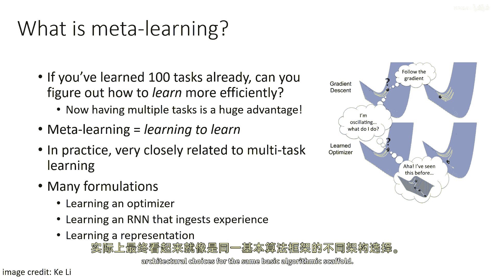
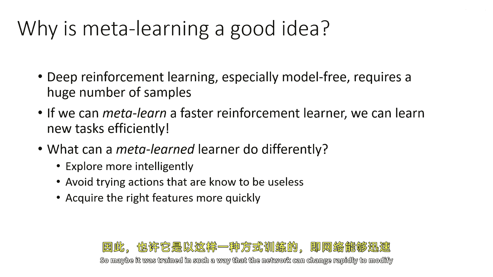
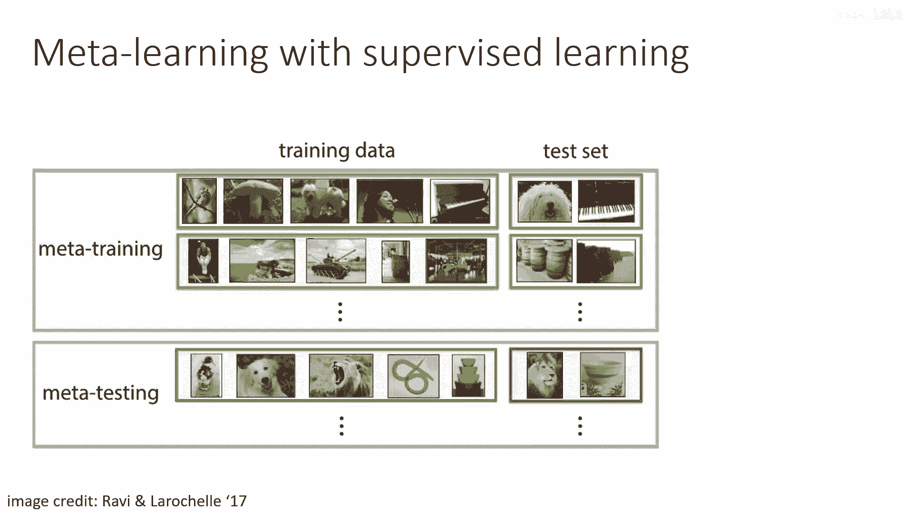
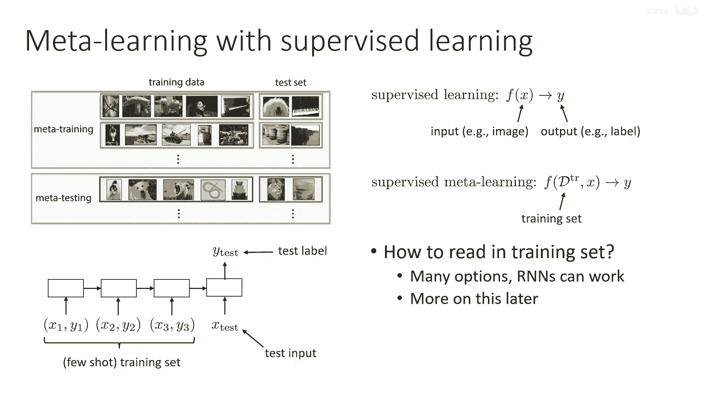
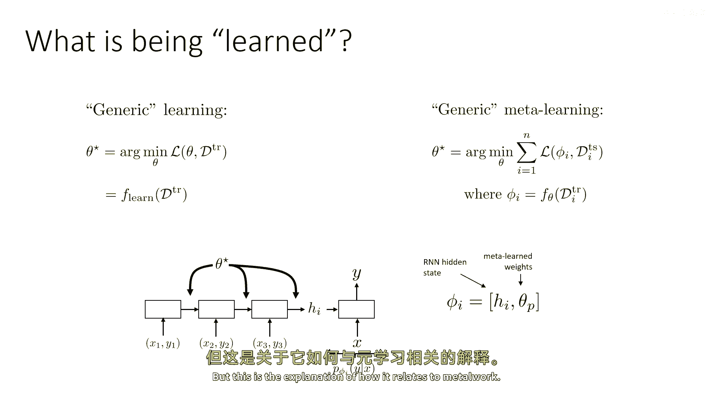

# 【深度强化学习 CS285 2023】伯克利—中英字幕 - P92：p92 CS 285： Lecture 22, Part 2： Transfer Learning & Meta-Learning - 加加zero - BV1NjH4eYEyZ

在下一节的讲座中，我们将讨论元学习算法，元学习是多任务学习的一种逻辑扩展，而不是简单地学习如何解决各种任务，我们将使用许多不同的任务来学习如何更快地学习新任务，所以我首先会给一个关于元学习的一般介绍。

以一种更传统的方式，在有监督学习的设置中，然后我将讨论这些想法如何在rl中实现，那么什么是元学习，如果你已经学习了一百个任务，你能够更有效地学习新任务吗，在这种情况下。

有多个任务的情况成为一个巨大的优势，因为嗯，如果你能从多个任务中概括学习过程本身，那么你可以极大地加速对新任务的获取，所以元学习本质上等于学习如何学习，在实际应用中，它非常密切地与多任务学习有关。

它有许多不同的形式，尽管这些形式可以总结在同一个伞下，所以，许多不同的形式化可能涉及到学习优化器，一种在RNN中的学习，它读取大量的经验，然后解决一个新任务，甚至只是学习一种方式，使它能够良好。

对新任务调整得更快，这些可能看起来像是非常，非常不同的事情，这是来自ali博客帖子的卡通，它展示了学习优化器的想法，尽管它们看起来像是非常不同的事情，它们实际上可以在同一框架中实例化。

而且解决金属学习问题的许多不同技术，一旦你深入研究细节，实际上看起来都像只是不同的建筑设计选择，对于相同的基本算法框架。

好的，所以为什么 uh，元学习是个好主意，深度强化学习，尤其是模型自由学习，需要巨大的样本数量，所以如果你能学习到一个更快的强化学习者，那么你就可以高效地学习新的任务，所以金属学习者可能会做些什么不同。

嗯，嗯，一种元学习强化学习方法可能会更智能地探索，因为解决那些先前任务的某些东西告诉它如何结构化其探索，为了快速获取新任务，它可能避免尝试它知道是无用的 action。

所以可能它不知道如何精确地解决新的任务，"但它知道，一些行为永远都不应该去做"，它也可能更快地获得所需的特性，所以可能它被训练成这样，网络可以快速改变。

嗯，"为适应新的任务，修改其特征表示"，"让我为您描述一个设置金属学习以解决监督学习问题的非常基本的食谱。"，"而且我觉得这个食谱会解开很多关于 uh 的谜团。"，"围绕元学习的疑问号"。

"这是罗比和拉罗歇尔在论文中的一幅图片。"，来自二零一七年，并解释，解释了金属学习如何用于图像识别的工作方式，我意识到图像识别与强化学习有很大的不同，但我们将看到。

实际上相似的原则也将在强化学习中起作用，所以在常规监督学习中，你将有一个训练集和一个测试集在元学习中，我们将有一个实际的训练集集和一个测试集集，元训练指的是我们将用于元学习过程的数据集集。

元测试指的是当我们得到新任务时将看到的情况，所以元训练基本上就是源域，元测试的目标领域是特定领域，在元训练期间，每个训练集包含一些图像类别，并且测试集包含那些类别的测试图像，所以，在这个例子中。

让我们假设在每个任务中我们有五个类别，但是，这些类别意味着不同的事情，所以，对于第一个任务类别零，它是鸟，类别一是蘑菇，类别二是狗，类别三是人，第四类是钢琴，然后在测试集中有一个狗和一个钢琴。

然后在第二个任务中，第零类是体操运动员，任务第一类是风景，嗯，第二类是坦克，第三类是炮筒，等等，这些任务，嗯，可以手动完成，或者他们可以被随机化和任意化，在这种情况下这是随机的。

而且想法是你将查看那些不同的训练集，然后你将使用他们的相应测试集进行元训练，某种模型，我们将能够然后接受一个新的训练集，但对于你以前从未见过的新类别，然后在其相应测试集上做得好。

所以嗯，这就是我们可以如何看待这种常规监督学习的，接受输入x并产生预测y，所以输入x可能包括，例如，一张图片，而输出y可能包括一个标签，监督式金属学习可以被视为只是一个函数，它接受整个训练集。

D_train，以及一个测试图像x，并产生那个测试图像y的标签，所以实际上并没有太大不同，一种能够读取训练集和测试图像的功能，并对测试图像做出预测的功能，当然，如果你想要实例化这个，你需要解决几个问题。

例如，如何读取训练集，对于这个问题有很多选择，像循环神经网络或变压器这样的东西在这个问题上工作得很好，所以你可以想象一个循环神经网络，它读取x1 y1 x2 y2，x3 y3，X乘以三，Y乘以三。

训练图像标签元组的是哪些，然后读取测试图像X_test，然后预测测试标签Y_test，所以你有这个小的几枪训练集，一个测试输入和一个测试标签，我们稍后会详细讨论这一点。

但首先让我们谈谈正在学习的是什么，所以如果你在学习学习，然后你拿那个，然后在你的目标领域部署它，学习是什么，金属学习就是训练这个什么，学习部分是什么，好吧，让我们试着理解这个。

让我们想象一个通用的学习示意图，通用学习，你有一些参数theta，并且你将找到在训练集上最小化某些损失函数的theta，让我们称这个过程为f learn，所以f learn接受一个训练集。

并输出你模型参数政策的论据，通用金属学习可以被视为，找到对于某些参数phi的损失在测试集上论据的论据，这些参数phi是你训练集的函数，好的，所以你有一些函数f theta，它现在是一个学习的函数。

它不再是一个固定的学习算法，F theta接受一个训练集，并产生一些参数phi，并且那些参数phi是你需要了解的所有事情，关于在测试集上做得好的训练集，你进行金属学习的方式是训练f theta。

所以这实际上是一种二次的东西，你将训练f theta，它读取d train，以便于f theta的输出在测试上工作良好，所以f theta然后成为学习过程，那么对于RNN的例子，f theta是什么。

f theta是RNN的一部分，它读取训练集，所以你可以认为f theta的参数，这个theta star作为这个RNN的参数，并且它将产生某种类型的隐藏激活，所以当它读取到这个训练集时。

它具有某些隐藏的激活，H_i对于任务i，然后，这个隐藏的激活被传递给一个小的分类器，该分类器接受隐藏的激活，并输入测试图像x并产生y，所以，这个小部分在最后，那就是你的嗯，分类器和其参数phi仅仅是h。

隐藏激活和其自己参数theta_p的组合，所以它有自己的参数，但是，它是一个小的神经网络，所以那是theta p，它接受RNN编码器的隐藏激活，那就是h i，所以那就是fi，对于这个RNN元学习者。

phi i是什么，现在，你可以设计其他种类的元学习者，他们可能会有不同的概念的phi，但这是参数中最简单的一种，你引用的那种，未引用，学习新任务仅仅是RNN的隐藏状态和顶部参数的隐藏状态，嗯，所以。

基于数量的过程来学习新任务是，只是运行RNN向前并获取隐藏状态，所以，精确地回顾一下这个工作原理和趋势是如何的，我们有一个RNN，它读取一系列图像及其标签，它产生一个隐藏状态。

这个隐藏状态传递给一个小的神经网络，这个神经网络接受测试图像并产生其标签，元训练过程训练所有这些网络的参数，它训练RNN编码器的参数，并且它训练那个位于末尾的小东西参数，当你去目标任务时。

我们称之为元测试时间，你会得到一个目标任务的训练集，这个训练集然后使用那个RNN编码器编码，这产生一个新的h i，这个新的h i然后与位于末尾的小分类器的参数拼接，这个分类器不适应新的任务。

那就是phi i，然后，你的预测仅依赖于phi i，所以，实际上这是一种非常复杂的方式来解释一个非常简单的事情，那就是在实际应用中，你只需要运行RNN向前传播，就可以得到答案。

