# 【深度强化学习 CS285 2023】伯克利—中英字幕 - P96：p96 CS 285： Lecture 23, Part 1： Challenges & Open Problems - 加加zero - BV1NjH4eYEyZ

好的，欢迎参加今天的cs two eighty五最终讲座，我们将讨论挑战和开放问题，所以首先让我们简要回顾一下我们在课程中覆盖的材料，我们覆盖了许多东西，使用了许多不同的方法，所以我将尝试绘制一张地图。

以尝试说明不同的原则，以及它们如何相互关联，所以归根结底，我们有基于学习的控制，所以基本上我们的目标是覆盖基于学习的控制方法，广泛解释，基于学习的控制方法包括模仿学习方法，这些方法是从演示中学习的。

监督学习和强化学习方法，这些方法是从奖励中学习的，强化学习方法包括经典的无模型强化学习算法，如策略梯度，基于价值的方法，基于价值和策略梯度的结合结果在演员批评方法中，我们以深度Q学习为例。

作为特定基于价值的方法的一个例子，如SAC和TRPO等Q函数演员批评方法，以及PPO等高级策略梯度方法，还有基于模型的控制，基于模型的控制不一定是基于学习的，"所以，像我们之前讨论的规划与控制方法。

如lqr"。"它们并不一定与学习有关"，"但是，他们可以与学习相结合，产生基于模型的强化学习方法。"，"并且在他们最纯净的时候"，"对于不使用简单训练模型的基于模型的强化学习方法"。

"然后通过那个模型进行规划"，"不要在模型无约束部分实际使用我们所讨论的所有RL概念"，"但是我们可以"，当然，"将它们组合起来，并使用学习模型与强化学习算法相结合"，类似于政策梯度或基于价值的方法。

以获取更有效的基于模型的强化学习算法，然后，还有其他一些概念，大致上适用于整个范围，不同的强化学习方法，这些概念大致上与算法的特定选择垂直，例如，探索策略的选择，无监督强化学习目标的使用，如技能发现等。

还有其他工具，它们不在基于学习的控制框架之外，但是非常有用，例如，概率推断和变分推断的工具，这些工具给了我们关于强化学习的控制推断视角，再加上模仿学习，使我们能够推导出如逆强化学习方法等东西。

但这并不完全覆盖我们讨论的所有内容，我们还讨论了像序列模型等东西，泵dps，等，但这应该能给你关于这门课程特定部分的大致概述，但我今天想谈论的，深度强化学习方法的一些挑战是什么。

基本上就是我们还没有解决的问题，然后也有一些关于如何使用深度强化学习的视角，让我们从挑战开始吧，你们中的一些人可能已经熟悉，从完成这门课程的作业并经历，例如，完成这些作业并经历的深度rl的一些挑战。

哪些作业是容易的，哪些是困难的，但我们可以稍微讨论一下，深度rl的一些挑战实际上是核心算法的挑战，例如，稳定性，你的方法是否实际上收敛，嗯，你能否，你需要非常小心地调整超参数。

或者同一组超参数是否适用于各种不同的问题类型，效率，收敛需要多长时间，意味着你需要多少样本，多少尝试，也可能在算法收敛后计算能力的泛化，它是否实际上可以泛化到新的问题设置。

而且在你的特定领域中这意味着什么，但我们也有一些自己的方法挑战，这真的与rl的假设有关，当我们试图将rl算法应用于实际世界设置时，这些挑战变得更加突出，我们发现我们的算法所假设的一些事情。

对于某些实际问题来说，稍微难以满足，所以rl是否确实是正确的问题形式，也许你想解决一个基于学习的控制问题，但rl假设的一些事情并不适合很干净地适应，例如，你可能没有访问真实奖励函数的权限。

你的真实世界问题的监督来源是什么，本质上，需要有人监督算法，一些形式的监督涉及到告诉算法，你想要做什么，比如奖励，一些用于使学习过程更容易的监督，比如，例如，访问演示，一些东西是你提供的两者的结合。

例如，提供更良好的奖励形状，一些东西是两者都有的，例如，提供更形状良好的奖励，不稀疏的奖励可能同时指定你想要什么，以及如何让方法去做，所以假设往往代表重大挑战，所以让我们从核心算法的挑战开始。

一个大问题是稳定性和超参数调整，从某种意义上说，强化学习算法，比监督学习方法解决一个显著更难的问题，因为它们必须获取自己的数据，它们不需要，它们不能得到假设数据是iid，他们必须优化一个目标。

而不是被给予真实值，最优的行动，所有这些额外的挑战意味着这些方法对参数的特定设置更加敏感，如探索率，学习率，等等，现在设计出稳定的rl算法稳定，在意义上，超参数微小的变化不会导致性能大幅下降。

而且性能往往非常困难，这在不同的方法类中以不同的方式出现，所以例如，对于Q学习或基于价值的方法，深度网络拟合值方法的一部分问题是，嗯，函数逼近通常不是收缩的，因此，在最一般的情况下，没有收敛的保证。

所以我们学到了很多技巧，这些技巧可以使它们在实践中收敛，但是核心理论问题仍然存在，这个理论问题以多种方式显现，例如，目标网络的延迟，回放缓冲区的大小，如果你打算进行梯度裁剪，你如何选择你的学习率，等。

部分直觉为什么这些选择非常敏感，是因为一般的算法框架可能不能被直接转换，我们 kind of 把这些东西放在作为修复来使它现在收敛，当然，关于尝试的 研究相当多，使这些算法更稳定和更容易使用，你知道。

我在这里要说的是，许多 sort of 基本的，深度学习改进确实帮助，例如，如果做得对，使用大型网络通常帮助，使用适当的归一化选择，倾向于帮助使用数据增强，倾向于帮助对数据增强感兴趣的你们。

在名为dq的论文中有一些非常漂亮的工作，它解释了数据增强如何实际上极大地促进q学习的稳定性，但这里也可能有一些开放问题，它们是稍微更基础的，例如，对我们来说，监督深度学习的工作原理仍然是一个谜。

传统的机器学习理论认为，监督深度学习应该导致严重的过拟合，因为你正在使用参数比数据点更多的模型，只要经典深度学习不会发生灾难性的过拟合，使用大型神经网络时必须存在某种正则化效果。

使用随机梯度下降可以使这个问题不那么严重，在某种意义上，深度学习存在一种魔力，有很多活跃的研究正在试图理解这种魔力，基于价值的方法不是梯度下降，它们基于不同的原则，实际上这是一个非常开放的问题。

至于是否同一种使监督深度学习工作的魔力也适用于基于价值的方法，这是一个尚未解决的问题，或许使用大型模型时，正则化的效果是随机梯度，基于价值的方法中，上升的方式不同，所以这非常接近当前研究的前沿。

可能是这些挑战的一些更深层次的体现，所以我在这里没有答案，这是当前研究活跃的领域，但是需要记住这是一个挑战，好的，关于政策梯度方法，似然比，强化的，TRPO，类似于PPO的所有这种东西，从某种意义上说。

这些方法在某种程度上被更好地理解，在含义上，因为我们确实有收敛的政策评估算法，在含义上，关于政策梯度的故事，是它牺牲了价值基方法中的很多恶臭，和基于模型的强化学习以换取更高的方差，所以，共同的主题是。

所有的其他RL方法都从函数逼近中存在偏差，策略梯度方法通常没有偏差，但它们有方差，当然，一旦你开始使用价值函数，就像，对于优势估计的批评者引入了同样的偏差回来，但在其最纯粹的形式，它们有高方差但无偏差。

这意味着它们稍微更容易理解，但是方差并不像野餐那样愉快，它仍然是一个重大挑战，嗯，而且那个方差所暗示的是，你可能需要很多样本，而且虽然这可能一开始看起来像是一种，嗯，嗯，可能是一种神秘的问题，如何处理。

如果你需要很多样本，在实际操作中，只需要有一个更快的模拟器，那个方差的增加可能会灾难性地更大，而且可能你不仅需要十倍更多的样本，可能你需要指数更多的样本，在最坏的情况下，增加的实际上是指数级的。

那些最坏的情况有点病理性，嗯，他们可以避免，但在一般情况下，这似乎可以是一个挑战，特别是在特定情况下，它可以是一个不可预测的挑战，在意义上，我们可以很难预测一个新的问题，是否。

那个灾难性的高方差可能会使政策梯度难以使用，或者不，所以我们最终需要小心处理的参数是像批大小，学习率，以及政策梯度的基线设计，这是一个非常重要的选择，基于模型的我们的算法在表面上是一个有趣的一个。

基于模型的强化学习可能看起来是一个特别方便和稳定的选择，因为模型学习过程最终归结为监督学习，这是真的，对于一个给定的样本数据集训练，模型是一个常规的监督学习问题，然而。

基于模型的强化学习方法仍然是迭代过程，这意味着模型在训练过程中会改变，并且基于模型的强化学习方法还在收集自己的数据，这引发了一系列重大问题，模型类和方法如何将模型拟合到数据上变得极其敏感，问题在于。

更准确的模型并不直接转化为更好的政策，如果模型是完美的，当然，那会给你最好的政策，但如果模型只是变得更准确，它可能变得在准确性上更准确，在某种程度上，这可能意味着模型可能会变得更准确。

在不牺牲稍微降低准确性的情况下，实际上并没有改善政策，在某个地方，这最终对政策来说是灾难性的，所以基本上，不是所有的模型错误都是相等的，如果你在驾驶飞机，那么这应该相当直接吧。

对飞机飞行方式的稍微不准确模型，当它达到三万英尺时，显然不如在飞机着陆时模型错误那样灾难性，所以每一英寸的土地都重要，因此，根据模型优化政策，嗯，由于时间反向传播的问题，这通常也不是一件容易的事。

所以我们最终使用了各种各样的方法，包括通过模型运行那些相同的无监督算法，哪一个，当然，涉及到模型自由rl的所有挑战，还有这更微妙的问题，那就是政策可以基本上利用模型，即使模型非常好，在大多数地方。

你的政策可能会发现一种方法，只做那个动作，政策犯错误的地方，导致它错误地预测在某种意义上某件事会发生好的结果，基于模型的强化学习是一种非常特殊的对抗过程，而且这带来了主要额外的挑战。

所以所有这些方法都有挑战，这些挑战实际上从同一个核心问题中产生，这些问题与，你需要在没有真实监督的情况下发现最优行为的事实有关，通常通过收集自己的数据，但这些问题对于每种方法类出现的方式有所不同。

在效率方面，我们可以，嗯，创建一种不同方法的层次结构，以尝试大致评估它们的效率，这一页，实际上在这个阶段已经很老了，这可能是在五年前创建的，所以有些东西已经有些过时了，但我认为总体趋势仍然有效。

所以我们将从效率最低的方法开始，然后逐渐向效率最高的方法和效率最低的方法进展，最后我会说，为什么我们在实践中可能实际上更喜欢效率较低的方法，但是在意义上最不效率的方法是需要最多样本的方法。

它们是无梯度方法，我们在这门课程中实际上没有覆盖这些方法，但是像cme或u自然进化策略这样的方法，实际上在整个神经网络中根本不使用梯度，向更高效的方法的下一步是全在线策略方法，如两个c和三个c。

所以这些方法是在策略上运行的，并且使用基本上的策略评分更新，嗯，具有完全在线更新的方法，如trpo的策略梯度方法，它们是批处理模式，政策梯度方法通常更加高效，所以，完全在线方法基本上，嗯。

不存储任何试验，它们只是随着收集数据更新到，嗯，政策梯度方法，收集一个数据批次并进行批次更新，然后，我们有嗯，一个大步骤，嗯，通过使用回放缓冲器和策略偏离学习来提高效率，所以这些都是Q学习方法。

Q函数演员-批评家方法和等等，这些都是具有回放缓冲器的方法，然后我们有基于模型的方法，然后我们有浅层基于模型的方法，这些通常最有效，但也常常是最限制和有趣的，效率的提升大约每次是数量级的，所以。

这里是一个关于无梯度RL方法经典论文的例子，使用进化策略，并且在那篇论文中报告的结果比完全在线更新效率低约十倍，使用像三C这样的算法，所以，这是一个2017年的论文示例，使用了三C。

展示了对于半猎豹风格任务的学习，大约需要一亿步时间来学习任务达到渐近性能，这相当于大约15天的实时时间，如果我们使用像trpo或ppo的方法，那么我们可以得到大约一亿次过渡，大约等于1。5天的真实时间。

如果我们使用离线策略算法和回放缓冲器，那么我们可以在大约一百万步的时间内学习到这样的任务，这在真实时间中大约是3小时，而且这些方法在最近几年中变得更加高效，在最近几年中，改进了10到100倍，实际上。

在这些方法的速度上，所以，这个结果实际上已经过时，这些东西可能会更加高效，但我认为，实际上，它还是一个对于实际任务的大致粗略估计，几小时的实时时间是从低维状态学习政策的大致时间。

而且这在实际世界的机器人任务中也成立，所以我认为如果你想有一个规则，一个合理的规则是离线策略回放缓冲器方法可以，如果做得对，可以在单位数字小时内学习任务，当然这不包括像感知这样的东西，从像素等学习。

基于模型的RL方法可以快一个数量级，所以我们在谈论不到一小时的时间，然后像pilo这样的浅层方法可以非常快，它们实际上可以在秒内学习，但它们需要使用非可扩展的模型如高斯过程。

这可能简单地不适用于更高维的系统，现在这是一个非常粗略的指南，当然，这可能会引发一个明显的问题，即这是否是，在样本复杂性的层次结构中，我们为什么永远更喜欢效率较低的方法呢。

原因是实际上像策略评估方法这样的东西往往更易瘫痪，这意味着如果我们可以运行多个模拟，实际上，从墙钟时间来看，这可能更快，而且样本的成本不是你支付的唯一成本，所以如果你有访问大量模拟的能力。

并且与环境交互的生成是便宜的，而且成本更多地与训练模型所需的计算有关，那么也许你可能更喜欢效率较低但需要较少计算的方法，实际上，基于模型的深度强化学习方法往往最耗计算。

因为你可能需要为每个模拟步骤更新模型的许多版本，因此，出于这个原因，你可能实际上更喜欢效率较低但有其他优点的方法，比如更好的并行性或需要较少的模型或策略更新，好的，那么嗯，但是话说回来。

我们为什么关心样本复杂性呢，一个明显的是，如果你有糟糕的样本复杂性，那么你完成作业的时间将会很长，但是另一个事情是，如果你实际上想在真实世界中使用深度强化学习。

样本复杂性差意味着真实世界的学习可能会变得极其困难，甚至不切实际，它也阻止了使用非常昂贵的高保真模拟器，也许你想要使用一些，某种形式的有限元分析，以模拟一个非常复杂的系统，这可能甚至比实时慢。

所以如果你的算法需要数百亿次的尝试，那么这可能 simply 不可行，并且它通常限制了其在实际世界中的应用，所以开发更有效的rl方法是一个重大的开放问题，嗯。

我认为当前的深度rl方法在效率上已经有了巨大的改进，以至于在实际世界中的训练往往实际上是非常可行的，但在许多领域，尤其是在你增加问题的广度时，意味着你想要系统通过在更广泛的场景中进行训练来更广泛地概括。

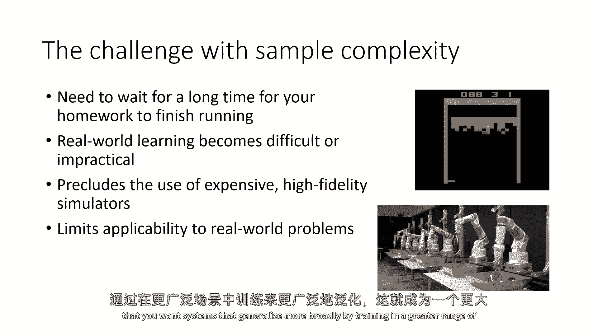

这个问题变得更加严重，所以，当我们谈论广度和概括性时，在深度强化学习中，概括性的扩展是主要挑战，在监督学习中，例如，训练在imagenet上，或者在common crawl上，或者在大型nlp数据集上。

监督深度学习的当前状态是大规模，强调多样性，并且它被评估在概括性上，所以没有人关心它做得有多好，你的语言模型可以记住在训练时学习的特定文本片段，每个人都关心你的语言模型如何泛化到新的提示上，而在RL中。

我们似乎经常在我们的方法上在小规模任务上进行评估，这些任务强调掌握并基于性能进行评估，这意味着我们真正测量的是，我们如何优化给定的目标函数，在这个目标函数被优化的特定环境中。

而且这通常是一个合理的事情来测量，所以如果你试图改进你方法的优化性能，这就是你应该测量的东西，但在现实世界中除了有效的优化性能之外，我们还关心泛化，性能，多样性和广度。

这涉及到很多超越基本RL方法核心问题的话题，并且与在更大规模上应用RL方法的能力有关，处理需要使用大量数据的多任务问题和设置，而不是仅仅使用大量的模拟，所以泛化来自哪里，这个问题有许多问题。

所以首先我们可以说，好吧，如果我们只是扩大深度RL，如果我们只是运行大量的模拟，使用各种各样的设置，并试图获得更多的一般性，通用且性能良好的策略。

这基本上是通向像AlphaGo这样的 game playing 系统路径，但是非常具有挑战性，所以与监督学习相比，我们做的是与世界互动，收集数据集，这通常对于监督学习系统来说是一次，然后。

我们运行学习算法在该数据集上进行多次迭代，并获得一些解决方案，如果我们对那个解决方案不满意，我们不会重新收集数据，我们只是重新运行训练后改变了我们方法的任何地方在强化学习中。

我们通常通过与世界的持续交互来学习，这意味着如果我们想要改变我们的方法，我们通常会重新运行交互学习过程，但是现实是，实际的强化学习有一个外层循环，那就是你，如果你对你的方法不满意，你会改变你的方法。

然后重新运行训练过程，这是很好如果你的训练过程涉及到训练半人马座快跑者跑得更快，但如果你的训练过程涉及到在巨大的不同设置上进行互联网规模的训练，以实现现实世界的泛化。

这个外层循环很快变得 impractical，因此，考虑改进RL的方法是非常重要的，不仅解决优化的核心挑战，还要解决更适合大规模机器学习研究的工作流程，这个问题非常严重，因此。

思考改进RL的方法是非常重要的，方法不仅解决优化的核心挑战，还要解决更适合大规模机器学习研究的工作流程。

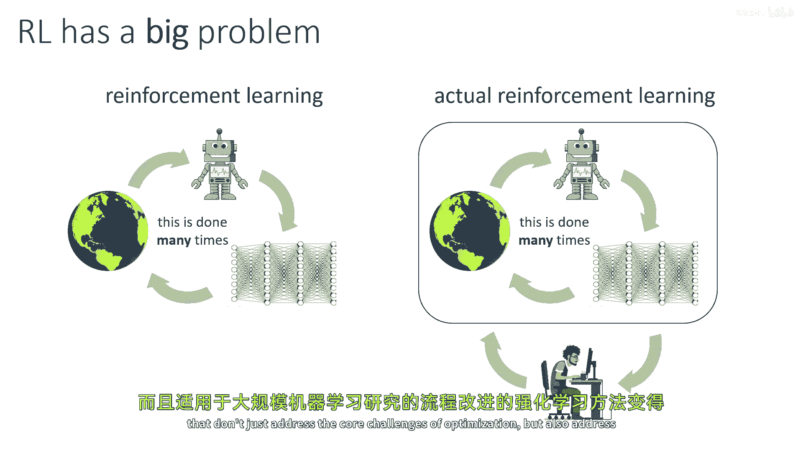

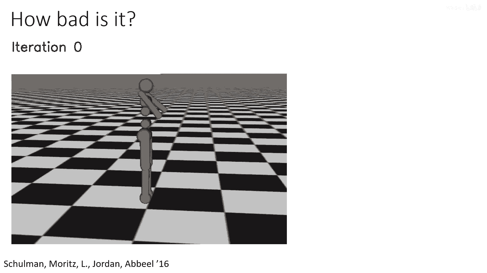

这个问题非常严重，好的，这里是来自trpo plus g的视频。

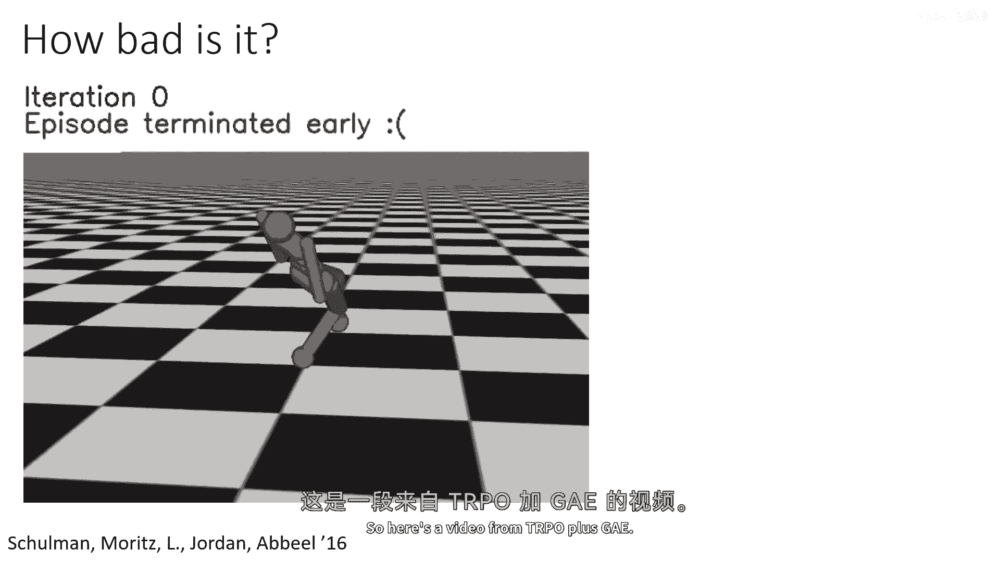

这个视频到现在已经很老了，但它仍然我认为相当令人印象深刻。

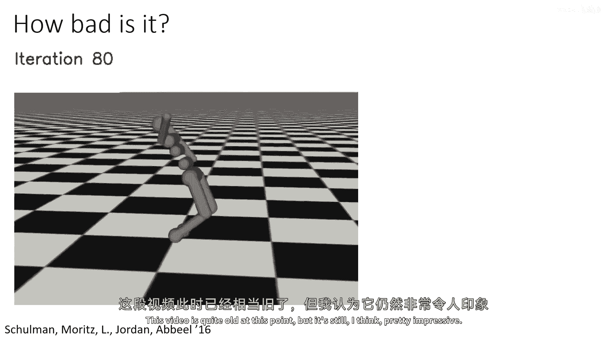

它展示了一个类人型机器人学习如何跑步，虽然训练完成后需要一些时间，机器人会摔倒几次。

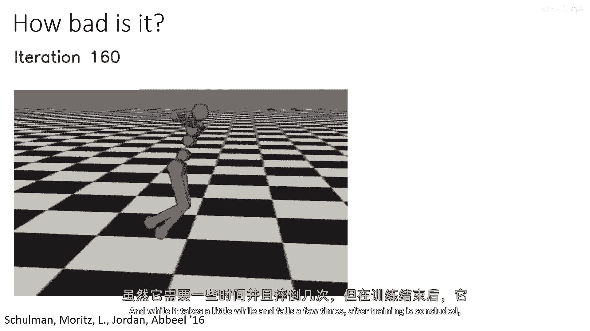

但它可以在这个无限大的平坦平面上运行。

基本上永无止境，所以这真的很酷。

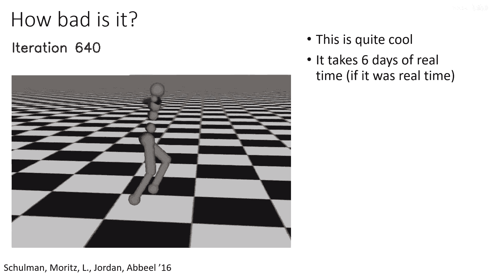

它大约需要六天的，嗯，实时时间，如果这个是真实的机器人，当然，在模拟中现在跑得更快。

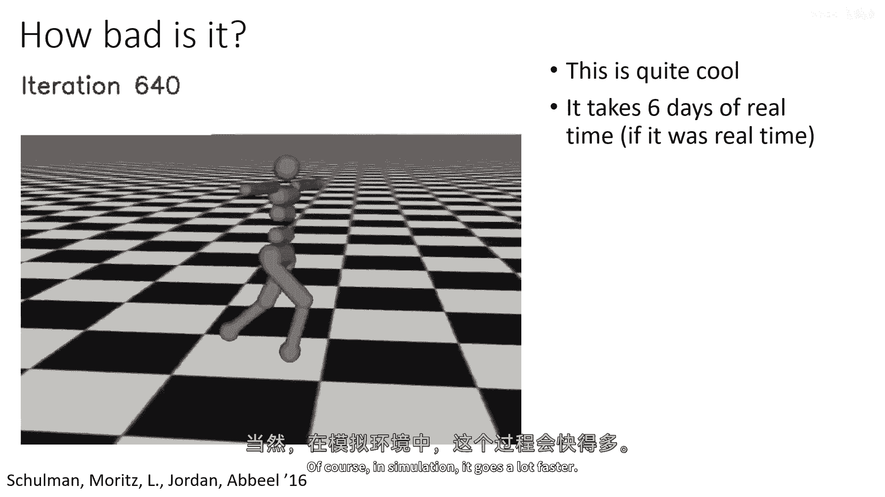

自从那时，这些算法已经变得快得多得多，所以也许现在它不需要六天，它可能。

甚至可能只需要六小时，但它仍然是一个相当非 trivial 的时间量，但是问题不在于这个。

问题就像，如果我们能只是运行一个机器人，像几天那样，得到一个可以在任何地方运行的机器人，我们会很高兴的，但这并不是我们实际上得到的，我们得到的是可以在无限大的平坦平面上运行的东西。

现实世界呈现各种各样的场景，嗯，现实世界是多样化的，如果你想要一个在实际世界中执行这种任务的实用系统，在现实世界，它必须处理各种地形，各种情况，也许还包括为了移动而服务的各种行为，所以不仅仅是跑步。

还包括越过东西等，一种人们已经以某种成功方式采取的方法是简单地模拟更广泛的情况。

但这很快开始呈现重大挑战。

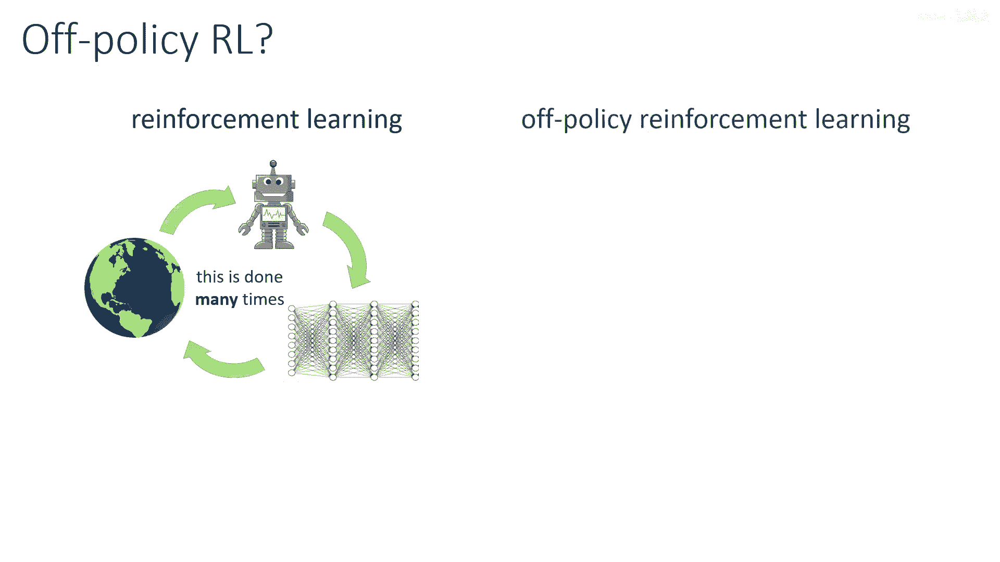

嗯，这些挑战包括确定所有这些情况是什么，你可能需要现实世界的数据来确定你需要覆盖的范围。

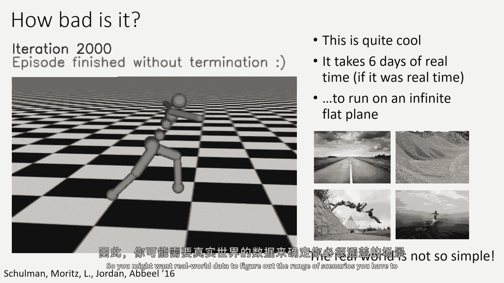

并且实际上设计可以处理如此广泛范围的算法，在数据利用方面，也许离线或离线强化学习方法更有效，也许我们可以从过去的交互中收集一个大数据集来确定一个有效的 uh。

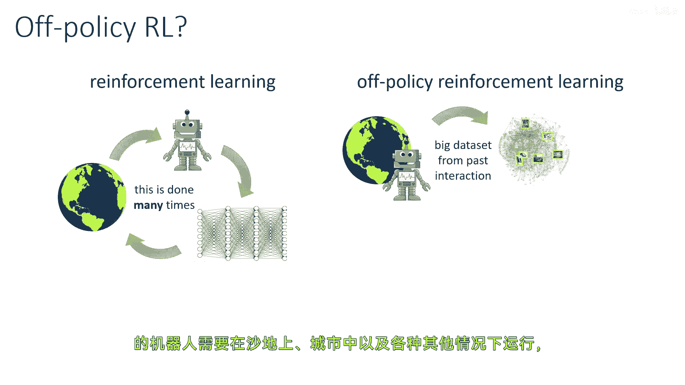

机器人需要在沙地上和在城市中运行，和各种其他情况。

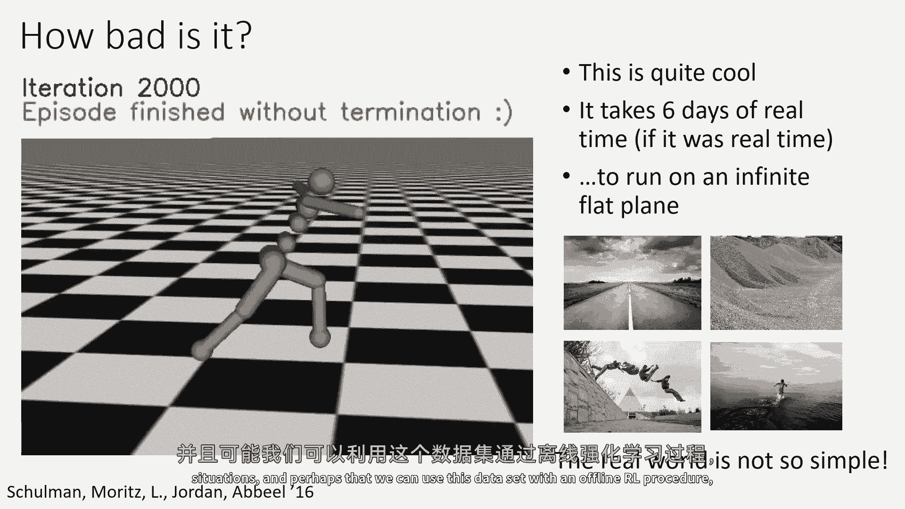

也许我们可以使用这个数据集与一个离线强化学习程序，如果我们对解决方案不满意，我们可以出去获取更多的数据简单地添加到我们的数据集中，而不是重复这个过程，然后如果我们必须调整方法的某些方面。

也许我们可以在不必丢弃所有数据的情况下做到这一点，也许我们也可以通过构建模拟来处理这个问题，并将这些模拟适应到现实世界中，如果你想采取这种方法，而且这也是一个可能值得更多研究的问题，多任务设置，嗯。

这也提出了一些往往不被视为的挑战，嗯，但在强化学习研究的核心，但我认为它们是极其重要的，所以，概括来自对许多不同环境的训练，我们讨论了设置多任务学习问题的各种方法，例如，你可以说你有多个MDPs。

并将它们建模为一个多任务MDP，在第一步，选择不同的MDP，这可能不需要任何新的假设，嗯，但它可能值得额外的处理来开发在这些场景中有效的算法，所以，虽然标准的RL方法可以处理多任务学习。

但它会加剧已经在RL挑战中已经存在的问题，如方差，如果你有多个不同的策略，那么这个是正确的，你的标准差将会更高，因为现在状态挑战的变异性更大，比如样本复杂性，如果你有更多的策略。

那么你需要更多的样本来训练，所以现有的样本复杂性挑战被加剧，也许我们可以通过解决这四个挑战来简单地解决这个问题，或者也许我们可以发明更好的方法，专门针对多任务学习，特别是。

这是一个我们需要记住的重要事情，但是现在让我们也谈谈那些假设，所以除了核心方法的能力之外，我们拥有的强化学习的假设是，我们访问一个奖励函数，我们在与环境交互时，这些都是在现实世界中可能存在的问题的假设。

强化学习的监督来自哪里，如果你想从许多不同的任务中学习，你需要从那些任务中获取它们，在某些情况下，为人类指定这些任务可能非常自然，所以如果你想让机器人前往不同的地点，这可能不是，对一个人来说。

简单地写下来可能并不难，哦，就像这些是GPS坐标，我想要你旅行来练习。

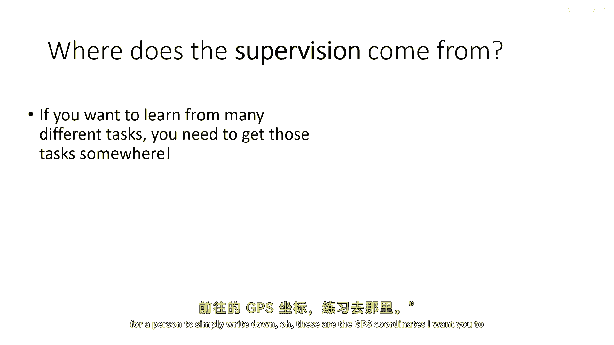

那样，但在其他情况下，仅仅指定你想要RL算法学习做什么可能会非常困难，所以如果你玩一个游戏，获得奖励非常容易，因为游戏有一个分数，赢得游戏可能是奖励，但是让我们假设你想要一杯糟糕的水，现在。

这是一个任何孩子都能做到的事情，但如果你想要机器人学习如何倒一杯水，仅仅理解玻璃是否装满了水本身需要复杂的感知系统，这个问题最近已经引起了人们的关注，因为与互联网，嗯，像聊天机器人这样的聊天。

Gpt t，实际上，确定你是否在与用户交互是一个重大挑战，以使那些用户满意的方式，以满足那些用户的方式，而且传统的奖励指定方式在那些情况下往往失败，所以有很多其他的事情可以做，例如。

我们可以从演示中学习目标或奖励，这是逆向强化学习，我们可以通过自动技能发现生成目标自动，以产生各种各样的不同任务。

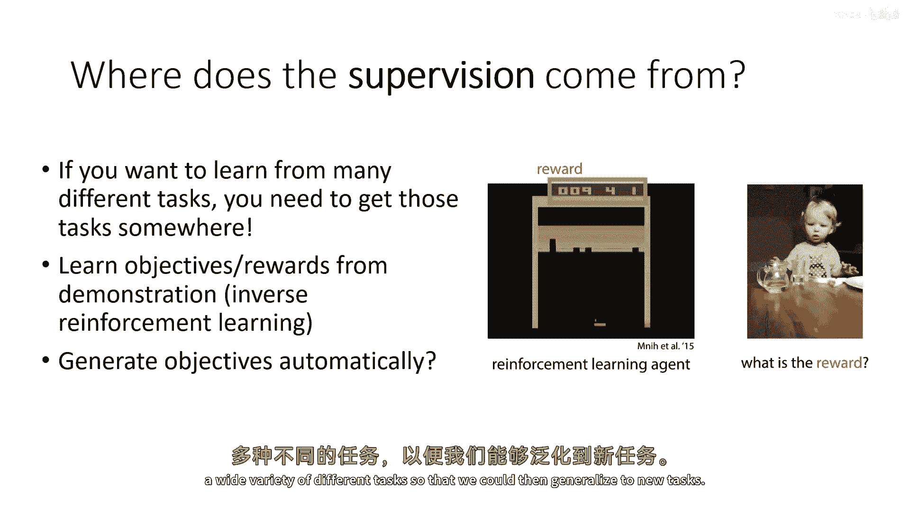

以便我们可以然后概括到新的任务，但我们也可以探索其他来源的监督，所以除了演示之外，嗯，这当然已经被广泛使用，嗯，我们可以考虑利用语言来确定机器人应该做什么的方法。

或许还可以从结合了语言和感知的模型中获得辅助监督，这可以通过从互联网规模训练中的一般化提供奖励信号，我们还可以想象学习人类偏好的方法，对不同行为的对偶比较，这是为强化学习基准任务开创的，"但是。

最近因为它是训练语言模型首选的方法而受到了大量的关注。"，"满足用户偏好"，"所以这些都是监督的替代来源"，"改变强化学习算法的核心假设"，"我认为思考你的特定领域需要什么样的监督是非常重要的"。

"当我谈到监督时，我认为还有一个相当基本的问题。"，"我们应该如何通过告诉RL代理我们要他们做什么来监督他们？"，"或者我们想让他们怎么做"，"奖励函数原则上只提供什么"，但是如果奖励函数形状更好。

那么它们也在提供一些如何，所以这些东西有一种平衡，我们必须小心地找到这个平衡，因为从一方面，强化学习方法的优势在于它们可以发现新的、创新的解决方案，所以我们不想监督它们太紧密，但同时。

如果监督太高级比如，你对你的语言模型聊天机器人的监督是使我的公司赚很多钱，那么这可能只是一个非常困难的学习问题。

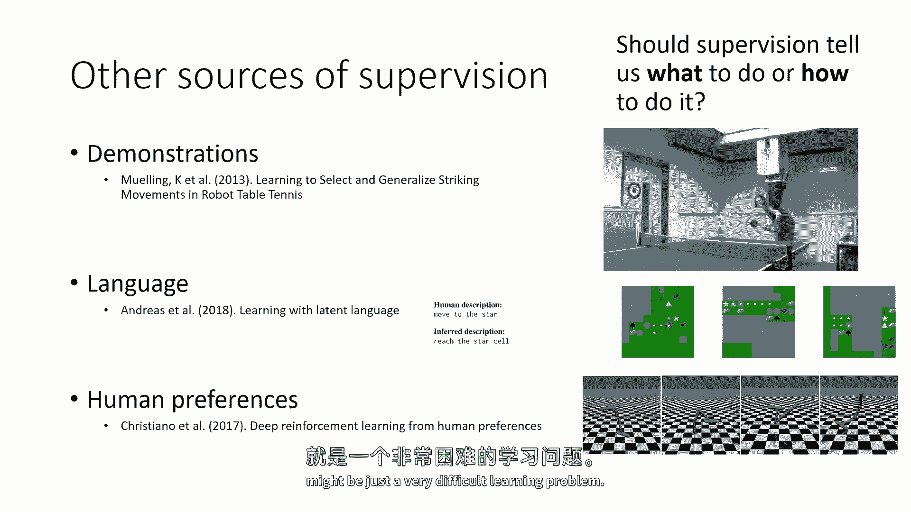

所以我们必须在那里找到正确的平衡，我们可能需要以其他方式重新考虑问题表述，比如我们如何定义控制问题，数据是什么，在某些情况下，定义控制问题更容易，使用指定世界可能发生的事情数据比使用模拟器更容易定义。

或者访问交互式代理，所以离线rl支持这种设置，在线强化学习方法不是做什么目标，强化学习代理试图实现的目标是由奖励指定的目标，通过演示或偏好，并且监督是什么就是目标，有时候我们想要向代理提供提示。

帮助它学习任务，而不偏袒它找到的解决方案，并且有，关于使用演示作为指导而不是必然作为目标指定进行研究的工作，但在总体上，这是一个开放的研究领域，这里没有唯一的答案。

这就是为什么这是这个公开挑战讲座的一部分，但我鼓励你们所有人都思考适合你们问题设置的假设，有时候正确的事情是将问题强迫成标准格式，Rl假设，但有时候正确的事情是发明一个新的问题。

不假设基本的rl问题是固定的。

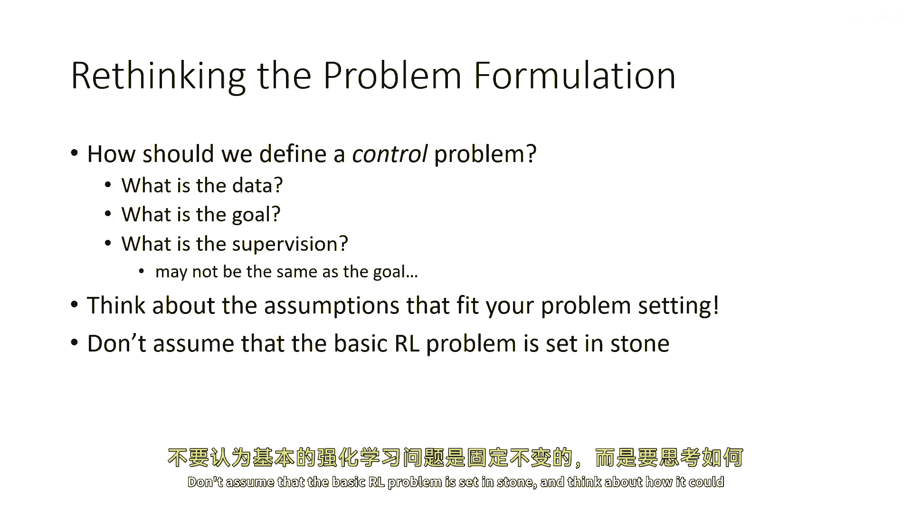