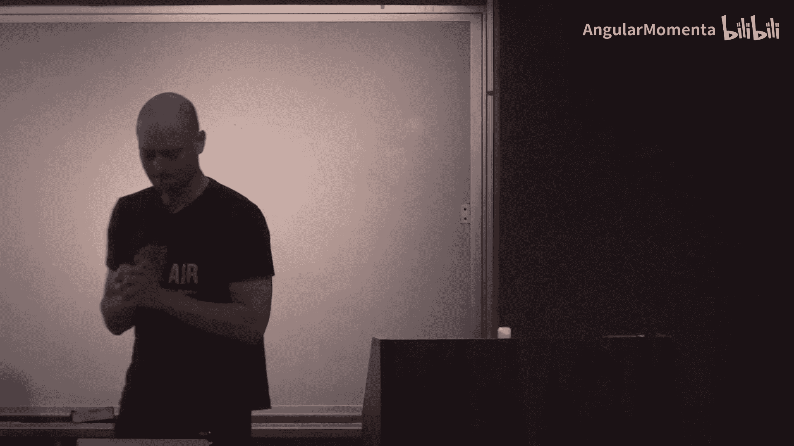
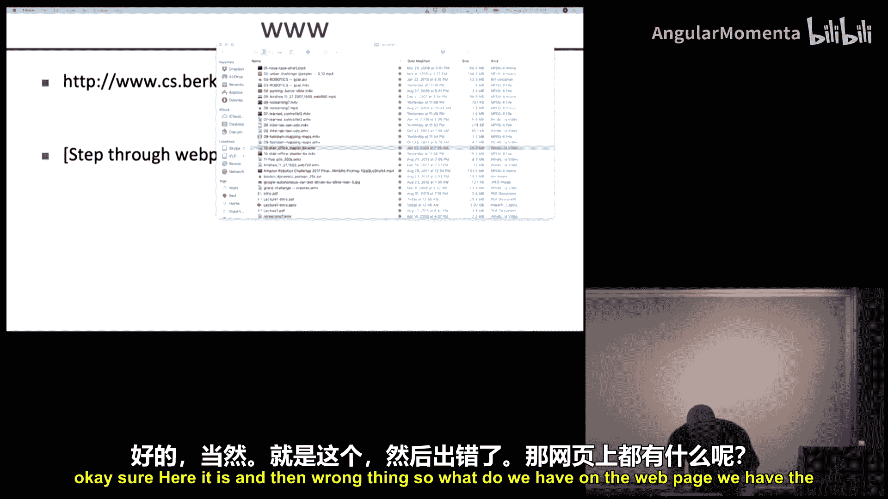
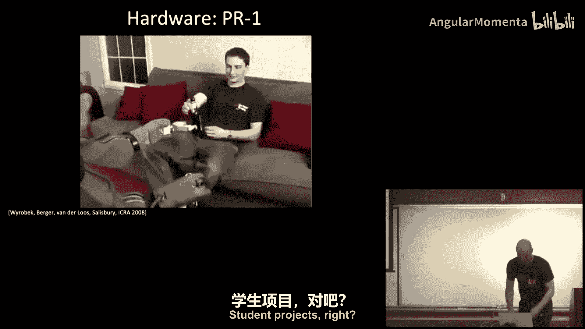
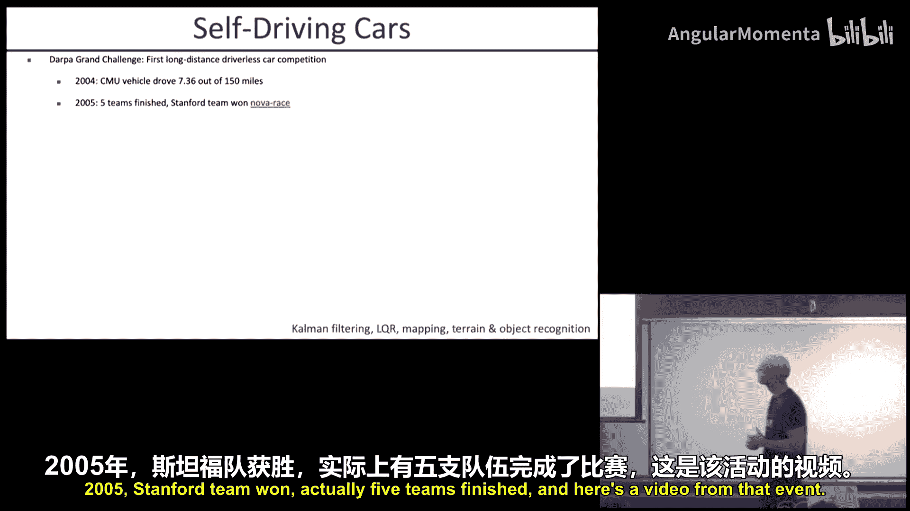
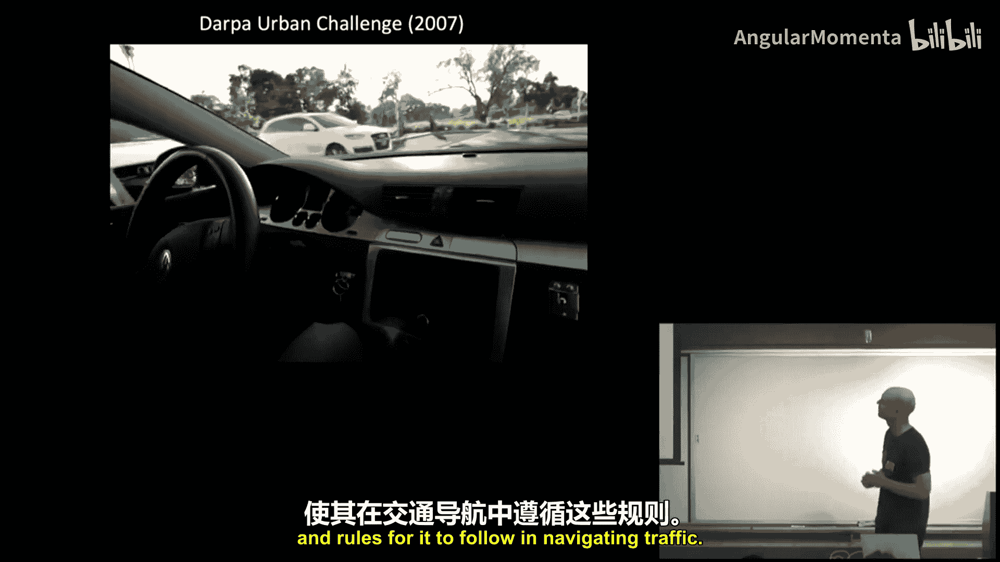
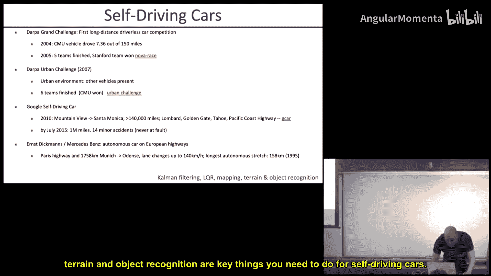
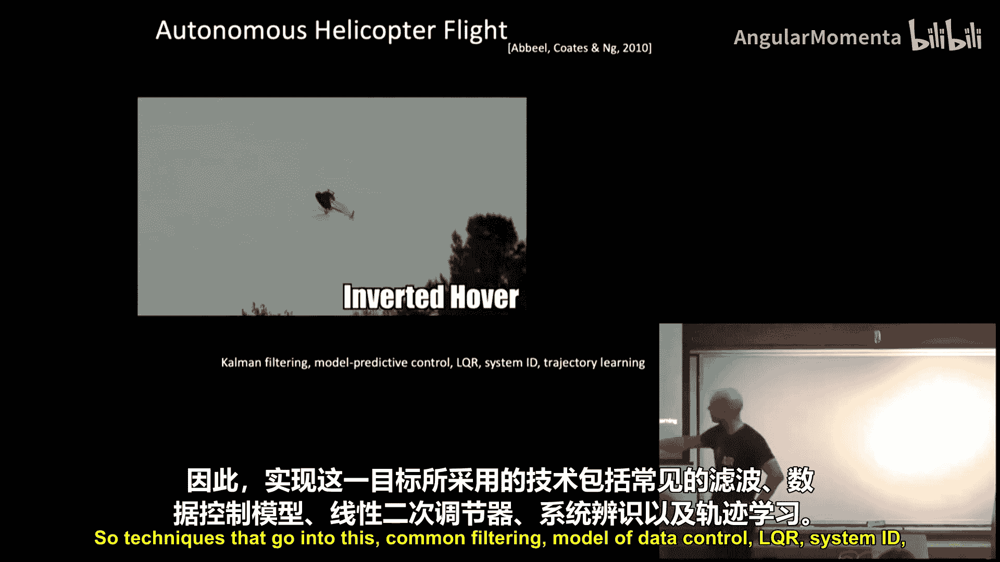
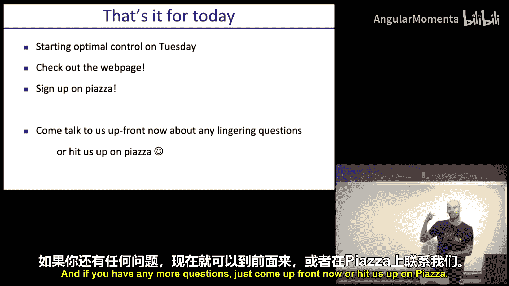

# 001：引言

在本节课中，我们将学习CS 287高级机器人学课程的总体介绍，包括课程结构、目标、评估方式以及机器人学领域的概览。

## 课程概述与人员介绍

欢迎来到CS 287高级机器人学的第一讲。

首先介绍课程团队。我是本课程的教授，Peter Abbeel。课程助教包括Ignasi、Laura Smith和Harry。我们期待与大家共度一个激动人心的学期。

## 课程网站与结构

课程有一个专门的网站，其中包含了所有重要信息。

以下是网站上的主要内容：
*   **基本信息**：包含授课人员、上课时间以及往期课程链接。
*   **沟通平台**：所有非课堂内的沟通将通过Piazza进行，请务必注册。
*   **课程安排**：包括五次作业、一个期末项目、一次期中考试的时间节点。
*   **评分政策**：作业（60%）、期末项目（30%）、期中考试（10%）。五次作业中分数最低的一次将被剔除。
*   **先修要求**：需要熟悉数学证明、概率论、线性代数，并具备用代码实现算法的能力。本课程将使用Python和NumPy。

## 期中考试说明

期中考试是本课程的一项新安排。其目的是确保大家掌握机器人学中一些最核心、基础的推导和直觉。

考试形式如下：
*   **提前公布**：我们会提前提供约20道可能的考题及其完整答案。
*   **随机抽选**：考试时将从这些题目中随机抽取几道进行作答。
*   **闭卷考试**：考试为完全闭卷，旨在考察大家对核心概念的内化程度，而非死记硬背。

我们希望这些核心推导（例如LQR、策略梯度）能像“导数”概念一样，成为你知识体系中牢固的基石。

## 作业与期末项目

上一节我们介绍了课程的整体安排，本节中我们来看看具体的作业和项目要求。

作业通常包含两部分：
1.  **理论推导**：扩展或深化课堂所讲内容，约占10%-20%。
2.  **代码实现**：在模拟机器人环境中实现课堂所学的算法，约占80%-90%。

期末项目可以选择以下方向之一：
*   **理论/算法贡献**：扩展当前前沿。
*   **应用实现**：在真实机器人或真实世界数据上实现课堂所学算法。

项目可由1-2人组队完成。项目提案、最终报告和演示均有严格截止日期，不适用迟交豁免。

## 行业嘉宾讲座

本课程将邀请业界专家进行客座讲座，分享机器人技术在工业界的实际应用。目前已确认的嘉宾包括：
*   **Ike公司联合创始人**：将分享自动驾驶卡车相关技术。
*   **Skydio公司CEO Adam Bry**：将分享无人机技术。
*   **Waymo研究院主任Drago Anguelov**：将分享自动驾驶汽车技术。

此外，针对特定专题（如粒子滤波、模拟到真实迁移），我们还将邀请该领域的顶尖学者进行授课。

## 为何学习机器人学？

了解课程结构后，我们来看看学习机器人学的意义。

学习机器人学主要有两大原因：
1.  **绝佳的人工智能研究平台**：真实世界比模拟环境更严苛，能揭示现有算法的不足，并启发新算法的诞生。同时，生物智能的涌现也证明，与物理世界互动是发展高级智能的有效途径。
2.  **直接的实际影响力**：机器人技术进步能直接转化为现实应用，如家庭机器人、自动驾驶、无人机等。

当前，机器人硬件已日趋成熟，真正的瓶颈在于算法、数学和编程。本课程将聚焦于优化、概率推理和学习这三大核心领域，这些技术不仅适用于机器人，也广泛应用于其他AI领域。

## 机器人技术成功案例

为了让大家对所学技术的应用有直观感受，我们来看一些机器人领域的成功案例，并指出其背后的核心思想。

**自动驾驶汽车**：这是当前机器人领域最活跃的方向。从DARPA挑战赛到Waymo的百万英里测试，其核心技术包括**卡尔曼滤波、最优控制（如LQR）、同步定位与建图以及地形物体识别**。

**自主直升机特技飞行**：展示了在高度动态系统中的先进控制能力。背后是**模型预测控制、系统辨识和轨迹优化**等技术。

**足式机器人复杂地形行走**：展示了如何结合**模型预测控制、运动规划和逆向强化学习**，让机器人学会在复杂地形中稳健行走。

**同步定位与建图**：是移动机器人的基础。通过**粒子滤波**等算法，机器人可以仅凭里程计和激光雷达数据构建精确的环境地图。

**机器人学习**：包括从演示中学习（模仿学习）、通过试错学习（强化学习，如**策略梯度**）以及大规模多机器人并行学习。这些方法使机器人能掌握叠毛巾、打结、跑步等多种技能。

**仓储分拣机器人**：展示了在结构化环境（如物流仓库）中，结合**视觉识别、运动规划和抓取点选择**技术，解决实际商业问题的潜力。

所有这些应用都指向一个共同点：通过强大的算法，我们可以解锁机器人硬件的巨大潜能。

## 课程教学方式

回顾了激动人心的应用后，本节我们将了解本课程具体的教学方式。

大多数课程将遵循以下结构：
1.  **问题设定**：提出一个抽象的、数学化的问题模型。
2.  **核心直觉**：讲解解决该问题的关键思路。
3.  **详细推导**：对核心算法进行一步步的、清晰的推导。**强烈建议你准备纸笔，跟随我一起推导**，这能极大地帮助你内化知识。这些推导正是期中考试的核心。
4.  **扩展讨论**：快速介绍该核心思想在非线性等其他场景下的扩展。

我们将有意识地放慢节奏，深入讲解核心概念，而对扩展内容则快速带过，确保大家能牢固掌握每节课的一两个关键要点。

## 总结与待办事项

本节课中，我们一起学习了CS 287高级机器人学课程的概览。我们介绍了课程团队、网站结构、创新的期中考试形式、作业与项目要求，并展望了机器人学领域的广阔图景及其背后的核心技术。

你的当前待办事项是：
1.  查看课程网站。
2.  注册Piazza课程页面。
3.  准备好纸笔，迎接下周开始的深入推导课程。

如有任何问题，欢迎现在上前询问或在Piazza上提出。谢谢大家，我们周二见。