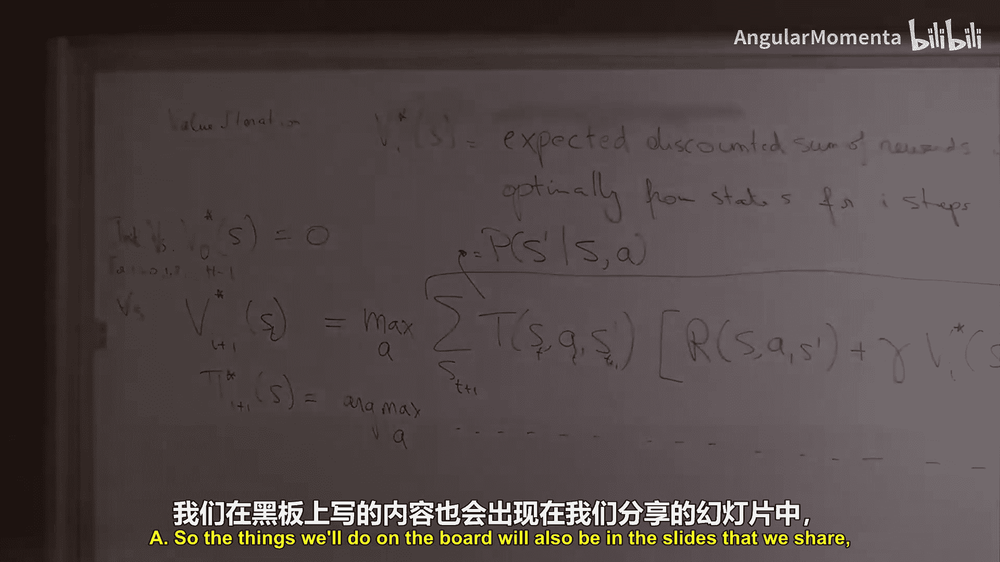
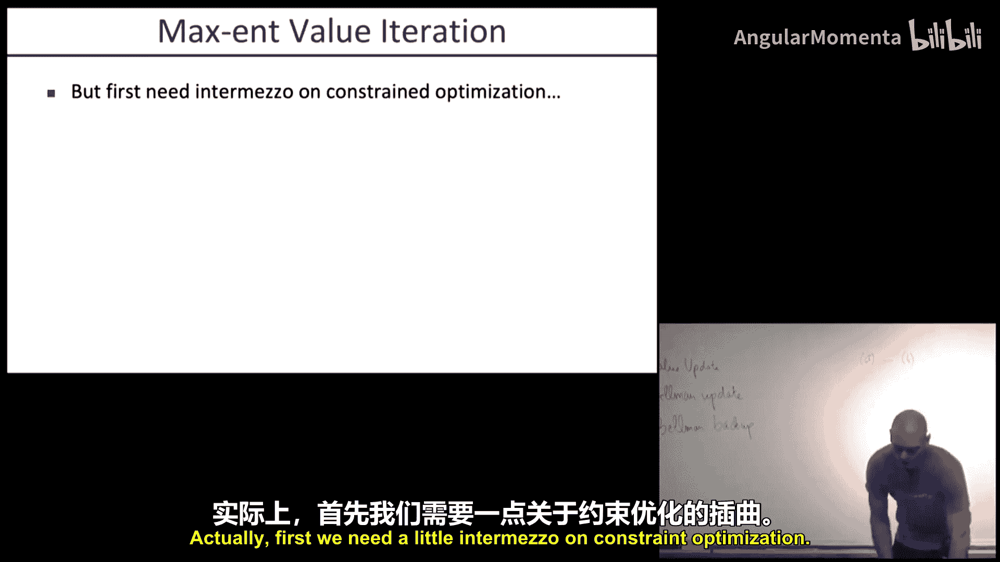
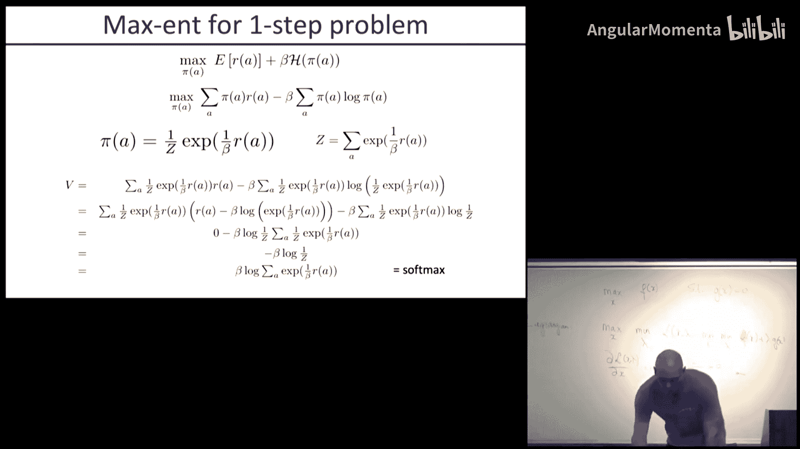
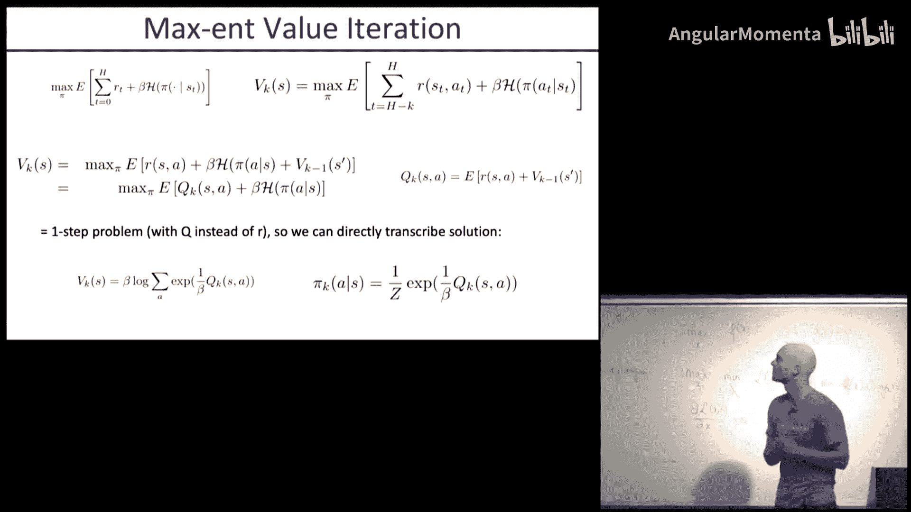

# 002：马尔可夫决策过程

在本节课中，我们将要学习马尔可夫决策过程的基本框架、精确求解方法，以及一个重要的变体——最大熵马尔可夫决策过程。

## 概述

马尔可夫决策过程是描述智能体与环境交互以达成目标的数学框架。智能体通过观察状态、执行动作来与环境互动，其目标由奖励函数定义。本节课我们将学习如何形式化MDP问题，并探讨求解最优策略的算法。

## MDP框架

上一节我们介绍了课程的基本信息，本节中我们来看看马尔可夫决策过程的核心定义。

一个MDP由以下元素构成：
*   **状态集合 S**：例如，一个3x3网格世界有9个可能的位置状态。
*   **动作集合 A**：例如，在网格世界中，动作可以是向北、东、南、西移动。
*   **转移模型 T**：给定当前状态 `s` 和动作 `a`，转移到下一个状态 `s'` 的概率分布。公式表示为 `P(s' | s, a)`。
*   **奖励函数 R**：通常依赖于状态、动作和下一个状态，有时也依赖于时间。公式表示为 `R(s, a, s')`。
*   **折扣因子 γ**：一个介于0和1之间的数，表示对未来奖励的重视程度。γ 越接近0，智能体越短视；γ 越接近1，智能体越有远见。

智能体的目标是找到一个策略 `π*`，以最大化从初始状态开始的期望折扣奖励总和：
`E[Σ_{t=0}^{∞} γ^t R_t]`

## MDP示例

理解了MDP的形式化定义后，让我们通过一些具体例子来加深理解。

以下是MDP在不同领域的应用示例：
*   **清洁机器人**：状态是机器人的位置和房间的脏污情况；奖励与房间的清洁度相关。
*   **行走机器人**：奖励可能与前进距离成正比，与能量消耗成反比。
*   **倒立摆平衡**：状态是摆的角度和角速度；奖励与偏离垂直位置的程度和施加的扭矩大小相关。
*   **游戏（如俄罗斯方块、双陆棋）**：游戏规则定义了转移模型，获胜/失败对应正/负奖励。
*   **服务器资源管理**：状态是服务器负载和请求队列；奖励与请求的处理延迟和优先级相关。
*   **最短路径问题**：可视为一个确定性的MDP，到达目标状态获得奖励。
*   **动物行为建模**：用MDP框架建模生物（如蜜蜂）寻找花蜜等目标驱动行为。

我们的标准示例是一个网格世界。智能体位于一个4x3的网格中，灰色格子是障碍。动作有四个方向，执行时有80%的成功率，10%向左偏，10%向右偏。撞墙则停留在原地。在右上角格子执行“退出”动作获得+1奖励，在右下角格子执行“退出”动作获得-1奖励，其他情况奖励为0。目标是找到最优策略，尽快到达右上角并获得正奖励，同时避免落入右下角的陷阱。

## 价值迭代算法

我们已经了解了MDP的构成和目标，本节中我们来看看第一个精确求解算法——价值迭代。

价值迭代的核心思想是递归地计算最优价值函数。我们定义 `V_i^*(s)` 为从状态 `s` 开始，最优地行动 `i` 步所能获得的期望折扣奖励总和。

基础情况是 `V_0^*(s) = 0`（没有剩余步数，无法获得奖励）。递归更新（贝尔曼更新）如下：
`V_{i+1}^*(s) = max_a Σ_{s'} P(s'|s,a) [ R(s,a,s') + γ * V_i^*(s') ]`

算法流程如下：
1.  对所有状态 `s`，初始化 `V_0^*(s) = 0`。
2.  对 `i = 0, 1, 2, ..., H-1` 进行迭代：
    *   对每个状态 `s`，使用上述贝尔曼更新方程计算 `V_{i+1}^*(s)`。
3.  迭代直到价值函数收敛。

一旦得到最优价值函数 `V^*`，最优策略可以通过一步前瞻得到：
`π^*(s) = argmax_a Σ_{s'} P(s'|s,a) [ R(s,a,s') + γ * V^*(s') ]`

在网格世界示例中，随着迭代进行，价值（高奖励的期望）从奖励所在格子逐渐向外传播。由于环境是随机的，拥有更多步数意味着有更多机会从意外偏离中恢复，因此价值随着迭代次数增加而上升，最终收敛。

**定理**：价值迭代保证收敛到无限时域折扣问题的最优价值函数 `V^*`，并满足贝尔曼最优方程：`V^*(s) = max_a Σ_{s'} P(s'|s,a) [ R(s,a,s') + γ * V^*(s') ]`

收敛直觉：`V^*` 是无限步的期望收益，`V_H^*` 是 `H` 步的期望收益。当 `H` 很大时，额外步数能带来的最大可能收益上界为 `(γ^H * R_max) / (1-γ)`，随着 `H` 增大趋近于0，因此 `V_H^*` 趋近于 `V^*`。

另一种观点是利用收缩映射。定义最大范数 `||V||_∞ = max_s |V(s)|`。如果更新操作 `B`（即贝尔曼更新）是 `γ`-收缩的，即 `||B(U) - B(V)||_∞ ≤ γ ||U - V||_∞`，那么重复应用 `B` 会收敛到唯一不动点。可以证明价值迭代更新是一个 `γ`-收缩。

**附加结论**：如果在价值迭代中，某次迭代后所有状态的价值变化最大值为 `ε`，即 `max_s |V_{i+1}(s) - V_i(s)| ≤ ε`，那么当前价值函数与最优价值函数的误差满足 `||V_i - V^*||_∞ ≤ (2εγ) / (1-γ)`。这为算法提供了停止准则。

## 参数对策略的影响

在学习了基础算法后，我们通过一个例子看看MDP参数如何影响最终的最优策略。

考虑一个网格世界，有近处小奖励（+1）、远处大奖励（+10）和危险区域（-10）。我们关注折扣因子 `γ` 和动作噪声水平的影响。

以下是不同参数设置下可能出现的策略类型：
*   **A**：偏好最近出口（+1），但冒险沿悬崖边（底部）走。
*   **B**：偏好最近出口（+1），但避开悬崖，从上方绕行。
*   **C**：偏好远处出口（+10），冒险沿悬崖边走。
*   **D**：偏好远处出口（+10），避开悬崖，从上方绕行。

分析：
1.  `γ=0.1, 噪声=0`：强烈折扣未来奖励，且无风险 → 策略 **A**。
2.  `γ=0.1, 噪声=0.5`：强烈折扣未来奖励，但高风险 → 策略 **B**。
3.  `γ=0.99, 噪声=0`：几乎不折扣未来奖励，且无风险 → 策略 **C**。
4.  `γ=0.99, 噪声=0.5`：几乎不折扣未来奖励，但有高风险 → 策略 **D**。

## 策略迭代算法

价值迭代直接求解最优价值函数。另一种方法是策略迭代，它交替进行策略评估和策略改进。

**策略评估**：给定一个固定策略 `π`（可能是确定性的 `a=π(s)`，也可能是随机的 `π(a|s)`），计算遵循该策略的价值函数 `V^π`。更新方程去掉 `max`，按策略选择动作：
对于确定性策略：`V_{i+1}^π(s) = Σ_{s'} P(s'|s,π(s)) [ R(s,π(s),s') + γ * V_i^π(s') ]`
对于随机策略：`V_{i+1}^π(s) = Σ_a π(a|s) Σ_{s'} P(s'|s,a) [ R(s,a,s') + γ * V_i^π(s') ]`
策略评估也是一个收敛过程。

**策略改进**：基于当前策略 `π_k` 的价值函数 `V^{π_k}`，通过一步前瞻找到一个更好的策略 `π_{k+1}`：
`π_{k+1}(s) = argmax_a Σ_{s'} P(s'|s,a) [ R(s,a,s') + γ * V^{π_k}(s') ]`
直觉是：新策略在第一步选择了最优动作，之后继续沿用旧策略，这至少和一直用旧策略一样好。将这个逻辑应用到每一步，就得到了一个全局更好的新策略。

策略迭代算法流程：
1.  初始化策略 `π_0`。
2.  重复直到策略不变：
    *   **策略评估**：计算当前策略 `π_k` 的价值函数 `V^{π_k}`（迭代求解或解线性方程组）。
    *   **策略改进**：根据上述公式更新策略得到 `π_{k+1}`。

**定理**：策略迭代保证收敛，且在收敛时，当前策略及其价值函数就是最优策略和最优价值函数。
*   收敛性：每次迭代策略都严格改进（或不变），而策略总数有限，故必收敛。
*   最优性：收敛时 `π_{k+1} = π_k`，意味着策略改进公式中的 `argmax` 动作正是 `π_k` 指定的动作，即当前策略已满足贝尔曼最优方程。

## 最大熵MDP

传统的MDP求解单一最优策略。但在动态或不确定的环境中，单一策略可能很脆弱。最大熵MDP旨在寻找一个策略分布，在最大化期望奖励的同时，也最大化策略的熵，从而得到更具鲁棒性和多样性的行为。

**熵**：度量随机变量 `X`（分布为 `P(x)`）的不确定性：`H(X) = -Σ_x P(x) log P(x)`。熵在分布均匀时最大，在分布集中时最小。

**最大熵目标**：我们寻找策略 `π`，最大化以下目标：
`E_{τ~π}[Σ_t R(s_t, a_t, s_{t+1})] + β * H(π)`
其中 `β > 0` 是权衡系数。`β=0` 退化为标准MDP；`β→∞` 则完全忽略奖励，只最大化熵（均匀随机策略）。

为了求解，我们需要一点**约束优化**的知识。考虑问题：`max_x f(x) s.t. g(x)=0`。可通过拉格朗日函数求解：`L(x,λ) = f(x) + λg(x)`。原问题等价于 `max_x min_λ L(x,λ)`。解满足 `∂L/∂x = 0` 和 `∂L/∂λ = 0`。

我们将此应用于一个简化的单步最大熵问题：`max_{π} Σ_a π(a) R(a) + β H(π)`，约束为 `Σ_a π(a)=1`。

构建拉格朗日函数：`L(π,λ) = Σ_a π(a)R(a) - β Σ_a π(a)log π(a) + λ(Σ_a π(a) - 1)`
令 `∂L/∂π(a) = 0`，得到：`R(a) - β(log π(a) + 1) + λ = 0`
解得：`π(a) = exp( (1/β) R(a) ) / Z`，其中 `Z = Σ_a exp( (1/β) R(a) )` 是归一化常数。

这是一个 **Softmax** 分布。奖励越高的动作被选中的概率越大，但 `β` 控制了“锐利”程度：`β` 越小，分布越集中在最优动作上；`β` 越大，分布越均匀。

将这个最优 `π` 代回目标函数，经过推导，得到最优值为：`β * log Σ_a exp( (1/β) R(a) )`。当 `β→0`，这趋近于 `max_a R(a)`；当 `β→∞`，这趋近于均匀分布的熵。

这个单步问题的解形式优美，其多步推广（最大熵价值迭代）将具有类似结构，我们将在下节课详细讨论。

## 总结

本节课中我们一起学习了马尔可夫决策过程的核心内容。我们首先定义了MDP的五个基本要素，并通过多个实例说明了其广泛适用性。接着，我们深入探讨了两种经典的精确求解算法：价值迭代和策略迭代，理解了它们如何通过贝尔曼方程递归地求解最优价值函数和策略。最后，我们引入了最大熵MDP的概念，它通过在高奖励和高熵（多样性）之间进行权衡，来寻找更具鲁棒性的策略分布，并推导了其单步问题的解析解。这些基础概念和算法为后续学习更复杂的机器人规划与控制方法奠定了坚实的基础。