# 003：通过离散化求解连续马尔可夫决策过程

在本节课中，我们将要学习如何将求解马尔可夫决策过程的方法，从离散状态空间扩展到连续状态空间。我们将通过离散化的技术，将复杂的连续问题转化为可以处理的离散问题，并探讨不同离散化方法的效果。

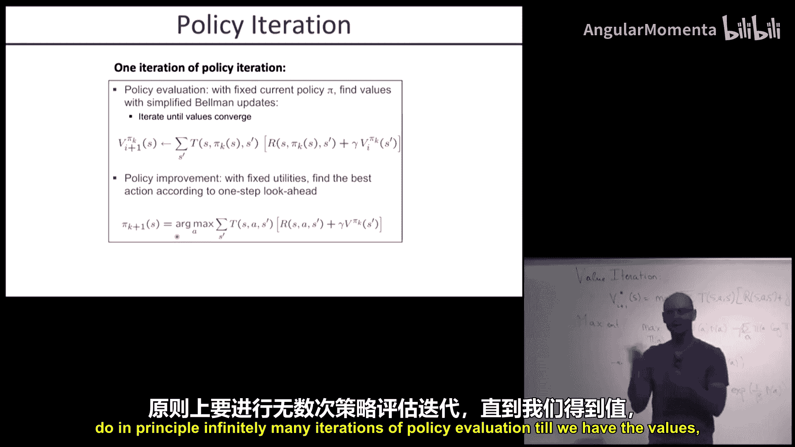

## 课程概述

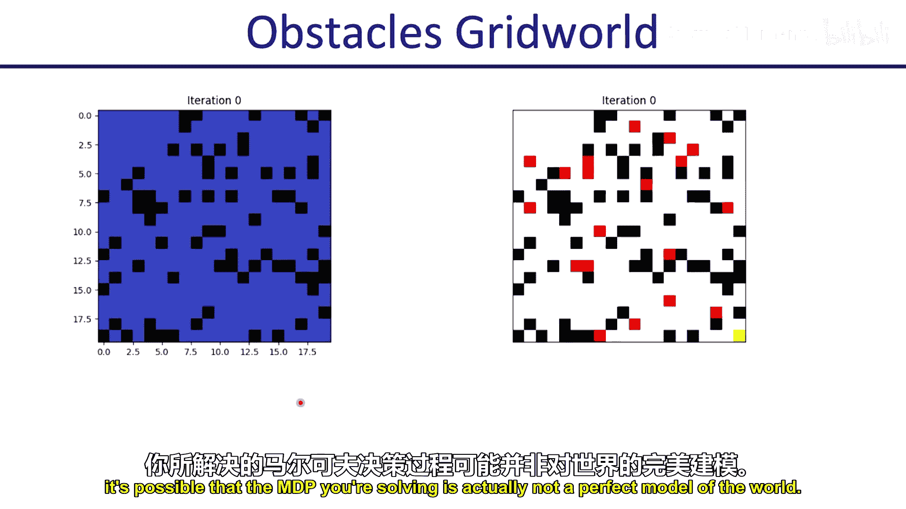

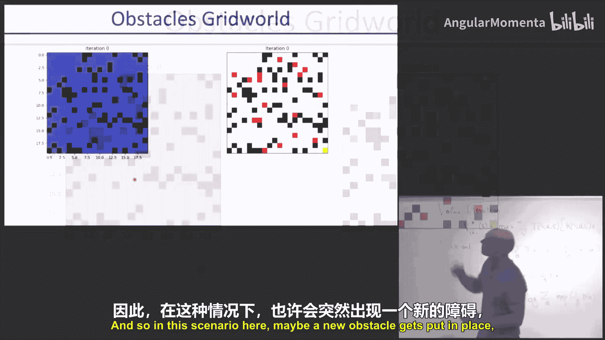

上一讲我们介绍了马尔可夫决策过程的基本概念和求解算法，如值迭代和策略迭代。本节中，我们来看看当状态空间是连续而非离散时，如何应用这些方法。核心思路是将连续状态空间离散化，构建一个近似的离散MDP进行求解。

## 快速回顾：马尔可夫决策过程与值迭代

首先，我们快速回顾一下MDP和值迭代的核心内容。一个MDP由以下部分组成：
*   **状态集合 (S)**
*   **动作集合 (A)**
*   **转移模型 (T(s'|s, a))**：描述在状态`s`执行动作`a`后，转移到状态`s'`的概率。
*   **奖励函数 (R(s, a))**：描述在状态`s`执行动作`a`获得的即时奖励。
*   **折扣因子 (γ)**：权衡当前奖励与未来奖励的重要性。

值迭代算法通过以下贝尔曼更新方程来求解最优值函数 `V*(s)`：
`V_{i+1}(s) = max_a [ R(s, a) + γ * Σ_{s'} T(s'|s, a) * V_i(s') ]`
该方程从`V_0(s)=0`开始迭代，直至收敛到最优值函数。

## 最大熵强化学习回顾

上一讲我们还介绍了最大熵强化学习框架。它在标准奖励最大化的目标中，额外增加了策略熵的项，鼓励策略的随机性和探索性。其目标函数为：
`max_π E[ Σ_t (R(s_t, a_t) + β * H(π(·|s_t)) ) ]`
其中`β`是权衡因子，`H`是熵。对于单步问题，最优策略具有一个简洁的形式：
`π(a|s) = (1/Z) * exp( Q(s, a) / β )`
其中`Z`是归一化常数。这个形式表明，动作的概率与其`Q`值的指数成正比。

## 连续MDP的挑战与离散化思路

值迭代要求对每个状态`s`进行更新。如果状态空间`S`是连续的，这意味着有无限多个状态需要更新，算法将无法直接运行。

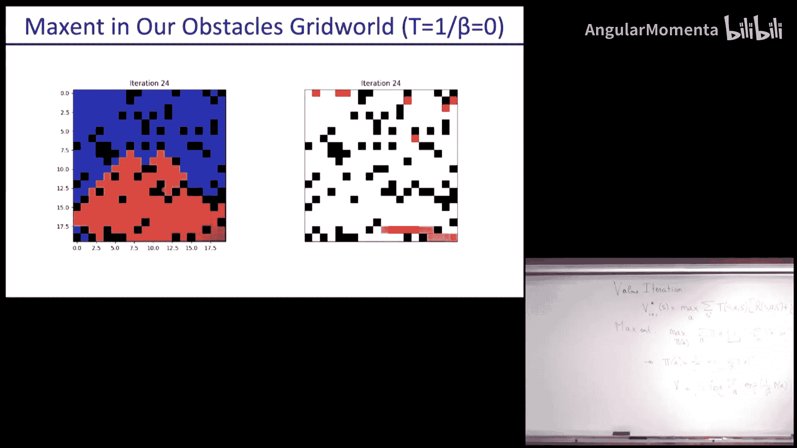

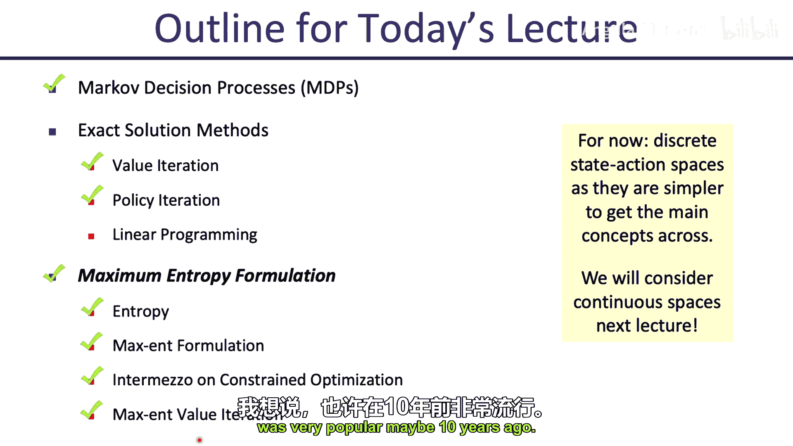

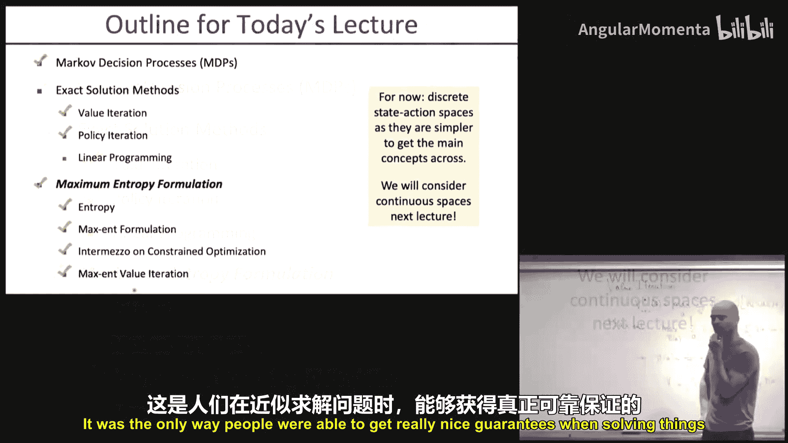

解决方案是将原始的连续MDP转化为一个近似的离散MDP。我们记离散化后的MDP组件为`S̄`, `Ā`, `T̄`, `R̄`。

以下是实现离散化的基本步骤：

1.  **离散化状态空间**：例如，在连续区域内设置网格点，只考虑这些网格点代表的状态。
2.  **离散化动作空间**（可选）：如果动作空间也是连续的，通常也需要将其离散化。不过，在某些情况下（如存在闭式解或Bang-Bang控制原理），可能无需离散化动作。
3.  **定义离散转移模型**：这是最具挑战性的部分。当连续动力学模型将系统带到一个不在离散网格点上的状态时，我们需要定义如何将其“映射”回离散状态集。

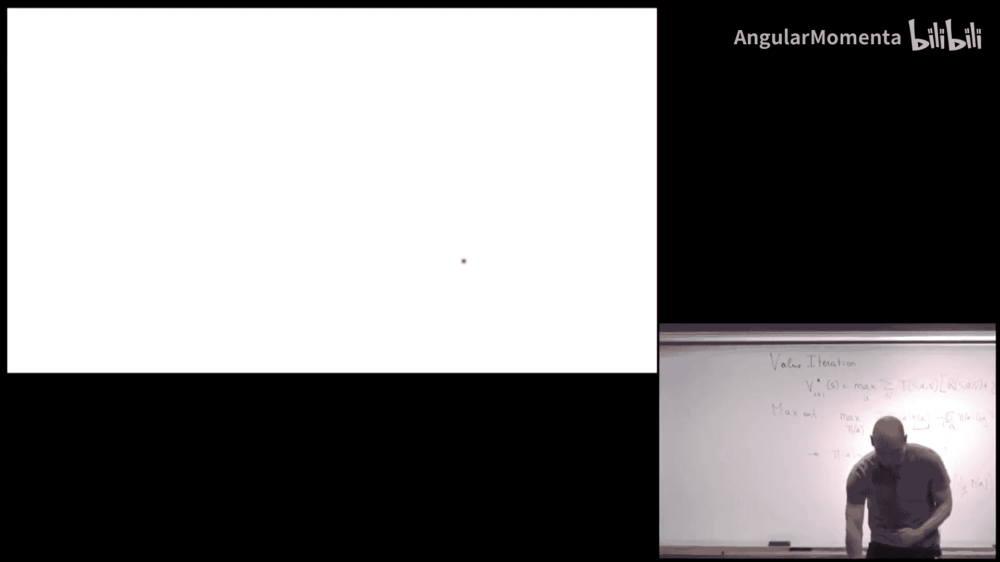

## 离散化转移模型的方法

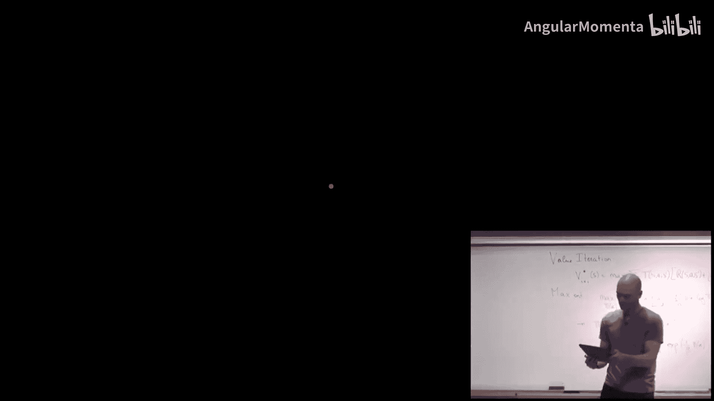

关键在于处理连续转移结果`s'`不在离散状态集`S̄`中的情况。以下是两种主要方法：

### 方法一：最近邻法

将转移到的连续状态`s'`简单地“吸附”到离它最近的离散网格点`s̄'`上。
*   **优点**：实现简单。
*   **缺点**：会引入失真。例如，微小的移动可能被吸附回原点，而精心计算的边界跨越可能被过度简化，导致值函数传播不自然。

### 方法二：随机插值法（如双线性插值）

将连续状态`s'`视为其周围离散网格点的概率混合。例如，在2D网格中，一个点`s'=(x,y)`可以表示为四个角点`ψ_00, ψ_01, ψ_10, ψ_11`的凸组合：
`s' ≈ (1-x)(1-y)*ψ_00 + x(1-y)*ψ_01 + (1-x)y*ψ_10 + x*y*ψ_11`
我们可以将这些权重解释为转移到对应离散状态的概率。
*   **优点**：能更平滑、更准确地反映连续动力学，通常能带来更好的值函数传播和策略性能。
*   **缺点**：计算稍复杂，在高维空间中需要处理`2^d`个邻居点。

另一种方法是**单纯形插值**，它用`d+1`个点（构成一个单纯形）来插值`d`维空间中的点，虽然更高效，但可能引入方向不对称性。

## 从离散解到连续环境的执行策略

通过离散MDP求解后，我们得到了离散状态上的值函数`V̄*`和策略`π̄`。但在真实的连续环境中，智能体可能处于任意连续状态`s`，它可能不在离散网格上。如何根据离散解来行动？

以下是几种策略：

1.  **直接应用离散策略**：找到状态`s`最近的离散邻居`s̄`，然后执行该离散状态对应的动作`π̄(s̄)`。或者，像插值那样，根据`s`与周围离散状态的权重，随机采样或平均这些邻居建议的动作。
2.  **一步前瞻**：利用离散值函数进行一步搜索。在当前连续状态`s`，对于每个候选动作`a`，用**真实的连续动力学模型**前向模拟一步得到`s'`，然后将`s'`插值到离散状态上得到近似值`V̄*(s')`。选择使`R(s,a) + γ * V̄*(s')`最大的动作。
    `π(s) = argmax_a [ R(s, a) + γ * Σ_{s̄'} P_{interp}(s̄'|s') * V̄*(s̄') ]`
    这种方法通常比直接使用离散策略更好。
3.  **多步前瞻与随机采样优化**：我们可以进行`K`步前瞻。由于动作序列的组合很多，直接枚举可能不可行。可以采用**随机采样方法**，如**交叉熵方法**。

## 交叉熵方法简介

交叉熵方法是一种用于优化黑箱函数`f(x)`的简单而有效的随机优化方法，特别适用于不可微或存在噪声的函数。

以下是其基本步骤：
1.  初始化一个参数化分布（如高斯分布）`p(x; θ)`，其中`θ`包含均值`μ`和方差`σ^2`。
2.  从当前分布`p(x; θ)`中采样一组候选解`{x_i}`。
3.  评估这些候选解的目标函数值`f(x_i)`。
4.  从采样中选出表现最好的一部分（例如，前10%）的候选解。
5.  用这批“精英”样本重新估计分布参数`θ`（例如，计算它们的均值和方差）。
6.  用更新后的分布`p(x; θ_new)`重复步骤2-5，直到收敛。

在控制问题中，`x`可以是一个动作序列，`f(x)`是该序列带来的累计奖励（加上基于离散值函数的终端奖励估计）。我们每次执行第一个动作，然后重新规划。

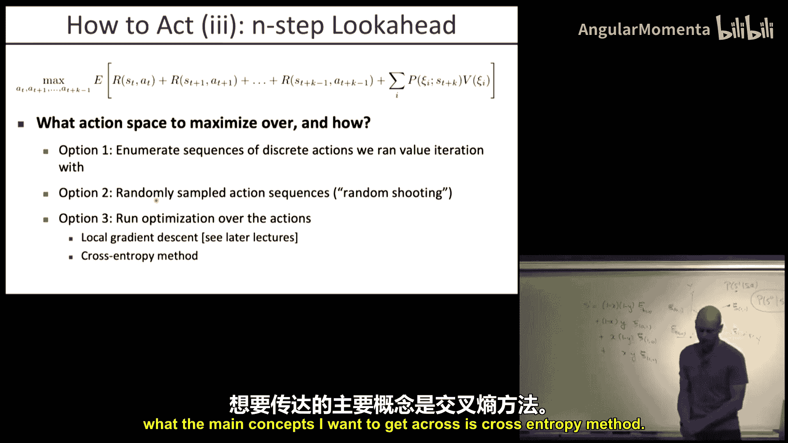

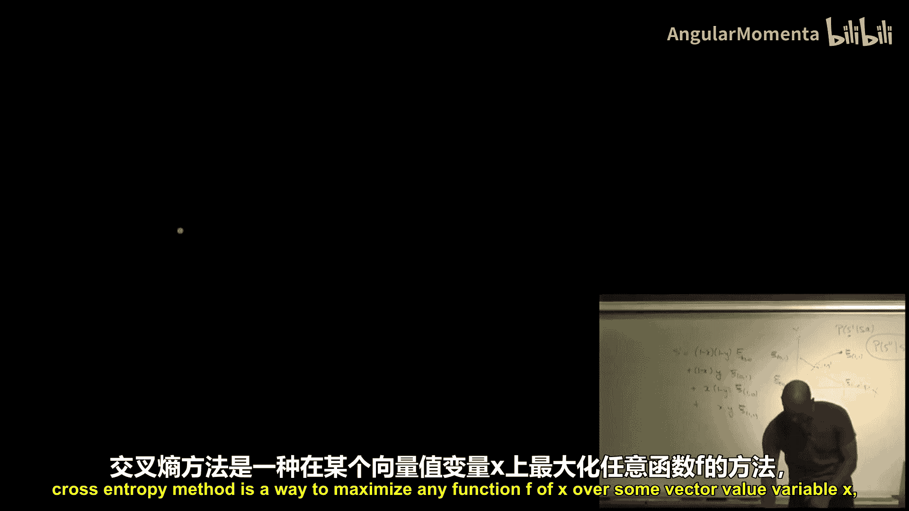

## 实例比较与总结

通过“双积分器”和“山地车”等经典控制问题的实验，可以清晰地看到不同离散化方法的效果：
*   **最近邻法**：即使使用很细的网格（如150x150），值函数传播也可能很慢、不自然，导致策略性能一般。
*   **双线性插值法**：即使使用较粗的网格（如20x20），值函数也能快速、平滑地传播，从而更快地得到高性能的策略。

实验表明，**随机插值法在大多数情况下显著优于简单的最近邻法**。

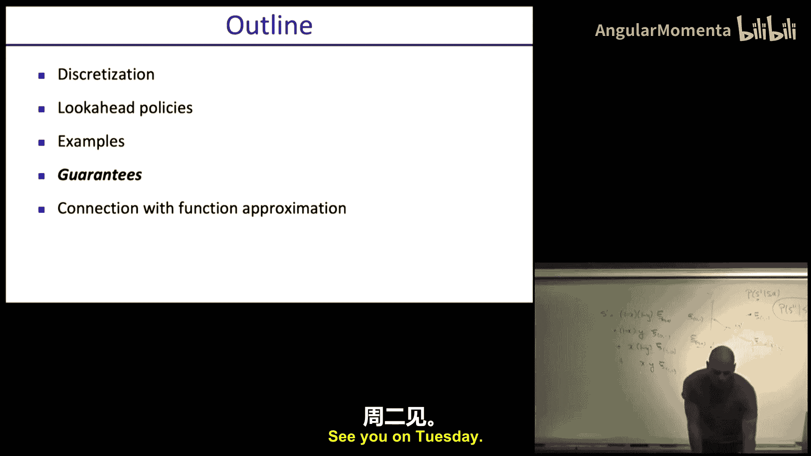

本节课中我们一起学习了如何通过离散化技术来处理连续状态空间的马尔可夫决策过程。我们探讨了状态和动作空间的离散化，重点介绍了两种构建转移模型的方法（最近邻法和随机插值法），并讨论了如何将离散解应用于连续环境（通过直接策略、一步前瞻或多步前瞻优化）。最后，我们介绍了用于动作序列优化的交叉熵方法，并通过实例看到了不同离散化方法对性能的重大影响。掌握这些技术，是解决机器人学中许多连续控制问题的重要基础。