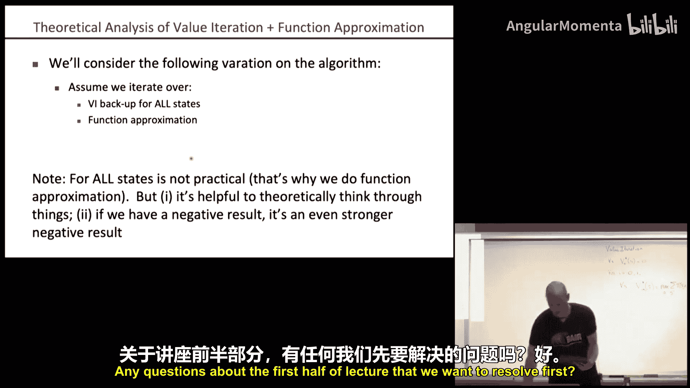
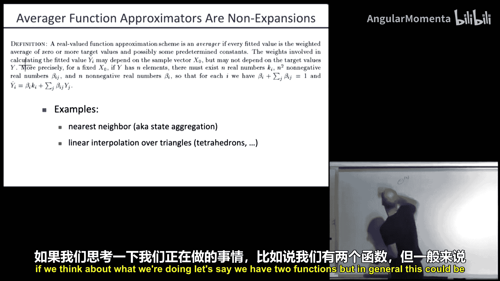
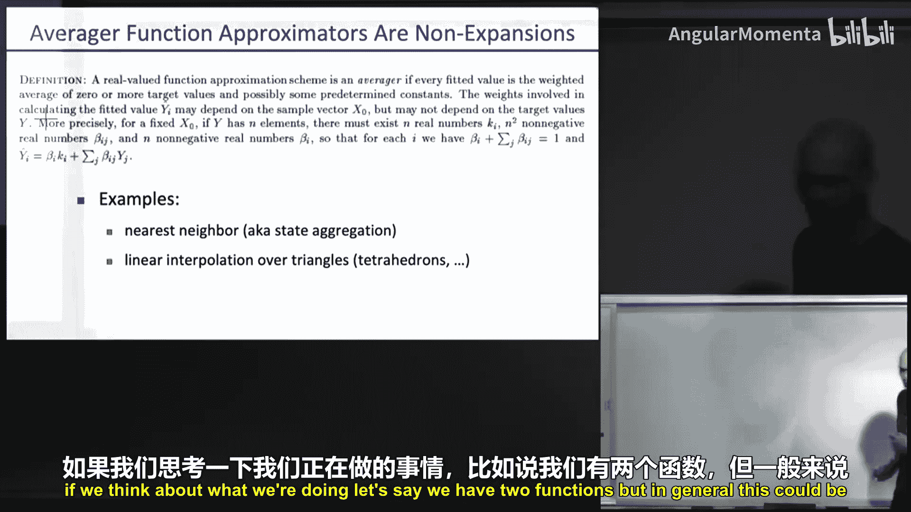
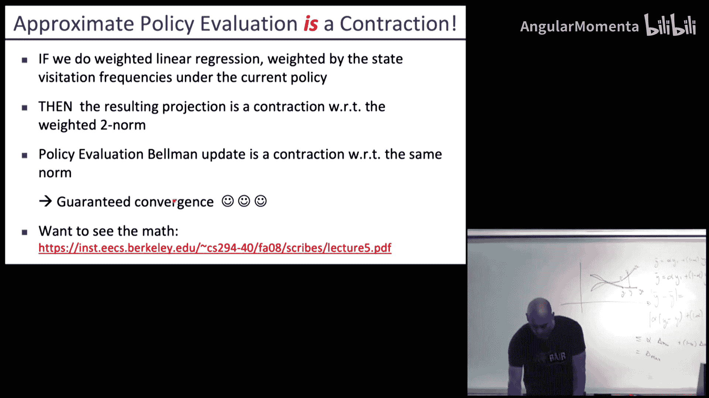
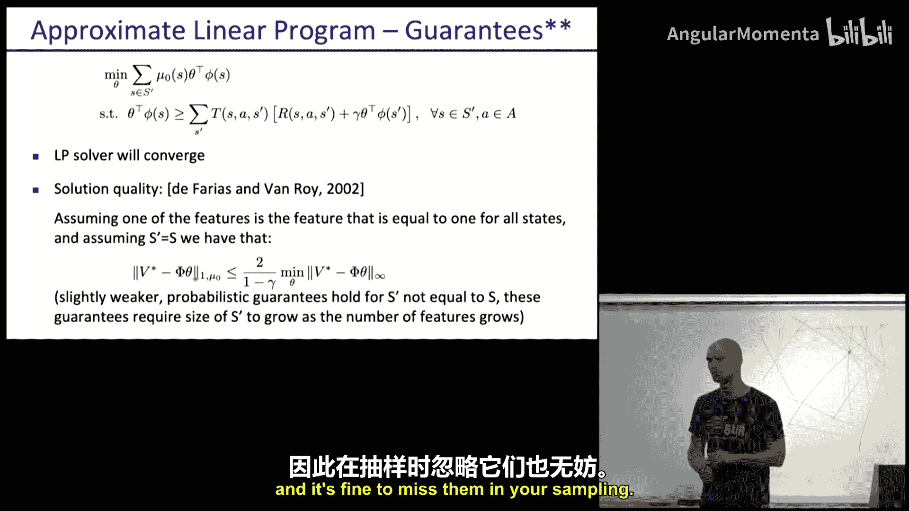

# 004：MDP与函数逼近 🧠

在本节课中，我们将学习如何将函数逼近技术应用于马尔可夫决策过程（MDP），以解决状态空间过大而无法枚举的问题。我们将重点探讨价值迭代与函数逼近的结合，并了解其潜在的挑战与理论保证。

## 概述

在之前的课程中，我们学习了价值迭代算法。其核心是贝尔曼更新，通过迭代计算每个状态的最优价值函数。然而，当状态空间非常庞大（例如连续状态空间或像俄罗斯方块这样的复杂游戏）时，为每个状态存储和更新价值变得不切实际。本节课，我们将引入**函数逼近**作为解决方案。我们将看到如何用参数化的函数（如线性模型或神经网络）来近似价值函数，并探讨这种方法的算法流程、潜在风险（如发散）以及确保收敛的理论条件。

---

## 价值迭代回顾 🔄

上一节我们介绍了价值迭代，本节我们先简要回顾其核心公式。

价值迭代算法从初始化所有状态的价值 `V_0*(s) = 0` 开始。
然后进行迭代，对于 `i = 0, 1, 2, ...`：
对于每一个状态 `s`，计算：
`V_{i+1}*(s) = max_a [ Σ_{s'} T(s, a, s') [ R(s, a) + γ * V_i*(s') ] ]`
其中，`argmax_a` 部分给出了最优策略。这被称为贝尔曼更新。

当状态空间很大时，算法中的“对于所有状态 `s`”这一步骤变得不可行。

---

## 引入函数逼近 🎯

为了解决大规模状态空间的问题，我们不再为每个状态存储一个单独的价值，而是使用一个参数化的函数 `V̂_θ(s)` 来近似真实的价值函数 `V*(s)`。参数 `θ` 的维度通常远小于状态数量。

**核心思想**：`V̂_θ(s) = θ^T · φ(s)`
其中，`φ(s)` 是将状态 `s` 映射到特征向量的函数，`θ` 是待学习的权重向量。

以下是函数逼近的几个实例：

*   **俄罗斯方块**：特征可能包括各列高度、相邻列高度差、最大列高、棋盘上的空洞数量等。
*   **吃豆人**：特征可能包括到最近幽灵的距离、到最近豆子的距离、剩余豆子数量等。
*   **连续状态空间**：可以使用最近邻插值，将状态 `s` 的价值表示为邻近离散状态价值的凸组合。
*   **线性/非线性模型**：价值可以是状态的线性函数、多项式函数，或者由神经网络表示。

使用函数逼近的优点是所需参数少，但缺点是近似函数可能无法精确表示真实的最优价值函数。

---

## 神经网络简介 🤖

函数逼近器可以是神经网络。神经网络受到大脑神经元结构的启发，由多层神经元组成。每个神经元对其输入进行加权求和，然后通过一个非线性激活函数（如Sigmoid、Tanh或ReLU）产生输出。

**通用近似定理**指出，只要一个两层神经网络拥有足够多的隐藏单元，它就可以以任意精度逼近任何连续函数。然而，过于强大的近似能力也可能导致**过拟合**，即模型过度拟合训练数据而在未见数据上表现不佳。防止过拟合的方法包括：减少网络规模、对权重进行正则化、以及使用早停法。

---

## 函数逼近价值迭代算法 ⚙️

现在，我们将函数逼近融入价值迭代框架。主要变化是我们无法再遍历所有状态。

**算法步骤**：

1.  **初始化**：随机初始化参数 `θ_0`（对于线性近似，可初始化为0）。
2.  **迭代**：对于 `i = 0, 1, 2, ...` 直到收敛：
    a. **采样状态**：从所有状态中采样一个子集 `S'`。
    b. **贝尔曼备份**：对于每个采样状态 `s ∈ S'`，计算目标价值：
       `v̄_{i+1}(s) = max_a Σ_{s'} T(s, a, s') [ R(s, a) + γ * V̂_{θ_i}(s') ]`
       这得到了一个（状态，目标价值）配对的数据集。
    c. **监督学习**：通过最小化均方误差，更新参数 `θ`，使近似价值函数拟合目标价值：
       `θ_{i+1} = argmin_θ Σ_{s∈S'} ( V̂_θ(s) - v̄_{i+1}(s) )^2`
       在实践中，我们通常进行梯度下降更新，并需要注意使用验证集防止过拟合。

**注意事项**：采样批次 `S'` 的大小是一个超参数。较小的批次更新更频繁，但价值估计的“精确步数”含义会减弱；较大的批次更接近精确更新，但计算成本更高。对于无限时域问题，批次大小通常根据计算效率选择。

---

## 理论挑战：发散问题 ⚠️

令人惊讶的是，即使函数逼近器能够精确表示真实的最优价值函数，上述算法也可能发散。

**一个反例**：
考虑一个简单的两状态MDP（状态 `x1` 和 `x2`），所有转移奖励均为0，因此最优价值函数 `V* = [0, 0]`。
我们使用一个简单的线性近似器：`φ(x1)=1`, `φ(x2)=2`，因此 `V̂_θ = [θ, 2θ]`。显然，当 `θ=0` 时，我们得到了精确的最优解。
然而，如果折扣因子 `γ > 5/6`，并且初始 `θ_0 ≠ 0`，那么执行上述函数逼近价值迭代算法会导致 `θ_i` 指数级增长至无穷大，从而完全发散。

这个反例表明，**贝尔曼备份算子**（收缩算子）与**最小二乘投影算子**（可能是一个扩张算子）的组合，可能导致整个迭代过程不稳定。

---

## 确保收敛：非扩张投影 🔒

为了获得收敛保证，我们需要函数逼近中的投影步骤是一个**非扩张映射**。如果一个算子 `G` 满足 `||GJ1 - GJ2|| ≤ ||J1 - J2||`，则称其关于范数 `||·||` 是非扩张的。

**关键定理**：如果贝尔曼备份算子 `F` 是关于某范数（如无穷范数）的 `γ`-收缩算子，而投影算子 `Π` 是关于**同一范数**的非扩张算子，那么组合算子 `Π · F` 也是一个收缩算子，从而迭代过程保证收敛。

**哪些投影算子是非扩张的？**
*   **最近邻插值**和**凸组合插值**（如上一讲中的随机插值）被证明是关于无穷范数的非扩张算子。
*   **直觉**：这类近似将状态价值表示为邻居价值的加权平均。两个函数在经过相同的平均操作后，其最大差异不会超过原始的最大差异。

相反，**最小二乘线性回归**投影通常不是关于无穷范数的非扩张算子，这解释了之前反例中的发散现象。

对于**策略迭代**，情况有所不同。如果在策略评估步骤中，使用根据当前策略的状态访问分布加权的线性回归，那么该投影是关于加权2-范数的收缩算子。结合策略评估贝尔曼算子的性质，可以保证策略迭代在函数逼近下的收敛性。

---

## 其他方法：线性规划视角 📐

我们也可以从线性规划（LP）的角度引入函数逼近。

原始的MDP线性规划公式为：
最小化 `Σ_s α(s) V(s)`，满足约束 `V(s) ≥ Σ_{s'} T(s, a, s')[ R(s, a) + γ V(s') ]` 对所有 `s, a`。
引入线性函数逼近 `V(s) ≈ θ^T φ(s)`，并只对采样的状态-动作对子集施加约束，我们得到一个约束更少的LP。

**优点**：LP求解器保证收敛，不存在发散问题。
**理论保证**：如果特征集包含一个恒为1的特征（用于提供偏移），并且在所有状态上求解，那么所得近似价值函数与最优价值函数之间的误差是有界的。即使只采样部分约束，由于LP的解通常只由少量关键约束决定，采样方法也能有很好的概率保证。

---

## 总结 🎓

本节课我们一起学习了如何利用函数逼近来处理大规模MDP问题。
1.  我们回顾了价值迭代，并指出了其在巨大状态空间下的局限性。
2.  引入了函数逼近的基本思想，即用参数化函数 `V̂_θ(s)` 近似价值函数。
3.  详细介绍了**函数逼近价值迭代算法**，它交替进行贝尔曼备份和监督学习拟合。
4.  通过一个反例，我们揭示了该算法可能**发散**的根本原因：最小二乘投影可能不是非扩张算子。
5.  为了确保收敛，我们需要使用关于适当范数的**非扩张投影算子**，如某些插值方法。策略迭代在加权线性回归下能有更好的理论保证。
6.  最后，我们简要介绍了基于**线性规划的函数逼近方法**，该方法能避免发散问题并提供误差界限。

理解这些理论特性对于在实践中安全有效地应用强化学习至复杂问题至关重要。