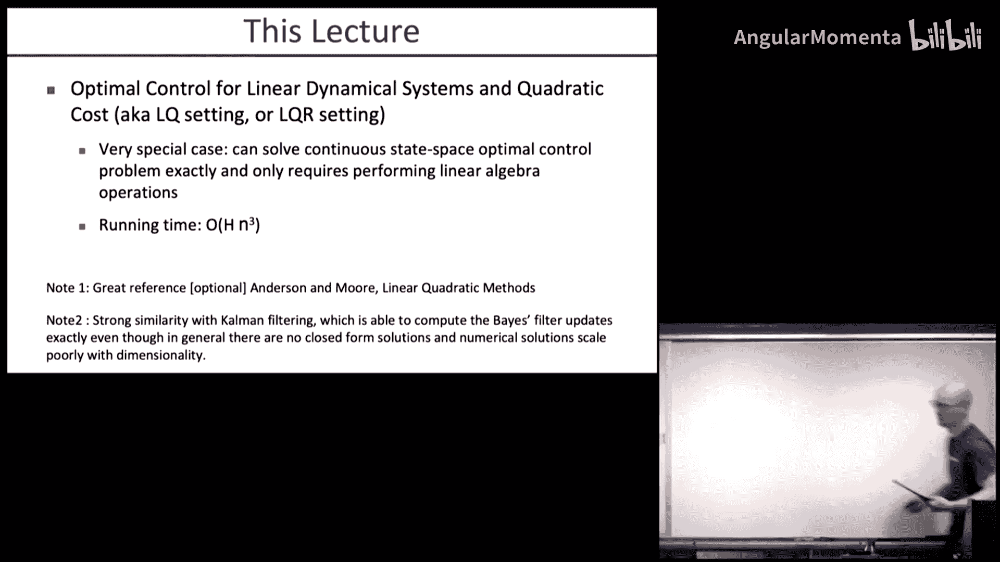
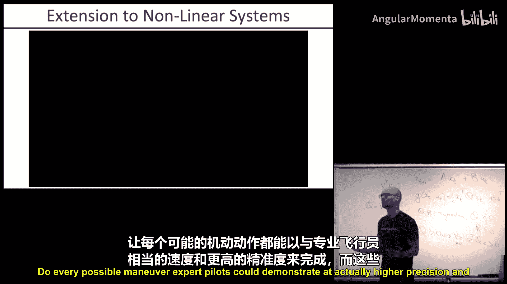
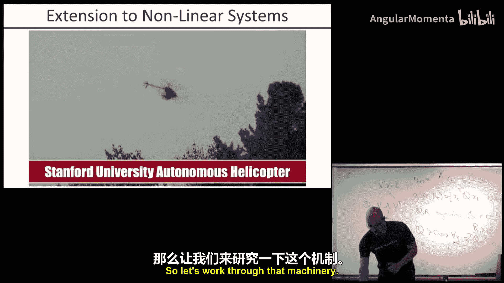
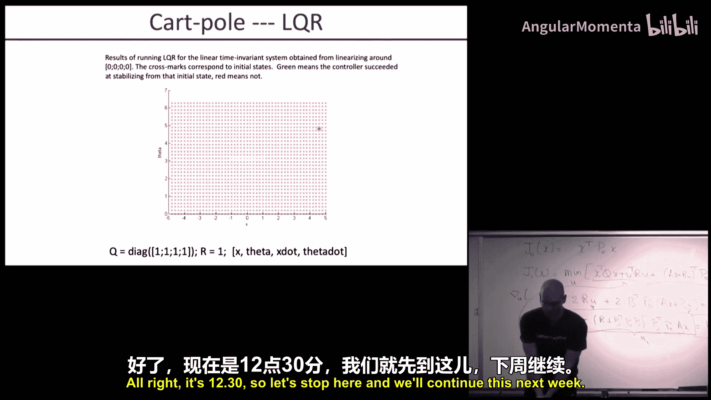

# 005：线性二次型调节器（LQR）

在本节课中，我们将学习线性动力系统和二次型成本下的最优控制，即线性二次型调节器（LQR）。这是一个看似特殊但应用广泛的核心方法，能够为连续状态空间问题提供精确解，且计算高效。

## 概述

在之前的课程中，我们讨论了贝尔曼维数灾难问题。对于一个n维状态空间，若每维有10个离散化级别，总状态数将达到10^n。这使得基于离散化的动态规划方法在状态维度超过5或6时变得计算上不可行。

本节将介绍一种特殊情况：线性动力系统和二次型成本。在此设定下，我们可以精确求解连续状态空间的最优控制问题，且仅需一些线性代数运算，计算复杂度为O(H * n^3)，其中H是时间步长，n是状态维度。这使得该方法对于许多实际问题非常实用。

## LQR 问题设定

LQR设定基于以下两个核心假设：

1.  **线性动力系统**：状态转移是线性的。
    `x_{t+1} = A * x_t + B * u_t`
    其中，`x_t` 是t时刻的状态，`u_t` 是t时刻的控制输入，A和B是系统矩阵。

2.  **二次型成本函数**：每一步的成本是状态和控制的二次型。
    `g(x_t, u_t) = x_t^T * Q * x_t + u_t^T * R * u_t`
    其中，Q和R是对称正定矩阵。这意味着成本函数在原点（零状态、零控制）处取得最小值0，且在其他任何地方成本都为正。

**关于对称正定矩阵的说明**：
*   **对称性**：即使使用非对称矩阵，实际起作用的也只是其对称部分。因此，直接假设Q和R对称可以简化问题表述。
*   **正定性**：这确保了成本函数具有唯一的最小值（在原点），避免了系统为追求负无穷成本而趋向无穷大的无意义情况。

## LQR 的精确求解：动态规划

上一节我们定义了问题，本节我们来看看如何利用动态规划思想精确求解LQR问题。我们从最终时刻开始，逆向推导最优价值函数和策略。

我们从零步剩余（即最终时刻）的价值函数开始定义：
`J_0(x) = x^T * P_0 * x`
通常，我们可以设 `P_0 = 0`，表示没有终端成本。也可以根据对终端状态的偏好设置其他正定矩阵 `P_0`。

对于一步剩余的情况，价值函数为：
`J_1(x) = min_u [ x^T Q x + u^T R u + J_0(Ax + Bu) ]`
将 `J_0` 的表达式代入，并对 `u` 求梯度，令其为零，可以解出最优控制 `u*`。

求解过程得到以下关键结果：
1.  最优控制是状态的线性反馈：
    `u* = K_1 * x`，其中 `K_1 = -(R + B^T P_0 B)^{-1} B^T P_0 A`
2.  一步剩余的价值函数 **仍然保持为状态的二次型**：
    `J_1(x) = x^T * P_1 * x`
    其中 `P_1 = Q + K_1^T R K_1 + (A + B K_1)^T P_0 (A + B K_1)`

这个结果非常美妙：虽然我们进行了一步动态规划备份，但价值函数的形式没有改变（仍是二次型）。这意味着我们可以重复这个过程。

对于i步剩余的情况，我们可以迭代计算：
`K_i = -(R + B^T P_{i-1} B)^{-1} B^T P_{i-1} A`
`P_i = Q + K_i^T R K_i + (A + B K_i)^T P_{i-1} (A + B K_i)`

最终，对于有限时域H的问题，最优策略是在每个时刻t使用对应的反馈矩阵 `K_{H-t}`：
`π_t(x) = K_{H-t} * x`
而状态x的预期总成本为 `x^T * P_H * x`。

对于无限时域问题，只要存在一个策略能将状态驱动到零，序列 `{P_i}` 就会收敛到一个稳态值 `P_∞`，此时可以使用恒定的反馈矩阵 `K_∞`。

## LQR 的扩展与应用

我们已经掌握了LQR的核心求解方法。然而，现实世界中的系统往往是非线性的。本节中，我们来看看如何以LQR为核心，解决更一般的非线性系统控制问题。

### 围绕平衡点的镇定

对于非线性系统 `x_{t+1} = f(x_t, u_t)`，假设存在一个平衡点 `(x*, u*)` 使得 `x* = f(x*, u*)`（例如，直升机悬停、倒立摆直立）。我们的目标是在该点附近进行镇定。

方法是在平衡点处对系统进行一阶泰勒展开：
`x_{t+1} ≈ x* + A (x_t - x*) + B (u_t - u*)`
其中 `A = ∂f/∂x`, `B = ∂f/∂u` 在 `(x*, u*)` 处计算。

定义新的状态和控制变量 `z_t = x_t - x*`, `v_t = u_t - u*`，则系统变为：
`z_{t+1} = A z_t + B v_t`
这正好是标准的LQR形式。我们可以为其设计一个二次型成本（惩罚 `z_t` 和 `v_t`），然后应用之前的LQR方法求解反馈矩阵 `K`。实际控制时：
`u_t = u* + K (x_t - x*)`

### 轨迹跟踪

如果我们希望系统跟踪一条给定的状态-控制参考轨迹 `{x*_t, u*_t}`（而不仅仅是一个点），可以使用类似的思想。

在轨迹的每个点 `(x*_t, u*_t)` 处线性化系统：
`x_{t+1} ≈ x*_{t+1} + A_t (x_t - x*_t) + B_t (u_t - u*_t)`
其中 `A_t = ∂f/∂x`, `B_t = ∂f/∂u` 在 `(x*_t, u*_t)` 处计算。

定义偏差 `z_t = x_t - x*_t`, `v_t = u_t - u*_t`，得到**线性时变系统**：
`z_{t+1} = A_t z_t + B_t v_t`
我们可以为这个时变系统设计一个二次型成本（惩罚跟踪误差 `z_t` 和控制偏差 `v_t`），并使用LQR方法（此时A，B，K，P都随时间变化）求解出一组时变的反馈增益 `K_t`。实际控制律为：
`u_t = u*_t + K_t (x_t - x*_t)`

### 迭代线性二次型调节器（iLQR）

当没有现成的参考轨迹时，我们可以使用迭代线性二次型调节器（iLQR）来自动寻找最优轨迹和控制器。这是一个基于LQR的迭代优化算法。

以下是iLQR的基本步骤：

1.  **初始化**：选择一个初始控制策略（例如全零），并前向模拟（滚动）系统，得到一条初始轨迹 `{x^0_t, u^0_t}`。
2.  **线性化与二次化**：围绕当前轨迹，对动力学进行一阶泰勒展开，对成本函数进行二阶泰勒展开，得到一个局部近似的线性时变二次型问题。
3.  **LQR求解**：对这个局部问题应用LQR反向传播，计算出一组改进的反馈增益 `K_t` 和前馈项（如果考虑非零目标），从而定义一个新的控制策略 `u_t = u^0_t + K_t (x_t - x^0_t) + k_t`（前馈项）。
4.  **前向滚动与迭代**：使用新策略前向滚动系统，得到一条新轨迹。检查新轨迹的成本是否降低。如果成本降低，则接受更新，并以新轨迹为起点重复步骤2-4。如果成本没有降低，则增强“保持在原轨迹附近”的惩罚权重，并重新求解步骤3，以采取更保守的更新步长（这类似于信赖域方法）。

通过反复迭代，iLQR通常能收敛到一个局部最优的轨迹和对应的线性反馈控制器。

### 模型预测控制（MPC）与实时重规划

iLQR在离线计算一条开环轨迹和反馈增益。然而，在实际执行时，由于模型误差和外部扰动，系统会偏离计划轨迹。

为了提高鲁棒性，可以采用模型预测控制（MPC）框架：
*   在每个控制时刻t，以当前实际状态为起点，在较短的时间窗口 `[t, t+T]` 内在线运行iLQR进行重新规划。
*   只执行重新规划得到的第一个控制命令。
*   在下一时刻，重复这个过程。

这种方法结合了前馈（计划）和反馈（重规划）的优点，能有效处理扰动和模型不确定性。通常，短时域（如10-20步）的重规划就足以将系统拉回参考轨迹附近，之后可以使用离线计算的全局价值函数作为终端成本。

## 总结

本节课我们一起学习了线性二次型调节器（LQR）这一核心的最优控制方法。我们从线性系统和二次型成本这一特殊但可精确求解的情况出发，推导了通过动态规划迭代求解最优线性反馈控制律的过程。

更重要的是，我们探讨了如何将LQR作为基础模块，通过线性化、二次化和迭代优化，将其强大的能力扩展到非线性系统的镇定、轨迹跟踪以及全局优化问题中。iLQR和基于MPC的实时重规划是两种非常有效的策略，使得LQR家族的方法能够应用于像自主直升机飞行这样的复杂、高度非线性任务。

LQR的成功关键在于它巧妙地将复杂的动态规划问题转化为高效的线性代数运算，同时其线性反馈的形式在理论上优雅，在实践中强大且易于实现。