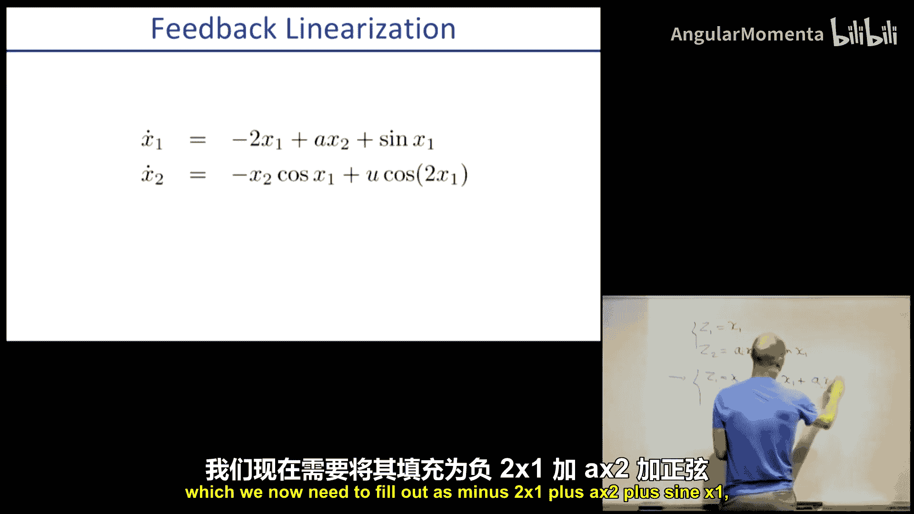
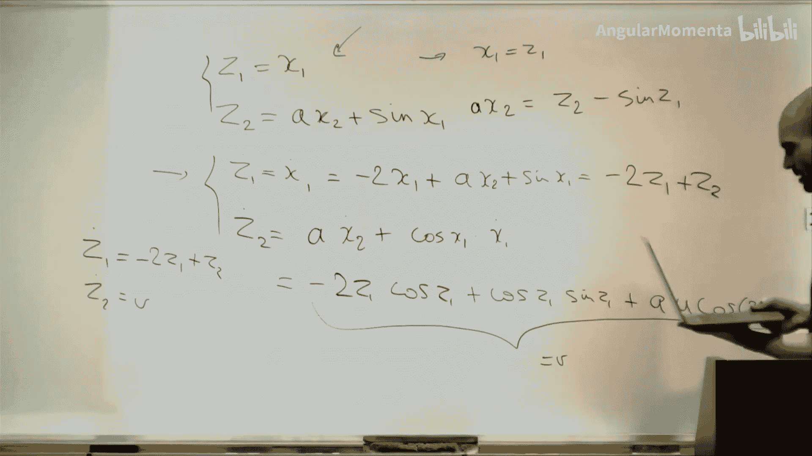
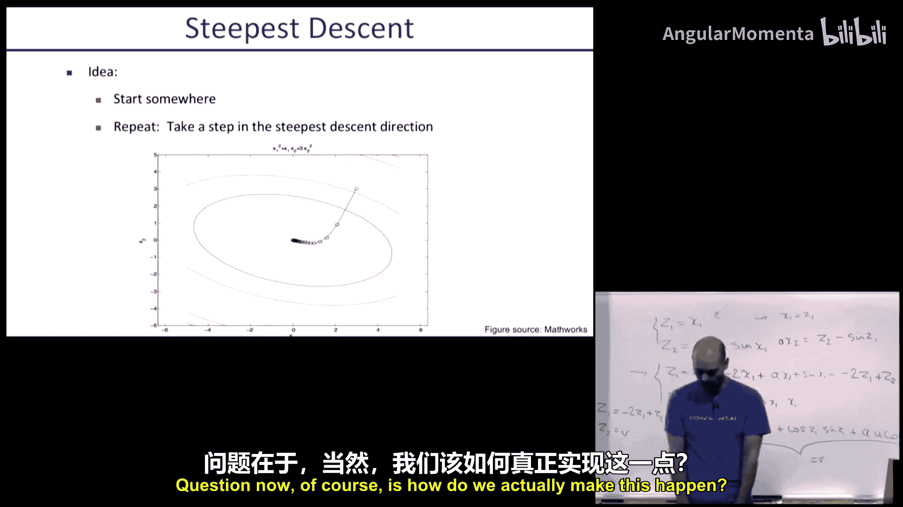
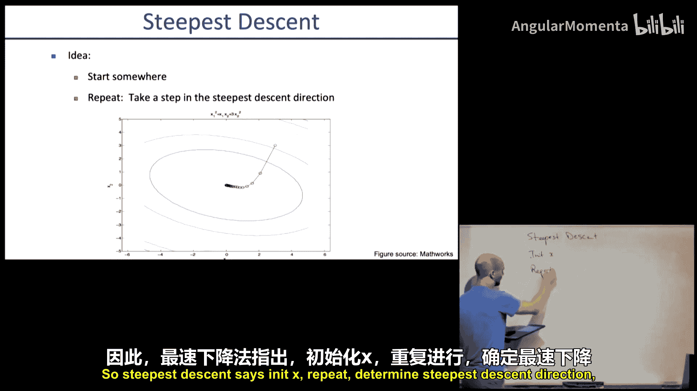
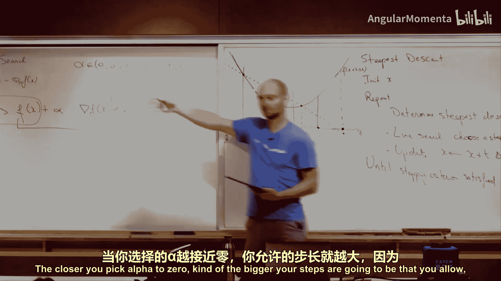
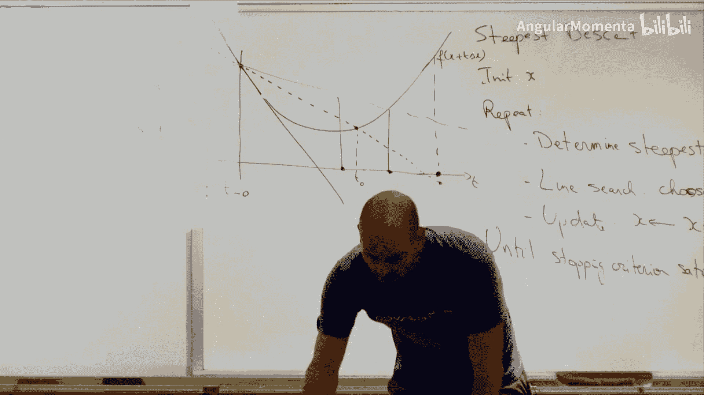
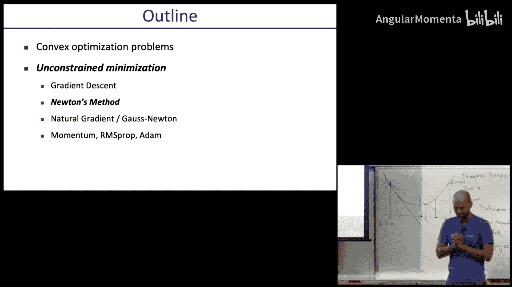

# 006：无约束（凸）优化

在本节课中，我们将要学习无约束优化问题，特别是凸优化问题。我们将从回顾上一讲的内容开始，然后深入探讨如何利用梯度信息高效地寻找函数的最小值点。

上一节我们介绍了线性二次型调节器及其在非线性系统中的应用。本节中，我们来看看如何将最优控制问题形式化为一个更通用的优化问题，并学习解决这类问题的基础方法。

## 课程回顾与问题引入

我们之前研究了线性二次型调节器，它基于线性系统和二次型成本函数的特定假设。我们发现，即使状态空间是连续的，也可以通过迭代矩阵更新来精确求解，得到反馈矩阵和二次型成本函数。

然而，实际系统往往是非线性的，并且控制输入可能受到限制。为了处理更一般的问题，我们需要将其形式化为一个优化问题：

**目标**：最小化成本函数 `J = sum_{t=0}^{T-1} g_t(x_t, u_t) + g_T(x_T)`

**约束**：
1.  动力学约束：`x_{t+1} = f_t(x_t, u_t)`
2.  状态与输入约束：`x_t ∈ X_t`, `u_t ∈ U_t`

直接求解这个带约束的优化问题非常困难。但有一类称为**凸优化**的问题可以高效求解。本节课，我们先关注**无约束优化**问题，即只最小化目标函数 `f(x)`，不考虑其他约束。这将是解决更复杂问题的基础。

## 无约束最小化

无约束最小化问题的核心是找到使函数 `f(x)` 值最小的 `x`。从数学上讲，最优解 `x*` 满足：
*   **一阶必要条件**：梯度为零，`∇f(x*) = 0`
*   **二阶充分条件**：海森矩阵正定，`∇²f(x*) ≻ 0`（对于凸函数自动满足）

对于简单问题，可以直接求解梯度为零的方程组。但对于复杂问题，通常需要迭代方法。

### 梯度下降法

梯度下降法是一种直观的迭代优化算法。其核心思想是：在当前位置，沿着函数值下降最快的方向（负梯度方向）前进一小步，逐步逼近最小值点。

算法步骤如下：
1.  初始化起点 `x`。
2.  重复以下步骤直到满足停止条件（如梯度范数足够小）：
    a.  **确定下降方向**：计算负梯度 `∆x = -∇f(x)`。
    b.  **线搜索**：选择一个步长 `t > 0`。
    c.  **更新**：`x ← x + t * ∆x`。

以下是该算法的两个关键组成部分的详细说明。

#### 1. 最速下降方向

为什么负梯度方向是局部下降最快的方向？考虑在点 `x0` 附近对函数进行一阶泰勒展开：
`f(x0 + ∆x) ≈ f(x0) + ∇f(x0)^T ∆x`

如果我们只能在以 `x0` 为中心、半径为 `ε` 的小球内移动，即 `||∆x|| ≤ ε`，那么使上述近似值最小的 `∆x` 是：
`∆x = - (ε / ||∇f(x0)||) * ∇f(x0)`
这表明，在给定步长限制下，沿着负梯度方向移动能使函数值下降最多。因此，我们通常直接取 `∆x = -∇f(x)` 作为下降方向。

#### 2. 步长选择：线搜索

确定了方向后，需要决定沿该方向走多远。**精确线搜索**旨在找到使函数值最小的最优步长：
`min_{t>0} f(x + t * ∆x)`

但在实践中，精确求解这个一维优化问题可能代价高昂。更常用的方法是**回溯线搜索**，它是一种启发式但具有理论保证的方法。

回溯线搜索算法如下：
1.  选择参数 `α ∈ (0, 0.5)`, `β ∈ (0, 1)`。通常 `β` 接近1（如0.8）。
2.  初始步长 `t = 1`。
3.  **循环**：当 `f(x + t∆x) > f(x) + α t ∇f(x)^T ∆x` 时，执行 `t ← β * t`。
4.  退出循环后，采用当前的 `t` 进行更新。

这个条件的直观解释是：我们不仅要求新点的函数值比当前点低，还要求其下降幅度至少是梯度预测下降量（`∇f(x)^T ∆x` 为负值）的 `α` 倍。由于函数可能是弯曲的（凸函数），线性预测可能过于乐观。参数 `α` 降低了对下降幅度的期望，确保我们只接受那些线性近似仍然可靠的步长。如果条件不满足，说明步长太大，线性近似失效，因此需要缩小步长。

### 收敛性与挑战

梯度下降法可以保证收敛到局部最优解（对于凸函数则是全局最优解）。然而，其收敛速度受问题**条件数**的影响很大。条件数定义为海森矩阵最大特征值与最小特征值的比值：
`条件数 κ = λ_max / λ_min`

当 `κ` 很大时（即等高线非常扁长），梯度下降会呈现“之字形”路径，收敛缓慢。这是因为梯度方向并不直接指向最小值点。

以下是一个二次函数 `f(x) = x1² + γ * x2²` 的例子：
*   当 `γ = 1` 时，等高线是圆形，梯度指向圆心，一步即可到达最优解。
*   当 `γ` 远大于或远小于1时，等高线是椭圆，梯度下降需要多次迭代。

在高维问题中，大条件数几乎不可避免，因此朴素的梯度下降可能很慢。

## 总结

本节课中我们一起学习了无约束优化问题的基础。
*   我们将最优控制问题形式化为一个可处理的优化框架。
*   我们介绍了**梯度下降法**，其核心是沿着负梯度方向迭代更新。
*   我们详细探讨了如何确定**最速下降方向**以及通过**回溯线搜索**选择步长。
*   最后，我们指出了梯度下降法的主要限制：收敛速度受问题条件数影响，在病态问题上可能很慢。

在下一讲中，我们将介绍牛顿法、共轭梯度法等更高级的优化技术，它们通过利用二阶信息或改变搜索方向来改善收敛速度，尤其适用于病态问题。这些方法是我们解决实际机器人学中复杂优化问题的强大工具。