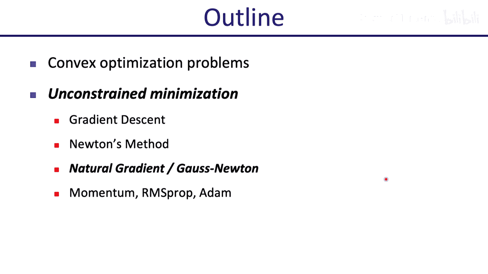
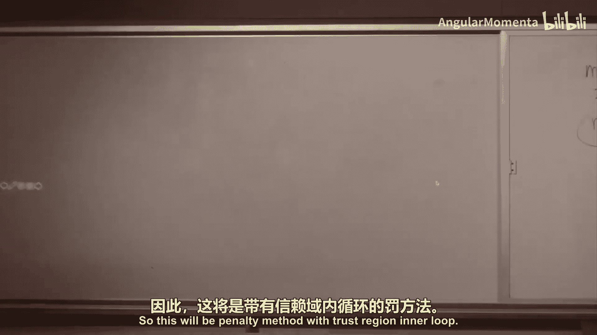
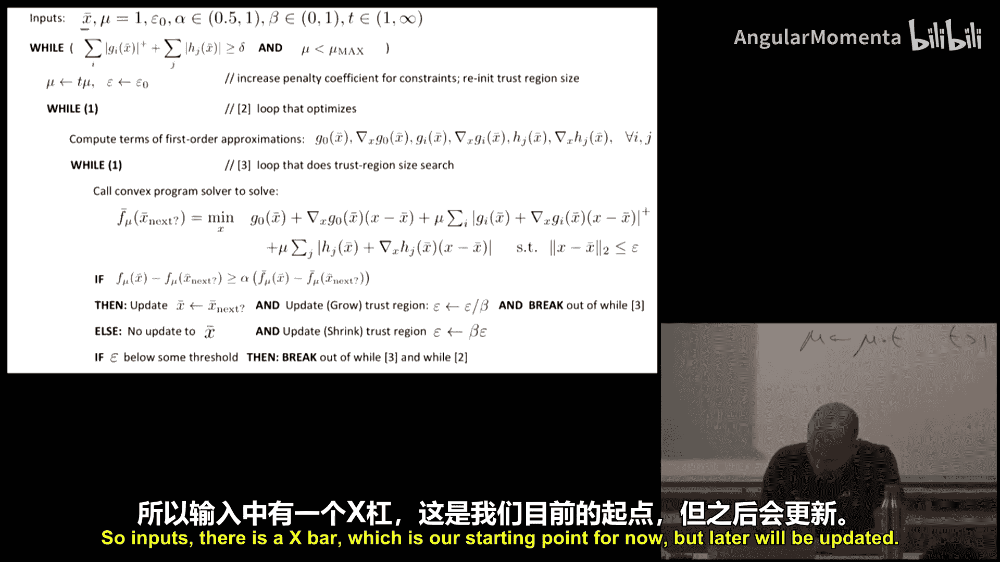
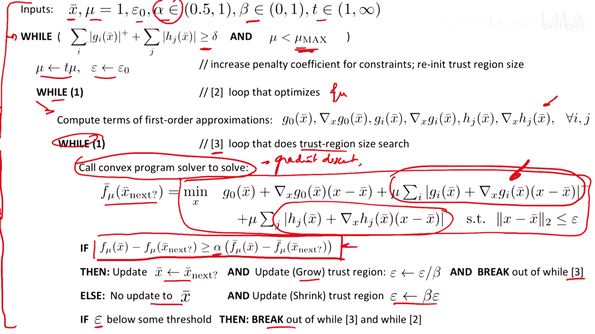
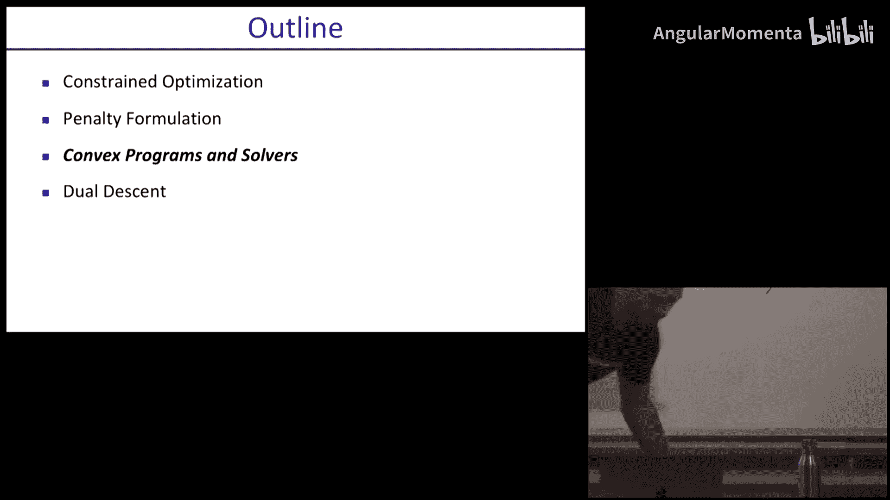
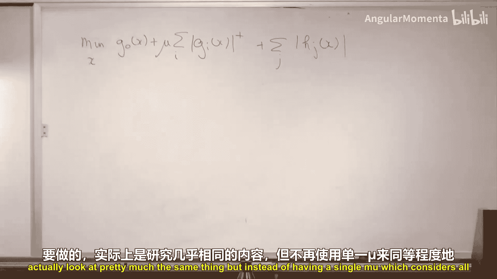

# 007：约束优化

在本节课中，我们将要学习约束优化。首先，我们会继续讨论无约束优化，介绍牛顿法及其变种。然后，我们将转向约束优化问题，学习如何使用惩罚函数法将其转化为一系列无约束优化问题来求解。

## 无约束优化回顾

上一节我们介绍了无约束优化，目标是找到函数的最小值。我们看到了一个例子：函数 `F(x) = 0.5 * x1^2 + gamma * x2^2`。其等高线是同心椭圆，`gamma` 的值决定了椭圆的扁率。

如果椭圆非常扁长（`gamma` 远大于或远小于1），梯度下降法会沿着陡峭的方向来回振荡，收敛速度很慢。问题的关键在于目标函数海森矩阵的特征值之比（条件数）过大。在高维问题中，条件数差几乎是常态。

## 牛顿法

为了更高效地解决条件数差的问题，我们引入牛顿法。牛顿法使用函数的二阶近似，而不仅仅是梯度信息。

### 核心思想

假设我们在点 `x`，考虑一个小的变化 `Δx`。函数 `F` 的二阶泰勒近似为：
`F(x + Δx) ≈ F(x) + ∇F(x)^T Δx + 0.5 * Δx^T H(x) Δx`
其中 `H(x)` 是 `F` 在 `x` 点的海森矩阵（二阶导数矩阵）。

为了找到使这个近似函数最小的 `Δx`，我们对其求导并令其为零：
`∇F(x) + H(x) Δx = 0`
由此得到牛顿步：
`Δx = -H(x)^{-1} ∇F(x)`

### 算法步骤

以下是牛顿法的基本算法：
1.  选择初始点 `x` 和收敛容差。
2.  计算牛顿步 `Δx = -H(x)^{-1} ∇F(x)`。
3.  计算预测改进量 `λ^2 = Δx^T H(x) Δx`。如果 `0.5 * λ^2` 小于容差，则停止。
4.  使用回溯线搜索确定步长，确保实际函数值充分下降。
5.  更新 `x = x + 步长 * Δx`，返回步骤2。

### 重要性质

*   **收敛速度快**：在最优解附近，牛顿法具有二次收敛速度，远快于梯度下降的线性收敛。
*   **仿射不变性**：对变量进行线性变换（`x = A y`），牛顿法产生的迭代序列也会相应线性变换，因此收敛行为不受坐标系选择的影响。

### 注意事项

*   **海森矩阵正定**：牛顿步要求海森矩阵 `H(x)` 正定，以保证局部近似是“碗状”的。如果不正定，可以给 `H(x)` 加上一个足够大的单位矩阵倍数（`H(x) + λI`），使其正定。
*   **计算成本**：计算和存储海森矩阵及其逆矩阵在维度很高时成本巨大。

## 拟牛顿法与自然梯度

为了解决牛顿法的计算成本问题，发展出了拟牛顿法。它们试图近似海森矩阵或其逆矩阵，从而以更低的成本获得二阶信息的好处。

一个相关的概念是**自然梯度**，它常用于优化概率分布的参数。

### 自然梯度动机

当我们优化一个参数化概率分布 `p(x|θ)` 的参数 `θ` 时（例如最大似然估计），不同的参数化方式（如用均值方差 vs 均值精度）不应影响优化路径。自然梯度旨在对参数化方式保持不变。

### 自然梯度推导

考虑最大化对数似然函数 `F(θ) = Σ_i log p(x_i | θ)`。其梯度为 `∇F(θ) = Σ_i ∇log p(x_i | θ)`。

完整的海森矩阵计算复杂。自然梯度法忽略其中涉及二阶导数的部分，只保留由一阶导数外积组成的部分，作为海森矩阵的近似：
`H̃(θ) ≈ - Σ_i [∇log p(x_i | θ)] [∇log p(x_i | θ)]^T`
这个近似矩阵是负定的，保证了局部模型的正确形状。然后，更新步长为：
`Δθ ∝ H̃(θ)^{-1} ∇F(θ)`

自然梯度法计算更快，保证了下降方向，并且对概率分布的重参数化具有不变性。

## 梯度下降的改进方法

在讨论约束优化之前，我们简要回顾两种改进梯度下降的方法，它们也利用了历史梯度信息。

以下是两种常用方法：

*   **带动量的梯度下降**：引入速度变量 `v`，更新规则为 `v = β * v + (1-β) * ∇F(x)`，`x = x + α * v`。这有助于平滑振荡方向的更新，在持续下降的方向上积累动量。
*   **RMSProp/Adam**：这类方法自适应地调整每个参数的学习率。它们计算梯度平方的指数移动平均 `s`，更新时用梯度除以 `sqrt(s + ε)`。这相当于在梯度变化剧烈的方向上减小步长，在稳定的方向上增大步长。Adam 方法结合了动量和自适应学习率的思想。

## 约束优化

现在，我们正式进入约束优化的主题。约束优化问题形式如下：
最小化 `g_0(x)`
满足 `g_i(x) ≤ 0`， `i = 1, ..., m`
以及 `h_j(x) = 0`， `j = 1, ..., p`

### 惩罚函数法

惩罚函数法的核心思想是将约束违反作为惩罚项加入目标函数，从而将约束问题转化为一系列无约束问题。

我们定义**价值函数**：
`F_μ(x) = g_0(x) + μ * [ Σ_i max(0, g_i(x)) + Σ_j |h_j(x)| ]`
其中 `μ > 0` 是惩罚系数。

*   当 `x` 满足所有约束时，惩罚项为零，我们就在优化原目标 `g_0(x)`。
*   当 `x` 违反约束时，惩罚项为正，增加了目标函数值，促使优化过程回到可行域。

#### 算法框架

我们通过一个外层循环来增大 `μ`：
1.  初始化 `μ` 为一个较小的值（如1）。
2.  固定 `μ`，使用无约束优化方法（如梯度下降、牛顿法或下面介绍的置信域方法）最小化 `F_μ(x)`，得到解 `x*`。
3.  检查约束违反程度。如果仍然较大，则令 `μ = t * μ`（`t > 1`， 如10），返回步骤2。否则，算法结束。

当 `μ` 足够大时，约束违反的代价极高，最终解将（近似）满足所有约束。

### 置信域方法求解内层问题

对于内层无约束优化 `min F_μ(x)`，一个特别有效的方法是**线性近似置信域方法**。它特别适合处理 `F_μ(x)` 中由 `max` 和 `|·|` 函数引起的非光滑性。

在每次迭代中，我们在当前点 `x̄` 对 `g_0`, `g_i`, `h_j` 进行一阶泰勒展开，但保留 `max` 和 `|·|` 操作：
`min_x g_0(x̄) + ∇g_0(x̄)^T (x - x̄) + μ * Σ_i max(0, g_i(x̄) + ∇g_i(x̄)^T (x - x̄)) + μ * Σ_j |h_j(x̄) + ∇h_j(x̄)^T (x - x̄)|`
同时，要求新点 `x` 不能离 `x̄` 太远，即满足**置信域约束**：`||x - x̄|| ≤ ε`。

这个子问题是一个**凸优化问题**，可以高效求解。求解后，我们像在牛顿法中一样，检查实际函数下降是否与模型预测的下降成比例，从而决定是否接受该步，并动态调整置信域大小 `ε`。

整个算法包含三层循环：外层增大 `μ`，中层在固定 `μ` 下优化 `F_μ`，内层求解置信域子问题。尽管循环多，但对于中小规模的机器人控制问题，它通常非常高效。

### 对偶上升法

最后，我们简要提一下**对偶上升法**，它与惩罚函数法思想相近。

考虑约束优化问题的拉格朗日函数：
`L(x, λ, ν) = g_0(x) + Σ_i λ_i g_i(x) + Σ_j ν_j h_j(x)`， 其中 `λ_i ≥ 0`。

原问题等价于 `min_x max_{λ≥0, ν} L(x, λ, ν)`。对偶上升法交替优化：
1.  **x-更新**：固定 `λ, ν`，最小化 `L(x, λ, ν)` 得到 `x`。
2.  **对偶变量更新**：固定 `x`，通过对偶变量做梯度上升来最大化 `L`。梯度很简单：`∇_{λ_i} L = g_i(x)`， `∇_{ν_j} L = h_j(x)`。更新为 `λ_i = max(0, λ_i + α * g_i(x))`， `ν_j = ν_j + α * h_j(x)`。

这种方法为每个约束引入了独立的乘子（`λ_i`, `ν_j`），而不是像惩罚函数法那样使用统一的 `μ`。它在每次迭代中自适应地调整对各约束的关注程度。

## 总结

本节课中我们一起学习了：
1.  **牛顿法**：利用二阶导数信息，收敛速度快，具有仿射不变性，但计算海森矩阵成本高。
2.  **自然梯度**：针对概率分布参数优化，对重参数化不变，使用费雪信息矩阵作为海森矩阵的近似。
3.  **约束优化**：通过**惩罚函数法**将约束问题转化为一系列无约束问题。求解内层问题时，可采用**线性近似置信域方法**，它将非光滑的惩罚项线性化后形成凸子问题高效求解。
4.  **对偶上升法**：作为惩罚函数法的替代，通过交替优化原变量和对偶变量来求解约束问题。

下一节课，我们将更深入地探讨用于求解内层凸子问题的凸优化算法。