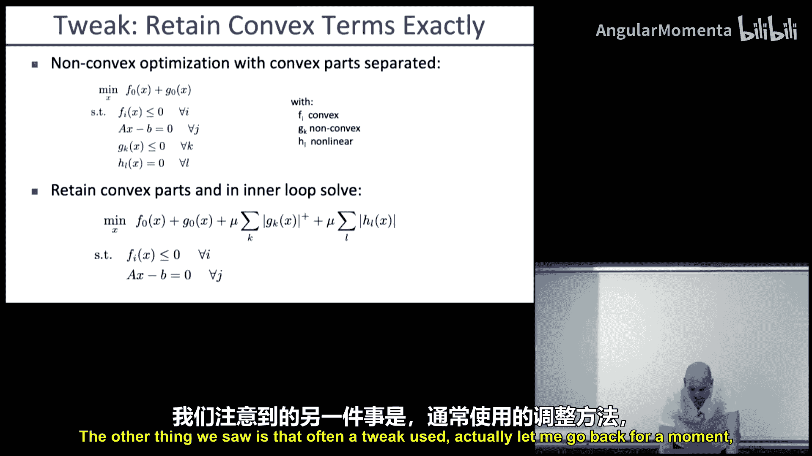
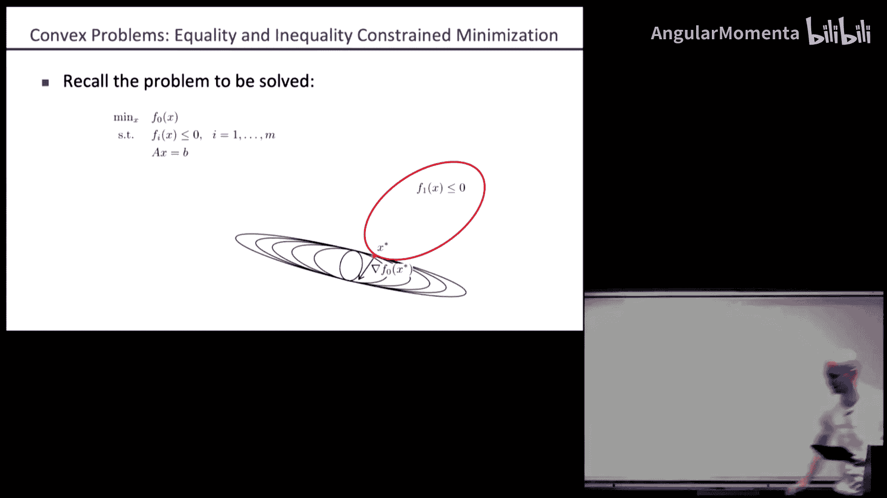
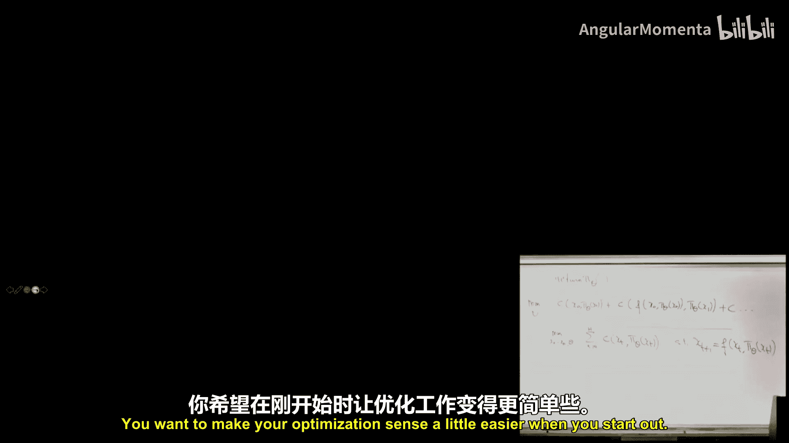
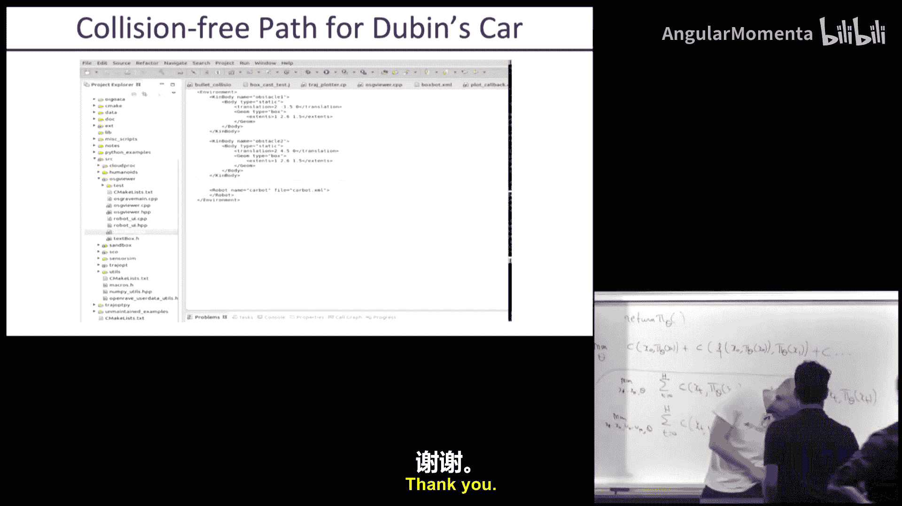

# 008：配点法、打靶法、模型预测控制 🚀

在本节课中，我们将学习如何将最优控制问题表述为优化问题，并探讨不同的求解方法，包括打靶法、配点法和模型预测控制。我们还将回顾约束优化的核心概念，特别是处理等式和不等式约束的方法。

---




## 概述 📋

本节课分为两部分。第一部分，我们将回顾约束优化的核心方法，特别是处理等式和不等式约束的算法。第二部分，我们将探讨如何将最优控制问题转化为优化问题，并分析不同表述方式（打靶法 vs. 配点法）的优缺点。

---

## 第一部分：约束优化回顾 🔧

上一讲我们介绍了约束优化问题，其形式为最小化目标函数，同时满足一系列不等式和等式约束。我们学习了惩罚函数法，通过将约束违反程度作为惩罚项加入目标函数，将约束问题转化为无约束问题来求解。

### 惩罚函数法

惩罚函数法的核心思想是将原约束问题转化为一系列无约束问题。其数学形式如下：

**原问题：**
```
minimize f(x)
subject to g_i(x) ≤ 0, h_j(x) = 0
```

**惩罚函数形式：**
```
minimize f(x) + μ * [ Σ max(0, g_i(x)) + Σ |h_j(x)| ]
```

其中，μ 是一个系数。当 μ 较小时，解可能违反约束；随着 μ 增大，解会逐渐满足约束。我们通常在一个外层循环中逐步增大 μ 并求解内层无约束问题。

求解内层无约束问题的方法有多种：
*   **梯度下降法**：简单但可能收敛慢，条件数差。
*   **拟牛顿法**：通常比梯度下降法表现更好。
*   **信赖域法**：在处理惩罚项这类具有特殊局部结构的问题时通常更受青睐，因为它能更有效地利用问题的凸性。

在信赖域法的内层循环中，我们实际上是在求解一个凸优化问题。接下来，我们深入探讨如何高效求解这类凸优化问题。

---

## 凸优化问题求解 🎯

凸优化问题的标准形式为：
```
minimize f_0(x)
subject to f_i(x) ≤ 0, Ax = b
```
其中，`f_i(x)` 是凸函数，`Ax = b` 是线性等式约束（非线性等式约束会导致可行域非凸）。

我们将分别处理等式约束和不等式约束。

### 等式约束的求解方法

考虑仅含等式约束的问题：
```
minimize f(x)
subject to Ax = b
```

有三种主要的求解方法：

#### 1. 消元法

利用线性代数，将变量 `x` 表示为 `x = x̂ + Fz`，其中 `x̂` 是 `Ax=b` 的一个特解，`F` 的列张成 `A` 的零空间（即 `AF=0`），`z` 是自由变量。这样就将问题转化为对更低维度的变量 `z` 进行无约束优化。

**优点**：降低了问题维度。
**缺点**：可能破坏矩阵 `A` 的稀疏性，对于大规模稀疏问题不适用。

#### 2. 牛顿法（可行起点）

假设我们从一个可行点 `x`（满足 `Ax=b`）开始。我们在当前点对目标函数 `f(x)` 进行二阶近似，并求解这个带等式约束的二次规划问题。其最优性条件导出一个线性方程组，通过求解该方程组得到牛顿步长。

**最优性条件**：在最优解 `x*` 处，梯度 `∇f(x*)` 必须位于 `A` 的行张成的空间中（即与可行域正交）。数学表达为：存在向量 `ν` 使得 `∇f(x*) + Aᵀν = 0`，且 `Ax* = b`。




对于局部二次近似问题，最优性条件变为：
```
[ ∇²f(x)  Aᵀ ] [ Δx ] = [ -∇f(x) ]
[ A        0 ] [ ν  ]   [ 0      ]
```
求解这个线性系统即可得到步长 `Δx`。

#### 3. 牛顿法（不可行起点）

如果我们从一个不可行点开始，可以直接对原问题的最优性条件进行一阶近似并求解。这与可行起点法的区别仅在于等式约束的残差项 `b - Ax` 不为零。其线性系统为：
```
[ ∇²f(x)  Aᵀ ] [ Δx ] = [ -∇f(x) ]
[ A        0 ] [ ν  ]   [ b - Ax ]
```
这种方法在迭代过程中逐步趋向可行解，适用于不要求每一步都可行的情况。

---

### 不等式约束的求解方法：内点法（障碍函数法）

对于不等式约束 `f_i(x) ≤ 0`，我们引入障碍函数，将其转化为一系列等式约束问题。

核心思想是使用一个函数来近似“无限惩罚”：
```
I_-(u) = 0 if u ≤ 0, ∞ if u > 0
```
原问题等价于：
```
minimize f_0(x) + Σ I_-(f_i(x))
```
但 `I_-(u)` 不可微且无法提供梯度信息。

我们用一个可微的障碍函数来近似它，常用对数障碍函数：
```
ϕ(x) = - (1/t) * Σ log(-f_i(x))
```
其中 `t > 0` 是一个参数。当 `f_i(x) → 0⁻` 时，`-log(-f_i(x)) → ∞`，形成了“障碍”；当 `f_i(x)` 远离边界时，障碍函数值很小。

**障碍方法**：
1.  对于给定的参数 `t`，求解无不等式约束的优化问题：`minimize f_0(x) + ϕ(x)`，同时满足 `Ax=b`（可用前述牛顿法求解）。这个解记作 `x*(t)`。
2.  增大 `t`（例如 `t := μ * t`, `μ > 1`），重复步骤1。
3.  当 `t` 足够大时，`x*(t)` 趋近于原问题的最优解。

**初始化（阶段I）**：为了启动障碍方法，我们需要一个初始的严格可行点（满足所有不等式）。可以通过求解一个辅助问题来找到这样一个点，例如最小化约束违反程度。


**其他方法**：除了（原始）内点法，还有原始-对偶内点法、不可行内点法等，它们在不同场景下各有优势。

---

## 第二部分：最优控制的优化表述 🎮

现在，我们利用优化工具来解决最优控制问题。关键是如何将控制问题表述为优化问题。

### 表述方式的分类

主要沿着两个轴进行选择：

1.  **优化变量**：是只优化控制序列（**打靶法**），还是同时优化状态和控制序列（**配点法**）？
2.  **控制形式**：是求解开环控制序列，还是求解参数化的反馈策略？

此外，还有一个重要的实践选择：是否在执行时使用**模型预测控制**。

---

### 开环控制：打靶法 vs. 配点法

**打靶法**：
*   **优化变量**：仅控制序列 `u_0, u_1, ..., u_H`。
*   **问题表述**：`minimize Σ c(x_t, u_t)`，其中状态 `x_{t+1} = f(x_t, u_t)` 通过前向仿真（打靶）获得，不作为优化变量。
*   **优点**：变量维度低；迭代过程中始终有可行的控制序列。
*   **缺点**：问题条件数通常很差（早期控制对最终状态影响巨大）；需要精心处理前向仿真中的数值不稳定问题；初始化困难（很难猜测好的控制序列）。

**配点法**：
*   **优化变量**：同时优化状态序列 `x_0, ..., x_H` 和控制序列 `u_0, ..., u_H`。
*   **问题表述**：`minimize Σ c(x_t, u_t)`，约束为 `x_{t+1} = f(x_t, u_t)`。
*   **优点**：问题条件更好（动力学约束使变量解耦）；易于初始化（例如，可以对期望轨迹进行线性插值作为状态初始猜测）。
*   **缺点**：变量维度高；在收敛前，中间解可能不满足动力学约束，难以评估其真实性能。

---

### 反馈策略优化

我们也可以优化一个参数化的反馈策略 `π_θ(x)`（例如线性控制器或神经网络）。

*   **打靶法（策略搜索）**：优化参数 `θ`，通过前向仿真 `x_{t+1} = f(x_t, π_θ(x_t))` 计算总成本。
*   **配点法**：可以有两种形式：
    1.  将 `u_t` 直接替换为 `π_θ(x_t)`，优化 `θ` 和 `x_t`。
    2.  同时优化 `u_t` 和 `θ`，并添加约束 `u_t = π_θ(x_t)`。这为优化提供了更多自由度。

---



### 模型预测控制

无论采用上述哪种方法求解开环控制序列，在实际执行时，我们通常采用**模型预测控制**：
1.  在时刻 `t`，基于当前状态 `x_t`，求解一个从 `t` 开始的最优控制问题。
2.  只执行第一步控制 `u_t`。
3.  在时刻 `t+1`，测量新状态 `x_{t+1}`，重复步骤1。
MPC 提供了反馈机制，能应对模型误差和干扰。

对于打靶法，在**优化迭代过程中**可能就需要类似 MPC 的步骤来稳定前向仿真。

---

### 迭代线性二次调节器

iLQR 可以看作是在**打靶法**框架下，针对**线性反馈策略**的一种特殊且高效的牛顿法实现。它利用了问题的特定结构（线性动力学、二次成本），通过动态规划高效地计算梯度并更新线性反馈增益。对于更复杂的非线性策略，则需要更通用的优化方法。

---

### 方法对比与选择

| 特性 | 打靶法 | 配点法 |
| :--- | :--- | :--- |
| **变量维度** | 低（仅控制） | 高（状态+控制） |
| **条件数** | 通常较差 | 通常较好 |
| **初始化** | 困难（需猜控制） | 容易（可猜状态轨迹） |
| **中间解可行性** | 始终可行（有控制序列） | 可能不可行（违反动力学） |
| **计算稳定性** | 前向仿真可能不稳定 | 更稳定 |
| **适用场景** | 状态维度过高时；需要实时可行解时 | 问题非线性强、需要好初始猜测时 |

**实践建议**：对于复杂、非线性的轨迹优化问题，配点法通常更鲁棒，因为它允许利用对解的先验知识进行初始化。打靶法则在需要高效求解或与某些策略搜索算法结合时更有用。

---

## 总结 🏁

本节课我们一起学习了基于优化的控制方法的核心内容。


首先，我们回顾了约束优化的求解技术，重点掌握了处理等式约束的消元法和牛顿法，以及处理不等式约束的内点法（障碍函数法）。


接着，我们深入探讨了如何将最优控制问题转化为优化问题。我们分析了两种主要的表述框架：
*   **打靶法**：仅优化控制序列，通过前向仿真满足动力学。它变量少但条件数差。
*   **配点法**：同时优化状态和控制序列，并用等式约束表示动力学。它变量多但条件数好，易于初始化。

我们还讨论了优化开环控制与参数化反馈策略的区别，以及**模型预测控制**作为实现反馈的关键实践手段。最后，我们比较了不同方法的优缺点，为在实际问题中选择合适的表述提供了指导。



掌握这些优化表述是应用高级控制算法的基础，它们使得我们能够利用强大的数值优化工具来解决复杂的机器人运动规划和控制问题。