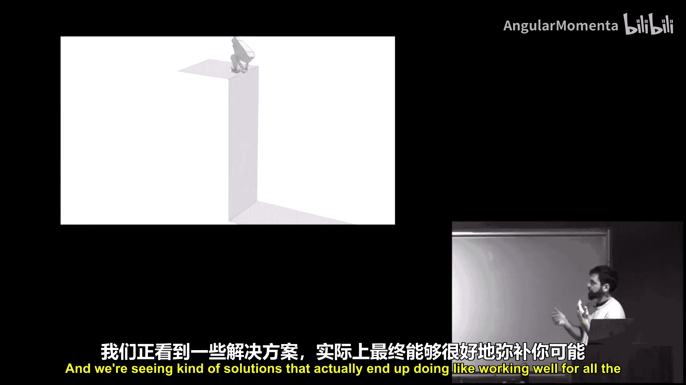
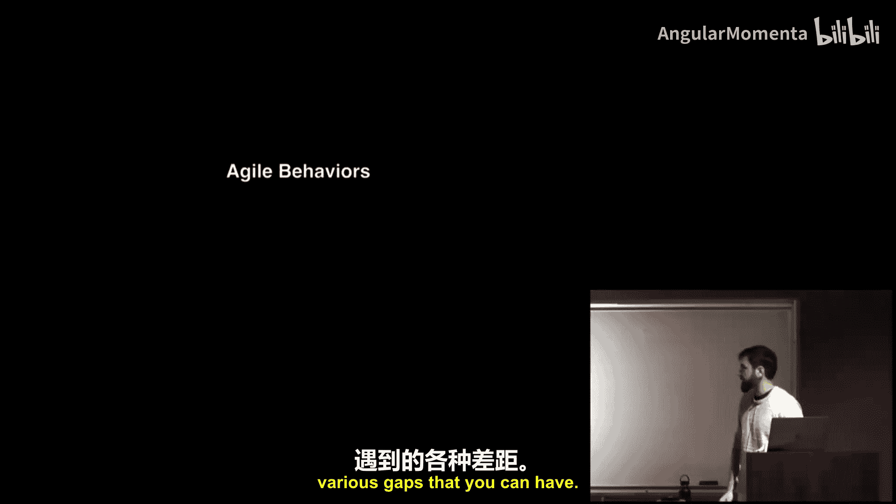
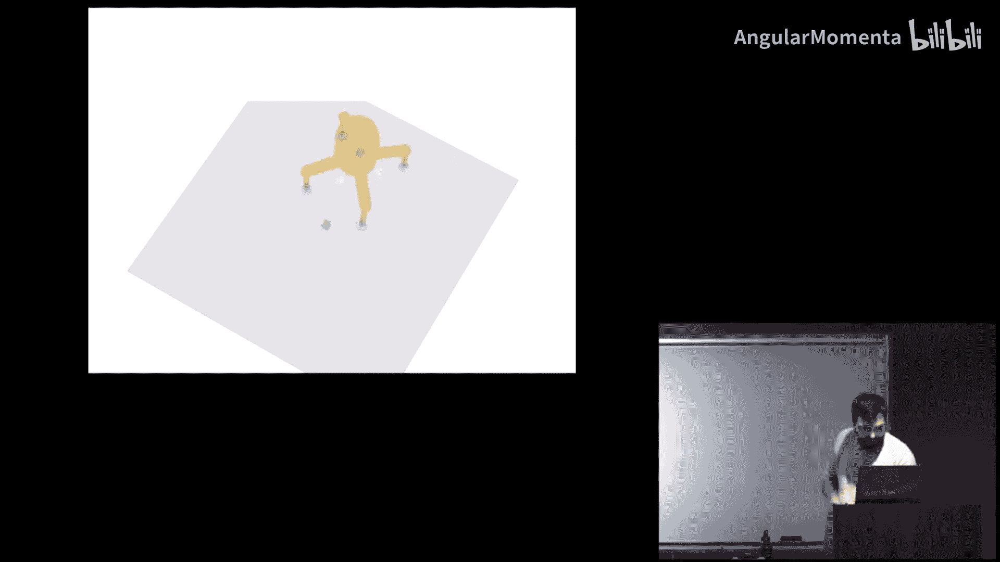
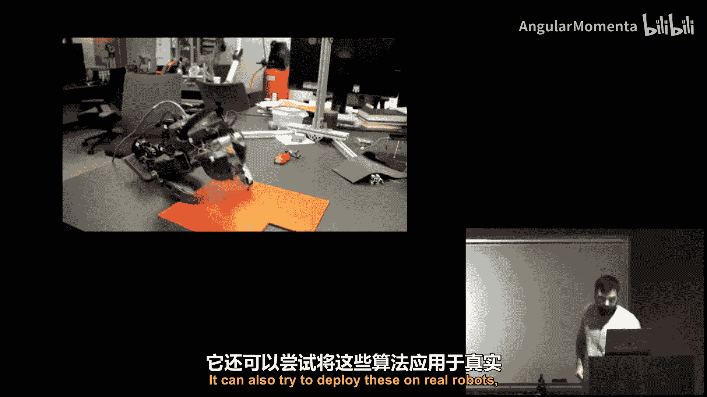
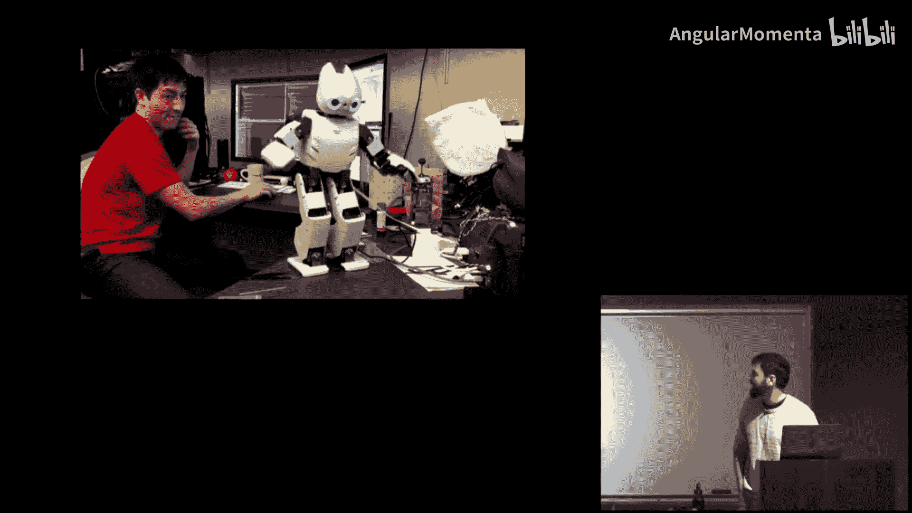
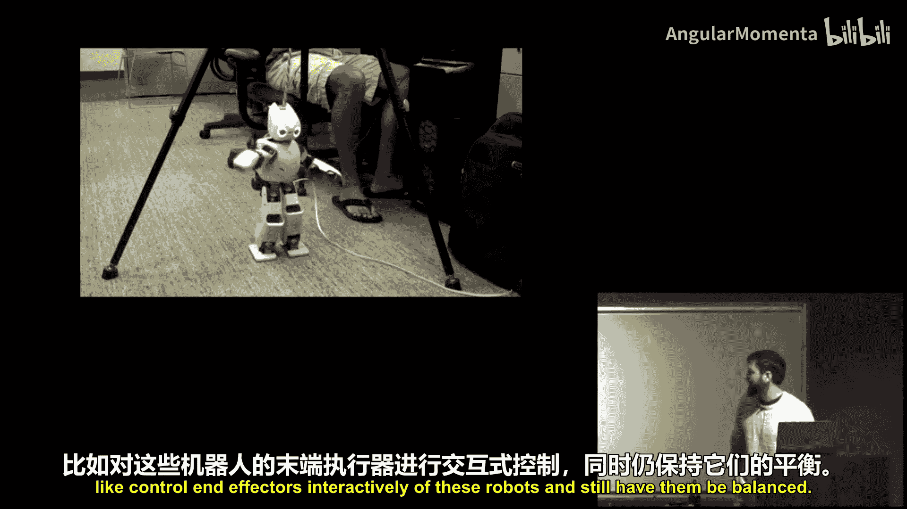
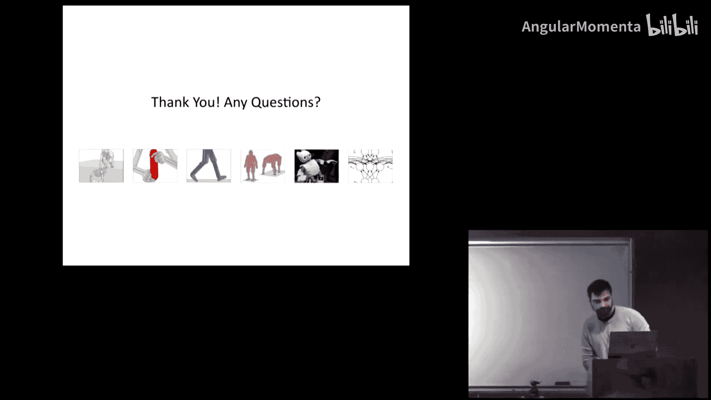
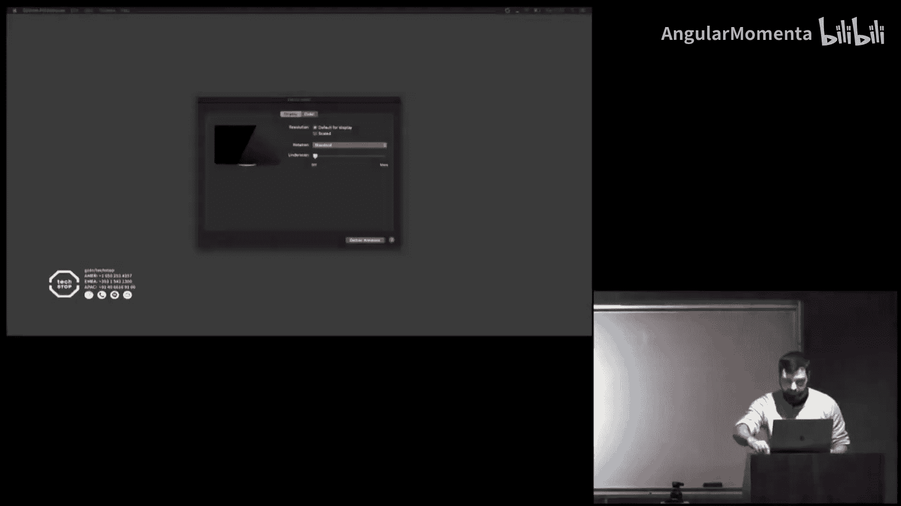

# 009：搭配、拍摄、MPC、接触不变优化

## 概述

在本节课中，我们将深入学习基于优化的控制方法。我们将重点探讨直接搭配法，包括如何优化开环控制序列和反馈策略，并深入了解逆动力学模型。此外，我们还将研究接触存在下的优化挑战及其解决方案，这是机器人学中普遍存在的难题。

---

## 轨迹优化与直接搭配法

上一节我们回顾了前向打靶法。本节中，我们来看看直接搭配法，并比较两者的优劣。

在之前的学习中，我们主要关注前向动力学模型，例如下一个状态是前一个状态和控制的函数。我们研究了像LQR或微分动态规划这样的高级打靶法。

今天，我们将更详细地探讨直接搭配法，既用于优化开环控制序列，也用于优化反馈策略。我们还将研究逆动力学模型，它可以从状态序列中恢复控制输入。此外，我们将探讨优化问题的高级求解方法，类似于直接搭配法中的LQR和DDP。最后，我们将研究存在接触时的优化问题，以及其中的挑战和可能的解决方案。

### 前向打靶法回顾

假设你有一个系统处于某个初始状态，你想最小化成本或达到某个目标，例如到达一个目标点。我们过去研究的前向打靶法是直接优化一个控制序列。当你用前向动力学函数展开这个控制序列时，会得到一系列状态。你希望选择能最小化某个成本函数（如到达目标）的控制序列。

彼得在上次讲座中指出，这个问题存在条件数差的问题。例如，改变初始控制会对轨迹的其余部分产生非常显著的影响。如果你展开这组方程，可以看到任何特定时间T的状态都依赖于之前所有的控制输入，因此会累积敏感性。

另一个彼得可能没有提到的问题是，这类问题的可行域非常狭窄。因为动力学函数可以被视为一个隐式硬约束，所有解都必须满足前向动力学。这可能导致可行域非常窄。例如，在二维空间中，所有可能的轨迹序列空间里，红色区域是满足整个轨迹动力学方程的轨迹。如果你的优化初始猜测轨迹在某个位置，你可能需要在优化过程中采取非常迂回的路径才能到达解。

相比之下，如果这是一个软约束而不是硬约束，优化可能会走更短的路径到达解。在中间阶段，它可能违反物理定律，得到一些物理上不合理或不一致的解，但最终会收敛到一个合理的解。在实践中，这种情况经常出现。例如，真实机器人的碰撞事件，或者双足机器人从站立开始，你尝试的大多数控制序列只会导致它摔倒，你将无法取得太大进展。因此，打靶法很容易陷入局部极小值，并且解对初始控制猜测非常敏感。

### 直接搭配法

你可以通过从演示中选择初始猜测或进行大量随机化搜索来稍微改善这个问题。但还有另一种方法，正如我们从上节课看到的。

与优化控制序列不同，你可以直接优化状态序列和控制序列。在本讲座讨论的情况下，我们将只直接优化状态轨迹，而不是状态和控制。控制可以通过逆动力学函数隐式恢复，该函数为一对状态提供控制，因此我们不需要将其作为显式优化变量。

在这些设置中，你只有成对的依赖关系。因此，你具有良好的条件数特性。例如，改变X1与改变优化变量XT具有相同的效果，并非某些变量对你的成本函数有不成比例的巨大影响。

另一个优点是没有由于前向积分导致的不稳定性。在前向动力学模拟中，由于时间离散化和显式积分器（如欧拉积分），前向积分会迅速变得不稳定，因此我们必须采用非常短的时间步长。在这里，我们没有这种由于前向积分导致的不稳定性问题。

此外，我们可以使动力学成为一个显式约束，而不是隐式约束。这允许我们将其作为硬约束或优化中的软约束。因此，问题可能不那么容易陷入局部极小值，因为我们可以尝试不可行的状态。

### 方法总结

以下是两种方法的差异总结：

*   **前向打靶法**：我们优化控制，状态轨迹变得隐式，因为我们展开控制并观察产生的状态。动力学方程F是一个隐式约束，总是被构造满足。这既可能是好事也可能是负担。
*   **直接搭配法**：我们直接优化状态，而控制（以及潜在的约束力）通过逆动力学隐式得出。这个动力学可以是一个显式约束，并且可以被软化。

需要简要说明的是，彼得在上次讲座中描述的情况以及我刚才提到的情况，都只是更一般的搭配设置的特殊情况。最初，这是受求解微分方程的启发，你优化的参数是轨迹和控制的某种参数化。你基本上只在特定的点（称为搭配点）测试动力学的满足情况。在数值方法文献中，实际上还有许多其他选择。我们只是做了一个非常具体的选择，其中θ只是x的序列。但你可以使用其他基函数（如多项式基或傅里叶基）来参数化轨迹，并且还有许多其他选择来放置这些搭配点。我们只是在网格上均匀分布时间步长，这没问题，但你也可以尝试其他更智能或自适应的方法。另外，基于两个相邻状态来参数化逆动力学只是一种局部方法，但你也可以有一个依赖于更多状态的逆动力学函数，即全局性的。

---

## 逆动力学函数

在深入讨论之前，让我们先了解一下逆动力学函数。

逆动力学函数描述的是，当你从状态X(t)转换到X(t+1)时，所施加的控制和力是什么。

找到这个函数的一种方法是直接从数据中学习。你可以收集一个数据集，应用一堆控制，观察两个相邻状态，看看是什么控制使你从一个状态转换到下一个状态，然后使用你喜欢的函数逼近器（如神经网络）来学习从输入到输出的映射。这绝对是一种方法。

但对于刚体多体动力学，如果我们知道系统参数，我们可以做得更好。即使你打算使用学习，了解物理模拟器内部的地面真实情况以及这些方程的结构也是有用的，这样即使在学习时，你也可以将一些结构知识融入到你的学习方法中。

### 刚体多体动力学

在这种情况下，状态X(t)将包括我们机器人的所有自由度，例如所有关节角度，以及根位置和根方向。我们可以通过有限差分计算这些自由度的速度和加速度。因此，特定的U现在取决于该时间点的状态以及之前和之后的状态。

我们可以恢复这些控制的方法基本上是推广F=ma。例如，如果你有像F=ma这样的运动方程，你知道加速度（因为你可以访问轨迹），你知道质量，那么你就知道施加的力是什么。在刚体多体动力学中，这个方程变得稍微复杂一些，但基本思想相同，你有更广义的质量项和这些依赖于速度的特定科里奥利项。在方程的另一边，你有你的控制，它们可以通过特定的矩阵进行调制。这个B矩阵反映了某些约束，例如我的根位置，没有肌肉可以施加力来全局移动我的根。我们还有一些约束力乘以它们的雅可比矩阵，这些可能是施加的接触力，或者如果有任何关节限制，则是防止关节限制的力。

如果你对这个主题感兴趣，我建议参考Springer机器人手册的第2章和第3章，那里对这个方程及其所有项进行了详细阐述。如果你想理解接触，我认为《分析动力学新方法》也是一本非常简洁的好书，更多地讨论了带接触的这些方程。

变量F本身也有约束，例如摩擦约束表示为锥约束，所以F需要位于某个锥内。此外，位置和力之间还存在互补性约束。但为了简洁起见，我不想深入这些细节。在高层次上，通过逆动力学函数，你基本上尝试求解这个方程。你拥有所有的Q及其导数，可以求解满足该方程的F和U。这就是你如何恢复控制和接触力的方法。

如果不可能，即实际上没有U能使这个方程成立，那么这个方程的最小值将是你的逆动力学残差。因此，这个函数R将告诉你这两个状态之间转换的不可能程度。

顺便说一下，这些方程可以通过数值或解析方式求解，存在求解这些方程的封闭形式解。此外，这不仅仅适用于直接搭配法，你喜欢的物理模拟器在底层也在解决这个问题。对于前向动力学，你知道Q和速度，你插入你的控制U，然后从中得到加速度，但它解决的是完全相同的问题。

### 简单示例

让我们看一个简单示例，假设是一个2D粒子。你的运动方程F=ma只是一些控制，你有一些外力G，比如重力。逆动力学函数，如果我们只是插入有限差分近似，将给出一个依赖于x的形式。假设我们只是想最小化，例如，我们的成本是希望状态X很小。在我们的初始状态，它从零开始，我们知道系统参数M和外部力，我们要解决的未知数是初始状态之后的其余轨迹。解可能只是状态继续保持在零，我们可以恢复的隐式控制是G，所以可以说施加的控制是直接抵消重力的。

在另一个例子中，如果我们想最小化控制，即基本上不施加任何控制。我们将看到状态序列基本上是自由落体运动，隐式控制将为零。因此，你基本上可以得到满足动力学约束的轨迹。

---

## 数值求解方法

现在我将讨论我们如何实际数值求解这些方法。

你之前可能看过TensorFlow或PyTorch等各种机器学习框架，如自动微分框架。第一个想法是，这看起来像一个图，为什么我们不直接在TensorFlow中设置一个图，并尝试用梯度下降来优化它？这实际上不是一个坏主意，这是一个合理的做法。但从之前的讲座中我们看到，对于打靶法，我们可以做得更好，我们有利用高阶导数的方法，基本上是二阶方法的等价物，我们看到了LQR，看到了微分动态规划。那么，我们能否对直接搭配问题应用类似的东西，应用二阶优化方法呢？

为什么你想这样做？彼得举了例子，使用二阶方法有更快的收敛速度，残差往往小得多。我个人的直觉是，你试图解决的是一个同时满足多个重叠约束的系统。如果你使用一阶方法（如梯度下降），你可能会说，好吧，我尝试改变我的变量，但如果你改变一个变量，你会满足一个约束，却违反另一个约束，因此你将总是玩这种追赶游戏。而我们知道，二阶方法或线性系统求解器在同时满足多个约束方面非常出色。那么，为什么不利用这一点呢？在实践中，二阶方法对于使这些搭配方法工作确实非常重要。在某些问题上，二阶方法需要大约10到100次迭代，而一阶方法需要大约1000到10000次迭代，并且你仍然会得到未满足的残差。因此，我认为应用二阶方法实际上比打靶法更重要。

### 高斯-牛顿法

你可以考虑的一种特定方法是高斯-牛顿法，它与自然梯度方法非常相似。

如果我们有这个依赖于某些特征的总轨迹成本。这个Φ包括我们可以想到的所有特征，比如隐式控制或逆动力学残差，也许还有其他特征，如末端执行器位置，基本上任何我们想要施加成本的东西。

如果我们看梯度和海森矩阵，梯度看起来相当简单。海森矩阵，如果你展开这个二阶项，你会看到它基本上依赖于你特征的一阶导数和另一个依赖于特征Φ的二阶导数的项。正是这第二项，实际上可能非常棘手。例如，对于逆动力学残差，获取其海森矩阵在实践中可能相当困难，而获取其一阶导数可以通过有限差分或其他类型的近似方法完成。

因此，我们本质上可以玩的游戏是，我们将假设我们的成本C是某种解析形式，以便我们可以轻松计算C的一阶和二阶导数。例如，它可能是一个二次型。所以，情况可能是，如果我希望我的手臂或我的机器人末端执行器到达特定位置，我们可能会将末端执行器位置坐标放入Φ，而C可能只是末端执行器位置与目标之间的二次型。这基本上给了我们自由，决定把什么放在C里，把什么放在Φ里。理想情况下，在Φ中我们想放入难以微分的东西，而C是容易微分的东西。

然后，在实践中我们可以做的是，我们可以舍弃这一项，只保留这个截断的海森矩阵近似，这被称为高斯-牛顿法。因此，我们可以通过迭代高斯-牛顿步来找到解。在实践中，为了稳定性，你可以使用Levenberg-Marquardt方法。

### 计算效率

那么问题是，我们形成的这个海森矩阵的大小是你的状态空间大小乘以步数再乘以搭配步数的平方。这个数字可能相当大，我们是否必须在每次迭代时都求逆？答案实际上是，幸运的是，不需要。因为如果你看海森矩阵的结构，由于约束之间的依赖关系只是局部的，海森矩阵最终是块稀疏的，你可以直接使用你喜欢的现成稀疏线性系统求解器来解决它。Python的`scipy`在这方面效果很好。你可以做得更好，但这已经相当不错了。此外，数值方法文献中还有许多其他方法可以应用于这个问题，如多重网格方法或各种谱方法，可以加速求解。你也可以将其表述为约束优化问题，其中动力学可以作为硬约束。

---

## 接触动力学

打靶法和搭配法都可以应用于无接触的运动控制，并且实际上已经取得了成功。例如，对于飞行、驾驶或游泳机器人，或者为机器人寻找无碰撞路径，这两种方法往往都效果良好。

但实际上，对于接触，很难直接应用任何一种方法。如果你有足式机器人，或者你关心操作或与环境的交互，这非常困难。

### 挑战

接触带来的挑战是，它会在你的能量景观中引入不连续的跳跃。你可能有两个状态Q1和Q2，它们可能非常接近和相似，但一个非常小的变化，比如我把机器人的手放在桌子上，这意味着机器人能够施加接触力，而之前它不能。因此，F的维度甚至会在两个时间步之间突然改变。这导致能量景观中出现尖锐的不连续性。这是第一个问题。

另一个问题是，我们实际上没有任何来自非活动力的梯度信息或任何反馈。例如，如果机器人非常接近地面但实际上没有接触，我们的优化景观中没有任何东西告诉你，只要你把脚放低一点，你就能施加力并拥有各种驱动能力。开箱即用的情况下，没有梯度信息告诉你这一点。

因此，过去的一些解决方案是手动指定接触序列，例如机器人的所有步态，要么手动，要么使用一些规划方法，或者使用演示直接让你进入运动的范围，或者结合一些特定的运动结构，如特定的状态机。

实际上，强化学习将是处理这个问题的另一个例子，你将在课程后面看到，它在解决这个问题上也相当强大。

### 接触不变优化

但问题是，在所有这些情况下，接触活动是状态的间接函数。如果我们像对待状态一样，使其成为直接的优化变量呢？如果我们直接优化接触活动呢？

这让我想到了我们过去做过的一些工作，你从一个直接搭配问题开始，优化机器人的所有关节角度轨迹，但除此之外，你还优化这些接触变量。这些接触变量基本上是标量，预先描述了一组你可能有的接触。如果这个接触变量是1，意味着在那个特定时间，脚或手与地面接触。你可以看到左边圈出的例子，对于那个初始姿势的脚，接触变量可能是1，但对于时间T的右臂，接触变量可能是0，因为它没有接触地面。我已经用红色高亮了所有接触。

因为这些接触和姿势是我们的显式优化变量，你必须显式地强制执行它们之间的一致性，即接触一致性和我们之前看到的动力学一致性。否则，你可能会得到像机器人直接飞向目标这样的轨迹。

这个接触一致性，我不想过多讨论它的来源。简而言之，它来自于力的互补性条件。基本上，它说的是，当特定肢体的接触变量为1时，意味着该肢体必须接触地面且不滑动。当该肢体的接触变量为0时，手或脚可以自由地在空间中移动。

动力学一致性基本上就是我们之前看到的F=ma。不过，我们将假设所有可能的接触力总是活动的，因此F和J_f^T q的维度不会改变。所以集合是恒定的。

在我们的优化问题中，我们将有这个惩罚函数，它表示如果接触为零，对于特定肢体，尝试施加该力将会有很高的成本。如果接触变量为1，你施加它就没有很高的成本。因此，在我们的逆动力学函数内部，我们将有这个软推动。

所以，发生的情况基本上是，轨迹优化可以看作是一个嵌套优化，在高层你优化控制序列，在低层你寻找U和F，正是通过这些接触变量，高层轨迹优化指导这个低层逆动力学求解器，告诉它我希望接触在这里活动或不活动。最终，我们得到一个没有因接触导致不连续性的问题，并且总是有梯度，特别是可以用标准局部优化方法（如我们讨论过的高斯-牛顿法）来解决。在2012年的机器上，大约需要2到10分钟。

### 优化过程示例

让我们看一个优化过程进展的例子，给你一些直观感受。假设我们有一些初始状态，比如这里机器人的初始状态，目标是让它站在白色十字目标上。

早期，你会看到优化正在寻找基本上是飞向目标的路径，所有蓝色方块表示它认为接触变量是开启的，所以它基本上认为它是在推离空气，直接飞向站立姿势。这就是我之前提到的将逆动力学作为软约束的有用性，它允许你在中间阶段违反物理定律，并考虑各种不可行的可能性。

但在优化的后期，我们看到由于接触需要接触地面且不滑动的约束，你可以看到它收敛到一些接触，要么变为非活动，要么被吸引向地板。在后期，由于不滑动目标，我们看到接触实际上收敛到时间上的单一点。作为优化的结果，你可以看到一个起身且物理上合理的运动。

### 其他应用示例

这种方法还可以获得其他结果。例如，类似的目标，站在白色十字上，但如果你改变环境，你可以看到许多不同的策略从这些优化方法中产生。这里我们允许机器人施加可以拉的力，而不仅仅是推，我们看到实际上最终做出像引体向上动作的解。

它也可以很好地处理各种间隙。你还可以优化，不是站在特定方向，而是翻转方向，并通过所有正确的预备动作获得这种倒立行为。

或者，我可以放置一堆位置，比如手应该在哪里，并具有特定的速度，得到一系列拳击或踢腿动作，同时，机器人保持平衡，因为为了继续踢腿，它需要保持某种平衡。

它也可以推广到非人形形态。例如，这个行走的沙发状物体如何越过一个间隙，我们看到了一个合理的运动草图。

你还可以优化与道具的交互。例如，我们添加额外的道具和额外的变量，表示你可以通过只指定盒子的最终位置来与这些道具接触，我们可以得到一个轨迹，让角色走向盒子并放置它。因为在优化中，首先盒子本身飞向目标，但随后优化提出问题：为了飞向它，需要对它施加一些接触力；为了有接触力，这些接触变量需要是活动的；为了使这些活动，手需要实际接触物体。因此，优化引发了一系列依赖关系。

你还可以研究多个智能体或多个机器人协调。同样，这里唯一的目标是盒子应该在哪里，对于机器人应该做什么没有任何目标或成本。

或者，如果目标只是让小智能体的顶部达到特定高度，对于大机器人应该做什么没有任何约束或目标，我们仍然会得到这种攀爬行为。

在双手操作中也可以应用，设置完全相同，你现在有手指和物体之间接触的变量，你可以做各种事情，比如以特定方向抓取各种物体，或者操作物体，目标只是让物体绕X轴或Z轴以特定速度旋转。

不过，我们在这里看到的是将动力学作为软约束的一个后果。正如你在这里看到的，它通常是一个相当合理的运动草图，但看起来有点漂浮，可能有点违反物理定律。这是因为逆动力学残差只是一个软约束，而且我们的轨迹参数化（我们优化的状态序列可能在时间上相距甚远）导致一些中间状态可能不合理，所以总是有一个小残差。这与前向打靶法形成对比，在前向打靶法中，你总是会得到合理的东西，只是可能更难获得。

你可以尝试不同的机器人手，甚至可以尝试多只手，再次作为一个群体思维，协调起来拾取一个物体。

### 更详细的模型

我想简要描述的另一点是，你也可以加入更详细的模型。我知道这门课是关于机器人的，但你可以尝试其他驱动模型，例如肌肉。肌肉实际上有自己非常详细的动力学，你可以再次写出运动方程。并获得更详细的智能体行为或机器人行为，这些行为实际上会显示肌肉在做什么，它们激活和收缩的程度。在这种情况下，就像你问的，这些解是唯一的吗？对于肌肉的情况，它们实际上不是唯一的，因为例如，我现在是用力很小还是收缩得非常厉害，无法区分这两种情况，所以只需要额外的正则化来处理这个问题。我们可以看到，它确实倾向于重现人类行走模式，无论是在扭矩还是运动学方面。

我们可以指定更高的速度，并获得以4米/秒速度奔跑的详细运动，或者在月球重力下行走，或者启动步态、停止步态、跳跃到不同位置或再次踢腿。这些动作生成起来很有趣，你可以做各种各样的事情。

我应该提出另一个例子，你可能会问，是否必须只优化状态？答案再次是否定的。也有很多成功的工作明确优化了状态、控制和力，并将其作为硬约束。一个很好的例子是Michael Posa和Russ Tedrake在2012年的工作，他们做了非常详细的模型，比如像鸵鸟一样的机器人奔跑，实际上没有残差，因此可以真正部署在机器人上。这是另一种情况。

所有这些视频，成本函数的定义需要非常小心。基本上，对于像移动盒子这样的动作，你不想创建任何提示或符合成本。因此，成本是关于满足目标的，比如我希望身体的位置在这里，这被表示为二次型。还有一些代谢能量消耗，比如我想最小化扭矩的平方和，可能还想最小化接触力的平方和。所以是一些努力程度的度量，还有一些通用的正则化目标，比如姿势。我希望角色的默认姿势接近站立姿势。这只是为了确保我不会做出各种奇怪的休息姿势。但没有关于我应该用这个盒子做什么的提示。我们希望这能从优化中产生。这里没有演示。我们想看看能全新地得到什么，因为在某些情况下，对于一个形态怪异的机器人，你可能没有演示。

---

## 策略学习

对于轨迹优化，我通常看到这种方法是在自动生成之前解决优化问题来获得每个动作片段或开环轨迹。但这些解决方案中没有任何学习或重用，它也不能处理意外事件。因此，我们将尝试研究如何使用这些方法来寻找反馈策略，而不是仅仅优化片段。

### 模型预测控制

一种真正可以应用的方法是彼得在上次讲座中谈到的模型预测控制。这实际上是一个非常合理且非常好的方法来寻找具有反馈的控制策略，我使用轨迹优化来规划未来，采取第一步，在现实世界中行动，我可能会发现自己处于一个新的状态，然后我继续重新规划。我认为这是一个非常好的方法，彼得已经讲得很好了，所以我不再赘述，不是因为这是个坏主意，只是因为他已经讲过了。

相反，我要讲的是上节课中提到的方法，关于我们如何使用搭配法来获得反馈策略。

### 策略学习框架

为了确保我们在同一页上，我们将考虑的策略只是一个从状态映射到控制的确定性函数。我们要做的是，在打靶法的情况下，优化策略参数，当前向展开时，这些参数将最小化成本。但同样，我们会遇到前向展开条件数差的问题。

使这个问题更容易的一种方法是从演示中学习，其中策略学习就变成了一个监督学习问题，也许另一个名称是行为克隆，经常用来描述这个。我基本上有很多轨迹和控制的演示，我只是尝试拟合一个策略来重现这些序列。

演示可以来自人类演示，但我们也可以使用我们的轨迹优化来为我们生成任意数量的演示数据。这就是我们将如何处理这个问题的方法。

因此，我们将提出一组任务，并使用轨迹优化器来解决特定任务。例如，我从某个初始状态开始，想向前走三米，或者可能有另一个任务，我想向后走两米。对于每个任务，我将运行讲座第一部分中的直接搭配优化方法。我将从这些轨迹中收集所有状态和动作对，然后拟合一个策略，比如神经网络，来重现这些。然后，我将能够生成各种中间运动，以各种广义速度移动。

### 数据一致性问题

但问题是，这个轨迹数据集可能不一致或非常难以拟合。例如，我们看了一个生成扑翼鸟运动的例子，你可以看到自由度的变化。对于鸟停留在空中的任务，实现它的一种方式是非常混乱地扑动，另一种是创建这些有规律的周期性扑动模式。两者都满足任务，但其中一个可能对你的神经网络或策略来说更容易拟合。右边的可能实际上比这种混乱行为更容易拟合。

另一个问题是，轨迹集可能不一致。例如，根据我的随机初始化，如果我站着并想开始向前移动，我可能开始用右脚走，也可能开始用左脚走，这两种都同样可行，但一个确定性神经网络将尝试拟合这两种解，并做一些介于两者之间的事情，这不是一个合理的插值。

### 联合优化方法

这就是为什么我们要做的是，确保我们的策略实际上反馈到轨迹优化问题中。我们可以通过同时优化这个姿态联合优化问题来实现，优化策略参数和这组轨迹，其中我们拥有与之前相同的传统轨迹优化成本，但我们还有这个额外的项，它将耦合策略和控制。

所以，它将要做的是，我们的轨迹优化将为我们提出一些控制，而策略可能提出其他东西。因此，我们存在这种不一致性。减少这种不一致性的方法是，我们可以调整策略，例如训练更长时间，使其更好地拟合我们的U序列，或者我们可以调整轨迹，调整U以开始匹配策略π的行为。

这里的想法再次是，你添加了辅助变量，不仅仅是优化策略参数，我们还优化策略参数和一堆轨迹，它们可以不一致。但我们将软性地强制执行策略行为和轨迹之间的一致性。这再次导致了一个更大但更容易探索的搜索空间，因为就像以前我们不局限于通过构造满足物理定律一样，现在我们不局限于通过构造遵循策略的轨迹。

在实践中，我们可以将这个联合问题分解为交替进行：仅轨迹优化问题，我们可以独立地解决每个x，加上这个额外的二次项让我们保持接近策略；以及回归问题，这基本上是我们的监督学习问题。我们在这些问题之间交替进行。它可以在多台机器上完成，但这有点离题。

### 最终结果

最终得到的是我们现在可以实时交互的策略。绿色是我交互控制的游标。我们有这个扑翼鸟状的角色试图跟踪目标。或者我们可以使介质有点粘性，更像流体，让这个奇怪的海龟状生物也跟踪目标，并跟踪目标方向。

再次强调，即使我们进行轨迹优化，最终得到的对象是一个反馈策略，一个闭环策略，在我们的例子中是一个神经网络，可以实时执行。

我们还可以将其用于双足机器人的交互控制，控制这个双足机器人，你还可以看到施加的接触力。它响应相当迅速。或者我们可以得到更短的双足机器人，得到奇怪的小鸡状物体行走并跟踪游标。或者再次是奇怪的沙发，现在实时行走。或者四足机器人移动或转身。在这种情况下，在2014年的机器上，训练所有各种轨迹大约需要两到三个小时，但最终你得到的是实时的东西。或者一个奇怪的蜘蛛。我们真的很想让蜘蛛爬上墙壁，让它更恐怖，但在截止日期前没有时间。

你也可以尝试将这些部署在真实机器人上，比如让这些双足机器人站起来，或者使用交互策略。或者控制这些机器人的末端执行器进行交互，同时保持平衡。

---

## 总结

本节课中，我们一起学习了基于优化的控制方法，重点探讨了直接搭配法及其在轨迹优化中的应用。我们比较了前向打靶法与直接搭配法的优劣，深入了解了逆动力学模型及其在恢复控制输入中的作用。我们还研究了接触存在下的优化挑战，并介绍了接触不变优化这一解决方案。最后，我们探讨了如何通过联合优化方法将轨迹优化与策略学习结合，从而生成能够实时交互的反馈策略。这些方法为处理复杂的机器人运动和控制问题提供了强大的工具。