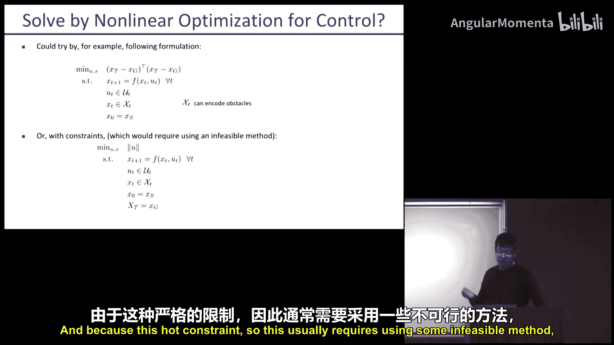
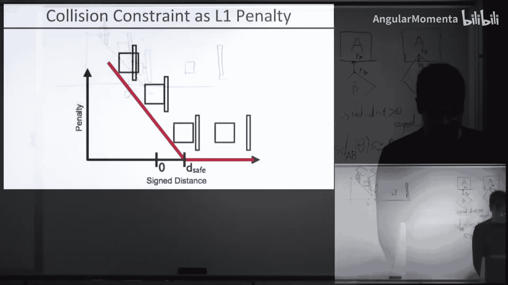
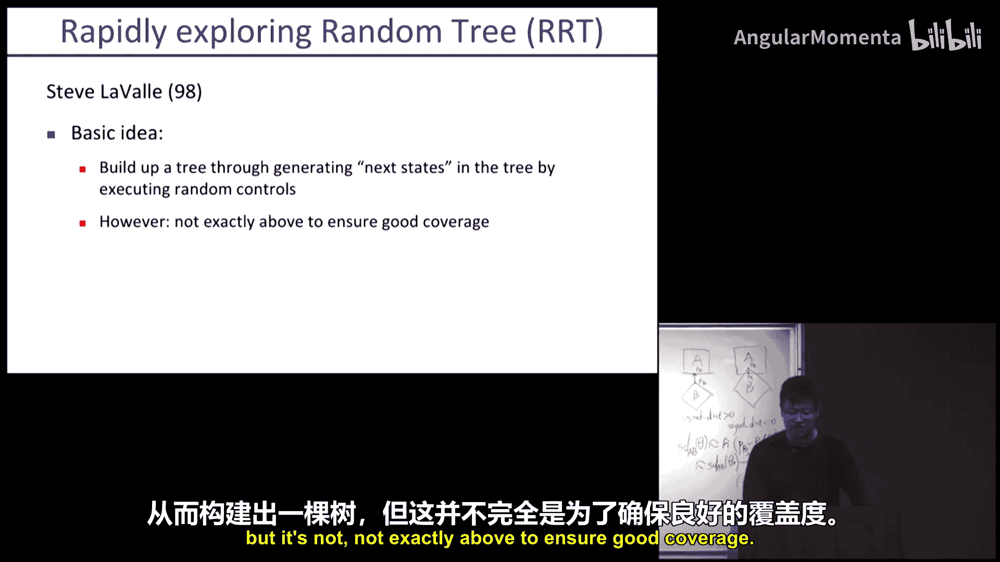
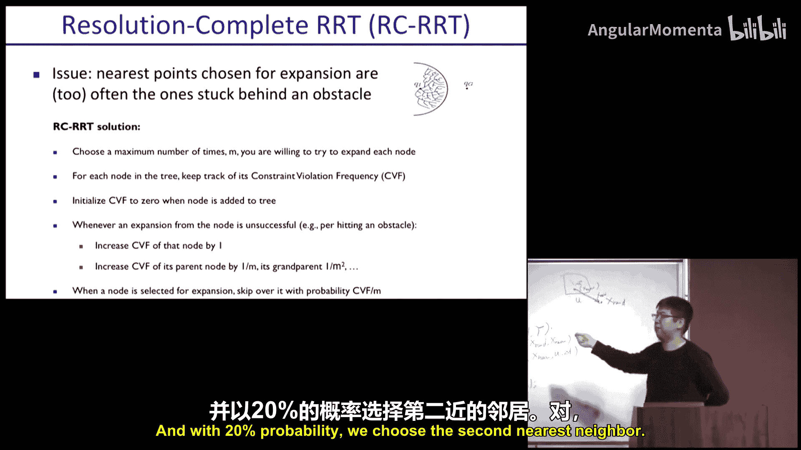
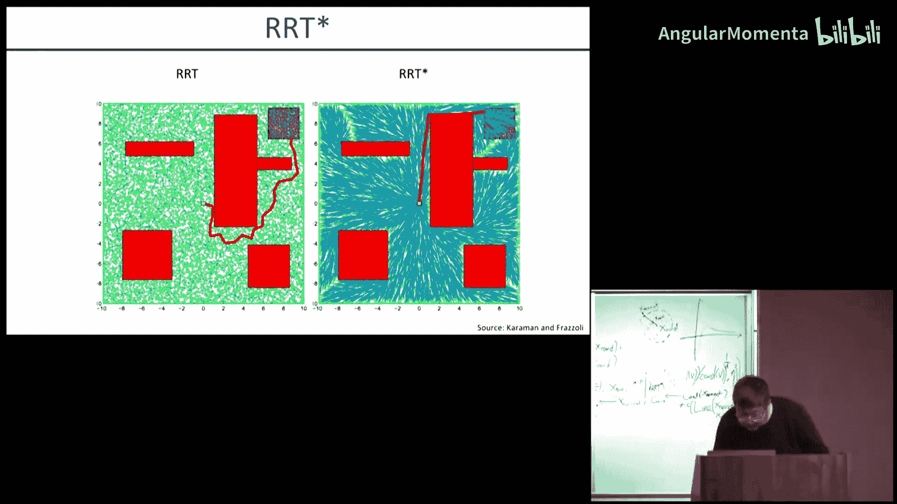

# 010：PRM、RRT、Trajopt

在本节课中，我们将要学习机器人运动规划的核心概念与方法。运动规划的目标是找到一系列控制指令，使机器人从起始状态安全、高效地到达目标状态，同时避开障碍物并满足系统动力学约束。我们将从配置空间这一基础概念入手，然后深入探讨基于优化的规划方法（如Trajopt）和基于采样的规划方法（如PRM和RRT），并比较它们的优缺点。

## 配置空间：运动规划的起点

上一节我们介绍了运动规划的基本问题，本节中我们来看看理解该问题的关键基础：配置空间。

配置空间（C-Space）是描述机器人所有可能姿态（位姿）的集合。与在三维工作空间（Workspace）中思考不同，在配置空间中，机器人的每个姿态被表示为一个点。障碍物在配置空间中会映射为“禁区”，规划问题就转化为在配置空间的自由区域中寻找一条从起点到目标点的路径。

以下是配置空间的两个关键特性：
*   它简化了碰撞检测，将复杂的几何体干涉问题转化为点与禁区的关系。
*   它统一了不同形态机器人的规划问题，无论是机械臂、移动机器人还是更复杂的系统，都可以在其配置空间中表述。

## 基于优化的运动规划

理解了问题表述的基础后，我们来看看如何通过数学优化来求解。基于优化的方法将运动规划问题表述为一个非线性优化问题，直接优化整条轨迹。

其核心思想是定义一个包含各项要求的代价函数，并通过迭代优化使其最小化。一个典型的公式化表述如下：

**目标：** 最小化控制序列 `U` 及状态序列 `X` 的代价。
**约束包括：**
1.  动力学约束：`X_{t+1} = f(X_t, U_t)`
2.  起点与终点约束：`X_0 = X_start`, `X_T = X_goal`
3.  控制输入约束：`U_t ∈ U_set`
4.  状态约束（如关节限位）：`X_t ∈ X_set`
5.  **无碰撞约束**：对于所有机器人部件和所有时间步，不与障碍物发生碰撞。

其中，无碰撞约束通常是非凸的，这使得问题难以直接求解。常用的方法是序列凸优化，即反复用凸优化问题来近似原非凸问题并迭代求解。

### 处理碰撞约束

碰撞约束是规划中的主要难点。我们使用有符号距离函数 `sdf(A, B)` 来描述物体A和B之间的关系：
*   `sdf(A, B) > 0`：A与B分离。
*   `sdf(A, B) = 0`：A与B接触。
*   `sdf(A, B) < 0`：A与B穿透（碰撞）。

在优化中，我们引入一个惩罚项（如铰链损失），当有符号距离小于一个安全阈值时进行惩罚，从而鼓励算法找到无碰撞的路径。

### 连续时间安全性

仅检查离散时间步的碰撞可能不够，因为机器人在两个时间步之间运动扫过的体积仍可能与障碍物碰撞。因此，更鲁棒的方法是检查运动过程中扫掠体（Swept Volume）的碰撞，这可以通过代价较低的采样轨迹来近似估算，在保证安全性的同时提高了计算效率。

### 方法优势与示例

基于优化的方法（如Trajopt）在多项基准测试中表现出色，在路径长度、计算时间和成功率上均优于许多基于采样的方法。它能够有效处理高自由度系统（如双臂机器人）和复杂环境中的规划问题，例如工业抓取、开门、穿针等任务。

## 基于采样的运动规划

上一节我们介绍了直接优化整条轨迹的方法，本节中我们来看看另一大类方法：基于采样的规划。这类方法通过在配置空间中随机采样来构建路径图或树，不依赖于对空间的精确建模，特别适合高维空间。

### 概率路线图

概率路线图（Probabilistic Roadmap, PRM）分两个阶段构建一个覆盖自由空间的图。

以下是PRM的构建步骤：
1.  **采样**：在配置空间中随机采样大量点。
2.  **筛选**：丢弃那些与障碍物碰撞的点，保留的点作为“里程碑”。
3.  **连接**：尝试用局部规划器（如直线连接）将每个里程碑与其一定数量的最近邻里程碑连接起来。
4.  **过滤**：移除连接过程中发生碰撞的边。
5.  **查询**：在构建好的路线图中，使用图搜索算法（如A*）寻找从起点到目标点的路径。

PRM的优点是其概率完备性：如果运行时间足够长，只要解存在，它就能以概率1找到解。缺点是需要在整个空间构建图，且连接两点时需要解决可能困难的两点边界值问题。

### 快速探索随机树

快速探索随机树（Rapidly-exploring Random Tree, RRT）是一种增量式构建搜索树的方法，更适合于导向目标点的规划。

RRT的基本算法循环如下：
1.  随机采样一个配置空间点 `X_rand`。
2.  在现有树中找到离 `X_rand` 最近的节点 `X_near`。
3.  从 `X_near` 向 `X_rand` 的方向扩展一小步长，得到新节点 `X_new`。
4.  如果从 `X_near` 到 `X_new` 的路径无碰撞，则将 `X_new` 加入树中，并与 `X_near` 连接。
5.  重复此过程，直到树扩展到目标点附近。

为了提升性能，发展出了多种变体：
*   **双向RRT**：同时从起点和目标点生长两棵树，直到它们连接，这通常能更快地找到路径。
*   **RRT***：一种渐近最优的变体。它在加入新节点后，会检查附近节点是否可以通过这个新节点获得更短的路径，并重连树的结构，从而不断优化路径质量。

基于采样的方法（尤其是RRT及其变体）在实践中被广泛应用，因为它们实现相对简单，并能有效处理高维和复杂约束的空间。

## 总结

本节课中我们一起学习了机器人运动规划的核心内容。我们首先从配置空间的概念出发，理解了如何将物理世界的规划问题抽象为数学空间的搜索问题。接着，我们深入探讨了两种主流的规划范式：基于优化的方法（以Trajopt为例）将规划表述为非线性优化问题，通过序列凸优化等技术求解，在性能上常有优势；基于采样的方法（如PRM和RRT）则通过随机采样构建图或树来探索空间，其概率完备性和在高维空间的有效性使其成为实用工具。每种方法都有其适用的场景和优缺点，在实际系统中，有时也会结合使用以获得更好的效果。