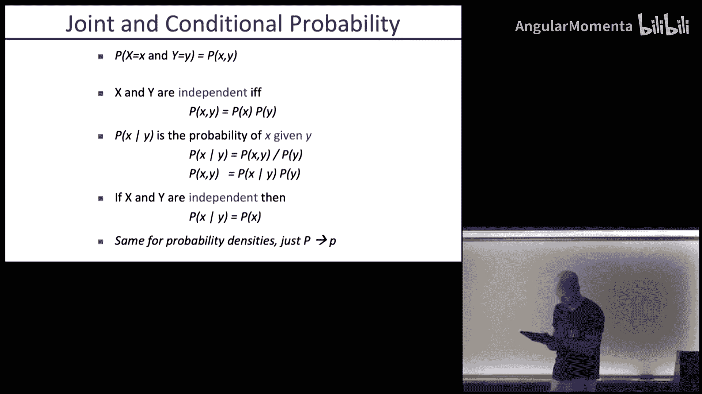
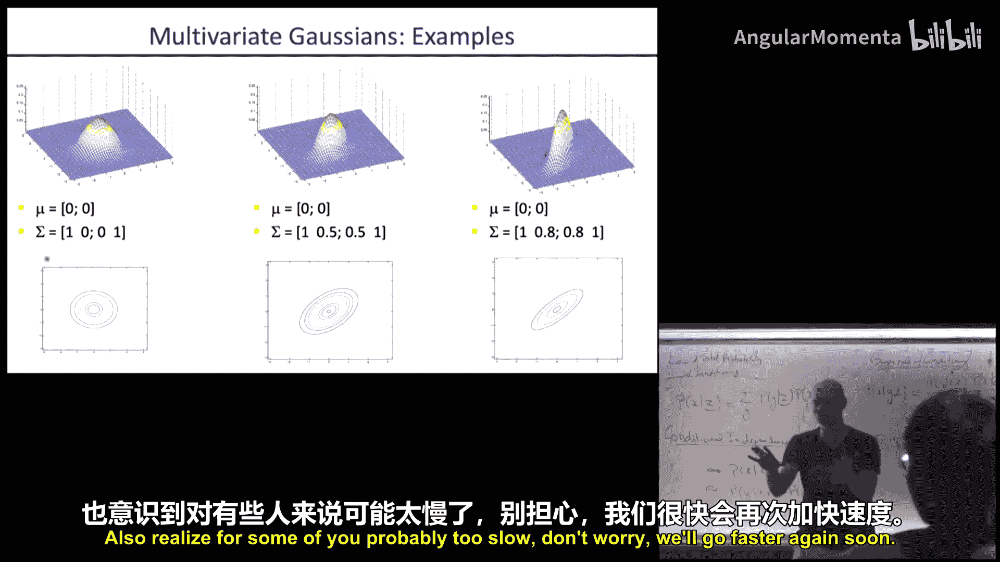
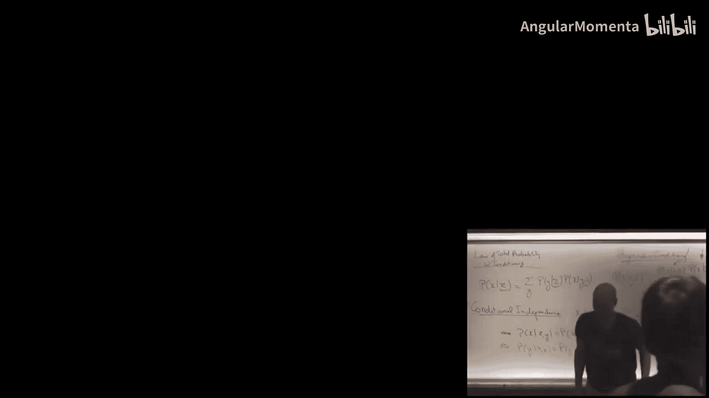

# 011：概率论回顾、贝叶斯滤波器与高斯分布

在本节课中，我们将学习概率论的核心概念，并了解如何将其应用于机器人学中的状态估计问题。我们将从概率论的基础知识回顾开始，然后介绍贝叶斯滤波器，这是一种用于在动态系统中结合动作和观测来估计状态分布的核心算法。最后，我们将探讨高斯分布，为下一节课在连续状态空间中应用这些概念打下基础。

---

## 概率论回顾

上一节我们介绍了本课程的目标。本节中，我们来看看概率论的基础知识，这是理解后续内容的关键。

概率论的公理定义了如何为事件分配概率。一个结果A的概率被分配一个介于0和1之间的数字。所有可能结果的并集Ω的概率为1。空集的概率为0。两个事件A和B的并集的概率为：**P(A ∪ B) = P(A) + P(B) - P(A ∩ B)**。

随机变量可以是离散的或连续的。对于离散随机变量X，我们使用概率质量函数P(X=x)。对于连续随机变量X，我们使用概率密度函数p(x)，其中X落在区间[a, b]的概率是密度函数在该区间上的积分：**P(a ≤ X ≤ b) = ∫_a^b p(x) dx**。

在机器人学中，我们经常需要处理涉及多个变量的分布，例如真实状态和传感器测量值。以下是处理联合分布的关键概念：

*   **联合分布**：P(X, Y) 表示X和Y同时取特定值的概率。
*   **边缘分布**：通过对联合分布求和（离散）或积分（连续）得到单个变量的分布，例如 **P(X) = Σ_y P(X, Y)**。
*   **条件分布**：在已知Y的条件下，X的概率分布定义为 **P(X|Y) = P(X, Y) / P(Y)**。
*   **独立性**：如果X和Y独立，则 **P(X, Y) = P(X)P(Y)**，且 **P(X|Y) = P(X)**。

我们将频繁使用两个核心公式：全概率定律和贝叶斯规则。

### 全概率定律

全概率定律允许我们通过对另一个变量求和来得到一个变量的分布。在离散情况下，公式为：**P(X) = Σ_y P(X|Y)P(Y)**。在连续情况下，求和变为积分：**p(x) = ∫ p(x|y)p(y) dy**。

当我们已经有一些观测Z时，条件版本同样适用：**P(X|Z) = Σ_y P(X|Y, Z)P(Y|Z)**。

### 贝叶斯规则

贝叶斯规则使我们能够从因果模型（观测给定状态）推导出诊断分布（状态给定观测）。其基本形式为：**P(X|Y) = P(Y|X)P(X) / P(Y)**。

其中，P(X)称为**先验**，P(Y|X)称为**似然**，P(Y)称为**证据**（一个归一化常数）。在实践中，我们通常计算未归一化的后验：**P(X|Y) ∝ P(Y|X)P(X)**，然后对所有可能的X值进行归一化，使其总和为1。

条件版本为：**P(X|Y, Z) = P(Y|X, Z)P(X|Z) / P(Y|Z)**。这允许我们在已有证据Z的情况下，纳入新的观测Y。

### 条件独立性

条件独立性是一个重要的简化假设。如果X和Y在给定Z时条件独立，则意味着：**P(X, Y|Z) = P(X|Z)P(Y|Z)**。这等价于 **P(X|Y, Z) = P(X|Z)** 或 **P(Y|X, Z) = P(Y|Z)**。

在机器人学中，一个常见的假设是：在已知真实世界状态X的条件下，不同的传感器观测是相互独立的。这极大地简化了计算，因为多个观测的联合似然变成了单个似然的乘积。但必须注意，如果传感器读数实际上并不独立（例如，由于共同的噪声源），此假设可能导致过度自信的估计。

---

## 贝叶斯滤波器

上一节我们回顾了概率论的基础工具。本节中，我们来看看如何将这些工具应用于动态系统，构建一个递归的状态估计算法，即贝叶斯滤波器。

在动态世界中，机器人不仅进行观测，还执行动作。动作通常会增加不确定性，而观测则会减少不确定性。我们可以用一个概率模型来描述动作的效果：**P(X' | X, U)**，表示在状态X下执行动作U后，转移到状态X'的概率。

贝叶斯滤波器的目标是：给定一系列动作U1, U2, ... 和观测Z1, Z2, ...，以及初始状态分布P(X0)，递归地估计每个时刻t的状态后验分布 **Bel(X_t) = P(X_t | U1, Z1, ..., Ut, Zt)**。

我们基于两个马尔可夫假设来构建递归更新：
1.  **状态完备性假设**：当前状态Xt包含了预测未来所需的所有历史信息。即，下一个状态只依赖于当前状态和动作：**P(X_t | X_{0:t-1}, U_{1:t}) = P(X_t | X_{t-1}, U_t)**。
2.  **观测独立性假设**：当前观测只依赖于当前状态：**P(Z_t | X_{0:t}, Z_{1:t-1}, U_{1:t}) = P(Z_t | X_t)**。

在这些假设下，贝叶斯滤波器通过两个步骤递归更新置信度Bel(X_t)：

1.  **预测步骤（动作更新）**：当我们执行动作U_t时，我们使用全概率定律来预测新状态：
    **Bel̄(X_t) = Σ_{x_{t-1}} P(X_t | x_{t-1}, U_t) Bel(x_{t-1})**
    其中Bel̄(X_t)表示执行动作后、获得观测前的预测置信度。

2.  **更新步骤（观测更新）**：当我们获得观测Z_t时，我们使用贝叶斯规则来修正我们的预测：
    **Bel(X_t) = η P(Z_t | X_t) Bel̄(X_t)**
    其中η是一个归一化常数，确保Bel(X_t)在所有可能状态上的总和为1。

以下是贝叶斯滤波器的算法步骤：
*   初始化：Bel(X_0) = P(X_0) // 初始状态分布
*   对于每个时间步 t = 1, 2, ...：
    *   **预测**：Bel̄(X_t) = Σ_{x_{t-1}} P(X_t | x_{t-1}, U_t) Bel(x_{t-1})
    *   **更新**：Bel(X_t) = η P(Z_t | X_t) Bel̄(X_t)

贝叶斯滤波器是许多状态估计算法（如卡尔曼滤波器、粒子滤波器）的基础框架。它允许我们在存在噪声动作和观测的情况下，持续跟踪对世界状态的最佳概率估计。

---

## 高斯分布

上一节我们介绍了用于离散状态的贝叶斯滤波器。本节中，我们来看看高斯分布，它是将贝叶斯滤波器扩展到连续状态空间的关键工具，尤其是在非线性系统的局部近似中。

### 一元高斯分布

一元高斯分布（正态分布）由均值μ和方差σ²参数化。其概率密度函数为：
**p(x) = (1 / √(2πσ²)) exp( - (x - μ)² / (2σ²) )**

其性质包括：
*   密度函数积分为1。
*   期望值 E[X] = μ。
*   方差 Var[X] = E[(X - μ)²] = σ²。

高斯分布之所以重要，一方面是因为其数学形式便于处理（许多积分有解析解），另一方面是因为中心极限定理：大量独立随机变量之和的分布趋近于高斯分布。

### 多元高斯分布

当状态是向量时，我们使用多元高斯分布。对于一个n维随机向量X，其分布由均值向量μ和协方差矩阵Σ参数化。密度函数为：
**p(x) = (1 / √((2π)^n |Σ|)) exp( -½ (x - μ)^T Σ^{-1} (x - μ) )**

其中：
*   μ = E[X] 是均值向量。
*   Σ = E[(X - μ)(X - μ)^T] 是协方差矩阵，它是一个对称半正定矩阵。对角线元素Σ_ii是第i个分量的方差，非对角线元素Σ_ij表示分量i和j之间的协方差（相关性）。

协方差矩阵Σ决定了分布的形态。如果Σ是对角矩阵，则各分量之间相互独立，等高线是轴对齐的椭圆。如果Σ非对角，则存在相关性，等高线是旋转的椭圆。正相关性使椭圆沿主对角线方向延伸，负相关性则沿副对角线方向延伸。

在下一节课中，我们将探讨高斯分布下的全概率定律和贝叶斯规则的具体形式，从而推导出适用于连续状态空间的卡尔曼滤波器及其非线性扩展（扩展卡尔曼滤波器）。

---

本节课中我们一起学习了概率论的核心概念，包括全概率定律和贝叶斯规则。我们探讨了如何利用这些概念构建贝叶斯滤波器，以递归方式结合动作和观测来估计动态系统的状态分布。最后，我们介绍了高斯分布的特性，为下一节课在连续空间中实现这些算法做好了准备。