# 012：卡尔曼滤波器 🧮

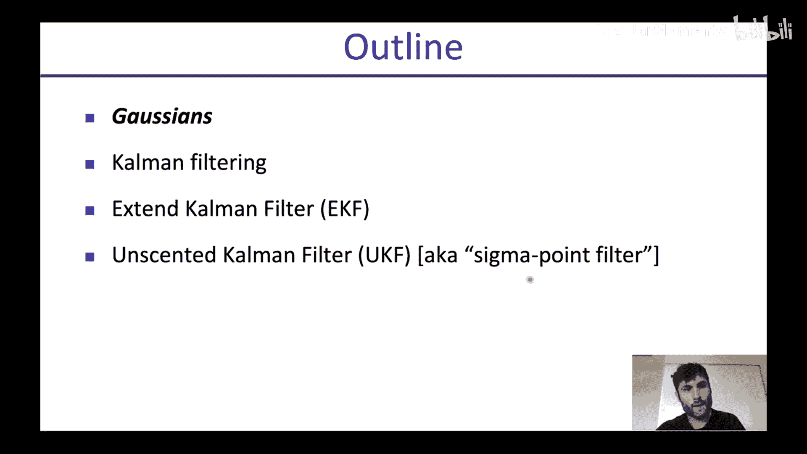

在本节课中，我们将要学习卡尔曼滤波器。首先，我们会介绍其数学基础——多元高斯变量。接着，我们将详细阐述适用于线性系统的标准卡尔曼滤波器。最后，我们会探讨其在非线性系统中的两种扩展：扩展卡尔曼滤波器和无迹卡尔曼滤波器。

## 多元高斯变量概述 📊

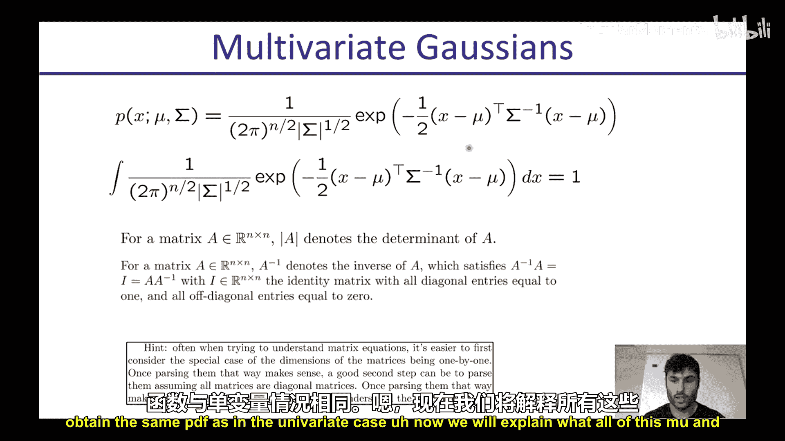

在深入探讨卡尔曼滤波器及其相关机制之前，我们首先需要对多元高斯变量进行概述。因为这是正确理解卡尔曼滤波器所需的所有数学背景。

多元高斯变量由两个参数定义：一个是向量 **μ**，另一个是矩阵 **Σ**。其概率密度函数定义如下：

$$
p(x) = \frac{1}{\sqrt{(2\pi)^n |\Sigma|}} \exp\left(-\frac{1}{2}(x - \mu)^T \Sigma^{-1} (x - \mu)\right)
$$

本质上，多元高斯分布被定义为二次型的指数形式。参数 **μ** 是一个位置参数，它决定了概率密度函数的中心。参数 **Σ** 是一个尺度参数，它必须满足三个条件：对称性、正定性以及可逆性（因为公式中需要求逆）。公式中的标量项（包含 π、维度 n 和矩阵 Σ 的行列式）是归一化常数，确保整个定义域上的积分等于 1。

这个关系在后续内容中非常重要，它意味着指数项的积分等于行列式项，我们稍后会用到这一点。

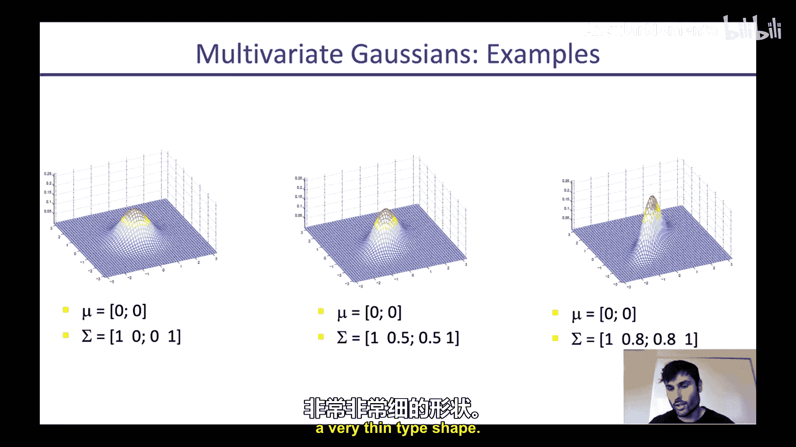

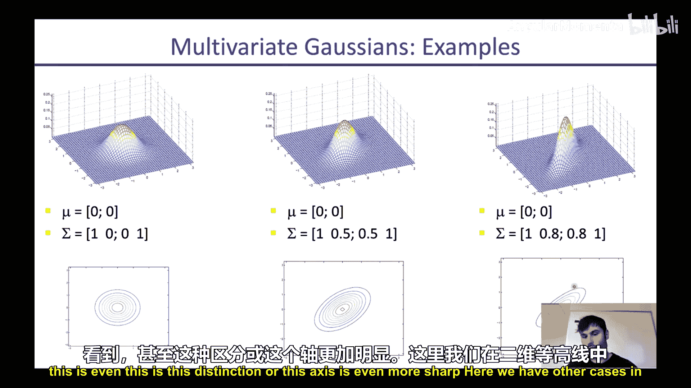

**一些快速记号**：给定矩阵 A，|A| 表示其行列式，A⁻¹ 表示其逆矩阵。对于这些公式，通常将其想象为一维情况会更容易理解，此时矩阵退化为标量，即单变量高斯分布。

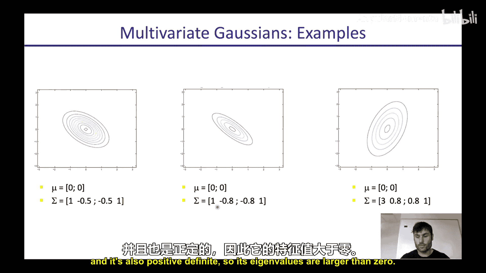

## 参数 μ 和 Σ 的含义 🔍

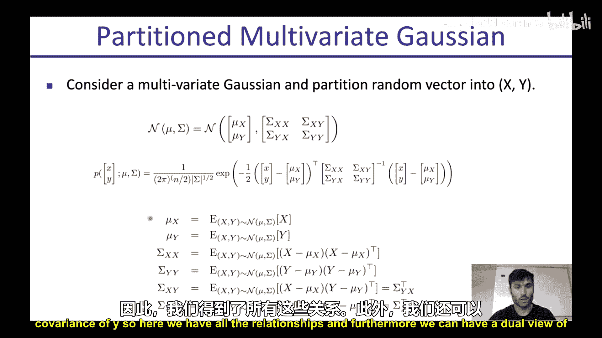

参数 μ 的第 i 个分量 μᵢ，表示随机变量 X 的第 i 个分量 Xᵢ 的期望值。用向量表示，即 E[X] = μ。

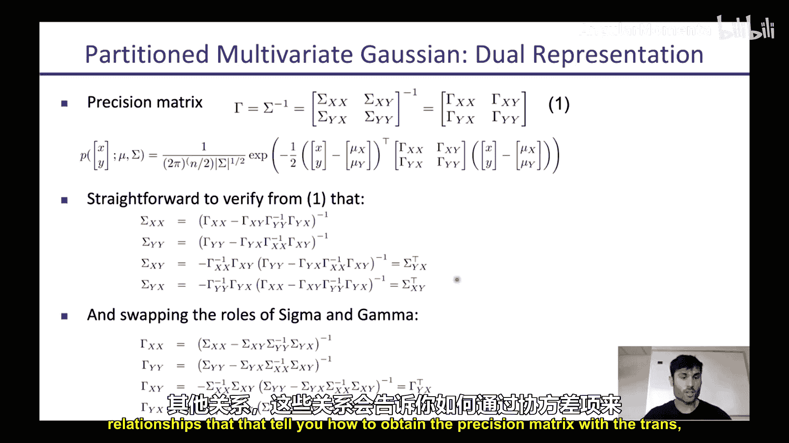

矩阵 Σ 的 (i, j) 分量 Σᵢⱼ，表示随机变量 Xᵢ 和 Xⱼ 之间的协方差。用矩阵表示，即 Cov[X] = Σ。

接下来，我们看看这些参数如何影响基础的概率密度函数。

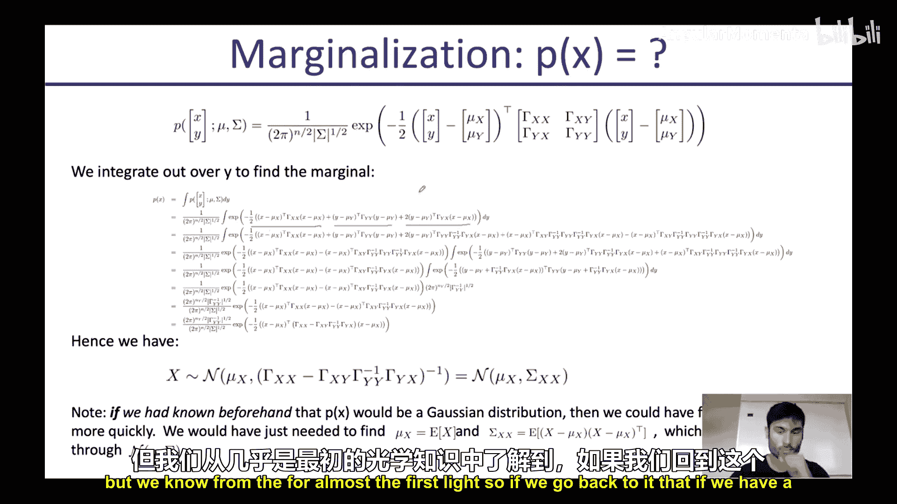

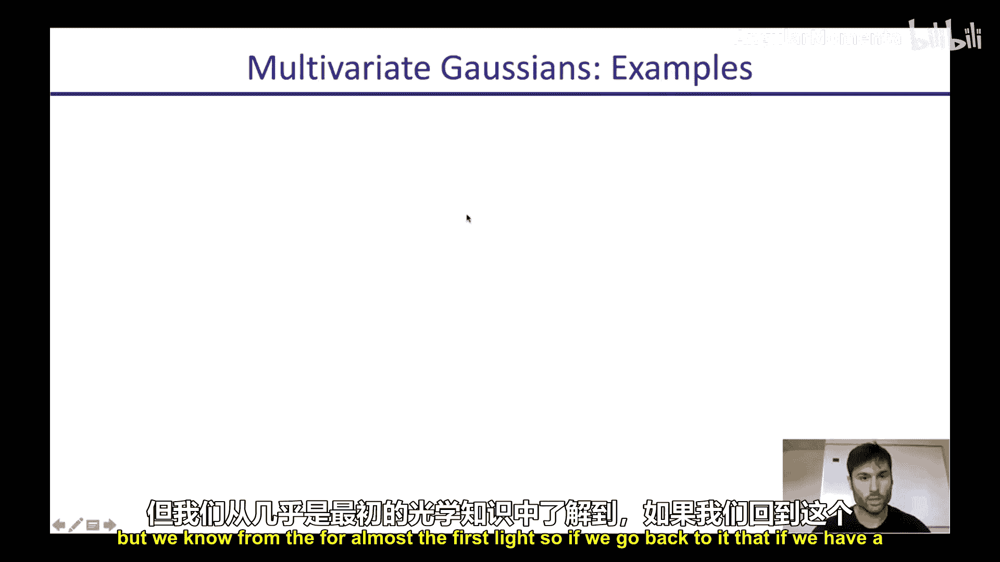

## 参数对概率密度函数的影响 📈

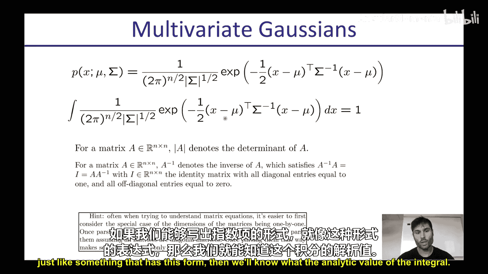

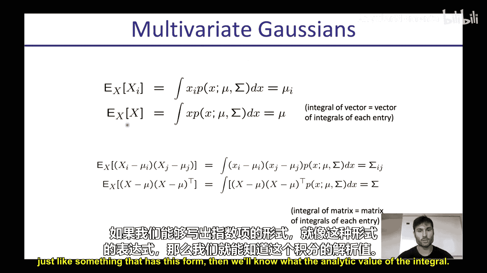

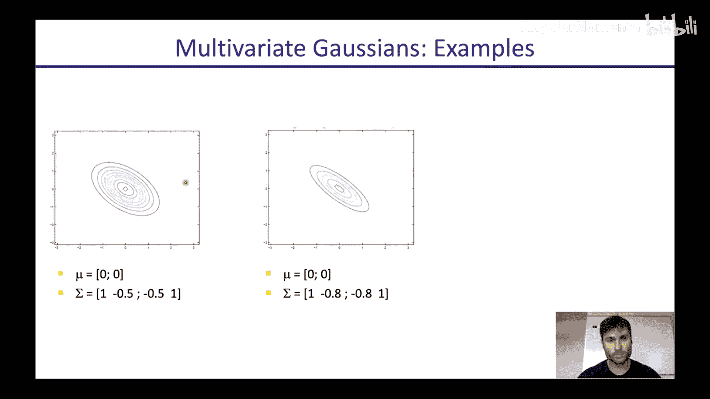

通过示例，我们可以直观地看到参数变化如何改变分布的形状。改变参数 μ 会平移整个分布，因此 μ 是位置参数。改变协方差矩阵 Σ 则会改变分布的“扩散”程度和相关性。

*   **缩放协方差**：缩小协方差矩阵会使分布更集中，均值点附近的概率密度更高；放大协方差矩阵则会使分布更分散。
*   **非对角协方差**：当协方差矩阵非对角时，表示变量间存在相关性。正相关会使分布呈沿对角线方向拉伸的椭圆形；负相关则使分布沿另一对角线方向拉伸。相关性越强，椭圆越扁长。

这些形状可以通过等高线图来观察。协方差矩阵必须满足对称、正定、可逆的条件。

## 分块表示与精度矩阵 🧩

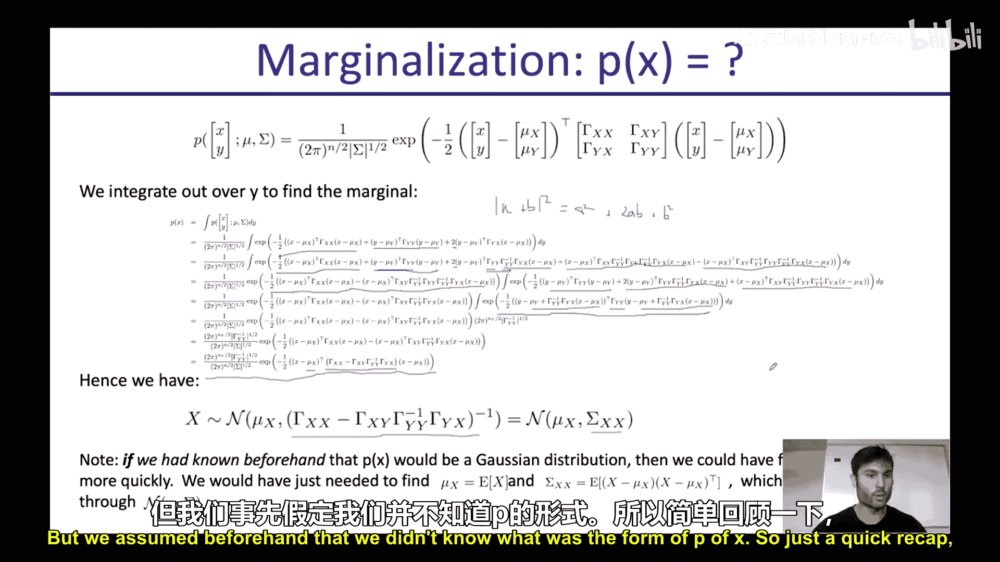

给定一个高维多元高斯随机向量，我们通常希望将其分割为两部分，例如 X 和 Y，并基于 X 和 Y 的期望和协方差来表示整个向量。这在后续进行边缘化和条件化操作时非常有用。

我们可以将均值向量 μ 和协方差矩阵 Σ 进行分块表示：
$$
\mu = \begin{bmatrix} \mu_x \\ \mu_y \end{bmatrix}, \quad
\Sigma = \begin{bmatrix} \Sigma_{xx} & \Sigma_{xy} \\ \Sigma_{yx} & \Sigma_{yy} \end{bmatrix}
$$

此外，我们还可以使用**精度矩阵** Γ（即协方差矩阵的逆，Γ = Σ⁻¹）来重新表示高斯分布。这样做的好处是在代数运算中可以避免处理逆矩阵，使推导更简便。精度矩阵也可以进行类似的分块。

## 边缘化操作 ➗

上一节我们介绍了多元高斯分布的分块表示，本节中我们来看看第一个关键操作：**边缘化**。给定随机变量 X 和 Y 的联合高斯分布，我们想要求出仅关于 X 的边缘分布 p(x)。

我们通过积分消去 Y 来求解 p(x)。虽然推导过程涉及复杂的代数运算，但核心是使用**配方法**将积分项转化为标准高斯分布的形式，从而利用已知的积分结果。最终，我们得到边缘分布 p(x) 也是一个高斯分布，其参数为：
$$
p(x) = \mathcal{N}(x; \mu_x, \Sigma_{xx})
$$
这意味着，对于联合高斯分布，变量 X 的边缘分布可以直接从联合分布的参数中读取：均值就是 μ_x，协方差就是 Σ_{xx}。

## 条件化操作 ⚙️

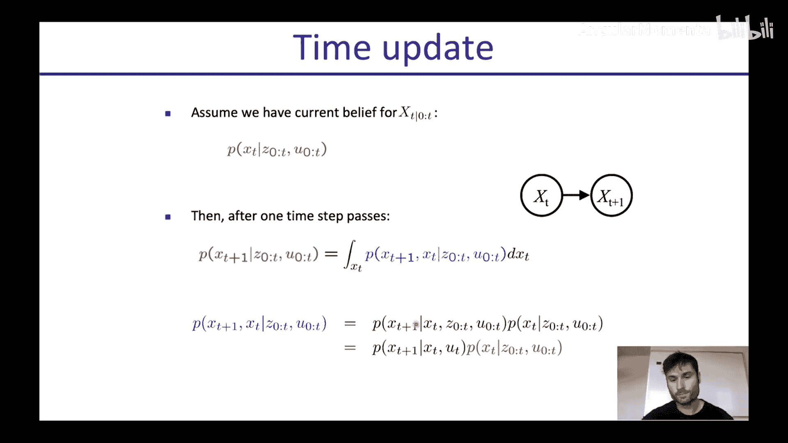

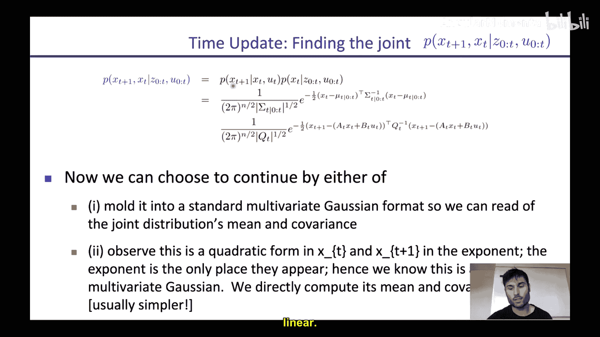

第二个关键操作是**条件化**。给定联合分布 p(x, y)，如果我们观察到 Y 取某个特定值 y₀，那么 X 的条件分布 p(x | y=y₀) 是什么？

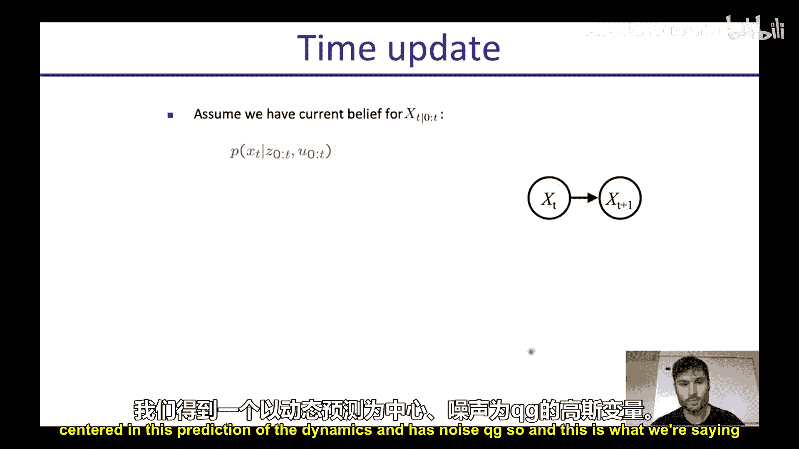

推导过程同样使用配方法。最终，我们得到条件分布 p(x | y=y₀) 也是一个高斯分布，其参数为：
$$
\begin{aligned}
p(x | y=y_0) &= \mathcal{N}(x; \mu_{x|y}, \Sigma_{x|y}) \\
\mu_{x|y} &= \mu_x + \Sigma_{xy} \Sigma_{yy}^{-1} (y_0 - \mu_y) \\
\Sigma_{x|y} &= \Sigma_{xx} - \Sigma_{xy} \Sigma_{yy}^{-1} \Sigma_{yx}
\end{aligned}
$$
条件均值 μ_{x|y} 是在先验均值 μ_x 的基础上，根据观测误差 (y₀ - μ_y) 和变量间的相关性 Σ_{xy} 进行修正。条件协方差 Σ_{x|y} 比先验协方差 Σ_{xx} 要小，这反映了观测降低了我们对 X 的不确定性。

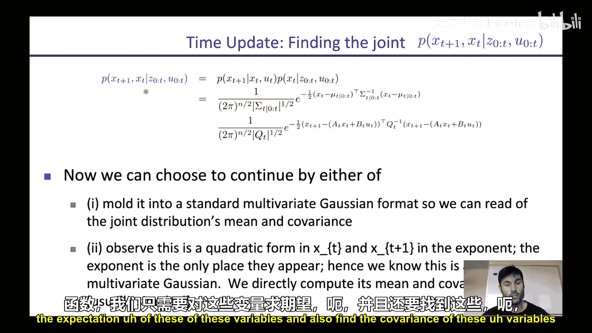

## 卡尔曼滤波器核心算法 🚀

现在，我们进入本节课的核心部分：卡尔曼滤波器。卡尔曼滤波器可以看作是贝叶斯滤波的一个特例，适用于**动态系统**和**观测模型**都是**线性**的，并且所有噪声都是**高斯分布**的情况。在这种情况下，所有涉及的变量也都是高斯的，我们可以高效地递推估计系统状态。

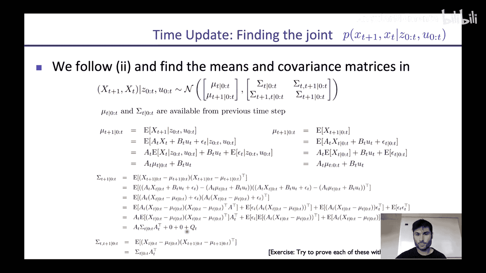

我们假设知道系统的初始状态分布。我们能够获取观测值 Z_t，但无法直接获取底层状态 X_t。我们的目标是在给定观测序列的条件下，估计系统的状态序列。这在机器人学中非常常见，我们通常只能通过传感器间接感知状态。

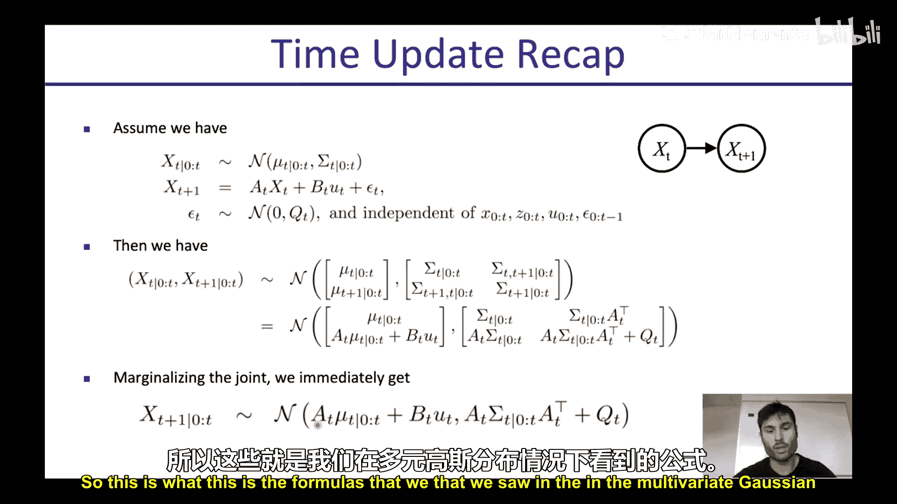

卡尔曼滤波器包含两个主要步骤，交替进行：

### 1. 时间更新（预测）

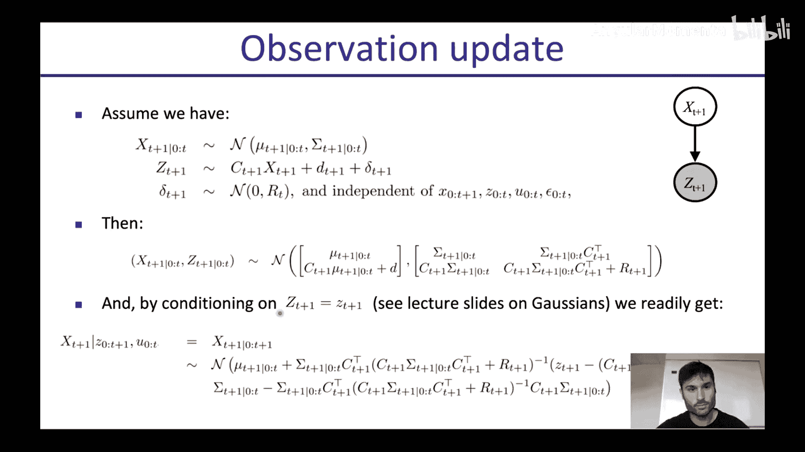

在时间更新步骤，我们利用上一时刻的状态估计和系统动态模型，预测当前时刻的状态先验分布。
我们假设已知上一时刻的后验分布 p(x_t | z_{0:t}, u_{0:t-1})。根据线性动态模型：
$$
x_{t+1} = A_t x_t + B_t u_t + \epsilon_t, \quad \epsilon_t \sim \mathcal{N}(0, Q_t)
$$
我们可以推导出联合分布 p(x_t, x_{t+1} | ...)，然后对其边缘化，得到预测的先验分布 p(x_{t+1} | z_{0:t}, u_{0:t})。这是一个高斯分布，其参数为：
$$
\begin{aligned}
\mu_{t+1|t} &= A_t \mu_{t|t} + B_t u_t \\
\Sigma_{t+1|t} &= A_t \Sigma_{t|t} A_t^T + Q_t
\end{aligned}
$$

### 2. 测量更新（修正）

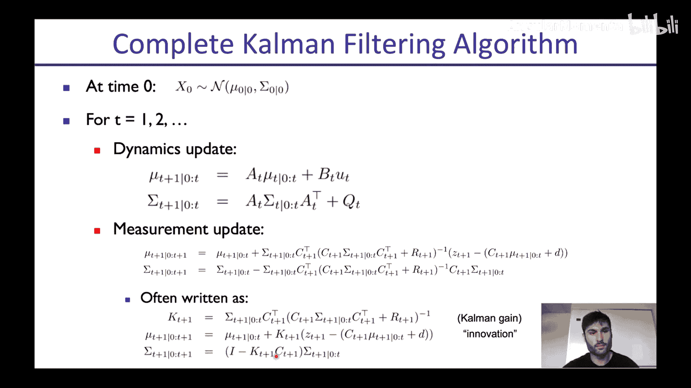

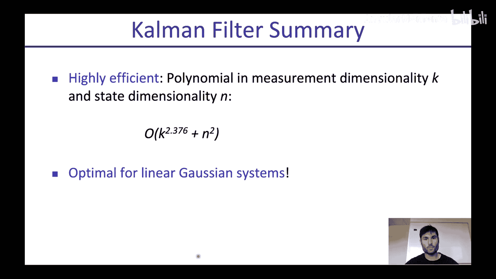

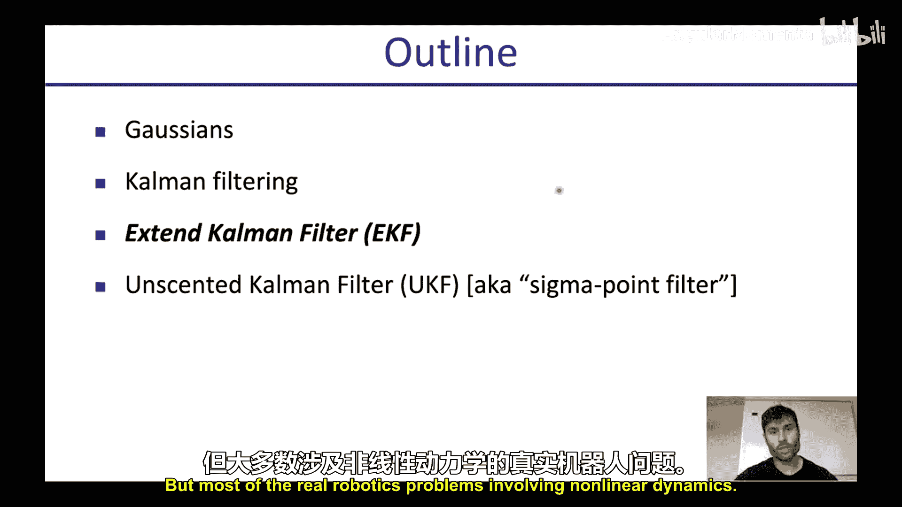

在测量更新步骤，我们获得新的观测值 z_{t+1}，并利用它来修正我们的预测，得到状态的后验分布。
我们假设已知预测的先验分布 p(x_{t+1} | z_{0:t}, u_{0:t}) 和线性观测模型：
$$
z_{t+1} = C_{t+1} x_{t+1} + D_{t+1} + \delta_{t+1}, \quad \delta_{t+1} \sim \mathcal{N}(0, R_{t+1})
$$
我们可以推导出联合分布 p(x_{t+1}, z_{t+1} | ...)，然后对其条件化，将 z_{t+1} 固定为实际观测值，得到后验分布 p(x_{t+1} | z_{0:t+1}, u_{0:t})。这也是一个高斯分布，其参数为：
$$
\begin{aligned}
K_{t+1} &= \Sigma_{t+1|t} C_{t+1}^T (C_{t+1} \Sigma_{t+1|t} C_{t+1}^T + R_{t+1})^{-1} \\
\mu_{t+1|t+1} &= \mu_{t+1|t} + K_{t+1}(z_{t+1} - (C_{t+1}\mu_{t+1|t} + D_{t+1})) \\
\Sigma_{t+1|t+1} &= (I - K_{t+1}C_{t+1}) \Sigma_{t+1|t}
\end{aligned}
$$
其中，**K** 被称为**卡尔曼增益**。它决定了我们应该在多大程度上相信新的观测。后验均值是先验均值加上以卡尔曼增益加权的观测误差（即“新息”）。后验协方差则反映了在融入观测信息后，状态不确定性的减少。

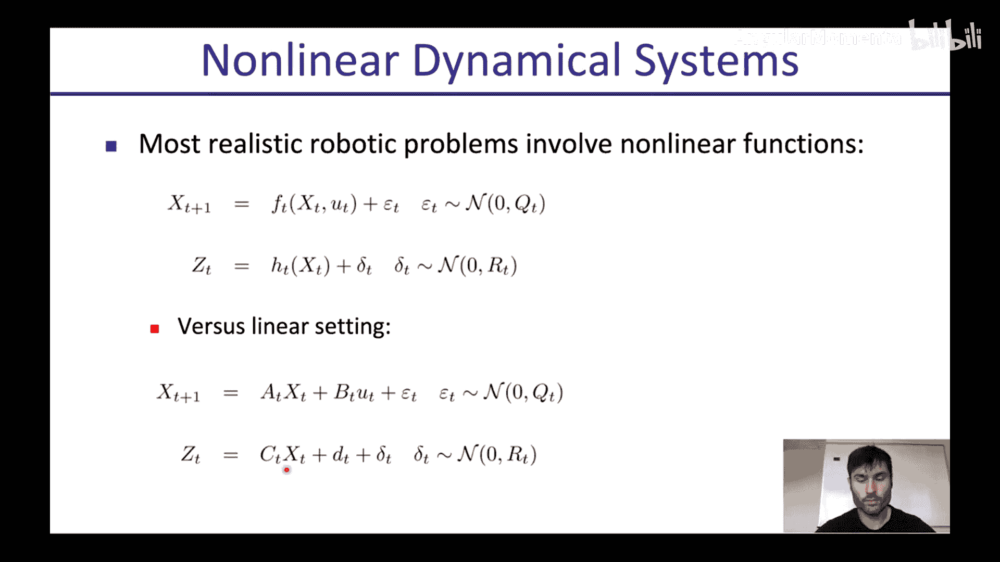

卡尔曼滤波器非常高效（仅涉及矩阵运算），并且对于线性高斯系统是**最优**估计器。

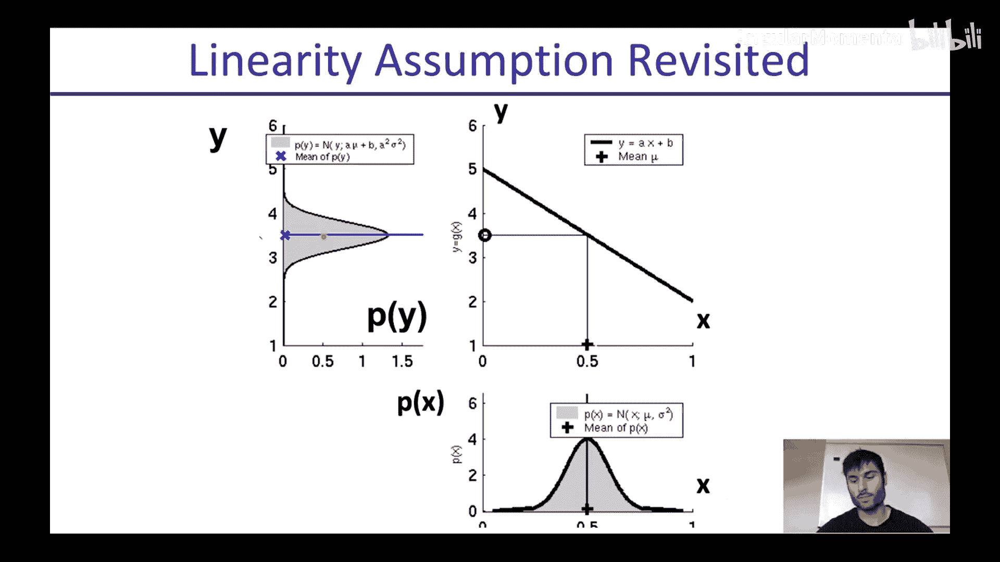

## 扩展卡尔曼滤波器 🌀

上一节我们学习了适用于线性系统的卡尔曼滤波器，但在实际的机器人问题中，系统动态和观测模型往往是**非线性**的。扩展卡尔曼滤波器是处理非线性情况的一种方法。

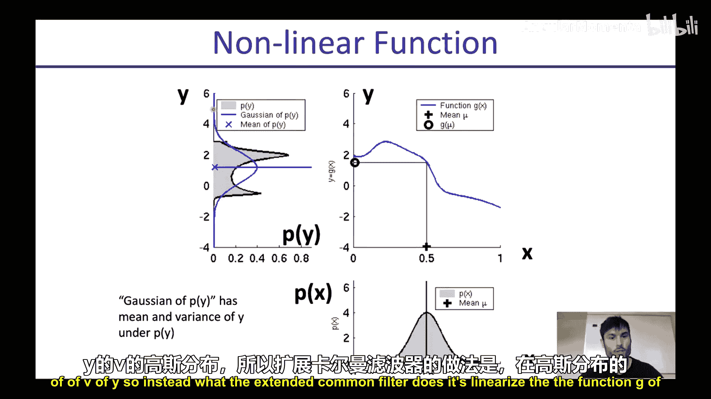

EKF 的核心思想是**局部线性化**。它在当前状态估计的均值点处，对非线性函数 f（动态模型）和 h（观测模型）进行一阶泰勒展开：
$$
\begin{aligned}
x_{t+1} &= f(x_t, u_t) + \epsilon_t \approx f(\mu_{t|t}, u_t) + F_t (x_t - \mu_{t|t}) + \epsilon_t \\
z_t &= h(x_t) + \delta_t \approx h(\mu_{t|t}) + H_t (x_t - \mu_{t|t}) + \delta_t
\end{aligned}
$$
其中，F_t 和 H_t 分别是 f 和 h 在 μ_{t|t} 处的雅可比矩阵。

得到线性化模型后，EKF 就套用标准卡尔曼滤波器的公式进行预测和更新，只是将矩阵 A, B, C, D 替换为线性化后的 F, B*, H, D*。

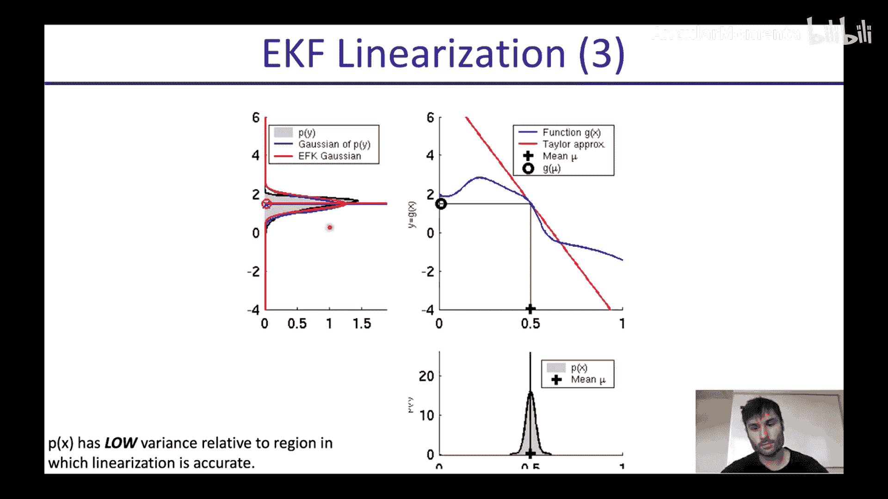

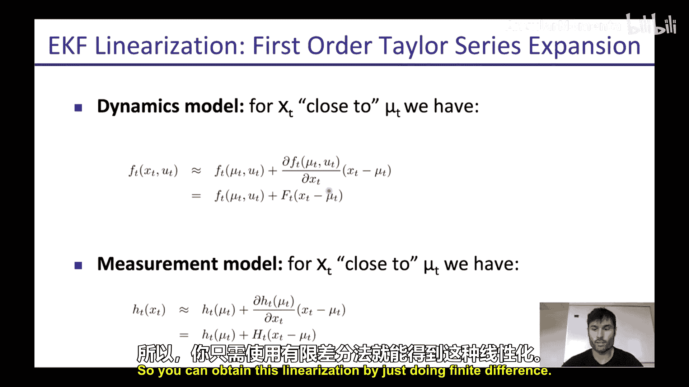

**EKF 的特点**：
*   **效率**：与KF计算量同级，若雅可比矩阵易得则实现简单。
*   **缺点**：不再是全局最优估计；线性化误差在非线性程度高、不确定性大时可能导致滤波器发散。但在许多实际应用中，当不确定性较小时，EKF 表现良好。

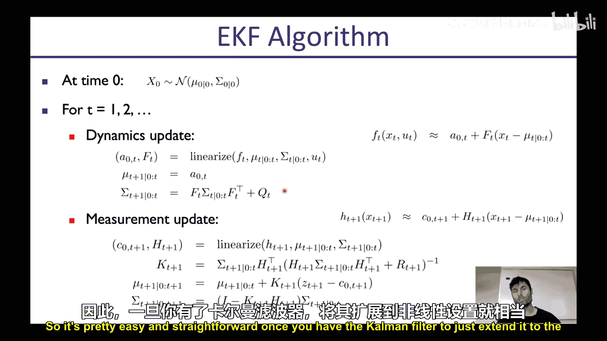

## 无迹卡尔曼滤波器 🎯

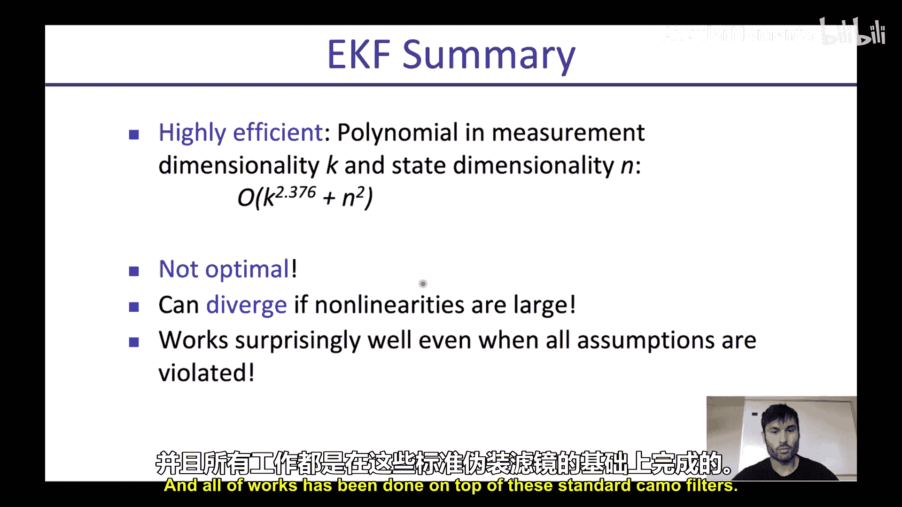

EKF 通过对非线性函数本身进行近似来工作，而无迹卡尔曼滤波器则采用不同的策略：它直接对**经过非线性变换后的概率分布**进行高斯近似。

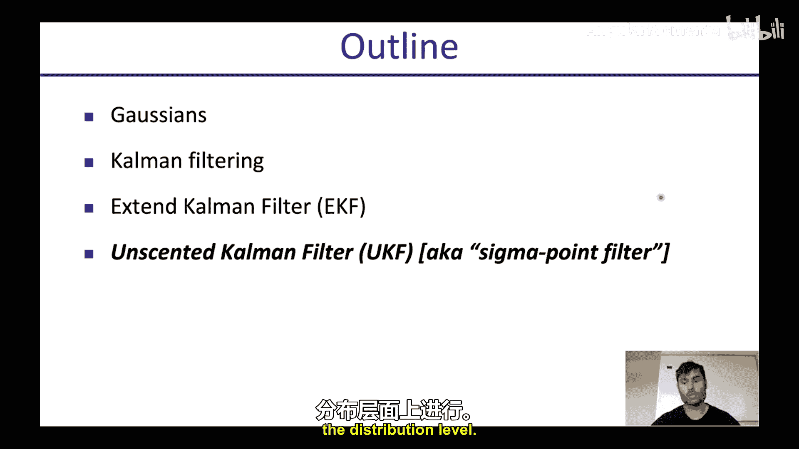

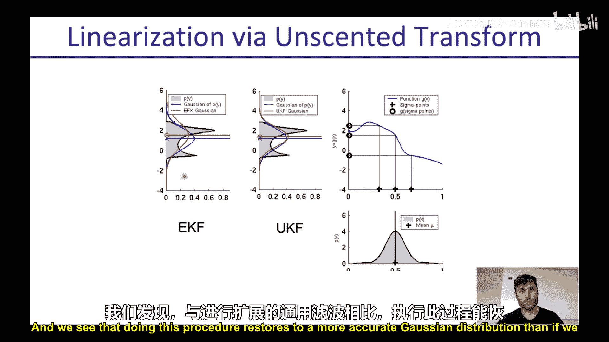

UKF 使用一种称为**无迹变换**的技术。它并不线性化函数，而是精心选择一组具有代表性的点（称为 Sigma 点），将这些点直接通过真实的非线性函数进行变换，然后基于变换后的点集计算出一个高斯分布的均值和协方差，作为对真实后验分布的近似。

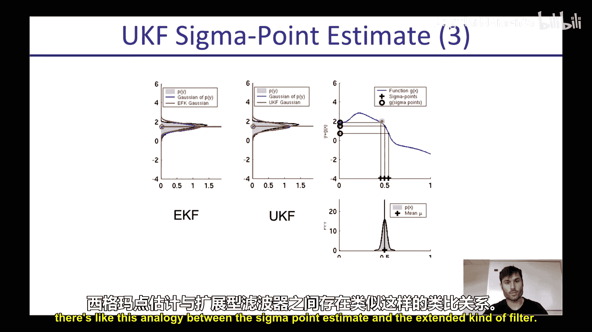

**Sigma 点的选择**：通常选择 2n+1 个点（n为状态维度），包括均值点，以及沿协方差矩阵主轴方向对称分布的点。
$$
\begin{aligned}
\mathcal{X}^{(0)} &= \mu \\
\mathcal{X}^{(i)} &= \mu + \sqrt{n+\kappa} \cdot \text{col}_i(\sqrt{\Sigma}), \quad i=1,...,n \\
\mathcal{X}^{(i+n)} &= \mu - \sqrt{n+\kappa} \cdot \text{col}_i(\sqrt{\Sigma}), \quad i=1,...,n
\end{aligned}
$$
其中，√Σ 表示协方差矩阵的平方根矩阵（例如通过乔列斯基分解得到），κ 是一个可调参数。

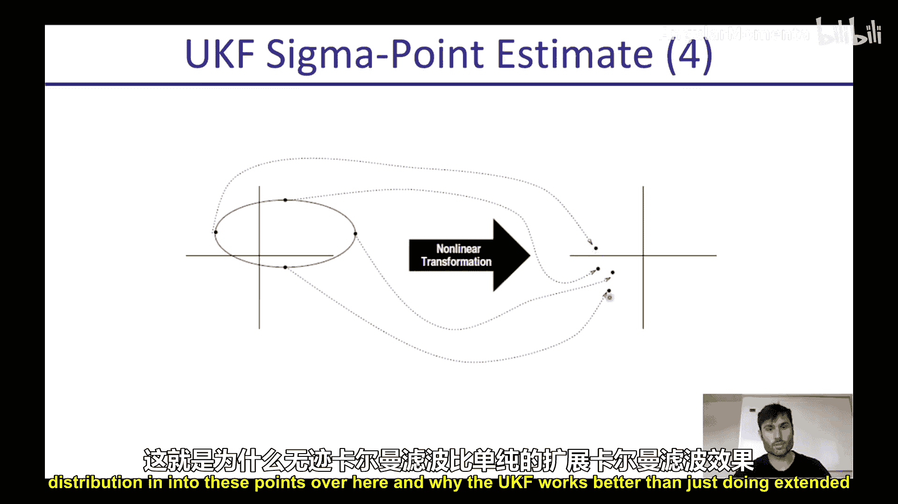

**UKF 的步骤**：
1.  根据当前状态分布的均值和协方差，计算 Sigma 点集。
2.  将每个 Sigma 点通过非线性动态或观测模型进行传播。
3.  根据传播后的点集，计算预测的均值、协方差，以及状态与观测的互协方差。
4.  使用与标准卡尔曼滤波器类似的更新公式，计算卡尔曼增益和后验分布。

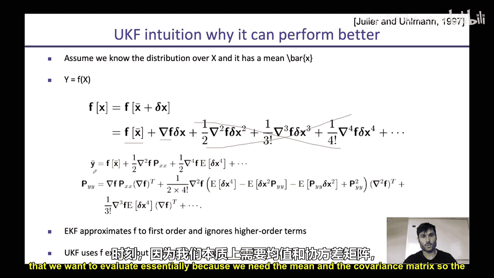

**UKF 与 EKF 的比较**：
*   **精度**：UKF 能捕获非线性变换的更高阶矩信息，通常比 EKF 的近似更准确，尤其在不确定性较大时。
*   **效率**：无需计算雅可比矩阵，对于复杂非线性函数，可能比 EKF 更快。
*   **实现**：同样易于实现，且不存在线性化误差导致的发散问题（在相同近似阶数下）。
*   **缺点**：和 EKF 一样，它也是对真实后验的高斯近似，并非最优。

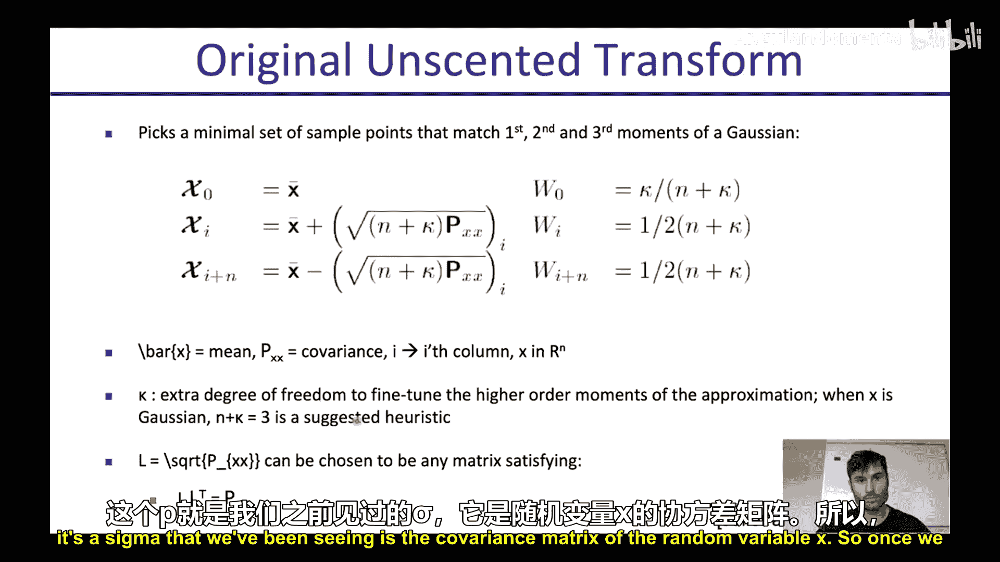

## 总结 📝

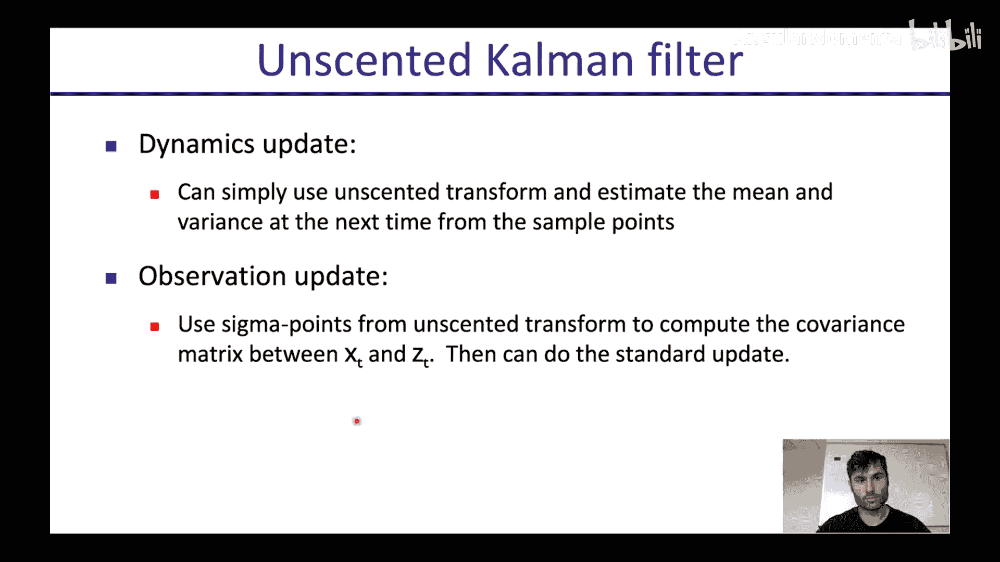

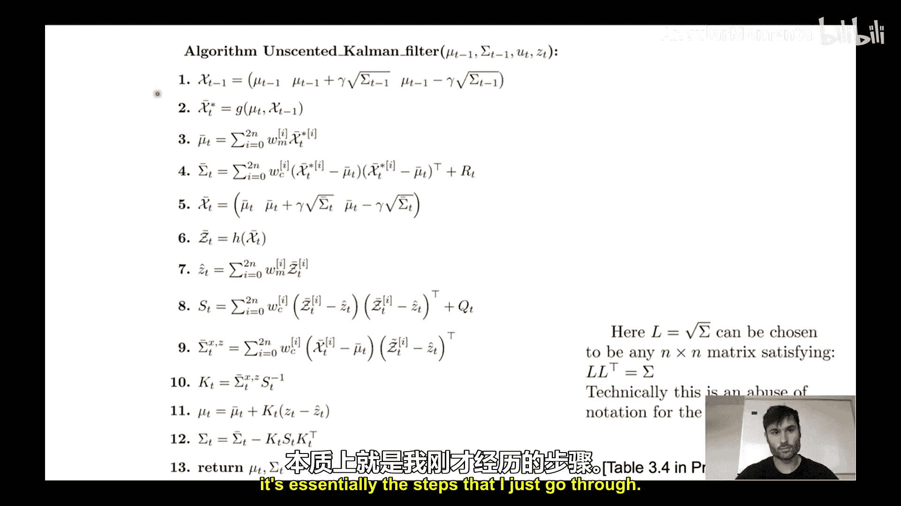

本节课中我们一起学习了状态估计的核心工具——卡尔曼滤波器及其变种。
*   我们首先建立了多元高斯分布的数学基础，包括其参数、边缘化和条件化公式。
*   基于此，我们推导了适用于线性高斯系统的**标准卡尔曼滤波器**，它通过预测和更新两个步骤，提供最优的状态估计。
*   为了处理非线性系统，我们介绍了**扩展卡尔曼滤波器**，它通过局部线性化来应用KF框架。
*   最后，我们学习了**无迹卡尔曼滤波器**，它通过无迹变换直接近似非线性变换后的分布，通常能提供比EKF更准确和稳定的性能。

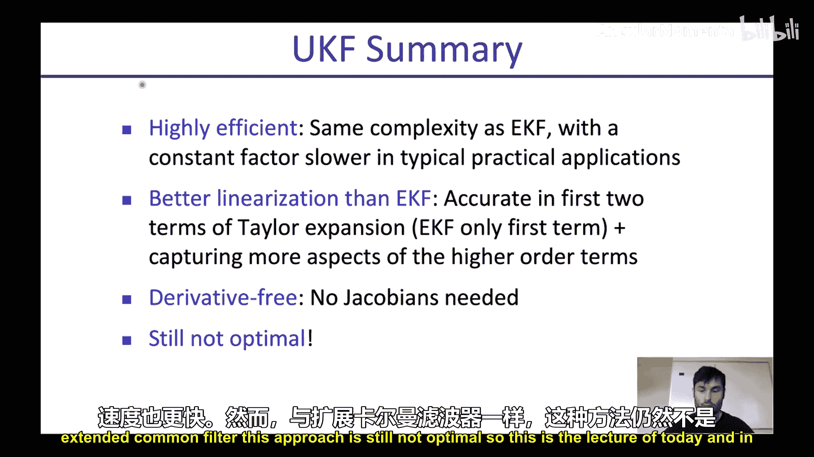

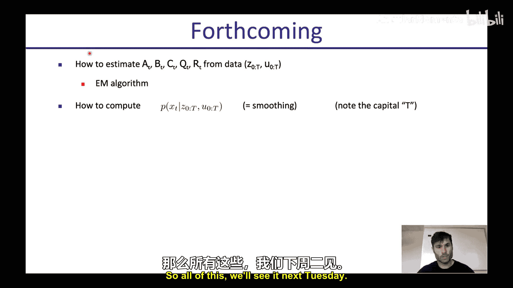

这三种滤波器构成了机器人状态估计的基石，在实际系统中被广泛应用。在接下来的课程中，我们将探讨如何估计系统的动态模型和观测模型本身，以及如何利用更多未来观测信息来平滑过去的状态估计。