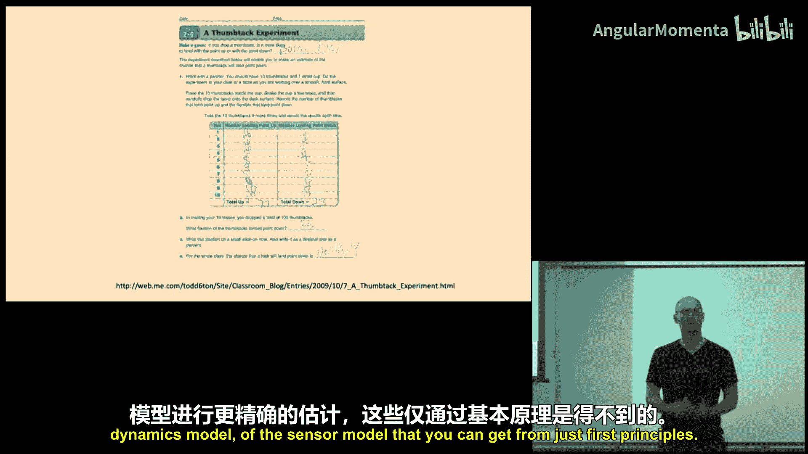
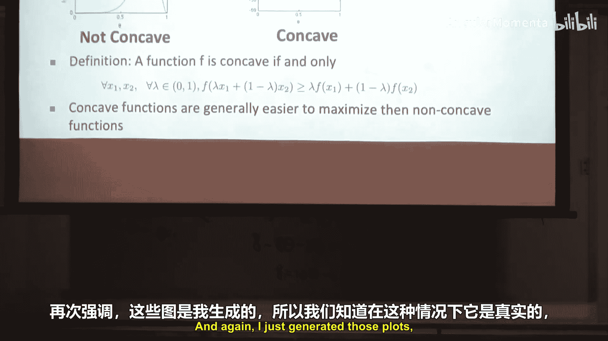
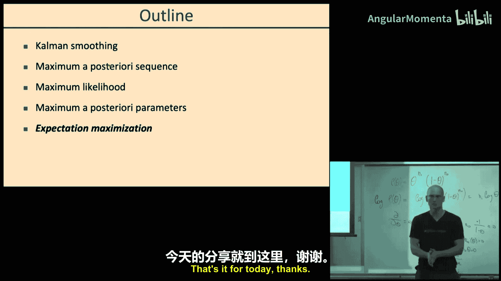

# 013：卡尔曼平滑器、最大后验概率、最大似然、期望最大化

## 概述
在本节课中，我们将学习状态估计中的平滑技术，以及如何从数据中估计模型参数。我们将从回顾滤波开始，然后介绍如何利用未来观测数据进行平滑估计。接着，我们将探讨如何寻找最可能的状态序列（最大后验概率估计），以及如何从完全观测的数据中估计模型参数（最大似然估计）。最后，我们会简要提及当存在未观测变量时，参数估计所面临的挑战。

## 从滤波到平滑

上一节我们回顾了滤波，即利用截至当前时刻的所有观测数据来估计当前状态的概率分布。本节中，我们来看看平滑。平滑与滤波的关键区别在于，平滑不仅使用过去的观测，还使用未来的观测来估计某一历史时刻的状态。这在事后分析数据时非常有用。

以下是平滑与滤波的核心区别：
*   **滤波**：估计 `P(x_t | z_0, ..., z_t)`，仅使用过去和当前的观测。
*   **平滑**：估计 `P(x_t | z_0, ..., z_T)`，其中 `T > t`，使用全部观测数据。

为了理解平滑的计算原理，我们以一个简单的三时刻（t=0,1,2）隐马尔可夫模型为例。我们关心在给定所有观测 `z_0, z_1, z_2` 的情况下，状态 `x_2` 的分布。

根据贝叶斯规则，这个后验分布与联合分布成正比：
`P(x_2 | z_0, z_1, z_2) ∝ P(x_2, z_0, z_1, z_2)`

为了计算这个联合分布，我们需要对未关心的状态变量（`x_0`, `x_1`）进行求和（或积分）：
`P(x_2, z_0, z_1, z_2) = Σ_{x_0} Σ_{x_1} P(x_0, x_1, x_2, z_0, z_1, z_2)`

利用链式法则和模型的条件独立性（`z_t` 仅依赖于 `x_t`，`x_t` 仅依赖于 `x_{t-1}`），我们可以将联合概率分解。通过巧妙地交换求和与乘积的顺序，我们可以将计算分解为两个递归过程：
1.  **前向过程**：从 `t=0` 开始，递归计算 `P(x_t, z_0, ..., z_t)`。这本质上就是滤波算法。
2.  **后向过程**：从 `t=T` 开始，递归计算 `P(z_{t+1}, ..., z_T | x_t)`，即给定当前状态 `x_t` 时，未来所有观测的似然。

最终，在目标时刻 `t`，平滑分布可以通过结合前向信息（与状态的联合分布）和后向信息（未来观测的似然）以及当前时刻的观测似然得到：
`P(x_t | z_0, ..., z_T) ∝ [前向信息] * P(z_t | x_t) * [后向信息]`

这种分解使得平滑计算的时间复杂度与时间序列长度呈线性关系，避免了直接计算的指数复杂度。

## 卡尔曼平滑器

上一节我们介绍了平滑的一般概念。本节中我们来看看一个非常重要的特例：**卡尔曼平滑器**。

当系统的动态模型和观测模型都是**线性高斯**模型时，即：
*   状态转移：`x_{t+1} = A_t x_t + B_t u_t + w_t`, 其中 `w_t ~ N(0, Q_t)`
*   观测模型：`z_t = C_t x_t + D_t u_t + v_t`, 其中 `v_t ~ N(0, R_t)`

此时，所有涉及的概率分布（先验、似然、后验）都是高斯分布。在这种情况下，前向过程就是标准的**卡尔曼滤波**，它会递归地更新状态的均值 `μ_t^f` 和协方差 `Σ_t^f`。

平滑过程则对应一个**后向递归**。从最后一个时刻 `T` 开始（其平滑估计与滤波估计相同），我们向后迭代计算每个时刻的平滑均值和协方差。后向递归的公式与滤波类似，但方向相反，并利用了前向滤波的结果。

最终，`t` 时刻的平滑估计 `(μ_t^s, Σ_t^s)` 会结合前向滤波的信息 `(μ_t^f, Σ_t^f)` 和后向传递的信息。由于使用了更多数据（未来观测），平滑估计的协方差 `Σ_t^s` 通常比滤波协方差 `Σ_t^f` 更小，意味着估计更确定。特别地，在序列中间时刻，平滑估计的方差大约只有滤波估计的一半。

## 最大后验概率估计

到目前为止，我们关注的是状态的全概率分布。但有时我们只关心**单个最可能的状态序列**，即给定所有观测下，最可能出现的状态路径 `x_0, x_1, ..., x_T`。这被称为**最大后验概率（MAP）估计**。

寻找MAP序列可以通过**维特比算法**实现，它是动态规划在HMM上的应用。其核心思想与滤波平滑中的前向递归类似，但将“求和”操作替换为“取最大值”操作。

具体步骤如下：
1.  初始化：对于 `x_0` 的每个可能取值，计算其与初始观测 `z_0` 的联合概率（或对数概率）。
2.  前向递归：对于每个时刻 `t` 和每个可能的状态 `x_t`，计算到达该状态的最优路径概率 `M_t(x_t)`。这需要遍历上一时刻所有状态 `x_{t-1}`，并选择使 `M_{t-1}(x_{t-1}) * P(x_t | x_{t-1}) * P(z_t | x_t)` 最大的那个 `x_{t-1}`，同时记录这个最优前驱状态。
    `M_t(x_t) = max_{x_{t-1}} [ M_{t-1}(x_{t-1}) * P(x_t | x_{t-1}) * P(z_t | x_t) ]`
3.  回溯：在最后一个时刻 `T`，选择使 `M_T(x_T)` 最大的状态 `x_T`，然后根据记录的前驱指针，依次回溯找出完整的最优状态序列。

对于线性高斯系统，一个有趣的性质是：由卡尔曼平滑器得到的各时刻状态均值所构成的序列，恰好就是该系统的MAP序列。这是因为高斯分布的众数（最可能点）就是其均值。

## 最大似然参数估计

前面我们一直假设系统的模型（动态模型和观测模型）是已知的。本节中我们来看看如何**从数据中学习这些模型的参数**。我们从最简单的情况开始：数据完全观测，没有隐藏变量。

核心思想是**最大似然估计（MLE）**：我们选择能使观测到的数据出现概率最大的参数值。

以一个抛图钉实验为例。我们抛了N次，观察到`N_up`次针尖朝上，`N_down`次朝下。假设朝上的概率为 `θ`。数据的似然函数是：
`L(θ) = θ^{N_up} * (1-θ)^{N_down}`

为了最大化 `L(θ)`，我们通常最大化其对数似然 `log L(θ)`，因为乘积取对数后变为求和，更易于计算和优化，且不改变最优解的位置。
`log L(θ) = N_up * log(θ) + N_down * log(1-θ)`

通过对 `θ` 求导并令导数为零，可以解得最大似然估计：
`θ_MLE = N_up / (N_up + N_down)`
这与直观的“计数”结果一致。

MLE可以推广到各种分布：
*   **多项分布**：每个类别的概率估计就是该类别出现的频率。
*   **高斯分布**：均值估计为样本均值，方差估计为样本方差。
*   **线性高斯模型（线性回归）**：参数 `A`, `b` 的MLE等价于最小二乘解，噪声协方差的MLE是残差的样本协方差。

## 最大后验参数估计与正则化

最大似然估计在数据量少时可能过拟合。例如，只抛了5次图钉且全部朝上，MLE会认为 `θ=1`，这显然不合理。为了融入先验知识，我们可以使用**最大后验概率（MAP）估计**。

MAP估计在最大化似然函数的同时，考虑参数的先验分布 `P(θ)`。根据贝叶斯规则，后验正比于似然乘以先验：
`P(θ | data) ∝ P(data | θ) * P(θ)`
因此，MAP估计是：`θ_MAP = argmax_θ [ P(data | θ) * P(θ) ]`

选择与似然函数**共轭**的先验分布能使计算非常方便。例如：
*   对于伯努利分布（图钉实验），共轭先验是**Beta分布**：`P(θ) ∝ θ^{α-1}(1-θ)^{β-1}`。MAP估计为：
    `θ_MAP = (N_up + α - 1) / (N_up + N_down + α + β - 2)`
    这相当于在真实计数基础上增加了 `(α-1)` 次朝上和 `(β-1)` 次朝下的“伪计数”。通过设置 `α=β=2`（即均匀先验的伪计数），可以避免零概率问题。
*   对于高斯分布的均值，共轭先验是另一个高斯分布。引入先验等价于在最小二乘损失中加入L2正则化项，防止参数过大。

与机器学习类似，先验分布的超参数（如Beta分布中的 `α`, `β`）可以通过**交叉验证**来选择，以在训练集和验证集上取得最佳泛化性能。

## 总结

本节课中我们一起学习了状态估计和参数估计的核心方法。
1.  **平滑**：利用全部过去和未来的观测数据来估计历史状态，比滤波更准确。卡尔曼平滑器是线性高斯系统中的高效实现。
2.  **最大后验序列估计**：使用维特比算法寻找单个最可能的状态路径。
3.  **最大似然估计**：在模型参数未知但数据完全观测时，通过最大化数据似然来估计参数。
4.  **最大后验参数估计**：在MLE基础上引入参数先验，起到正则化作用，防止过拟合，并能融入领域知识。

下一讲，我们将探讨当系统中存在**未观测变量**时，如何利用期望最大化（EM）算法进行参数估计。