# 015：部分可观测马尔可夫决策过程（POMDPs）📚

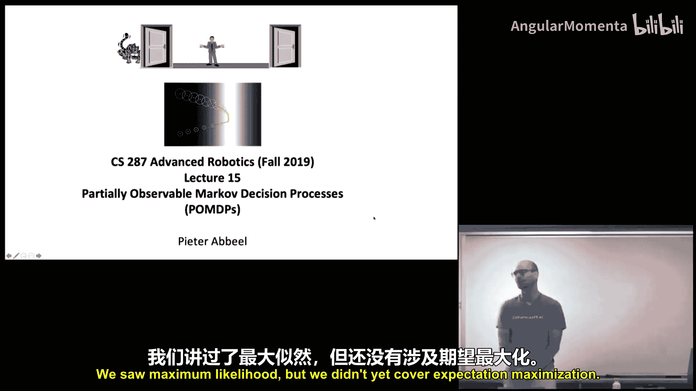

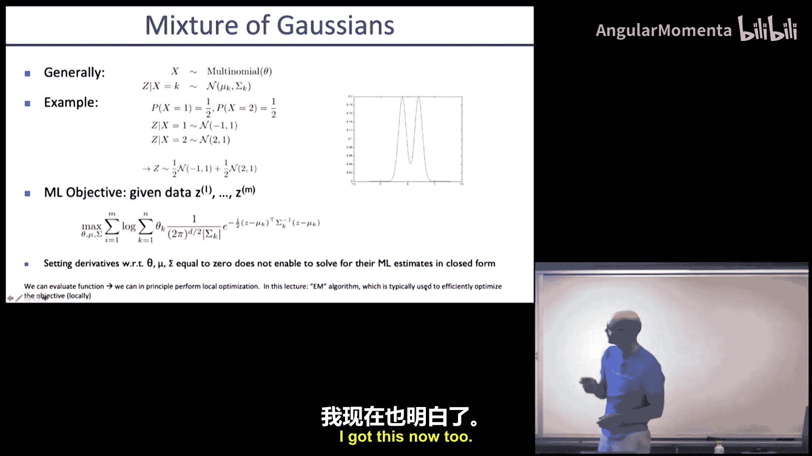

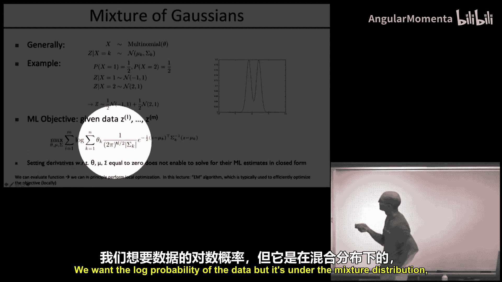

在本节课中，我们将要学习部分可观测马尔可夫决策过程（POMDPs）。我们将从回顾期望最大化算法开始，然后深入探讨POMDPs的核心概念、精确求解方法面临的挑战，以及在实际应用中更可行的局部最优求解策略。最后，我们将了解分离原理这一特殊性质。

## 期望最大化算法回顾 🔄

上一节我们介绍了最大似然估计，本节中我们来看看期望最大化算法。期望最大化算法是处理含有隐变量模型参数估计问题的核心方法。

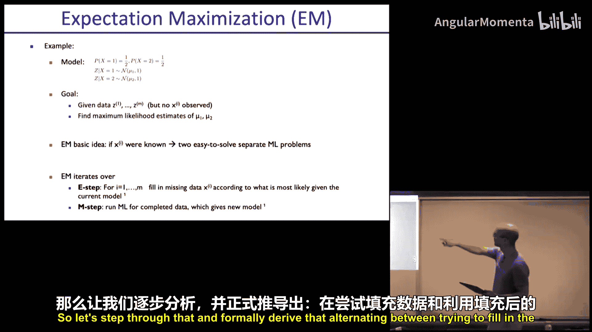

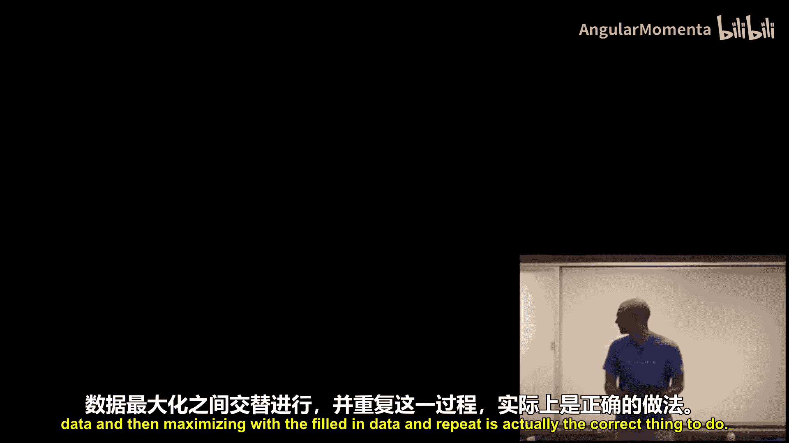

### 问题背景与动机

我们尝试拟合一个由两个高斯分布组成的混合模型。数据点 `Z` 来自其中一个高斯分布，但我们不知道具体是哪一个。隐变量 `X` 表示数据点来自哪个高斯分布（取值为1或2）。我们的目标是仅根据观测到的 `Z`，估计两个高斯分布的均值 `μ1` 和 `μ2`。

如果 `X` 已知，问题将非常简单：只需将数据按 `X` 分组，分别计算各组的均值即可。但在POMDPs等场景中，`X` 通常是未知的。

### EM算法的基本思想

期望最大化算法通过交替执行两个步骤来解决这个问题：
1.  **E步（期望步）**：基于当前参数估计，计算隐变量 `X` 的后验分布 `Q(x) = P(x|z, θ)`。这相当于“填补”缺失的数据，但使用的是概率分布而非确定值。
2.  **M步（最大化步）**：将E步得到的 `Q(x)` 视为“真实”的隐变量分布，然后最大化关于参数 `θ` 的期望完全数据对数似然。

从优化角度看，EM算法通过詹森不等式为原始难处理的对数边际似然函数 `log P(z|θ)` 构造了一个易于处理的**下界函数**。在E步，我们通过设置 `Q(x) = P(x|z, θ)` 使该下界与原始函数在当前位置紧贴（即函数值相等且梯度相同）。在M步，我们通过优化该下界函数来提升参数 `θ`，从而也保证了原始目标函数的值得到提升。

以下是EM算法的一般形式推导概要：

我们想最大化观测数据 `z` 的似然：
`max_θ log P(z|θ) = max_θ log ∫ P(x, z|θ) dx`

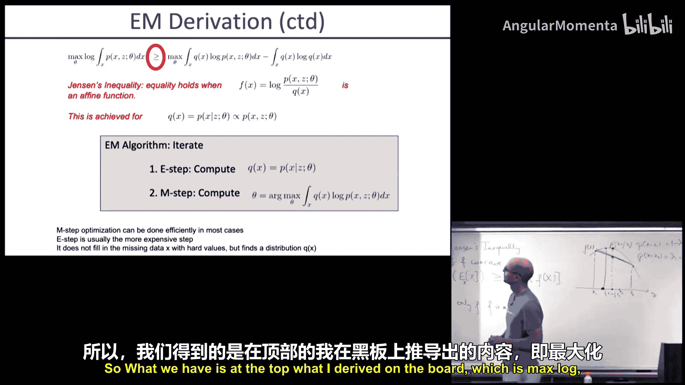

引入一个关于 `x` 的分布 `Q(x)`，利用詹森不等式（因为 `log` 是凹函数）：
`log ∫ [Q(x) * (P(x, z|θ)/Q(x))] dx ≥ ∫ Q(x) log [P(x, z|θ)/Q(x)] dx`

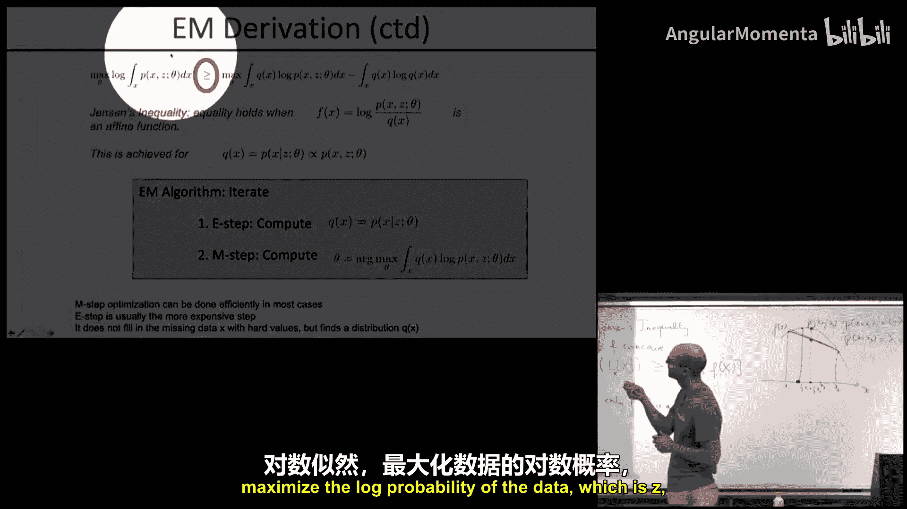

当 `P(x, z|θ)/Q(x)` 为常数时，等号成立。这等价于选择 `Q(x) = P(x|z, θ)`，即隐变量给定观测的后验分布。

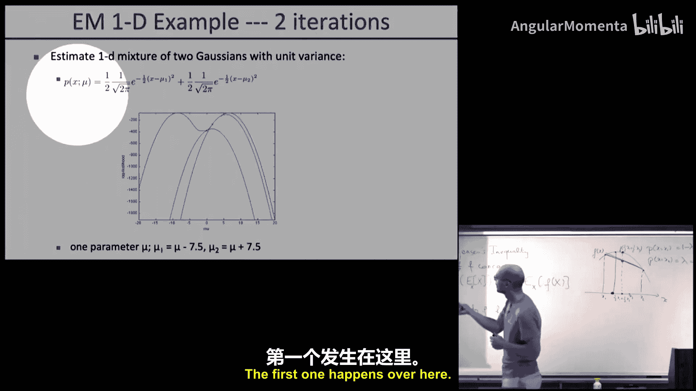

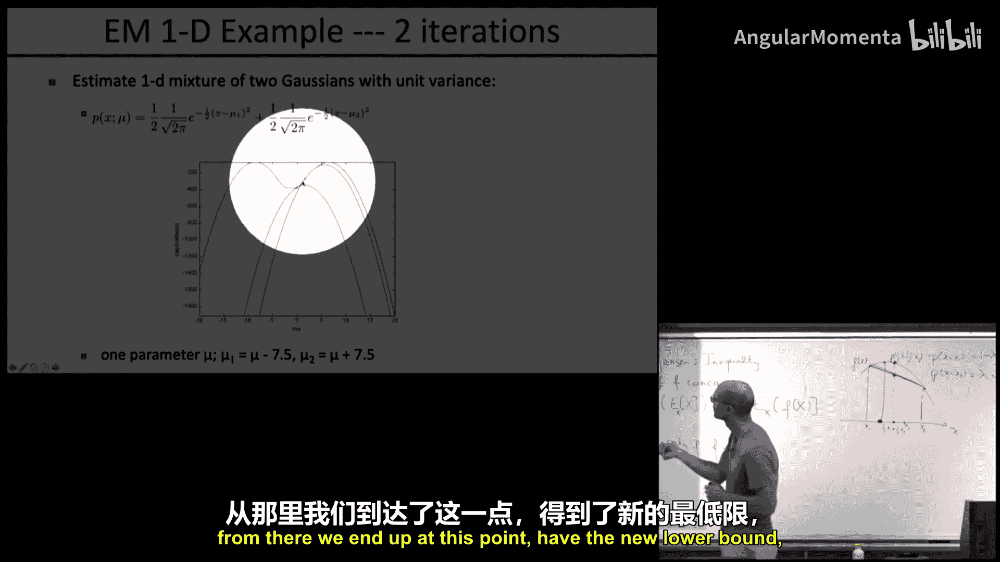

因此，EM算法迭代如下：
*   **E步**：固定参数 `θ`，计算后验 `Q(x) = P(x|z, θ)`。
*   **M步**：固定分布 `Q(x)`，优化下界以更新参数：`θ_new = argmax_θ ∫ Q(x) log P(x, z|θ) dx`。

### EM算法应用示例

对于混合高斯模型，E步计算每个数据点 `z_i` 来自第 `k` 个高斯分布的后验概率：
`γ_{ik} ∝ π_k * N(z_i | μ_k, Σ_k)`
其中 `π_k` 是混合权重。然后进行归一化。

M步则利用这些“软分配”概率 `γ_{ik}` 作为权重，更新高斯分布的参数：
`μ_k^{new} = (Σ_i γ_{ik} * z_i) / (Σ_i γ_{ik})`
`Σ_k^{new} = (Σ_i γ_{ik} * (z_i - μ_k^{new})(z_i - μ_k^{new})^T) / (Σ_i γ_{ik})`
`π_k^{new} = (Σ_i γ_{ik}) / N`

对于隐马尔可夫模型，E步需要使用前向-后向算法（平滑器）来计算：
*   给定所有观测下，每个时刻状态 `x_t` 的边际后验分布。
*   相邻时刻状态对 `(x_t, x_{t+1})` 的联合后验分布。

M步则利用这些后验统计量，像处理完全观测数据一样更新HMM的转移概率矩阵和观测概率矩阵。

## 部分可观测马尔可夫决策过程（POMDPs）引入 🤖

现在，让我们从参数估计转向决策问题。在标准的马尔可夫决策过程中，智能体能够直接观测到环境的状态。但在许多现实问题中，智能体只能获得与状态相关但不完全确定的观测值，这就是部分可观测马尔可夫决策过程。

### POMDPs的基本框架

一个POMDP由以下要素定义：
*   **状态空间** `S`：环境真实的内部状态。
*   **动作空间** `A`：智能体可以执行的动作。
*   **观测空间** `O`：智能体接收到的感知信息。
*   **状态转移函数** `T(s'|s, a) = P(s'|s, a)`：在状态 `s` 执行动作 `a` 后转移到状态 `s'` 的概率。
*   **观测函数** `Z(o|s', a) = P(o|s', a)`：在状态 `s'` 执行动作 `a` 后获得观测 `o` 的概率。
*   **奖励函数** `R(s, a)`：在状态 `s` 执行动作 `a` 获得的即时奖励。
*   **折扣因子** `γ`。

智能体的目标是找到一个策略，以最大化未来累积奖励的期望值。

### 信念状态：POMDPs的核心

由于无法直接获知状态，智能体必须维护一个**信念状态**，它是环境状态空间上的一个概率分布，记作 `b(s)`。信念状态总结了到当前为止所有动作和观测的历史信息。给定当前信念 `b`，执行动作 `a` 并收到观测 `o` 后，新的信念 `b'` 可以通过贝叶斯更新规则计算：
`b'(s') = η * P(o|s', a) * Σ_s P(s'|s, a) b(s)`
其中 `η` 是归一化常数。

**关键视角**：一个POMDP可以转化为一个完全可观测的MDP，其**状态空间就是信念空间**。这个信念状态MDP是连续且高维的（即使原始状态空间是离散的）。

### “老虎问题”示例

一个经典的POMDP例子是“老虎问题”：
*   **状态**：老虎在左门后或右门后。
*   **动作**：打开左门、打开右门、倾听。
*   **观测**：倾听时，可能听到左边或右边的吼叫声（但感知有85%的准确率）。
*   **奖励**：打开有老虎的门：-100；打开空门：+10；倾听：-1。

智能体从50/50的信念开始。最优策略通常是：先倾听几次以减少不确定性，当对老虎位置足够确信时，再打开被认为是空的门。计算表明，当确信度超过约90%时，直接开门的期望奖励将高于继续倾听。

## POMDPs的精确求解与挑战 ⚙️

理论上，我们可以通过求解信念状态MDP来找到POMDP的最优策略。然而，这在实际中通常非常困难。

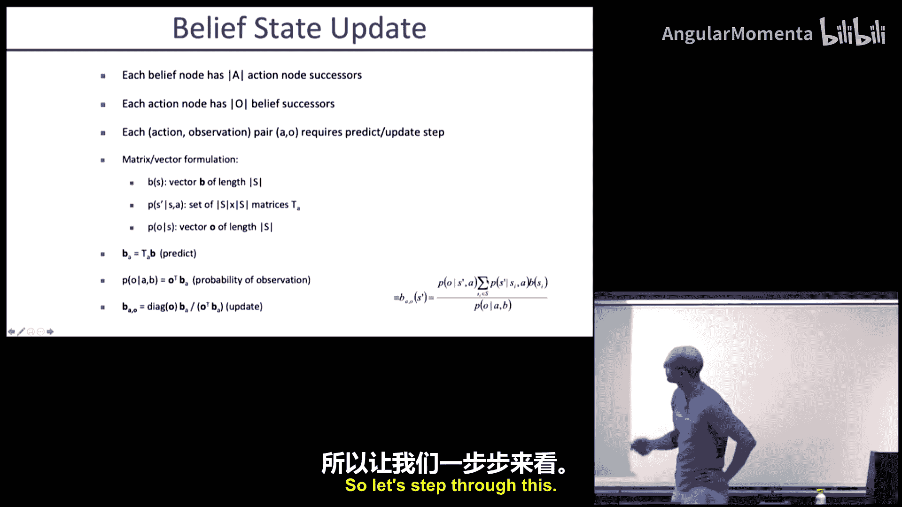

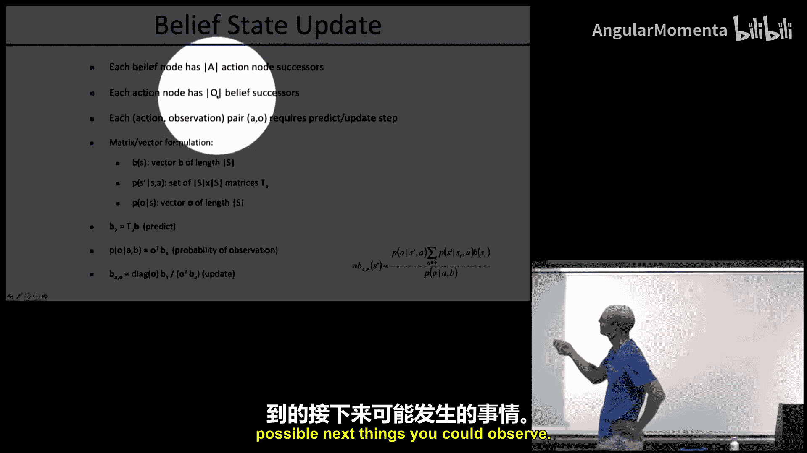

### 信念状态MDP的值迭代

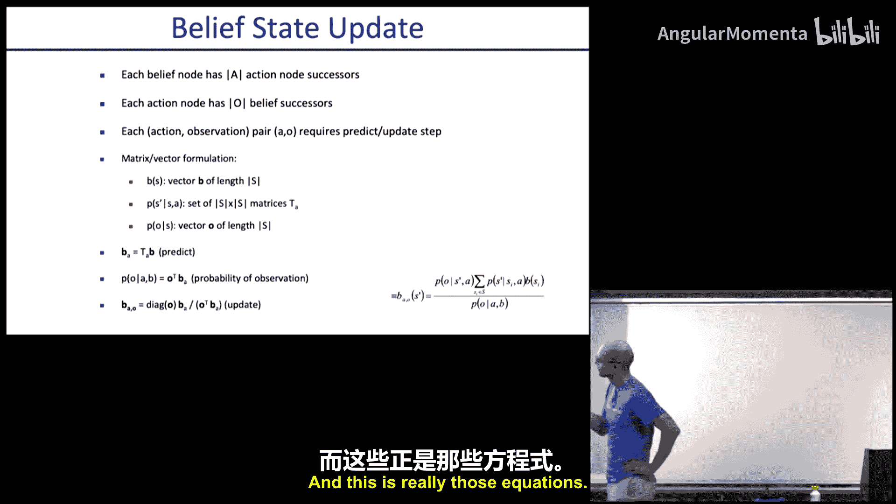

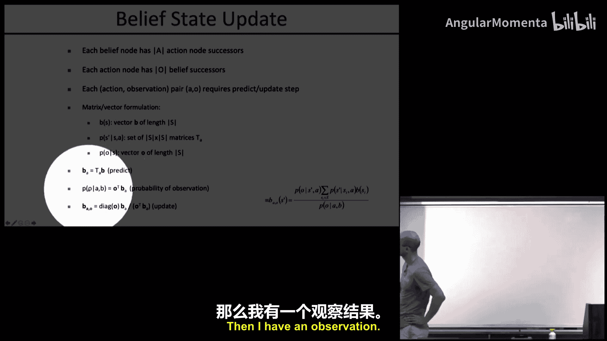

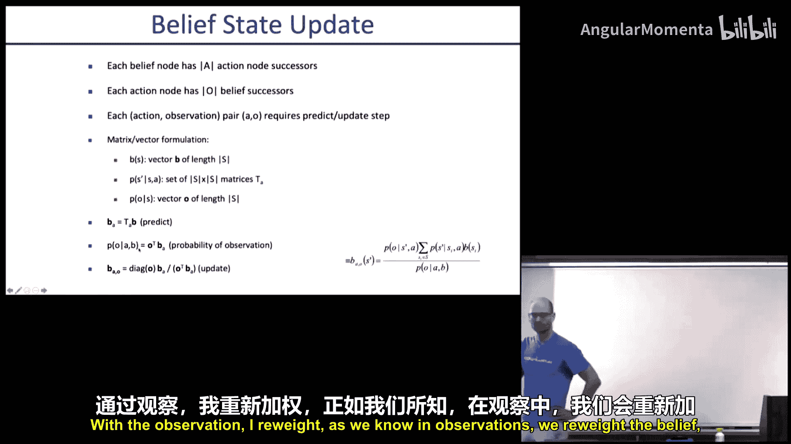

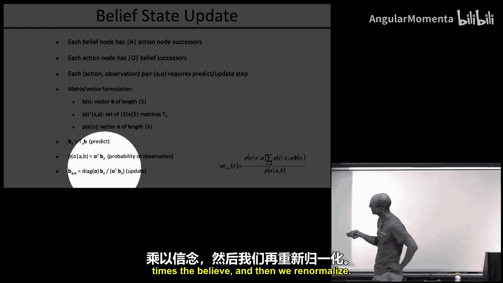

信念状态MDP的值函数 `V(b)` 满足贝尔曼方程：
`V(b) = max_a [ Σ_s b(s) R(s, a) + γ Σ_o P(o|b, a) V(b') ]`
其中 `b'` 是执行 `a` 并观察到 `o` 后的信念。

一个重要的理论结果是：对于有限视野的POMDP，最优值函数是信念空间上的分段线性凸函数。它可以表示为一系列**α向量**的集合，每个α向量对应一个特定的条件行动计划。值函数是这些α向量的最大值：
`V(b) = max_α Σ_s α(s) b(s)`

基于此的精确算法（如枚举法、见证算法等）可以计算出这些α向量。但随着视野延长，所需维护的α向量数量会爆炸式增长，使得精确求解仅适用于极小规模的问题。

### 基于搜索的近似方法

由于精确求解不可行，一种实用的方法是进行有限深度的前向搜索：
1.  从当前信念 `b_0` 开始，构建一棵搜索树。
2.  树节点是信念状态，分支对应动作和可能的观测。
3.  在叶子节点使用一个启发式估计值（例如，基于最可能状态MDP的值）。
4.  通过反向传播（期望值超过动作，最大值超过观测）计算根节点的最优动作。

这种方法避免了为整个信念空间赋值，只关注从当前信念可达的部分。通过采样动作和观测分支，可以控制搜索树的宽度，使其适用于更大规模的问题。

## 基于局部优化的信念空间规划 🗺️

对于具有连续状态和观测空间的问题（如机器人定位与导航），我们通常采用基于局部优化的方法，特别是在信念可以用高斯分布近似的情况下。

### 问题形式化

假设我们使用扩展卡尔曼滤波器来跟踪信念状态，即 `b_t = N(μ_t, Σ_t)`。信念空间规划问题可以表述为优化一个关于均值 `μ`、协方差 `Σ` 和控制序列 `u` 的成本函数：
`min_{μ_{1:T}, Σ_{1:T}, u_{0:T-1}} Σ_t c(μ_t, Σ_t, u_t)`
并满足EKF的动力学约束：
`μ_{t+1} = f(μ_t, u_t)`
`Σ_{t+1} = g(μ_t, Σ_t, u_t)` （预测步）
以及（在收到最可能观测 `z_{t+1} = h(f(μ_t, u_t))` 后）的更新步约束。

这本质上是一个非线性优化问题，我们可以使用迭代LQR、顺序凸规划等工具求解。

### 信息收集行为的涌现

通过求解上述优化问题，智能体会自动产生信息收集行为。例如，在一个机器人导航问题中：
*   **场景**：起点（高不确定性）与目标点之间有一片“黑暗”区域（无GPS信号）和一片“明亮”区域（有良好GPS信号）。
*   **确定性规划**：会建议从起点直线移动到目标，但到达时不确定性会很大。
*   **信念空间规划**：会建议机器人先绕道进入“明亮”区域进行精确定位（减少 `Σ`），然后再前往目标。虽然路径变长，但最终定位精度更高，总体成本更低。

### 实际挑战与技巧

在实践中，直接优化可能陷入局部最优（例如，永远不离开初始的“黑暗”区域）。以下是两个关键技巧：

1.  **同伦方法**：用于处理感知中的不连续性（如突然进入/离开传感区域）。我们最初用一个连续的、噪声水平随距离传感区域边界变化的“软化”观测模型来替代原始的硬性开关模型。优化这个软化问题后，逐渐将模型硬化回原始问题，同时用上一轮的解作为初始猜测。这有助于算法跳出局部最优。

2.  **未检测到观测的更新**：如果算法预测应该收到观测但实际上没有，这本身也是信息。例如，预测在传感区域内但未收到观测，意味着实际状态很可能在区域外。这需要通过**截断高斯分布**并重新拟合来更新信念，而不是简单地跳过EKF更新步。这对于成功规划至关重要。

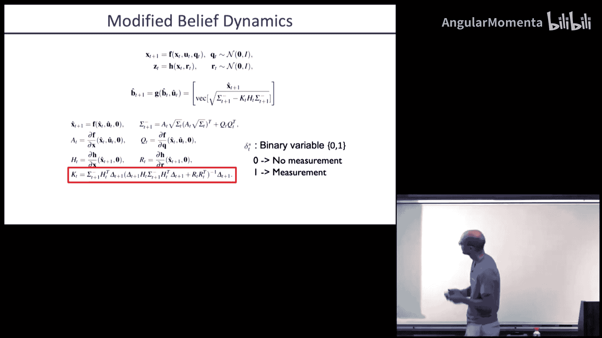

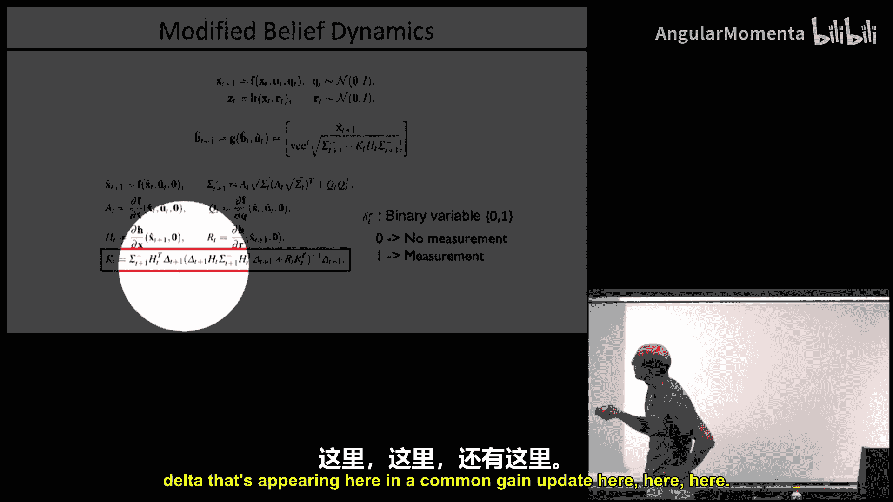

### 碰撞避免与模型预测控制

在信念空间规划中考虑碰撞避免时，必须考虑机器人的姿态不确定性。一种方法是通过无迹变换获取机器人连杆位置的Sigma点，并用这些点形成的凸包作为碰撞检查的保守边界。

由于不确定性，开环执行信念空间规划出的路径很容易失败。因此，必须采用**模型预测控制**框架：频繁地重新规划，将最新的观测融入当前信念，并基于新信念计算新的控制序列。

## 分离原理：一个重要的特例 ✅

对于一类特殊的系统——**线性动力学、线性观测模型、二次成本、高斯噪声**——存在一个美妙的简化，称为分离原理。

**结论**：对于上述线性二次高斯问题，POMDP的最优解可以分解为两个独立的部分：
1.  **估计**：使用卡尔曼滤波器持续计算状态估计 `μ_t`。
2.  **控制**：将 `μ_t` 当作真实状态，应用标准LQR反馈控制律 `u_t = -K_t μ_t`。

**直观理解**：在线性高斯系统中，信念的协方差矩阵 `Σ_t` 的演化**完全独立于所采取的控制动作**。它只由系统动力学和噪声特性决定。因此，在优化时，我们无法通过控制动作来影响不确定性的大小。既然协方差是“开环”确定的，那么优化问题就退化到只针对均值部分，而这正是确定性LQR所解决的问题。

**重要提示**：分离原理是线性系统特有的性质。一旦系统存在非线性（动力学或观测模型），控制动作就会影响信息获取，从而影响协方差，信念空间规划就变得必要，且与确定性规划不等价。

## 总结 📝

本节课中我们一起学习了部分可观测马尔可夫决策过程的核心内容：
*   **POMDPs框架**：智能体基于不完全的观测进行决策，需维护信念状态。
*   **精确求解的挑战**：信念空间是连续高维空间，精确值迭代计算上不可行。
*   **近似求解方法**：包括基于前向搜索的方法和基于局部优化的信念空间规划。
*   **信念空间规划**：将EKF动力学作为约束，优化均值、协方差和控制序列，可自动产生信息收集行为。关键技术包括同伦方法和处理未检测观测的更新。
*   **分离原理**：在线性二次高斯问题中，最优控制可分解为独立的估计（卡尔曼滤波）和控制（LQR）两部分，这是一个重要的特例。

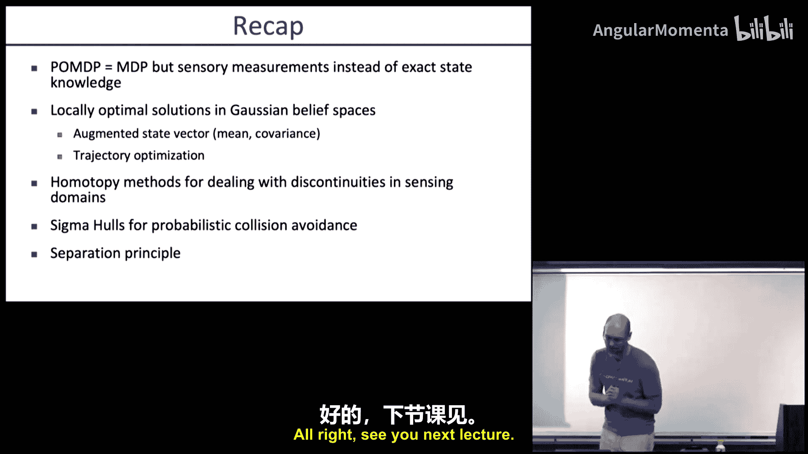

POMDPs为机器人在不确定环境中的自主决策提供了强大的形式化框架，尽管计算复杂，但通过近似和优化方法，我们能在实际机器人系统中实现有效的信念空间规划。