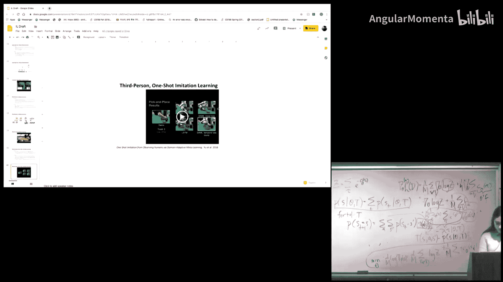
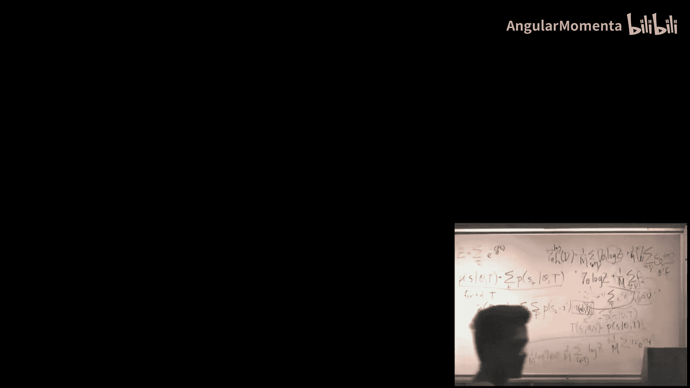

# 016：模仿学习

在本节课中，我们将学习模仿学习。模仿学习是一种让机器人通过观察专家演示来学习完成任务的方法，它避免了直接设计复杂奖励函数的困难。我们将从问题设定开始，探讨两种主要方法：策略的监督学习和逆最优控制，并分析它们的优缺点。最后，我们将了解一些机器人模仿学习领域的最新研究成果。

## 问题设定

我们拥有一个马尔可夫决策过程的状态空间、动作空间和转移模型，但可能无法访问转移模型。同时，我们获得了一些来自某个专家策略 $\pi^*$ 的演示样本。

在之前的课程中，我们一直假设可以访问一个定义了机器人目标的成本函数。但在复杂场景中，指定任务目标可能非常困难。例如，让机器人打扫房间，很难设计一个基于高维图像观测的奖励函数。即使使用简单的内部传感器（如灰尘量）作为奖励，机器人也可能通过作弊行为（如反复拾取和倾倒灰尘）来最大化奖励，而非真正完成任务，这被称为奖励利用。

为了减少对机器人目标的误解，我们可以使用演示。这些演示展示了期望的良好行为，能够捕捉到任务执行中的细微差别（如遵守社交规范）。模仿学习就是从这些演示中学习。本课程将涵盖两种主要方法：一是直接估计最优策略，二是逆最优控制（或称逆强化学习），即先估计奖励函数，再用其学习 $\pi^*$。

## 通过监督学习直接模仿策略

在这种方法中，我们将模仿学习视为一个监督学习问题。输入是专家策略 $\pi^*$ 的输入-输出对，因为 $\pi^*$ 本身就是一个函数。我们可以使用任何喜欢的模型（如神经网络、决策树、SVM）来近似这个函数，并通过监督学习来学习 $\pi^*$。

这听起来很理想，因为监督学习通常很有效，并且我们拥有最优行为的演示。然而，问题在于我们只拥有来自最优策略的数据。在MDP中，我们遇到的状态分布很大程度上取决于我们采取的行动。监督学习通常假设训练和测试分布相同，且样本独立同分布。但在模仿学习中，学习策略 $\pi_\theta$ 运行时遇到的状态分布 $P_{\pi_\theta}$ 与专家策略下的状态分布 $P_{\pi^*}$ 可能大不相同。

### 分布不匹配与误差累积问题

例如，在教自动驾驶汽车时，专家演示了如何在山路上行驶。我们训练一个监督学习模型来模仿。开始时策略可能表现尚可，但随后可能出现微小偏差，进入专家未见过的新状态。由于模型未在这些状态下训练过，可能做出错误决策，导致进一步偏离，最终可能驶出道路。这是因为微小的初始误差会累积，并将我们带出训练数据分布，进入未知区域。

为了解决这个问题，NVIDIA在2016年的自动驾驶项目中采用了一种数据增强技巧：他们在车辆侧面添加了额外的摄像头，以模拟车辆轻微漂移时的视角，并手动调整了旋转偏移，然后将这些数据加入训练集。这种方法帮助模型学习如何自我纠正。但这是一种针对特定问题的技巧。

### DAgger算法

一种更通用的方法是**DAgger**算法。该算法的核心目标是缩小专家策略分布 $P_{\pi^*}$ 与学习策略分布 $P_{\pi_\theta}$ 之间的差距。其做法是：运行当前学习策略，收集遇到的状态数据，然后**询问专家在这些状态下会采取什么行动**，用专家的行动替换策略原本的行动，最后在聚合的数据集上重新训练策略。

以下是DAgger算法的步骤：
1.  从某个初始策略（通常是行为克隆策略）开始。
2.  运行当前策略 $\pi_\theta$，收集轨迹数据。
3.  对于收集到的每个状态，查询专家会采取的行动，生成新的“状态-专家行动”对。
4.  将所有新数据加入聚合数据集 $D$。
5.  在更新后的数据集 $D$ 上训练新的策略 $\pi_\theta$。
6.  重复步骤2-5。

这种方法在特定假设下具有理论保证。然而，它成本高昂，且并非总能随时访问专家进行查询。

后续有工作使用DAgger算法让无人机在从未见过的森林区域中飞行，取得了成功。虽然DAgger通过主动查询缩小了分布差距，并利用了监督学习的有效性，但它依赖于专家的持续参与，这并不总是可行的。

## 逆最优控制

上一节我们介绍了通过监督学习直接模仿策略的方法及其面临的挑战。本节中，我们来看看另一种思路：逆最优控制。其核心问题是：**我们能否仅利用最初提供的专家数据做得更好？**

在行为克隆中，我们只是模仿专家，没有理解专家的意图。这导致当专家从未犯错，而我们不可避免地犯错时，我们不知道如何纠正。理解专家试图实现的目标，可能比盲目模仿更有帮助。此外，如果专家并非完全最优，或者专家与机器人具有不同的形态和动作空间，行为克隆可能无法使用。而如果我们能理解专家的目标，或许仍能完成类似任务，并且在遇到意外情况时更具鲁棒性。总之，找出教师的意图可能使我们表现得比演示者更好。

在逆最优控制中，输入与之前相同：状态/动作空间、可能的转移模型和演示。我们的目标是**先学习奖励函数 $R$，然后利用这个奖励函数来学习最优策略 $\pi^*$**。

### 线性奖励函数与特征匹配

为了便于分析，我们首先做一些简化假设：
1.  假设奖励函数是状态特征的线性函数：$R(s) = w^T \phi(s)$，其中 $\phi(s)$ 是将状态映射到特征向量的函数，$w$ 是权重向量。
2.  在这个公式下，策略 $\pi$ 在奖励函数 $R$ 下的价值函数 $V^\pi$ 可以表示为：
    $$V^\pi = E[\sum_{t=0}^{\infty} \gamma^t R(s_t)] = E[\sum_{t=0}^{\infty} \gamma^t w^T \phi(s_t)] = w^T E[\sum_{t=0}^{\infty} \gamma^t \phi(s_t)]$$
    我们记 $\mu(\pi) = E[\sum_{t=0}^{\infty} \gamma^t \phi(s_t)]$ 为策略 $\pi$ 的**期望特征累积**。因此，$V^\pi = w^T \mu(\pi)$。

根据定义，在真实奖励函数下，最优策略 $\pi^*$ 的性能应不低于任何其他策略 $\pi$。即：
$$V^{\pi^*} \geq V^{\pi} \quad \Rightarrow \quad w^T \mu(\pi^*) \geq w^T \mu(\pi)$$
我们的目标是找到一个奖励函数（即权重 $w$），使得专家策略 $\pi^*$ 在该奖励下是最优的。

### 最大边际逆强化学习

2004年，Ng和Russell指出，或许我们不需要找到专家背后那个“真实”的奖励函数，而只需找到一个奖励函数，使得在该奖励下，学习策略的期望特征累积 $\mu(\pi)$ 与专家的 $\mu(\pi^*)$ 相匹配。如果匹配足够好，那么策略的性能也将足够接近专家。

他们提出的算法框架是交替进行：
1.  给定当前奖励函数 $w$，计算最优策略 $\pi$。
2.  给定当前策略 $\pi$，更新奖励函数 $w$，使得专家策略 $\pi^*$ 看起来比 $\pi$ 更好。
然而，这里存在一个关键问题：如何“猜测”奖励函数 $w$？在最初的IRL formulation中，存在**退化性**问题：存在许多奖励函数都能使专家策略看起来最优。例如，一个处处为零的常数奖励函数就满足条件，但它显然没有捕捉到任何意图。

为了解决这种歧义，我们可以从分类问题中汲取灵感。在支持向量机中，我们寻找最大间隔分离超平面。类似地，在IRL中，我们希望找到的奖励函数能够**最大程度地区分**最优策略（专家策略）与所有其他次优策略。这被称为最大边际公式：
$$\max_{w} \min_{\pi} [w^T \mu(\pi^*) - w^T \mu(\pi)]$$
这个目标可以转化为一个二次规划问题来求解。通过这种最大边际方法，我们可以在众多可能的奖励函数中做出一个选择。但这种方法仍不能保证捕捉到专家的真实意图，并且难以扩展到更复杂的奖励函数（如神经网络）。此外，它没有考虑专家可能存在的次优行为。

一种扩展是使用**软间隔SVM**，允许一定的误差容限，以考虑专家的次优性。

### 最大熵逆强化学习

最大边际方法仍然没有完全解决歧义问题，并且忽略了专家次优性。2008年Ziebart等人提出的**最大熵逆强化学习**引入了概率框架来建模专家行为，并应用了**最大熵原理**：在所有满足约束（即匹配专家期望特征累积）的概率分布中，选择熵最大的那个，也就是做出最少假设的那个。

具体假设如下：
*   奖励函数是线性的：$R(s) = \theta^T f(s)$。
*   已知动力学模型 $T$。
*   专家轨迹 $\tau$ 的概率与奖励的指数成正比：$P(\tau) \propto \exp(\sum_{t} R(s_t)) = \exp(\theta^T \sum_{t} f(s_t))$。
这等价于将专家建模为在最小化期望成本的同时，最大化策略的熵。

我们的目标是通过最大似然估计来学习参数 $\theta$，使得观察到的演示轨迹的似然性最大。经过推导，损失函数 $L(\theta)$ 的梯度为：
$$\nabla_\theta L = E_{P(\tau|\theta, T)}[f(\tau)] - E_{D}[f(\tau)]$$
其中，第一项是在当前奖励参数 $\theta$ 和动力学 $T$ 下，策略产生的轨迹的特征期望；第二项是专家演示轨迹的特征期望。梯度下降的方向是使学习策略的特征期望向专家演示的特征期望靠近。

为了计算第一项 $E_{P(\tau|\theta, T)}[f(\tau)]$，我们需要知道在当前奖励函数下最优策略的状态访问频率。这可以通过动态规划算法（前向计算或值迭代）来求解。

最大熵IRL算法步骤如下：
1.  初始化参数 $\theta$。
2.  收集专家演示数据集 $D$。
3.  循环：
    a. 根据当前奖励函数 $R_\theta$ 和已知动力学 $T$，求解最优策略 $\pi$（例如使用值迭代）。
    b. 使用动态规划计算在当前策略 $\pi$ 下的状态访问频率，进而计算 $E_{P(\tau|\theta, T)}[f(\tau)]$。
    c. 从专家数据中计算 $E_{D}[f(\tau)]$。
    d. 计算梯度：$\nabla_\theta L = E_{P(\tau|\theta, T)}[f(\tau)] - E_{D}[f(\tau)]$。
    e. 使用梯度下降更新 $\theta$。

## 机器人模仿学习的最新研究实例

前面我们介绍了模仿学习的经典算法。本节中，我们将看看这些方法在近期机器人研究中的应用实例。

### 基于VR遥操作的模仿学习

在机器人操作任务中，特别是基于视觉的任务，提供演示通常需要人工物理引导机器人，这可能会遮挡视觉输入。为了解决这个问题，有研究开发了一种基于消费级VR设备的遥操作系统，使人可以远程控制机器人，从而提供高质量、无视觉干扰的演示。

该工作使用单一的神经网络架构从视觉输入中学习策略。在模仿学习算法上，他们使用了**行为克隆**，并添加了一个**辅助损失**来使策略更具目标导向性。这个辅助损失包括两个回归任务：给定原始图像，预测当前末端执行器位置和演示结束时的末端执行器位置。通过预测最终状态，网络能够推断任务目标，从而学习到更好的特征表示。实验表明，这种辅助损失有助于提升学习效果。

### 小样本模仿学习

之前的例子需要相当数量的演示。小样本模仿学习旨在利用先验经验，从单次或少数几次演示中学习新任务。例如，2017年的“One-Shot Imitation Learning”工作，目标是让机器人能够通过观看一次演示，就学会搭建任意结构的积木塔。

他们采用**元学习**方法进行训练：训练时，模型接收演示对，学习如何根据一个演示来预测另一个演示中的动作。其关键贡献是一个包含三个子网络的特殊架构。这使得机器人能够通过单次演示完成长时程、组合性强的任务。

### 第三人称模仿学习

到目前为止，我们假设演示者与机器人的观测和动作是对齐的（第一人称模仿）。但人类能够通过观察其他个体（即使形态不同）来进行模仿。第三人称模仿学习旨在解决不同上下文（如视角、环境、物体差异）下的模仿问题。

一种方法是通过多个同一任务的不同上下文演示，学习一个**上下文感知的翻译模型**。当面对新上下文时，系统将演示翻译到当前上下文，然后遵循翻译后的轨迹。这通常通过将不同上下文的观测映射到一个共享的隐空间，再进行解码来实现。不过，这类方法通常避免处理由形态差异引起的巨大领域偏移，例如让人类和机器人都使用相同的工具来完成任务。

### 结合小样本与第三人称模仿

一个诱人的前景是结合两者：通过观察人类的单次演示进行模仿。这面临巨大挑战，因为需要解决人类与机器人之间的形态差异。一些研究采用数据驱动的方法，不寻求建立人类与机器人之间的直接映射，而是尝试从人类演示中**推断任务目标**。只要目标一致，无论机器人形态如何，都能完成任务。

这类工作也采用元学习框架：在元训练阶段，使用大量对齐的人类-机器人演示对进行训练，学习如何根据人类演示推断出对应的机器人策略。在模型架构上，会使用时序卷积网络来整合演示视频中的时序信息。这种方法使得机器人能够在背景、物体位置等存在领域差异的情况下，通过观察单次人类演示成功完成任务。

## 总结

本节课中，我们一起学习了模仿学习。我们从问题设定开始，认识到通过演示来传达复杂任务目标是一种有效方式。我们深入探讨了两种主要范式：

1.  **通过监督学习直接模仿策略**：将模仿视为监督学习问题，简单有效，但面临**分布不匹配**和**误差累积**的挑战。DAgger算法通过主动查询专家来缓解这一问题，但对专家依赖性强。
2.  **逆最优控制**：旨在先学习奖励函数，再推导策略。我们介绍了**最大边际IRL**和**最大熵IRL**。最大熵IRL通过概率框架和最大熵原理，提供了一种更原则性的方法来处理奖励歧义和专家次优性。

最后，我们回顾了模仿学习在机器人领域的最新进展，包括利用VR遥操作获取高质量演示、小样本模仿学习、第三人称模仿学习以及它们的结合。这些研究正推动机器人朝着更自然、更高效地从人类演示中学习的方向发展。