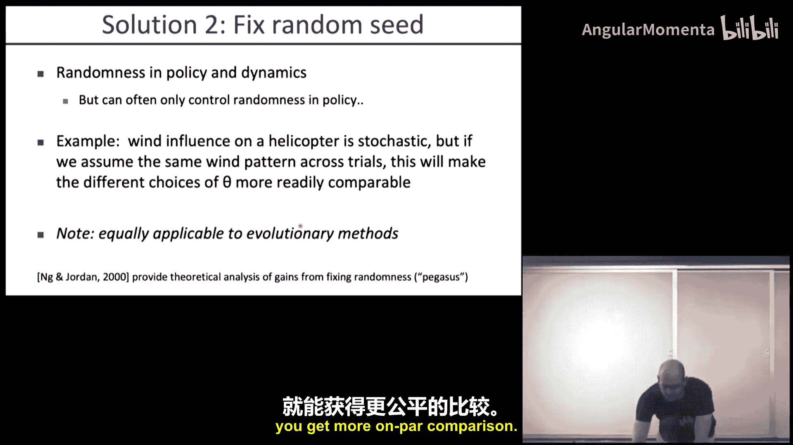
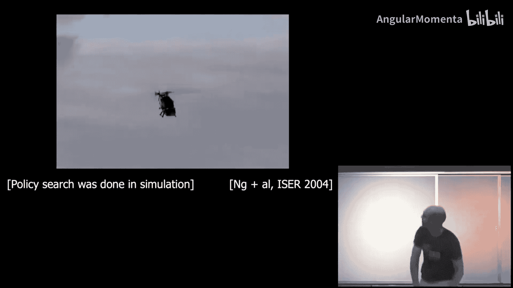
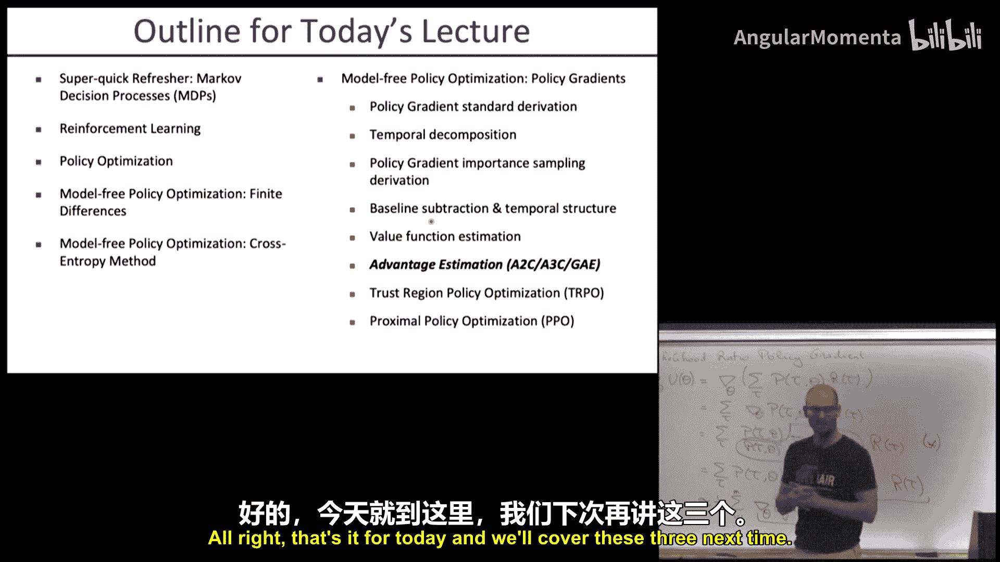
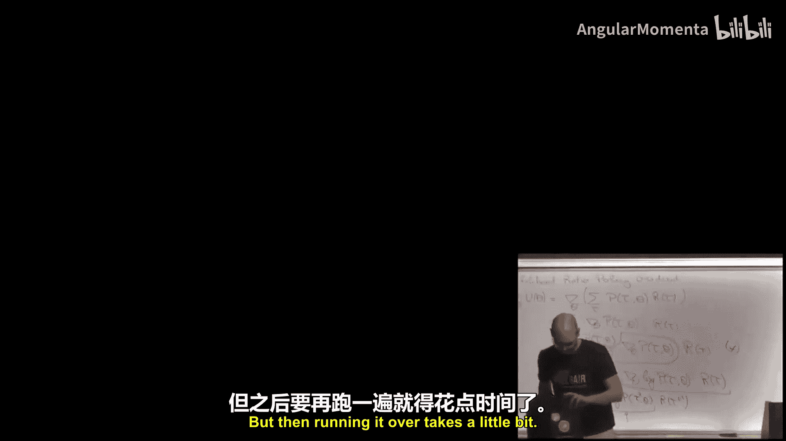

# 017：策略梯度

在本节课中，我们将要学习强化学习的基础，特别是模型无关的策略优化方法。我们将从马尔可夫决策过程的快速回顾开始，然后重点介绍策略梯度方法，这是一种直接优化策略以最大化期望累积奖励的方法。我们将学习其数学推导、实现细节以及如何通过引入基线和利用时间结构来提高其效率。

## 马尔可夫决策过程与强化学习

上一节我们介绍了课程背景，本节中我们来看看强化学习的基本设定。在马尔可夫决策过程中，智能体与环境交互，目标是最大化期望奖励。我们拥有状态集、动作集、转移模型和奖励函数。

然而，在强化学习中，智能体无法直接访问环境的动态模型和奖励函数。因此，智能体必须通过在环境中行动、收集经验数据，并基于这些数据改进其行为来学习如何优化期望奖励。

## 策略优化方法概述

在强化学习中，主要有两大类方法：策略优化方法和动态规划方法。策略优化方法直接寻找并改进策略，而动态规划方法则侧重于求解价值函数。

本节课我们将聚焦于模型无关的策略优化方法。这类方法不尝试学习环境模型，而是直接通过交互来优化策略。我们将介绍三种具体的模型无关策略优化方法：有限差分法、交叉熵法和策略梯度法。

## 有限差分法

有限差分法是一种直观的策略优化方法。其核心思想是通过扰动策略的参数，观察性能变化，从而近似计算梯度。

以下是有限差分法的基本步骤：
1.  初始化策略参数向量 θ。
2.  对参数向量中的每一个元素 i，分别进行正向扰动（θ_i + ε）和负向扰动（θ_i - ε）。
3.  对扰动后的每个参数设置运行策略 rollout，收集累积奖励。
4.  使用公式 **梯度_i ≈ (R(θ_i+ε) - R(θ_i-ε)) / (2ε)** 计算该参数的梯度近似值。
5.  对所有参数重复此过程，得到完整的梯度估计，并用于更新参数。

这种方法简单直接，但计算成本较高，因为每个参数都需要两次 rollout。此外，在随机环境中，单次 rollout 的噪声可能导致梯度估计不准确。解决方案包括进行多次 rollout 取平均，或在可能的情况下固定随机种子以确保公平比较。

## 交叉熵法

交叉熵法是一种基于种群的优化方法，属于进化策略的一种。它通过迭代地采样、评估和选择优秀的参数来优化策略。

以下是交叉熵法的基本流程：
1.  初始化一个高斯分布，用于生成策略参数向量 θ，该分布具有均值 μ 和方差 σ²。
2.  迭代以下步骤：
    *   从当前分布中采样一批参数向量 {θ_i}。
    *   对每个参数向量 θ_i 运行策略 rollout，得到其累积奖励 R(θ_i)。
    *   选择奖励最高的前 K% 的样本（例如前10%）。
    *   用这些优秀样本的参数重新拟合一个新的高斯分布（通常只更新均值和方差）。
3.  重复此过程，分布将逐渐向高性能参数区域移动。

交叉熵法实现简单，可并行化程度高，但不利用问题的时间结构信息。

## 策略梯度法：推导与直觉

上一节我们介绍了两种相对简单的方法，本节中我们来看看更强大且常用的策略梯度法。策略梯度法直接对策略的性能目标求梯度，并使用该梯度更新策略参数。

我们的目标是最大化期望累积奖励 **J(θ) = E_{τ∼π_θ}[R(τ)]**，其中 τ 代表轨迹，R(τ) 是轨迹的总奖励。

策略梯度定理给出了目标函数梯度的表达式：
**∇_θ J(θ) = E_{τ∼π_θ}[∇_θ log P(τ|θ) * R(τ)]**

这个公式的直观解释是：我们通过策略 π_θ 采样一批轨迹，对于每条轨迹，计算其概率的对数关于参数 θ 的梯度 ∇_θ log P(τ|θ)，然后乘以该轨迹获得的总奖励 R(τ)。最后，对所有轨迹的该乘积求平均，就得到了梯度估计。

关键在于，轨迹概率 P(τ|θ) 可以分解为初始状态分布、动态转移概率和策略概率的乘积。在对数梯度中，动态转移概率项因为不依赖于参数 θ 而消失。因此，我们最终只需要计算策略本身的对数梯度：
**∇_θ log P(τ|θ) = Σ_t ∇_θ log π_θ(a_t|s_t)**

这意味着我们不需要知道环境模型，只需要能够计算策略在给定状态下选择某个动作的对数概率的梯度即可。对于神经网络策略，这可以通过标准反向传播轻松实现。

## 实现策略梯度：基线减除

直接使用上述原始策略梯度公式存在一个问题：如果所有奖励都是正的，那么所有动作的概率都会被提升，只是提升幅度不同。这虽然最终仍能通过概率归一化产生正确方向，但会导致梯度估计的方差很高，学习效率低下。

为了降低方差，我们引入一个基线 b（通常是与状态无关的常数，如平均奖励）：
**∇_θ J(θ) ≈ E_{τ∼π_θ}[Σ_t ∇_θ log π_θ(a_t|s_t) * (R_t - b)]**

其中 R_t 是从时刻 t 到轨迹结束的累积奖励（回报）。减去基线 b 后，只有那些回报高于平均水平的动作才会被增强，低于平均水平的则被抑制。数学上可以证明，只要基线 b 不依赖于当前动作，这样的梯度估计仍然是无偏的，但方差显著减小。

## 利用时间结构：优势函数

我们可以进一步改进。在时刻 t 采取的动作 a_t 无法影响 t 时刻之前已获得的奖励。因此，在更新该动作的概率时，只应考虑其未来的后果。

更精确的梯度公式为：
**∇_θ J(θ) ≈ E_{τ∼π_θ}[Σ_t ∇_θ log π_θ(a_t|s_t) * A_t]**

其中 **A_t = Q(s_t, a_t) - V(s_t)** 称为优势函数。它衡量了在状态 s_t 下采取动作 a_t 相对于遵循当前策略的平均水平有多好。
*   **Q(s_t, a_t)** 是动作价值函数，表示在状态 s_t 执行动作 a_t 后能获得的期望回报。
*   **V(s_t)** 是状态价值函数，表示在状态 s_t 遵循当前策略能获得的期望回报。

优势函数 A_t 告诉我们一个动作比“平均”动作好多少或差多少。使用优势函数可以更精准地分配 credit，进一步降低梯度方差。

## 价值函数拟合

在实际算法中，我们通常不知道真实的 V(s_t) 和 Q(s_t, a_t)。因此，我们需要估计它们。

一个常见的方法是同时学习一个价值函数 V_φ(s) 的参数 φ。我们可以使用蒙特卡洛方法，用从状态 s_t 开始的实际累积回报 **G_t = Σ_{k=t}^{T} r_k** 作为目标来拟合 V_φ(s_t)，通过最小化损失函数 **L(φ) = Σ_t (V_φ(s_t) - G_t)²**。

然后，我们可以用 **A_t ≈ G_t - V_φ(s_t)** 来近似优势函数。注意，为了保持无偏性，最好用一批独立的轨迹来拟合价值函数 V_φ，而不是用计算策略梯度的那批轨迹，但在实践中，使用同一批数据并进行适度拟合通常也能工作。

## 策略梯度算法框架

综合以上内容，一个基本的策略梯度算法（通常称为REINFORCE with baseline）步骤如下：

以下是策略梯度算法（REINFORCE with baseline）的基本步骤：
1.  初始化策略参数 θ 和价值函数参数 φ。
2.  循环直到收敛：
    a.  使用当前策略 π_θ 收集一批轨迹数据。
    b.  对每条轨迹中的每个时间步 t，计算从 t 开始的回报 G_t。
    c.  使用收集到的 (s_t, G_t) 数据，通过梯度下降更新价值函数 V_φ（例如最小化均方误差）。
    d.  计算每个时间步的优势估计值：**A_t = G_t - V_φ(s_t)**。
    e.  计算策略梯度估计：**g = Σ_t ∇_θ log π_θ(a_t|s_t) * A_t**。
    f.  使用梯度 g 更新策略参数：**θ ← θ + α * g**（α 是学习率）。

## 总结与展望

本节课中我们一起学习了强化学习中模型无关策略优化的基础。我们从有限差分和交叉熵这类简单方法入手，然后深入探讨了策略梯度法的核心思想、数学推导及其关键改进技术：通过引入基线和使用优势函数来降低方差，提高学习效率。

我们得到了一个完整的策略梯度算法框架。然而，要使其在大规模、复杂问题上高效稳定地工作，还需要进一步的技术，例如：
*   更先进的优势估计方法（如GAE）。
*   更稳健的步长选择和更新策略（如信任域方法、自然梯度）。
*   处理并行采样和探索的机制。

这些内容将在后续课程中展开。策略梯度法是现代深度强化学习成功的基石之一，理解其原理对于掌握更高级的算法至关重要。