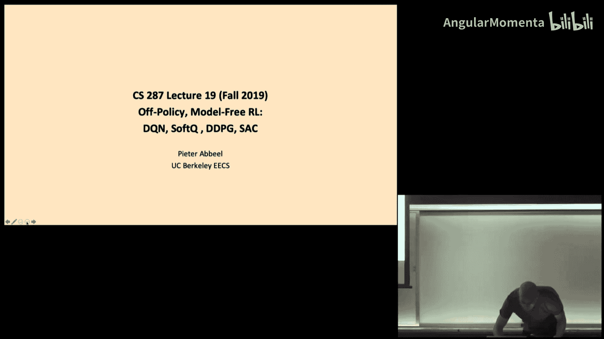
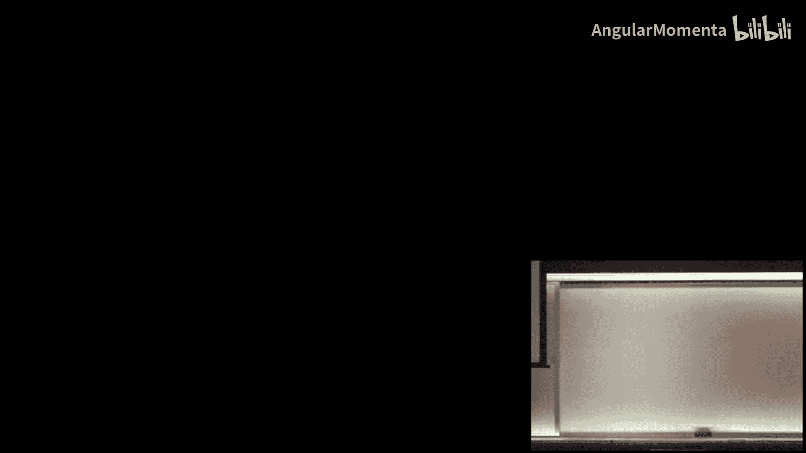
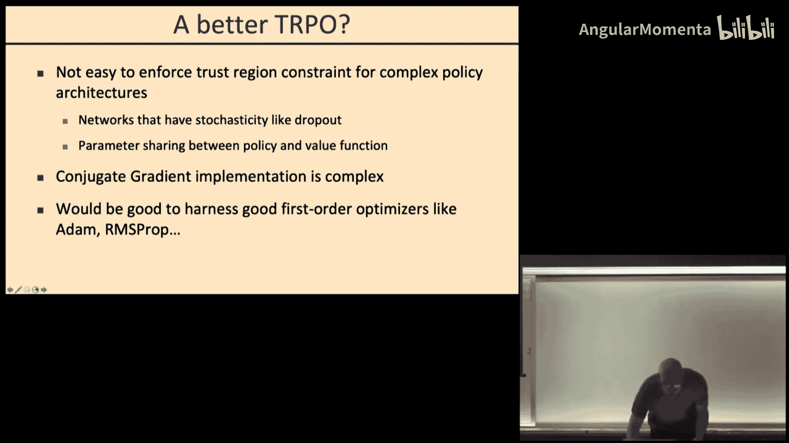
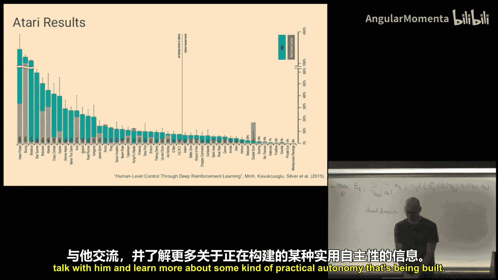
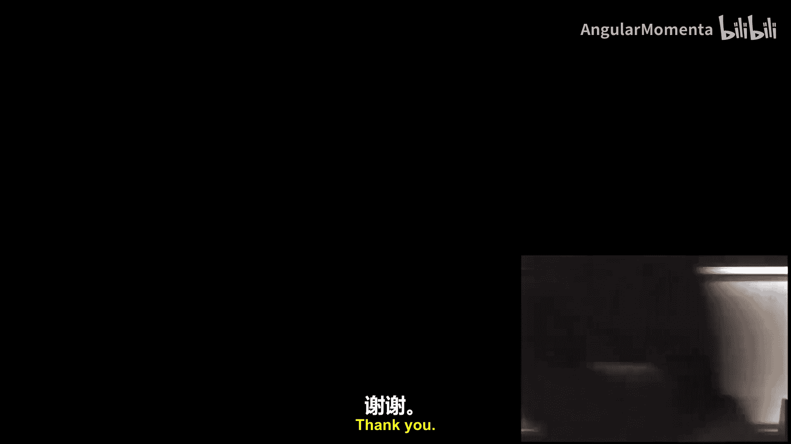

# 018：深度Q网络、软Q学习、深度确定性策略梯度、软演员-评论家算法

## 概述

在本节课中，我们将学习离策略、无模型强化学习算法。我们将首先回顾策略梯度方法，并深入探讨其稳定优化的关键——信赖域方法。接着，我们将转向离策略学习，重点介绍深度Q网络及其核心思想。课程内容旨在让初学者能够理解这些算法的基本原理和实现思路。

---

## 策略梯度回顾与信赖域方法

上一讲我们介绍了策略梯度方法。本节中，我们来看看如何通过信赖域方法更稳定、高效地优化策略。

策略梯度方法的核心是优化轨迹分布。我们通过计算目标函数关于策略参数的梯度，将概率质量转移到高奖励轨迹上，并远离低奖励轨迹。我们得到了以下梯度更新公式：

**公式**：
`∇θ J(θ) ≈ (1/N) Σ_i Σ_t [∇θ log πθ(a_t^i | s_t^i) * (Σ_{k=t}^H r(s_k^i, a_k^i) - V_φ(s_t^i))]`

其中，`V_φ(s)` 是价值函数的估计，用于作为基线减少方差。

在实际实现中，我们可以将此构建为一个目标函数，并利用自动微分框架（如TensorFlow或PyTorch）进行优化。同时，我们需要并行地拟合价值函数 `V_φ`。

然而，策略梯度只是一个局部的一阶近似。在监督学习中，步长过大可以自我纠正，但在强化学习中，糟糕的策略会收集糟糕的数据，可能导致难以恢复。因此，步长选择至关重要。

简单的线搜索方法计算成本高昂。更高级的方法是使用**信赖域**，它定义了梯度近似有效的区域。在策略优化中，我们关心新旧策略下轨迹分布的差异，这可以用KL散度来衡量：

**公式**：
`D_KL(π_θ_old || π_θ) = E_{s~π_θ_old} [ Σ_a π_θ_old(a|s) log (π_θ_old(a|s) / π_θ(a|s)) ]`

神奇的是，动态模型项在计算中会抵消，因此我们无需知道环境模型即可评估此距离。

---

## 信赖域策略优化

为了高效地强制执行信赖域约束，信赖域策略优化使用KL散度的二阶近似，其Hessian矩阵是Fisher信息矩阵。我们的优化问题变为：

**公式**：
最大化 `L(θ) = E[ (π_θ(a|s) / π_θ_old(a|s)) * A_hat ]`
约束条件 `D_KL(π_θ_old || π_θ) ≤ δ`

其中 `A_hat` 是优势函数估计。

TRPO通过共轭梯度等方法求解这个带约束的优化问题，实现了对大型神经网络策略的稳定优化，并首次成功让模拟机器人学习复杂运动技能。

---

## 近端策略优化

虽然TRPO效果显著，但其实现复杂，且难以与Dropout或策略-价值函数参数共享等架构兼容。近端策略优化应运而生，它更简单且易于实现。

PPO的核心思想是：我们不希望新策略与旧策略偏离太远。我们定义重要性采样比 `r_t(θ) = π_θ(a_t|s_t) / π_θ_old(a_t|s_t)`。当这个比率接近1时，我们可以信任目标函数；当它远离1时，我们则不能。

PPO通过“裁剪”目标函数来防止更新步幅过大。其目标函数（PPO-裁剪版本）为：

**公式**：
`L^{CLIP}(θ) = E[ min( r_t(θ) * A_hat, clip(r_t(θ), 1-ε, 1+ε) * A_hat ) ]`

其中，`clip` 函数将比率限制在 `[1-ε, 1+ε]` 范围内。这个 `min` 操作确保了最终目标是原始目标与裁剪后目标中较保守（悲观）的一个。

实现PPO非常简单：收集经验，计算优势估计，然后将上述目标函数输入到Adam等优化器中执行若干步更新，接着收集新数据并重复。当数据收集速度很快时，PPO通常是首选方法。

---

## 离策略Q学习

前面介绍的方法（如PPO）本质上是**同策略**的，严重依赖于当前策略收集的最新数据。如果数据收集成本很高，我们希望更有效地重用过去的数据，这就需要**离策略**方法。

离策略方法的核心是利用时间步的分解，重用单个状态转移经验，而不是完整的轨迹。这可以显著提高样本效率。

我们首先回顾**Q学习**。最优动作价值函数 `Q*(s, a)` 满足贝尔曼最优方程：

**公式**：
`Q*(s, a) = E_{s'~P(·|s,a)} [ r(s, a) + γ * max_{a'} Q*(s', a') ]`

在表格形式中，Q学习通过采样更新来逼近这个方程：

**公式**：
`Q(s, a) ← Q(s, a) + α * [ r + γ * max_{a'} Q(s', a') - Q(s, a) ]`

其中 `α` 是学习率。通过ε-贪婪等策略确保充分探索，Q学习可以收敛到最优Q值，即使行为策略不是最优的。

---

## 深度Q网络

对于大规模或连续状态空间，我们需要用函数（如神经网络）来近似Q值，这就是深度Q网络。

我们有一个参数化的Q函数 `Q_θ(s, a)`。学习目标是让Q函数的预测接近“目标值”。我们最小化以下损失：

**公式**：
`L(θ) = E_{(s,a,r,s')~D} [ ( Q_θ(s, a) - y )^2 ]`
其中 `y = r + γ * max_{a'} Q_θ'(s', a')`，`θ'` 是目标网络的参数。

DQN的关键创新包括：
1.  **经验回放**：存储转移样本 `(s, a, r, s')` 到缓冲池，并从中随机采样进行训练，打破数据间的相关性。
2.  **目标网络**：使用一个独立的、更新较慢的目标网络 `Q_θ'` 来计算目标 `y`，极大地提高了训练的稳定性。
3.  **误差裁剪**：使用Huber损失代替均方误差，对异常值更鲁棒。

通过这种架构，DQN首次实现了直接从像素输入学习玩多种Atari游戏，并达到超越人类的水平。

---

## 总结

本节课我们一起学习了离策略、无模型强化学习的核心算法。

我们首先从策略梯度出发，探讨了通过信赖域方法实现稳定优化的TRPO，以及其更简单、高效的变体PPO。这些方法在同策略、数据收集快速的场景下表现优异。

接着，我们转向离策略学习，介绍了经典的Q学习算法及其在表格形式下的工作原理。为了处理高维状态空间，我们深入讲解了深度Q网络，它通过经验回放和目标网络等技巧，用神经网络近似Q函数，实现了从原始输入中学习复杂控制策略的突破。

在下一讲中，我们将继续探讨DQN的改进版本，以及更先进的离策略演员-评论家算法，如深度确定性策略梯度和软演员-评论家。