# 019：基于模型的强化学习 🚀

在本节课中，我们将学习基于模型的强化学习。首先，我们将回顾上节课关于离策略、无模型强化学习的剩余内容，包括DQN、Soft Q-Learning和DDPG。然后，我们将深入探讨基于模型的方法，了解其如何通过学习环境动态模型来提高样本效率，并讨论相关的挑战与解决方案。

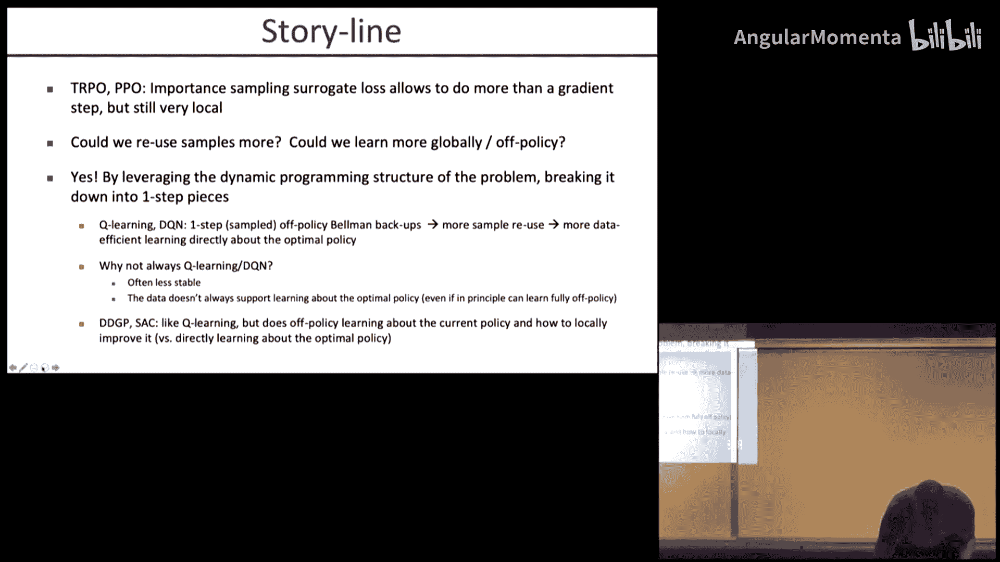

---

## 课程回顾与引言

上一节我们介绍了策略梯度方法，如TRPO和PPO。它们非常稳定且易于使用，但主要利用最新收集的样本，对过去经验的重用有限。如果样本收集成本高昂，我们则需要能更有效重用数据的算法。

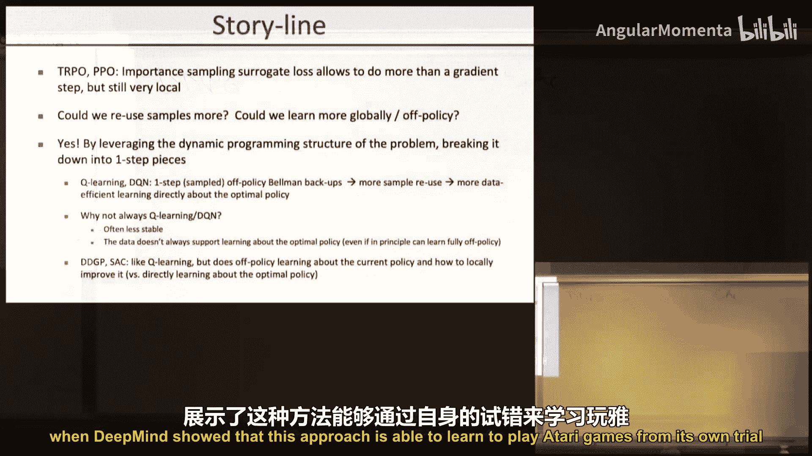

本节中，我们来看看离策略的Q-Learning方法，它能更好地重用经验回放缓冲区中的数据。

---

## 深度Q网络（DQN） 🧠

DQN算法包含两个主要部分：数据收集和Q函数更新。

首先，智能体收集数据，形式为 `(s_t, a_t, r_t, s_{t+1})`，并将其存入经验回放缓冲区。

然后，从缓冲区中采样一批经验，用于更新Q函数。损失函数定义如下：

**公式：**
`L(θ) = Σ (y_k - Q_θ(s_k, a_k))^2`

其中，目标值 `y_k` 为：
`y_k = r_k + γ * max_{a'} Q_{θ^-}(s_{k+1}, a')`

这里，`θ^-` 是目标网络参数，它会定期从当前网络参数 `θ` 同步更新，以稳定训练。

以下是DQN的关键步骤列表：
*   **数据收集**：使用ε-贪婪策略与环境交互，并将转移元组存入回放缓冲区。
*   **Q函数更新**：从缓冲区采样，计算上述损失并更新当前Q网络。
*   **目标网络更新**：定期将当前网络参数复制到目标网络。

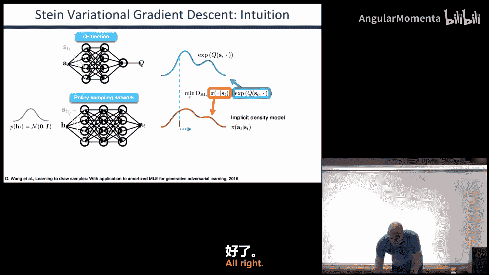

DQN在2013年首次成功地将深度强化学习应用于Atari游戏，证明了其有效性。然而，它也存在一些局限性，例如对Q值的高估。

---

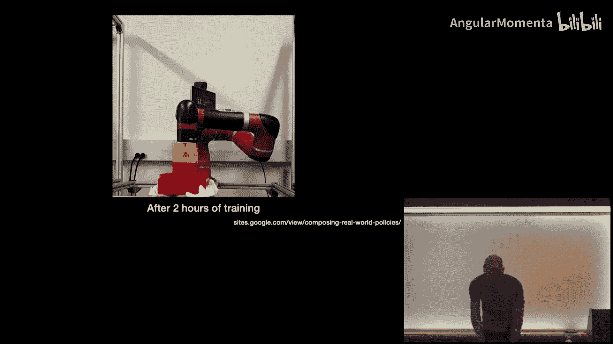

## DQN的改进方案

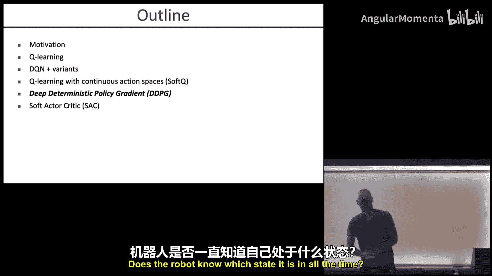

为了提升DQN的性能和稳定性，研究人员提出了多种改进方法。

以下是几种重要的DQN变体：
*   **Double DQN**：使用两个网络。一个网络选择动作（argmax），另一个网络评估该动作的价值。这有助于减少因噪声导致的价值高估。
*   **优先经验回放**：根据时序差分误差的大小对缓冲区中的经验进行优先级采样，使学习更高效。
*   **分布式DQN**：不预测单一的Q值，而是预测Q值的分布（落在哪个区间），将其转化为分类问题，通常能传播更多信息。
*   **Noisy DQN**：不在动作空间添加随机噪声，而是向Q网络的权重注入噪声，以鼓励更有方向性的探索。

---

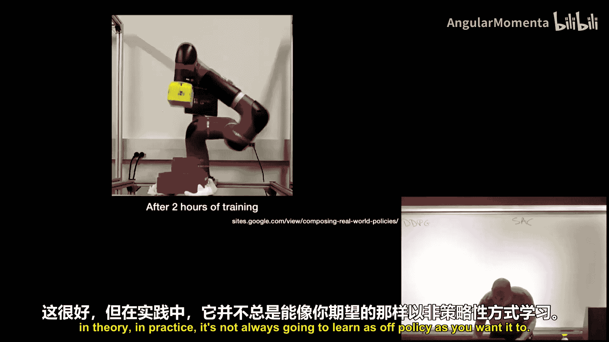

## 连续动作空间的挑战与Soft Q-Learning

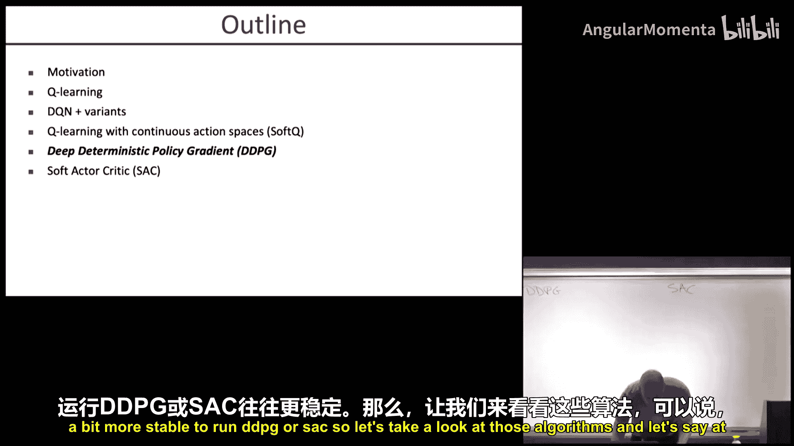

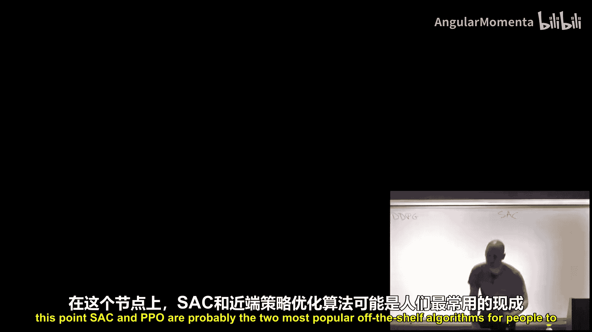

上述DQN方法假设动作空间是离散的。对于连续动作空间，我们无法为每个可能动作输出一个Q值。

解决方案是让Q函数同时接收状态和动作作为输入：`Q_θ(s, a)`。但这带来了新的挑战：在收集数据时，为了找到最大化Q值的动作，需要解决一个优化问题，这在每一步都可能非常耗时。

Soft Q-Learning同时解决了两个问题：处理连续动作空间以及通过熵正则化鼓励探索。

该方法需要学习三个部分：
1.  **Q函数** `Q_θ(s, a)`
2.  **价值函数** `V_ψ(s)`
3.  **策略** `π_φ(a|s)`

策略通过最小化其与由Q函数导出的玻尔兹曼分布之间的KL散度来学习：
`π_φ(a|s) ∝ exp(Q_θ(s, a))`

价值函数和Q函数的更新目标也包含了熵项，具体公式如下：

**价值函数目标：**
`V_ψ(s) ≈ E_{a∼π_φ}[Q_θ(s, a) - log π_φ(a|s)]`

**Q函数目标：**
`Q_θ(s_t, a_t) ≈ r_t + γ E_{s_{t+1}}[V_ψ(s_{t+1})]`

通过这种方式，Soft Q-Learning能够在真实机器人上高效学习复杂技能，例如叠积木，并且学到的策略通常更加鲁棒。

---

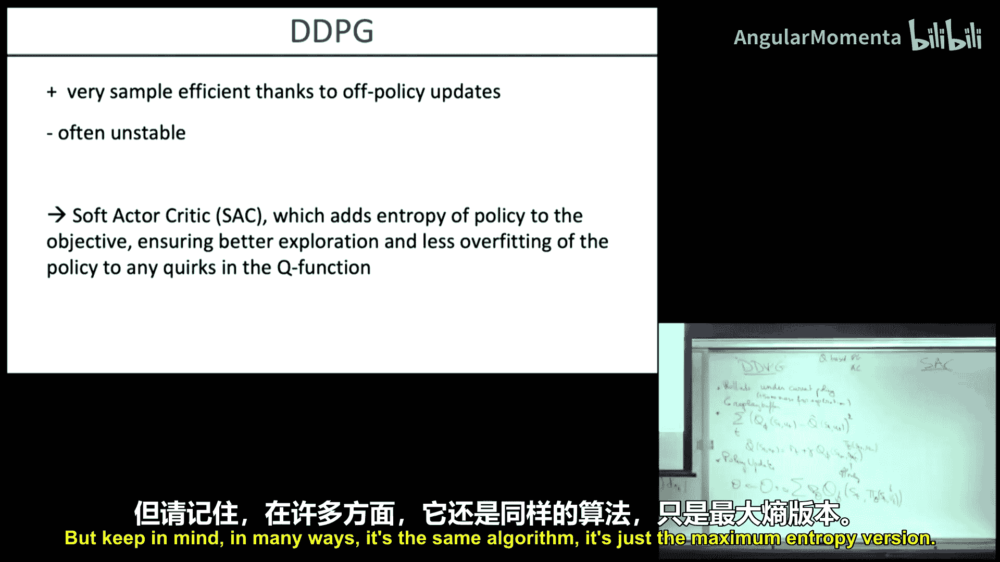

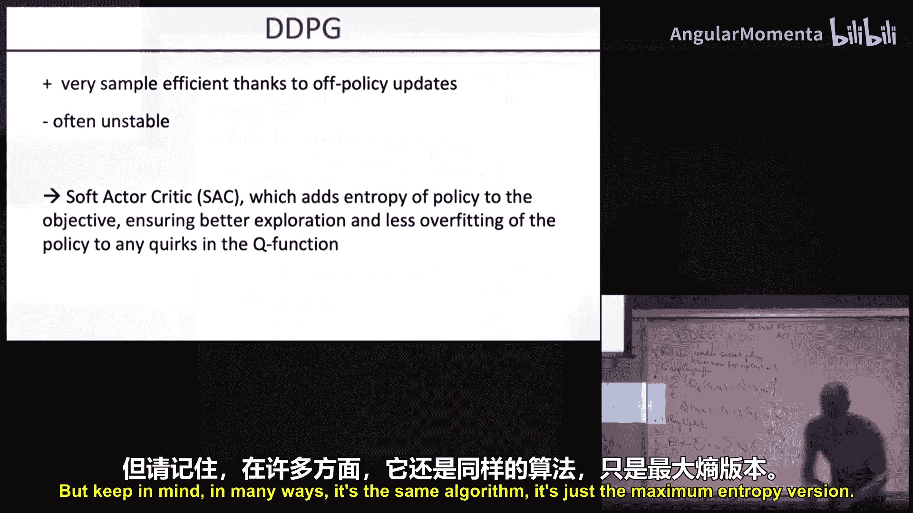

## 深度确定性策略梯度（DDPG） 🤖

虽然Q-Learning理论上是完全离策略的，但在实践中，如果数据与当前策略偏离太远，学习可能不稳定。DDPG及其前身SVG(0)更接近于在策略方法，通常更稳定。

DDPG的核心思想是学习当前策略下的Q函数（即策略评估），然后利用该Q函数通过梯度上升直接改进策略（即策略改进）。

算法步骤如下：
1.  使用当前策略（带探索噪声）收集轨迹数据，并存入经验回放缓冲区。
2.  从缓冲区采样，通过最小化贝尔曼误差来更新Q函数 `Q_φ`。
3.  通过最大化 `Q_φ(s, π_θ(s))` 来更新策略 `π_θ`。这利用了链式法则，要求动作空间连续。

DDPG通过使用目标网络和从回放缓冲区中采样“下一动作”为当前策略产生的动作，实现了高效的离策略学习。它曾在连续控制任务上取得当时最先进的样本效率。

---

## 软演员-评论家（SAC）🌟

尽管DDPG效果显著，但其训练过程对超参数敏感，且不同随机种子的结果方差较大，重现性是一大挑战。软演员-评论家（SAC）通过引入最大熵框架，极大地提高了算法的稳定性和鲁棒性。

SAC优化的是最大熵目标：
`J(π) = Σ E_{(s_t, a_t) ∼ ρ_π} [r(s_t, a_t) + α H(π(·|s_t))]`

其中 `H` 是熵项，`α` 是温度参数。熵鼓励探索，并使学到的策略对扰动更鲁棒。

与Soft Q-Learning类似，SAC也同时学习Q函数、价值函数和策略。关键区别在于，SAC学习的是当前（最大熵）策略下的Q函数和价值函数，而不是最优Q函数，这通常使学习过程更稳定。

SAC已成为目前最流行、最稳定的深度强化学习算法之一，在样本效率和渐近性能之间取得了良好平衡，并且在不同任务和随机种子下表现出很小的性能方差。

---

## 从无模型到基于模型的强化学习

我们回顾了无模型强化学习的主线：从策略梯度方法（如PPO）到利用动态规划思想的离策略Q-Learning方法（如DQN），再到结合两者优点的SAC。SAC通过单步转移实现离策略学习，同时仍以接近在策略的方式收集数据并进行策略更新，达到了稳定性与样本效率的折衷。

现在，让我们转向基于模型的强化学习。其核心思想是：智能体与环境交互收集数据，然后利用这些数据学习一个环境动态模型。随后，智能体可以在这个学习到的模型（模拟器）中进行强化学习，从而大幅减少在真实环境中收集昂贵样本的需求。

基于模型的方法有望带来更高的样本效率，并且学到的模型可以重用于不同的奖励函数。然而，它们也面临挑战：学到的模型不完美，在模型中进行策略优化可能导致“利用模型缺陷”的问题，使得在模拟中表现良好的策略在真实世界中失败。

---

## 基于模型方法的核心挑战与解决方案

基于模型方法的主要挑战是模型偏差。策略可能在模拟器的某些不准确区域找到“捷径”，获得虚高的奖励，但这些区域并不反映真实动态。

解决方案是学习一个动力学模型集合，而不是单个模型。如果集合中所有模型对某个状态转移的预测一致，说明该区域有数据支持，模型可信。如果预测不一致，则说明该区域数据不足或模型不确定。

基于此，**模型集成信任域策略优化** 方法在策略优化时，会降低或忽略模型预测不一致区域的数据权重，从而引导策略避开模型不确定的区域。

---

## 元学习与自适应策略

然而，学习一个在所有集成模型成员上都表现良好的鲁棒策略，可能过于保守，无法达到与无模型方法相同的渐近性能。

**基于模型的元策略优化** 通过元学习解决这个问题。它不学习一个固定的策略，而是学习一个循环神经网络构成的元策略。这个元策略在部署到集成中的任何一个模型时，都能通过内部状态快速适应那个特定模型的动态。当这个元策略部署到真实世界时，希望它也能快速适应真实环境。

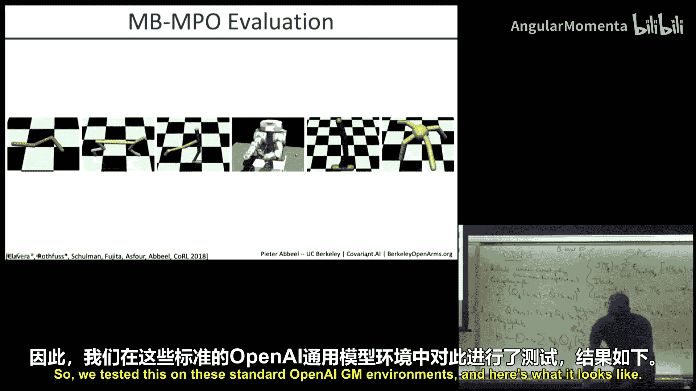

这种方法首次使基于模型的方法在样本效率大幅提升的同时，达到了与先进无模型方法相当的渐近性能，并成功应用于真实机器人操作任务。

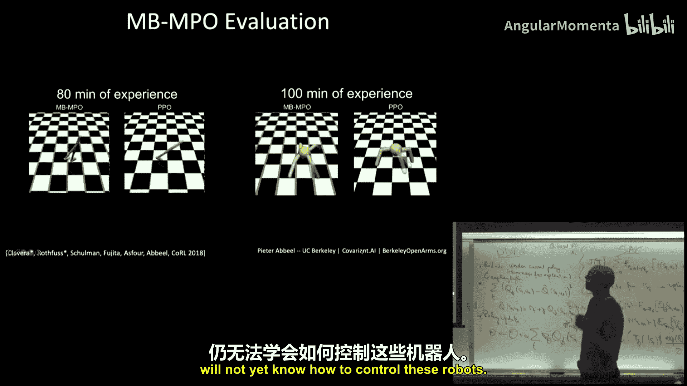

---

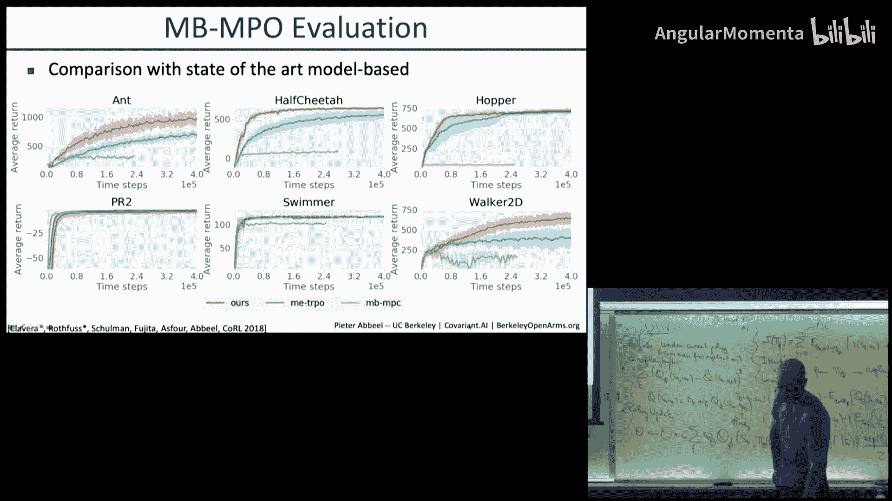

## 总结与展望

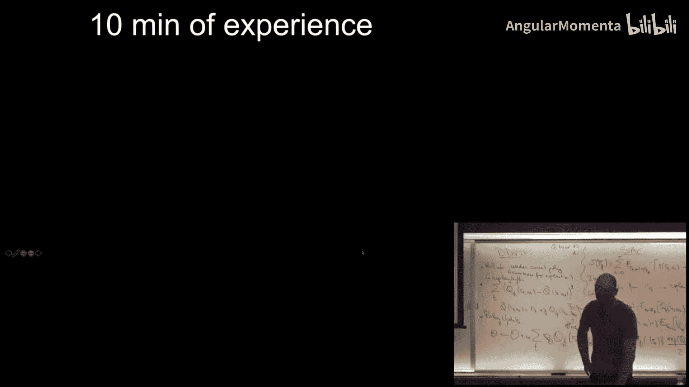

本节课中，我们一起学习了基于模型的强化学习。我们从回顾离策略Q-Learning（DQN, Soft Q-Learning, DDPG）和当前最流行的稳定算法SAC开始。然后，我们深入探讨了基于模型的方法，它通过学习环境模型来提升样本效率。我们分析了模型偏差的挑战，并介绍了通过模型集成和元学习来自适应策略的解决方案，这些方法能有效提升性能并实现真实世界的高效学习。

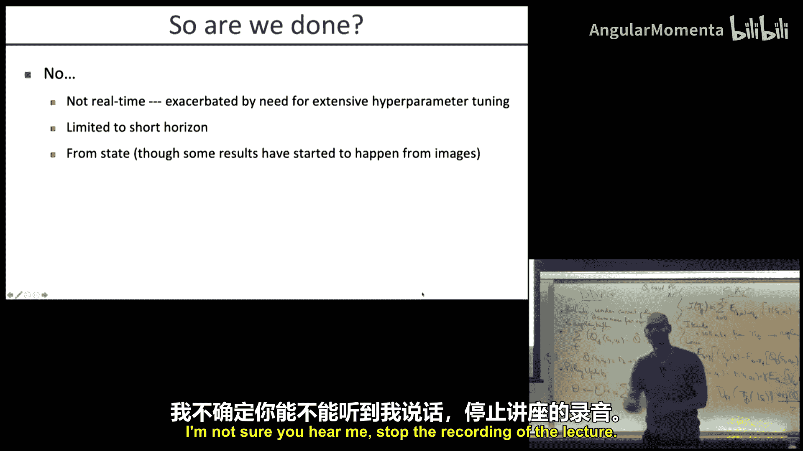

尽管取得了进展，基于模型的方法仍面临一些挑战，例如长时程任务中的误差累积、从像素等原始观察中学习，以及如何减少计算时间以实现实时学习。我们将在后续课程中探讨这些前沿方向。