# 020：物理模拟与模型基础强化学习进阶 🚀

在本节课中，我们将学习模型基础强化学习的进阶概念，并深入探讨如何让计算机模拟物理世界。课程分为两部分：首先，我们将总结并扩展上周关于模型基础强化学习的讨论；其次，我们将介绍物理模拟的基础知识。

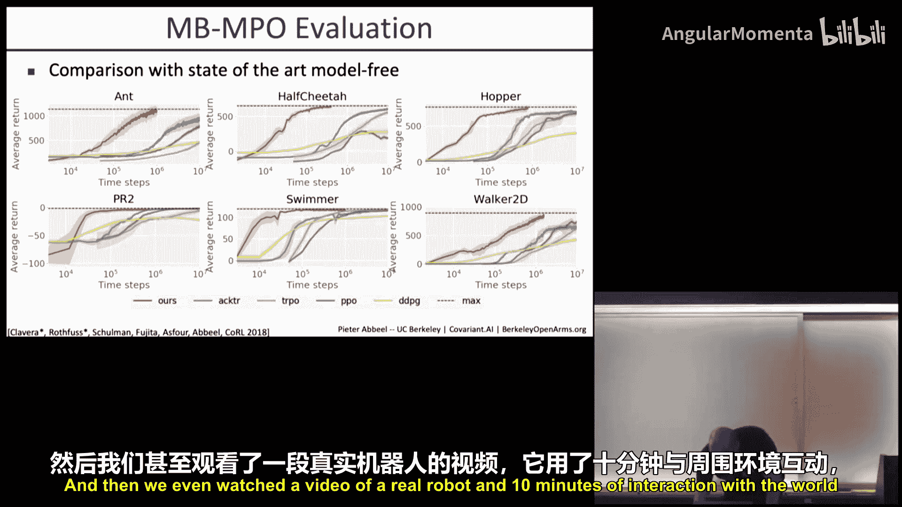

---

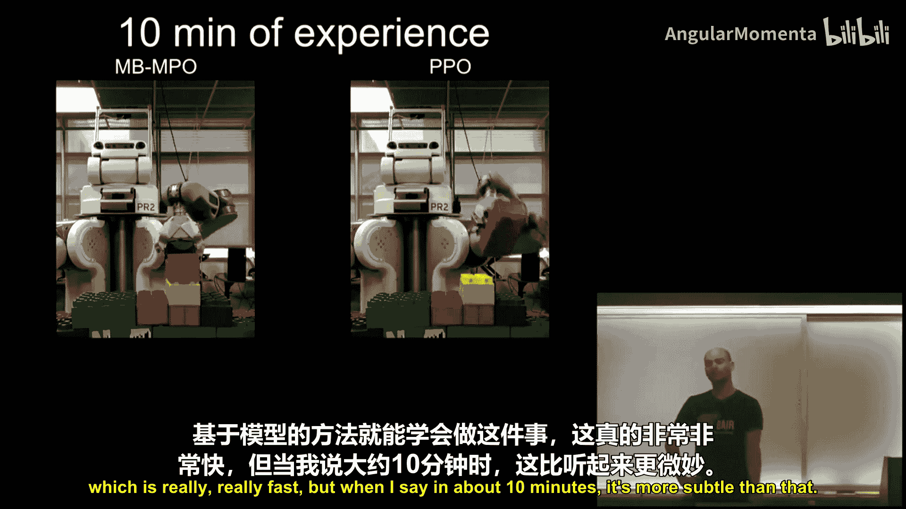

## 模型基础强化学习进阶 🧠

上一节我们介绍了模型基础强化学习的基础。本节中，我们来看看如何解决其面临的一些挑战，并探索从状态空间到视觉输入的扩展。

模型基础强化学习的主要算法流程如下：
1.  在当前策略下收集数据。
2.  从历史数据中学习一个动力学模型。
3.  利用该动力学模型改进策略。
4.  重复上述过程。

然而，历史经验表明这种方法存在挑战。学习到的动力学模型可能与现实世界不完全匹配。当优化策略时，策略可能会利用模拟器的“特性”，在模拟中表现优异，但在现实中可能失效。

一种解决方案是学习更好的模型，并更长时间地运行这个循环。但如果状态空间很大，这可能难以实现。目前看来更有效的解决方案是基于集成的方法。其核心思想是维护一个关于可能动力学模型的后验分布集成，然后尝试学习一个策略。这个策略要么能在所有集成成员上直接工作，要么是一个自适应策略，无论被放入哪个模型成员中，都能快速适应，从而也能快速适应现实世界。

实际上，这种自适应方法能产生非常令人印象深刻的学习曲线。我们看到模型基础方法比无模型方法学习速度快得多，并且最终能达到与无模型方法相当的性能水平。

我们甚至观看了一段真实机器人的视频。在约10分钟与世界的交互中，模型基础方法（使用MEPOLI优化）学会了堆叠乐高积木，而无模型的PPO方法则未能成功。需要澄清的是，这“10分钟”指的是真实世界交互时间。在模型基础训练中，后台会进行大量计算。流程通常是：进行半分钟的真实世界交互，接着进行10分钟的计算，然后再进行半分钟的真实世界交互，如此循环。

因此，一个自然的问题是：我们能否让这个过程接近实时？此外，当前模型基础强化学习方法通常局限于短视界问题，因为学习到的模拟器难以在长视界上进行精确模拟。另一个限制是许多方法依赖于状态输入。

我们现在要探讨的是如何在一定程度上解决第一个和第三个问题。至于第二个问题（长视界），目前可能还没有完全解决。

### 实现实时学习：异步方法 ⚡

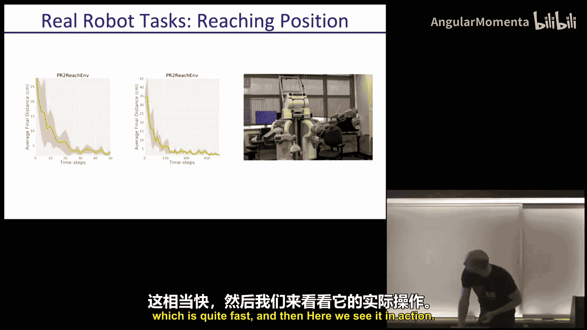

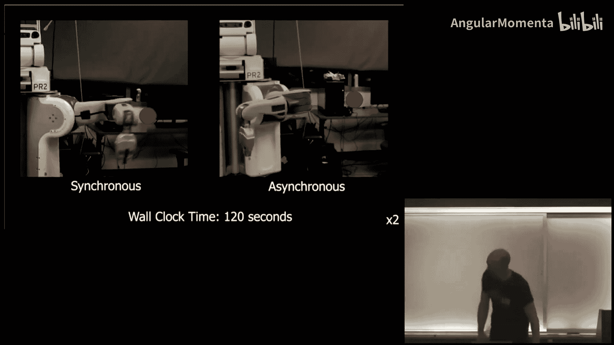

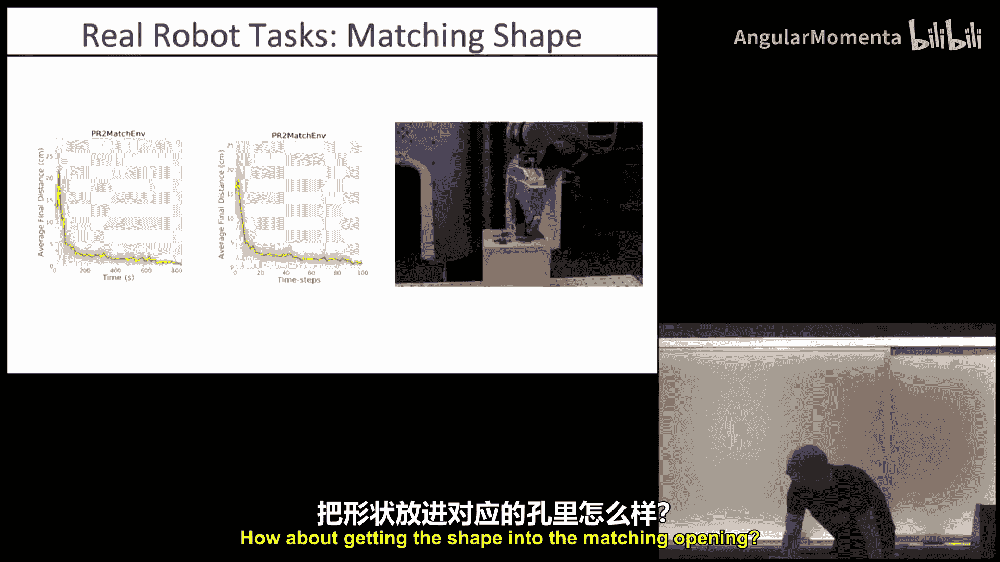

模型基础强化学习的典型运行方式是同步的：收集环境数据 -> 从数据缓冲区学习模型 -> 在学到的模拟器中改进策略 -> 部署新策略收集数据 -> 重复。这种方式有意义，因为它充分利用了所有过去经验来部署最佳策略以收集新数据。但这意味着在数据收集和下一次数据收集之间的学习阶段存在很长的时间间隔。

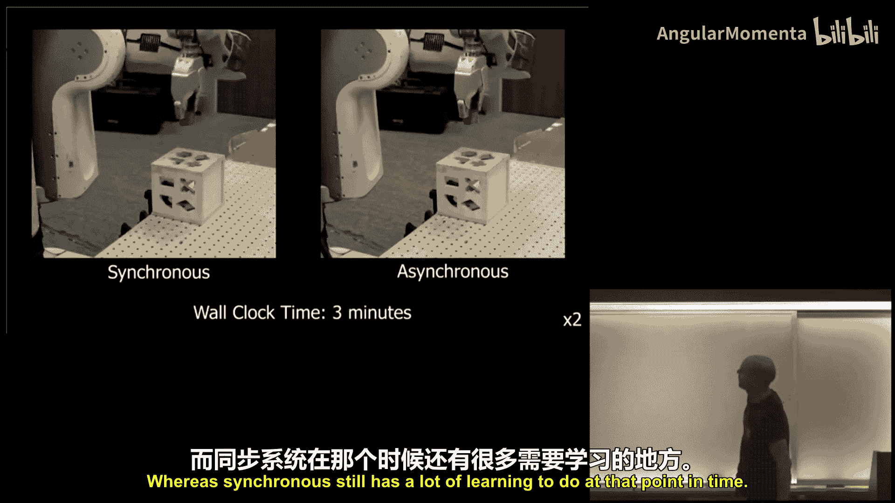

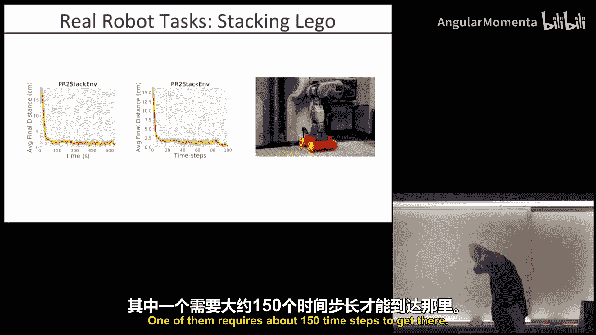

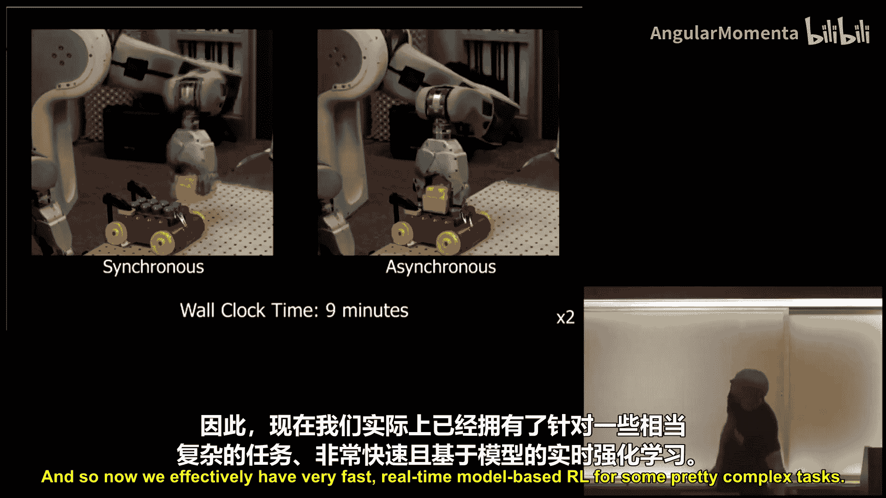

问题是，我们能否避免这种情况？一种方法是将这个过程改为异步执行：
*   数据收集持续进行。
*   模型学习器和策略改进器也持续工作。
*   它们不断地将结果传递给彼此。

具体来说，当获得一个新数据点时，它被传递到数据缓冲区，模型学习器立即从中拉取最新数据（无需等待整轮回合结束）。策略改进器则持续使用来自模型学习器的最新模型参数更新其模拟器。数据收集始终使用最新的策略参数。

那么，这会带来哪些问题？性能是否会受到影响？因为我们没有在再次收集数据前整合所有可能从数据中获得的信息。这可能对策略正则化产生影响。原因在于，模型总是在变化，这可能起到正则化策略的作用，使其更鲁棒。此外，这可能对数据探索产生积极影响。因为策略不断变化，收集数据的方式会比使用一个“最佳”策略收集大量数据更加多样化和更具探索性。

这种方法对超参数的鲁棒性如何？有趣的是，在上述描述中，几乎没有超参数。如果这种方法有效，那将非常理想，因为你只需持续输入数据，无需担心模型训练多久、策略训练多久或数据收集多久。所有事情同时发生，无需调整时间长度。

另一个问题是，整个流程对数据收集频率的鲁棒性如何？因为现在存在一种隐式依赖：机器人收集数据的速度决定了新数据通过这个循环的速度，而这在不同系统间差异很大。

最近在CoRL会议上发表的一篇论文比较了异步和同步方法的性能。他们比较了异步模型集成TRPO、异步模型集成PPO、异步MB-MPO（元学习版本）与基线方法（相同算法的同步版本以及无模型方法TRPO和PPO）。

从实验结果看，在挂钟时间上，异步方法明显比同步方法更有效，而无模型方法耗时则长得多。在样本复杂度（数据收集的时间步数）上，两种方法大致相当。在某些现实场景中，异步方法甚至样本效率更高一些。

### 探索策略正则化与数据收集 🔍

为了研究策略正则化和数据收集中的探索，我们可以进行对照实验。与完全同步方法相比，我们可以尝试一种“部分异步”的变体：在策略学习过程中频繁更新模型。这意味着策略不是针对一个固定的集成进行学习，而是针对一个持续变化的集成进行学习。因此，策略可能会获得额外的鲁棒性和正则化效果，因为它不会长时间过拟合到任何一个特定的模型。

实验结果证实了这一点。交错学习（频繁更新模型）比顺序学习收敛得更快，这很可能是因为它避免了过拟合到任何特定模型。

我们也可以对数据收集进行类似的研究。如果我们持续派出当前最新的策略（而不是等待在当前模拟器中收敛后再派出），会发生什么？可能有两种情况：派出的策略因为未充分优化而表现不佳，导致效果变差；或者，由于我们持续派出不同的策略，收集到的数据实际上信息量更大、更具探索性，从而总体上让我们学得更快。结果表明，后一种效应占主导地位。确实，如果持续更新用于收集数据的策略，可以学得更快。

关于数据收集频率的敏感性实验表明，不同频率确实有影响，在某些环境中某些速度稍好于另一些，但总体差异不大。

### 在真实机器人任务中的应用 🤖

那么，这种方法能否用于真实的机器人任务？我们能否展示一个模型基础强化学习演示，在短短5到10分钟内就看到学习过程并完成任务？事实上，这是可能的。

例如，在“伸手”任务中，异步方法能够在大约300个时间步内快速学会。在“将物体放入匹配开口”和“堆叠乐高积木”任务中，异步方法在几分钟的挂钟时间内就能完成任务，而同步方法则需要长得多的时间（有时长达7倍）。因此，我们现在已经能够为一些相当复杂的任务实现非常快速的、接近实时的模型基础强化学习。

**快速总结当前可能性：**
*   可以为机器人操作任务实现近乎实时的学习（目前是在状态空间下）。
*   由于更好的策略正则化和数据收集时更好的探索，异步运行的样本效率实际上更高。
*   在真实机器人上非常有效。

### 视觉基础的模型基础强化学习 👁️

我们尚未深入讨论的部分是视觉基础的方法。不同之处在于，现在你需要学习模拟你所感知的世界，不是在状态空间，而是在像素空间。因为你输入的是像素，输出也是下一时刻的像素，你需要学习预测接下来会发生什么，并构建一个能实现这一点的模拟器。

这方面一个广为人知的工作是David Ha等人提出的“世界模型”。他们在一个简单的模拟环境（Doom）中提出了一种自然的方法：不直接从当前帧预测下一帧，因为直接在像素上学习一切效率不高。他们使用变分自编码器将感官信息压缩到一个潜在状态，然后进行重建。在潜在Z空间中学习动力学模型可能更有效，并且可以学习一个依赖于Z而非像素值的策略。由于策略处理的是更低维的信息，通常能更快地找到信号。

他们在赛车环境中测试了这种方法，输入是俯视图像，需要控制赛车保持在路上并快速行驶。这个实验很好地说明了“蛋糕类比”：在深度学习中，强化学习提供的信号很少（就像蛋糕上的樱桃），监督学习需要人工标注（就像糖霜），而无监督或自监督学习才是主体（蛋糕本身）。这个实验中的参数数量分布也体现了这一点：VAE（无监督）有约400万参数，RNN（动力学的监督学习）有41000参数，而控制器神经网络只有800参数。

“世界模型”可以说是最简单的方法之一，如果做得好，效果会出奇地好。还有一些更复杂的方法，例如在Atari游戏中使用GAN进行动作条件视频预测、从像素进行规划的PlaNet等。

另一个非常不同的想法是“嵌入控制”。其思路是：既然我们知道如何用LQR进行控制，那么可以尝试学习一个潜在空间，使得在该空间中的动力学模型是线性的。这样，控制问题就变得简单多了。通过在线性时变系统上扩展这种方法，甚至可以在更复杂的真实机器人系统上取得成功。

其他研究方向包括：
*   **深度空间自编码器**：在卷积层后引入空间softmax，输出图像中物体的坐标，从而在类似状态的空间中进行控制。
*   **学习具有特定属性的嵌入**：例如，强制连续帧的嵌入接近（平滑性）、速度守恒等。
*   **β-VAE**：通过鼓励潜在变量更独立（解纠缠），使学习到的表示更容易用于后续任务，并提高环境变化时的迁移能力。
*   **因果信息GAN**：在生成逼真图像的同时，考虑环境动力学，确保嵌入空间中的插值对应合理的图像序列。
*   **直接优化多步预测和规划**：如PlaNet，直接优化长视界预测，并在模拟器中进行规划（如MPC），而不是学习参数化策略。规划通常效果更好，但计算更慢，且可能更容易过拟合到模型的 quirks。
*   **高分辨率视频预测**：结合动作条件视频预测和MPC（如交叉熵方法），根据目标图像实现目标。
*   **关注动作和奖励的预测**：与其重建图像，不如学习一个能预测动作或奖励的嵌入空间，忽略无法影响的背景噪声。这可以推广为“后继特征”，独立预测所有奖励相关特征的未来值，然后进行动作条件预测。这种方法在机器人导航等任务中效果很好。

此外，还有一些工作试图定义理想状态表示应具备的性质，以及将线性系统的“分离原理”（分别设计控制器和状态估计器）推广到深度学习场景。

---

## 物理模拟基础 🧮

现在，我们切换主题，来看看物理模拟。显然，仅物理模拟本身就可以开设多个学期的课程。我们试图在35分钟内完成，意味着我们不会成为专家，但希望你能了解其中的一些核心概念，意识到某些场景下可能存在的陷阱，并对如何着手构建模拟器或排查问题有一个大致的认识。

我们将快速浏览以下内容：
1.  刚体运动的牛顿定律。
2.  拉格朗日公式。
3.  从连续时间到离散时间（以便在计算机上运行）。
4.  接触和碰撞（这使问题复杂很多）。

**学习资源：**
*   Featherstone的书籍是物理模拟领域的经典参考。
*   最流行的物理模拟器Mujoco和Bullet都有大量关于其工作原理的文档。
*   一些游戏软件工程师也撰写了关于物理引擎关键要点的迷你教程。

### 牛顿定律与刚体运动 ⚙️

我们希望在机械层面模拟物理。核心就是 **`F = ma`**。对于一个点质量，这很简单。但对于刚体，你不需要描述物体上每个点的速度和位置，而是用质心的位置、速度、朝向和角速度来表示。

方程如下：
*   对于质心：**`F = m * a_cm`**
*   对于旋转：**`τ = I * ω̇ + ω × (I * ω)`**

其中，`τ` 是扭矩，`I` 是惯性张量（一个正定对称矩阵），`ω` 是角速度，`ω̇` 是角加速度。第二项 `ω × (I * ω)` 解释了为什么绕非主轴旋转时物体会发生进动。

惯性张量 `I` 可以通过对物体质量分布进行积分计算得到。一旦知道了质量、`I` 以及施加的力和扭矩，就可以进行模拟。

### 拉格朗日公式 📐

对于像机器人连杆这样的多体系统，关节处的力非常复杂。但我们知道一个约束：上臂连杆末端和前臂连杆始端始终在关节处连接。牛顿定律没有直接给出处理这种约束的简单方法。

拉格朗日动力学为具有约束和多体内力的系统提供了一种更简洁的公式来描述运动微分方程。

**拉格朗日方法步骤：**
1.  定义广义坐标 `q_i`（例如关节角度）。
2.  写出系统总动能 `T`，表示为广义坐标及其时间导数 `q̇_i` 的函数。
3.  写出系统总势能 `U`，表示为广义坐标的函数。
4.  确定广义力 `Q_i`（力在广义坐标方向上做的功）。
5.  构造拉格朗日量 **`L = T - U`**。
6.  运动方程由以下公式给出：
    **`d/dt (∂L/∂q̇_i) - ∂L/∂q_i = Q_i`**

这是一个通用方法，对每个自由度 `i` 都有一个方程。

**示例：点质量**
广义坐标：`(x, y, z)`
动能：`T = 1/2 * m * (ẋ² + ẏ² + ż²)`
势能：`U = m * g * z`
拉格朗日量：`L = T - U`
代入公式，可得：
`F_x = m * ẍ`
`F_y = m * ÿ`
`F_z = m * z̈ - m * g`
这正是牛顿第二定律加上重力。

**示例：双连杆机械臂**
广义坐标：`θ1`, `θ2`（两个关节角）。
通过计算两个质量块的位置和速度（表示为 `θ1`, `θ2`, `θ̇1`, `θ̇2` 的函数），可以写出动能 `T` 和势能 `U`。然后代入拉格朗日方程，得到两个关于 `θ1`, `θ2` 的二阶微分方程。这比直接使用牛顿定律分析每个连杆的受力要系统得多。

对于倒立摆、Acrobot等系统，都可以通过这个“按部就班”的方法得到运动方程。

### 摩擦力与阻力 🌊

在拉格朗日框架中，摩擦力和阻力通常作为外部力（广义力 `Q_i`）加入。
*   **摩擦力**：物体接触面之间的力。
    *   静摩擦（未滑动）：`F_friction ≤ μ_s * N`（`μ_s` 静摩擦系数，`N` 法向力）。
    *   动摩擦（滑动中）：`F_friction = μ_k * N`（`μ_k` 动摩擦系数，通常 `μ_k < μ_s`）。
*   **阻力**：物体在流体中运动时受到的力。
    *   `F_drag = 1/2 * C_d * A * ρ * v²`
    *   `C_d` 是阻力系数，`A` 是迎风面积，`ρ` 是流体密度，`v` 是速度。阻力与速度平方成正比，这就是为什么高速行驶时能耗急剧增加。

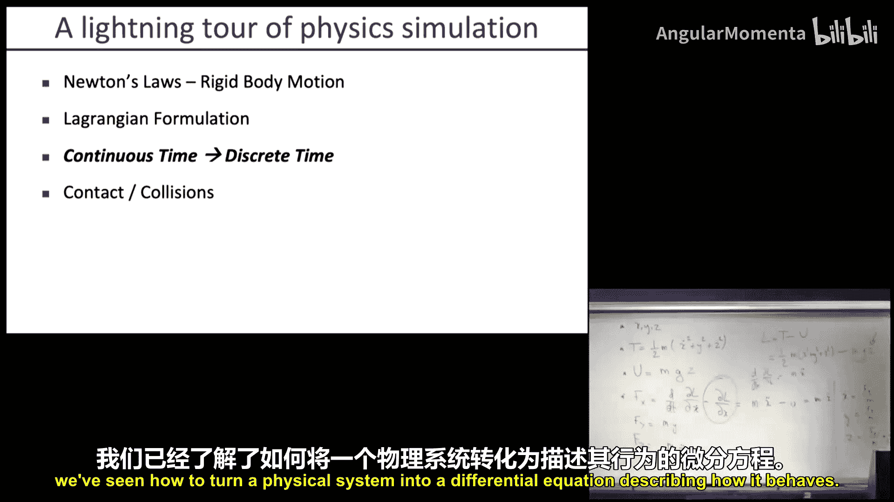

### 机器人描述标准 🤖

机器人非常常见，因此有标准描述方式（如URDF文件）。你只需指定连杆序列、长度、质量、惯性张量、关节类型等，模拟器就可以自动构建运动微分方程，无需手动推导拉格朗日量。

### 从连续时间到离散时间 ⏱️

我们得到的是连续时间的微分方程：**`ẏ = f(t, y)`**。计算机需要进行离散时间仿真。

**1. 前向欧拉法（显式）**
`y_{n+1} = y_n + h * f(t_n, y_n)`
其中 `h` 是时间步长。该方法简单，但可能不稳定，特别是对于“刚性”系统（导数变化快的系统）。为了保证稳定，可能需要非常小的 `h`，导致计算量巨大。

**2. 后向欧拉法（隐式）**
`y_{n+1} = y_n + h * f(t_{n+1}, y_{n+1})`
`y_{n+1}` 出现在方程两边，通常需要求解（非线性）方程。优点是稳定性好，即使对于大步长和刚性系统也稳定，但每步计算成本更高。

**3. 半隐式欧拉法**
对位置用前向欧拉，对速度用后向欧拉（或反之）。这种方法有时能很好地保持能量守恒。

**4. 龙格-库塔方法（特别是四阶RK4）**
`y_{n+1} = y_n + (h/6) * (k1 + 2k2 + 2k3 + k4)`
其中：
`k1 = f(t_n, y_n)`
`k2 = f(t_n + h/2, y_n + (h/2)*k1)`
`k3 = f(t_n + h/2, y_n + (h/2)*k2)`
`k4 = f(t_n + h, y_n + h*k3)`
这是一种更精确的方法，通过多个中间点的导数加权平均来估计下一步的值。它在精度和稳定性之间取得了很好的平衡，是许多模拟器的首选。

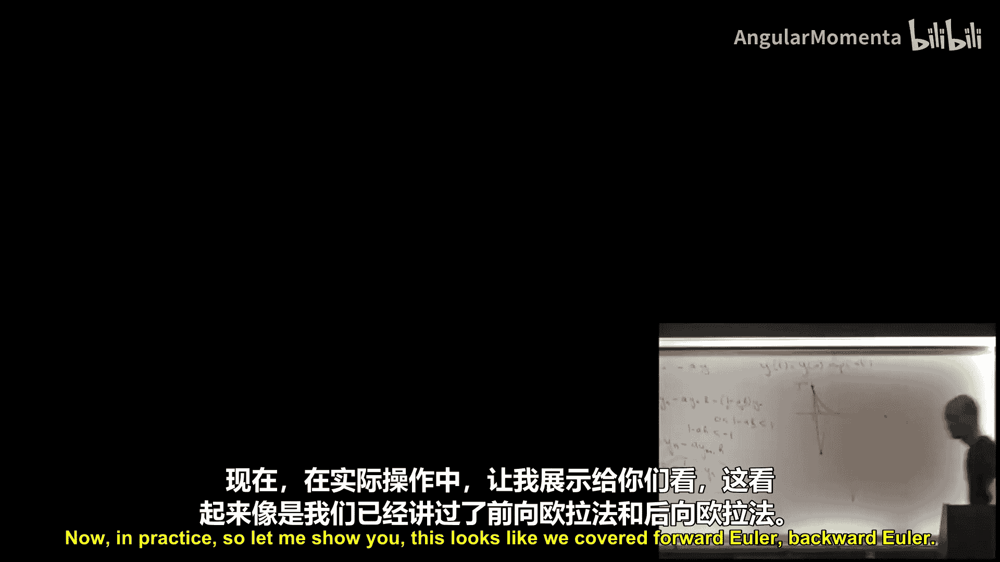

### 接触与碰撞 💥

这是物理模拟中最复杂的部分之一。

**1. 碰撞检测**
通常分为两个阶段：
*   **粗检测阶段**：快速找出哪些物体**可能**发生碰撞。常用方法包括空间划分（如四叉树/八叉树）、扫描与剪裁、轴对齐包围盒测试等。如果AABB不重叠，则物体不可能碰撞。
*   **细检测阶段**：对可能碰撞的物体对进行精确检测。由于凸体的碰撞检测效率很高，通常会将非凸物体分解为凸体的并集。常用的算法是GJK和EPA。

**2. 接触处理**
一旦检测到碰撞（即穿透），说明模拟步长可能太大了。简单的方法是回退并减小步长，使用二分搜索找到碰撞发生的精确时刻。
更常用的方法是使用**冲量**方法。冲量是力在时间上的积分，等于动量的变化：**`J = ∫ F dt = Δ(mv)`**。通过求解考虑碰撞恢复系数、摩擦等的冲量方程，可以计算碰撞后物体的速度变化，而无需模拟碰撞瞬间的复杂变形力。

**流行的物理引擎**
*   **Mujoco** 和 **Bullet** 是两个最流行的物理模拟器。它们实现了上述所有复杂功能，能够模拟各种机器人、刚体和接触。值得注意的是，这两个引擎在很大程度上都是由个人主导开发的（Mujoco: Emo Todorov; Bullet: Erwin Coumans），这非常了不起。
    **重要提示**：没有模拟器是完美精确的。原因包括离散时间步长带来的误差、碰撞检测和处理的近似、以及模型参数（质量、惯性、摩擦系数等）的不精确测量。

---

## 总结 📚

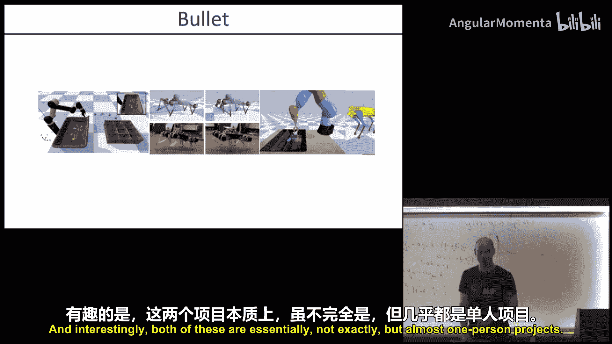

本节课中我们一起学习了：
1.  **模型基础强化学习的进阶**：探讨了通过**异步执行**（并行化数据收集、模型学习和策略改进）来实现**实时学习**的方法。这种方法不仅加快了挂钟时间，还通过持续变化的模型带来了更好的策略正则化和数据探索。我们还简要回顾了**视觉基础模型基础强化学习**的各种思路，例如学习潜在空间动力学模型、嵌入控制、关注奖励预测等。
2.  **物理模拟基础**：从**牛顿定律**和**拉格朗日公式**出发，学习了如何推导多体系统的运动方程。了解了将连续微分方程转换为**离散时间**仿真所需的数值方法（欧拉法、龙格-库塔法），并认识了处理**接触与碰撞**这一复杂问题的基本概念和流程。最后，我们了解到像Mujoco和Bullet这样的现代物理引擎虽然强大，但并非绝对精确，其误差主要来源于离散化近似和模型参数的不确定性。

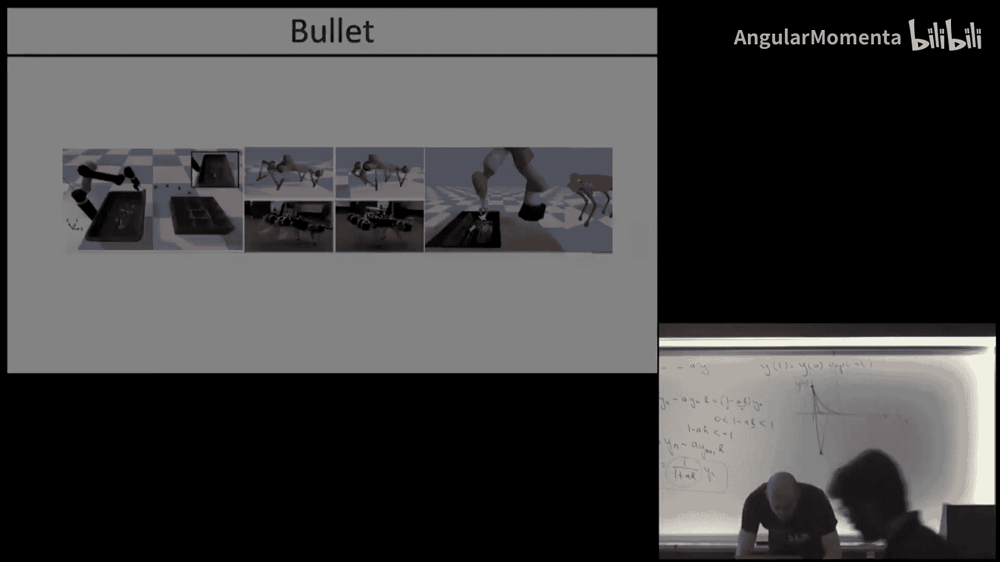

下节课，Josh Tobin将为我们讲解**域随机化**，即如何通过随机化不完美的模拟器，来训练出能在现实世界中有效工作的策略。