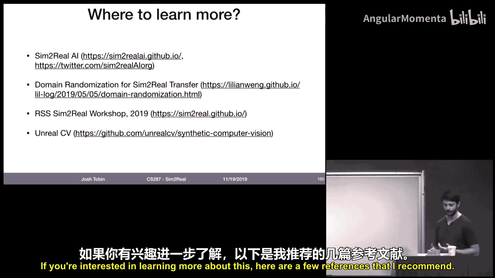
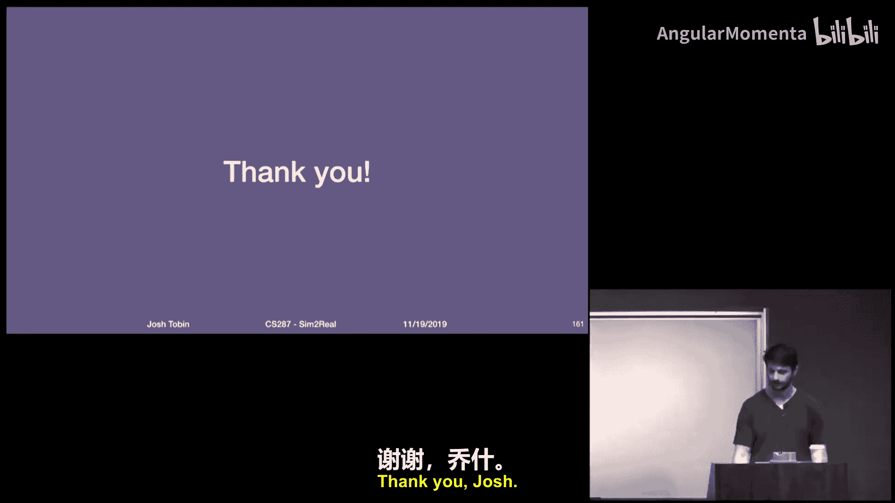
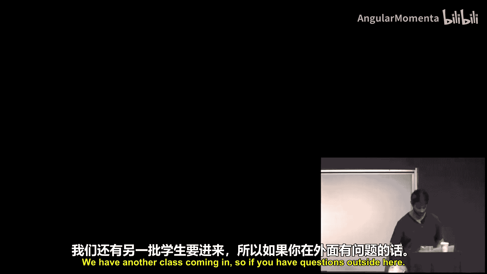

# 021：仿真转现实与领域随机化

## 概述
在本节课中，我们将要学习如何利用仿真数据来训练机器人，并使其在现实世界中有效工作。我们将探讨仿真与现实世界之间的差距，以及如何通过领域随机化等技术来弥合这一差距。

---

## 仿真与现实世界的差距

上一节我们介绍了课程的基本情况，本节中我们来看看为什么将仿真训练的模型应用到现实世界如此困难。

在标准的马尔可夫决策过程中，智能体可以观察到世界的真实状态。但在现实世界中，状态极其复杂、模糊且难以建模。机器人获得的不是状态，而是**观测**。这些观测通常是高维、多模态的，并且包含大量噪声。

此外，MDP假设我们能获得**奖励**。但在现实世界中，为复杂任务（如倒咖啡、叠毛巾）设计奖励函数非常困难。即使能设计出来，在实验室外测量奖励也依赖于传感器，这本身就是一个挑战。

最后，为机器人设计**控制器**是一个复杂的工程问题。控制器需要精确理解系统，并且难以扩展到高维空间。正如MIT的Russ Tedrake所说：“**操作**打破了我们所知的所有严谨可靠的控制方法。” 即使控制器设计好了，机器人也会损坏、传感器会失灵，如何保证可靠性是另一个难题。

---

## 深度学习的潜力与数据困境

上一节我们讨论了机器人学的核心挑战，本节中我们来看看深度强化学习带来的希望与挑战。

深度学习和深度强化学习为机器人学带来了希望：或许我们无需花费大量时间理解环境，只需收集大量经验，让算法处理其余部分。然而，深度学习是**数据饥渴型**的。训练图像、句子乃至机器人控制模型，通常需要数百万甚至数千万个带标签的样本。

这对机器人学是一个巨大挑战，因为**机器人数据极其昂贵**。机器人本身价格高昂，在现实世界中收集数据可能具有危险性，并且很难为我们关心的任务获得标签。

---

## 绕过数据困境的途径

上一节我们指出了数据稀缺的问题，本节中我们来看看有哪些可能的解决方案。

人们思考了几种方法来应对数据可用性问题：
*   **扩大数据收集规模**：例如，构建机器人舰队，共同收集数据并从共享经验中学习。
*   **提高算法效率**：采用比无模型强化学习更高效的方法，如**基于模型的RL**、**元学习**和**从演示中学习**。
*   **无监督学习**：如果难以获得现实世界的标签数据，或许可以进行大量无监督学习。

所有这些方法都很有趣，但本节课我们关注的问题是：**在不做上述事情的情况下，我们能做什么？我们能用仿真数据做什么？**

---

## 仿真数据的优势

上一节我们探讨了其他数据获取途径，本节中我们重点分析使用仿真数据的理由。

如果仿真数据有效，它将具有许多巨大优势：
*   **成本极低**：边际成本基本为零。
*   **速度极快**：仿真器可以超实时运行。
*   **可扩展性强**：可以在数据中心的每个核心上运行仿真，无需购买新机器人。
*   **安全性高**：运行仿真不会造成实际损坏。
*   **免费标签**：由于世界由你设计，你知道所有对象的位置和任务的演进过程。
*   **不受现实概率分布限制**：可以轻松生成边缘案例或减少数据偏见。

例如，在训练自动驾驶汽车时，大多数时间汽车在高速公路上行驶，但偶尔会遇到罕见情况（如穿着粉色连体服的独轮车手）。仿真数据可以专门生成这些边缘案例进行训练。同样，如果训练数据存在偏见（例如，“狗”的类别中只有金毛犬），我们可以通过合成其他品种的成年犬（如澳大利亚牧羊犬）来减少偏见。

但核心问题是：**我们有什么理由相信仿真应该有效？** Rodney Brooks曾指出：“**几乎可以肯定，在我们仿真机器人上运行良好的程序，在现实世界中会完全失败。**” 失败的原因是现实世界与仿真不同，两者之间存在动力学差异。

---

## 为何仿真数据难以使用

上一节我们列举了仿真的优势，但也提出了对其有效性的质疑。本节中我们来深入探讨仿真与现实世界存在差距的根本原因。

核心原因有两个：
1.  **难以准确且高效地建模传感器和物理系统**。
2.  **即使存在微小的建模误差，也可能导致下游控制系统出现巨大行为误差**。

为什么难以准确高效地建模？物理仿真器为了运行更快，会对世界做出一些重大假设，例如假设所有物体都是凸体、使用相对较大的离散时间步长、假设所有物体都是刚体、或使用简化的摩擦模型。任何做出如此大假设的模型，其物理特性与现实世界之间必然存在差距。

即使能准确建模一切，为了与现实世界精确匹配，仍然需要获取仿真的**参数**正确。如何测量数据中无法直接观测的量，如阻尼、惯性和摩擦？模型越精确，参数就越多，需要更多数据来准确估计它们。

不仅仅是物理，传感器仿真（如逼真渲染）现在也能做得相当好，但要达到电影级别的渲染质量，每帧需要数十小时的艺术家人工投入，成本非常高。例如，激光雷达的仿真数据与现实数据之间也存在许多差距。

更糟糕的是，如果存在差距，模型往往会**利用**这些差距。神经网络非常“懒惰”，如果数据分布中存在可利用的伪影，它们就会去利用。一个例子是“虚拟KITTI”数据，他们详尽地在仿真中重现了自动驾驶数据集中的每个场景，并在真实数据分布和仿真数据分布上训练模型。即使这是重现真实数据分布所能做到的最好情况，在仿真版本上训练的性能与在真实版本上训练的性能之间仍然存在巨大差距。

你可能会说，如果我们的建模有误差，但机器人应该对这些误差具有鲁棒性，这或许可以接受？挑战在于，误差往往会**累积**。我们希望发生的情况是，机器人沿着期望路径（蓝色曲线）前进，实际路径（绿色曲线）虽有小的、不相关的错误，但能保持在正轨上。然而，现实中经常发生的情况是，机器人偏离路径，并且偏离得如此之远，以至于超出了其训练所依据的数据分布，无法恢复。

---

## 仿真的其他用途

上一节我们确立了仿真转现实的难题，本节中我们来看看，即使不直接用于训练，仿真还能如何帮助构建机器人系统。

我们可以在不训练机器人的情况下利用仿真：
*   **算法原型设计**：在强化学习中尤为常见，人们总是在仿真中运行新算法，然后才应用到真实机器人上。
*   **调试实现**：在Gazebo和ROS等工具中实现整个软件栈，确保在部署到机器人之前，在具有真实延迟和ROS栈错误的情况下，仿真中一切正常。
*   **系统原型设计**：在工业机器人中，用于确定使用哪种机器人、设计整个工作单元，并在投资购买和安装昂贵机器人之前，测试其是否能完成任务。
*   **可靠性测试/持续集成**：例如，在自动驾驶汽车开发中，对视觉模型进行更改后，如何确保不会降低真实世界的性能？仅针对日志数据运行测试是不完整的，因为日志数据是静态的，无法探索机器人行为本身改变时会发生什么。许多自动驾驶公司（如Waymo）在仿真中运行的测试数量比在真实汽车上多好几个数量级。Russ Tedrake小组在丰田研究院采用的“仿真优先的机器人开发”方法也值得借鉴，他们每晚在仿真中运行大量测试，确保代码更改不会影响机器人行为。这种方法成功的关键在于：**确保仿真比试图解决的真实环境更难**、对随机源保持严谨、手动检查模型错误以发现错误来源，以及良好的接触仿真。

---

## 如何构建一个好的仿真器

上一节我们探讨了仿真的辅助用途，本节中我们来看看，如果决定使用仿真来训练或测试机器人，如何实际构建一个好的仿真器。

构建仿真器的典型过程是：首先构建世界模型，然后创建场景，最后收集现实世界数据用于系统辨识以改进仿真。

**设计仿真模型**：在实践中，大多数人不会从头构建仿真器，而是选择Bullet、PyBullet、MuJoCo等，并使用机器人开发者提供的模型。其他值得关注的仿真器包括MIT Russ Tedrake小组的Drake（更倾向于实现更真实的仿真，可能速度稍慢）和Gazebo（曾经最流行，现在已不那么受欢迎，但如果做很多ROS相关的工作，仍值得探索）。

**创建场景**：设计机器人将要交互的世界。一个主要问题是从哪里获取3D模型。有以下几种选择，在模型质量和数量之间存在权衡：
*   **ShapeNet**：免费可用，物体数量最多（数万个），但模型质量参差不齐。
*   **YCB**：模型质量非常高，但数量很少。
*   **DexNet**：来自伯克利Jeff Mahler的数据集，结合了其他数据集，在模型质量和可用模型数量之间取得了较好的平衡。
*   **其他3D模型库**：通常无法免费获取。
*   **程序化物体生成**：稍后会详细讨论。

拥有物体数据库后，下一个问题是如何将它们以连贯的方式放置到世界中。可以随机放置，但这通常会导致物体相互碰撞且处于不真实的配置中；可以根据物理规则随机放置（例如，让物体从盒子上方掉落）；也可以程序化地生成。

**系统辨识**：在建模世界时，你已经对所有物理参数进行了猜测。接下来需要收集大量数据，并利用这些数据使仿真器更好地匹配现实。这就是系统辨识的过程。

系统辨识要解决的问题是：我们有一些仿真参数（如摩擦、阻尼、机器人不同连杆的质量等），以及我们希望机器人执行的一系列动作。系统辨识的目标是找到一组参数值，使得在仿真器中执行这些动作与在现实中执行这些动作时，机器人行为之间的差异（损失）最小。

这里有几个设计选择：如何选择动作序列？使用什么距离函数来衡量两条轨迹是否接近？

以OpenAI机器人实验中对Shadow Hand进行系统辨识的案例研究为例：他们选择的轨迹包括单独移动每个关节到极限位置，以及沿样条曲线单独移动每个手指以捕捉关节间的相互依赖性。使用的距离函数是：在仿真和现实中应用相同的动作序列，观察一秒后机器人的位置，然后计算这些状态之间的差异并试图最小化该距离。使用的优化算法是在坐标之间迭代并进行坐标下降，直到收敛。

---

## 弥合仿真与现实差距的技术：领域自适应

上一节我们讨论了如何构建和校准仿真器，但正如前面提到的，仍然会存在差距。本节中我们来看看如何应对这些差距，首先介绍**领域自适应**。

领域自适应是机器学习中的一个广泛主题。我们将其分为两类：
1.  **有监督领域自适应**：假设能够在现实世界中获得标签或奖励信号。
2.  **无监督或弱监督领域自适应**：假设在仿真中有标签和奖励，但在现实世界中只有未标记的传感器数据。

**有监督领域自适应**：
*   **微调**：在源数据分布上训练，然后在目标数据分布（现实世界）上对得到的权重进行少量再训练。这在机器人学中效果很好，出现在许多论文中。
*   **渐进网络**：微调的一个挑战是，当将在一种数据集上训练的模型微调到另一种数据时，它往往会忘记在第一种数据中学到的东西。渐进网络试图通过向网络添加额外层，并在第二种数据上训练这些层来解决这个问题。
*   **学习逆动力学**：逆动力学的基本思想是，给定当前世界状态和想要达到的目标状态，学习将你从当前状态带到下一个状态的动作。这个类别有几种变体。
*   **使用仿真寻找低维搜索空间**：在现实世界中学习策略或模型缓慢的原因之一是需要搜索所有可能策略的高维空间。如果在仿真中训练，并用其找到该巨大空间的一个子流形，然后在现实世界中在该子流形上搜索，可以使学习更高效。
*   **将仿真显式用作现实世界学习的贝叶斯先验**：这个类别的研究相当多，对于正在进行的研究来说尤其令人兴奋。

**弱监督/无监督领域自适应**：
*   **弱监督**：将模型的预测输出视为微调的噪声标签。
*   **自监督**：创建一个系统，让机器人自动执行能够标记数据的操作。例如，如果传感器告诉你物体移动了，并且移动高度超过某个阈值，这可能意味着抓取尝试成功。
*   **无监督**：最近最令人兴奋的进展是将图像到图像翻译模型应用于领域自适应。这意味着学习一个函数，将不真实的仿真数据映射到现实世界，并尝试匹配现实世界的数据分布。这样，你就可以在看起来像现实世界的翻译数据上训练，而不是仅仅在仿真数据上训练。

---

## 弥合仿真与现实差距的技术：领域随机化

上一节我们快速浏览了领域自适应，本节中我们深入探讨另一种核心方法：**领域随机化**。

在之前讨论的仿真转现实技术中，假设是尝试在仿真器中尽可能接近地模拟现实世界。领域随机化的想法则有所不同：**与其尝试找到单个最佳仿真器，不如让仿真器尽可能多样化**。假设是，如果模型看到足够多的仿真变化（即足够多不同的仿真世界），那么当它进入现实世界时，由于看到了如此多的多样性，它将学会足够通用的策略，从而能够理解现实世界中发生的情况。

**历史**：在机器人学中，使用噪声仿真器的想法并不新鲜。最早的实例是1997年的论文《The RA Envelope of Noise Hypothesis》。其见解是，有些东西需要仔细建模（基础集），而其他许多东西虽然需要建模，但对解决问题无关紧要，可以最大化地随机化。在深度学习领域，最早的例子是论文《Live Repetition Counting》，他们创建了包含随机背景噪声和周期性前景噪声的合成训练数据集，训练出的模型在真实数据上能成功计数。在深度学习和机器人学中，第一个应用是伯克利Sergey Levine小组的论文《CAD2RL》，他们用半真实的随机纹理和平面图构建仿真器，训练出的模型能让四旋翼在真实走廊中飞行而不撞墙。这些论文启发我们开始研究，核心目标是尝试将此想法应用于更精确的机器人任务（如抓取），并探索是否可以不需手动设计平面图和纹理，而是以非常不真实的方式程序化生成它们，以及是否真的需要在ImageNet上预训练模型。

**应用**：
*   **计算机视觉（物体姿态估计）**：为每个场景提供独特的随机化（纹理、材质、背景颜色、相机位置、光照、添加干扰物体等），训练一个相对简单的神经网络（如VGG），输入场景图像，回归到特定物体的X、Y、Z坐标。结果与使用单目相机进行姿态估计的先进技术相当。已成功部署到机器人抓取任务中。
*   **方块堆叠**：需要知道方块位置以部署策略。训练了类似的数据集，更仔细地校准相机，能够非常精确地定位物体，从而使用完全在合成数据上训练的视觉模型堆叠六个方块。
*   **关键发现**：
    *   使用更多数据（训练图像数量增加）可以降低误差。
    *   重要的不是更多训练样本，而是更多**独特的纹理**。
    *   在ImageNet上预训练模型并非必要；有足够数据时，预训练变得不必要。
*   **其他感知问题扩展**：估计完整6D姿态、处理具有挑战性纹理的物体（如抓鱼）、物体检测、人脸跟踪、机器人在肺内定位、端到端控制、布料操作等。
*   **其他传感器**：例如，在深度图像上添加大量随机噪声，可以在合成深度图像上训练并泛化到现实世界的深度图像（如DexNet抓取工作）。
*   **超越3D模型假设**：在抓取任务中，我们程序化生成了高度不真实的物体，在仿真中训练策略基于深度图像拾取这些物体，然后在现实世界物体上进行测试。令人惊讶的是，我们能够泛化到抓取现实世界的物体。这表明，也许训练抓取模型也不需要真实的物体。
*   **动力学随机化**：如果仿真和现实之间的动力学不一致怎么办？类似的想法也适用于随机化动力学。通常训练一个**循环神经网络**（具有状态），在各种不同的物理环境上训练。其思想是，神经网络的记忆原则上应允许它弄清楚自己处于哪个仿真版本中并适应它。这已应用于桌面物体滑动、高维机械手在手中重新定向和操纵物体等任务。随机化的内容包括物理参数、相关和不相关噪声、传感器丢失、物理仿真步长、齿轮间隙模型、施加在物体上的随机力等。

**为什么领域随机化有效？** 这是一个神秘的现象。有几种直觉：
1.  **覆盖分布直觉**：训练数据来自现实世界数据的某种覆盖分布。未随机化的仿真分布较窄，现实数据分布更宽更复杂。领域随机化数据则是一个巨大的分布，覆盖了真实分布。这个直觉的启示是：更宽的分布应带来更好的结果；模拟任务应比真实任务更难；模型需要在所有部分都表现良好。但这个直觉也有问题：我们处于高维空间，需要大量数据才能真正覆盖真实数据分布；许多现实效应（如齿轮间隙、相机畸变）可能根本没有建模，其影响是否真的能被我们随机化的东西所解释？
2.  **告诉模型忽略什么**：领域随机化是告诉模型可以忽略什么的一种方式。例如，如果训练数据中所有猫头鹰都是蓝色的，模型会学会检测蓝色猫头鹰。如果你不希望模型利用颜色特征，就应该每次改变猫头鹰的颜色，迫使该特征不可靠，神经网络无法利用它来做决策。
3.  **作为元学习**：元学习的高级思想是，在标准机器学习任务中，你试图找到最小化数据损失函数的参数。而在元学习中，你假设数据本身不是静态的，你最小化从数据集分布中采样的数据的参数。在强化学习中，任务的概念就是在一个给定环境中的一个或多个回合。循环神经网络可以利用其隐藏状态快速学习如何解决新的强化学习问题，其之上还有一个慢学习过程，允许它在面对新环境时快速学习所需内容。领域随机化作为元学习的表述是：每组物理参数对应一个环境，在该环境中尝试解决任务就是一个“任务”。在回合期间，策略的循环状态允许你适应所看到的任何新物理特性。有证据表明，在仿真中训练然后部署到现实世界的策略中可能正在发生这种情况。

**工具与挑战**：有各种工具可用于领域随机化（如Gazebo、Unity、Unreal、自定义仿真器）。在实践中，应用领域随机化的过程是：构建仿真世界 -> 校准到真实环境 -> 设计一些随机化 -> 在仿真中训练模型 -> 在现实世界中评估 -> 手动迭代检查现实世界中的失败模式并设计新的随机化。核心挑战在于这个过程非常手动：需要自己进行3D建模、处理系统辨识问题、决定随机化什么（需要大量判断）、决定随机化多少，以及在现实世界中评估后，需要找出模型失败时应添加哪些额外的随机化。

**领域随机化的扩展**：为了缓解上述挑战，近期工作尝试扩展领域随机化：
*   **设计更好的网络架构**：例如，随机化到规范适应网络，先训练一个模型将随机化仿真映射到某种规范仿真，在现实世界中也这样做，效果优于仅从头训练随机化数据。
*   **匹配仿真与现实数据**：结合领域随机化和系统辨识。
    *   **Sopped**：迭代地在随机化环境上训练，使用该策略在现实世界收集数据，然后用现实世界数据更新仿真器参数以更好地匹配现实。
    *   **MedSim**：使用少量现实世界数据使仿真器生成的场景更物理合理。
*   **使用现实数据直接改进模型**：
    *   **Learning to Sim**：使用元学习来寻找在现实世界任务上表现最好的仿真器参数分布，即基于“在仿真器上训练的模型在现实世界中表现如何”这一指标来优化仿真器参数分布本身。
*   **检测过拟合**：提供一种方法，告诉你在进入现实世界之前是否对仿真过拟合，从而可以在过拟合之前停止训练并部署。
*   **聚焦困难样本**：自动找出仿真中最困难的样本，让模型专注于训练这些困难样本。例如，主动领域随机化训练一个鉴别器来区分机器人在参考仿真和随机化仿真中的行为，如果鉴别器能区分，则该随机化仿真可能更难，可以集中更多精力在该仿真上训练。
*   **扩大随机化范围而不降低性能**：如果仿真分布太宽，任务对网络来说变得太困难，仿真性能下降，现实世界性能也不会好。这类技术旨在让模型在更广泛的仿真范围内表现良好，从而可以继续扩大训练所用的仿真范围而不损害模型在仿真中的性能。
    *   **向策略提供仿真参数信息**：在仿真训练时，向策略提供它处于哪个仿真中的信息，这样策略需要做的工作更少。在现实环境中，显然没有这些信息，因此他们运行一个优化算法来找到使模型表现最佳的仿真参数向量值。
    *   **自动领域随机化**：这是OpenAI最近用机械手解决魔方所采用的扩展。核心概念是，既然宽的随机化范围会导致在整个随机化范围上训练的模型性能不佳，也许我们可以通过逐渐扩大训练所用的仿真范围，让模型在越来越宽的仿真范围内表现良好。我们从很窄的范围开始，一旦在该窄范围上表现良好，就使范围稍微变宽。这样，我们就能继续扩大模型训练的仿真器数量。

---

## 未来展望与总结

上一节我们详细探讨了领域随机化及其扩展，本节中我们来看看这个领域的未来发展方向。

**未来方向**：
*   **更多更好的工具**：特别是在物理随机化方面。
*   **仿真器更准确、更可扩展**：可以进行更大规模的训练。
*   **下一代技术**：围绕自动化领域随机化过程中手动部分的研究领域将继续改进。
*   **技术融合**：领域随机化、领域自适应以及基于模型的强化学习目前被分开考虑，但它们将会融合。没有理由不能先进行领域随机化，然后再在其上进行领域自适应。
*   **用例拓展**：希望人们开始证明合成数据可以用于边缘案例、减少偏见，并最终让机器人在非常复杂、广泛、混乱的现实世界数据分布上学习。
*   **终极梦想：现实->仿真->现实**：长期目标是自动化整个过程。收集一些关于现实世界的数据（如传感器观测场景），使用该传感器数据自动构建仿真并自动决定随机化的参数范围，然后在那些仿真中训练模型，使用得到的策略去收集更多现实世界数据，然后返回去改进和扩大仿真。希望在长期内，整个过程实现自动化，我们将能够基于这些技术构建非常强大的机器人系统。

**总结**
本节课中，我们一起学习了如何利用仿真数据训练机器人并使其在现实世界中工作。我们探讨了仿真与现实世界之间的根本差距，以及构建良好仿真器的方法。我们深入研究了两种弥合差距的核心技术：领域自适应和领域随机化，特别是后者如何通过引入多样性来促进泛化。我们还了解了该领域的最新扩展和未来方向，包括自动化工具和“现实->仿真->现实”的愿景。虽然挑战依然存在，但仿真转现实技术为克服机器人学习中的数据稀缺和成本问题提供了强大的途径。