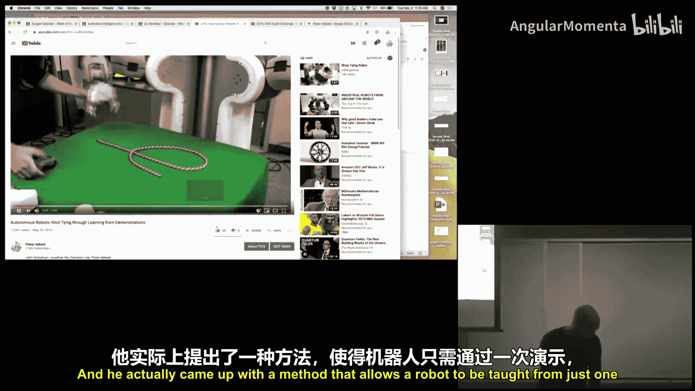
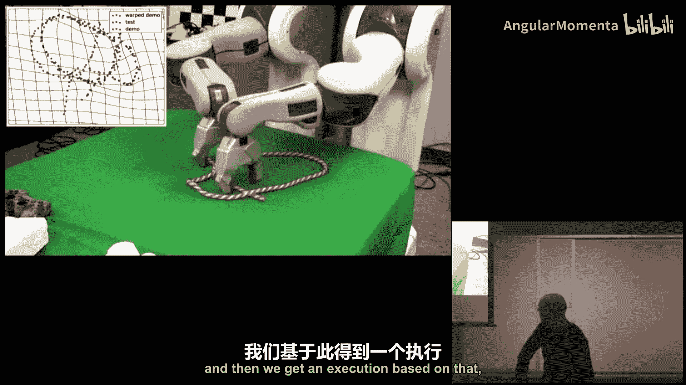
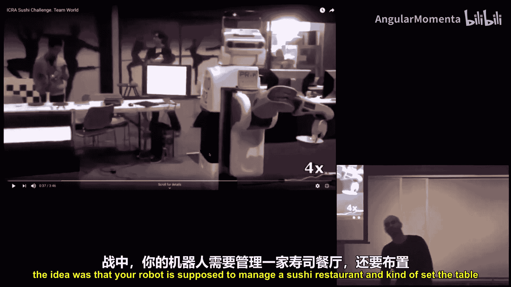
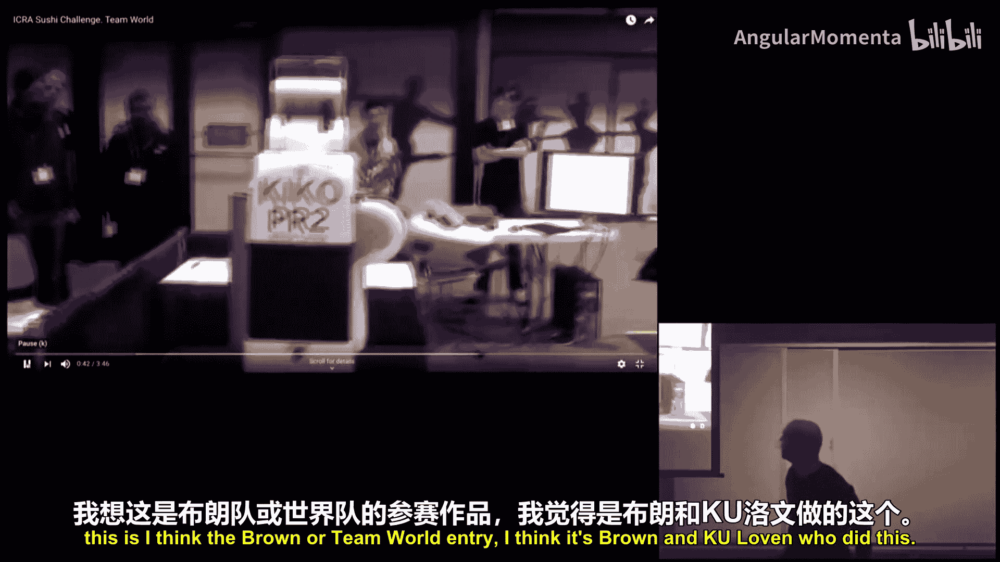
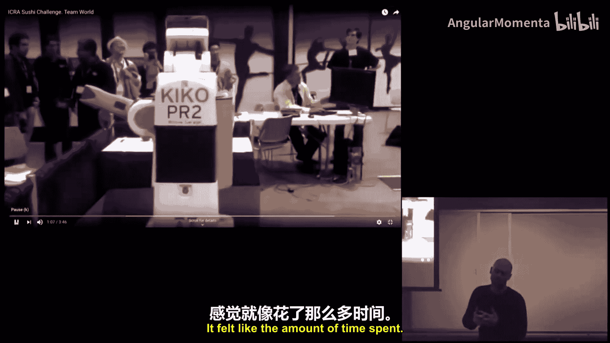
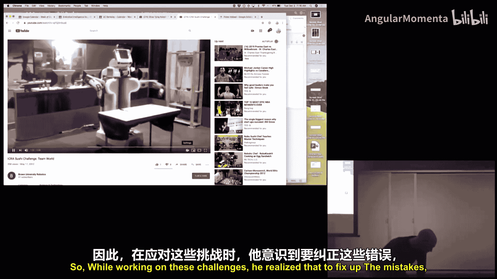
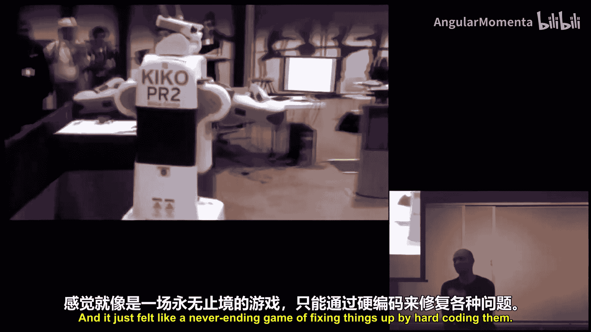
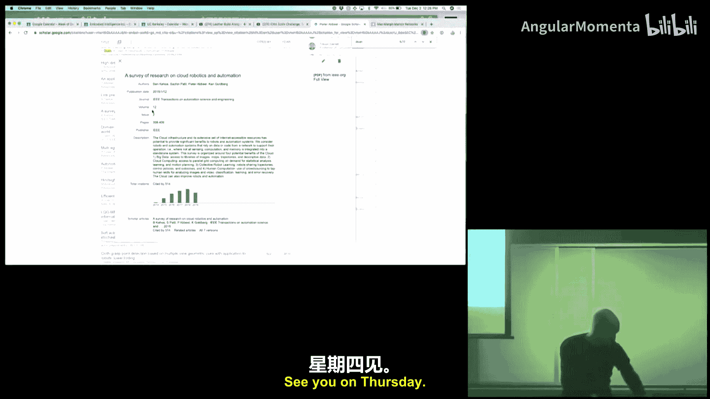

# 023：论文背后的诞生故事 🧠

在本节课中，我们将探讨几篇重要研究论文背后的故事。了解这些研究是如何从想法变为现实，以及研究者们如何选择问题、克服挑战，最终取得突破。这对于从事研究工作的同学尤其重要，因为成功的研究往往不仅取决于对数学的理解，更在于如何找到正确的问题并使其成果化。

---

## 信任域策略优化（TRPO）的诞生 📈

上一节我们概述了研究过程的重要性，本节中我们来看看一篇具体论文——信任域策略优化（Trust Region Policy Optimization, TRPO）是如何诞生的。

这篇论文发表于2015年，但其起源可追溯到2012-2013年。当时，博士生John Schulman正在研究如何让机器人从单次演示中学习新技能，例如打结。他开发了一种方法，可以让机器人根据演示，通过非刚性变换将动作适配到新的起始配置，从而学会打各种不同的绳结。

与此同时，在2012年的国际机器人学术会议（IROS）上，有一项名为“寿司挑战赛”的比赛。John在参与这项挑战时发现，为了让机器人可靠地完成任务，需要花费大量时间手动编写代码来修复错误，这感觉像一场永无止境的游戏。他意识到，要获得真正可靠的系统，需要一种能够自我改进的方法，这促使他重新审视强化学习。

当时，强化学习领域并不热门。在机器学习会议上，强化学习的研究往往被安排在偏僻的展厅。然而，2012年AlexNet在图像识别上的突破启发了John：也许强化学习过去效果不佳的原因不是算法本身，而是特征表示。如果使用深度神经网络作为表示，或许能取得突破。

John决定从基础问题开始验证。他花了近一年时间，专注于让强化学习在简单的钟摆和倒立摆问题上稳定工作。当时，DeepMind发布了DQN玩Atari游戏的结果，但复现非常困难。John在独立研究中也发现了类似使算法稳定的“技巧”。

他们团队注意到，即使是策略梯度方法也不稳定。因此，John决定开发一种极其稳定的策略梯度优化方法。他借鉴了轨迹优化中信任域的思想，确保对策略的更新步长不会太大，从而保证每次更新都是改进。这就是TRPO的核心理念。

**TRPO的核心公式**可以简化为在信任域约束下最大化期望奖励：
`maximize θ E[Σ γ^t r_t] subject to D_KL(π_old || π_new) ≤ δ`

TRPO成为了当时第一个稳定的深度强化学习算法。虽然它是同策略的，样本效率不如异策略的DQN，但其稳定性和可靠性使其广受欢迎。

当然，John也看到了TRPO的局限性，例如它需要进行二阶优化，计算复杂，且不易与Dropout等技术兼容。这促使他后续又开发了更易于实现的一阶算法——近端策略优化（PPO）。

---

## 逆强化学习（IRL）的起步 🔄

上一节我们看到了TRPO如何从实际问题中诞生，本节我们转向另一个方向：逆强化学习。

这个故事始于我在斯坦福大学的第一年。新教授Andrew Ng（吴恩达）提出，强化学习在实际应用中的一个主要瓶颈是奖励函数的设计。他认为，我们应该研究如何从专家演示中自动学习奖励函数。

当时，Andrew和Stuart Russell已经合著了一篇论文，阐述了这个问题，但尚未提出完整的算法。我们的目标就是填补这个空白，开发一个能从演示中学习奖励函数的完整算法。

这个想法非常直观：如果我们假设专家的演示是接近最优的，那么正确的奖励函数应该使得专家策略的性能优于其他随机策略。我们可以将其构建为一个优化问题来求解。

**逆强化学习的核心思想**是找到一个奖励函数 `R`，使得在该奖励函数下，专家策略 `π_E` 的表现优于任何其他策略 `π`：
`E_{π_E}[Σ R(s, a)] ≥ E_{π}[Σ R(s, a)] for all π`

我们提交了论文，但最初被拒稿了。审稿人似乎并不认为这是一个重要的问题，因为当时大家更关注如何改进强化学习算法本身，而不是其前置的奖励设计问题。我们修改了论文，更清晰地阐述了问题的重要性，最终论文得以发表。

这篇论文本身我们没有做太多后续工作，但后来出现了许多基于它的改进工作，如最大熵逆强化学习等。近年来，随着强化学习变得更实用，以及人们对“人类兼容AI”的关注，逆强化学习及相关领域的研究又重新活跃起来。

---

## 关系数据的概率模型与判别学习 📚

现在，让我们把目光转向一个不同的领域：关系数据的机器学习。

这个故事发生在21世纪初，互联网刚刚兴起。我的导师Daphne Koller预见到，机器学习必须从处理孤立的文档或图像，转向处理相互链接的关系数据。例如，要判断一个网页的主题，链接到它的其他网页上的文字（锚文本）可能包含关键信息。

当时，机器学习领域主要区分生成式模型（如朴素贝叶斯）和判别式模型（如逻辑回归）。我们的目标是开发一种能够对一组相互关联的输出变量进行联合推断的判别式学习方法，这后来被称为结构化预测。

**结构化预测模型**旨在同时预测一组相关的输出变量 `y_1, y_2, ..., y_n`，考虑它们之间的依赖关系，而不是独立预测。

我们发表了一篇关于关系数据的判别式概率模型的论文。然而，后续影响力更大的论文是我的师兄Ben Taskar等人提出的“最大边缘马尔可夫网络”。他们将支持向量机（SVM）的思想引入结构化预测，这在当时是非常前沿和非 trivial 的洞察。因为那时SVM非常流行，将任何方法“SVM化”都能吸引大量关注。这篇论文获得了很高的引用，并在NIPS会议上做了口头报告。

这个故事说明，把握时代的技术潮流（如当时的SVM），并将其应用于一个新兴的、必然重要的方向（如关系数据），能产生巨大的影响力。

---

## 信息最大化生成对抗网络（InfoGAN）的灵光一现 💡

有些论文的诞生过程非常迅速，InfoGAN就是一个例子。

当时，生成对抗网络（GAN）在生成逼真图像方面显示出潜力。但生成模型的初衷之一是学习有意义的、解耦的潜在表示。例如，在MNIST数字数据集中，我们可能希望潜在变量能分别控制数字的类别、笔画粗细、倾斜度等。

博士生Peter Chen在一次关于信息论的讲座中获得了灵感。他意识到，如果潜在编码 `c` 与生成图像 `G(z, c)` 之间有高的互信息，那么编码就包含了关于图像的关键信息。如果在此基础上，再使这些潜在变量之间尽可能相互独立，那么自然的、解耦的表示就应该会出现。

**InfoGAN的目标函数**在标准GAN的基础上增加了一项互信息项 `I(c; G(z, c))`：
`min_G max_D V(D, G) - λ I(c; G(z, c))`

Peter很快将这个清晰的想法付诸实践，在大概一两个月内就完成了工作。实验结果令人惊喜，潜在变量确实自动学习到了可解释的、解耦的特征。这篇论文因其想法的简洁和有效，很快被邀请在当时的深度学习研讨会上做口头报告。

这说明，当研究者拥有一个正确且时机恰当的想法时，研究工作可以进展得非常快。

---

## 深度视觉运动策略的端到端训练 🤖

本节我们来看一篇将深度学习与机器人控制紧密结合的论文。

Sergey Levine在斯坦福大学攻读博士期间，开发了“引导策略搜索”（Guided Policy Search, GPS）方法。其核心思想是：先在状态空间进行轨迹优化，得到一系列局部最优控制器，然后训练一个神经网络策略来模仿这些控制器。

Sergey来到伯克利做博士后后，希望将这套方法应用到真实机器人上，并且让机器人能够基于视觉输入进行控制。他与博士生Chelsea Finn合作，提出了一个关键见解：可以在训练时在状态空间进行轨迹优化（这需要获取真实状态信息），但让学习的神经网络策略只接收图像输入。这样，在测试时，机器人就能仅凭视觉进行控制。

**方法流程**：
1.  在状态空间收集数据并优化轨迹（需要状态信息）。
2.  使用图像和对应的优化动作作为训练数据，训练一个视觉策略网络 `π_θ(o_t)`，其中 `o_t` 是图像观测。
3.  部署时，策略网络仅根据图像做出决策。

这是首次成功在真实机器人上使用深度强化学习实现基于视觉的多种任务控制。这项工作源于Sergey整个博士期间工作的自然演进：从仿真到真实机器人，再到引入视觉感知。

---

## 深度强化学习的基准测试 🏁

随着深度强化学习算法增多，社区缺乏一个清晰、公平的比较基准。

博士生Rocky Duan意识到了这个问题。在2015-2016年，他决定对当时主流的深度强化学习算法进行一次全面的基准测试。他定义了一套标准的连续控制任务（后来成为OpenAI Gym中MuJoCo环境的基础），并提供了这些算法的参考实现（即`rllab`库）。

**基准测试的意义**在于提供了：
*   **标准化的环境**：让不同论文的结果可以公平比较。
*   **可复现的代码**：当时许多机构（如DeepMind）不公开代码，`rllab`提供了可靠的实现。

这项工作为社区带来了急需的清晰度，并直接推动了OpenAI Gym的诞生。它说明，有时最有价值的研究不是提出新算法，而是为快速发展的领域建立秩序和标准。

---

## 从分层强化学习到元强化学习（RL²）的转变 🔄

我们曾认为，解决长视野任务的关键是分层强化学习（HRL）。

Rocky Duan和John Schulman等人花了大量时间研究HRL。但在尝试了六个月后，他们发现，即使算法学习到了一些层次结构，也并没有显著提高学习速度。他们意识到，我们真正关心的最终指标是“学习得更快”，至于内部是否形成层次结构，那是智能体自己的事。

于是，他们转变了方向：与其设计复杂的层次结构，不如直接训练一个智能体，使其具备快速学习新任务的能力。他们提出了**RL²**（通过快速循环网络进行强化学习）框架。其核心是训练一个循环神经网络（RNN）作为智能体的“大脑”，这个RNN接收状态、动作、奖励和回合结束信号，并输出下一个动作。通过在与一系列相关任务交互的元训练过程中进行端到端训练，这个RNN学会了在新任务中快速适应。

**RL²的更新过程**涉及两个循环：
*   **内循环**：在单个任务内，RNN根据历史交互输出动作，其内部状态隐含地进行了适应。
*   **外循环**：跨多个任务，更新RNN的参数，使其内循环适应过程更有效。

与此同时，Chelsea Finn从另一个角度思考快速学习问题，提出了**模型无关元学习（MAML）**。MAML的核心思想是训练一个模型的初始参数，使得在面对新任务时，只需少量梯度更新步骤就能达到良好性能。

**MAML的元优化目标**：
`min_θ Σ_{T_i ~ p(T)} L_{T_i}(f_{θ_i'})`，其中 `θ_i' = θ - α ∇_θ L_{T_i}(f_θ)`

MAML的美妙之处在于其“模型无关性”，它既可应用于监督学习（小样本学习），也可应用于强化学习，因此影响力更为广泛。

---

## 机器人云计算：趋势的总结与展望 ☁️

最后，我们看一篇不同类型的论文——关于趋势的综述。

在2014-2015年，计算正在向云端迁移，但机器人领域仍主要依赖本地计算。Ken Goldberg教授认为，机器人计算的云端化是不可避免的趋势。将计算、数据存储和学习集中到云端，可以实现跨机器人的知识共享和更高效的训练。

这篇论文的意义在于，它观察到了分散在各个研究中的共同模式，并将其清晰阐述为一个明确的趋势——“机器人云计算”。这种将新兴趋势进行总结和展望的工作，能够帮助整个领域看清方向，推动下一波研究的开展。

---

## 总结与下节预告 📝

本节课中，我们一起回顾了多篇重要论文的诞生故事。我们看到了研究如何从实际问题中萌芽（如TRPO），如何把握必然趋势（如关系学习、云计算），如何经历方向的转变（从HRL到RL²），以及有时如何依靠清晰的灵感快速取得突破（如InfoGAN）。这些故事强调了选择正确问题、进行扎实的基础验证、保持开放思维并及时调整方向的重要性。

在下一节（也是最后一节）课程中，我将以我在斯坦福大学的自动驾驶直升机项目为例，更深入地分享一个完整的研究历程，包括其中走过的弯路和最终的成功。