# 2：自回归模型 🧠

在本节课中，我们将学习自回归模型的基础知识。自回归模型是生成模型的一种重要类型，广泛应用于文本、图像和语音合成等领域。我们将从一维分布建模开始，逐步扩展到高维数据，并深入探讨当前最流行的因果掩码神经模型。课程的后半部分将介绍一些最新的研究进展。

---

## 概述

生成模型的目标是学习数据分布，从而能够生成与训练数据相似的新样本。自回归模型通过将高维联合概率分布分解为一系列条件概率的乘积来实现这一目标。在本节中，我们将首先理解如何对简单的一维分布进行建模。

---

## 一维分布建模 📊

上一节我们介绍了生成模型的基本概念。本节中，我们来看看如何对最简单的一维离散分布进行建模。

假设我们有一个数据集，样本是0到100之间的整数。数据分布显示，数值在30和80附近出现的概率较高。我们可以使用直方图来建模这个分布。

**直方图方法**：
直方图通过计算每个数值在数据集中出现的频率来估计其概率。对于数值 `i`，其概率 `P(i)` 近似为：
```
P(i) ≈ (数据集中 i 出现的次数) / (数据点总数)
```
这是一个非常简单的非参数化方法。

**采样**：
要从这个分布中采样，我们可以构建累积分布函数（CDF）。首先在0到1之间均匀采样一个随机数 `u`，然后找到最小的 `i`，使得 `CDF(i) >= u`。这个 `i` 就是我们的样本。

**局限性**：
直方图方法的主要问题是泛化能力差。每个数值的概率是独立估计的，知道数值40的概率并不能告诉我们关于数值41的任何信息。当可能的结果数量很多而数据有限时，许多“箱子”的概率可能被错误地估计为零。

---

## 参数化模型 🔧

为了解决直方图泛化能力差的问题，我们可以引入参数化模型。其核心思想是：相似的输入应有相似的概率。

我们可以用一条平滑的曲线（例如，由逻辑斯蒂分布的混合组成）来拟合数据，而不是独立的直方图箱子。这个参数化模型 `P_θ(x)` 由参数 `θ` 定义。

**目标**：
我们的目标是学习参数 `θ`，使得模型分布 `P_θ(x)` 尽可能接近真实的数据分布 `P_data(x)`。我们通过最小化两者之间的差异来实现。

**最大似然估计**：
我们使用最大似然估计作为训练准则。具体来说，我们最小化训练数据点的负对数似然（Negative Log-Likelihood, NLL）：
```
L(θ) = - Σ_{x in data} log P_θ(x)
```
最小化NLL等价于最小化经验数据分布与模型分布之间的KL散度。

**优化**：
我们使用随机梯度下降（SGD）或其变体（如Adam）来优化参数 `θ`。通过小批量数据计算梯度并更新参数，使得训练能够高效处理大规模数据集。

**模型约束**：
我们选择的参数化模型 `P_θ(x)` 必须满足概率公理，即对所有可能的 `x`，`Σ_x P_θ(x) = 1`。在自回归模型中，这个约束通过链式法则的结构自动满足。

---

## 扩展到高维数据 🚀

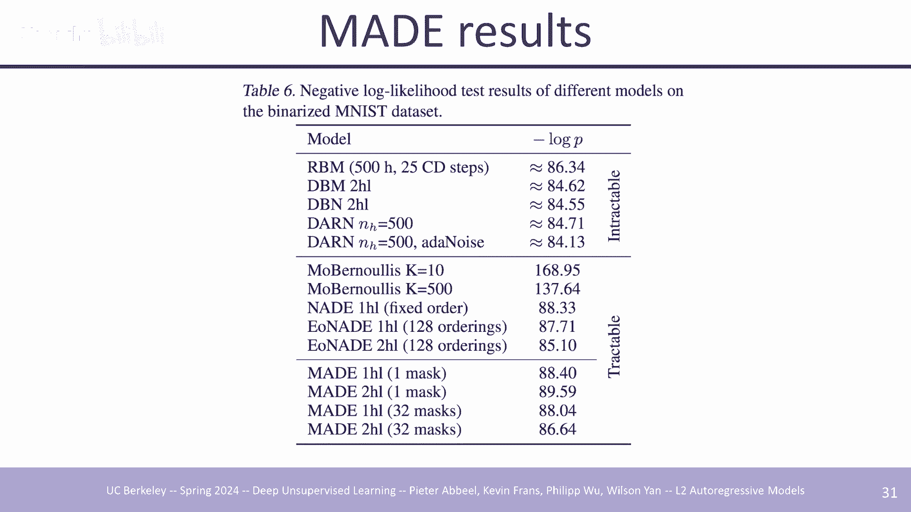

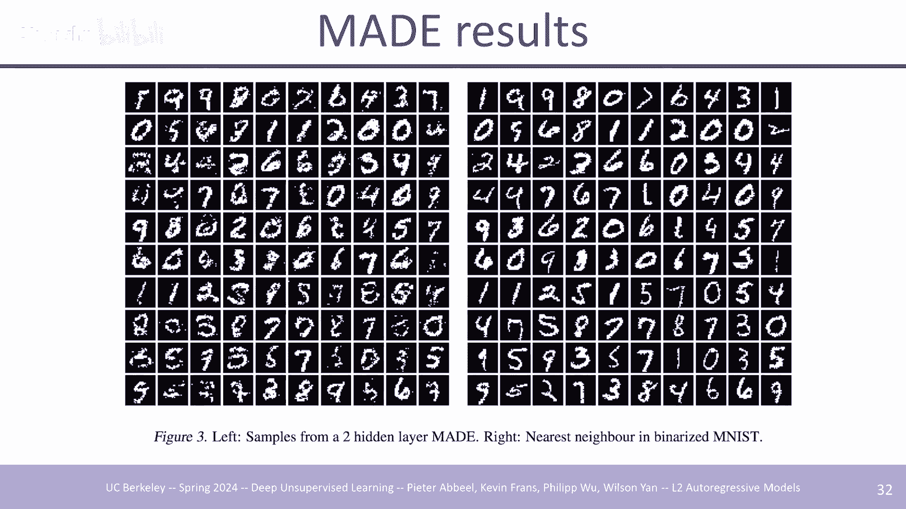

我们已经学会如何表示一维分布。然而，现实世界的数据（如图像、文本）通常是高维的。直接将高维空间“展平”为一维分布是不可行的，因为可能状态的数量是天文数字。

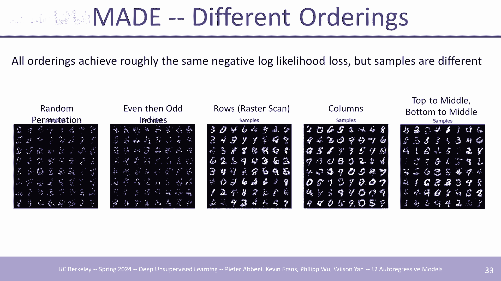

**自回归分解**：
自回归模型通过对高维分布进行因式分解来解决这个问题。对于一个 `D` 维数据点 `x = (x1, x2, ..., xD)`，我们利用概率的链式法则：
```
P(x) = P(x1) * P(x2 | x1) * P(x3 | x1, x2) * ... * P(xD | x1, x2, ..., x_{D-1})
```
这样，我们将建模高维联合分布的任务，转化为建模一系列以之前所有变量为条件的一维条件分布。

**关键点**：
*   这种分解对任何分布和任何变量顺序都成立。
*   挑战在于如何有效地参数化和学习这些条件分布 `P(xi | x1, ..., x_{i-1})`，因为条件部分可能非常复杂。

---

## 解决方案：因果掩码神经模型 🎭

为了高效地建模高维自回归分布，我们引入了因果掩码神经模型。这是当今最流行且成功的自回归模型实现方式。

**核心思想**：
使用一个神经网络（如MLP、CNN或Transformer）来参数化所有条件分布，并在不同时间步之间共享参数。为了满足自回归的因果性（即预测 `xi` 时不能看到 `xi` 本身或未来的信息），我们在神经网络中应用**因果掩码**。

**以1D卷积为例（WaveNet）**：
在WaveNet中，使用扩张因果卷积来建模音频序列。每个输出位置仅依赖于当前及过去的输入位置，这是通过将卷积核中“未来”位置的权重设为零（掩码）来实现的。参数在序列上共享，模型通过输入位置编码来感知绝对或相对位置。

**以2D卷积为例（PixelCNN）**：
对于图像，可以使用2D因果卷积。以光栅扫描顺序（左上到右下）处理像素。卷积核被掩码，使得中心像素及其右侧/下方的像素权重为零，确保每个像素的预测仅依赖于已生成的左上部分像素。

**优势**：
*   **表达力强**：神经网络可以捕捉复杂的条件依赖。
*   **训练高效**：对于整个序列，所有条件分布的计算可以并行进行（一次前向传播）。
*   **参数共享**：提高了统计效率和模型泛化能力。

**采样**：
采样是串行的。我们必须先生成 `x1`，然后将其输入网络以得到 `P(x2|x1)` 的分布并采样 `x2`，再将 `(x1, x2)` 输入网络得到 `P(x3|x1,x2)`，依此类推。这导致了较慢的采样速度。

---

## 基于Transformer的自回归模型 ⚡

Transformer架构，特别是其自注意力机制，为自回归建模带来了革命性的进步。

**自注意力**：
自注意力允许序列中的每个位置（或标记）与序列中所有其他位置进行交互，计算一个加权和作为输出。公式如下：
```
Attention(Q, K, V) = softmax( (Q K^T) / sqrt(d_k) ) V
```
其中 `Q`（查询）、`K`（键）、`V`（值）均由输入序列通过线性变换得到。

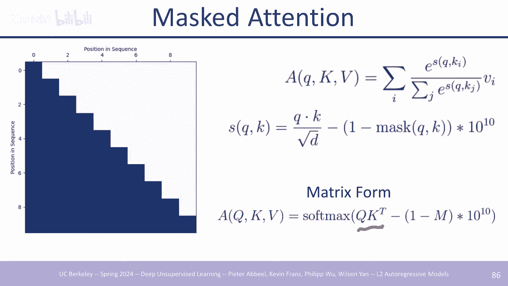


**因果掩码在注意力中的应用**：
为了使Transformer用于自回归建模，我们在注意力权重矩阵上应用一个下三角掩码。具体做法是将矩阵中 `i > j`（即查询位置 `i` 关注未来位置 `j`）的位置在softmax之前设置为一个极大的负数（如 `-1e9`），这样其对应的注意力权重就变为零。
```
MaskedAttention(Q, K, V) = softmax( (Q K^T + M) / sqrt(d_k) ) V
```
其中 `M` 是一个下三角矩阵，`M[i,j] = 0 if i >= j else -inf`。

**Transformer架构**：
标准的自回归Transformer（解码器）由堆叠的Transformer块组成。每个块通常包含：
1.  **多头因果自注意力层**：建模标记间的依赖关系。
2.  **前馈神经网络（MLP）层**：对每个位置的表示进行非线性变换。
3.  **残差连接和层归一化**：用于稳定和加速训练。

**优势与挑战**：
*   **无限感受野**：理论上，任何位置都可以直接关注序列中任何更早的位置，克服了卷积模型的有限感受野限制。
*   **强大的表现力**：注意力机制非常灵活，能学习复杂的依赖模式。
*   **计算复杂度**：注意力机制的计算和内存复杂度是序列长度 `L` 的二次方 `O(L^2)`，这限制了其处理超长序列的能力。为此，发展出了如稀疏注意力、线性注意力等改进方案。

---

## 标记化：处理图像与视频 🖼️🎬

对于文本，我们可以使用BPE等子词标记化方法。但对于图像和视频等连续信号，我们需要将其离散化，以便用自回归Transformer建模。

**简单方法：原始像素**：
最直接的方法是将每个像素的RGB值（0-255）视为一个标记。然而，对于一张256x256的图像，这将产生约20万个标记，导致序列过长，计算成本极高。

**先进方法：学习离散表示**：
更有效的方法是先训练一个**离散自编码器**（如VQ-VAE, VQ-GAN）。
1.  **编码器**：将高分辨率图像 `x` 下采样为低维的离散潜在代码 `z`。
2.  **解码器**：从 `z` 重建图像 `x'`。
3.  **训练目标**：最小化重建误差 `||x - x'||`，并使用矢量量化使 `z` 离散。
训练好自编码器后，我们就在离散的潜在空间 `z` 上训练自回归Transformer（例如，对 `z` 的序列进行建模）。生成时，先用Transformer生成 `z`，再用解码器将其转换回图像 `x`。

**好处**：
*   序列长度大幅缩短（例如，从196K像素减少到256个潜在代码）。
*   自回归Transformer只需在抽象、信息密集的潜在空间中进行建模，训练和采样效率更高。
*   这种方法已成功扩展到视频、音频等多模态数据。

---

## 高效推理：键值缓存 💾

自回归模型在推理（采样）时是串行的，这可能导致速度缓慢。一个关键的优化技术是**键值缓存（KV Cache）**。

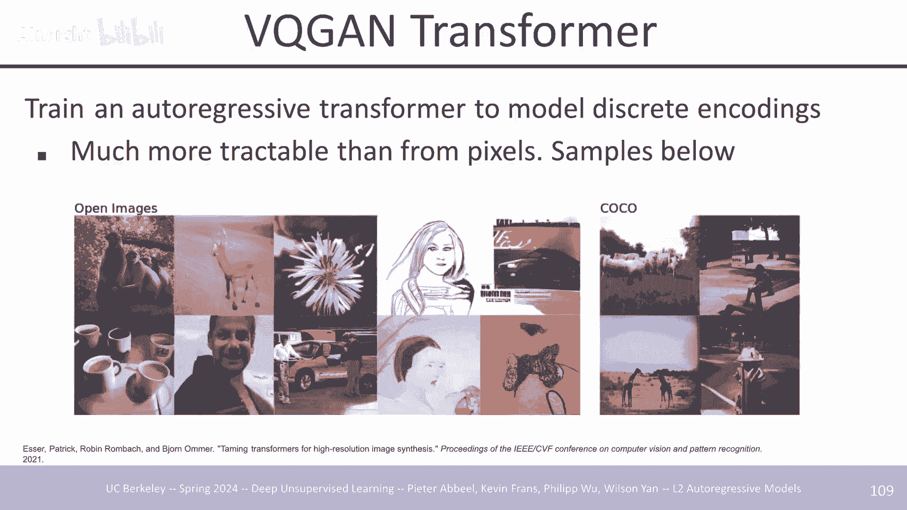

**问题**：
在生成第 `t` 个标记时，Transformer需要计算所有前 `t-1` 个标记的键（K）和值（V）向量，用于注意力计算。如果每次都重新计算，复杂度为 `O(t^2)`。

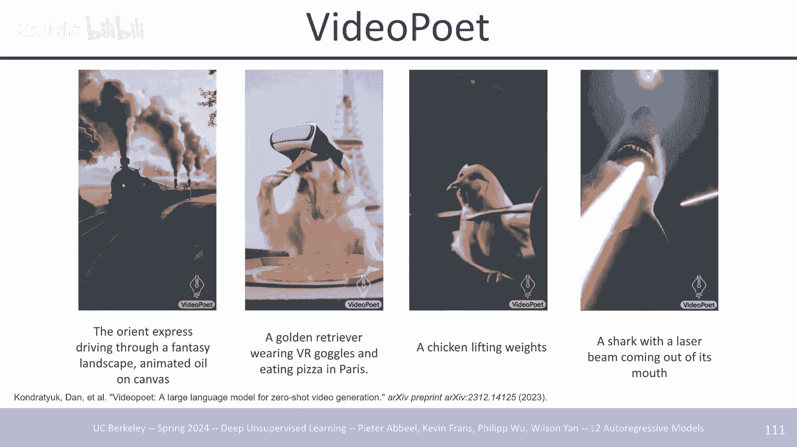

**解决方案**：
缓存之前所有时间步为每个注意力层计算的 `K` 和 `V` 张量。
*   生成新标记时，只需计算当前新标记的 `Q`、`K_new`、`V_new`。
*   将 `K_new` 和 `V_new` 追加到缓存中。
*   使用完整的缓存（包含所有历史 `K`, `V`）和当前 `Q` 计算注意力。
这样，每个生成步骤的计算复杂度从 `O(t^2)` 降低到了 `O(t)`（主要是矩阵乘法的成本）。

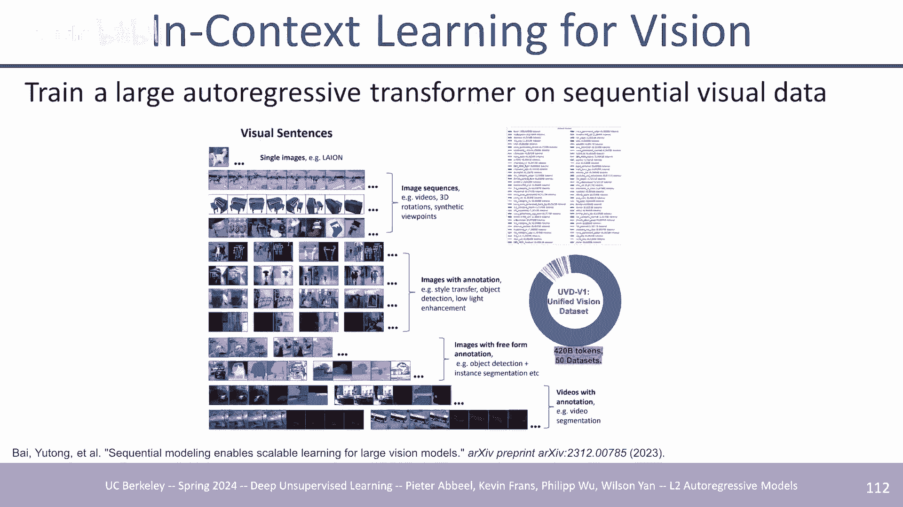

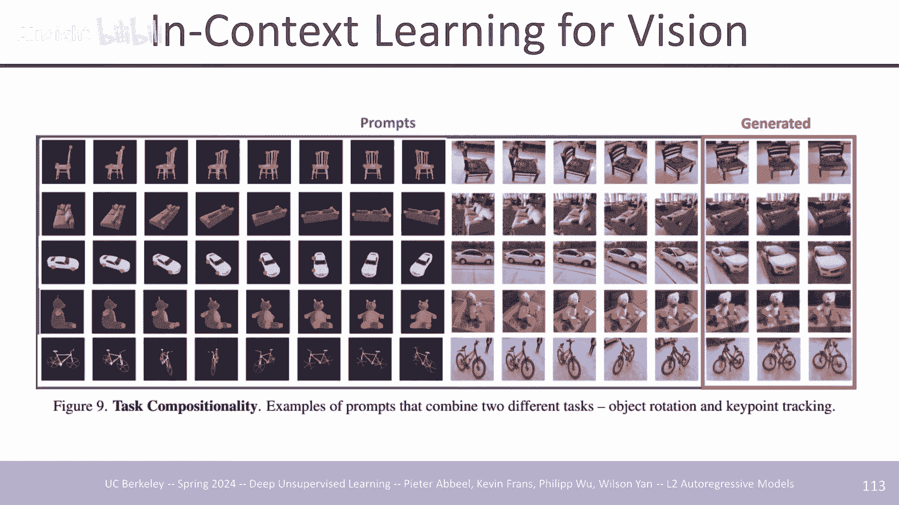

**权衡**：
KV缓存需要额外的GPU内存来存储所有中间状态，这是一种用空间换时间的策略。

---

## 其他架构与前沿进展 🌟

除了标准的Transformer，还有一些相关的架构和新兴研究方向。

**编码器-解码器架构**：
原始的Transformer论文提出了编码器-解码器架构，适用于有明确输入-输出对的任务（如机器翻译、图像描述）。
*   **编码器**：双向处理输入序列，生成上下文表示。
*   **解码器**：自回归地生成输出序列，在每一步通过**交叉注意力**机制关注编码器的输出。
虽然像GPT这样的纯解码器模型在通用语言建模上占主导，但编码器-解码器模型（如T5）在某些任务（如文本到图像生成中的文本编码）上仍有优势。

**状态空间模型（SSM）的复兴**：
为了克服Transformer的二次方复杂度，研究者重新审视了循环神经网络（RNN）。新型的**状态空间模型**（如Mamba）在线性RNN的基础上进行改进，实现了高效的并行训练和线性时间的推理，同时在长序列建模任务上展现了与Transformer相媲美的性能。

**分层自回归模型**：
对于生成高分辨率图像，可以分层进行：
1.  先用一个自回归模型生成低分辨率图像或高级语义表示。
2.  再用另一个自回归模型（或超分辨率网络），以低分辨率结果为条件，生成高分辨率细节。
这种方法将生成任务分解，降低了每一步的建模难度。

---

## 总结

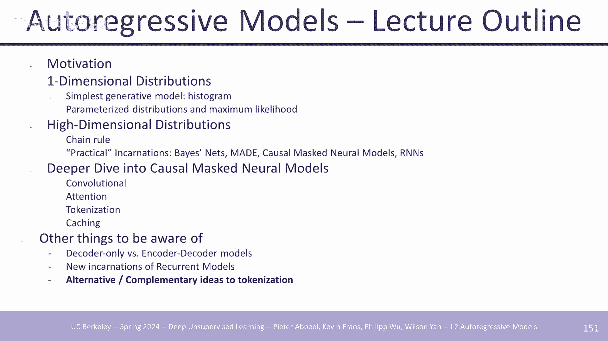

本节课我们一起深入学习了自回归模型。
*   我们从**一维分布**的建模出发，理解了直方图与参数化模型的区别。
*   通过**链式法则**，我们学会了如何将高维联合分布分解为一系列条件分布。
*   我们重点探讨了**因果掩码神经模型**，包括基于卷积的WaveNet、PixelCNN，以及基于**Transformer**的现代架构，理解了其通过掩码实现自回归性的原理。
*   我们了解了如何通过**离散自编码器**对图像、视频进行标记化，以便用Transformer处理。
*   我们介绍了**键值缓存**这一关键推理优化技术。
*   最后，我们简要浏览了**编码器-解码器架构**、**状态空间模型**等前沿进展。

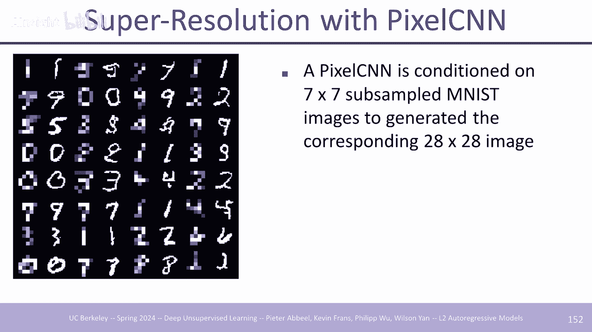

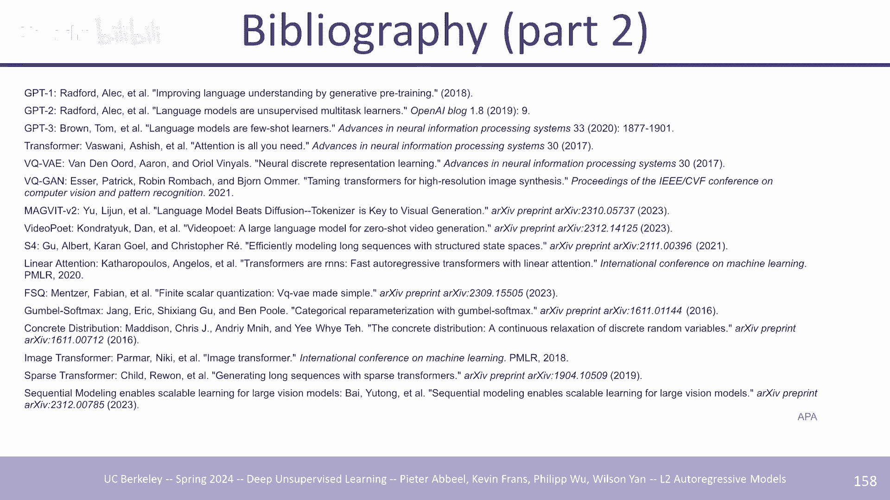

自回归模型以其理论上的严谨性（显式建模概率分布）和强大的实践性能，在生成式人工智能中扮演着核心角色，是理解当前大语言模型和多种生成模型的基础。