# 4：隐性变量模型和变分自动编码器 🧠

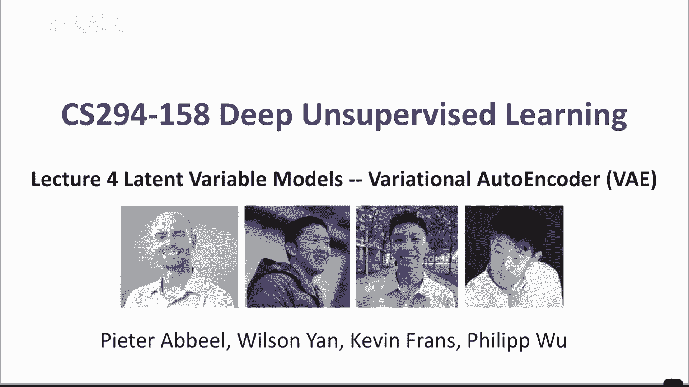

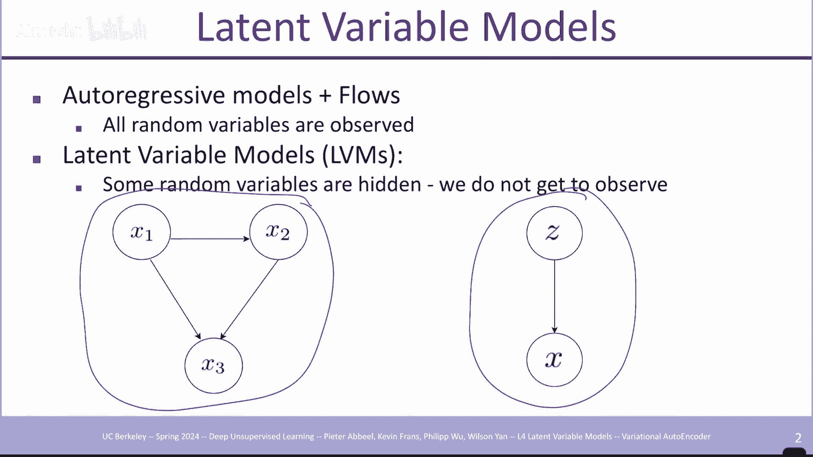

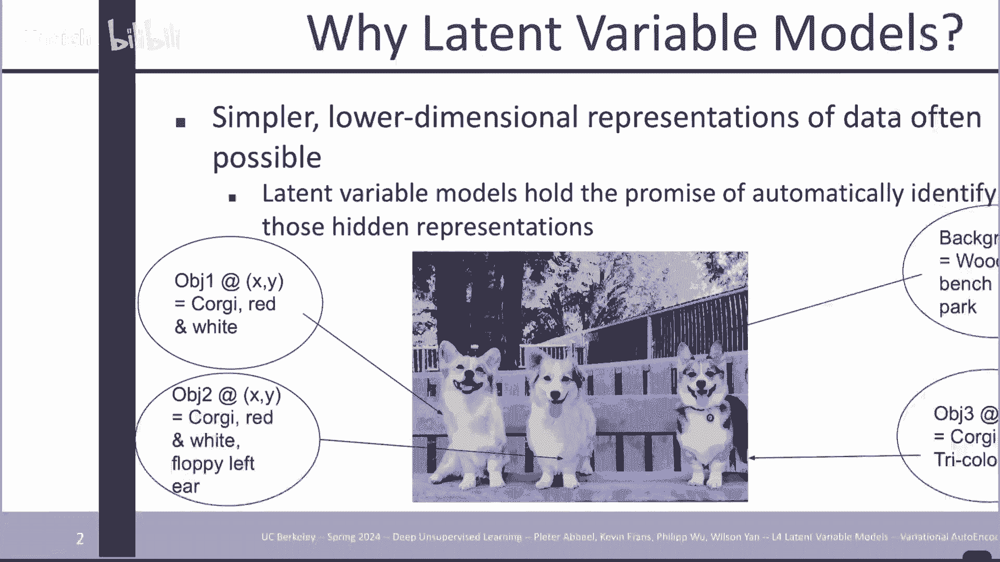

在本节课中，我们将要学习隐性变量模型及其核心实现——变分自动编码器。我们将从基本概念出发，逐步理解其数学原理、训练方法以及各种变体，最终掌握如何利用这些模型进行数据生成和表示学习。

## 概述

我们已经研究过自回归模型和流模型，它们直接对观测变量 `X` 的分布进行建模。在隐性变量模型中，情况有所不同。我们假设存在一个低维度的潜在变量 `Z`，它编码了 `X` 中体现的核心信息。捕获这个更紧凑的表示 `Z`，有助于数据压缩、插值或在之上构建分类器。

自回归模型采样速度慢，因为需要顺序生成所有像素。而如果数据在高级语义信息（如图像内容描述）上条件独立，那么通过潜在变量 `Z` 生成整个 `X` 可以更快。

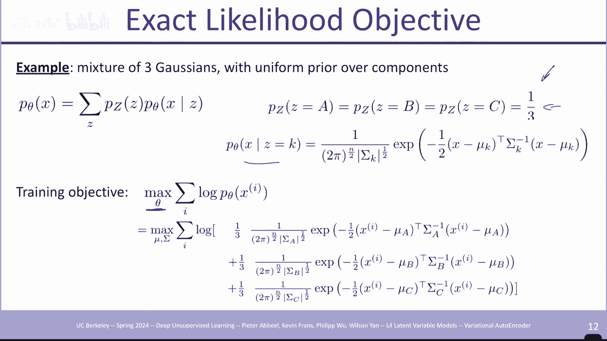

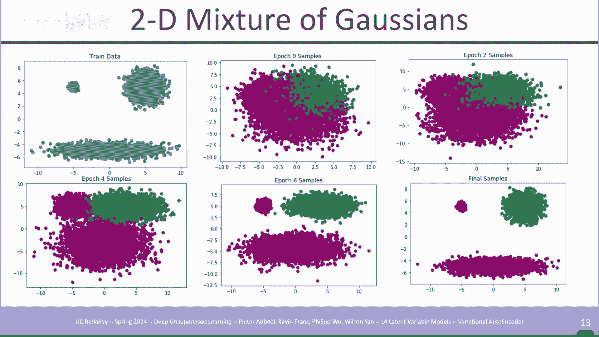

## 隐性变量模型基础

上一节我们介绍了模型的动机，本节中我们来看看其基本形式。

在最简单的情况下，`Z` 是一个单变量（例如，抛硬币的结果），我们根据 `Z` 的值来生成 `X`。`Z` 也可以是向量值，编码场景中的多种信息（如是否有车、是否有狗）。模型的使用方式是：先从先验分布 `p(z)` 中采样得到 `z`，然后从条件分布 `p_θ(x|z)` 中采样生成 `x`。

为了训练模型，我们需要最大化观测数据的对数似然。对于单个数据点 `x_i`，其概率是所有可能 `z` 导致该 `x_i` 的概率之和：
`p_θ(x_i) = Σ_z p(z) * p_θ(x_i|z)`

这里的求和操作使得我们无法像自回归模型那样将对数似然简单地分解开，这带来了优化上的挑战。

## 训练隐性变量模型

上一节我们介绍了模型的基本形式，本节中我们来看看如何训练它们。我们将探讨两种场景：精确可处理的情况和需要近似的情况。

### 场景一：精确可处理（`Z` 取值少）

当潜在变量 `Z` 只能取少量值时，我们可以直接枚举所有可能的 `Z` 来计算求和项。例如，`Z` 取三个值，`X` 是根据 `Z` 决定的多元高斯分布，这本质上就是一个高斯混合模型。我们可以直接使用梯度下降优化模型参数（如各高斯的均值和协方差）。

### 场景二：需要近似（`Z` 取值多或连续）

当 `Z` 取值很多或连续时，精确求和或积分难以计算。此时，我们可以利用 `Z` 的分布，将对 `Z` 的期望用采样来近似。然而，如果直接从先验 `p(z)` 中采样，大多数样本对当前数据点 `x_i` 的似然贡献几乎为零，计算效率低下。

为了解决这个问题，我们引入重要性采样。我们从一个新的提议分布 `q(z)` 中采样，并引入一个校正因子 `p(z)/q(z)` 来获得无偏估计。理想情况下，`q(z)` 应该集中在那些对当前 `x_i` 有高似然的 `z` 区域，即后验分布 `p(z|x_i)`。

## 变分推断与变分下界

上一节我们提到了需要逼近后验分布 `p(z|x)`，本节中我们来看看如何通过变分推断来实现。

我们无法直接使用真实后验，因此引入一个参数化的分布 `q_φ(z|x)`（例如高斯分布），并尝试使其尽可能接近真实后验。衡量两个分布差异的常用指标是 KL 散度。我们的目标是最小化 `q_φ(z|x)` 和 `p_θ(z|x)` 之间的 KL 散度。

经过推导，我们可以得到数据对数似然的一个下界，称为证据下界：
`log p_θ(x) ≥ E_{z~q_φ(z|x)}[log p_θ(x|z)] - KL(q_φ(z|x) || p(z))`

这个下界由两部分组成：
1.  **重构项**：期望 `z` 能够很好地重建 `x`。
2.  **正则化项**：KL 散度项，迫使 `q_φ(z|x)` 接近我们设定的简单先验 `p(z)`（如标准高斯分布）。

通过最大化这个下界，我们同时优化了生成模型参数 `θ` 和推断网络参数 `φ`。

## 变分自动编码器

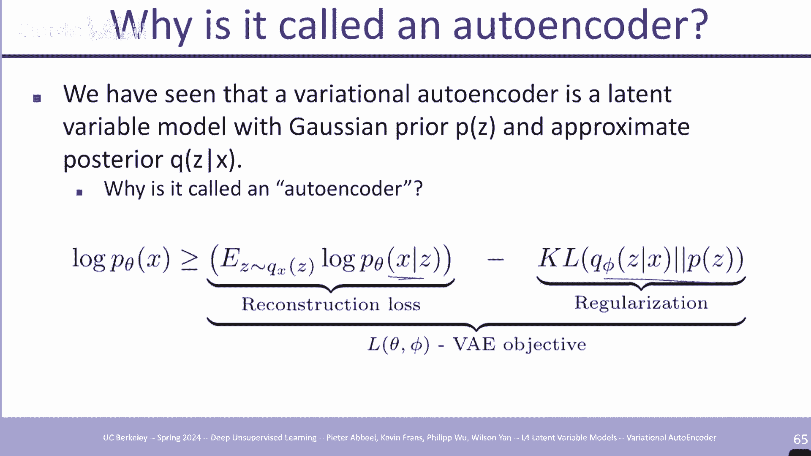

上一节我们推导出了变分下界，本节中我们来看看其具体实现——变分自动编码器。

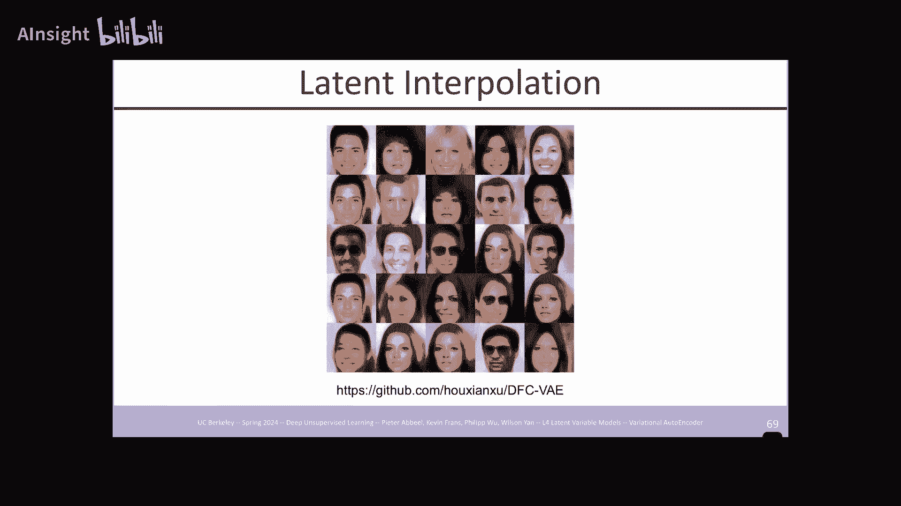

VAE 的结构直观地对应了下界的两部分：
*   **编码器**：对应 `q_φ(z|x)`。它是一个神经网络，输入 `x`，输出潜在变量 `z` 的分布参数（如均值和方差）。
*   **解码器**：对应 `p_θ(x|z)`。它是一个神经网络，输入采样得到的 `z`，试图重建出 `x`。

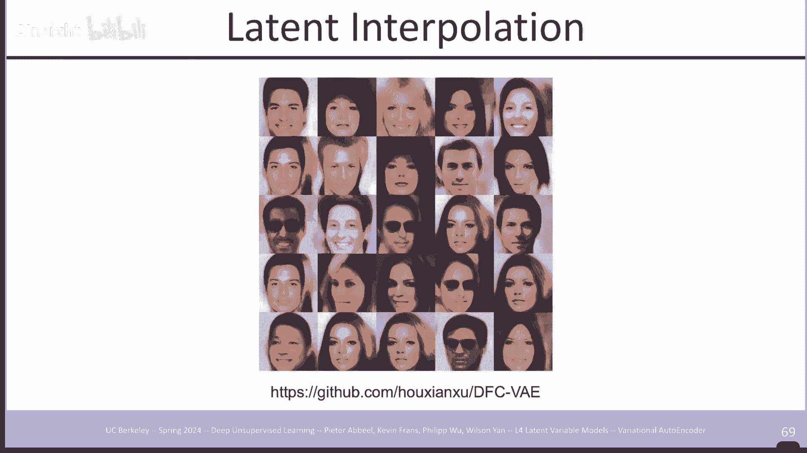

训练时，我们通过编码器得到 `z` 的分布，从中采样一个 `z`（使用重参数化技巧以使梯度可回传），然后用解码器重建 `x`，并计算重构损失和 KL 散度损失。

以下是 VAE 训练的核心步骤：
1.  编码器将输入 `x` 映射为潜在分布的参数（均值 `μ` 和方差 `σ^2`）。
2.  通过重参数化技巧采样：`z = μ + ε * σ`，其中 `ε` 来自标准正态分布。
3.  解码器将 `z` 映射回数据空间，得到重建的 `x'`。
4.  计算损失：`损失 = 重构损失(x, x') + β * KL(N(μ, σ^2) || N(0, I))`。其中 `β` 是权衡两项的超参数。

## VAE 的变体与扩展

上一节我们介绍了标准 VAE，本节中我们来看看一些重要的变体和改进。

### 1. 先验分布的改进
标准 VAE 使用各向同性的高斯先验，这限制了潜在空间的表达能力。改进方法包括：
*   **分层 VAE**：让先验 `p(z)` 本身也是一个学习得到的分布（如自回归模型），从而捕获 `z` 各维度间的依赖关系。
*   **矢量量化 VAE**：使用离散的潜在空间。编码器输出映射到一个离散的码本中最近的向量。这能产生更清晰的潜在表示，并自然地对信息容量进行约束。

### 2. β-VAE
通过引入超参数 `β` 来调整正则化项的权重。增大 `β` 会鼓励学习到更解耦、更具解释性的潜在因子（如物体的颜色、大小等），但可能会牺牲一些重建质量。

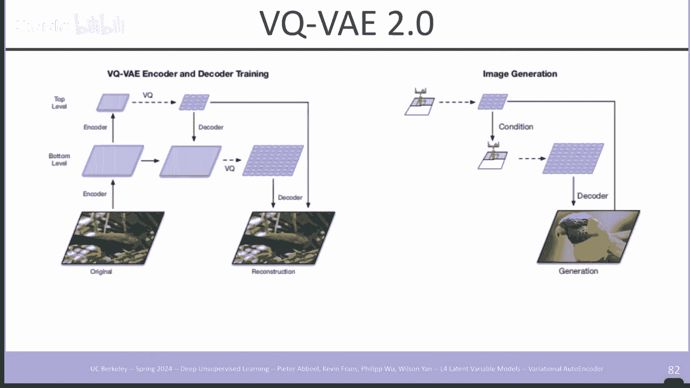

### 3. 重要性加权自编码器
通过从 `q_φ(z|x)` 中采集多个样本 `z` 来计算重构项，可以得到一个更紧致的似然下界，通常能提升生成样本的质量。

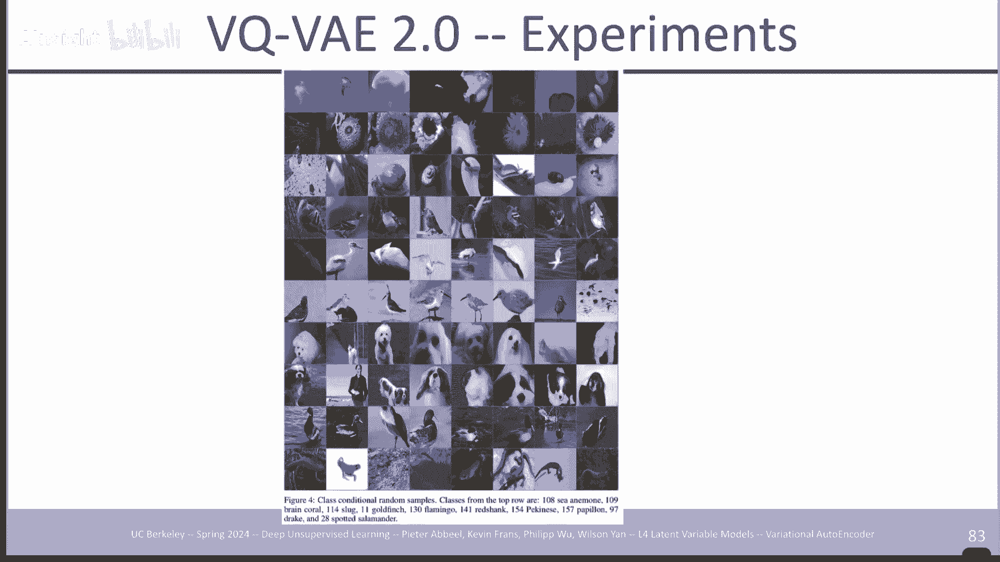

## VAE 的应用与总结

在本节课中，我们一起学习了隐性变量模型和变分自动编码器。

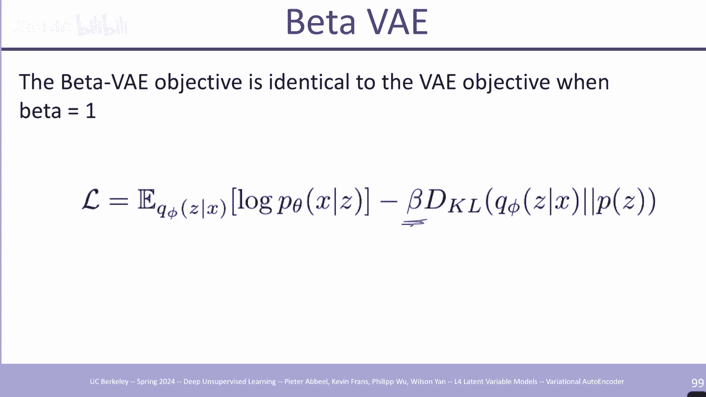

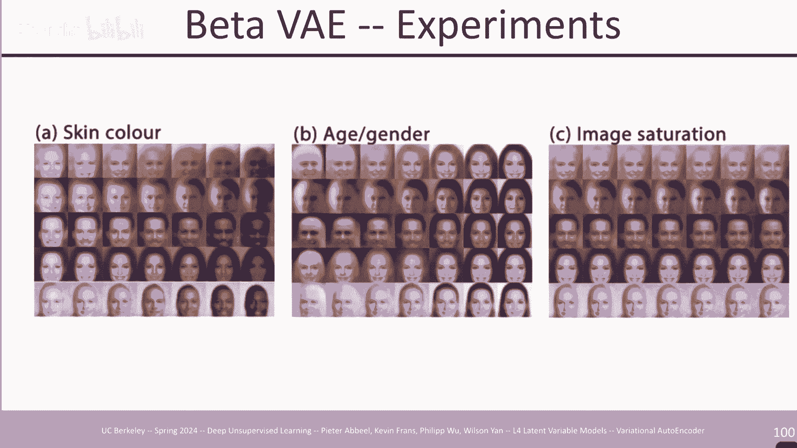

VAE 主要有两大应用方向：
1.  **生成模型**：训练完成后，可以从先验分布 `p(z)` 中采样 `z`，然后通过解码器生成新的数据样本 `x`。
2.  **表示学习**：编码器学习到的潜在变量 `z` 可以作为数据 `x` 的一个低维、有意义的表示，用于下游任务（如分类、检索）。

VAE 的优点在于它提供了一个稳固的概率框架和易于优化的下界，并且其潜在空间通常具有较好的连续性，便于插值操作。虽然其在纯粹的图像生成质量上可能略逊于一些最新模型，但 VAE 及其变体（尤其是 VQ-VAE）作为强大的表示学习工具和生成流程中的关键组件（例如在 Stable Diffusion 中），至今仍在许多最先进的生成模型中发挥着重要作用。

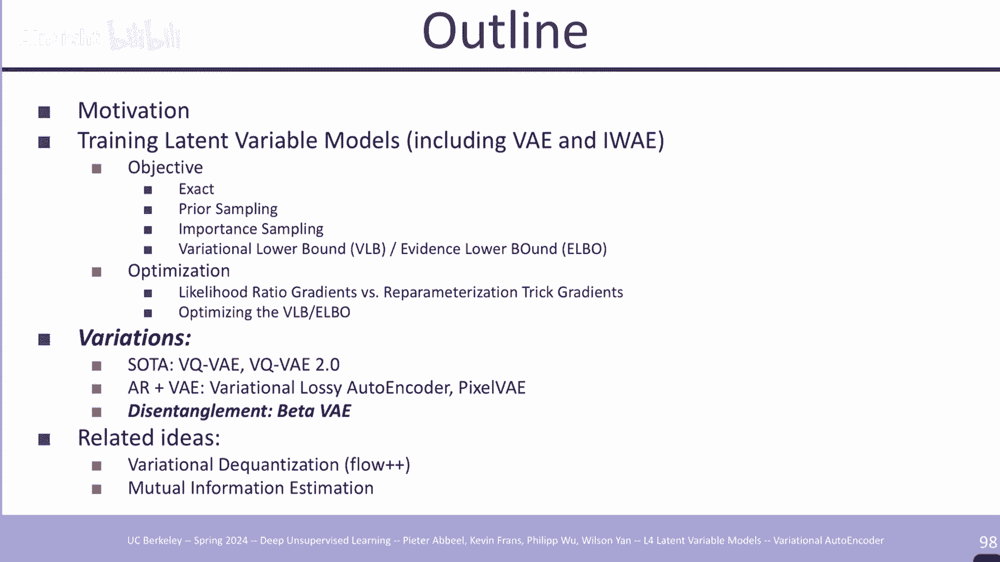

总结来说，VAE 巧妙地结合了神经网络和变分推断，为我们提供了一种同时学习数据生成和有效数据表示的强大框架。