# 7：自监督学习 🧠

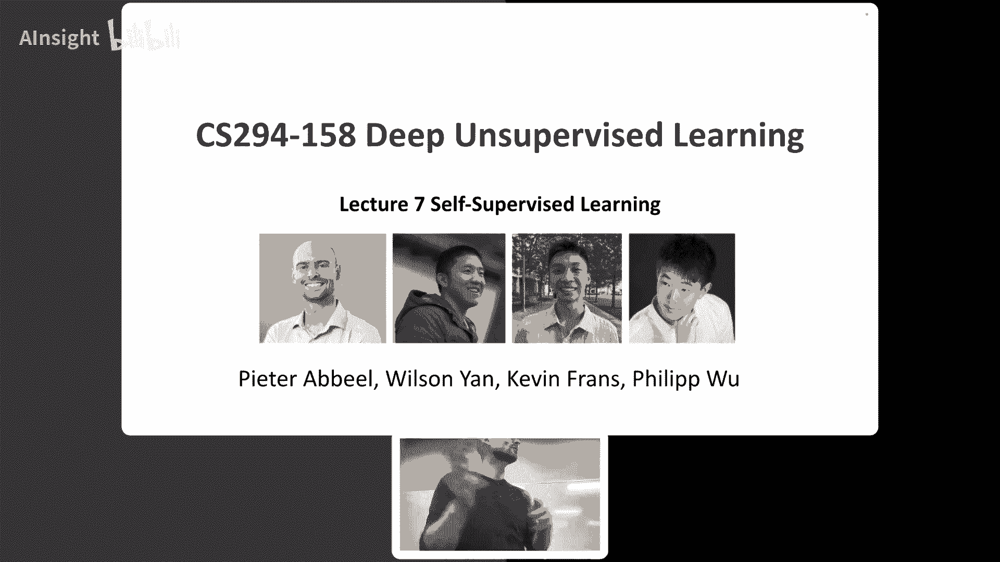

在本节课中，我们将学习自监督学习。这是一种无需人工标注数据，通过设计巧妙的预测任务，让模型从数据本身学习到高质量表示的方法。我们将从核心概念出发，回顾其发展历程，并深入探讨多种主流方法，包括基于重建和基于对比的方法，以及它们在视觉、音频、多模态和机器人控制等领域的应用。

---

## 概述

自监督学习的目标是预训练一个神经网络，使其能够提取数据中有意义的表示。之后，我们可以通过微调或在顶部添加简单的分类器，使其在数据有限的下游任务上取得良好性能。生成模型可以实现这一目标，但本节课我们将重点介绍不涉及生成模型的替代方案。

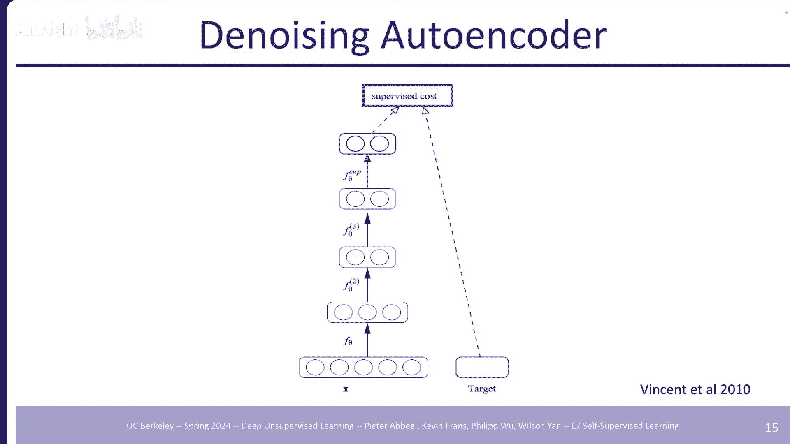

良好的表示至关重要。例如，在分类任务中，如果数据在特征空间中已经很好地分离开，学习一个分类器就会容易得多。在深度学习中，网络通过逐层组合低级特征（如边缘）来形成更高级、更具语义意义的特征（如面部检测器）。预训练网络已经包含了这些有用的特征，使得后续任务（如情绪识别）变得非常容易。

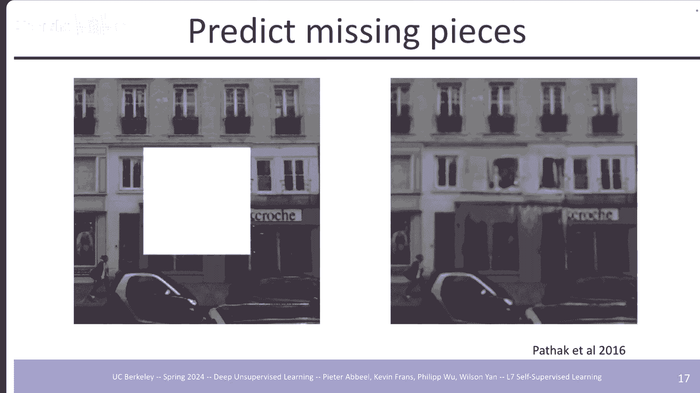

---

## 早期尝试：去噪自编码器与上下文预测

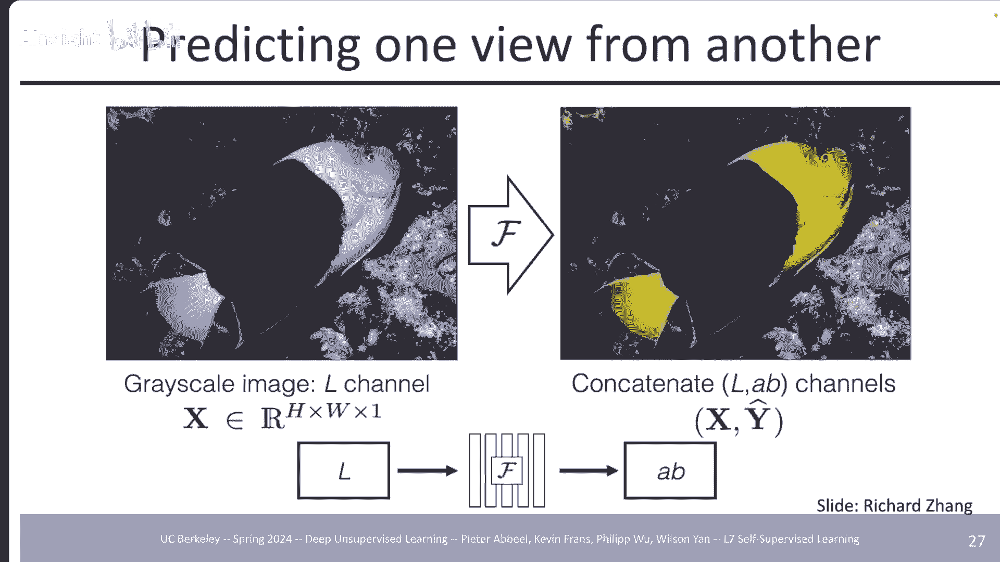

在深度学习兴起之前，人们就已经开始探索自监督学习。一个早期的想法是**去噪自编码器**。

**核心思想**：向数据中添加噪声，然后训练一个网络去恢复原始数据。这迫使网络学习数据的本质结构（流形），从而获得良好的表示。

**公式/代码描述**：
给定输入图像 `x`，我们添加噪声得到 `x̃`。编码器 `E` 将 `x̃` 映射到潜在表示 `z`，解码器 `D` 尝试从 `z` 重建原始图像 `x`。损失函数是重建损失，例如均方误差（MSE）：
`L = || D(E(x̃)) - x ||²`

这种方法可以分层堆叠以训练深度网络，最后再添加一个针对具体任务（如分类）的监督损失进行微调。这让人联想到现代的扩散模型，后者也是通过去噪过程进行学习。

---

上一节我们介绍了通过重建进行表示学习的基本思想。本节中，我们来看看另一种早期方法：**上下文预测**。

其想法是训练一个网络来预测图像中缺失的部分。这不是一个确定性的任务，但网络在匹配监督信号的同时，也能获得一定的泛化能力。

以下是该方法的几个关键设计点：
*   **任务设计**：对输入图像的某些区域进行掩码，编码器处理非掩码区域，解码器则尝试填充空白区域。
*   **损失函数**：同时使用重建损失（如L2）和对抗损失。仅使用重建损失会导致模糊的填充结果；结合对抗损失可以使填充内容看起来更真实，并与周围环境更兼容。
*   **评估**：在ImageNet等大数据集上预训练后，在Pascal VOC等小数据集上进行检测和分割任务的微调。结果显示，填空预训练与其他自监督方法相比具有竞争力，尽管当时监督预训练（ImageNet）仍然更优。

---

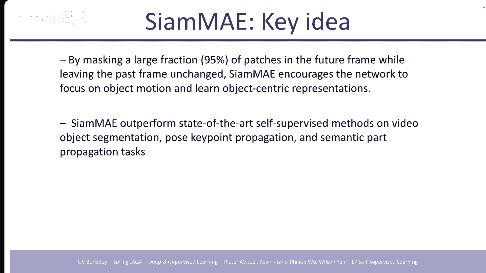

## 色彩化与跨通道预测

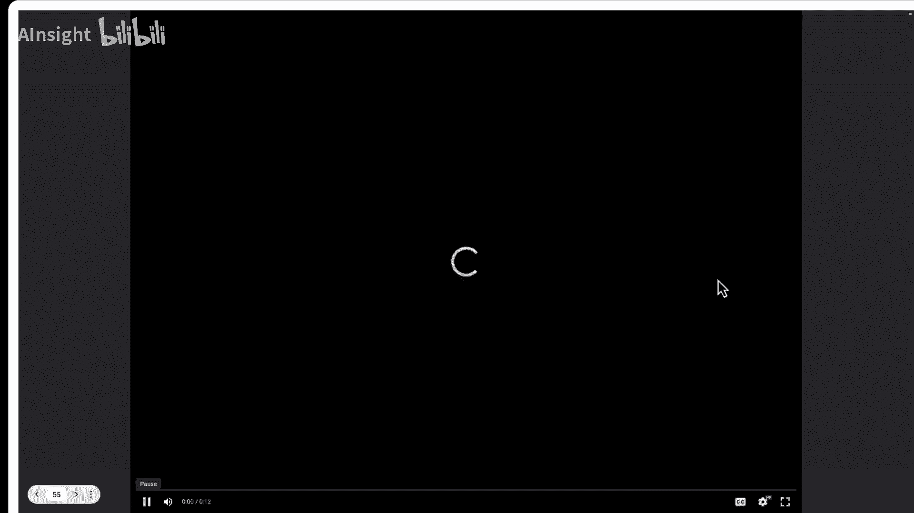

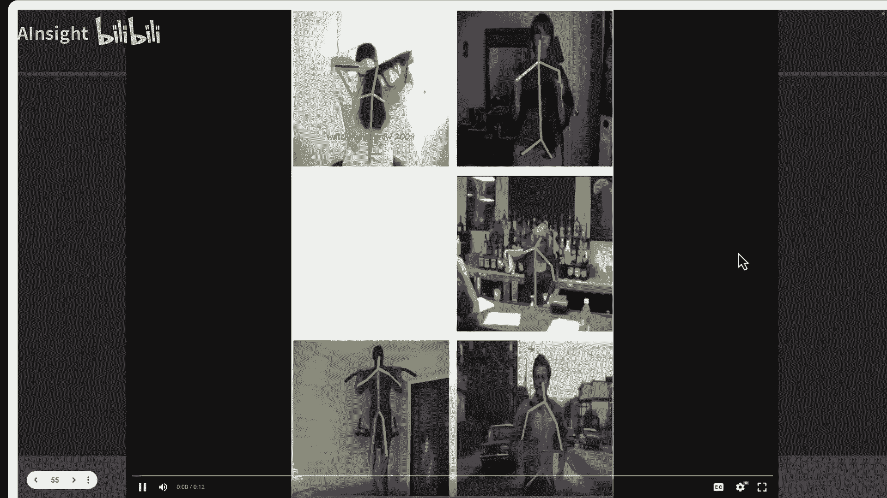

除了掩码空间区域，我们还可以在通道维度上设计预测任务，例如**图像着色**。

**方法**：将图像从RGB空间转换到Lab色彩空间。将亮度通道（L）作为输入，要求网络预测两个颜色通道（a和b）。这迫使网络理解图像的结构和语义，才能进行合理的着色。

**改进**：使用交叉熵离散损失代替L2损失，以更好地建模颜色分布的多模态特性（例如，一辆车可以是红、蓝、绿等多种颜色）。此外，**裂脑自编码器**将图像分割成两部分（如L通道和ab通道），用两个网络分别处理，再结合它们的输出来重建图像，这需要额外的损失来防止平凡解。

在视频中，可以访问第一帧的颜色信息，然后预测后续灰度帧的颜色。这变成了一个跨帧的对应关系学习问题，效果非常好，甚至可以用于学习跟踪。

---

## 掩码自编码器 (MAE) 🎭

之前的方法虽然有趣，但并未在视觉表示学习领域成为主流。直到**掩码自编码器** 的出现，它结合了简单的思想和正确的细节，取得了突破性进展。

**核心思想**：随机掩码输入图像中大量的图像块（例如75%），仅将可见块输入编码器，然后在潜在空间中用一个小解码器重建被掩码的块。

**关键设计**：
1.  **高掩码率**：高达75%的掩码率迫使模型学习全局语义理解，而不是依赖局部纹理进行简单复制。
2.  **非对称架构**：编码器仅处理可见块，计算高效；轻量级解码器用于重建。预训练后，我们只关心编码器学到的表示。
3.  **适用于Transformer**：Vision Transformer 能自然地处理可变数量的图像块，非常适合MAE框架。

**效果**：MAE在ImageNet等基准上取得了优异的线性探测和微调性能。其简单性和有效性使其成为当前最流行的自监督学习方法之一。

---

上一节我们看到了MAE在图像上的成功。本节中我们来看看这个思想如何扩展到其他模态。

**视频MAE**：将MAE应用于视频序列。关键创新是**管状掩码**——在时空维度上掩码同一个区域，防止模型简单地从前一帧复制信息。由于视频冗余度更高，掩码率甚至可以达到90-95%。这种方法在视频动作识别、目标跟踪和姿态传播等任务上达到了最先进水平。

**音频MAE (Audio-MAE)**：将音频转换为频谱图，将其视为“图像”，然后应用MAE。编码器仅处理非掩码的时频块，解码器重建掩码部分。这种方法在音频和语音分类任务上设立了新的性能基准。

**多模态MAE**：可以同时掩码多种模态的数据（如图像、深度、语义分割图），并训练模型重建缺失的模态。这有助于学习更丰富的跨模态表示。例如，结合图像和文本进行MAE预训练，在图像分类任务上比仅使用图像预训练的MAE表现更好。

**多视图MAE**：在机器人等领域，常有多个摄像头从不同角度观察同一场景。多视图MAE随机掩码不同视图的图像块，并尝试重建。这迫使模型学习场景的3D几何和语义信息，从而获得对视角变化更鲁棒的表示。

---

## 对比学习：另一种主流范式 🔄

在MAE兴起之前，基于**对比学习**的方法是自监督学习的主流。其核心思想是学习一个表示空间，其中相似样本（正样本对）的表示彼此靠近，而不相似样本（负样本对）的表示彼此远离。

**核心概念（噪声对比估计）**：模型不直接预测数据，而是学会区分数据样本和噪声样本。给定一个锚点样本，目标是识别出与之配对的正面样本，并从一堆负面样本中区分出来。

一个经典的早期工作是**对比预测编码**。在音频中，它利用当前上下文来预测未来的音频片段，并通过对比损失使正样本对的表示更接近。

---

### 实例判别：MoCo 与 SimCLR

我们将深入探讨两个重要的对比学习方法：**MoCo** 和 **SimCLR**。

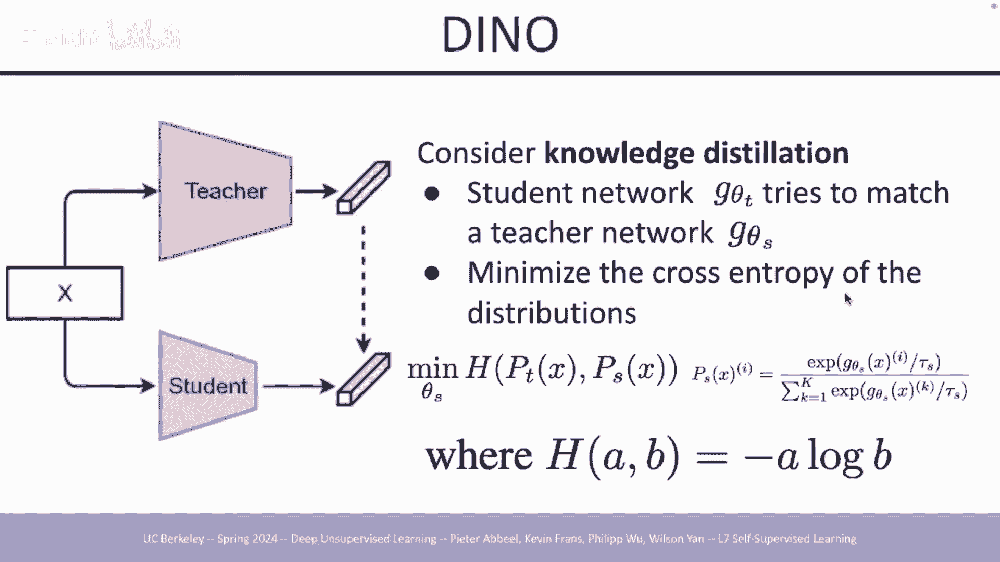

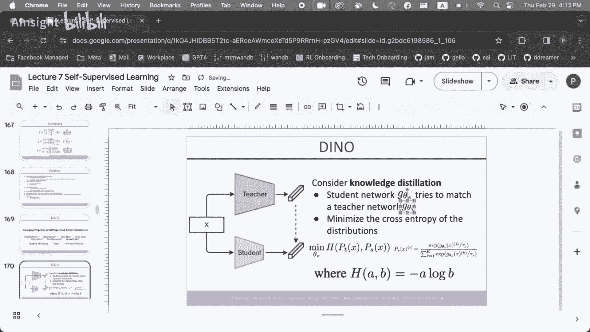

**MoCo（动量对比）**：
*   **挑战**：对比学习需要大量负样本以获得好效果，但受限于GPU内存，无法使用很大的批大小。
*   **解决方案**：引入一个**动态字典**作为负样本队列，并采用一个**动量编码器**来缓慢更新键编码器，以保持字典中特征的一致性。
*   **流程**：查询编码器处理当前增强样本，动量编码器处理历史样本（作为键）。通过对比损失，使查询与其正样本键相似，与负样本键不相似。

**SimCLR（一个简单的对比学习框架）**：
*   **简化**：去除了动量编码器和字典，直接在同一批数据中构造正负样本对。
*   **关键组件**：
    1.  **强大的数据增强**：组合使用裁剪、颜色抖动、翻转等。
    2.  **非线性投影头**：在编码器后添加一个小的MLP网络，将特征映射到对比损失空间。
    3.  **大批次训练**：利用现代硬件，使用非常大的批大小（如4096）来获得足够多的负样本。

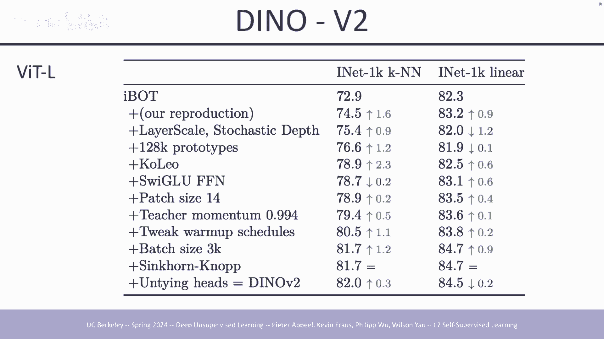

SimCLR展示了简单的端到端对比学习框架配合规模化训练，也能取得卓越的性能。

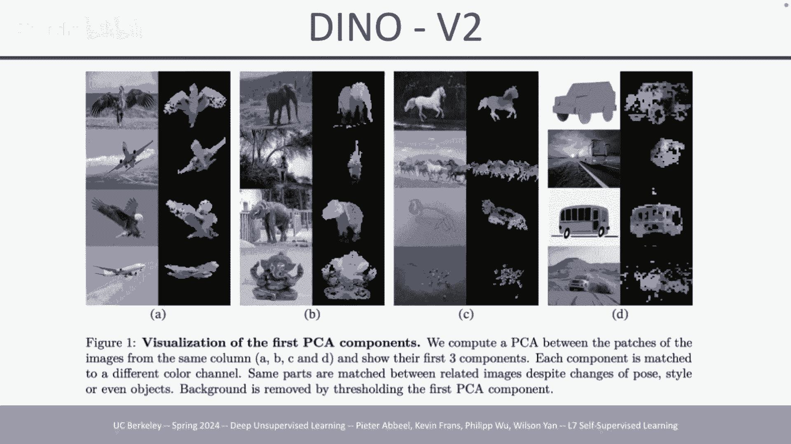

---

### 迈向更简单的目标：BYOL 与 DINO

对比学习需要精心构造正负样本对。后续研究试图进一步简化，甚至移除显式的负样本。

**BYOL（引导你自己的潜在空间）**：
*   **方法**：使用两个网络：在线网络和目标网络。目标网络是在线网络的指数移动平均。在线网络预测目标网络的输出，目标网络提供训练目标。损失是简单的L2损失。
*   **神奇之处**：没有负样本，为何不崩溃？研究发现，投影头中的**批归一化层**起到了关键作用，它隐式地引入了对比效应。

**DINO（自蒸馏与无标签）**：
*   **方法**：受知识蒸馏启发。学生网络学习匹配教师网络输出的特征分布。教师网络是学生网络权重的指数移动平均。
*   **中心化与锐化**：对教师输出进行中心化（减去均值）和锐化（用低温softmax），防止模式崩溃并鼓励模型关注显著特征。
*   **效果**：DINO能学习到优异的图像特征，并且其注意力图能很好地聚焦于前景物体，甚至可用于无监督分割。

**iBOT** 和 **DINOv2** 是DINO的扩展，引入了像MAE一样的掩码图像建模，在补丁级别进行自蒸馏，进一步提升了表示质量。

---

## 自监督学习在多模态与机器人中的应用

自监督学习的思想也被成功应用于连接不同模态和机器人控制领域。

**CLIP（对比语言-图像预训练）**：
*   **目标**：学习一个共享的表示空间，使匹配的图像和文本对靠近，不匹配的对远离。
*   **方法**：使用大规模的图像-文本对数据集。分别用图像编码器和文本编码器提取特征，计算对比损失。
*   **应用**：CLIP实现了强大的零样本分类能力，其预训练的特征也被广泛用作各种视觉-语言模型的基石。

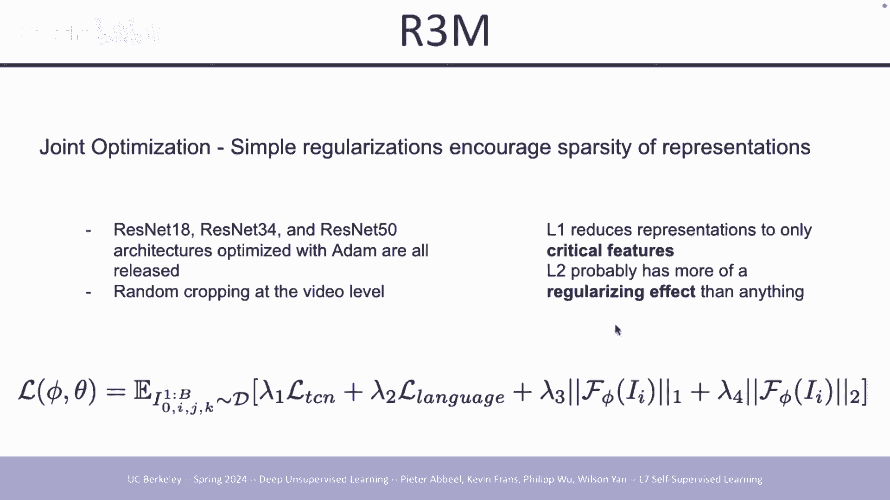

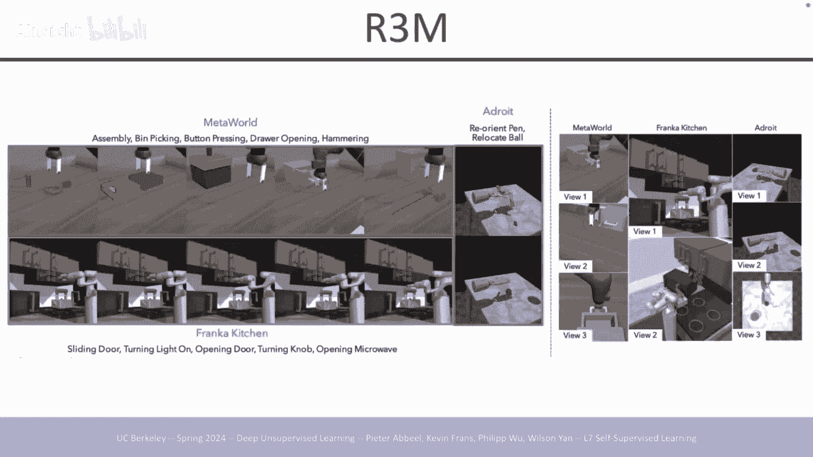

**在机器人控制中的应用**：
机器人需要从丰富的感知数据（如多视角图像）中学习对任务有用的表示。自监督学习提供了一种无需昂贵动作标注的预训练方式。
*   **CURL**：将对比学习应用于RL，从像素中学习状态表示，其性能可媲美使用真实状态信息的算法。
*   **R3M**：利用带有语言注释的野外视频（如Ego4D），通过时间对齐对比和视频-语言对齐对比进行预训练，学到的表示能更好地迁移到机器人操作任务。
*   **MVP 与 Masked World Models**：将MAE风格的重建目标用于机器人视觉预训练。通过掩码重建多视角观察或状态序列，学习到的表示能显著提升下游策略学习的样本效率和性能。

---

## 总结

本节课我们一起深入探讨了自监督学习。我们从表示学习的重要性出发，回顾了从早期的去噪自编码器、着色到现代主流的掩码自编码器和对比学习的发展历程。

我们学习了：
*   **基于重建的方法**（如MAE）：通过设计掩码重建任务，让模型学习数据的结构和语义。
*   **基于对比的方法**（如MoCo, SimCLR）：通过拉近正样本、推开负样本，学习判别性表示。
*   **更简化的方法**（如BYOL, DINO）：甚至尝试移除负样本，通过自蒸馏等方式学习。
*   **多模态学习**（如CLIP）：对齐不同模态的表示空间。
*   **在机器人中的应用**：如何利用自监督预训练从视觉数据中学习对控制任务有用的鲁棒表示。

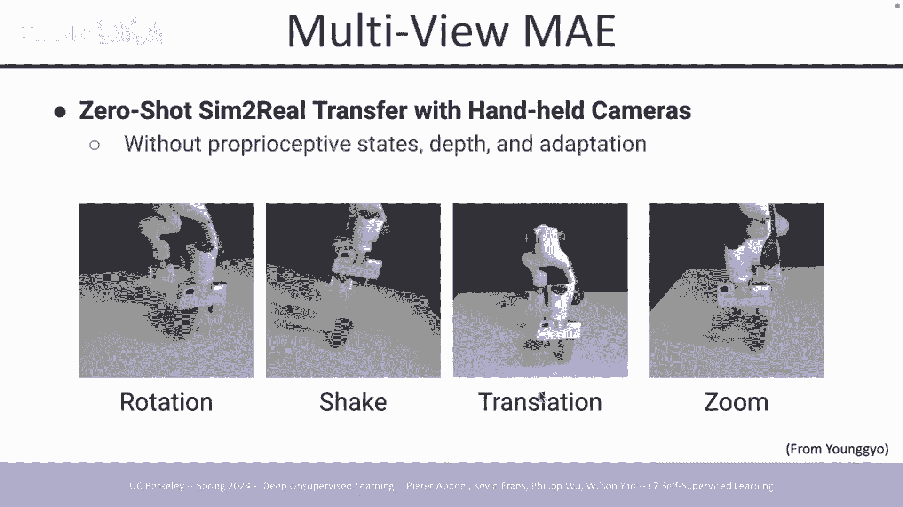

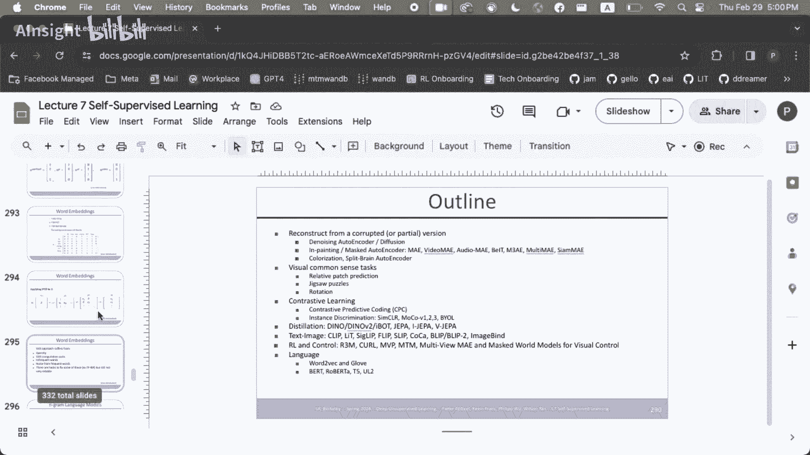

自监督学习的魅力在于，它利用数据本身的结构作为监督信号，避免了大量人工标注的成本。随着模型和数据的不断规模化，自监督学习已成为学习通用、强大表示的基石技术，为人工智能系统迈向更广泛的理解和能力奠定了基础。