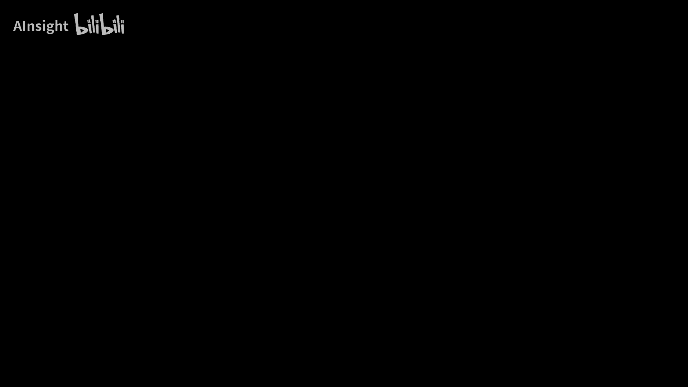
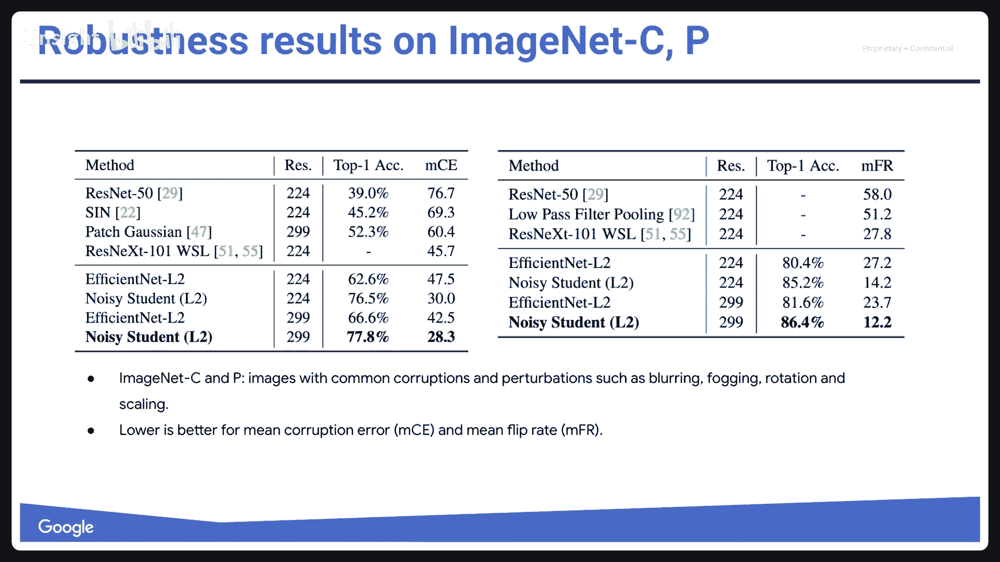
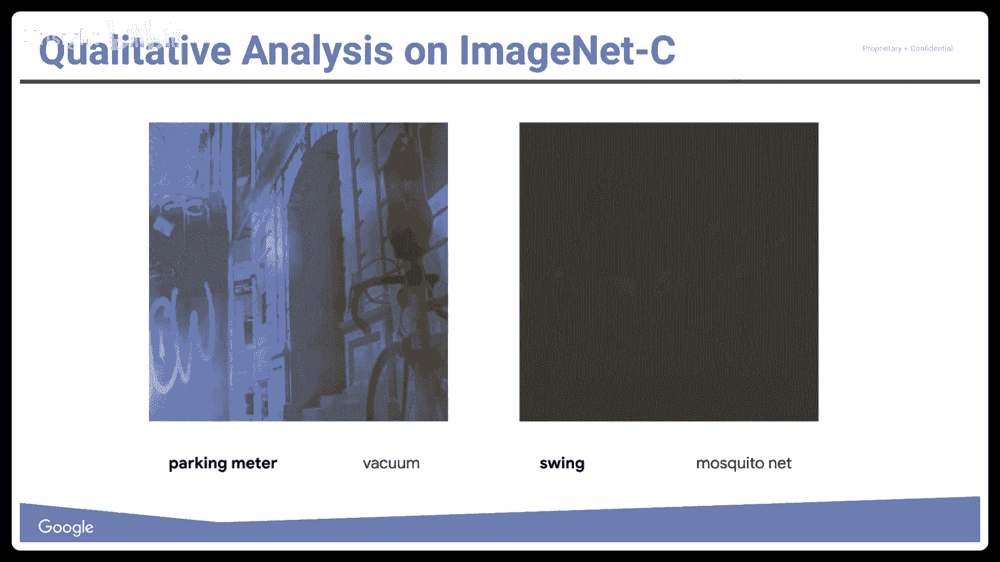
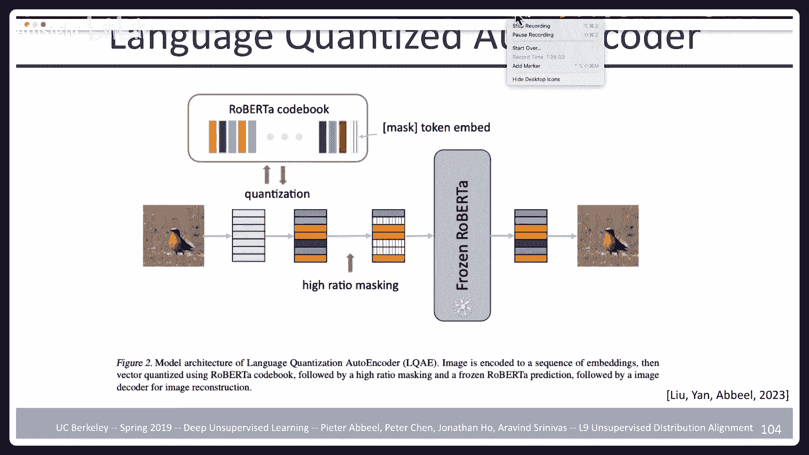

# 10：半监督学习与无监督分布对齐 🧠

在本节课中，我们将要学习两个核心主题：**半监督学习**和**无监督分布对齐**。这两个主题虽然在近期大规模预训练模型盛行的背景下研究热度有所降低，但其背后的思想依然非常丰富和富有启发性。我们将探讨如何利用少量标记数据和大量未标记数据来提升模型性能，以及如何在没有任何配对样本的情况下，学习两个不同数据分布之间的对应关系。

## 概述

首先，我们来了解一下本学期的进度安排。目前家庭作业已完成过半，项目里程碑即将到来。下周是春假，之后我们将讨论模型压缩，并迎来期中考试。考试形式是开卷，我们会提前提供问题列表。

本节课的核心是理解两种特殊的学习范式。**半监督学习**旨在利用大量未标记数据来辅助少量标记数据的学习。**无监督分布对齐**则试图在没有配对样本的情况下，找到两个不同数据域（如两种语言、两种图像风格）之间的映射关系。

---

## 半监督学习

在传统的监督学习中，我们拥有大量带标签的数据。然而，获取标签通常是耗时且昂贵的。半监督学习的核心思想是：我们拥有少量标记数据和大量未标记数据，目标是利用未标记数据中蕴含的分布信息，来提升模型在标记数据上的学习效果。

从直观上看，如果我们只使用少量标记数据（如下图中间所示），学到的决策边界可能无法捕捉数据的整体结构。而如果我们能利用未标记数据点之间的邻近关系，将标签信息“传播”到邻近的未标记数据上，就可能找到更合理的决策边界（如下图右侧所示）。

### 问题形式化

在监督学习中，我们试图最大化条件概率 \( P(Y|X) \)。在半监督学习中，我们有两个数据集：
*   有监督数据集 \( D_s \): 包含输入 \( X \) 和输出 \( Y \)，来自联合分布 \( P(X, Y) \)。
*   无监督数据集 \( D_u \): 仅包含输入 \( X \)，来自边缘分布 \( P(X) \)，这个 \( P(X) \) 与 \( D_s \) 中的 \( P(X) \) 相同。

目标是利用 \( D_u \) 来帮助更好地学习 \( P(Y|X) \)。

### 核心方法

历史上，人们提出了多种半监督学习方法。我们将介绍几种代表性思路，它们通常可以结合使用。

#### 1. 熵最小化

直觉是：一个好的分类器应该在数据点上做出自信的预测，即预测分布的熵应该很低。我们不希望决策边界穿过数据密集的区域。

**方法**：在目标函数中增加一项，最小化模型在未标记数据上的预测熵。
**公式**：
\[
\mathcal{L} = \mathcal{L}_{sup} + \lambda \mathbb{E}_{x \sim D_u} [H(P(y|x))]
\]
其中，\( H \) 表示熵，\( \lambda \) 是权衡超参数。

#### 2. 伪标签

这是一种渐进式的熵最小化方法。

**步骤**：
1.  在标记数据上训练一个分类器。
2.  用该分类器对未标记数据进行预测，为置信度最高的一部分样本分配“伪标签”。
3.  将带有伪标签的样本加入训练集，重新训练分类器。
4.  重复步骤2和3，直到所有未标记数据都被标记。

这个过程可以看作是从标记数据区域开始，逐步将决策边界扩展到未标记区域。

#### 3. 标签一致性与数据增强

一个更强大的想法是：对输入数据进行不改变其语义的增强（如裁剪、翻转、变色），模型对原始样本和增强样本的预测应该保持一致。

**核心**：强制模型对同一个数据的不同增强版本产生相似的输出（logits）。这相当于在局部区域平滑了分类器的决策函数。

**实现方式（以Π模型为例）**：
*   对每个样本（无论是否有标签）应用两次随机数据增强和Dropout，得到两个输出 \( z \) 和 \( \tilde{z} \)。
*   对于有标签样本，计算标准交叉熵损失。
*   对于所有样本，计算一致性损失，例如均方误差 \( \|z - \tilde{z}\|^2 \)。
*   总损失是监督损失和无监督一致性损失的加权和。

为了避免每个样本都需要前向传播两次，衍生出了**时序集成**和**Mean Teacher**等方法。Mean Teacher维护一个模型参数的移动平均版本（“教师”模型），并让学生模型的预测与教师模型的预测保持一致。

#### 4. 虚拟对抗训练

这种方法不是使用预设的数据增强，而是主动寻找模型预测最敏感的变化方向（即“对抗性”方向），并强制模型在这个方向上的变化也很小。

**步骤**：
1.  对于每个数据点，计算其梯度，找到能最大程度改变模型预测的扰动方向。
2.  强制模型对施加了该扰动的数据点做出与原始数据点一致的预测。

这能有效促使决策边界在数据点周围保持平坦。

### 方法比较与演进

一篇重要的论文《深度半监督学习算法的现实评价》对多种方法进行了系统比较。他们使用固定的强大网络架构，在CIFAR-10和SVHN数据集上测试。结果发现，在标记数据量不同时，**虚拟对抗训练（VAT）**  consistently表现优异。

随后，谷歌的研究团队将一致性训练与更先进的数据增强技术结合，提出了**无监督数据增强（UDA）** 方法。他们在图像（使用AutoAugment策略）和文本（使用回译和TF-IDF词替换）任务上都取得了显著提升，甚至在少量标记数据下超越了完全监督的基线模型。

进一步的改进包括**MixMatch**和**Noisy Student**。
*   **MixMatch**：融合了数据增强、一致性训练、熵最小化和MixUp（混合样本与标签）技术。
*   **Noisy Student**：这是一个自训练过程。首先在标记数据上训练一个“教师”模型，用于生成未标记数据的伪标签。然后，训练一个更大的“学生”模型，在**加入了噪声（如数据增强、Dropout、随机深度）** 的数据上，同时拟合标记数据和伪标签。迭代此过程，学生模型在下一次迭代中成为新的教师。Noisy Student首次在ImageNet上证明了半监督学习可以稳定地超越完全监督学习。

---

## 无监督分布对齐

上一节我们介绍了如何利用未标记数据提升分类性能。本节中，我们来看看一个不同但相关的问题：如何在完全没有配对样本的情况下，学习两个数据分布之间的映射。

### 问题定义

我们有两个域的数据，例如：
*   域A：英语句子集合
*   域B：法语句子集合
*   域A：真实照片
*   域B：莫奈风格的画作

我们可以分别从分布 \( P_A \) 和 \( P_B \) 中采样，但**无法获得成对的样本** \( (a, b) \)。目标是学习一个映射函数，能够将域A的样本转换到域B，反之亦然。这个映射可能是确定性的，也可能是随机的（一个分布）。

### 核心原则

解决这个问题主要依赖两个基本原则：

#### 1. 边缘分布匹配

当我们把域A的样本通过映射 \( G_{A\to B} \) 转换到域B时，生成的样本应该看起来像是从域B的真实分布 \( P_B \) 中采样的。反之亦然。这确保了转换后的样本在目标域中是“逼真”的。

#### 2. 循环一致性

如果我们把一个样本从域A转换到域B，再通过反向映射 \( G_{B\to A} \) 转换回域A，应该能够恢复出原始的样本。即 \( G_{B\to A}(G_{A\to B}(a)) \approx a \)。这防止了映射学习到一些平凡或无意义的对应关系。

### 经典方法：CycleGAN

CycleGAN是应用上述原则的经典工作。它使用生成对抗网络来实现：
*   **边缘匹配**：通过GAN的判别器来确保转换后的图像符合目标域的分布。
*   **循环一致性**：通过额外的循环一致性损失函数来约束 \( G_{B\to A}(G_{A\to B}(a)) \) 与 \( a \) 尽可能接近。

CycleGAN成功实现了诸如马到斑马、照片到油画风格等转换。然而，GAN训练本身不稳定，且确定性映射有时会“作弊”（例如在转换中隐藏信息以便完美重建），或无法处理一对多的映射关系。

### 改进与扩展

为了解决一对多映射问题，后续工作引入了**潜在变量**，使映射变为随机的。同时，为了更鲁棒地实现边缘匹配，有研究提出了**去噪自编码器约束**的思路：
1.  将域A样本编码并解码到域B（如生成一段描述）。
2.  对域B的输出随机掩码一部分。
3.  使用一个**冻结的、预训练的**域B模型（如语言模型）去恢复被掩码的部分。
4.  将恢复后的结果解码回域A，并计算重建损失。

如果步骤1中的转换不符合域B的分布（如生成了不合语法的描述），那么冻结的预训练模型将无法正确恢复掩码，导致重建困难，损失增大。这巧妙地利用预训练模型作为分布“裁判”，避免了训练GAN判别器的困难。

### 在多语言词向量中的惊人发现

一个有趣且成功的无监督对齐案例发生在词向量领域。研究者分别用英语语料和法语语料训练词嵌入模型（如Skip-gram），得到两个独立的词向量空间。令人惊讶的是，他们发现这两个空间的结构是**同构的**，只需一个简单的**线性变换（旋转矩阵）** 就能将一种语言的词向量空间对齐到另一种语言。

这意味着，在没有平行语料的情况下，仅通过单语数据学习到的语义空间本身就蕴含了跨语言对齐的潜力。这一发现对低资源语言的机器翻译具有重要意义。

---

## 总结

本节课中，我们一起学习了两个重要的机器学习范式。

在**半监督学习**部分，我们看到了如何利用大量未标记数据来增强模型。从早期的熵最小化、伪标签，到基于一致性的方法（Π模型、Mean Teacher），再到更强大的虚拟对抗训练（VAT）和无监督数据增强（UDA），最终发展到能够稳定超越完全监督学习的Noisy Student方法。其核心思想始终是：利用未标记数据揭示的整体分布结构，来引导和正则化基于少量标记数据的学习过程。

在**无监督分布对齐**部分，我们探讨了如何在无配对数据的情况下建立两个域之间的映射。CycleGAN通过**边缘分布匹配（GAN损失）** 和**循环一致性损失**开创了这一领域。后续工作通过引入随机性和利用预训练模型（如去噪自编码器约束）来改进。而在词向量层面发现的跨语言线性可对齐性，则展示了无监督对齐的惊人潜力。

这两个主题都强调了利用数据本身的结构和分布信息的重要性，为我们处理标签稀缺或跨域迁移问题提供了有力的工具。