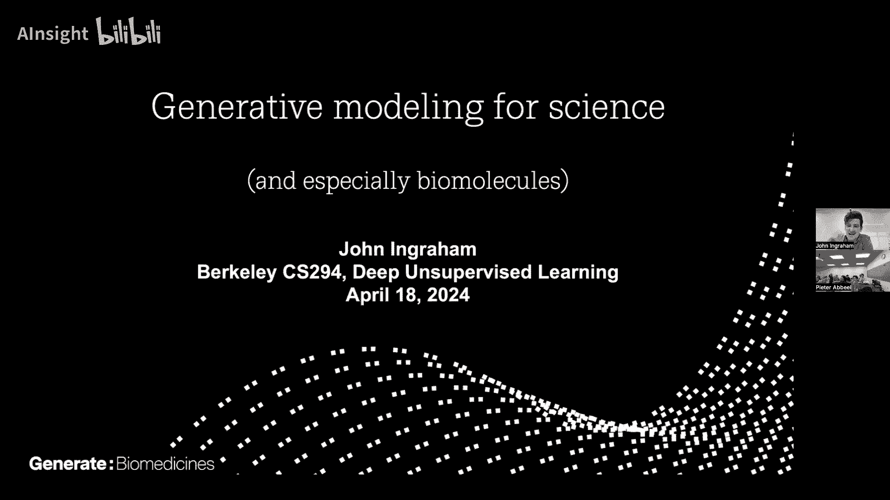
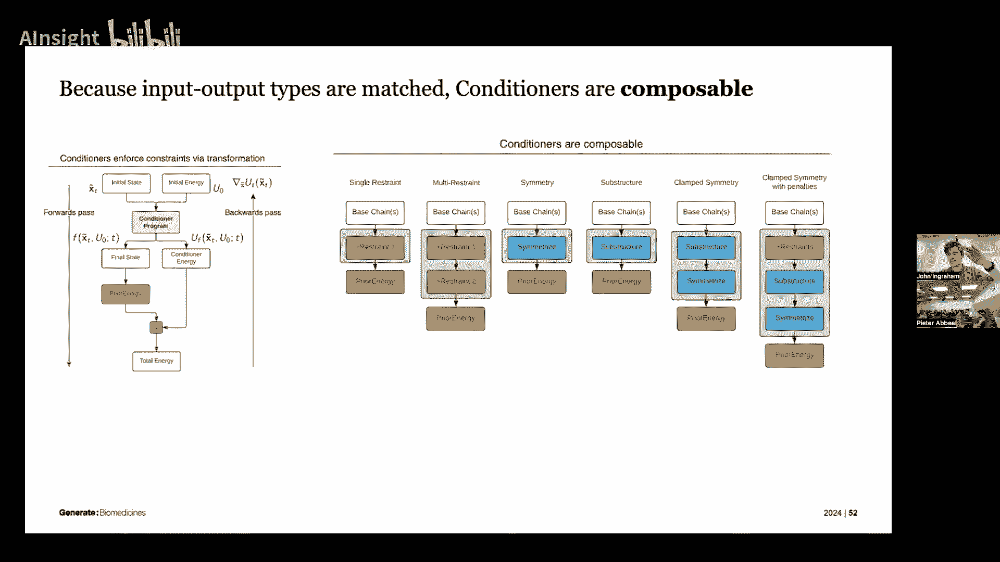
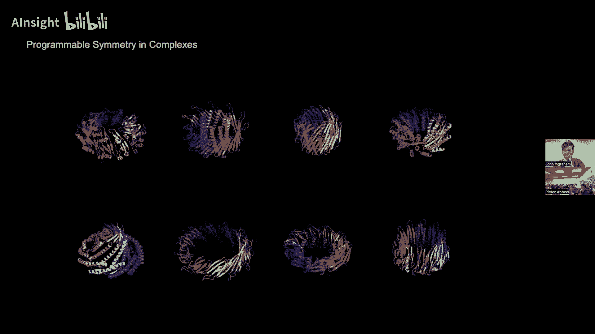
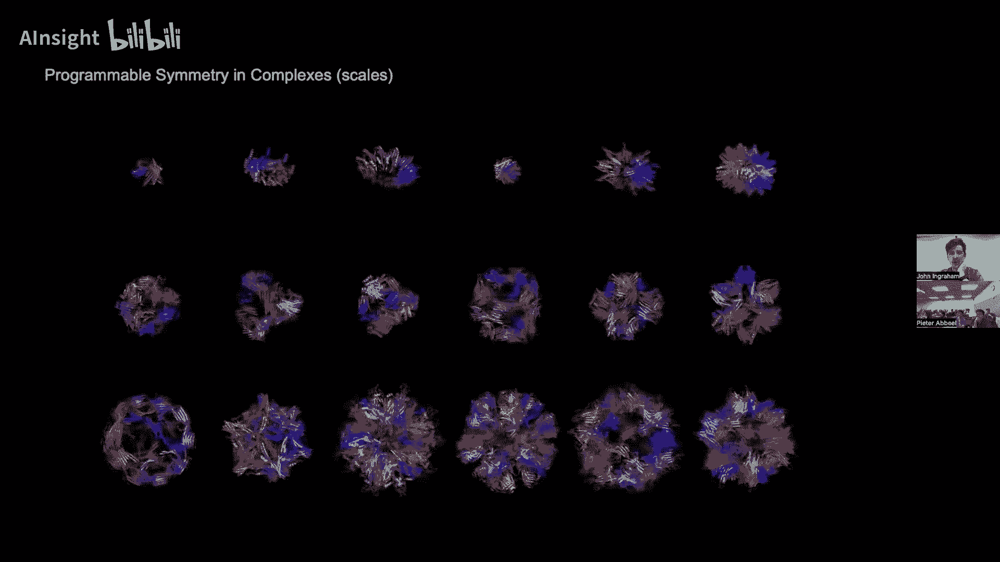
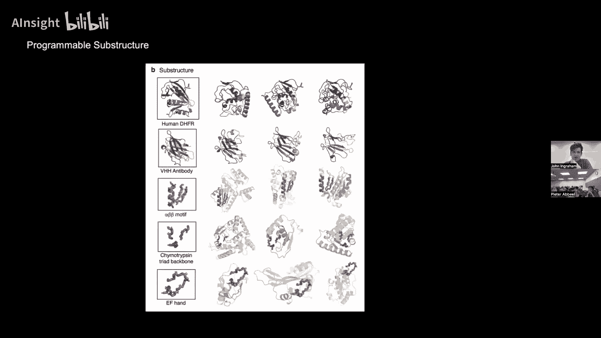
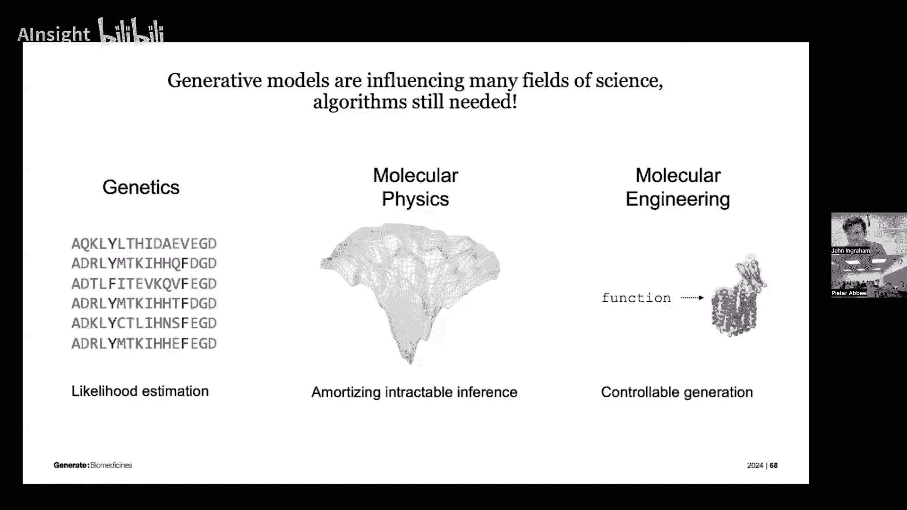

# 11：13a 科学生成模型 🧬

在本节课中，我们将学习生成模型在科学研究，特别是蛋白质科学领域的应用。我们将探讨如何利用概率生成模型来理解遗传变异、模拟分子物理以及从头设计全新的蛋白质。

---

## 1. 遗传学中的密度模型：从序列数据中解读自然选择

上一节我们介绍了生成模型在科学中的总体角色，本节中我们来看看它在遗传学中的具体应用。我们拥有强大的基因组测序能力，可以获取海量的DNA序列数据。然而，我们对于这些序列中大量突变的功能影响知之甚少。一个关键问题是：如何解读这些遗传变异？

有趣的是，现存生物序列的分布实际上编码了历史自然选择的信息。那些能够存活至今的序列，其分布反映了哪些突变是有益的、哪些是有害的。因此，我们可以通过为这些序列数据拟合一个**密度模型**，来推断背后的选择压力。

以下是构建和应用此类模型的基本步骤：
1.  **收集数据**：获取大量同源蛋白质的序列比对数据。
2.  **拟合密度模型**：使用深度生成模型（如变分自编码器VAE）来学习这些序列的分布。
3.  **进行推理**：通过计算新序列的**对数似然比**，评估其是否符合自然选择的模式，从而预测突变的影响。

一个令人惊讶的发现是，这种纯粹基于进化数据训练的无监督密度模型，其输出的原始对数似然度，与实验室中实际测量的突变效应（例如蛋白质功能丧失）具有高度相关性。这证明了进化历史与生物功能之间的深刻联系。

然而，挑战依然存在。针对单个蛋白质家族的数据可能非常有限（有时只有几千个序列），这使得共享统计信息的全局蛋白质语言模型（LM）有时反而不如针对特定家族精心构建的局部模型。因此，当前的前沿方法结合了两者：训练一个覆盖所有蛋白质的大规模基础模型，但在推理时，会检索并整合特定家族的局部序列信息，以提升预测准确性。

这项工作意义重大，它帮助我们识别可能导致疾病的遗传突变，是精准医疗的重要计算工具。

---

## 2. 分子物理学作为推断问题：用生成模型加速模拟

上一节我们看到了生成模型如何解读静态序列数据，本节中我们来看看它在模拟动态分子系统中的应用。分子物理学中的一个核心任务是模拟原子和分子的运动，例如蛋白质折叠过程。这本质上是一个**推断问题**：我们需要从一个由能量函数定义的复杂分布（玻尔兹曼分布）中采样。

传统的分子动力学模拟需要以飞秒为步长运行数百万甚至数十亿步，计算成本极高。生成模型提供了一种“摊销采样”的思路：我们能否训练一个模型，直接生成符合目标分布的样本，从而避免昂贵的模拟过程？

一种方法是使用**正则化流**。其核心思想是训练一个可逆神经网络，将一个简单的分布（如高斯分布）映射到我们感兴趣的目标分布。训练目标是最小化生成分布与真实玻尔兹曼分布之间的KL散度。

**公式**：`KL[ q_φ(x) || p(x) ]`，其中 `p(x) ∝ exp(-E(x)/kT)` 是目标玻尔兹曼分布，`q_φ(x)` 是由流模型定义的分布。

训练完成后，我们可以直接从流模型中快速采样。虽然生成的分布可能不完美，但可以通过重要性采样等技术进行校正。然而，训练这样的流模型本身具有挑战性，因为分子系统的能量景观通常非常崎岖。

另一种更实用的方法是**扩散模型增强**。许多现有的结构预测模型（如AlphaFold）能给出蛋白质结构的点估计。我们可以将其视为目标分布的一个“模态”。通过向这些结构添加噪声，并微调模型以学习去噪过程，我们可以将一个确定性的预测器转变为一个能生成结构分布的扩散模型。这种方法能以较低成本增加样本的多样性，并与传统模拟数据产生交集。

这个领域仍处于早期阶段，目标是开发出能够真正替代昂贵模拟、并能探索全新分子构象的生成器。

---

## 3. 从头蛋白质设计：生成功能性的纳米机器

上一节我们探讨了如何模拟已知系统，本节我们进入更具创造性的领域：从头设计全新的蛋白质。蛋白质是生命的纳米机器，但自然界在过去几十亿年中主要依靠对现有蛋白质的编辑。我们能否利用生成模型打破这一限制，直接设计具有特定功能的全新蛋白质？

计算蛋白质设计领域已被生成模型彻底改变。扩散模型在此尤为成功。其过程与我们熟知的图像生成类似：在蛋白质的3D结构（骨架）上定义一个前向噪声过程，然后训练神经网络学习逆向的去噪过程。

关键是如何将我们对蛋白质的**先验知识**融入模型：
*   **尺度感知的架构**：蛋白质中并非所有原子都需要相互关注。我们使用具有稀疏连接或局部性偏置的图神经网络/注意力机制，以实现接近 `O(N log N)` 的高效缩放。
*   **结构化的噪声过程**：前向扩散的噪声协方差可以融入蛋白质链的统计特性（如链的连续性、局部密度），而非简单的各向同性高斯噪声。
*   **灵活的条件控制**：设计通常需要在特定约束下进行（如对称性、结合特定形状、固定部分结构）。我们将这些约束统一到一个框架中，视为对扩散模型**得分函数**的调整或对采样**状态空间**的变换。

**核心概念**：条件生成可以通过两种方式实现：
1.  **软约束（能量调整）**：类似分类器指导，用一个辅助模型的梯度来调整得分函数。`s_cond(x) = s(x) + γ * ∇_x log p(c|x)`。
2.  **硬约束（状态变换）**：通过一个可微变换 `u(z)` 将采样空间映射到一个满足约束的子空间，并相应调整概率密度。

通过堆叠这些条件模块，我们可以进行复杂的“分子编程”。最终，模型能在几分钟内生成全新的、在自然界中不存在的蛋白质复合体结构。通过独立的折叠软件验证，这些设计出的序列能够折叠回预期的形状。更重要的是，我们已经能够在实验室中合成这些蛋白质，并通过X射线晶体学证实了其原子级精度的结构。

这标志着我们首次能够将数字世界的生成设计，无缝转化为物理世界的功能性纳米机器，开启了蛋白质工程的新纪元。

---

## 总结

本节课中我们一起学习了生成模型在三个蛋白质科学前沿领域的应用：
1.  **遗传学解读**：通过密度模型学习序列分布，零样本地预测突变效应，理解自然选择。
2.  **分子模拟加速**：将分子物理视为推断问题，探索用流模型或扩散模型摊销采样，以替代昂贵模拟。
3.  **从头蛋白质设计**：利用扩散模型和灵活的条件控制机制，直接生成具有特定结构和功能的全新蛋白质，并实现从数字到物理的跨越。

这些案例表明，生成模型不仅是创造内容的工具，更是强大的科学发现引擎，能够帮助我们看到数据中隐藏的模式，探索前所未有的可能性，并最终创造出新的物质和生命元件。