# 12：13b 神经辐射场 (NeRF) 🧠

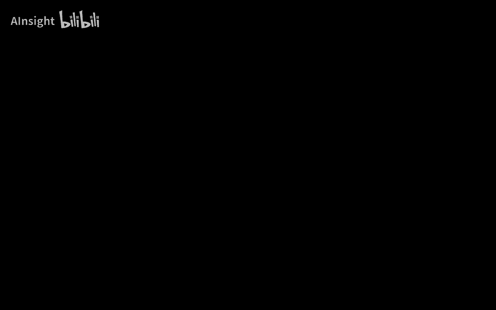


在本节课中，我们将要学习神经辐射场（NeRF）的基本概念、工作原理及其在三维重建和生成中的应用。我们将从为什么需要三维表示开始，逐步深入到NeRF的数学原理、渲染方程和场景表示方法，最后探讨其优势、局限性与未来方向。

## 为什么需要三维表示？🌍

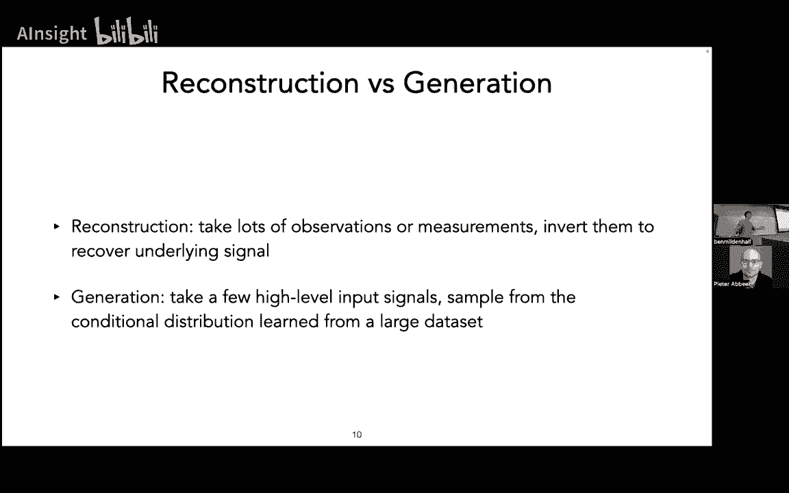

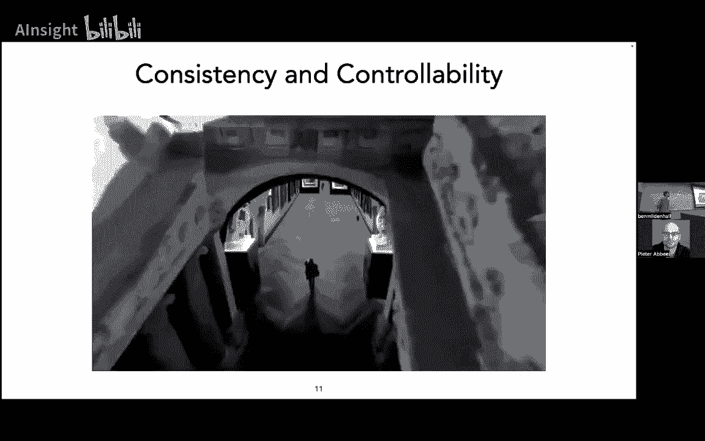

上一节我们介绍了课程概述，本节中我们来看看为什么在人工智能和计算机视觉领域，三维表示仍然至关重要。

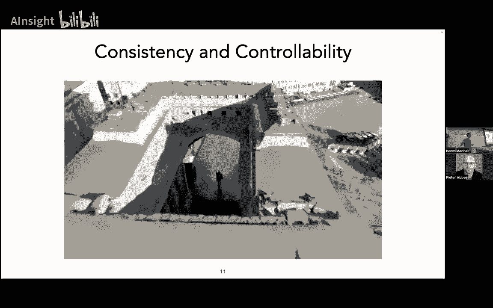

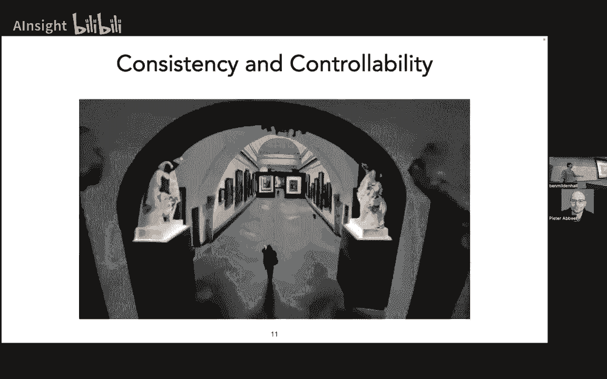

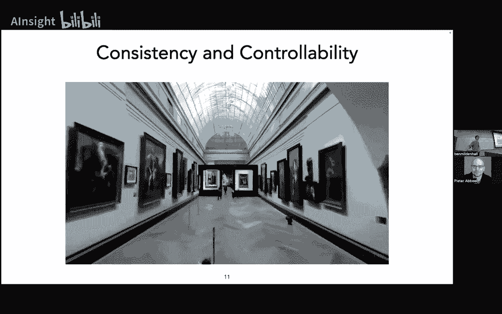

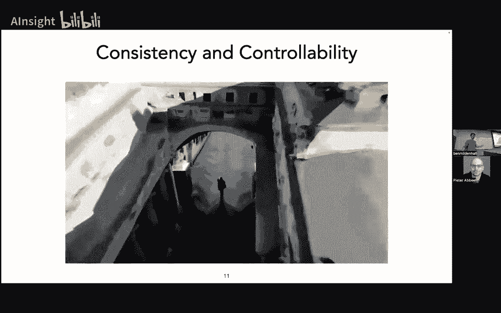

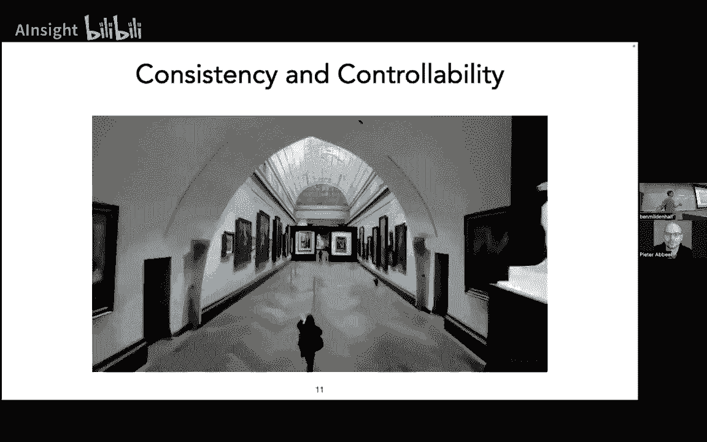

我们生活在一个三维世界中。对于自动驾驶汽车、机器人等需要与现实世界交互的系统，有时仅处理二维像素信息是不够的。我们可能需要严格的几何测量来保证安全，例如计算前进方向和速度。此外，在增强现实（AR）应用中，例如房屋装修，我们可能希望进行底层测量而无需物理工具。所有这些应用都归结为需要准确的空间测量。

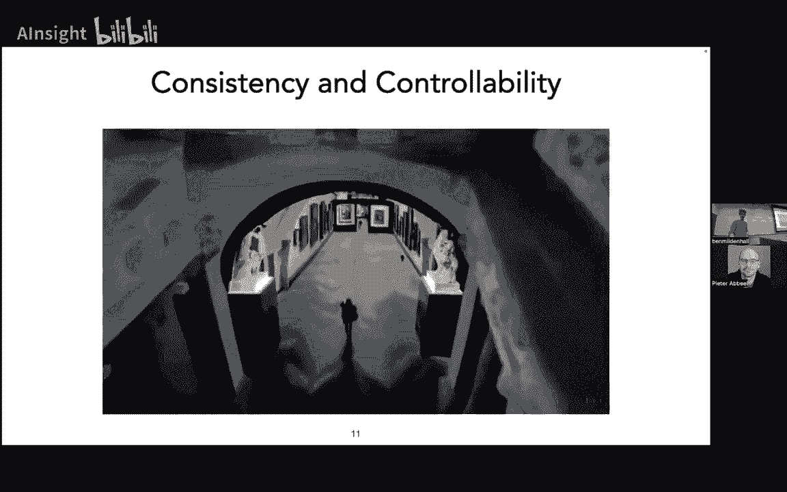

三维表示的另一个重要层面是模拟现实中不存在的场景。一个经典的案例是建筑渲染：在房屋建造前，通过CAD图纸在电脑中模拟不同光照和天气条件下的外观。另一个著名案例是宜家目录，他们使用大型3D模型来生成不同布局和文化的产品图片，而无需实际拍摄。游戏、电影中的计算机图形（CG）行业也完全依赖于底层的3D表示、物理模拟和渲染器。这使得我们可以反复模拟场景，而无需付出巨大的物理成本。

此外，人们直觉地理解物理三维世界，并以此作为交互界面。这在游戏和虚拟现实（VR）中得到了体现，沉浸式的体验和控制方式（如手柄、手势）更具吸引力。对于像苹果头显这样的设备，它需要向你准确展示世界，以避免用户撞上不存在的物体，这需要设备对世界的精确理解。

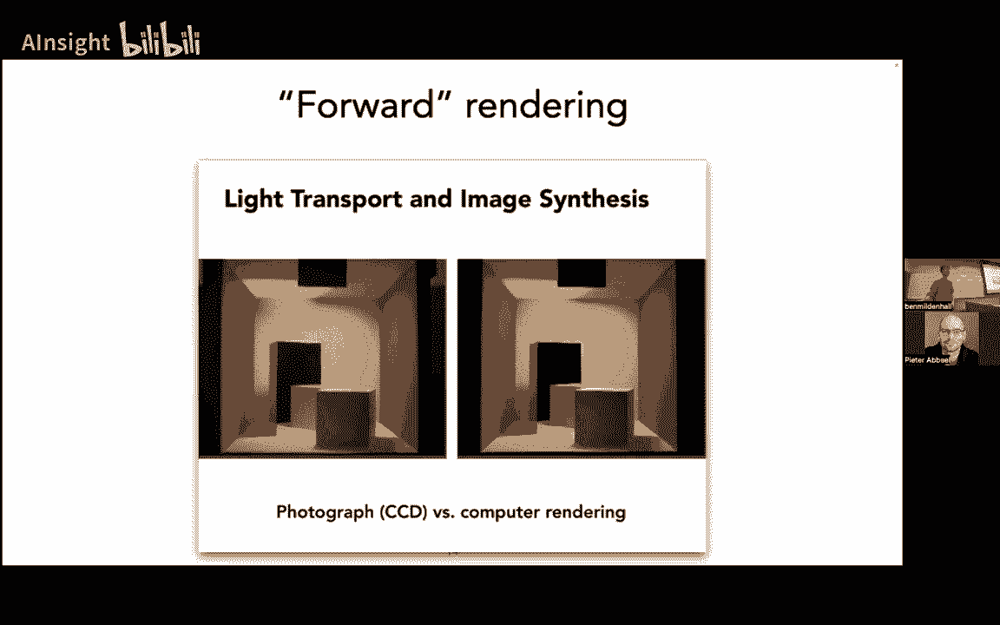

## 重建 vs. 生成 🎯

上一节我们探讨了三维表示的必要性，本节中我们来看看三维内容创建的两种主要范式：重建与生成。

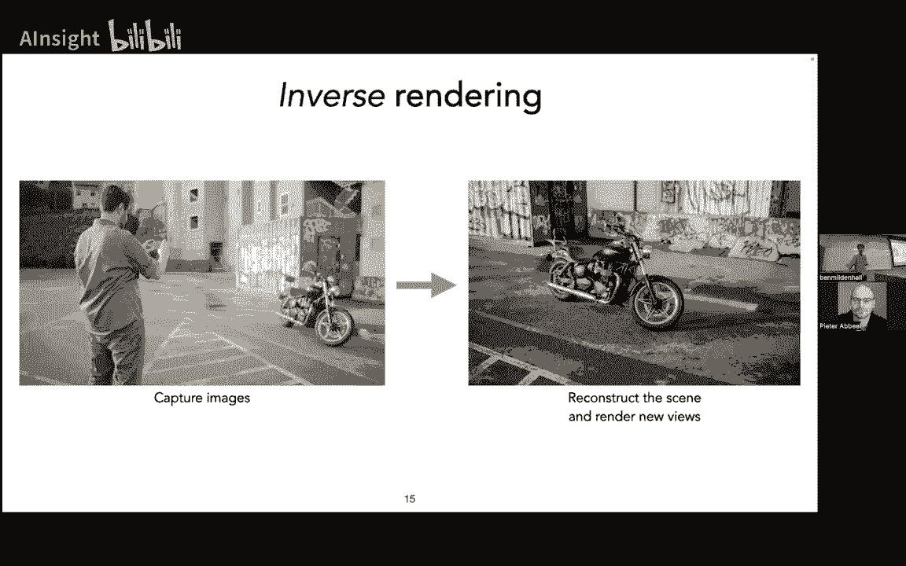

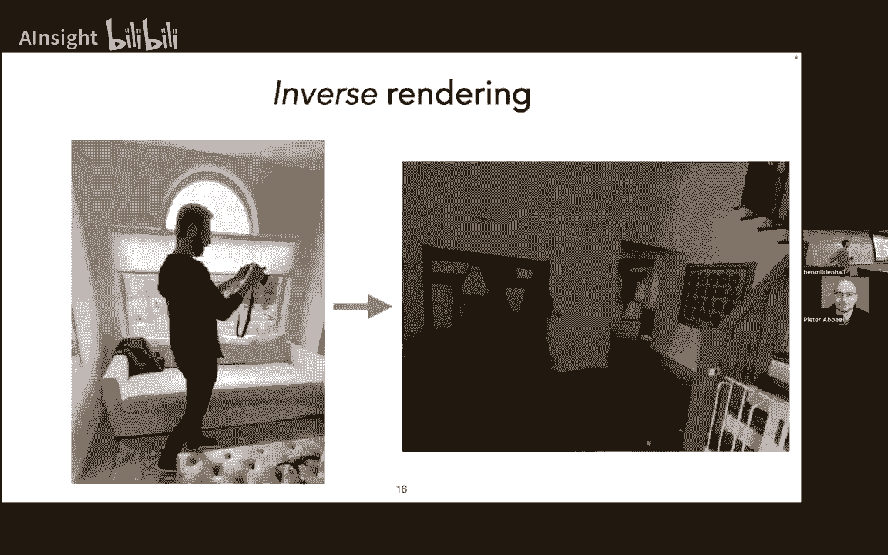

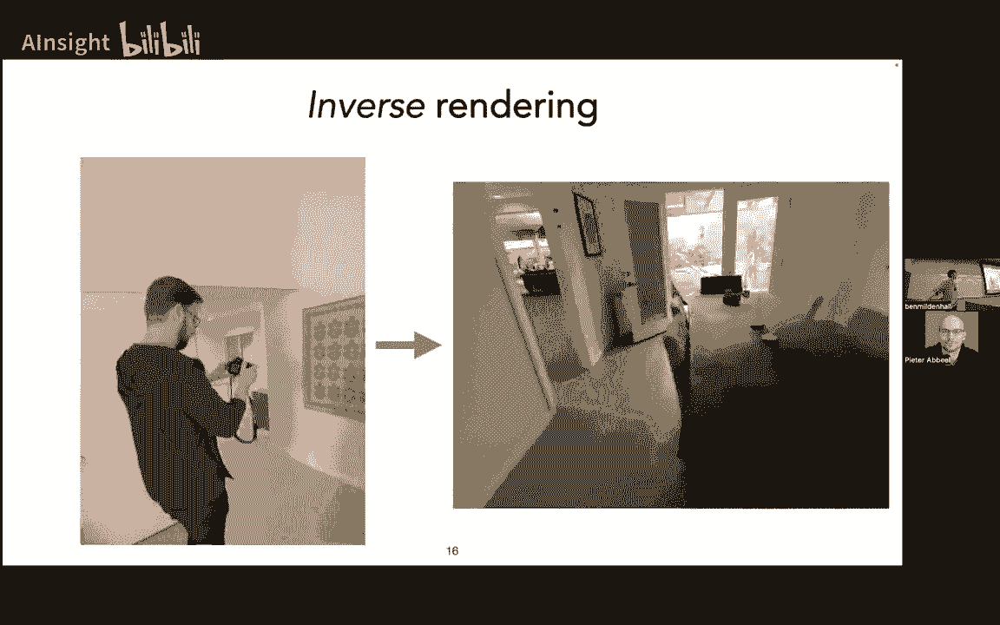

重建意味着我们有许多对底层信号的观测或测量（通常通过某个前向模型抽象，例如从3D场景得到2D照片），然后尝试反转这些观测以恢复对底层信号的表示。目标是尽可能准确地还原真实存在的东西，避免产生幻觉。

生成则意味着我们乐于创造未曾观察到的东西。我们可能有一个纯粹的无条件生成模型，或者一个由文本、图像等语义输入控制的生成模型。例如，根据单张图片生成物体或房间，或根据文本查询生成视频。

在视频生成模型中，人们不断推动其生成更长、更一致的视频。虽然单秒的片段可能看起来很好，但观看二三十秒后，可能会开始出现物理上不可能的光学错觉。这表明了超越基础一致性的挑战，例如控制相机路径或将物体插入场景时，需要尊重真实的遮挡关系。在这些方面，使用更三维的界面可能具有优势。

## 什么是神经辐射场 (NeRF)？🔍

上一节我们区分了重建与生成，本节中我们将聚焦于一种特定的三维重建与合成技术：神经辐射场。

NeRF代表神经辐射场。它是一种用于计算机视觉中“新视角合成”任务的方法。新视角合成的目标是：给定一个场景的一些照片，生成从全新视角观看该场景的图像。

在传统计算机图形学中，渲染需要详细的场景描述：物体的形状、颜色、材质、灯光位置等。然后通过光线追踪或栅格化等算法，模拟相机观察并生成图像。大约在2000年左右，照片级真实感渲染已趋于成熟，并广泛应用于电影和游戏行业。然而，手动创建详细的3D资产（建模、纹理、材质）非常耗时且昂贵。

NeRF背后的驱动力是：能否仅通过一些自动化的3D重建过程，从一组照片中获取场景的3D捕捉，从而渲染新视角，而无需任何手工劳动？它特别注重新视角输出图像的质量，而不一定苛求几何或材质属性的绝对精确度量精度。

## NeRF 的工作原理：高级流程 ⚙️

上一节我们定义了NeRF的目标，本节中我们来看看NeRF实现新视角合成的高级流程。

以下是NeRF从训练到渲染的核心步骤：

1.  **输入**：我们拥有场景的多张输入图像，以及每张图像对应的相机姿态（包括内部和外部参数）。获取准确的相机姿态本身是一个已得到较好解决的问题（例如通过SLAM技术），尽管在非受控的“野外”视频中仍存在挑战。
2.  **光线采样**：在训练时，我们随机选择一张输入图像中的一个像素。利用该图像的相机姿态，我们反向追踪一条从相机中心穿过该像素的光线，进入场景的边界体积中。
3.  **空间点采样**：沿着这条光线，在边界体积内采样一系列3D点。
4.  **神经场景查询**：将每个采样点的3D坐标（以及视角方向等）输入一个神经网络（通常是多层感知机MLP）。这个网络代表整个场景，它会为每个点输出两个值：
    *   **颜色 (c)**：该点从给定视角方向看的颜色。
    *   **体积密度 (σ)**：该点存在几何结构的概率密度，可以理解为“不透明度”。
5.  **体积渲染**：利用所有采样点的颜色和密度值，通过**体积渲染方程**进行合成，计算出这条光线最终抵达相机传感器的颜色值。这个过程类似于图像编辑中的Alpha（透明度）合成。
6.  **优化**：将计算出的颜色与输入图像中该像素的真实颜色进行比较，计算损失（如L2损失）。通过梯度下降法反向传播误差，更新神经网络的权重。重复此过程成千上万次，随机选择不同的像素，最终神经网络就能学会准确表示整个3D场景。

训练完成后，要渲染新视角，只需为新相机的每个像素执行步骤2-5即可。

## 体积渲染方程 📐

上一节我们概述了NeRF的流程，本节中我们将深入核心，理解其使用的**体积渲染方程**的数学原理。

NeRF的一个关键创新是使用了可微分的体积渲染，而非传统的表面渲染。在表面渲染中，光线与物体的交点是不连续的（击中或未击中），这给基于梯度下降的优化带来困难。体积渲染则将场景视为充满微小彩色粒子的“云”，光线穿过时会部分被吸收并自身发光，整个过程是平滑、可微的。

我们假设场景由一个**体积密度场 σ(x)** 和一个**颜色场 c(x, d)** 定义，其中x是3D位置，d是视角方向。

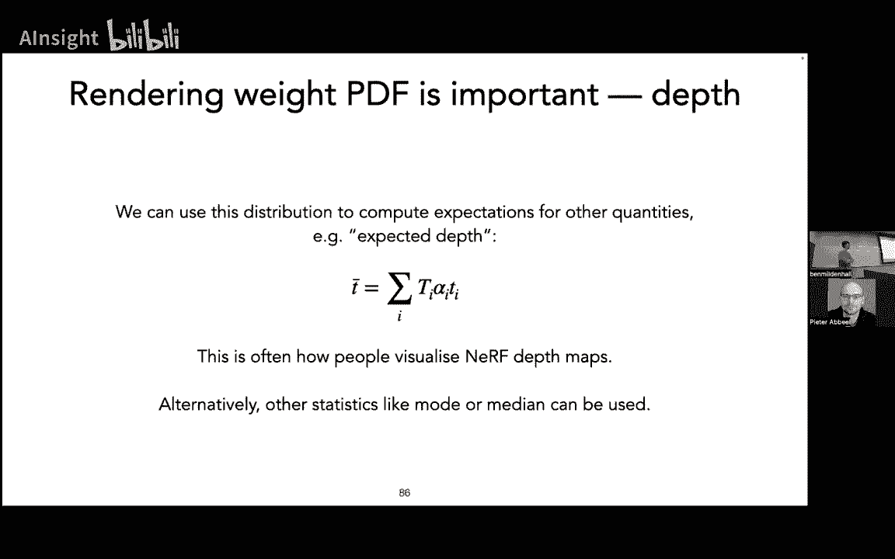

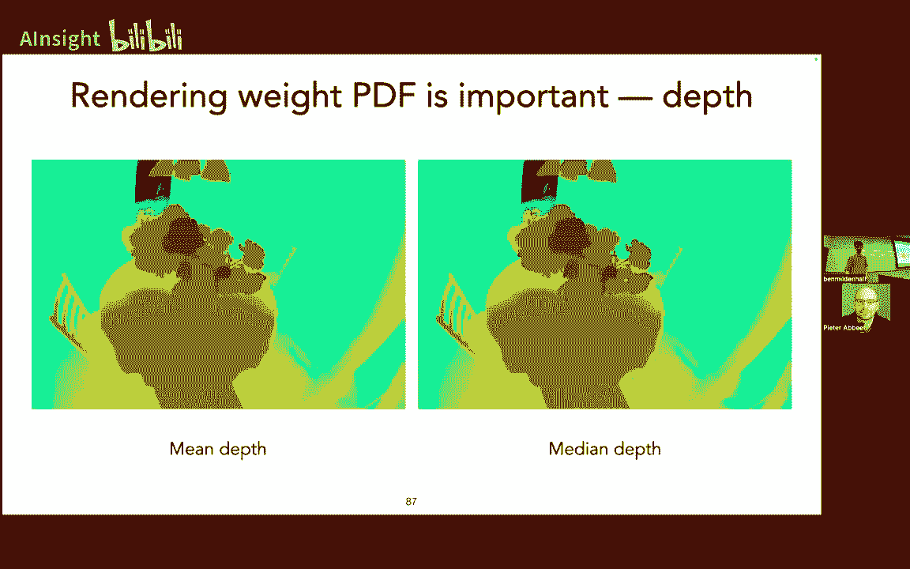

对于一条从相机出发的光线 **r(t) = o + t*d**（o是原点，d是方向向量，t是沿光线的距离），我们想计算其最终到达相机的颜色 **C(r)**。

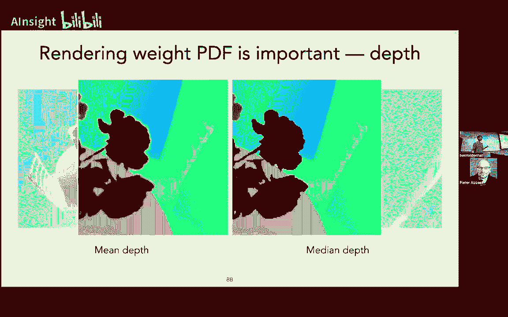

体积渲染方程通过积分计算这个期望值：

```
C(r) = ∫[t_n, t_f] T(t) * σ(r(t)) * c(r(t), d) dt
```

其中：
*   **σ(r(t))** 是t位置处的体积密度。
*   **c(r(t), d)** 是t位置处从方向d看的颜色。
*   **T(t)** 是**透射率**，表示光线从起点 `t_n` 传播到位置 `t` 而**没有**击中任何粒子的概率。它由密度场决定：
    ```
    T(t) = exp( -∫[t_n, t] σ(r(s)) ds )
    ```

在实际计算中，我们无法进行连续积分。NeRF采用数值近似方法：将光线区间 `[t_n, t_f]` 划分为N个小段，在每个段内采样一个点，并假设该段内的密度和颜色是恒定的。

由此推导出离散化的渲染公式：

```
C(r) ≈ Σ[i=1 to N] T_i * (1 - exp(-σ_i * δ_i)) * c_i
```
其中：
*   `δ_i` 是第i个采样段的长度。
*   `T_i = exp( -Σ[j=1 to i-1] σ_j * δ_j )` 是到达第i个段之前的累积透射率。
*   `α_i = 1 - exp(-σ_i * δ_i)` 可以理解为第i个段的不透明度（Alpha值）。

这个形式清晰地与**Alpha合成**关联起来。`T_i` 是之前所有层剩余的透明度，`α_i` 是当前层的不透明度，`c_i` 是当前层的颜色。最终颜色是这些层从前到后叠加的结果。

这个方程是**完全可微**的，允许梯度从渲染的像素颜色反向传播到每个采样点的密度σ和颜色c，从而优化神经网络。

此外，这个公式不仅限于计算颜色期望。通过替换被积函数，我们可以计算其他量的期望，例如：
*   **深度**：将 `c_i` 替换为采样点的深度 `t_i`，可以估算沿光线的预期深度。
*   **语义特征**：将 `c_i` 替换为从网络输出的特征向量，可以得到在3D空间中一致的特征场。

## 场景表示：从MLP到高效结构 🏗️

上一节我们掌握了渲染的数学工具，本节中我们来看看NeRF如何表示场景，以及这方面的演进。

在原始NeRF中，场景表示是一个简单的**多层感知机**。它将一个3D坐标点x和视角方向d作为输入，直接输出该点的密度σ和颜色c。
```
(σ, c) = MLP(x, d)
```
这被称为“神经隐式表示”。MLP的权重就编码了整个场景。它的优点是紧凑（原始NeRF约5MB），并且MLP本身对信号具有平滑正则化作用，有助于产生干净的重建，避免噪声。

然而，一个普通的MLP难以表示高频细节（如物体边缘、纹理）。原始NeRF引入了一个关键技巧：**位置编码**。在将坐标x输入MLP之前，先将其映射到一组高频的正弦和余弦函数上：
```
γ(x) = [sin(2^0 π x), cos(2^0 π x), sin(2^1 π x), cos(2^1 π x), ..., sin(2^(L-1) π x), cos(2^(L-1) π x)]
```
这相当于为网络提供了更高频率的输入基，使其能够轻松学习场景中的高频变化。位置编码的级数L需要仔细选择，以平衡细节重建和抗锯齿。

尽管MLP表示很优雅，但其查询和训练速度较慢。后续研究提出了更高效的显式或混合表示方法，以加速训练和渲染：

以下是几种主流改进方向：

*   **稀疏体素网格**：使用一个3D网格存储特征。查询时，对点所在网格的角点特征进行三线性插值，再将插值后的特征送入一个小型MLP生成σ和c。这比纯MLP快得多。
*   **哈希网格**：Instant-NGP等工作使用了多分辨率哈希表。将空间划分为网格，每个网格角点对应哈希表中的一个条目。通过激进的哈希函数允许碰撞，让优化过程自行解决冲突，从而用很小的内存开销实现高分辨率的细节。
*   **张量分解**：将3D体积分解为多个低秩矩阵或向量的乘积，从而压缩表示。
*   **点云与高斯**：最近的工作如3D Gaussian Splatting，完全放弃了连续的场表示，改用一系列带有各向异性协方差的3D高斯球作为显式表示。这些高斯球具有颜色和不透明度，可以通过高效的光栅化进行渲染，在训练和渲染速度上取得了巨大突破。

这些表示方法各有优劣，但都保留了NeRF核心的体积渲染和可微分优化范式。选择哪种表示通常取决于任务需求（速度、质量、内存）以及对显式控制（如动画编辑）的需要。

## NeRF的结果与总结 🎬

上一节我们探讨了不同的场景表示，本节我们通过结果回顾并总结NeRF的特点。

原始NeRF论文在合成数据集上展示了高质量的新视角合成结果，其PSNR（峰值信噪比）指标显著优于前人方法。它也能处理一些真实场景，特别是物体位于画面中央的前向捕获场景。


*NeRF对新视角的合成结果示例。*

后续工作将NeRF扩展到了更大、更复杂的无界场景（如整个房间、建筑）。

现在，让我们回顾并评估NeRF提出的几个核心思想：

1.  **MLP表示场景**：虽然证明了神经隐式表示的可行性，并具有紧凑和正则化的优点，但在追求极致效率的今天，纯MLP已不常用。不过，MLP作为解码器或处理低频信号（如形变场）的组件，仍然很有价值。
2.  **MLP表示外观**：使用MLP将位置和视角映射到颜色，以处理复杂的视点相关效果（如镜面高光），这仍然是一个有效且常用的方法。
3.  **每场景优化**：NeRF采用针对单个场景进行优化的范式，而非训练一个通用模型。这已被证明非常强大，能够扩展到极大规模的场景重建，并且简化了流程。
4.  **可微体积渲染**：这或许是NeRF最持久和重要的贡献。它提供了一个稳定、可微的框架，用于从2D图像优化3D表示。即使后来的许多方法转向显式表示（如高斯），其优化损失函数仍然建立在体积渲染的思想之上。

**总结**：在本节课中，我们一起学习了神经辐射场（NeRF）。我们从三维表示的重要性出发，了解了NeRF解决新视角合成问题的目标。我们深入探讨了其核心——可微体积渲染方程的数学原理，以及它如何通过Alpha合成实现可优化。我们还回顾了场景表示从最初的MLP与位置编码，发展到如今各种高效显式结构（如哈希网格、3D高斯）的历程。NeRF不仅推动了三维重建领域的发展，其体积渲染和可微分优化的思想也深刻影响了后续的生成式3D研究。尽管纯NeRF在动态场景处理和实时性能上存在局限，但它为更强大、实用的3D内容创建工具奠定了坚实的基础。

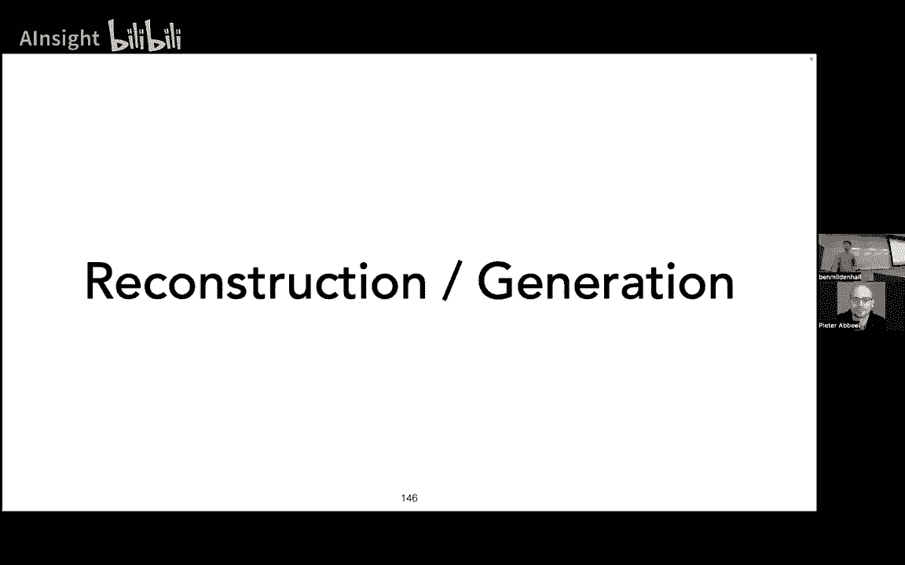

