# 13：多模态模型 🧠

在本节课中，我们将要学习多模态模型。多模态模型是一种可以集成多种模态（如文本、图像、音频、视频等）的模型。目前，研究主要集中在图像、视频和文本模态上，这主要是因为相关数据更容易获取。学习多模态模型的目标是实现跨模态的理解，并提升单模态任务的表现。

## 双向模型 🔄

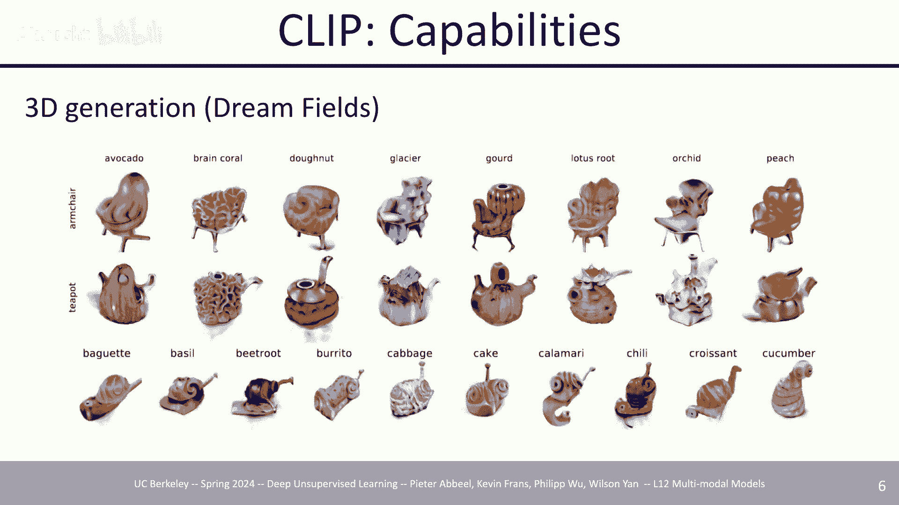

上一节我们介绍了多模态模型的基本概念，本节中我们来看看双向模型。这类模型通常使用非因果的Transformer架构，例如CLIP模型。

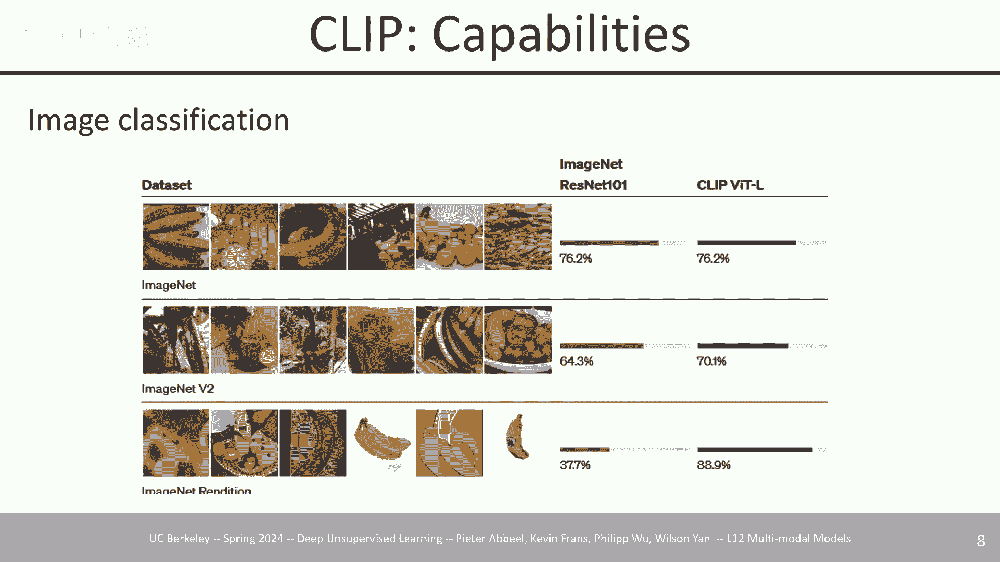

CLIP模型采用对比学习目标，同时训练一个图像编码器和一个文本编码器。其核心思想是让匹配的图像-文本对在嵌入空间中彼此靠近，而不匹配的对则彼此远离。

以下是CLIP对比学习目标的简化公式：

```
loss = -log(exp(sim(I_i, T_i) / τ) / Σ_j exp(sim(I_i, T_j) / τ))
```
其中，`sim` 是余弦相似度，`I_i` 是第i张图像的嵌入，`T_i` 是第i个文本的嵌入，`τ` 是温度参数。

CLIP模型有多种应用方式：

以下是CLIP的一些主要应用：
*   **图像分类**：计算输入图像与一系列文本类别描述的相似度，选择相似度最高的类别作为预测结果。这种方法在数据分布发生变化时，通常比仅在图像上训练的模型更具鲁棒性。
*   **生成模型指导**：在文本到图像生成（如DALL-E）或文本到3D生成（如Dream Fields）中，使用CLIP分数作为优化目标，以引导生成内容与文本描述对齐。
*   **预训练骨干网络**：CLIP的图像编码器常被用作其他视觉-语言模型的预训练视觉骨干网络，例如在机器人策略学习（如CLIPort）或指令微调模型中。
*   **零样本迁移**：由于CLIP理解了视觉概念与语言描述的关联，经过少量数据微调后，模型可以泛化到未见过的视觉概念上。

## 编码器-解码器模型 🏗️

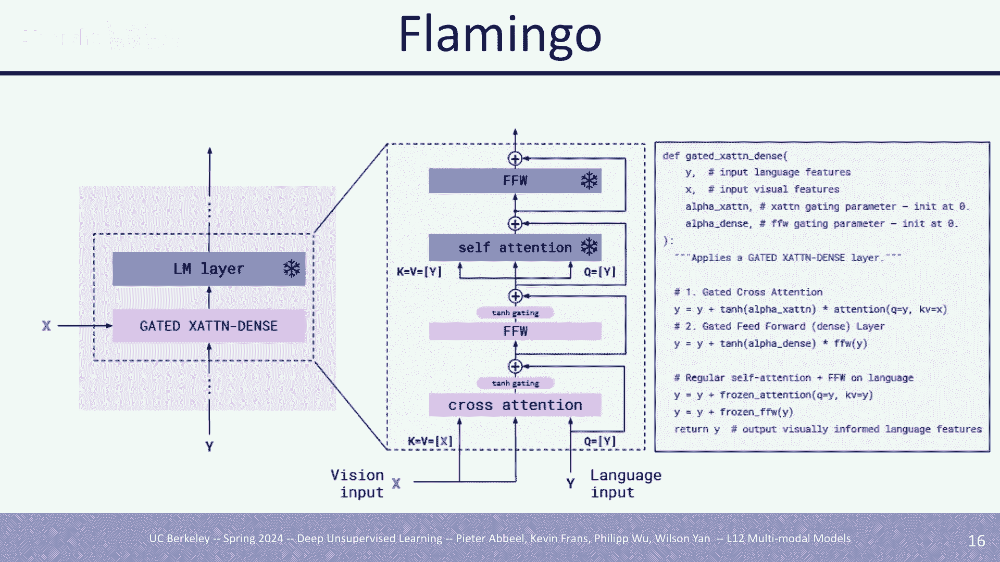

上一节我们介绍了双向模型CLIP，本节中我们来看看编码器-解码器架构的多模态模型。这类模型通常包含一个视觉编码器和一个基于Transformer的文本解码器。

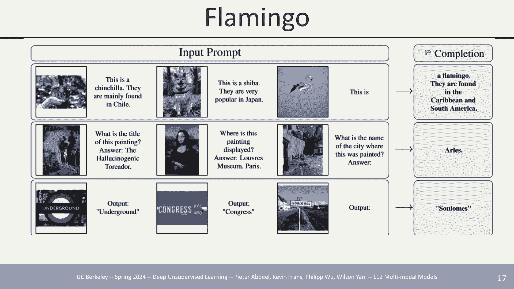

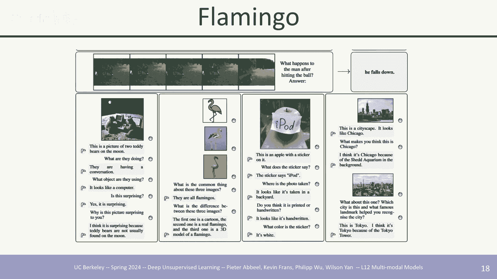

Flamingo是这类模型的代表之一。它的核心思想是在一个预训练好的纯文本语言模型（LM）中，插入可学习的“门控交叉注意力”层，使其能够基于图像信息来生成文本。

以下是Flamingo架构的简化描述：
1.  冻结预训练的语言模型。
2.  在语言模型的某些层之间插入新的“门控交叉注意力密集层”。
3.  图像首先通过一个视觉编码器（如ViT）和感知器重采样器，转换为固定数量的视觉标记。
4.  在文本生成过程中，新插入的层会对这些视觉标记进行交叉注意力计算，从而将视觉信息融入文本生成过程。
5.  初始化时，门控机制设为零，模型行为与原始语言模型一致。随着训练进行，模型学会何时以及如何利用视觉信息。

这种架构的优势在于能够处理交错的图像-文本数据（如图文对话），并支持少样本学习。

另一类编码器-解码器模型，如Poly，采用了更经典的Transformer编码器-解码器结构。图像通过视觉编码器转换为标记，然后与文本标记拼接，一起输入给编码器。解码器则基于编码器的输出生成答案。提升这类模型性能的关键因素包括扩大模型规模、提高输入图像分辨率以及使用更高质量的训练数据。

## 仅解码器模型 🧩

上一节我们讨论了编码器-解码器模型，本节中我们来看看仅解码器模型。这类模型将图像和文本都视为标记序列，统一由一个自回归的Transformer解码器进行处理。

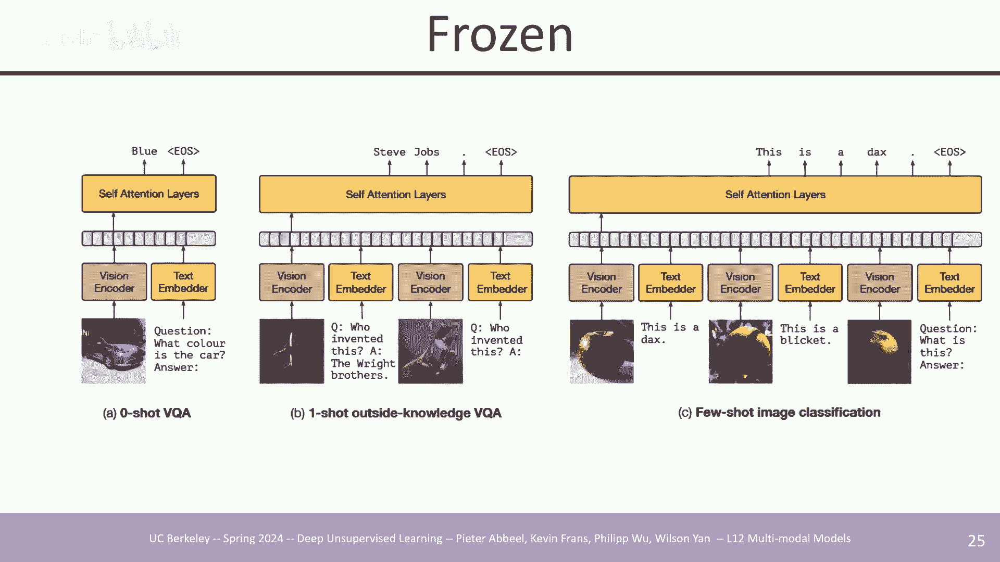

《Frozen》是早期探索这一方向的论文。其方法非常简洁：使用一个预训练的视觉编码器（如ResNet）将图像转换为嵌入向量，再通过一个可学习的投影层将其映射到文本嵌入空间。然后，将图像嵌入与文本标记嵌入拼接，输入给一个**冻结的**预训练语言模型。模型仅在图像-文本对数据上微调这个投影层，通过标准的语言建模损失（下一个标记预测）进行训练。这种方法在视觉问答（VQA）等任务上展现出了不错的零样本和少样本能力。

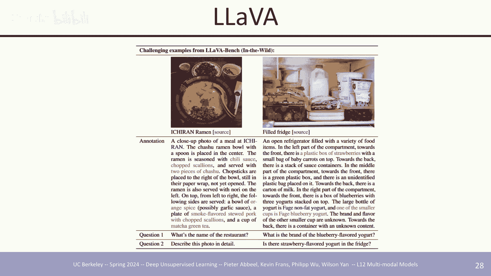

在此基础上的发展是像LLaVA和MiniGPT-4这样的模型。它们采用了类似的架构，但使用了更强大的视觉编码器（如CLIP-ViT）和语言模型（如Vicuna，一个指令微调版的LLaMA）。训练通常分为两阶段：
1.  **预对齐阶段**：冻结视觉和语言骨干网络，只训练连接两者的投影层，使用大量图像-文本对数据。
2.  **指令微调阶段**：使用高质量的指令遵循数据，对投影层和语言模型进行微调（有时保持视觉编码器冻结），以提升对话和推理能力。

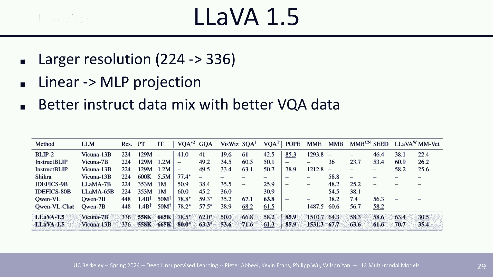

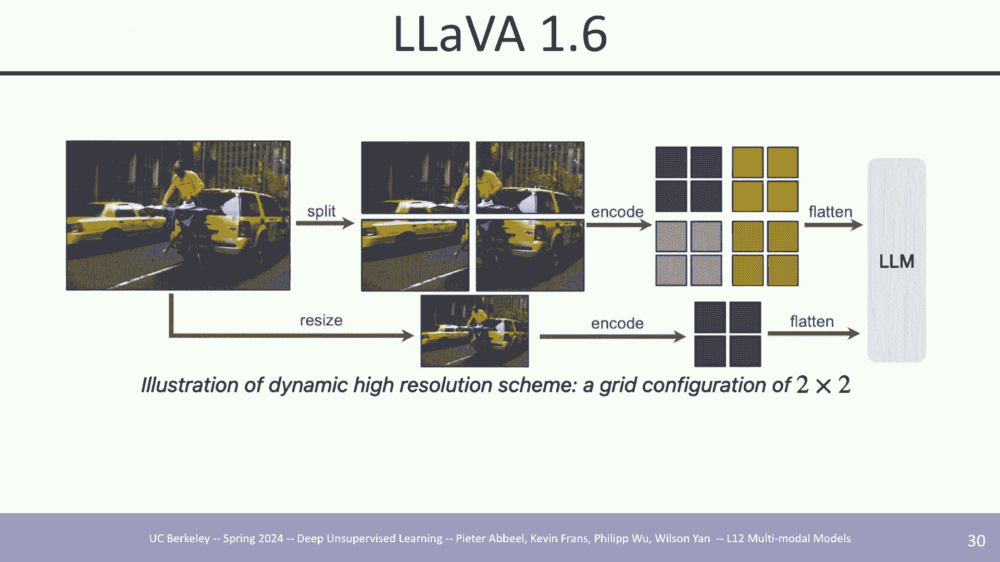

为了处理高分辨率图像，LLaVA-1.6等模型采用了分块编码策略。将高分辨率图像切割成多个小块分别编码，同时保留一个全局的低分辨率视图编码，然后将所有视觉标记扁平化并拼接输入给语言模型。这种方法显著提升了对文档、图表等细节丰富图像的理解能力。

## 大规模模型的能力与局限 🌐

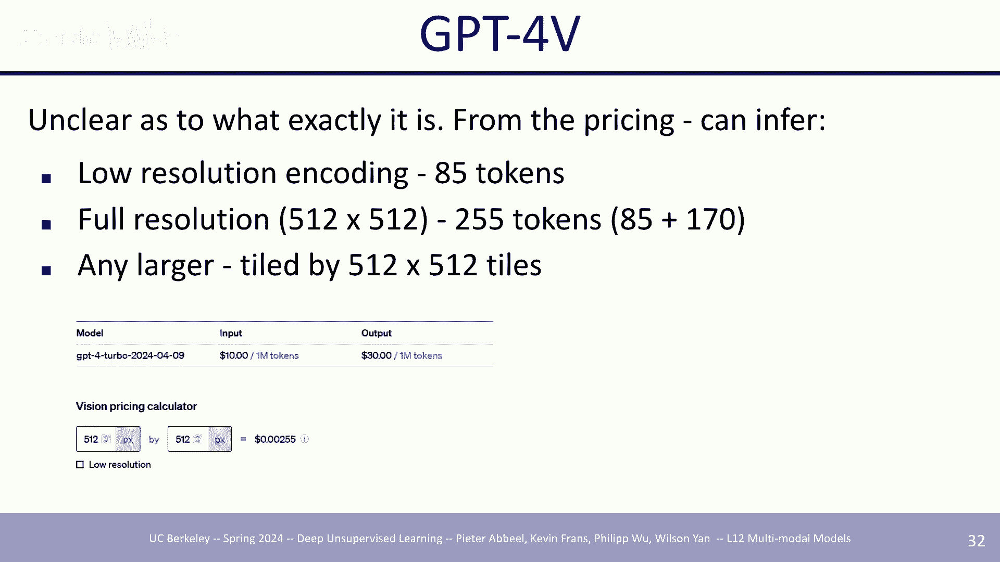

上一节我们介绍了仅解码器模型的架构，本节中我们来看看像GPT-4V这样的大规模多模态模型所展现的能力及其局限性。

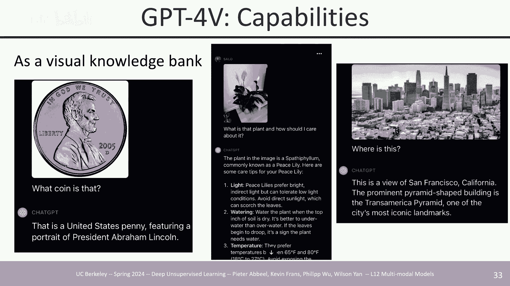

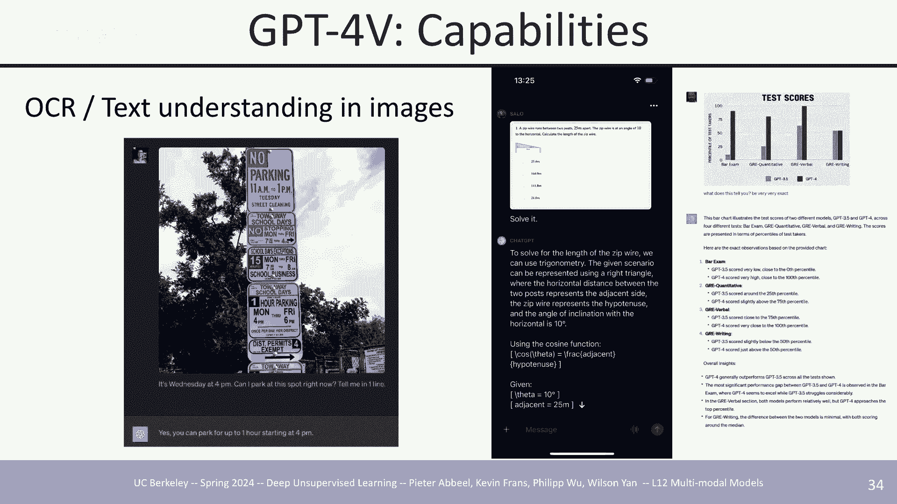

这些模型就像一个融合了视觉知识的“知识库”。它们不仅能识别常见物体，还能认知著名地标、艺术作品，甚至理解一些文化背景信息。

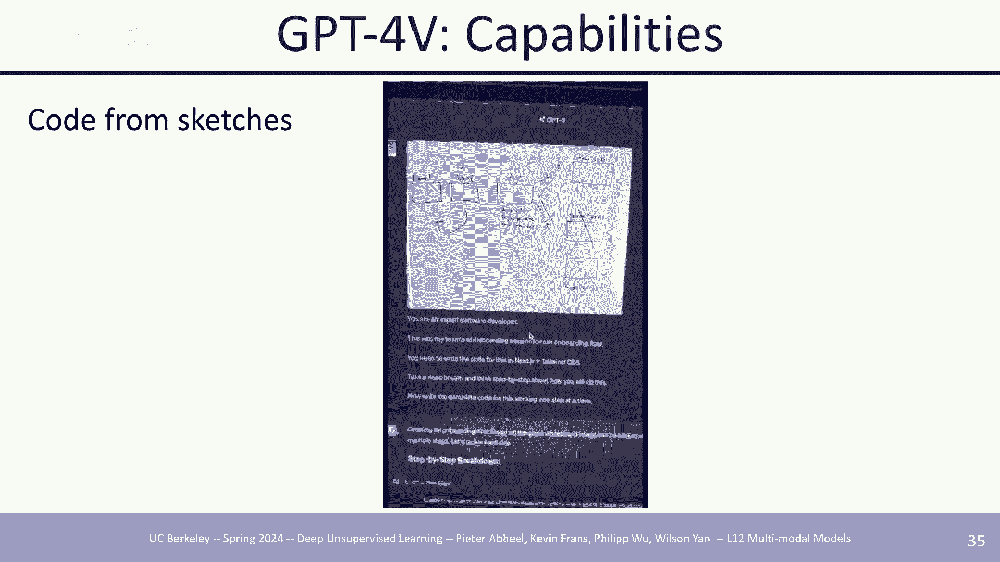

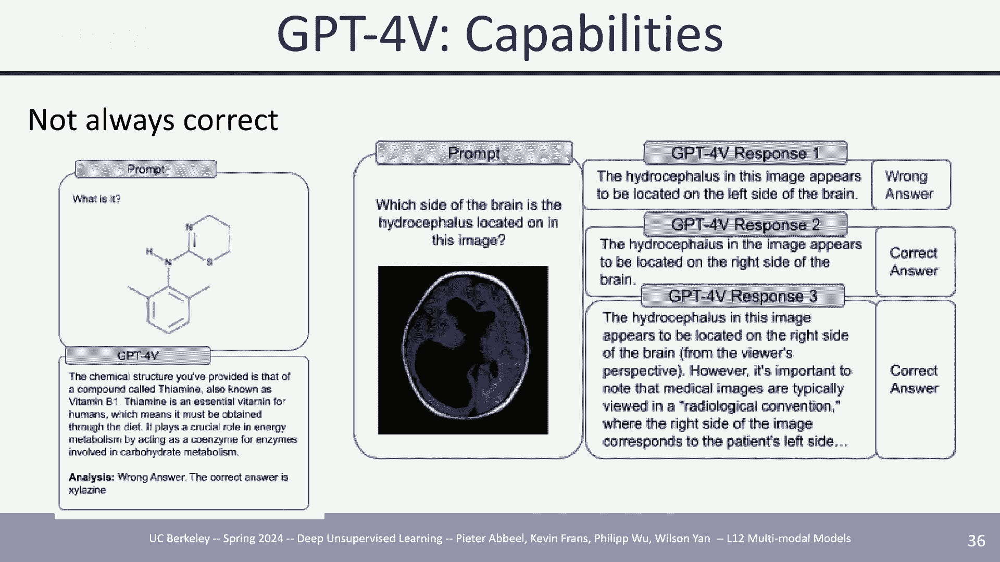

以下是GPT-4V等模型展示出的核心能力：
*   **复杂视觉推理**：能够解析包含多个约束条件的图像（如复杂的路标），并进行逻辑推理以回答问题。
*   **光学字符识别与文档理解**：可以阅读图像中的文字，并理解表格、图表和文档的布局与内容。
*   **多模态知识问答**：结合视觉信息和内部知识，回答涉及科学、历史、文化等领域的问题。
*   **代码生成**：根据图表或示意图，生成大致的实现代码（尽管可能不完美）。
*   **长视频理解**：如Gemini 1.5 Pro所示，能够处理长达数小时视频，并完成针检索、基于内容的问答和视觉检索等任务。

然而，这些模型也存在明显的局限性：
*   **幻觉**：模型可能会生成看似合理但实际错误的内容，尤其是在专业领域（如医学影像分析）。
*   **视觉理解错误**：对空间关系、数量、细节等仍可能产生误解。
*   **复杂视频理解不足**：对于需要深层叙事理解、角色动机分析或复杂事件链推理的视频内容，模型能力仍然有限。

## 多模态生成模型 🎨

前面几节我们主要讨论了以文本为输出模态的模型，本节中我们来看看能够生成多种模态的模型，即多模态生成模型。

一个代表性的工作是CoDi（复合扩散模型）。其目标是构建一个单一的模型，能够接受图像、视频、文本、音频的任意组合作为输入，并生成这些模态的任意组合作为输出。实现这一目标的关键是学习一个所有模态对齐的**联合嵌入空间**。CoDi通过分阶段训练实现：首先分别训练各模态到文本的对齐编码器；然后训练条件于文本的各个模态生成器；最后进行多模态条件微调，利用对齐的嵌入空间实现跨模态条件生成。

另一类工作专注于图像与文本的互生成，如Emu和CM3。这些模型通常将视觉编码器（如CLIP）产生的图像嵌入视为一种特殊的“标记”，与文本标记一起输入给一个自回归Transformer。模型通过训练学习预测下一个文本标记或回归出下一个图像嵌入。为了生成高质量图像，它们通常会额外微调一个扩散模型解码器，将预测的图像嵌入解码为像素图像。通过精心设计训练数据（交错排列图像和文本标记），模型可以学会根据上下文决定是生成文本描述还是生成图像。

类似的思想也被扩展到视频生成，例如Video LLaMA和Mirasol。它们将视频帧（或关键帧）编码为离散标记序列，与文本标记一同进行自回归预测，最终通过专门的视频解码器生成高质量视频。

## 总结 📚

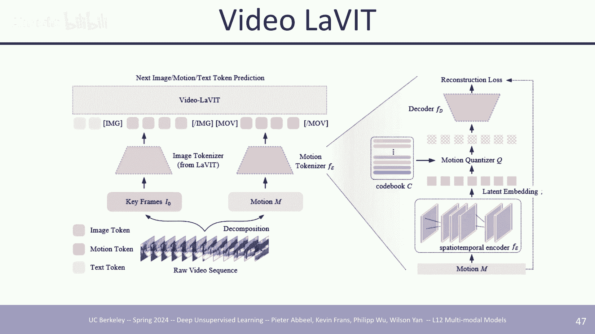

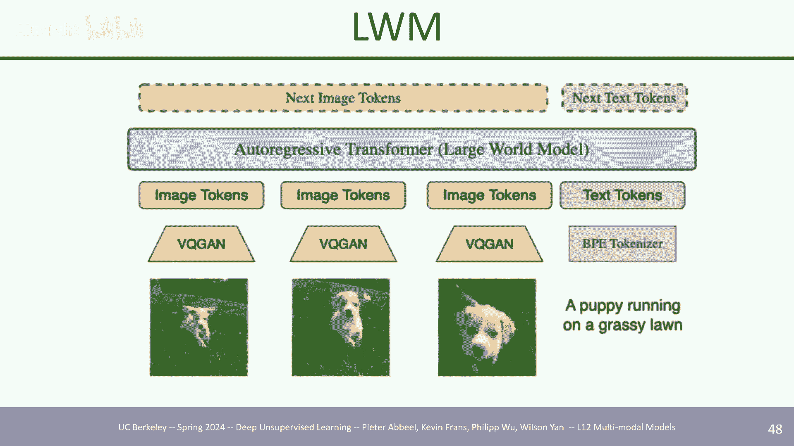

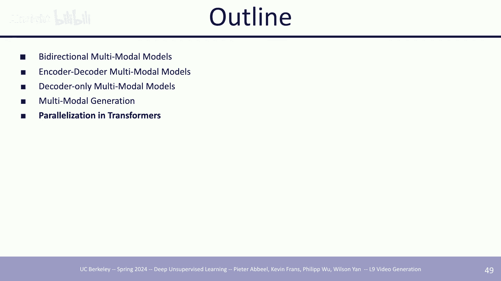

本节课中我们一起学习了多模态模型。我们从双向模型CLIP及其应用开始，了解了它如何通过对比学习对齐视觉与语言。接着，我们探讨了编码器-解码器模型（如Flamingo, Poly）和仅解码器模型（如Frozen, LLaVA）的架构与训练方式。然后，我们审视了GPT-4V等大规模模型展现出的强大能力与当前存在的幻觉、理解错误等局限性。最后，我们介绍了旨在实现任意模态间输入输出的多模态生成模型，如CoDi。多模态模型正在快速发展，但在深层次理解、可靠性和复杂推理方面仍面临诸多挑战。