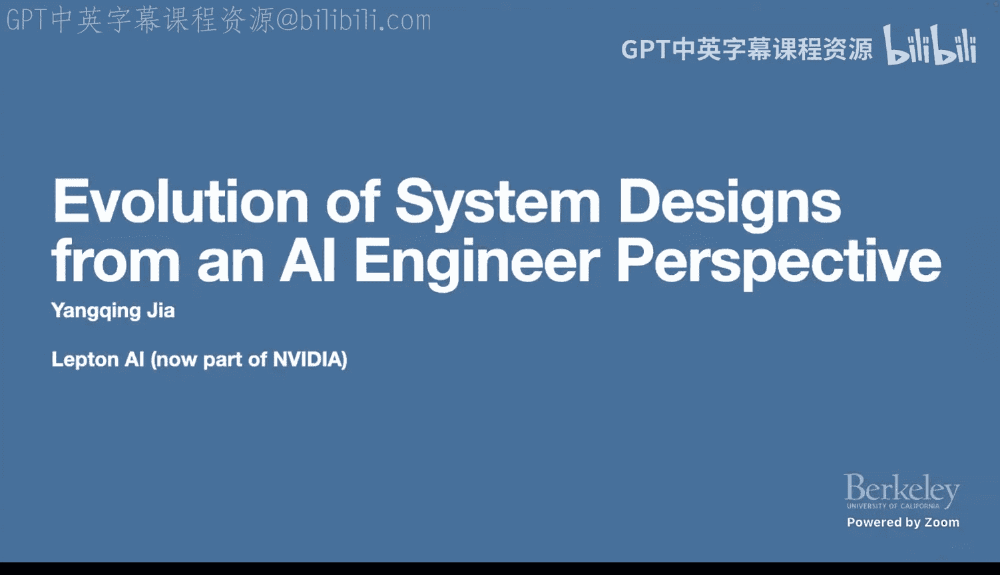
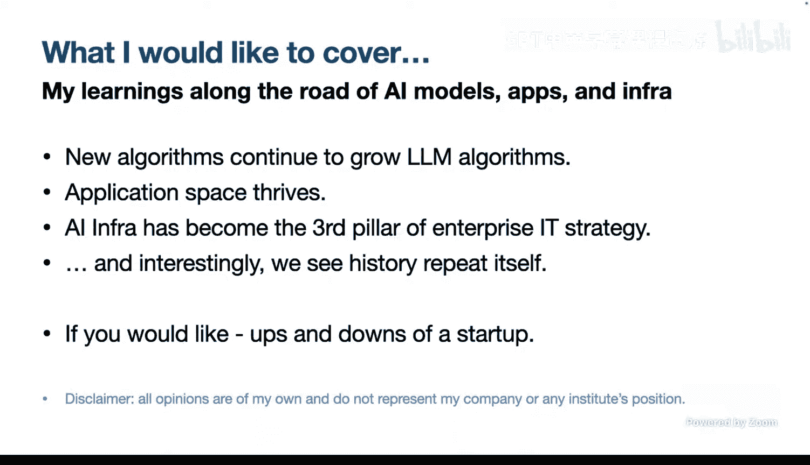
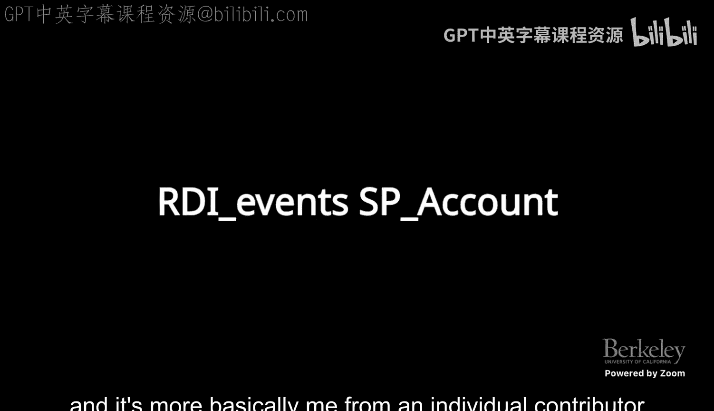
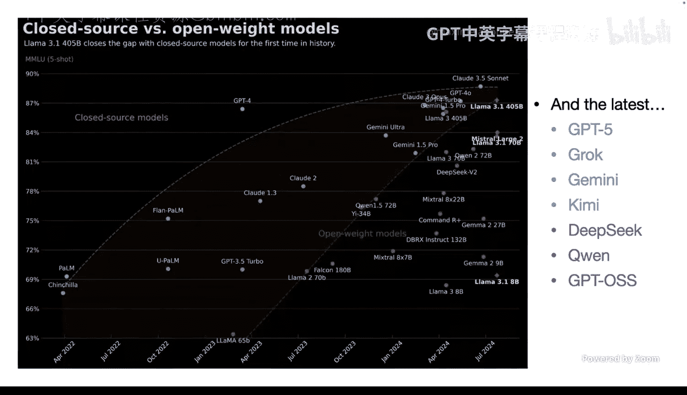
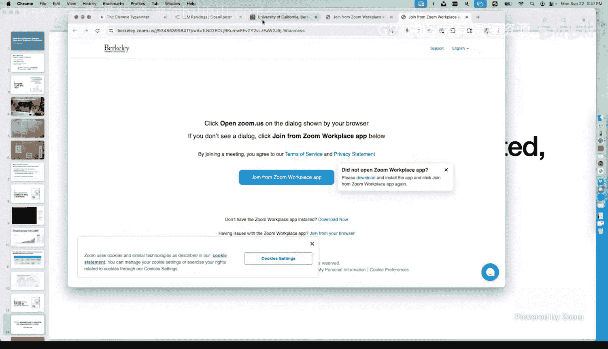
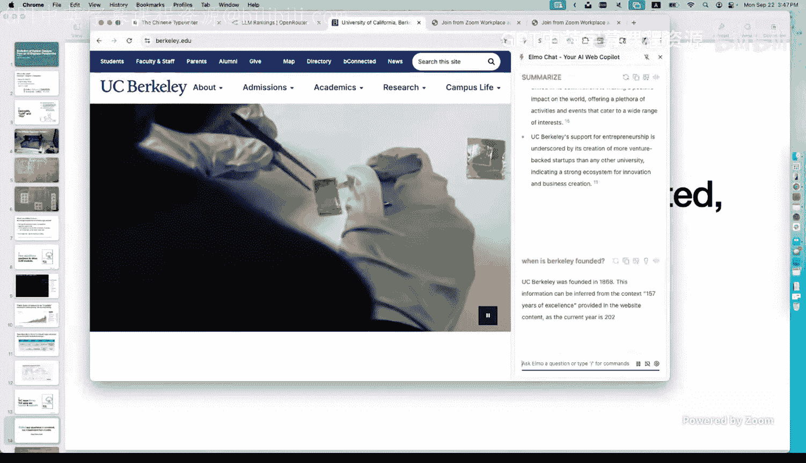
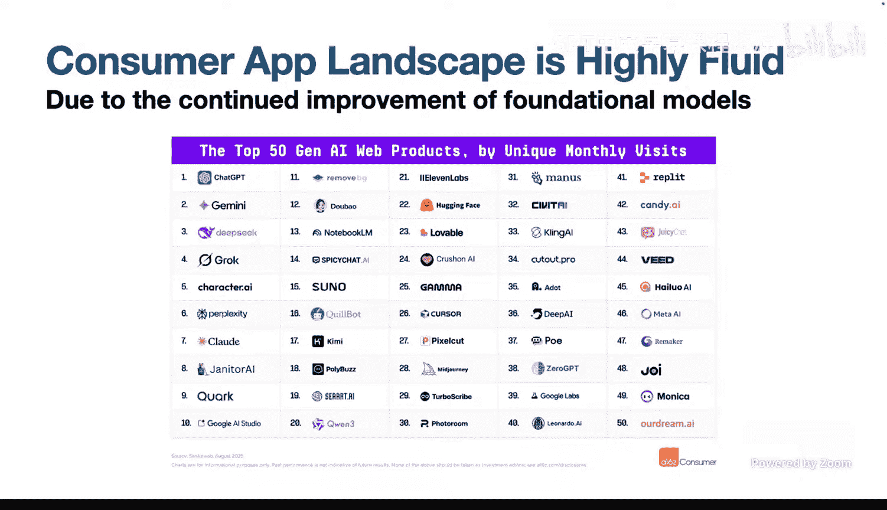
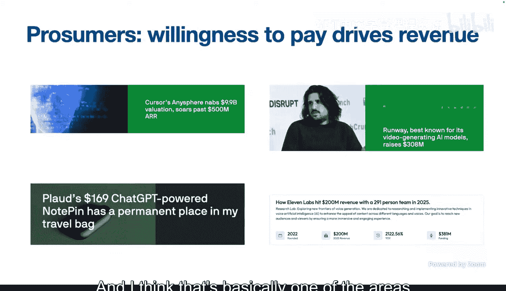
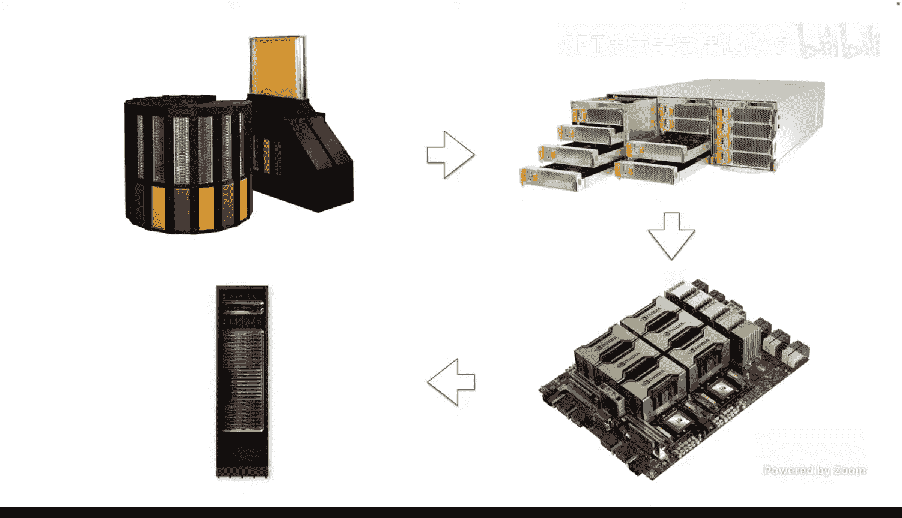

# 2：系统设计的演进

## 概述
在本节课中，我们将从AI工程师的视角，探讨AI系统设计的演进历程。我们将回顾从早期AI框架到现代大规模语言模型基础设施的发展，分析当前应用格局，并展望硬件与软件协同设计的未来趋势。

## 引言
很荣幸邀请到英伟达副总裁杨庆先生来做今天的客座讲座。杨庆在AI系统领域做出了许多卓越的工作。他毕业于伯克利，是Caffe框架的创建者，参与了许多开源项目，也曾在Penflow工作。他创立的公司被英伟达收购，目前担任英伟达副总裁。今天，他将从AI工程师的视角，探讨系统设计的演进。

## 第一部分：模型算法的演进

上一节我们介绍了课程概述，本节中我们来看看模型算法的核心思想及其演进。

一个有趣且非纯粹科学的思考起点是AGI（通用人工智能）这个术语。人们常说模型神秘且越来越智能。模型确实在变得更智能，但它们真的是神秘地变好，还是基于我们在计算机科学基础课程中学到的简单原则构建的呢？

以中文输入法为例。英文打字是直接的，你按A键，屏幕上就显示A。但中文打字则不同，键盘上没有直接的汉字键。早期的解决方案是制造一个拥有3000到5000个常用汉字的大型物理键盘，通过移动机械臂来选取字符。这种方式效率极低，因为当前字符与下一个字符之间的距离影响很大。

于是，人们开始变得聪明。在20世纪20到30年代，他们开始思考如何将字符分组，以最小化机械臂的移动距离。他们去图书馆，开始统计我们今天称为二元组和三元组的东西，即给定前一个或几个字符，预测下一个字符。在今天的LLM术语中，我们用一个更花哨的词来称呼它：**下一个词元预测**。

我们有一个模型，观察前面的内容，然后预测下一个词元。这与我们打字时的逻辑相似。区别在于，过去人们手动进行这些统计，无法处理得非常细致，可能只能统计前两三个字符。传统的N-gram模型受限于此，因为相关矩阵会变得多维且复杂。而今天，我们可以观察所谓的**上下文长度**。现代模型通常拥有数百万词元的上下文长度，因此可以观察大量先前的上下文来预测下一个词元。正如一些人所说，这是一种压缩模式，将知识压缩到预测下一个词元的过程中。通过这个简单的动作并生成序列，就能够捕捉到许多隐含的智能。

许多这些基本思想以类似的方式出现，当然，伴随着更复杂和强大的模型。

### 当前模型格局
自ChatGPT甚至更早的模型（如Google的Chinchilla和PaLM）以来，G35真正开启了LLM的热潮。我们每六个月就会自问：模型质量是否已经达到平台期？但直到今天，我们似乎仍未看到效果上的平台期。闭源模型和开源模型这两条线持续进行着健康的竞争。

以下是当前模型格局的一些观察：
*   **闭源模型**：如G5、Gemini等，在绝对质量上持续领先，尤其是在推理等新能力方面。
*   **开源模型**：如Llama、DeepSeek、Qianwen等，与闭源模型的差距正在迅速缩小。2023年差距可能有一年多，而今天我们认为差距在六个月左右。当有新方法出现时，开源模型通常能很快跟上。

### 是否存在泡沫？
人们常问，现在有这么多模型，我们是否处于一种自我实现的预言中，只训练模型而不选择它们？是否存在泡沫？我倾向于使用更客观的衡量标准，而不仅仅是科技新闻。

有一个很好的网站叫Open Router，它聚合了许多模型，提供统一的API，方便人们使用。一个副作用是，它可以观察模型的使用情况。数据显示，从2024年甚至更早开始，模型的使用量在激增。大约一年前，日消耗量在500亿到600亿词元左右，而今天这个数字大约是4.9万亿，增长了约10倍。显然，我们看到了对这些模型非常扎实的使用。

图表显示，在消费量排名中，闭源模型和开源模型之间存在着激烈的竞争。GraphQ、Anthropic、Gemini等闭源模型，以及DeepSeek等开源模型都表现良好。按应用领域排名也显示，不同应用有不同的热门模型。这确实是一个好地方，如果你对深入分析不同模型的动态数据科学感兴趣。

### 研究视角的演进
从研究角度看，为什么总有新事物不断让我们兴奋？以下是我个人的理解：
*   **2022年 - 结构创新**：GPT的出现类似于十多年前的AlexNet，这是一次根本性提升文本理解能力的结构创新。
*   **2023年 - 混合专家**：当人们认为模型可能达到极限时，混合专家模型出现了。它使用大规模稀疏模型，稀疏激活部分参数，在保持良好质量的同时提高了效率并减小了模型尺寸。
*   **2024年 - 测试时扩展与强化学习**：当使用简单损失函数训练模型似乎达到平台期时，我们发现了测试时扩展，让模型在测试时“思考”更长时间，反思其中间结果以获得更好结果。更重要的是**强化学习**的大规模应用。强化学习允许我们以更原则化的方式定义更复杂的损失函数，将模型的预测结果与长期目标对齐。

如果我们观察技术成熟度曲线，可以看到很多想法迭代和演进得非常快。检索增强生成（RAG）才出现一两年，就已经过了炒作高峰，现在正在趋于平稳。而目前我们看到提示工程和智能体AI正变得越来越重要。

## 第二部分：应用格局与构建思路

上一节我们探讨了模型算法的演进，本节中我们来看看基于这些模型的应用是如何构建和发展的。

这引出了一个非常有趣的问题：在这个时代，我们如何思考在LLM之上构建应用？你可能记得RAG或搜索增强聊天机器人曾经是大事，它仍然是，但现在每个人都在谈论智能体。我们如何思考应用以及如何构建应用？

在Lepton AI的日子里，我们不可避免地要观察人们正在构建什么样的应用，以便更好地为他们服务。我们观察到通常有两种类型的应用：一种是消费者应用，另一种是商业服务或企业服务。今天，我们看到消费者应用蓬勃发展，因为模型确实非常智能，能够激发大量的创新、创造力、娱乐和生产力。企业应用虽然具有创造巨大商业价值的潜力，但众所周知，企业变革较慢，所以我们才刚刚看到其兴起。

### 一个简单的应用实例
我想讲一个故事，这真实地发生在我们的一些工程师身上。春节期间，我与一位在新加坡的工程师聊天，他说很无聊，除了被父母催生，没别的话题可聊。于是他决定构建一个应用。

我们当时在想，有这么多博客文章，消费涌入我们浏览器的大量信息真的很难。如果有一个机器人住在浏览器旁边，帮助我们消化和分析信息，那该多容易。于是，在两天内，这位非常聪明的工程师构建了一个至今仍在运行的应用。

它的工作原理是：假设我们打开了伯克利的首页，我太急于了解伯克利是什么。于是我对这个小应用说：“请为我总结一下。”它就像一个人一样阅读网页，然后给我总结，例如“伯克利是一所领先的公立研究型大学，以其开创性研究、顶尖学术项目和充满活力的学生生活而闻名，致力于创造更美好的世界”等等。我还可以问问题，比如“伯克利是什么时候成立的？”希望它能正确回答我（1868年）。这类应用使得我们能够构建以前不可能实现的东西。

### 消费者应用格局
消费者应用领域呈现出高度流动和竞争激烈的态势。每半年，a16z会发布一份名为“前50名消费网络产品”的报告。可以看到，有很多应用，大致可以分为几类：
*   **聊天**：是最大的主题，如ChatGPT、Gemini、DeepSeek、Grok等。
*   **代码**：变得越来越突出，如Cursor、Replit等。
*   **搜索**：如Perplexity（由伯克利毕业生创立）等。

这个格局变化非常快。报告显示，有11个应用在短短六个月内就进入了前50名。人们不断在问：护城河是什么？因为底层LLM模型表现很好，一个应用可能很快被其他应用超越。一个突出的例子是Jasper AI，它在GPT-3.5时代起步，是一个编辑器助手，但由于聊天模型变得太好用，它不得不转向其他领域。

### 成功的模式：聚焦生产力
我们看到的一个明显趋势是，如果应用针对的是专业人士（即生产力工具），用户似乎非常愿意付费。以下是一些成功的例子：
*   **Cursor**：已嵌入许多编码实践。
*   **Runway**：多媒体创作和编辑工具，深受内容创作者喜爱。
*   **Code Cloud**：一个有趣的硬件初创公司，提供信用卡形状的录音设备，连接语音识别和GPT，用于总结会议内容，深受法律、咨询和医疗行业人士喜爱。
*   **Eleven Labs**：拥有出色的语音模型。

这些公司的年收入都达到数亿美元。其背后的逻辑是，当工具涉及生产力时，作为消费者，我非常愿意付费。例如，我可能会为Midjourney玩一玩，但不愿意每月花20-50美元。但如果这是编码工具，或者我是内容创作者，为了把工作做得更好，我愿意付20美元吗？当然愿意。

从一个初创公司的角度来看，每个新员工需要配置的工具成本（GitHub、Google Workspace、Slack、1Password、GitHub Copilot等）很容易达到每月几百美元。因此，专注于生产力的智能初创公司在这方面做得非常好。

### 企业应用：潜力与挑战
当我们思考企业应用时，情况处于一个有趣的位置。许多企业应用的增长速度比传统应用快，但不如消费者端的Cursor或Perplexity那么快。

企业应用有独特的壁垒，需要大量工作。例如，我们每天都在使用搜索（Google等），但在工作中使用什么搜索引擎呢？通常有两种答案：一是没有好的搜索引擎，因为各种工单等信息无法聚合；二是公司有自己的内部搜索工具，但质量不高。

有一家初创公司叫Glean，花了三年多时间达到1亿美元的年经常性收入。它的理念是连接多个数据源（如Google Drive、GitHub、内部Wiki、Microsoft 365等），集成身份验证和访问控制，为每个人提供一个基于其可访问的公司信息集的搜索引擎。这需要处理很多“脏活”，但解决了企业的一大痛点。结合AI后，它做得相当不错。

因此，在思考AI潜力并回答是否存在泡沫时，尤其是在尚处萌芽阶段的企业市场，仍然有很大的潜力。Glean是一个例子，还有其他公司如Spellbook（法律AI）等。人们通常从使用闭源模型构建端到端应用开始，随着数据积累，开始构建自己的模型。

关于OpenAI和Anthropic是否会接管世界的争论一直存在，但在行业中我们看到的情况不同。以Duolingo为例，有人曾认为AI模型出现后，Duolingo会消亡，但并非如此，它活得很好。我们发现，Duolingo能够利用AI模型（可能是OpenAI的）更高效地创建内容和创新内容。这形成了一种互补关系：更好的AI模型结合Duolingo在语言学习方面的深厚专业知识，产生了1+1>2的效果，提升了整个产品和体验的质量。我认为这种模式将持续下去，我们会看到模型构建公司和应用公司之间健康的协同效应。

## 第三部分：AI基础设施的演进

上一节我们探讨了应用格局，本节中我们将深入基础设施层面，讨论AI推理和训练为何与传统云不同。

当然，所有这些公司都需要云基础设施来支持大规模扩展。今早的最新消息是，英伟达和OpenAI宣布将投资约1000亿美元用于计算基础设施，以构建和扩展下一代模型。这就是我们在基础设施领域看到的巨大规模。

总的来说，我认为从ChatGPT之前，甚至2020年代开始，我们发现AI基础设施已成为IT或云战略的**第三支柱**，不再只是谷歌云等的一部分，而是真正自成一体。

### 三大计算支柱
那么，我们所说的支柱是什么呢？
1.  **科学计算（1970年代）**：大量计算需求来自科学计算。在伯克利山上，有NERSC（国家能源研究科学计算中心）。如果你上过James Demmel教授等开设的并行计算导论课，你会知道其中很多内容是关于如何在CPU集群上进行大规模矩阵运算等。这些应用是物理、天气模拟等。
2.  **Web服务云**：当人们希望别人来处理计算实例时，开始了虚拟私有服务器的业务，最终演变为我们今天所知的云（AWS、GCP、Azure等）。我们称之为传统云，因为它始于Web服务时代。需求是托管一堆机器，在上面进行虚拟化，运行微服务或小工作负载，使其更灵活，让人们无需担心机器运维和某些网络流量。
3.  **数据云**：随着Web 2.0理念（用户生成内容、匹配用户内容和消费者兴趣）的出现，对数据分析的需求很大。于是，围绕2014年，出现了两家有趣的公司：Snowflake（云数据仓库）和Databricks（基于Spark）。这确立了数据云的理念，即存在海量数据和分布式计算。

### AI计算的不同范式
在2020年代，当我们开始做AI时，我们发现很多模式都不同。因为今天我们需要进行大量的低精度浮点计算。它需要用相对较少的数据，但进行大量的计算和通信，这与古老的科学计算时代有些相似。

更抽象地说，有两个参数主导着我们如何思考基础设施：一是**数据移动或IO**，二是**数值计算**。
*   **Web计算**：有大量IO（移动网页、图像等），计算不多，工作负载类似于微服务，是易并行化的。
*   **数据计算**：仍然有大量IO，但计算并非完全易并行化，需要使用Spark或MapReduce等抽象来执行一个大的分布式SQL查询。
*   **AI计算**：计算量远大于IO。我们经常谈论大型训练数据集，但那通常是TB或PB级，而计算量巨大。训练一个图像模型就需要1 exaflop的计算量。我们过去常开玩笑说，如果整个伦敦市的人都用笔计算，需要4000年才能训练一个模型。而今天的LLM甚至更大。它是高度分布式的，但容错性不同。在AI计算中，如果你启动分布式训练，其中一台GPU机器宕机，整个训练任务就失败了，你需要重启整个任务。

### 传统云价值主张的转变
传统云的价值主张源于Web云时代，但在AI世界中有所不同：
*   **软件栈**：AI领域的应用种类不多，主要是AI框架（如PyTorch、TensorFlow）及其上的依赖库（如Megatron-LM、Lightning AI），相对简单统一。
*   **工作负载**：高度统一，主要是大量的数值计算或矩阵运算，计算模式简单。
*   **物理层**：更刚性。在传统云中，微服务在虚拟化上运行良好，可以在不同机器间迁移工作负载。在AI云中，当你启动一个需要多台GPU机器的大型训练任务时，这些机器通过高性能网络物理连接在一起。如果一台机器宕机，你需要移动整个任务，关闭所有机器，再找另一组机器重新运行。
*   **资源互换性**：在传统云中，白天用CPU机器服务网络流量，晚上可以重新用于数据分析。但在GPU领域，工作负载的互换性较差，因为GPU专精于数值计算，不能很好地运行Web服务。

这推动了近年来所谓“新云”的出现。分析师网站SemiAnalysis coined了“新云”这个术语，指那些专注于AI计算和工作负载、聚合GPU、而不太担心数据库服务等的公司。最突出的有CoreWeave、Lambda、欧洲的Nebius等。它们通过提供更以AI为中心的计算资源来展示其价值，从而降低成本、提高可用性。当然，超大规模云厂商也进入这一领域，创建更以AI为中心的服务。

### 开发与运维的冲突
原因在于，你不能只是拿到一堆GPU就开始运行。我与一位创始人CEO聊过，他说他花了太多时间在管理GPU上。通常有两种选择：一是内部团队用Excel等工具管理集群（我们在伯克利时代就这样做过）；二是使用Kubernetes。Kubernetes是一个很好的抽象，但通常面向站点可靠性工程师或运维人员。当你将Kubernetes类型的抽象提供给AI研究人员时，他们会说：“不，我不想知道Pod、Deployment、并行度这些概念。作为AI研究员，我只想要一个简单的思维模型：我拿到四台机器，设置好MPI，运行这个PyTorch作业，然后快乐地等待结果。如果其中一台机器宕机，请给我另外四台机器运行同样的东西，直到成功。我不想处理Kubernetes。”这是当今的一场“圣战”，是研究人员思维与Kubernetes运维思维之间的冲突。

根本问题在于开发效率与运维效率存在冲突。开发人员希望事情简单抽象，提交作业就能运行。然而，GPU确实会出故障。从Facebook运行其集群的分析可以看出，有很多原因（软件错误、GPU内存问题、网络问题）会导致机器宕机。因此，你需要某种抽象来隐藏这些运维负担，为开发人员提供一个看似稳定的环境，让他们安心工作，而不是在半夜修复GPU。

### 行业最佳实践
我们发现，当今许多初创公司的最佳实践包括以下四点：
1.  **建立多云供应链**：因为GPU仍然供应短缺，当你需要2000块GPU训练模型时，当前的供应商可能没有，但另一个州的供应商可能有。你需要找到在不同云之间平滑迁移作业的方法。
2.  **关注利用率**：由于GPU非常昂贵，你需要确保积极监控利用率，避免浪费闲置的GPU时间。
3.  **采用AI原生平台**：寻找一个能抽象掉Kubernetes术语、让你专注于训练作业的AI原生平台。
4.  **利用现有框架**：可以基于这些框架和平台构建自己的模型和应用团队。

一些很好的例子（聚焦伯克利相关的）：
*   **Ray**：一个开源项目，最初服务于强化学习，现在是一个通用计算框架。
*   **Anyscale**：支持Ray并进行商业化的公司。
*   **SkyPilot**：一个有趣的新项目，允许人们找到高效的计算资源，并协调跨云的工作。

以著名的编码公司Cursor为例，他们会使用标准化的SaaS服务来稳定其推理工作负载，然后将精力集中在设计和训练下一代编码模型上，这将是公司的关键竞争力。这似乎是我们行业中观察到的常见最佳实践。

### 产品化带来的传统智慧回归
很多事情看似不同，但最终，当AI基础设施进入产品化阶段时，很多操作集群和服务的传统智慧又开始回归。我喜欢展示这张图，因为它表明AI基础设施在进入产品阶段后并无不同。

例如，在一个周六下午，我们的一位客户正在运行大规模聊天机器人，突然发现服务波动。经过调查，发现是一个非常经典的错误：他们的一位工程师意外关闭了在我们平台上服务的主要模型。当然，所有请求都开始堆积等待。当你重启服务时，第一台副本机器启动并开始接收流量，所有疯狂的流量涌入，这台可怜的机器立刻被压垮。第二台机器启动，同样被压垮。这是AWS区域故障恢复时经常发生的典型“惊群”问题。我们知道这个情况，于是在周六下午，我们坐下来讨论，在服务前放置一个流量调节器，只允许一定量的流量逐渐进入，让服务慢慢升温。大约15分钟后，我们恢复了整个服务。我们意识到，这与传统的Web服务没什么不同。因此，当我们关注AI模型的产品化时，所有这些传统智慧都变得有帮助。

## 第四部分：硬件与软件的协同演进

上一节我们讨论了AI基础设施的独特挑战，本节中我们来看看硬件