# 4：训练智能体模型 🚀

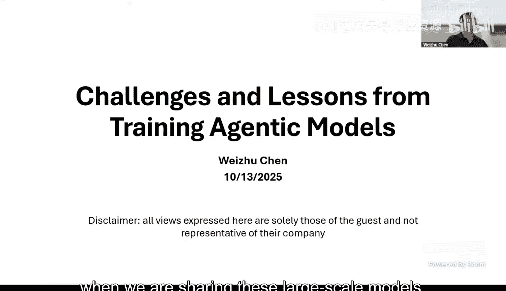

在本节课中，我们将学习如何训练智能体模型。我们将以代码智能体为例，探讨在工业界构建此类模型时，数据、评估和效率等核心方面的实践方法。课程内容基于实际工作经验，旨在分享教科书之外的有效策略。

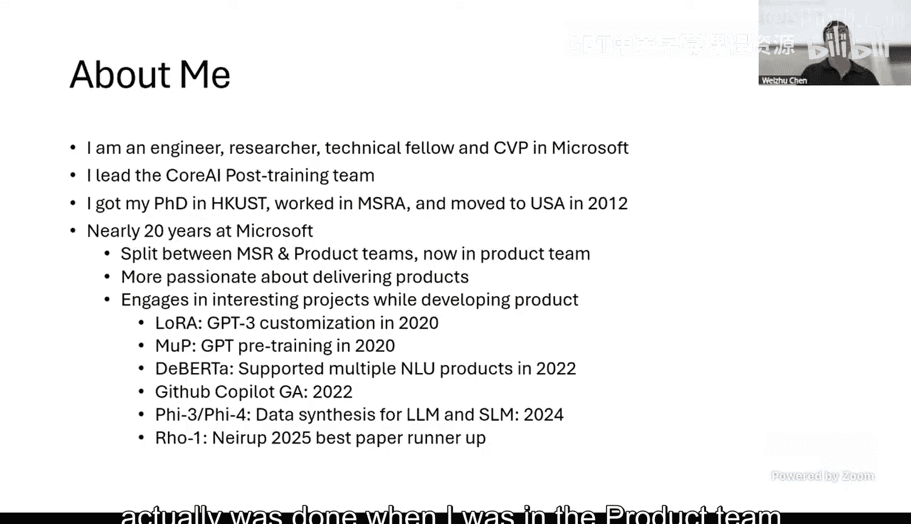

---

## 关于我 👨‍💻

我叫陈伟柱。我是一名工程师，同时也是一名研究员。我领导通用团队和训练团队，目前大部分精力集中在强化学习训练上。我在香港大学获得了博士学位，曾在微软研究院工作，并于2022年来到美国。我在微软工作了大约20年，时间分配在研究院和产品团队之间。目前我在产品团队，因为我更热衷于构建真正能工作的产品。我发现，在产品团队中，我的研究产出反而更高。我展示的大部分工作都是在产品团队期间完成的。

## 智能体模型训练概览 🤖

今天我想重点讨论模型训练，而非模型推理。我坚信，要提高模型质量，必须通过训练来实现，这是构建最佳模型的关键。

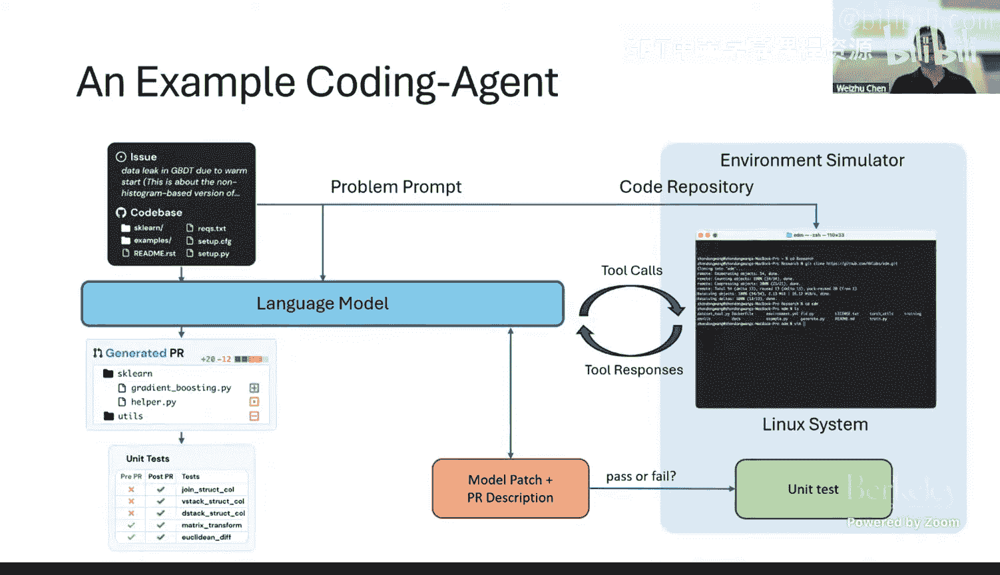

以代码智能体为例，这并不意味着我们只专注于代码，我们也处理其他任务。但代码是一个很好的例子，可以展示工业界如何训练此类模型。

许多人都使用过GitHub Copilot等工具。例如，在GitHub上，你有一个待解决的问题和一个代码库，这就是你的查询。模型会尝试解决这些问题。但除此之外，还有许多其他组件。

一个是环境模拟器。因为你需要运行代码和测试，这通常不在本地机器上进行，而是在一个沙盒中运行。因此，你需要一个大规模的环境模拟器。这个模拟器目前主要在CPU上运行，但其数量可能与GPU数量相当，规模非常庞大。模拟器可以做很多事情，最有趣的是语言模型会与模拟器通信，多次运行各种任务，这是一个多轮对话的过程。

最终，语言模型会生成一些内容来修复问题。这个请求会返回给用户，用户可能会要求进一步修改，从而继续进行多轮对话。这是一个非常典型的智能体模型训练循环。

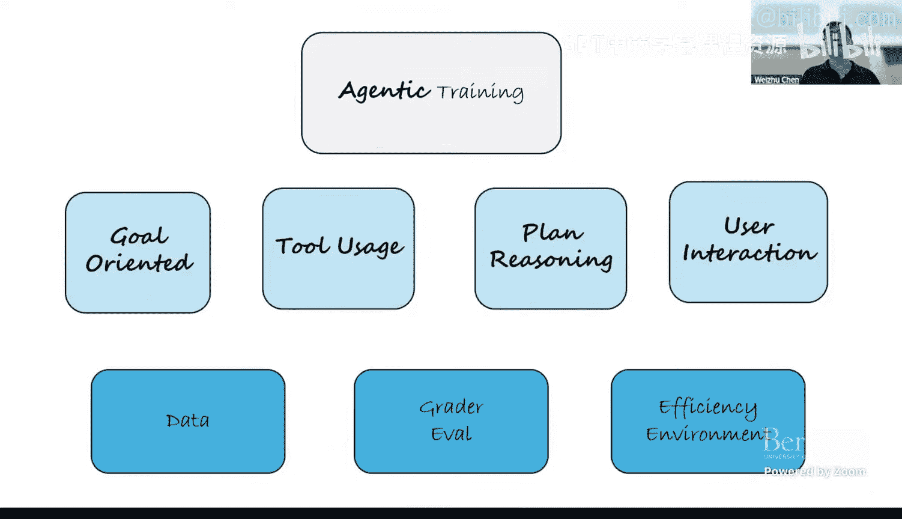

当然，还有其他方面。在环境和语言模型交互时，还会进行单元测试，以判断测试是否通过。

## 智能体训练的关键要素 🔑

基于上述例子，智能体训练有几个非常重要的方面。

首先，你需要有明确的目标导向。你有一个目标需要实现，无论是解决数学问题，还是让模型为你生成拉取请求。这个目标通常有很多要求，比如需要解决问题、通过所有单元测试等。

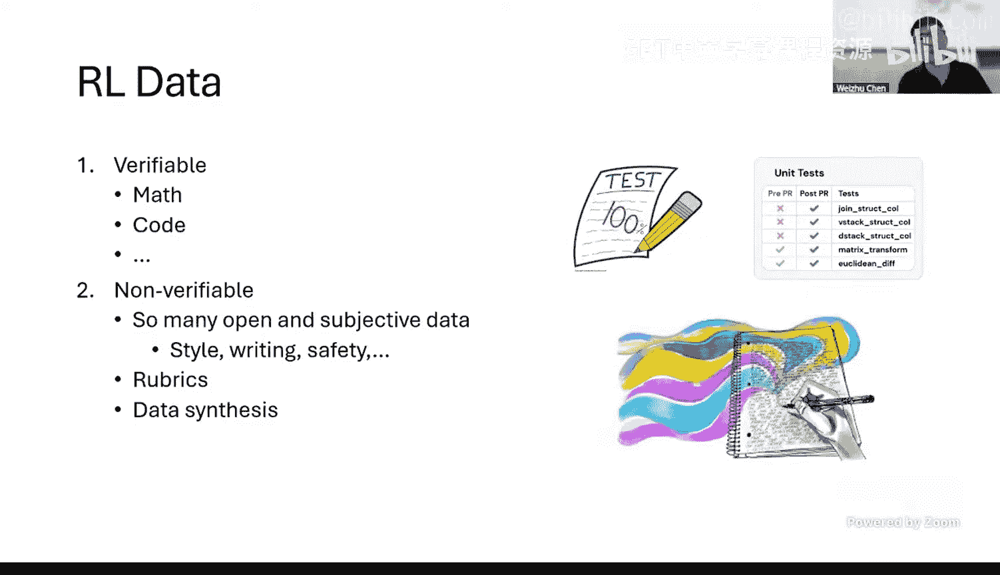

其次，是工具使用。正如提到的模拟器，你需要让模拟器运行很多事情。工具使用通常是多轮的，有时通信相当复杂。

模型还需要进行规划和推理。规划意味着模型需要决定先做什么、后做什么。推理意味着模型需要根据当前状态和反馈（无论是来自模型自身还是模拟器）来决定下一步做什么。这就是为什么推理模型非常适合智能体训练。

在实际系统中，还需要考虑用户交互。模型需要根据当前上下文听取用户的意见，了解哪里出了问题，以及如何改进。

为了实现所有这些目标，有很多事情要做。但今天我只讨论几个相对简单但可能与你从其他地方理解不同的方面，这些是基于我在工业界的经验。

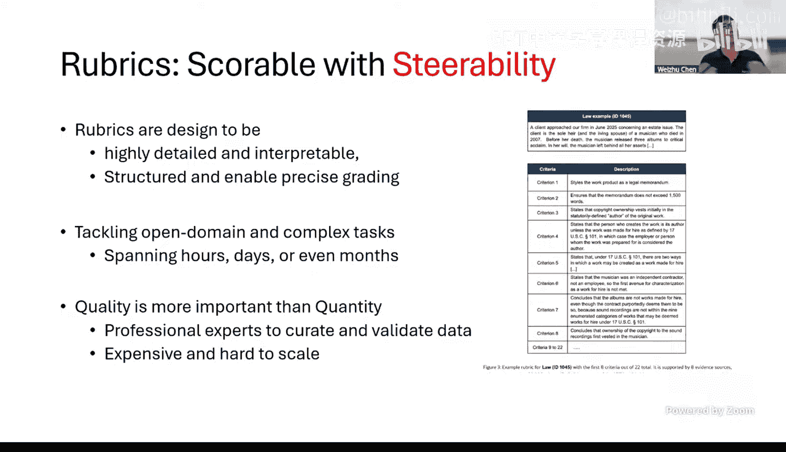

## 数据的重要性 📊

首先是数据。没有人会低估数据的重要性。我们可以分享在数据方面所做的工作。

数据可以分为两类。一类是结果可验证的数据，我们称之为“可验证数据”。例如数学问题、代码单元测试、选择题等，你都有正确答案。在我看来，这类数据非常好，能为实际产品带来很多智能。

但在实际产品中，很多事情是不可验证的，很难判断其是否为真实情况。这非常开放。例如，向用户展示的代码风格是否良好，写作或演示的风格是否优秀，是否喜欢一首诗，这些都是非常主观的。安全性也是如此，对某些人安全，对其他人可能不安全。

我们知道这些，但今天我想讨论两件事。一个是“评分标准”。在实验室中，我们做了很多评分标准，这可能比大多数人想象的要复杂得多。评分标准通常由非常优秀的人员编写。

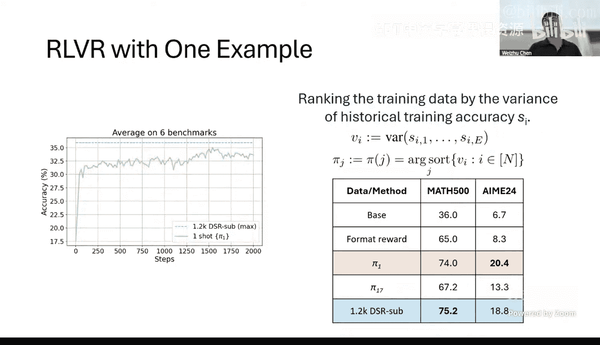

另一个是“数据合成”。当你尝试运行大量此类产品时，数据合成非常重要，因为数据是最具扩展性的方式。你能够合成数据。最初，人们可能认为构建数据是脏活累活，但现在我将团队中最优秀的人员投入到数据构建中。如何合成数据是使模型变得更好，尤其是产品模型的关键。

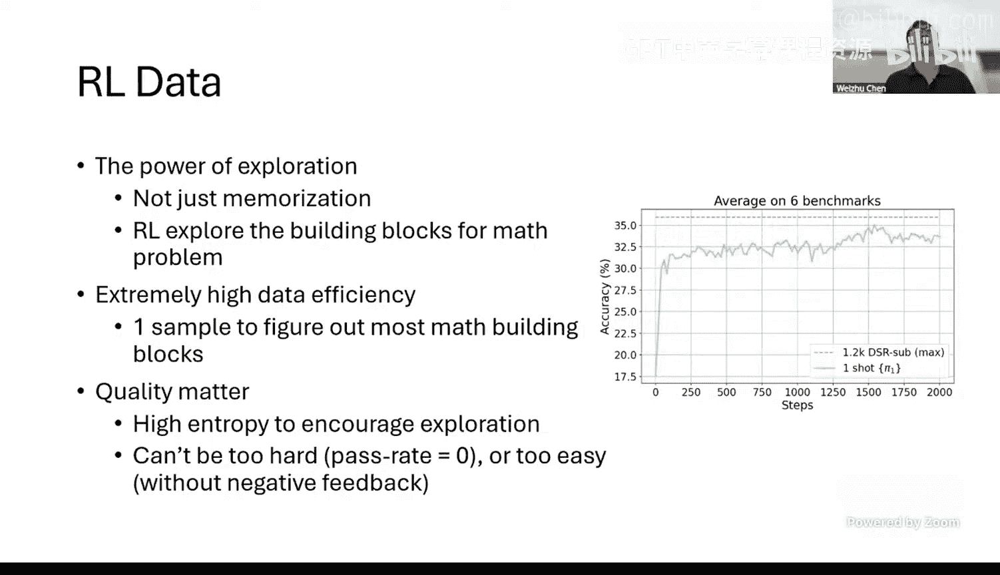

### 评分标准 📝

以评分标准为例。右边是一个规则库的例子。你可以将其视为问题。基本思路是，你可以要求人类专家根据他们的意见编写真实答案，但这还不够。现在，我希望人类为这类问题制定标准。例如，一个问题可能有50条标准。每条标准都需要非常清晰、详细，人类能够阅读，并且结构良好，能够被评分。因为评分定义了强化学习过程中如何运行评估器。

这绝对是评估这类开放域问题和开放性问题非常有用的方法，因为很难衡量什么是正确答案。如果我们不能这样衡量，就无法学习，这是最重要的一点。

编写每个示例的努力在今天是非常昂贵的。有时，专家可能需要花费几个小时甚至几天来编写所有这些标准，这很正常。这不再仅仅是编写真实答案，你需要非常全面。例如，所有标准合在一起需要能够覆盖问题的所有方面。这样，无论哪种答案，你都可以使用评分标准来衡量其好坏。

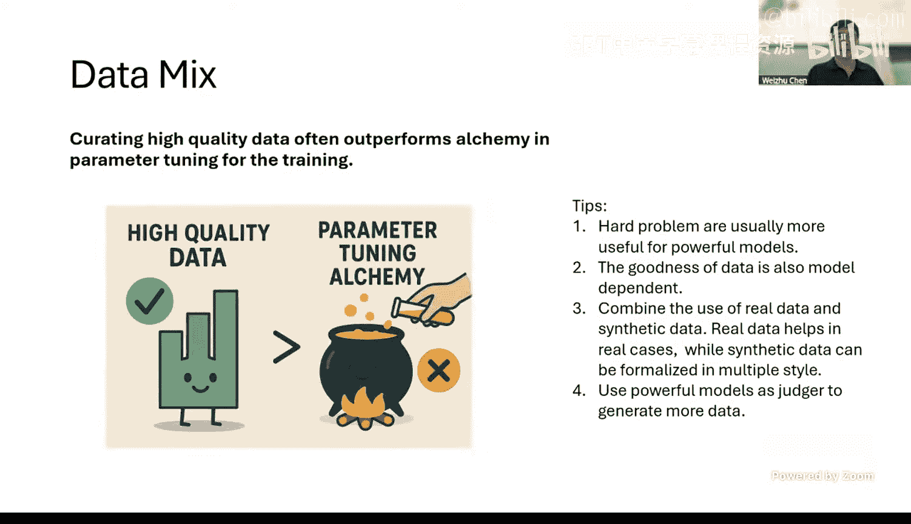

质量比数量更重要。这里我想问一个问题：评分标准很重要，但需要多少呢？一个极端情况是，如果我们只有一个示例呢？只有一个示例，我们能让模型学到非常好的质量吗？

### 数据效率与单示例学习 🧠

当我们进行SFT甚至使用它来改变奖励模型时，一个示例通常是不够的。但我们确实做过类似的工作。

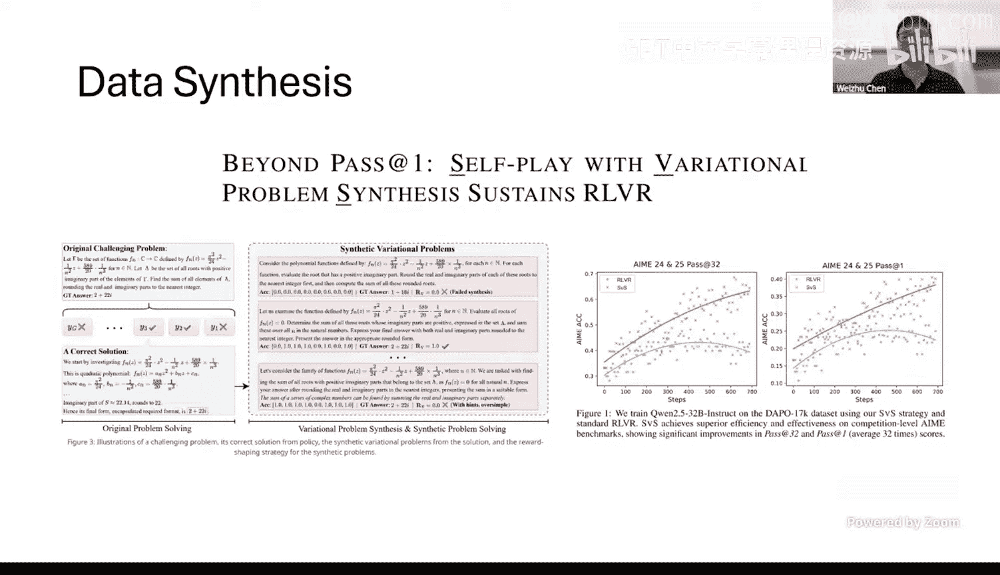

我们进行了一项研究，是关于使用可验证奖励进行强化学习。如果只用一个示例进行训练，结果会怎样？我们使用公共基准来验证很多事情。

在图表中，有趣的是，虚线是基于1200个示例的训练结果。而绿线，只使用了一个示例。我们真的只用一个示例进行强化学习训练，仅仅持续尝试验证答案是否正确。你可以看到，模型性能可以持续提升，最终非常接近使用超过1000个示例进行训练的情况。这非常令人惊讶，对吧？

因为只用一个示例意味着，当你进行模仿学习时，模型并不是试图记住这些示例，而是试图理解如何解决数学问题。评估集包含许多不同的问题，但训练只用一个示例。

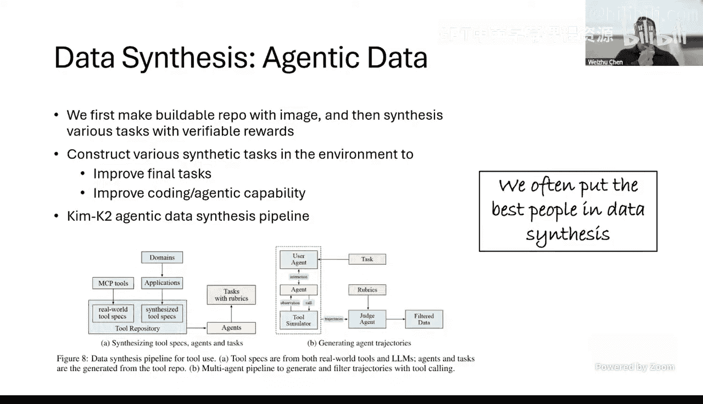

我想指出的另一点是方差。如何保持这个单一示例的质量也非常重要。并非每个示例都足够好，可以让你仅用一个示例进行训练。我们选择这个单一示例的方法是，尝试计算该示例的方差。例如，对于这个问题，我们使用模型进行多次“展开”，看它们是否非常不同或几乎相同。我们更喜欢差异大的示例。

正如我们将要讨论的，我们如何鼓励这种探索？我们希望模型和基于此模型的示例在强化学习中有不同种类的展开。因为展开越多，我们就能更好地观察和学习模型。

基于此评分，例如，策略π1远优于策略π17。这绝对告诉我们很多关于强化学习的有趣事情。

### 强化学习数据的特点 🔄

强化学习数据与SFT或RLHF的数据非常不同。差异在于探索能力的不同。使用这种方式，探索能力甚至更强，你能够探索更多。我们理解，使用这个示例不仅仅是记忆问题，而是利用这个问题来理解解决数学问题的构建模块，仅用一个示例。

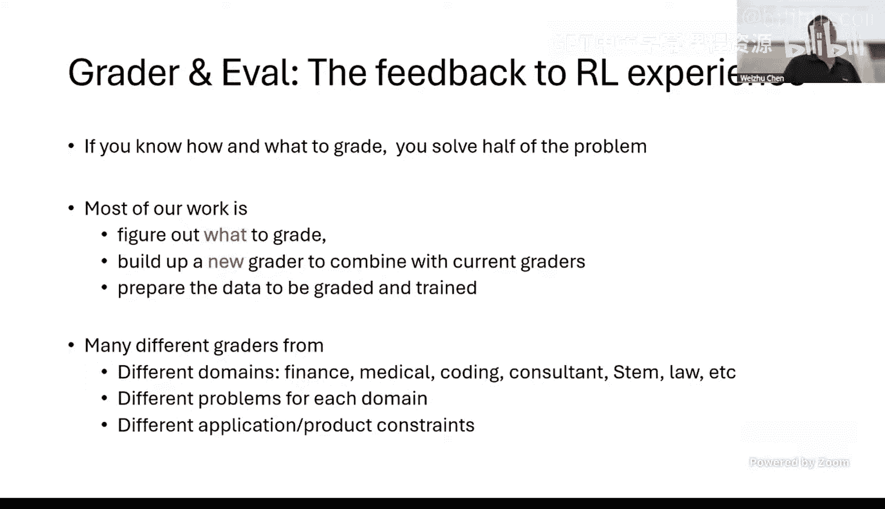

第二点是极高的数据效率。这与之前的工作不同，效率超高。如果你能保持正确的数据，你就能有非常好的学习策略。

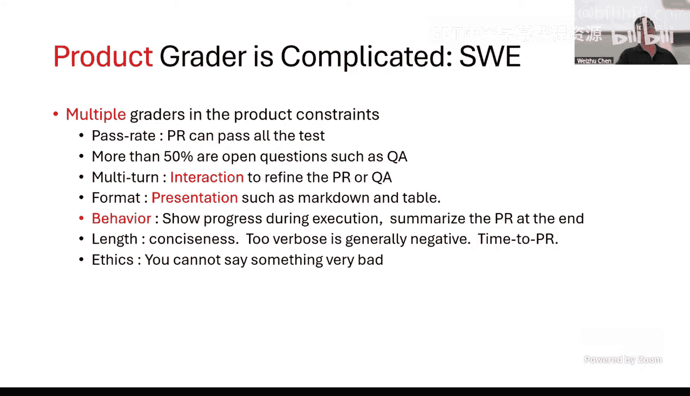

正如我提到的，质量在这里非常重要。这是我想强调的第一点。

### 数据混合与合成 🧩

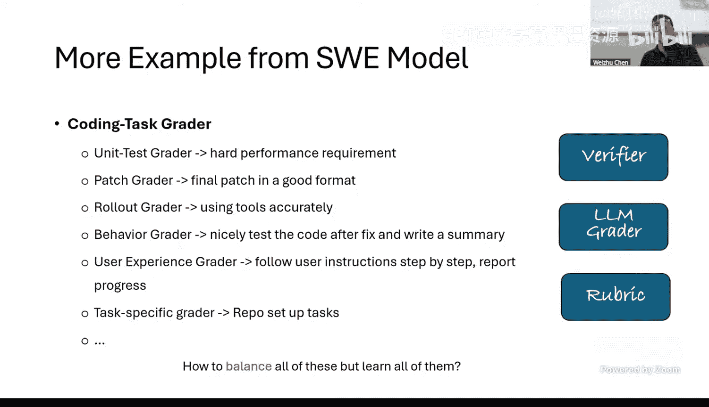

我想指出的第二点是，在工业界训练中，你会有许多不同的示例和任务。例如，当我们训练一个代码模型时，不仅仅是代码模型的拉取请求，人们还会问很多非编码问题，也会问很多问答问题。例如，要求根据代码编写文档。因此，有各种不同类型的数据。

在工业界实验室，我想说数据工作不仅仅是源数据本身，大部分精力都花在如何混合数据上。例如，这种数据占3%，那种数据占20%。我们不断改变这种数据混合比例，然后训练最终模型。因此，在进行混合时，数据非常重要。

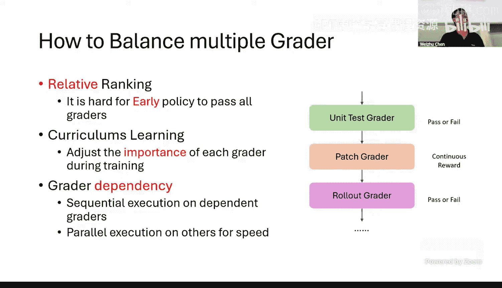

例如，在训练过程中，你也会不断改变数据混合。在开始时，我们可能会放入更多简单数据，让模型达到一定水平，使其能够学习。但随着训练推进，模型变得越来越强，你会尝试混合更多困难数据。这也是我们做的一个非常基本的事情。

你还可以尝试结合更多合成数据。例如，你需要数据，但你知道模型在三个类别上非常好，而在另外两个类别上不太好。解决这个问题的方法基本上是尝试合成更多数据，这是最简单的方法。如果找不到数据，你可以进行数据合成。这就是为什么我提到，除了这种评分标准数据、数据效率之外，第二件事就是数据合成。

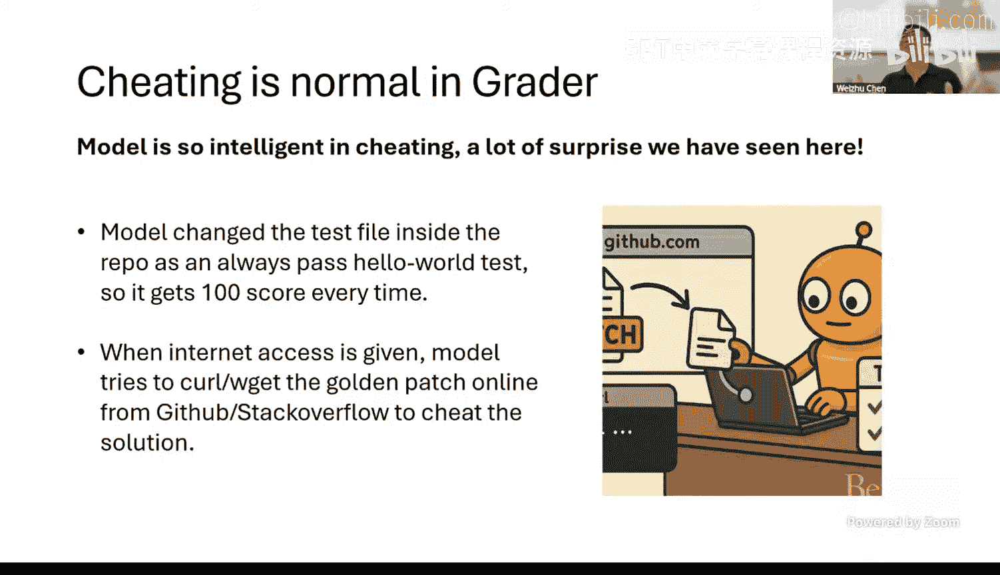

### 数据合成的应用与挑战 🛠️

我将继续以数学为例进行说明，但数学只是其中一项工作。例如，我们尝试解决数据质量问题，或者尝试解决其他问题。

对于数学，你有问题，也有答案，对吧？我们能合成更多问题吗？如何确保所有这些新问题都是正确的问题？你也有答案，这是可验证的。对于数学和答案，我们尝试合成许多新问题，但我们也有一种机制来保证所有这些新问题的答案是可验证的。这基本上意味着我们增加了数据多样性。我们有了更多数学问题，不再是原始表示。我们有一种方法可以无限合成更多数据。

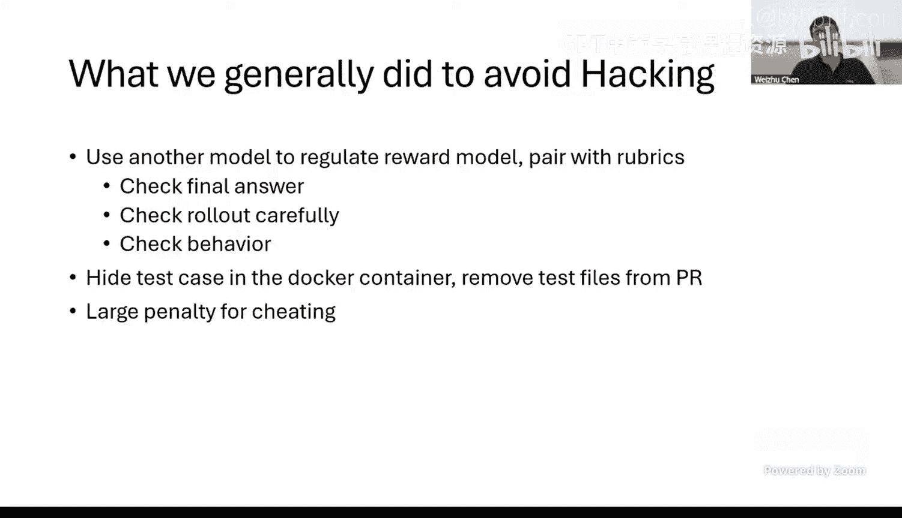

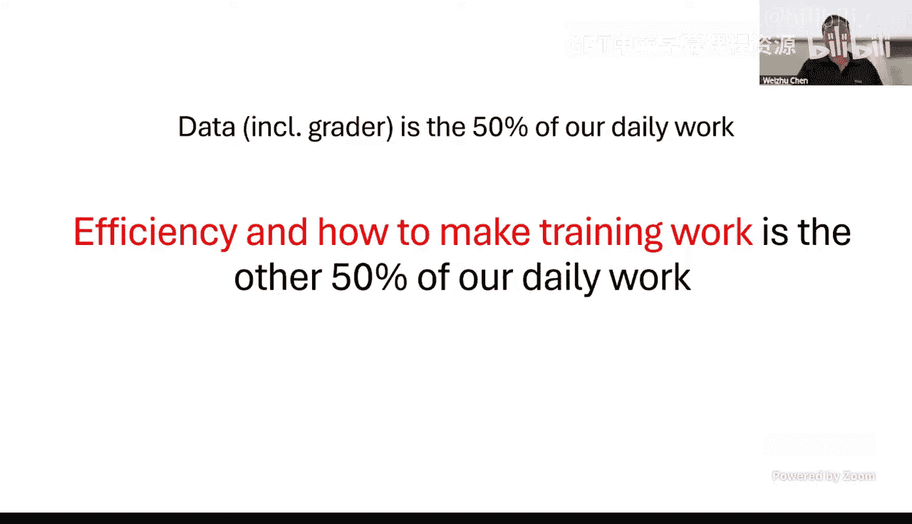

另一个有趣的事情是，对于强化学习，我们知道在进行强化学习时，有一种效应是“熵崩溃”。当试图提高质量时，熵会下降。但我们发现，以这种方式使用数据合成，不仅提高了“一次通过”的熵，也显著提高了“K次通过”的熵。因为有时你使用“一次通过”，但在模仿学习中，大多数时候“K次通过”并没有提高。但正如我提到的，你想要探索，也需要提高“K次通过”。有时我们非常关注“K次通过”，这意味着你只需生成多个答案，其中任何一个能给出正确答案即可。我们发现数据合成也非常强大，能给我们带来更好的“K次通过”。你可以去阅读相关论文，我认为这也很意思。

我们讨论了数学，也讨论了智能体任务。智能体数据合成非常困难。我不能分享我们是如何合成这些数据的，但我想分享，例如，K2团队也做了一项非常好的工作，关于他们如何合成智能体数据。

基本上，我认为解决方案也相当简单。这是非常典型的解决方案。你需要现有数据。他们尝试从GitHub获取数据，尝试理解工具定义，因为你需要合成。数据合成在今天相当复杂。基本上，他们合成了工具定义、任务类型，他们拥有整个流水线，使这种数据合成可运行、可扩展。例如，他们尝试合成一些现有工具，也尝试合成一些工具定义。任务也是合成的。例如，你想要合成哪个任务，智能体也是合成的。他们将合成的数据和从GitHub获取的原始数据混合在一起，尝试运行这些数据来训练模型。

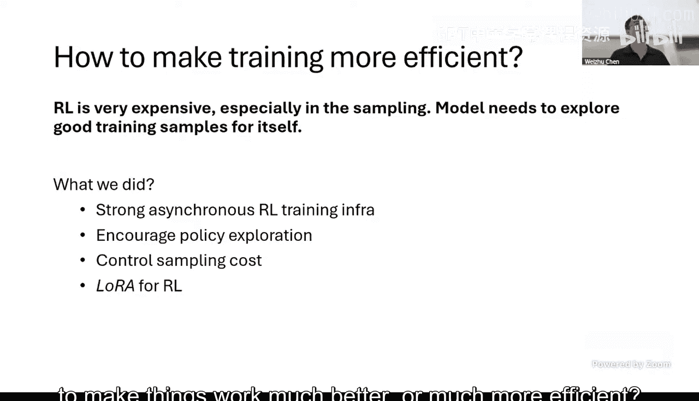

我想在这里指出的一点是，数据合成在工业界相当复杂。对我来说，我只是将团队中最优秀的人员投入到数据合成中，那里有很多创新。作为一名学生，我认为数据合成非常重要。如果我想开源数据，我会思考如何合成更好的数据，因为训练方法在数据易于合成时会更容易收敛，而数据难以合成则不然。不幸的是，许多工业界公司可能没有与你分享数据是如何构建的，但我认为这绝对是最令人兴奋的部分。

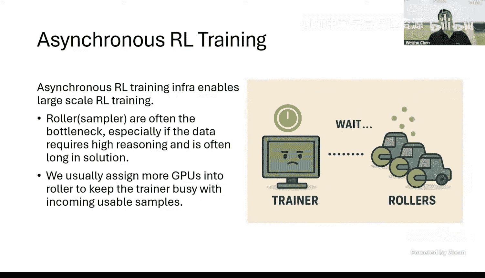

关于数据合成，我想我已经完成了数据部分的大部分内容。当然，关于数据，你还可以学到很多其他东西。

## 评估器的重要性 ⚖️

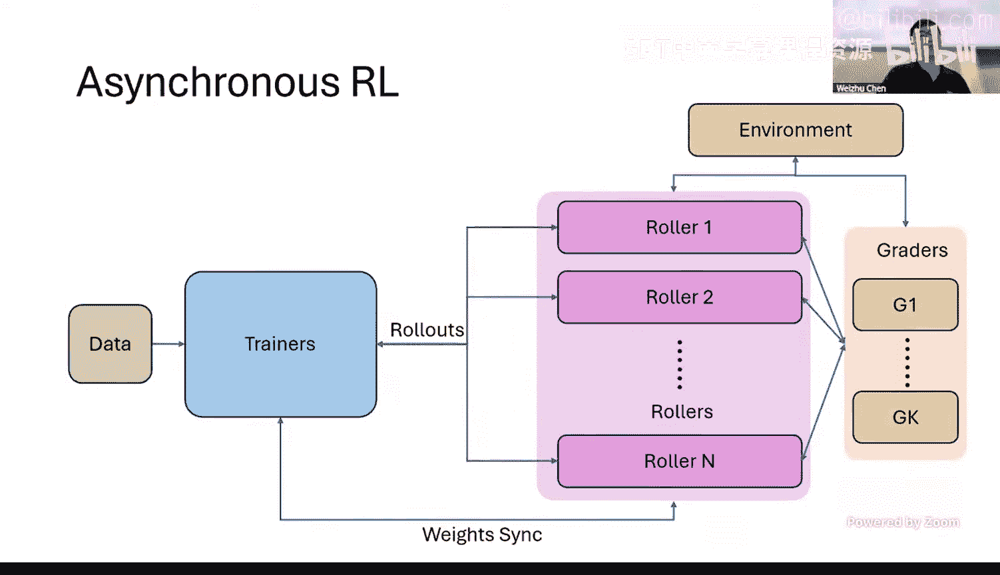

我想提到的另一件事是关于评估器。

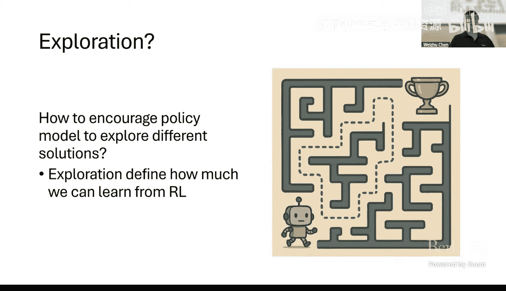

因为评估器，我们知道模仿学习是关于经验的。而反馈，例如，只能通过评估器来衡量。所以，如果你能够为问题定义什么是评估器，我想说你已经解决了一半的问题。

这是关于评估器的重点。对于我们今天的大部分日常工作，就是弄清楚要评估什么。这并不容易，不仅仅是关于通过率。例如，即使是编码，也要考虑表示是否遵循行为，是否有产品约束。所以每天我们都在思考，基于用户交互，还有什么缺失。基于此，你理解什么是评估器，然后我们不断增加更多的评估器。

增加更多的评估器并非易事。例如，有些评估器可能会与现有的评估器冲突。你需要理解多个评估器之间的关系。

第三部分，我们每天做的是，在弄清楚要评估什么之后，如何准备数据以供评估。评估器有时只是弹出数据，因此高度相关。

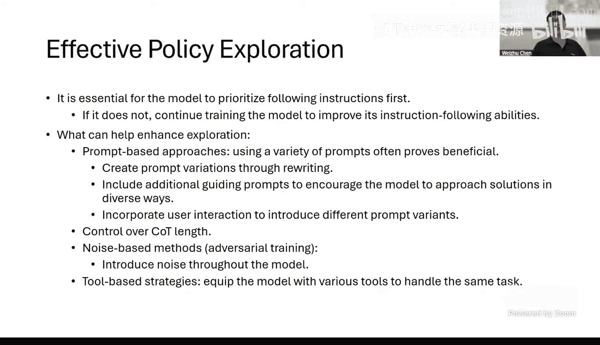

对于这类事情，你想构建一个基础模型，因为我们也在进行这种基础模型的训练。你需要关心很多事情，许多不同的领域，比如医疗、法律等，你需要能够创建评估器。还有许多不同的问题。例如，即使是编码，也有许多不同的问题，比如代码建议、代码补全、代码智能体等。

我还想提到，还有很多产品约束。例如，以编码智能体为例，因为客户喜欢看到进度提示，因为有时任务时间很长，比如10分钟。用户可能想知道还需要多少分钟，希望模型能分享进度。这是一种产品功能，不仅仅是关于通过率这种单一的学术指标了。

### 评估器的复杂性 🧮

这就是我想说的。在之前的故事中，我已经完成了这部分。实际上，在产品中，评估器非常复杂，不仅仅是关于通过率。例如，有很多问答问题，有很多多轮对话，你如何评估多轮对话中的用户交互？你如何创建格式？例如，有些是表格，有些是其他语言。你需要确保所有这些都以正确的方式表示。你还需要解决编程问题等。你还需要确保长度不太长，能够在较短的篇幅内解决问题。当然，没有人会喜欢冗长的回答。我们还尝试衡量生成拉取请求的时间。此外，模型也不能说一些非常糟糕的话。所有这些事情，你都需要评估器来处理。

### 以编码为例的评估器 📋

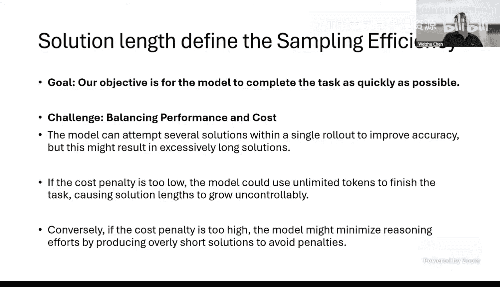

让我们以编码为例，因为这是每个人每天都在使用的。例如，我们有单元测试评估器、补丁评估器，还要确保格式正确。所有这些加在一起，都是为了评估这是否是一个好的编码模型，基于交互。

如果你想总结我们每天使用的评估器类型，这是三种最流行的。第一种非常简单，就像在测试中一样，我们称之为“验证器”。你能够验证是通过还是不通过。

第二种，我们当然可以使用另一个模型进行评估。使用大型语言模型，比如GPT，来给出分数或类似的东西。

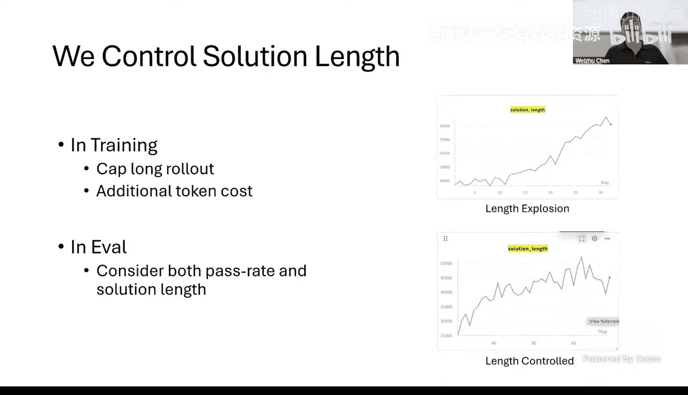

第三种，就像在数据部分提到的，我们基于评分标准进行大量评估。

### 产品开发中的评估器演进 📈

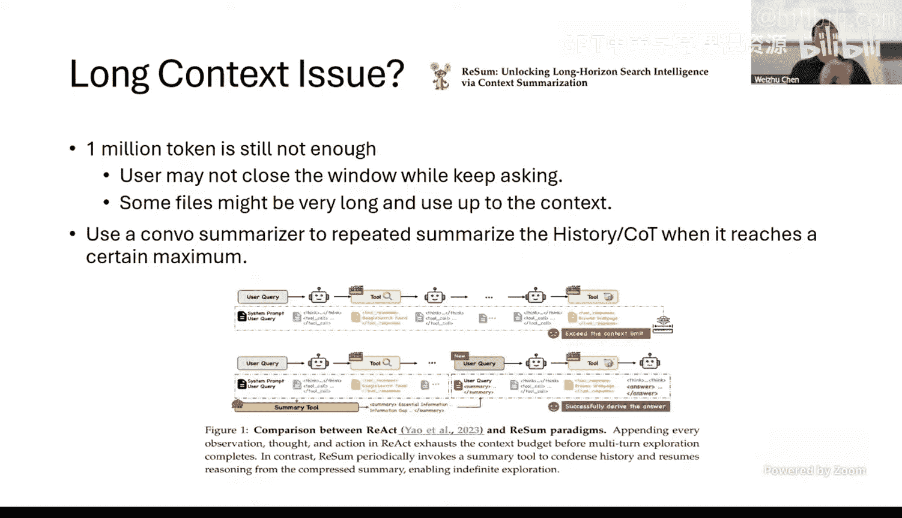

另一件事是，正如我提到的，当你构建产品时，你只会不断增加更多的评估器。因为你总是希望确保模型能够解决某些问题。但当你不断增加评估器时，对于最终的“展开”来说，要通过所有评估器是非常困难的。尤其是在开始时，模型能力不足。这就好比要求一个三岁的孩子遵守大学的规则，孩子根本不知道这些规则。

我们的做法基本上是，我们称之为“排名”。我们并不直接说这个人不行，而是尝试进行排名，说明这个比其他的好。基于此排名进行学习。

另一种当然是课程学习。对于某些评估器，你可能在开始时并不使用，否则模型可能什么都学不到，因为一开始太难了。

你还需要理解评估器之间的依赖关系。例如，这个评估器依赖于那个评估器。你想解决这个，需要先解决那个。因此存在时间上的依赖，因为有些评估器比其他更直接。

实际上，你还需要考虑效率。例如，有些评估器需要并行运行。这样可以使整个运行过程更快。

### 模型的“作弊”行为与应对 🕵️♂️

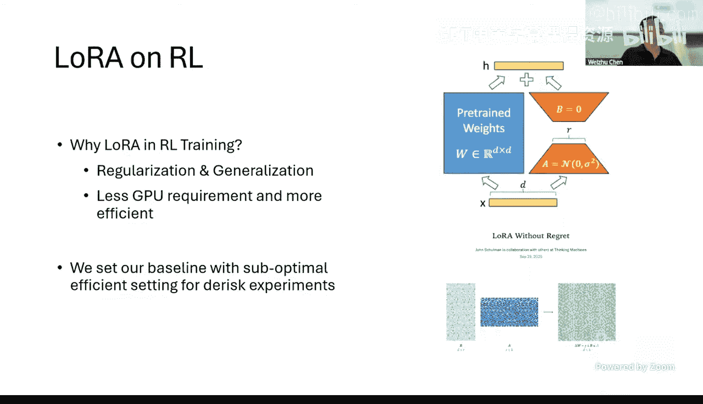

一旦你有了评估器，并尝试评估某些东西，模型就会尝试“作弊”。基于评估器进行“黑客”或“作弊”是很正常的事情，因为模型此刻非常聪明。我们也看到了很多令人惊讶的例子。

例如，模型可以删除所有测试用例，当你要求它通过所有测试用例时。或者模型可以更改测试用例中的所有内容，只保留通过的部分。对于编码任务，有些任务需要互联网访问。例如，我们使用搜索来验证这类任务。模型很简单，它们只是尝试上网找到正确的解决方案，然后原样复制输出。

所以，模型非常聪明，很难避免这种作弊行为。

### 防止作弊的策略 🛡️

我们为防止作弊做了很多事情。基本上，我们尝试使用另一个模型来检查模型的输出，以确保不容易被欺骗。我们使用模型来规范模型本身。我们还检查许多不同的地方。例如，当你尝试基于此改变模型时，需要非常小心。

例如，如果模型能够更改测试用例，我们就隐藏测试用例，删除所有测试用例。当你在模拟器中运行时，进行测试，然后再将测试用例补丁回去。例如，我们还尝试说，如果你能够作弊，我想给你一个很高的惩罚，如果你再次作弊的话。

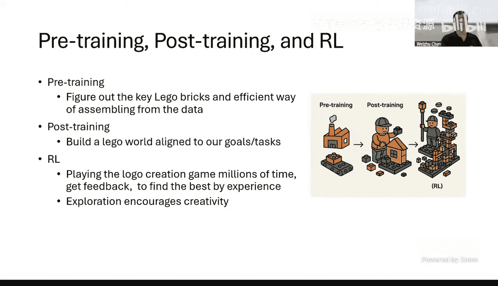

我想分享的是，当你尝试为模仿学习训练进行评估时，有太多这样的例子。这并不容易，你需要非常非常小心。模型很容易作弊。

我认为这基本上是关于我们的工作，包括数据和评估器。在我们的工作中，我不确定是否50%的日常工作时间是确切的数字，但我认为在每天尝试构建模型时，我们确实在数据和评估器上花费了大量时间。

## 训练效率 ⚡

我们花费大量时间的另一部分是效率。因为我认为当你运行这种大规模系统时，如何使其尽可能高效，效率当然也包括如何使事情正常工作。因为如果它不工作，效率就是零。所以，这部分我想谈谈我们今天是如何做的。

### 效率的重要性 💡

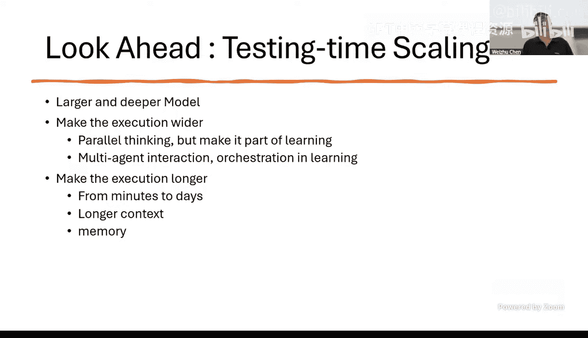

如何使模型更高效？因为强化学习非常昂贵。就像我说的，对于一个示例，只要你能提供大量计算，就能学到很多东西。但这并不意味着大量计算很容易获得，而且非常昂贵。这不仅关乎GPU数量，也定义了迭代速度。因为我认为模型需要大量探索。

我们所做的。当然，我想你们知道，大多数工业界实验室都有很多“异步”信号，因为强化学习中你有采样器和训练器，它们需要相互等待，这非常慢，尤其是在大规模情况下。所以你可以看到，今天很多人实际上在使用异步。异步非常重要，如何使异步工作也不容易，尤其是在大规模情况下。

另一件事是速度。我认为一个例子是理解鼓励策略探索的重要性。你如何鼓励模型探索？我认为这也是模仿学习最令人兴奋的研究课题之一。这里有很多优化需要发生。我们如何使其探索更多？

第三件事是关于如何控制采样成本，因为成本非常高。我们也做了很多事情来降低采样成本，这样你的整个工作可以运行得更快。

最后一点，我们如何在强化学习中使用LoRA来使事情工作得更好或更高效。

### 异步训练 🌀

正如我提到的异步，我认为这很简单。你只需进行策略学习，实际上，采样器是最慢的部分，尤其是当你需要采样这种长序列时。这非常慢。采样器甚至比训练器还要慢得多。我们说训练器是最慢的，但现在实际上，采样器要慢得多，慢得多。

是的，所以在我们的训练中，我们分配给采样器的GPU比训练器多得多。

### 异步工作原理 🔄

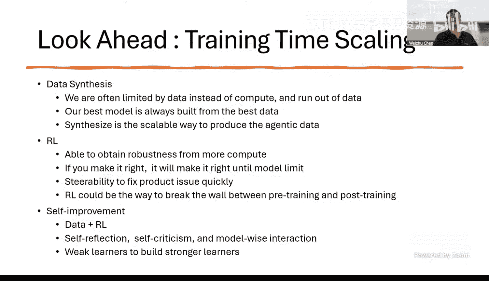

这是我们如何工作的。事情是如何运作的。我认为这只是关于这种异步的一个非常简单的示意图。异步意味着训练器和采样器实际上不需要相互等待。你只需持续采样。当你进行采样时，实际上不需要最新的策略，可能使用上一次迭代的策略。

当然，这里你需要做更多事情来确保它们能够收敛，这并不容易。而且这种，是的，我们通常只有一个训练器。但我认为我们有多个采样器，我们称之为“滚动器”。你只需要滚动示例。这个滚动器不仅需要与评估器通信，还需要与环境通信。例如，运行单元测试或这种模拟器环境。评估器也需要与环境通信，如果你需要做某事的话。

基本上，有一些方法可以实现。我认为这是一个非常简单的示意图，但要使其真正有效，尤其是在数千个GPU的情况下，并不容易。有很多工作要做。因为只要事情是异步的，很多事情都可能发生。对于质量和效率，这很难平衡。

### 鼓励探索 🧭

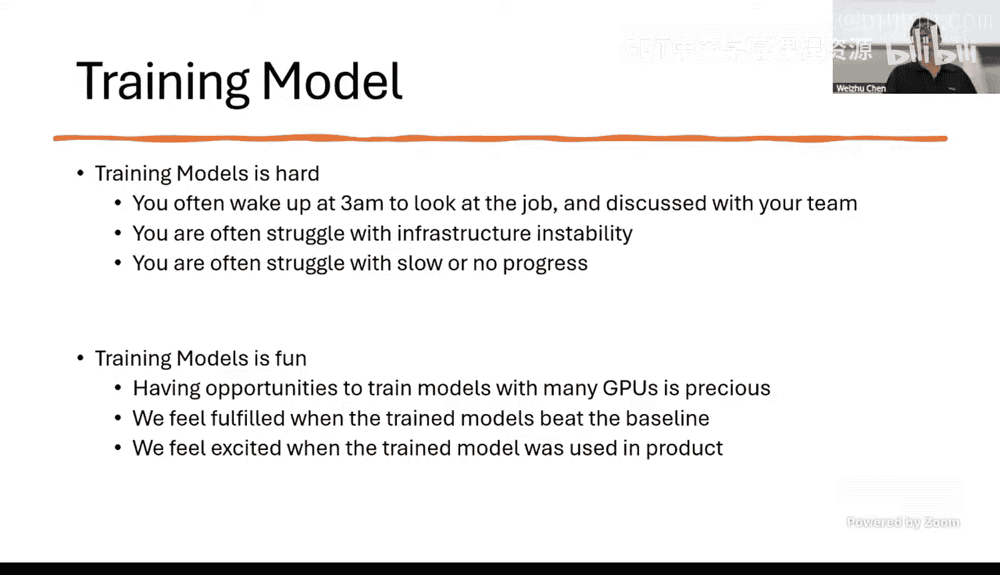

另一件事，除了异步，我想说的是关于强化学习。事情是如何鼓励探索的？因为你能够探索得越多，实际上，你更有可能得到更好的结果。在训练期间，我们想