# 5：多智能体 AI

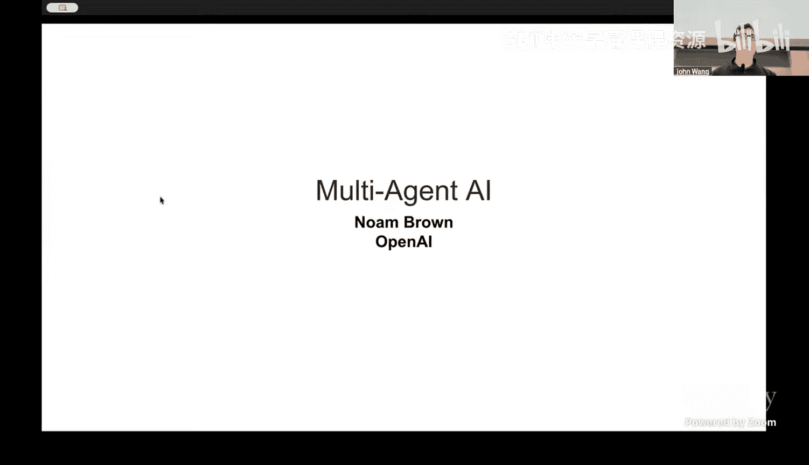

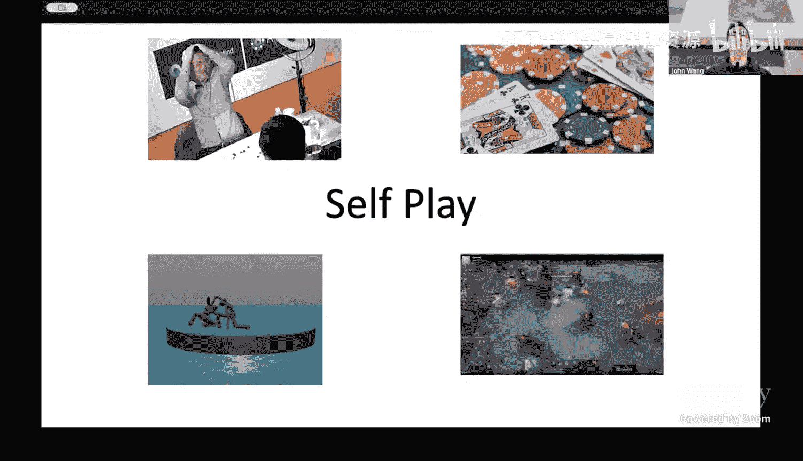

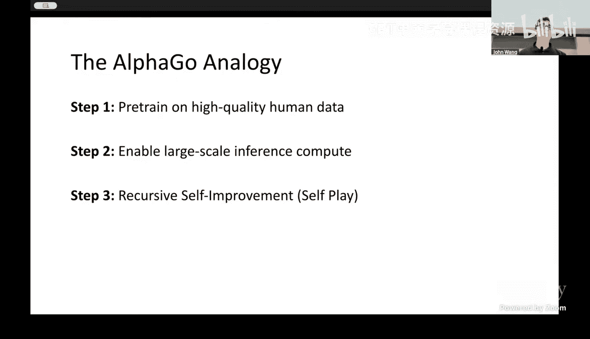

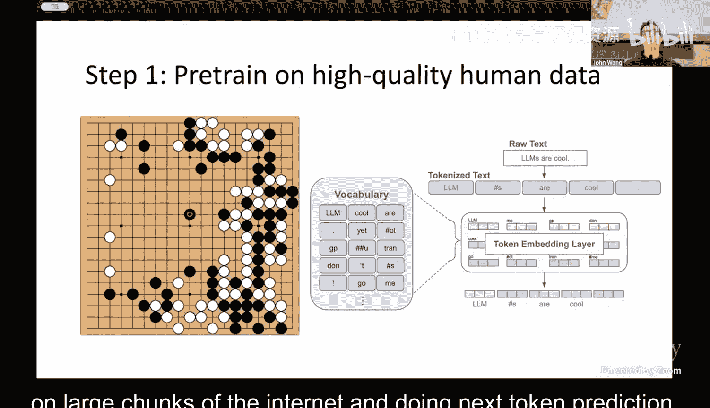

## 概述
在本节课中，我们将要学习多智能体人工智能的核心概念。我们将从自博弈在游戏AI中的成功应用讲起，探讨其在扩展到更复杂、非零和博弈环境时所面临的挑战，并最终讨论如何让AI智能体之间以及AI与人类之间进行有效的协作。

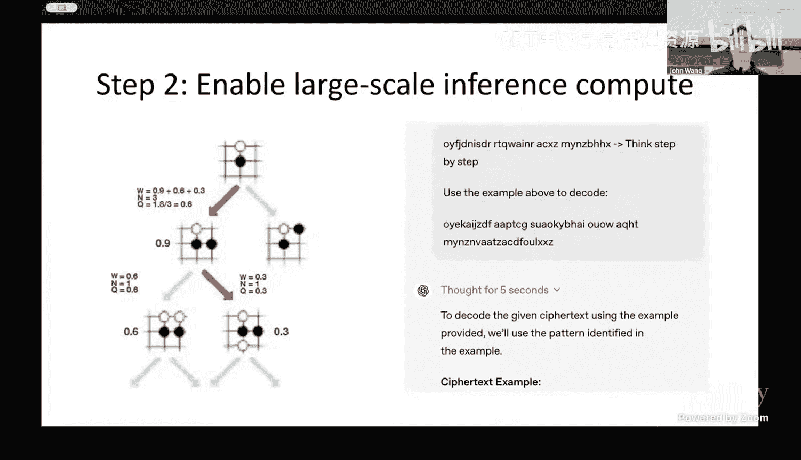

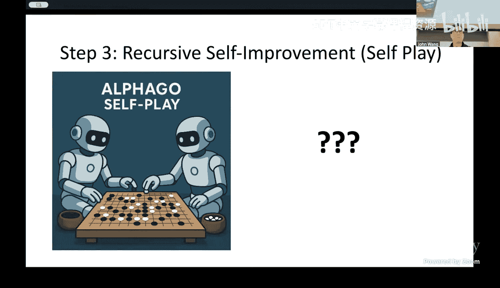

---

## 自博弈的轨迹与挑战

自博弈是许多AI突破性进展背后的关键，尤其是在游戏领域，例如AlphaGo、Dota、星际争霸和扑克。然而，我们尚未在大型语言模型中看到类似的自博弈成功应用。这有些令人惊讶，因为LLM的发展轨迹与AlphaGo等系统非常相似：首先在高质量人类数据上进行预训练，然后启用大规模推理计算，最后进行递归自我改进。

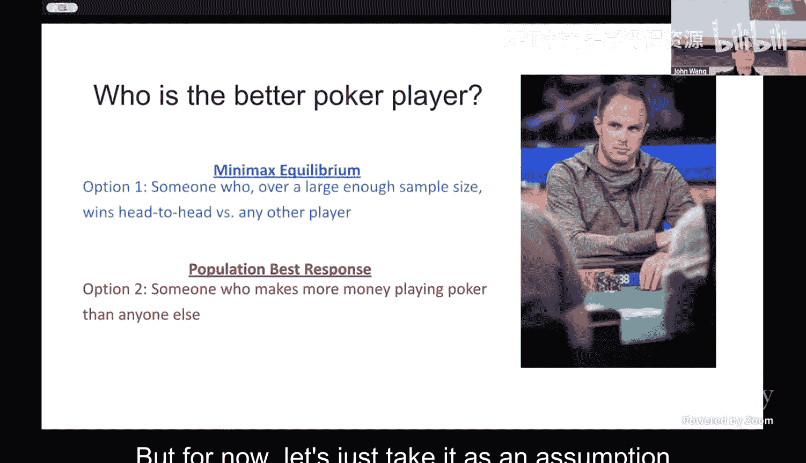

在AlphaGo中，第三步是自博弈，AI通过与自己进行数百万甚至数十亿局游戏来不断改进。而在LLM中，我们目前缺少这一环节。那么，为什么在LLM中实现类似自博弈的递归自我改进如此困难呢？

一个关键原因是，许多人对自博弈的直觉主要来自于围棋、国际象棋这类**双人零和完美信息博弈**。当我们将视野扩展到这些游戏之外时，许多原本很好的性质会消失，自博弈会变得困难得多。

---

## 理解博弈目标：极小化极大均衡 vs. 群体最佳响应

为了说明这一点，我们先思考一个基本问题：谁才是更好的扑克玩家？选项一是，在大量样本中，该玩家能在单挑中击败任何其他玩家。选项二是，该玩家在一年内通过玩扑克赚的钱比任何人都多。

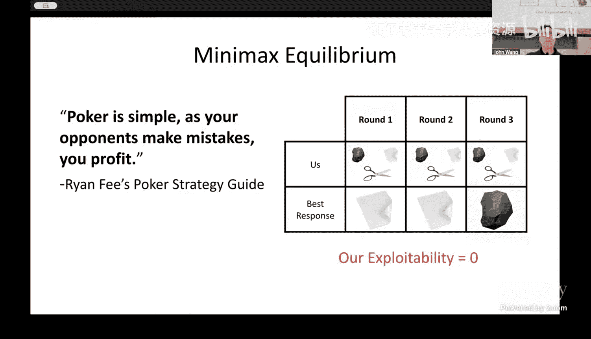

在扑克中，这两个选项可能对应不同的人。一个人可能非常擅长从其他玩家那里榨取微小的优势，但面对弱手时却无法最大化利用；另一个人可能非常善于发现弱手的弱点并最大化利用，但面对顶级职业选手时表现稍差。

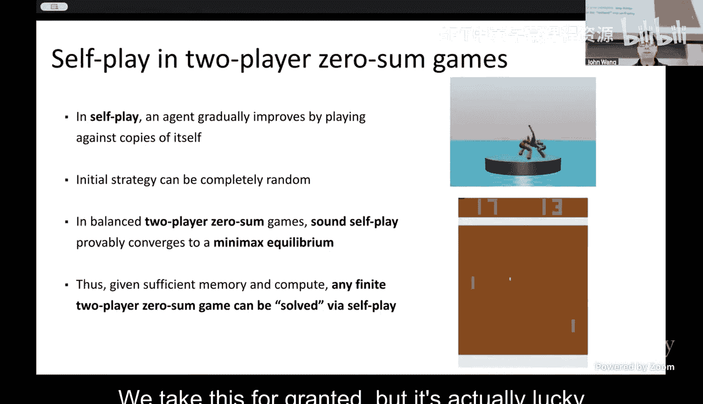

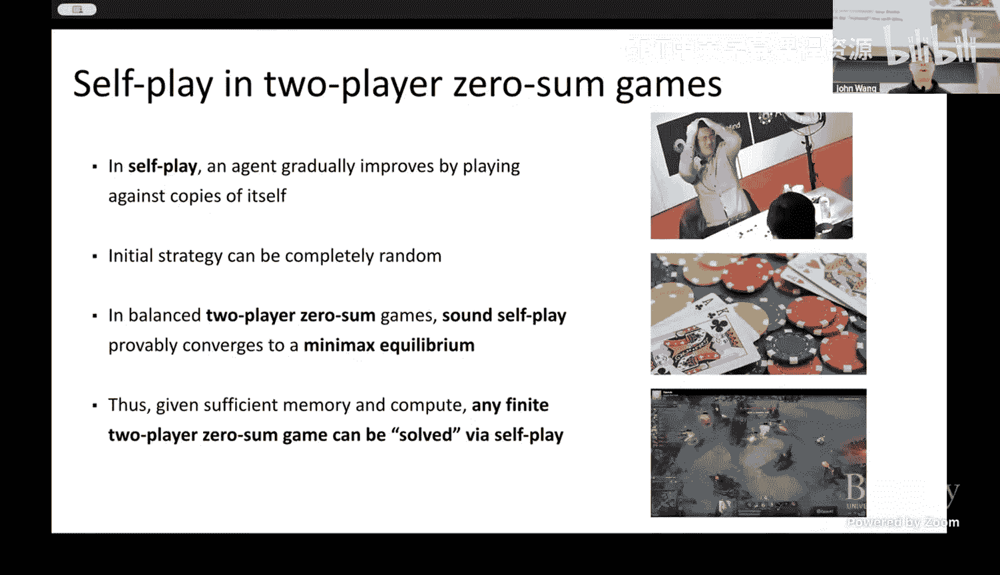

*   **选项一**对应的是**极小化极大均衡**。
*   **选项二**对应的是**群体最佳响应**。

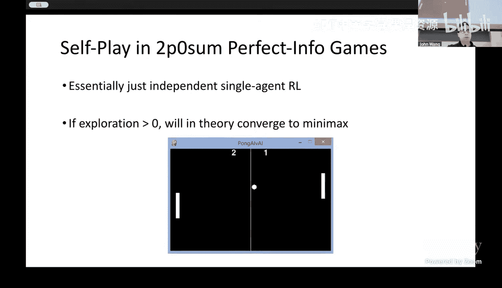

在讨论游戏AI时，“解决一个游戏”通常意味着计算一个极小化极大均衡。这是一个很强的假设，它意味着玩家的策略是公共知识（尽管随机过程的结果不是）。这样假设的原因是，如果一个AI系统被数十亿用户使用，其弱点最终会被发现并利用。因此，极小化极大均衡的目标是：即使对手完全了解我们的策略，我们也能保持稳健。

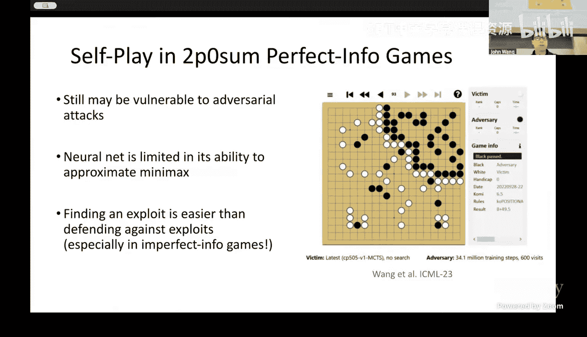

在简单的“石头剪刀布”游戏中，极小化极大均衡是以相等的概率随机选择石头、布或剪刀。这样，对手最好的结果也只是平局，我们的**可剥削性**为零。可剥削性衡量的是我们距离极小化极大均衡有多远，在均衡点上，可剥削性为零。

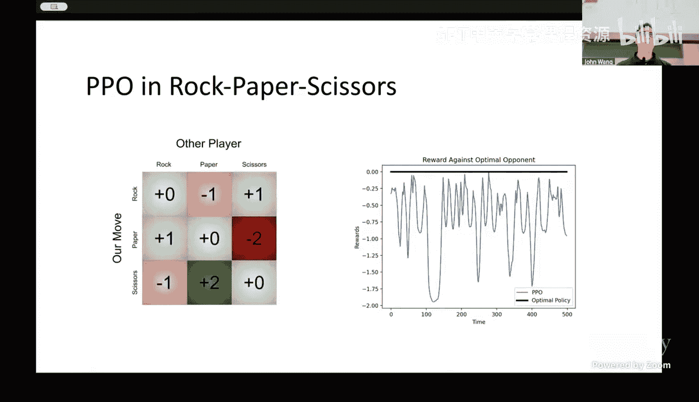

在更复杂的游戏如扑克中，即使你采用极小化极大均衡策略，对手也可能因为做出“负期望值”的决策而犯错，从而使你获利。因此，扑克职业玩家的策略通常是：先采用均衡策略，如果发现对手的弱点，再偏离均衡以利用它。

---

## 自博弈算法：从完美信息到不完美信息博弈

自博弈是一种算法，通过让智能体与自身的副本进行游戏来逐步改进，最终收敛到极小化极大均衡。这非常强大，意味着在**任何有限的双人零和博弈**中，只要有足够的内存和计算资源，你**不需要任何人类数据**，仅通过自博弈就能达到一个保证不输的均衡策略。

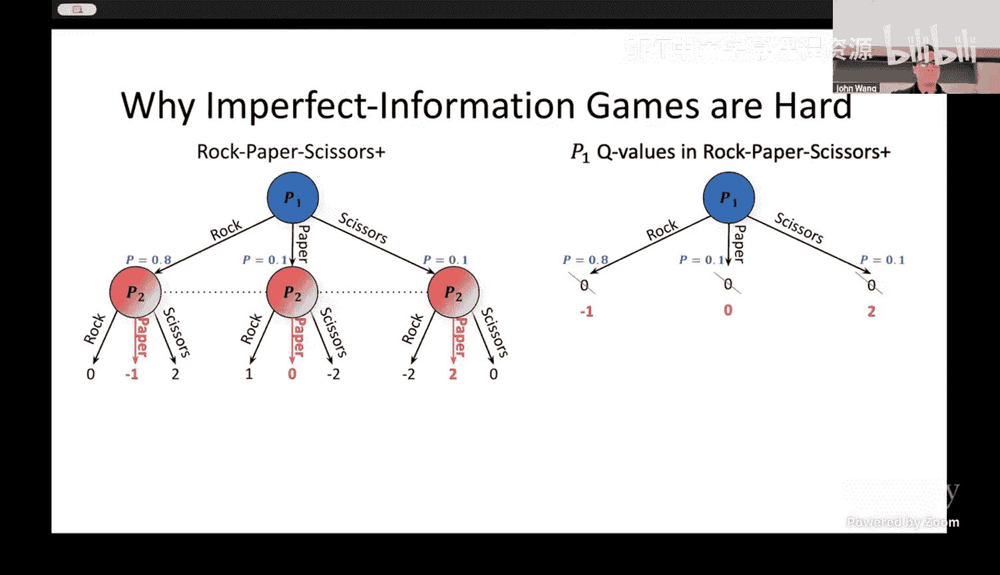

以下是自博弈在不同类型游戏中的表现：

### 完美信息博弈（如国际象棋、围棋）
在完美信息博弈中，自博弈本质上就是独立的单智能体强化学习（如PPO）。只要进行充分的探索，理论上可以收敛到极小化极大均衡。然而在实践中，由于神经网络容量和计算资源的限制，可能无法完全达到均衡，从而仍然可能被针对性的攻击所利用。

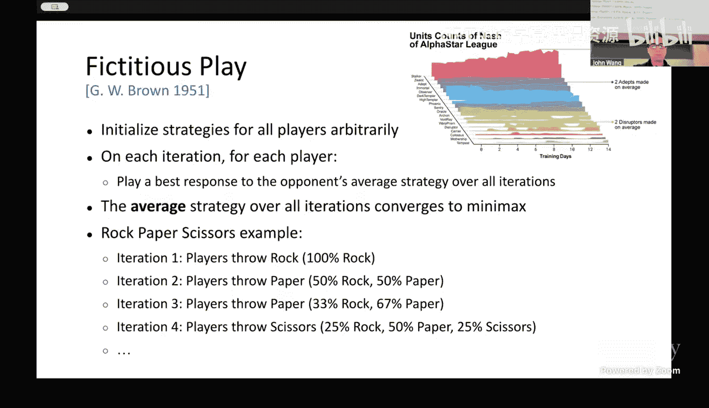

### 不完美信息博弈（如扑克、石头剪刀布）
在不完美信息博弈中，情况变得复杂。例如，在一个修改版的“石头剪刀布”游戏中，PPO算法**无法**收敛到极小化极大均衡。这是因为在不完美信息博弈中，一个动作的价值**取决于你以多大概率选择它**。这与围棋等游戏不同，在围棋中，走一步棋的价值基本不依赖于你走这步棋的频率。

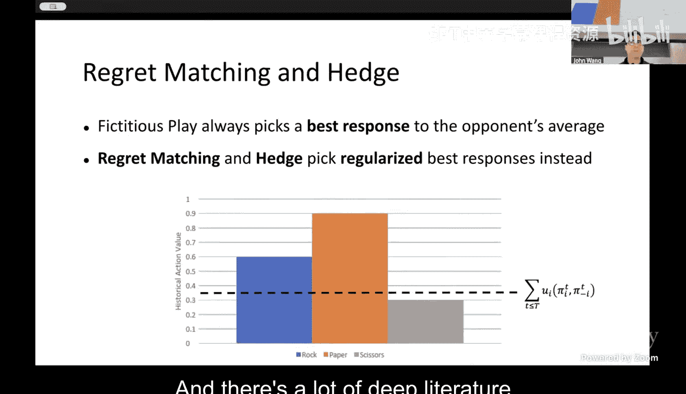

因此，我们需要一种不仅能找出要执行什么动作，还能找出以何种**概率**执行这些动作的算法。

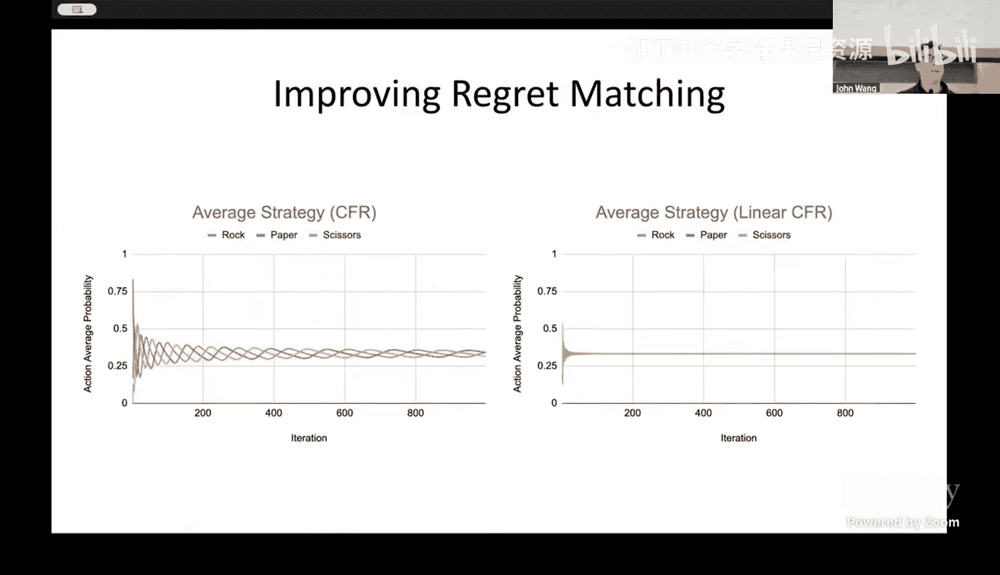

以下是几种用于不完美信息博弈的算法：

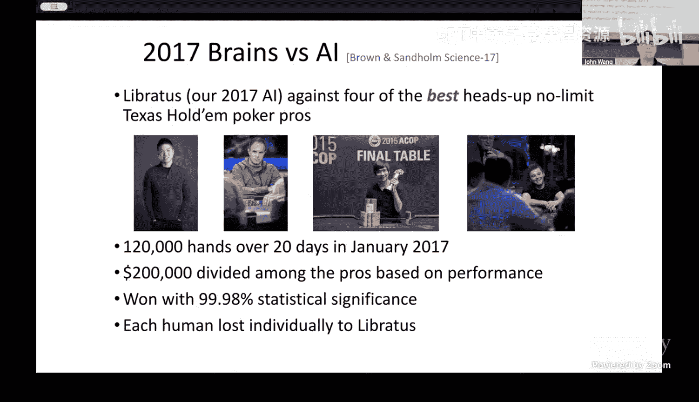

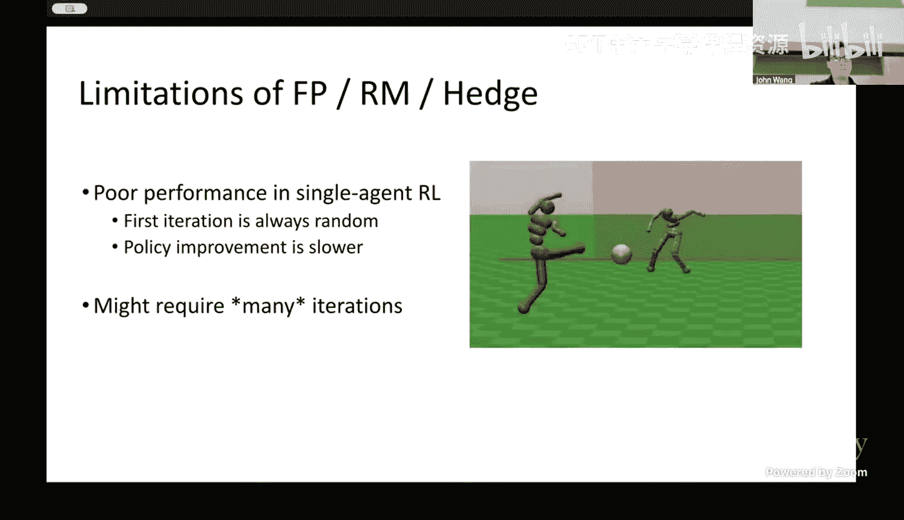

*   **虚拟博弈**：初始化所有玩家的策略。在每一轮迭代中，每个玩家简单地针对对手在之前所有迭代中的平均策略，做出最佳响应。所有玩家的平均策略最终会收敛到极小化极大均衡，但速度通常很慢。
*   **遗憾匹配与Hedge算法**：这些是现代算法，通过计算**正则化的最佳响应**，比虚拟博弈收敛得快得多。它们与梯度下降法有深刻的联系。这类算法是击败人类顶级扑克选手的关键。

近期，出现了一些新算法，它们在单智能体强化学习和多智能体均衡收敛方面都表现出色，这可能是未来的发展方向。

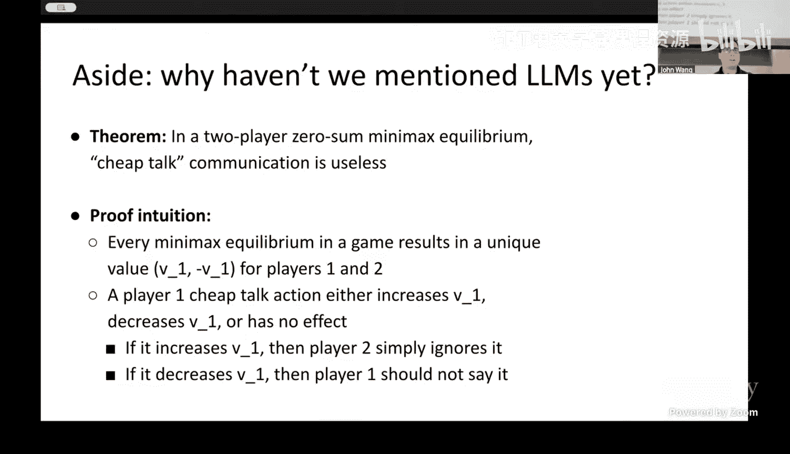

---

## 超越双人零和博弈：合作与沟通的必要性

之前我们主要讨论的是双人零和博弈。现在，我们来看看非双人零和博弈，我们会发现许多之前的良好性质不再成立。

一个核心观点是：**如果你的目标是学会与人类合作，那么避免使用人类数据是一条死胡同。** 在我看来，学习与人类合作的唯一可扩展的方法就是使用人类数据。

这似乎与之前双人零和博弈中“无需人类数据”的结论相悖，但我们可以通过“最后通牒博弈”这个例子来理解。

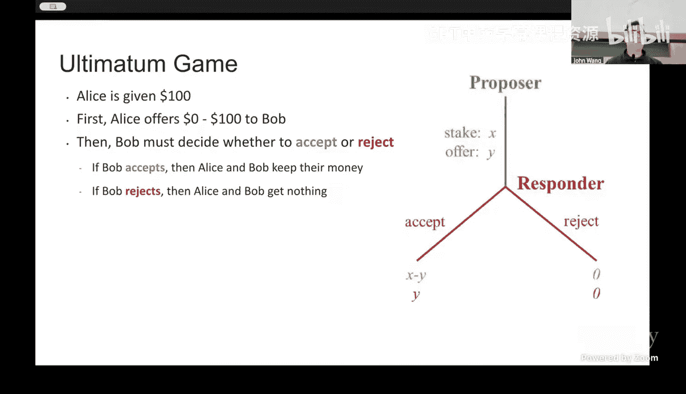

在最后通牒博弈中，Alice有100美元，她可以提议分给Bob任意金额（0到100美元）。Bob可以选择接受或拒绝。如果接受，按提议分钱；如果拒绝，两人都一无所获。

从纯博弈论角度，Alice的最优策略是提议分给Bob尽可能少的钱（比如1美元），而Bob为了最大化收益（得到1美元而非0美元），应该接受。然而，人类实验表明，如果分给Bob的钱太少（比如低于20-30美元），他通常会出于公平感而拒绝，导致双方都得不到钱。

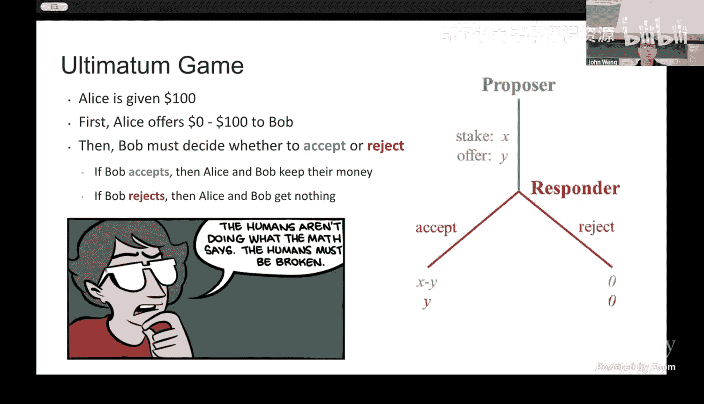

如果让AI纯粹通过自博弈学习，它会收敛到那个“分1美元”的博弈论均衡，但这在与真人互动时会惨败。人类的行为受到文化、社会规范等多种因素影响，要学习这些，最直接有效的方法就是收集大量人类行为数据。

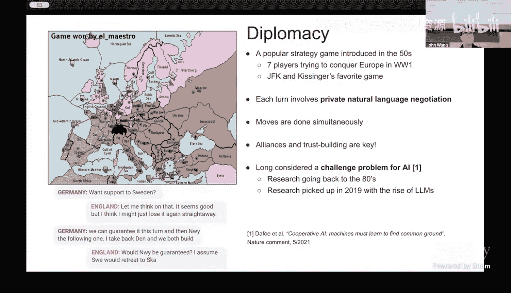

---

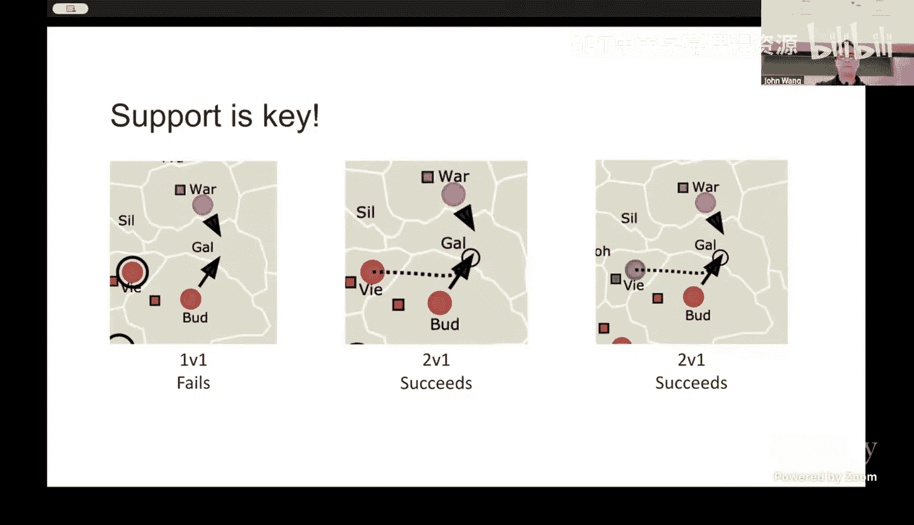

## 实践案例：外交游戏

“外交”是一个七人谈判游戏，玩家通过私下自然语言谈判来结盟或背叛，目标是控制欧洲大部分地区。这完美体现了非零和、多智能体互动的复杂性。

我的同事们开发了**Dora**算法，它像AlphaZero一样，在无通信版本的“外交”游戏中通过纯自博弈学习。在双人版本中，Dora表现超强。但在七人游戏中：

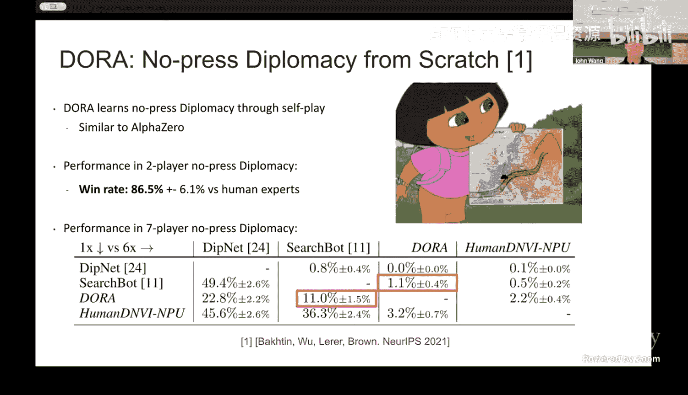

*   当一个基于人类数据训练的智能体（SearchBot）与六个Dora智能体对战时，SearchBot输得很惨。
*   当一个Dora智能体与六个SearchBot智能体对战时，Dora也输得很惨。

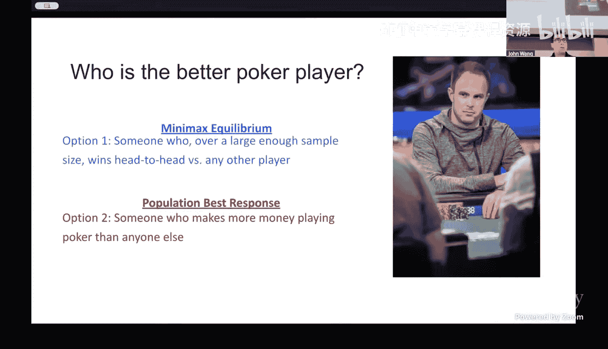

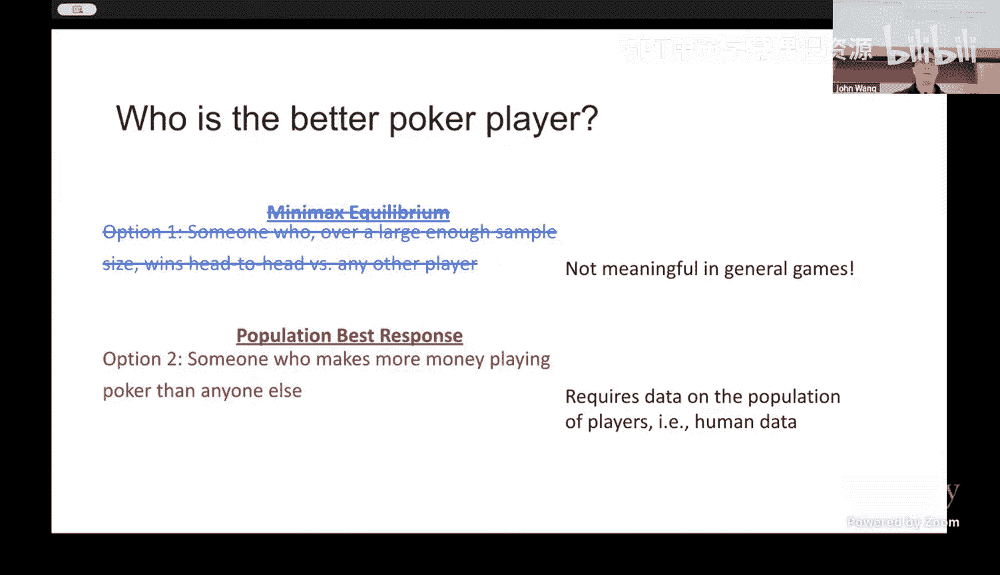

这表明，在非零和博弈中，存在**多种不同的均衡**。Dora找到了一个在自博弈环境中有效的均衡，但当它遇到基于人类行为训练的智能体时，就无法适应。这凸显了在非零和博弈中，**极小化极大均衡概念不再有用**，真正有意义的是针对特定**群体**（例如人类玩家）的**群体最佳响应**。而要学习针对人类的响应，就必须使用人类数据。

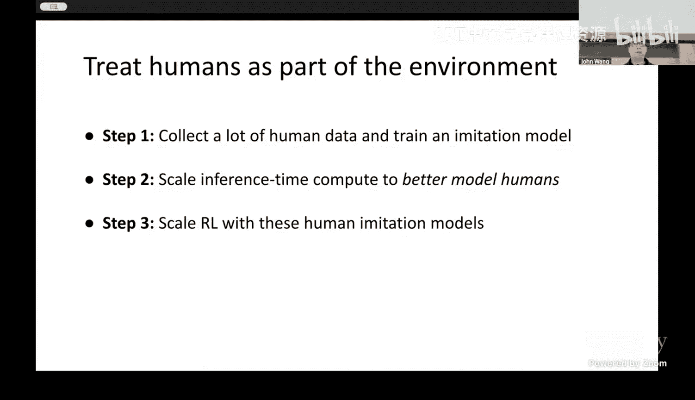

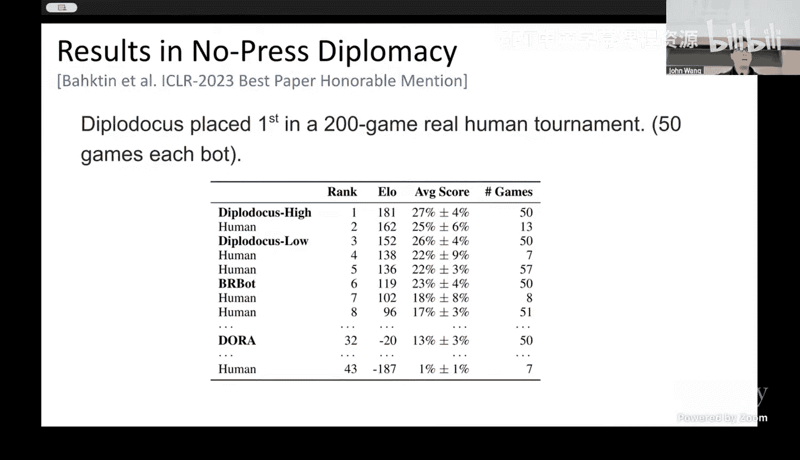

因此，我们为“外交”游戏推荐的解决方案是：
1.  **收集大量人类数据**，并训练一个模仿人类行为的模型。
2.  **扩展推理时计算**，以更好地模拟人类玩家（而非单纯追求更高性能）。
3.  **以这些人类模仿模型作为环境的一部分，进行强化学习**。

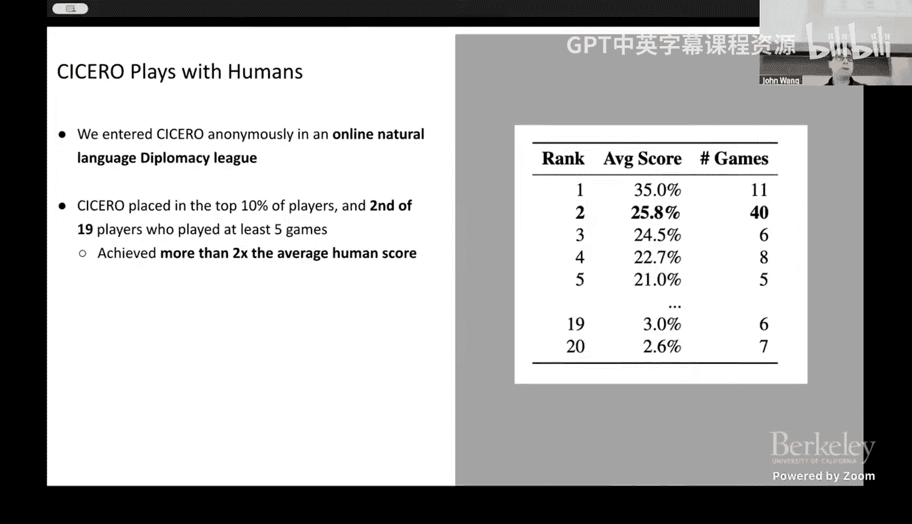

我们按照这个思路训练了智能体Cicero，它能够进行全自然语言谈判，在匿名的人类联赛中取得了前10%的成绩，证明了该方法的有效性。同样的方法在合作游戏“花火”中也取得了成功，使AI能够与各种人类玩家有效合作。

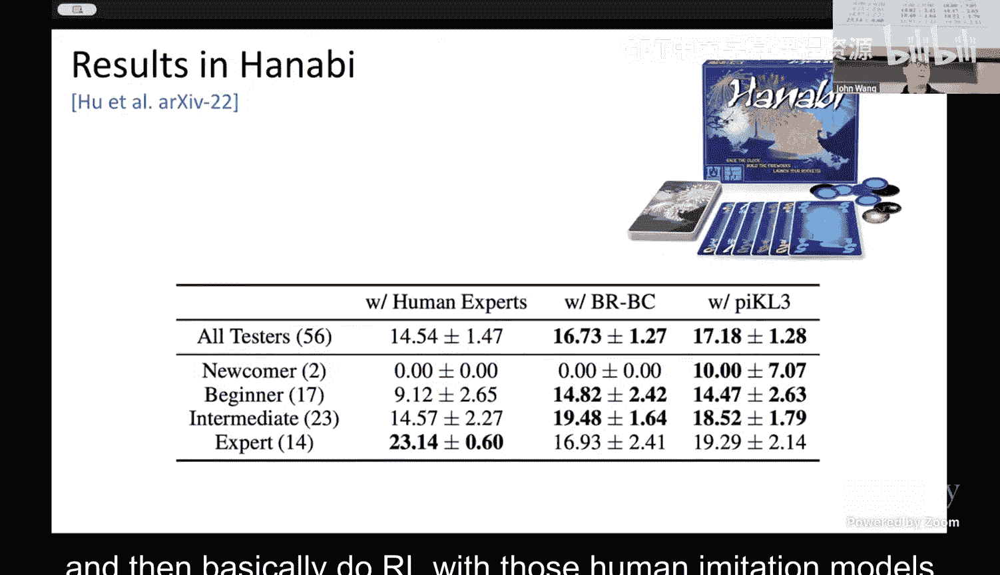

---

## 智能体间协作：动机与现状

虽然与人类合作需要人类数据，但让AI智能体之间相互协作则不一定需要。智能体间协作主要有两大动机：

1.  **降低延迟**：像O1这样的思维链模型，思考时间越长，性能越好。但串行思考的延迟终将成为瓶颈。多智能体系统可以通过**并行**方式（如“最佳N采样”、“共识”等方法）在保持性能的同时降低延迟。
2.  **利用多样性**：不同的模型擅长不同的任务。就像人类会使用计算器来处理大数乘法一样，一个大型语言模型也可以将特定任务“路由”或“移交”给更专业、更高效的小模型去完成。**路由本身已经是多智能体AI的一种形式**。

目前，基于LLM的多智能体系统（常被称为“脚手架”）已经出现，但它们往往需要大量工程，且比较脆弱。尽管如此，现在正是研究多智能体AI的激动人心的时刻。因为长期以来困扰该领域的一个核心问题——“如何让智能体彼此沟通”——现在有了清晰的答案：**让它们用自然语言对话**。基础模型的快速发展使我们处于突破的边缘。

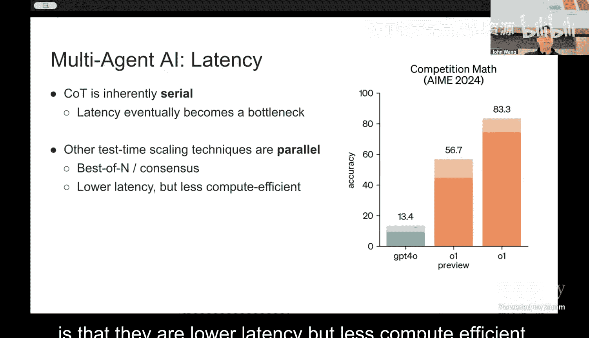

近期一些行业领先公司的博客也指出，虽然当前技术尚未完全成熟，但我们已经非常接近实现可靠、长上下文、主动式多智能体协作的阶段。

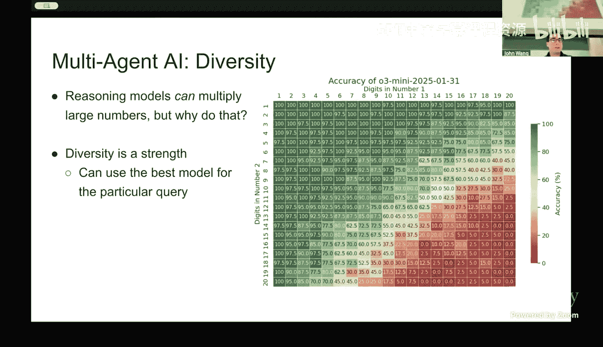

---

## 总结
本节课我们一起学习了多智能体AI的核心内容。

我们首先回顾了**自博弈**在双人零和博弈（如围棋、扑克）中的成功，它能在无需人类数据的情况下收敛到稳健的**极小化极大均衡**。我们探讨了适用于**不完美信息博弈**的算法（如遗憾匹配），这些算法能计算出动作的正确概率分布。

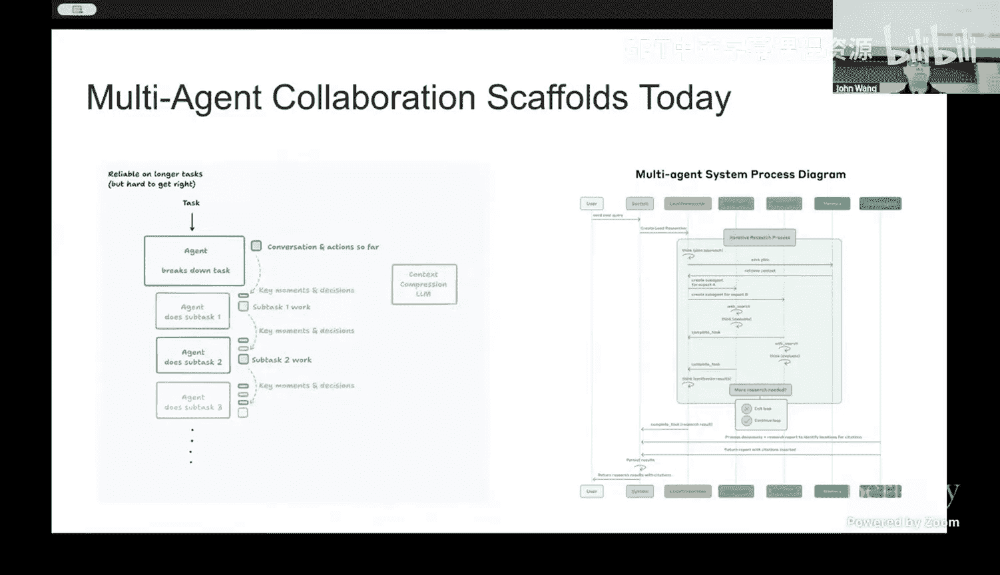

随后，我们将视野扩展到**非零和、多玩家博弈**（如最后通牒博弈、外交游戏）。在这里，极小化极大均衡的概念不再适用，与人类合作的目标要求我们必须使用**人类数据**来学习针对人类行为的**群体最佳响应**。我们介绍了通过模仿学习人类数据，再结合强化学习的有效范式。

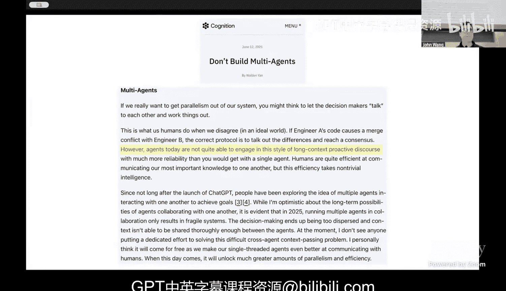

最后，我们探讨了**智能体间协作**的动机（降低延迟、利用模型多样性）和现状。尽管当前的多智能体系统仍处于早期阶段，但自然语言作为通用通信媒介的出现，为解决历史难题带来了曙光，预示着这是一个充满潜力的研究方向。