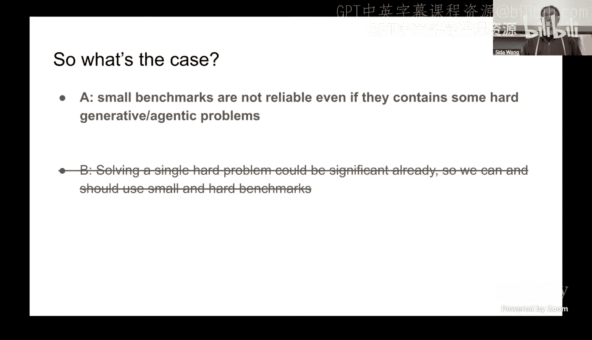
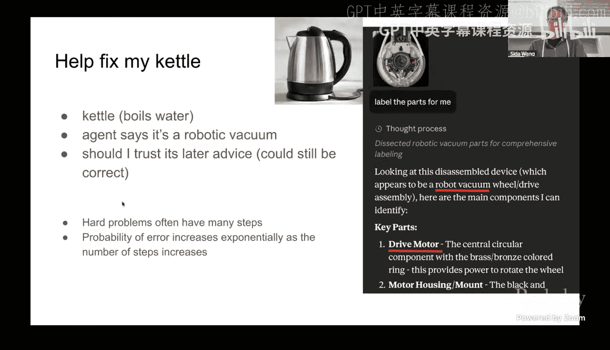
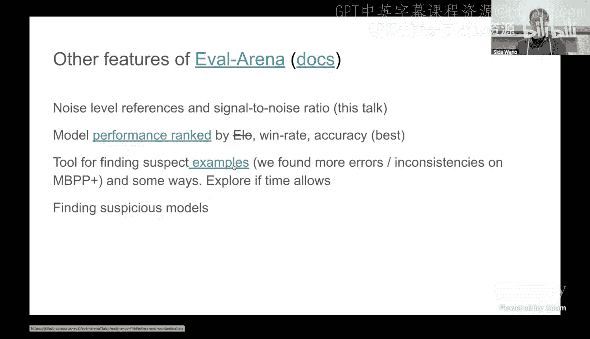
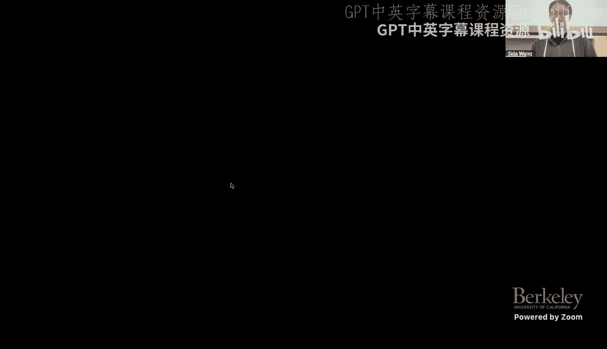
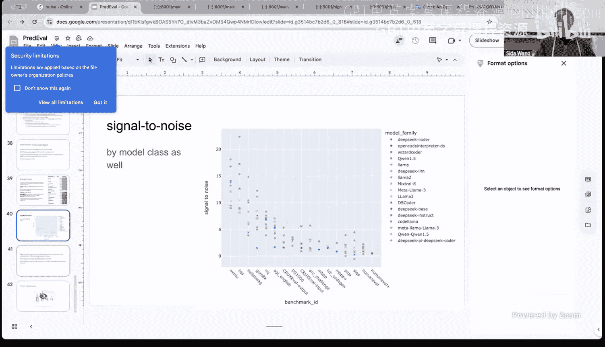

# 6：大语言模型基准测试中的可预测噪声

在本节课中，我们将跟随来自 Meta 的研究科学家 Sida Wang，探讨大语言模型（LLM）基准测试中一个关键但常被忽视的问题：评估噪声。我们将学习如何理解基准测试结果中的统计显著性，以及为什么即使面对“困难”的测试题，小规模基准测试的结果也可能不可靠。

---

## 概述：基准测试的挑战

上一节我们介绍了智能体评估的基本概念。本节中，我们来看看评估过程中一个具体的挑战：统计噪声。

随着大语言模型能力的提升，评估基准变得越来越复杂和生成式，例如代码生成或智能体任务。然而，这些基准的规模（题目数量）往往比传统的分类基准（如 ImageNet）小得多。同时，许多论文报告的模型性能提升幅度相对较小。这就引出了一个核心问题：**在小规模但包含复杂问题的基准测试中，观察到的性能提升是否真实可靠？**

## 基准测试的现状与问题

近年来，基准测试呈现出“题目变难，但数量变少”的趋势。

以下是几个典型基准的规模对比：
*   **传统基准**：ImageNet（100万）、MNIST（1万）。
*   **早期生成式基准**：HumanEval（164题）。
*   **现代代码/智能体基准**：LiveCodeBench、SWE-bench 等，规模通常在几百到一千题左右。

一个常见的反驳观点是：虽然题目数量少，但每个题目（例如一道需要生成长篇代码或推理轨迹的题）本身信息量巨大，应该比选择题更可靠。这类似于人类的高难度竞赛（如国际数学奥林匹克，仅6题）或解决单个重大开放性问题。

然而，通过数据分析，我们发现情况并非如此简单。

## 数据揭示的不一致性

我们可以通过可视化模型-题目表现矩阵来观察问题。矩阵中，模型按平均性能排序（从左到右，由好到差），题目按难度排序（从上到下，由易到难），颜色表示模型在该题上的正确率。

从多个基准（如 MATH、HumanEval、BIG-Bench）的数据中，可以观察到两个现象：
1.  **明显的趋势**：好模型在易题上表现好，差模型在难题上表现差。
2.  **显著的不一致性**：即使是总体最好的模型，有时也会在简单题上犯错；而一些总体很差的模型，偶尔也能解决部分难题。

这表明，基准中的问题可能并非“独一无二”的困难，即使是较差的模型也有一定的概率猜对或偶然解决它们。因此，**仅凭题目“困难”并不足以弥补统计效力的不足**。

## 核心概念：统计显著性分析

上一节我们看到了数据中的噪声模式。本节中，我们来看看如何用统计方法量化这种噪声，并判断性能差异是否显著。

### 基本框架与公式

首先定义一些符号：
*   设有一个包含 `n` 个问题的基准，第 `i` 个问题为 `X_i`。
*   模型 `A` 在问题 `X_i` 上的输出为 `A(X_i) ∈ {0, 1}`（0 错误，1 正确）。
*   模型 `A` 在该基准上的平均表现为：`Ā = (1/n) * Σ A(X_i)`。

从统计视角看，我们手中的 `n` 个问题是从一个更大的“问题总体分布”中抽样得到的。我们关心的是模型在**整个总体**上的平均性能 `μ_A`，而 `Ā` 是其估计值。

**均值标准误** 衡量了这个估计的波动范围：
`SE(Ā) = sqrt( Var(A(X)) / n )`
其中 `Var(A(X))` 是模型 `A` 在所有可能问题上的表现方差。对于 0/1 输出，方差最大为 0.25。

### 模型比较与配对检验

我们更常需要比较两个模型 `A` 和 `B`。此时，我们关注差异 `D_i = A(X_i) - B(X_i)`。

差异均值的标准误为：
`SE(Ḏ) = sqrt( Var(D) / n )`

**配对检验** 的关键优势在于，如果两个模型在相同问题上的表现高度相关（即 `A(X_i)` 和 `B(X_i)` 同时高或同时低），那么 `Var(D)` 会远小于 `Var(A(X)) + Var(B(X))`，从而**降低标准误，提高检测细微差异的统计效力**。

计算 **Z 分数** 来判断差异是否显著：
`Z = (Ā - B̄) / SE(Ḏ)`
在样本量足够大时，Z 分数近似服从标准正态分布。通常，`|Z| > 2` 被认为在 5% 的显著性水平上具有统计显著性。

### 大语言模型的独特之处：可重复抽样

与传统测试者不同，大语言模型可以对**同一个问题**进行多次独立抽样（例如，通过调整随机种子生成多个答案）。这引入了另一种噪声源。

我们可以将总方差分解为：
`总方差 = 问题抽样方差 + 模型抽样方差`
其中，模型抽样方差可以通过对同一问题多次运行模型并计算其表现方差来估计。在评估时，我们需要同时考虑这两种方差来源。

## 实证结果：基准测试的噪声水平

基于上述方法，我们对大量模型和基准进行了分析，得出了普遍性的结论。

### 主要发现

1.  **配对与非配对检验差异不大**：在许多基准上，配对检验带来的方差减少并不显著。这意味着模型在不同问题上的错误模式相关性大约在 50% 左右。因此，即使使用配对检验，统计效力提升有限。
2.  **噪声水平可预测**：对于一个给定的基准，其评估噪声（标准误）主要取决于参与测试模型的**平均正确率**，并且遵循一个可预测的模式。
3.  **经验公式**：当模型性能不是极好或极差时（例如正确率在 20%-80%），标准误可以用一个 **Beta 分布** 来近似描述，其参数之和约为 1。这提供了一个无需详细每题数据即可估算噪声的简便方法。

### 给研究者的建议

1.  **报告每题结果**：提供模型在每个测试题上的具体表现（而不仅仅是总分），以便进行更深入的统计分析。
2.  **使用提供的参考数据**：可以利用本研究提供的各基准标准误参考表，快速估算自己结果所需的显著性差异幅度。
3.  **进行正确的统计检验**：避免错误使用 Bootstrap 等方法。对于常规的模型比较，采用基于方差估计的 Z 检验或配对的排列检验通常是可靠的选择。

## 噪声分析的延伸应用

除了衡量噪声，这种细粒度的数据分析还能用于：

*   **审计基准质量**：找出那些与模型总体性能呈**负相关**的题目。这些题目可能是标注错误、模糊不清，或者衡量了某种与主流能力无关的特质。例如，在 MMLU 基准中，通过此方法发现了一些错误并得以修正。
*   **检测可疑模型**：如果一个模型在那些被发现有潜在问题的题目上（尤其是错误题目）表现异常完美，可能提示该模型在训练中接触过测试数据（即数据泄露）。

## 总结

本节课中，我们一起学习了如何批判性地看待大语言模型的基准测试结果。

我们首先通过数据可视化，观察到即使在小规模、高难度的基准测试中，模型表现也存在显著的不一致性，说明“题目难度”不能自动保证评估的可靠性。

接着，我们介绍了评估统计显著性的核心框架，包括均值标准误、配对检验和 Z 分数。特别强调了大语言模型可重复抽样的特性，以及如何分解问题抽样和模型抽样两种方差。

然后，我们总结了实证研究的主要发现：多个基准的评估噪声具有可预测的模式，配对检验的增益有限，并且提供了估算噪声的经验性方法。

最后，我们探讨了如何利用细粒度数据分析来改进基准本身，并检测潜在的数据泄露问题。

理解评估中的噪声，对于客观比较模型能力、设计可靠的基准以及可信地报告研究成果都至关重要。希望本课内容能帮助大家在纷繁的基准测试排行榜和模型比较中，建立起更严谨的评估视角。