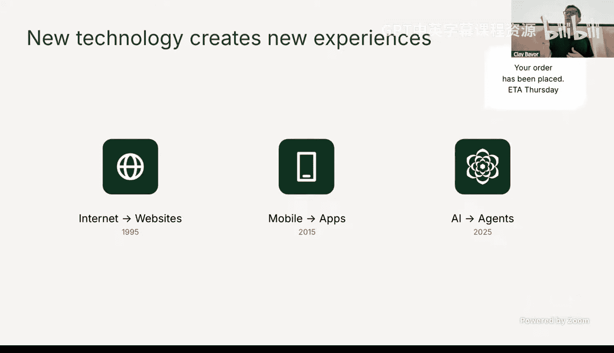
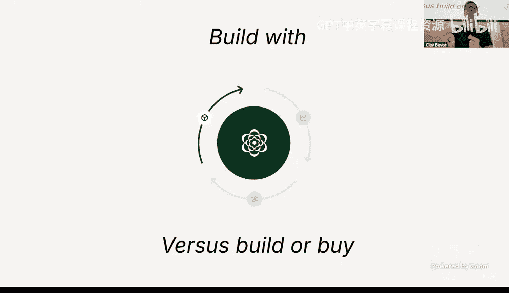
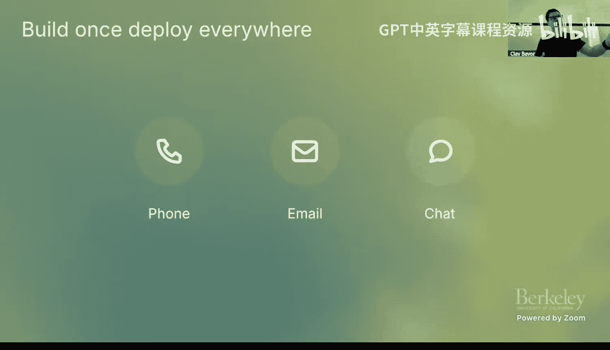
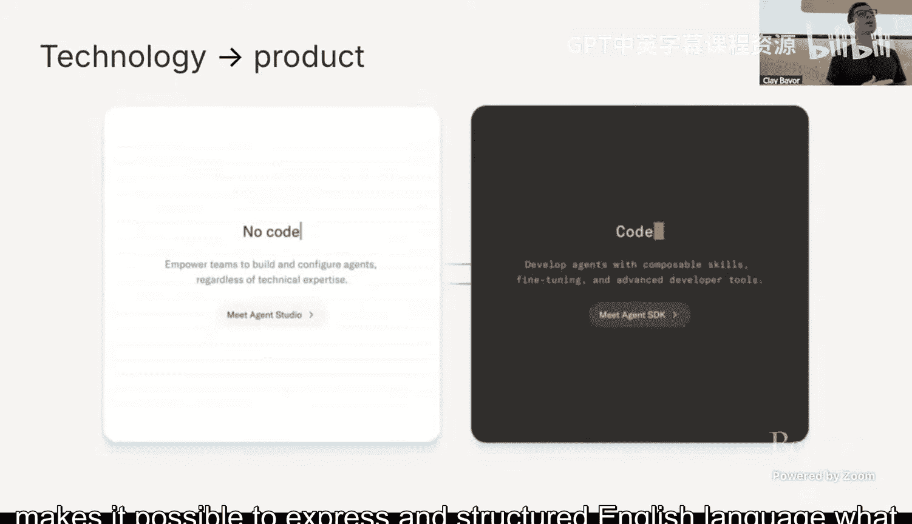
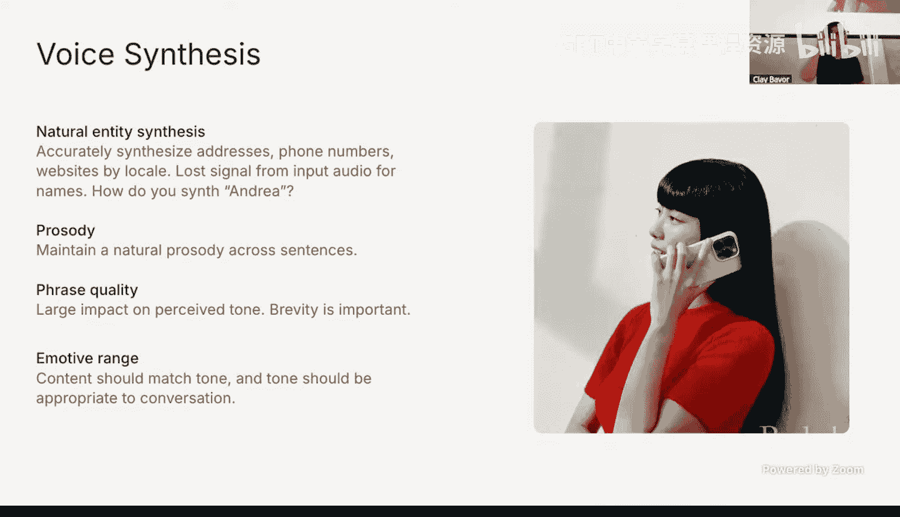
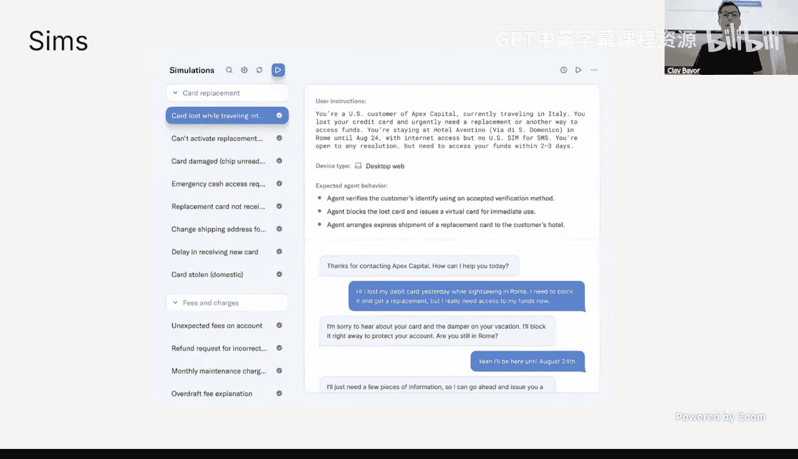
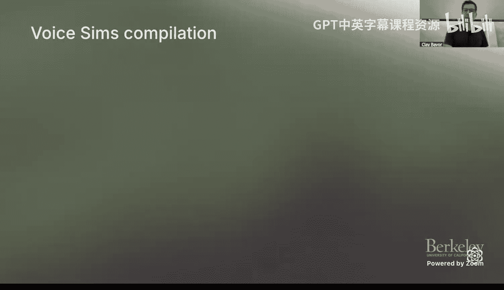
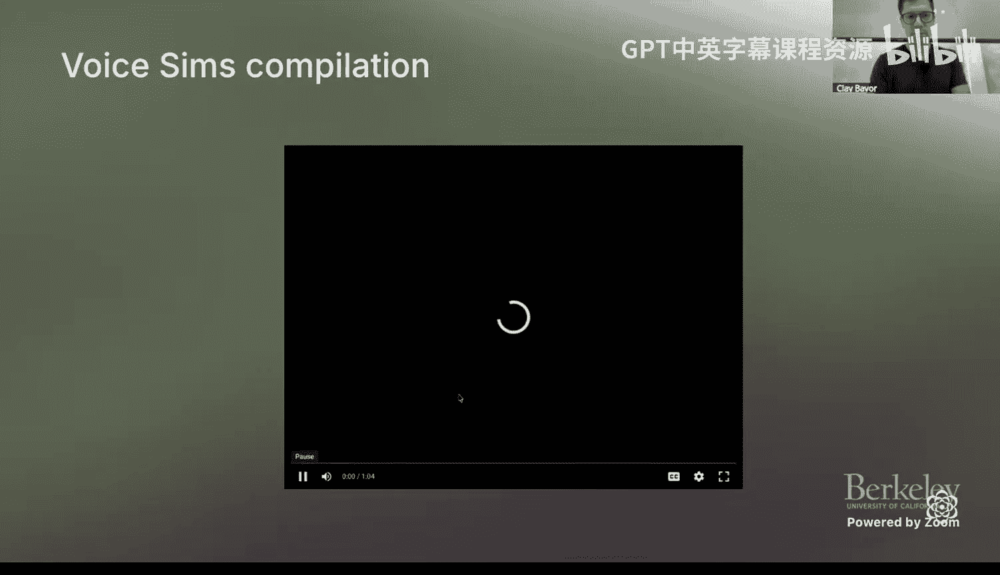
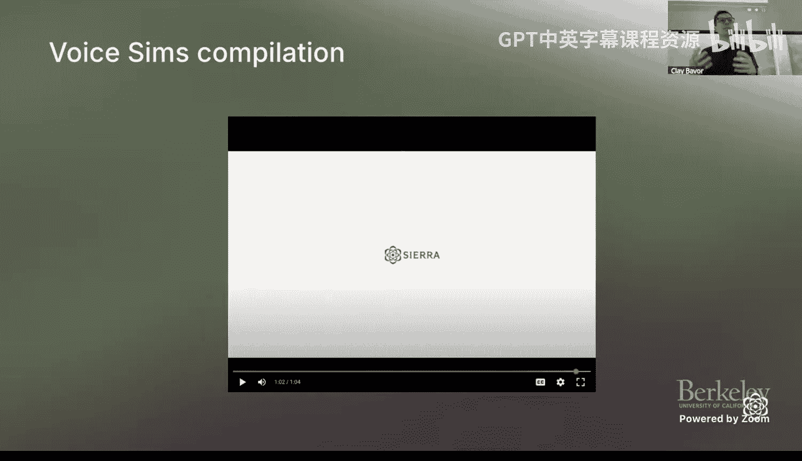
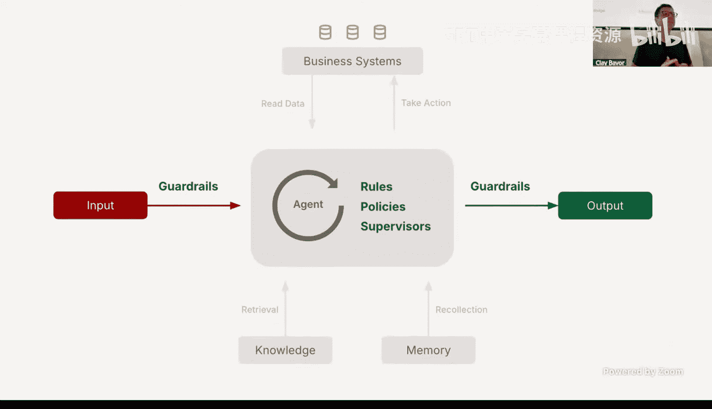

# 8：从实际部署中获得的实用经验

在本节课中，我们将跟随Sierra联合创始人Clay Bavor，学习构建和部署面向客户的AI智能体（Agent）的实践经验。我们将探讨智能体如何重塑企业与客户的互动方式，并深入了解在现实世界中部署可靠、可扩展的智能体所面临的技术挑战和解决方案。

## 智能体的世界：分类与愿景

上一节我们介绍了课程背景，本节中我们来看看智能体世界的宏观图景。Clay将智能体大致分为三类。

以下是三种主要的智能体类别：
1.  **个人智能体**：如ChatGPT、Gemini，它们作为我们可信赖的个人数字助手。
2.  **角色/人物型智能体**：如编码助手或Harvey这样的法律智能体，它们在特定工作场景中提供帮助。
3.  **面向客户的智能体**：Sierra专注于此类，认为未来每家企业都将拥有自己的客户服务智能体。

智能体之于AI，正如网站之于互联网，应用之于移动设备。它们将彻底改变企业服务客户的方式，从产品推荐、设置激活、交叉销售、故障排除到客户留存管理。

## 核心理念：从多渠道到统一智能体

目前，企业通过电话、聊天、邮件等多个独立渠道与客户互动。Sierra的核心观点是，未来这些渠道将**收敛为一个统一的智能体**。这个智能体被赋予企业的知识和最佳实践，然后出现在客户所在的任何地方（短信、WhatsApp、电话、邮件），不仅能回答问题，更能**完成任务**。

这种转变引入了新的商业模式：**基于结果的定价**。企业仅在智能体成功解决客户问题（如完成退货、促成销售）时才付费，这深度对齐了服务提供商与客户的利益。

## 构建挑战：冰山下的复杂性

对于许多技术团队而言，构建一个智能体看似简单：选择一个语言模型，集成一些工具和API。然而，实际构建过程如同潜入水下，会发现大量需要正确处理的问题。

以下是在构建企业级智能体时必须解决的关键挑战：
*   **版本控制与发布管理**：在智能体语境下如何操作？
*   **可观测性**：如何观察智能体的行为？
*   **可靠性**：如何确保智能体不“胡言乱语”？
*   **合规与安全**：如何防止在金融、医疗等受监管领域提供非法建议？
*   **性能**：如何优化延迟，尤其是在语音交互中？
*   **准确性**：如何正确转录专有名词、处理不同口音？
*   **安全性**：如何防止恶意攻击者通过提示注入等手段操纵智能体？

Sierra的目标是将智能体开发从“拼接技术”的工匠模式，转变为可配置、可构建、可保障安全的**产品化平台**。

## 关键演进：从单次事务到持续关系

目前的智能体大多是“事务性”的，每次交互都是独立的，会话间没有记忆。Sierra正在努力构建**上下文和记忆基础**，使智能体能够在多次互动中记住客户和历史，实现“热启动”，从而与客户建立长期关系，而不仅仅是处理单次事务。

## 开发范式：针对非确定性软件的新方法

智能体是一种**非确定性**的新型软件。对于给定输入，你无法预先知道确切的输出，且需要处理人类语言的杂乱性。因此，它们需要一套全新的软件开发、测试和优化生命周期。

Sierra采用“**基于平台构建**”而非“自建或购买”的思维，提供一个平台即服务（PaaS），抽象底层复杂性，提供高级构建模块，平衡了构建的灵活性与购买方案的简便性。

## 测试革命：模拟与评估

由于智能体的非确定性，传统的单元测试或集成测试不足。必须在尽可能接近真实世界的场景中进行测试。为此，Sierra的研究团队创建了**TauBench**（工具-智能体-用户基准测试）。

TauBench是一个用于评估AI智能体的现实测试框架，包含以下要素：
*   **真实领域**：如电信、零售、航空等客户服务场景。
*   **模拟场景**：数百个具体问题情境。
*   **工具与环境**：模拟真实的数据库和API（如迷你版Shopify、航空订票系统）。
*   **用户角色**：基于语言模型的模拟用户，带有特定情绪和背景。
*   **动态环境**：环境状态可随智能体或用户的操作而改变。
*   **成功评估**：不仅看智能体能否完成任务，更关注其**持续成功率**（Pass@K指标）。

Sierra已将TauBench的理念产品化为“模拟”功能，客户可以配置合成数据库、工具，并创建带有情绪状态的模拟用户角色，甚至模拟完整的语音交互管道，以进行全面的压力测试。

## 语音智能体的特殊挑战

构建可靠的语音智能体尤其复杂。目前的最优方案是一个**流水线处理**：语音转文本 -> 智能体推理决策 -> 文本转语音，而非端到端的音频模型。

在语音交互中需要解决诸多难题：
1.  **延迟优化**：必须压缩流水线中每一毫秒的延迟。技术包括**推测性推理请求**（同时向同一推理服务发起多个请求，取最先返回的结果）和并行化处理。
2.  **中断检测**：需要精细区分用户的附和（如“嗯”、“懂了”）和真正的意图打断，这需要专门微调的模型。
3.  **服务可靠性**：主流模型的服务可用性并非完美，需要具备在提供商间**故障转移**的能力。
4.  **转录准确性**：专有名词（药品名、产品名、夏威夷语词汇）的转录是巨大挑战。**词错误率**并非唯一或最佳指标，需自定义更能反映真实体验的度量标准。
5.  **语音合成质量**：电话号码、地址、人名的读法有特定习惯。合成语音的**措辞、质量、节奏和情感范围**都至关重要，聊天场景的文本输出直接用于语音会显得冗长笨拙。

Sierra甚至设有“**语音品鉴师**”这一独特角色，负责根据企业品牌个性（如Weight Watchers与Harley Davidson的差异）为其匹配最合适的语音属性，如低沉度、呼吸声、鼻音、清晰度等。

## 安全与防御：应对提示注入与滥用

将智能体面向真实客户时，必须高度防范**提示注入攻击**和其他形式的智能体滥用。攻击方式层出不穷（例如用冰岛语倒序提问以诱导泄露系统指令）。

Sierra采用分层防御策略：
*   **输入层**：结合确定性检查（如不区分大小写的关键词过滤）和基于LLM的监督器来识别攻击意图。
*   **智能体层**：内置规则、策略和次级监督器。
*   **输出层**：检查智能体是否输出了其内部提示，若是则终止会话。
*   **系统访问**：智能体对CRM、交易数据库等记录系统的访问必须通过传统的、具有访问控制和密钥的确定性软件来管理，而非直接赋予LLM无限制访问权。

构建大规模智能体需要应对传统软件漏洞（如拒绝服务、SQL注入）与AI特有漏洞（如提示注入、上下文污染）的结合，挑战巨大。

## 用AI优化AI：智能体进化的核心

Sierra相信，解决AI问题的方法往往是**更多的AI**。他们在核心智能体周围部署了一系列“微智能体”：
*   **监督智能体**：确保主智能体专注任务、基于知识库提供事实、不提供医疗建议、不贬低竞争对手等。
*   **任务特定智能体**：在特定任务上监督主智能体的表现。
*   **洞察分析**：允许客户像使用ChatGPT一样，对客户对话数据提出开放式问题（如“导致客户满意度下降的前五大原因是什么？”），从数字化交互的宝藏中提取洞察。
*   **专家答案**：分析智能体无法处理而转接给人工客服的问题，学习专家的解决方案，并合成新知识来增强智能体，实现持续自我改进。

## 总结

本节课中，我们一起学习了从实际部署面向客户的AI智能体中获得的宝贵经验。我们探讨了智能体如何通过统一多渠道、基于结果定价来改变商业交互模式。我们深入了解了构建可靠智能体在**非确定性软件开发、复杂测试模拟（如TauBench）、语音交互优化（延迟、中断、合成）以及多层安全防御**等方面面临的深刻挑战。最后，我们看到了如何利用AI监督AI、从数据中提取洞察以及通过持续学习来使智能体不断进化。这些实践经验为任何有志于在现实世界中构建和部署智能体的人提供了重要的路线图和警示。