# 9：多智能体系统在LLM时代

在本节课中，我们将跟随Google DeepMind的副总裁、Gemini项目联合技术负责人Oriol Vinyals，探讨多智能体系统的发展历程及其在大型语言模型（LLM）时代的应用。我们将回顾AlphaStar项目的关键洞见，并将其与当前LLM智能体的构建方法进行对比，理解历史经验如何为未来指明方向。

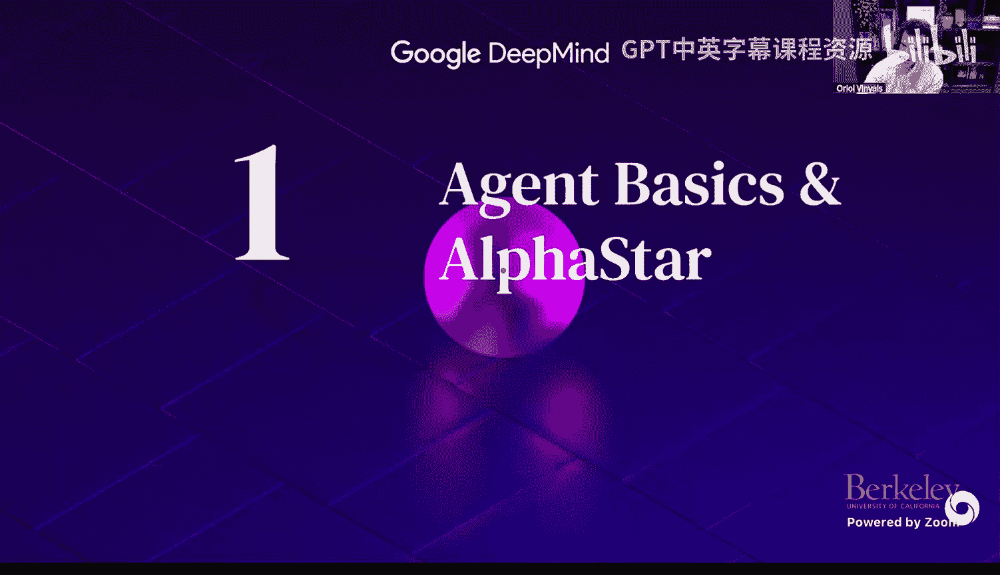

## 智能体的演变：从游戏到通用助手

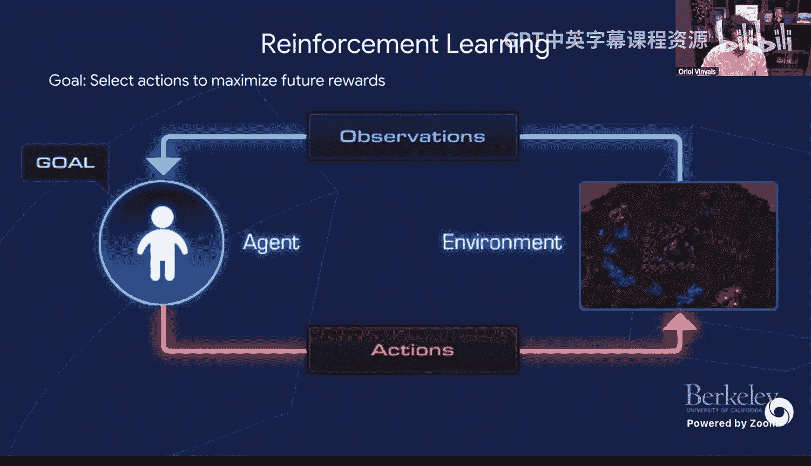

上一节我们介绍了课程背景，本节中我们来看看智能体概念本身的演变。

在DeepMind早期，智能体被定义为一个与**环境**交互的实体，其目标是最大化**奖励**。环境提供**观测**，智能体执行**动作**，形成一个清晰的闭环。这在游戏等定义明确的环境中非常有效。

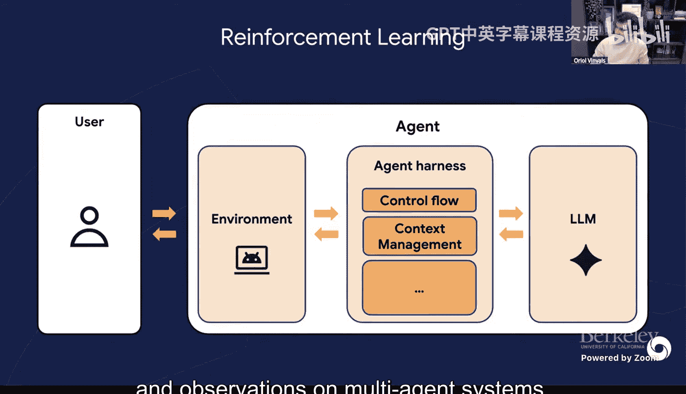

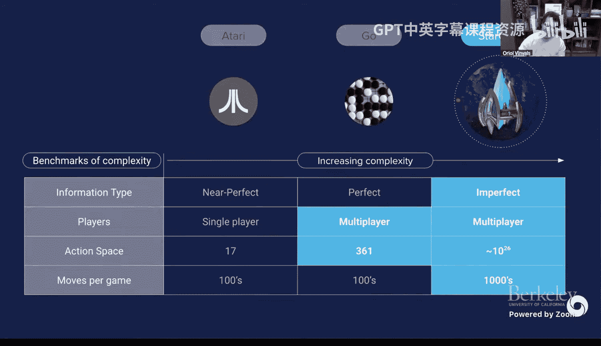

然而，今天的情况已大不相同。我们有了**助手**，它们协助用户完成任务。此时，环境和动作的定义变得模糊。更准确的视角是，我们将整个系统视为一个**智能体框架**。用户与一个核心智能体（如LLM）交互，该智能体则在一个可能非常复杂的环境（如数字计算机、网络或游戏）中执行操作（如搜索、终端命令）。这种范式虽然不如过去整洁，但带来了更多可能性。

## 历史背景：从Atari到星际争霸

DeepMind在游戏AI领域有一系列标志性项目，构成了其技术发展的“课程表”。

以下是其发展路径中的关键项目：
*   **Atari**：早期里程碑，证明了深度强化学习在复杂环境中的潜力。
*   **AlphaGo**：攻克了围棋这一具有巨大搜索空间的游戏。
*   **AlphaStar**：选择了实时战略游戏《星际争霸II》，因其巨大的复杂性（部分可观测、连续动作空间、长时程规划）被视为AI的“毕业挑战”。
*   **后续项目**：如Gato（通用智能体）、Flamingo（视觉语言模型）和如今的Gemini，都从游戏AI项目中汲取了算法、规模化或数据处理方面的灵感。

## AlphaStar的技术架构：预训练与后训练的雏形

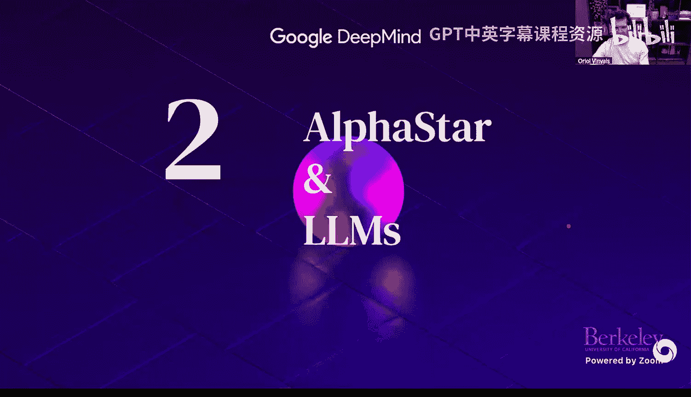

AlphaStar的成功并非一蹴而就，其训练流程与当今LLM的开发惊人地相似。

其训练主要分为三个阶段：
1.  **监督学习（模仿学习）**：从超过100万场人类《星际争霸II》对战录像中学习。这类似于LLM的**预训练**阶段，旨在从海量数据中获取关于领域的基础知识。
2.  **强化学习**：在模仿学习得到的策略基础上，通过与环境交互来优化胜率。这对应于LLM的**后训练**（如RLHF）阶段，用于精调和提升性能。
3.  **大规模多智能体训练**：强化学习并非在真空中进行，而是发生在一个包含数千个智能体、相互博弈的复杂系统中。这是保证智能体**鲁棒性**和**策略多样性**的关键。

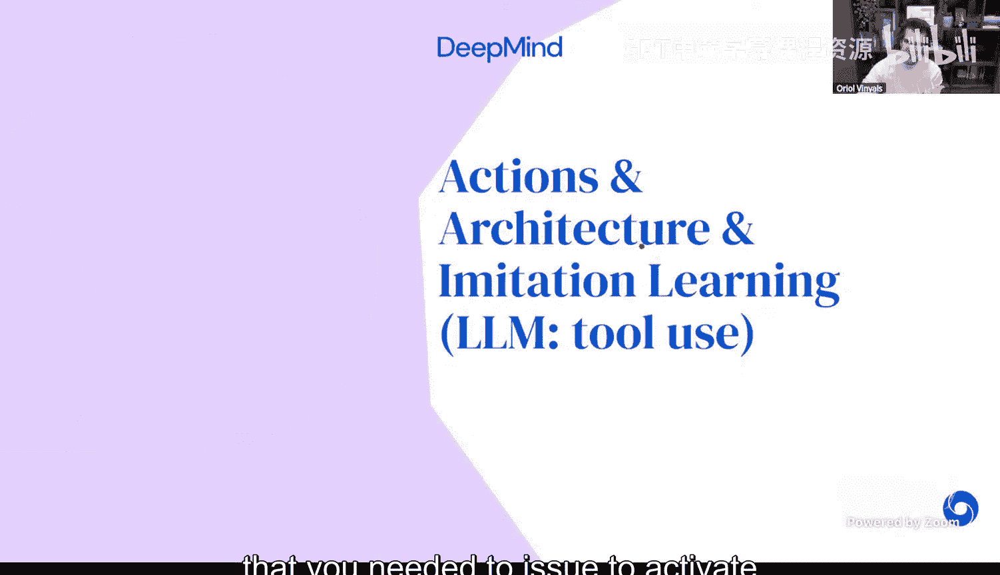

## 核心挑战与解决方案对比

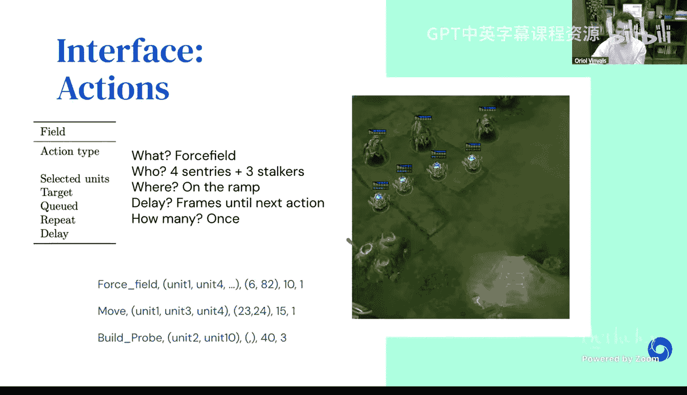

接下来，我们深入探讨AlphaStar面临的具体挑战及其解决方案，并与当前LLM智能体进行对比。

### 动作空间与工具使用

在《星际争霸II》中，智能体需要通过API向游戏发送指令，每个指令（动作）包含函数名和多个参数（如坐标、单位、延迟）。

**AlphaStar的解决方案**：设计了一个自回归神经网络架构，将动作序列的生成结构化。网络通过一系列softmax层依次输出动作类型、参数（如坐标、延迟）等。这相当于为特定的API“手写”了一个语法。

**LLM时代的对比**：当今LLM的**工具使用**能力与之类似，但更加灵活。LLM通过理解自然语言或代码描述的API规范，能够生成调用各种工具（搜索引擎、终端、GUI操作）的指令。一个通用的Transformer架构可以适应无数种API格式，无需为每种工具定制网络结构。

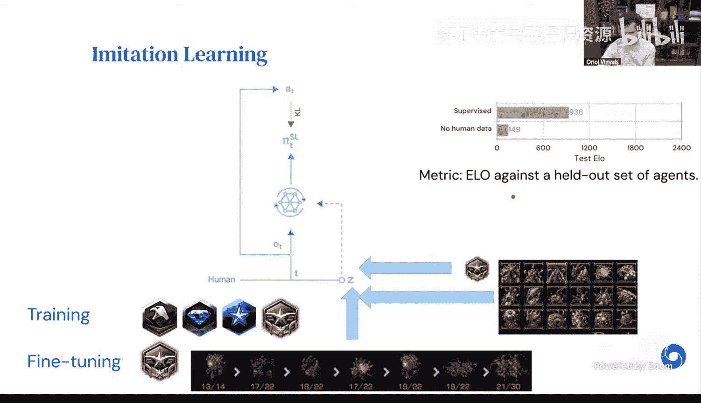

### 模仿学习的必要性

在像《星际争霸II》这样复杂的环境中，纯粹的强化学习（从随机策略开始）效率极低，甚至可能学到一些怪异但能赢的无效策略（例如控制所有农民去攻击）。

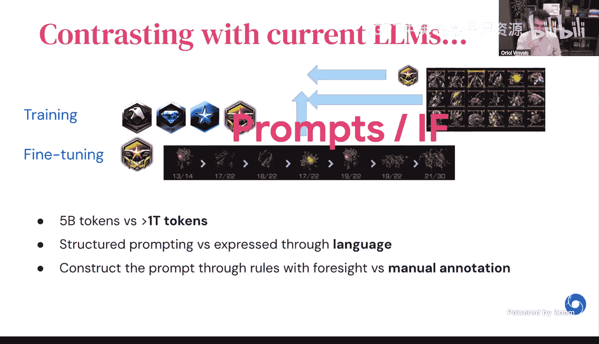

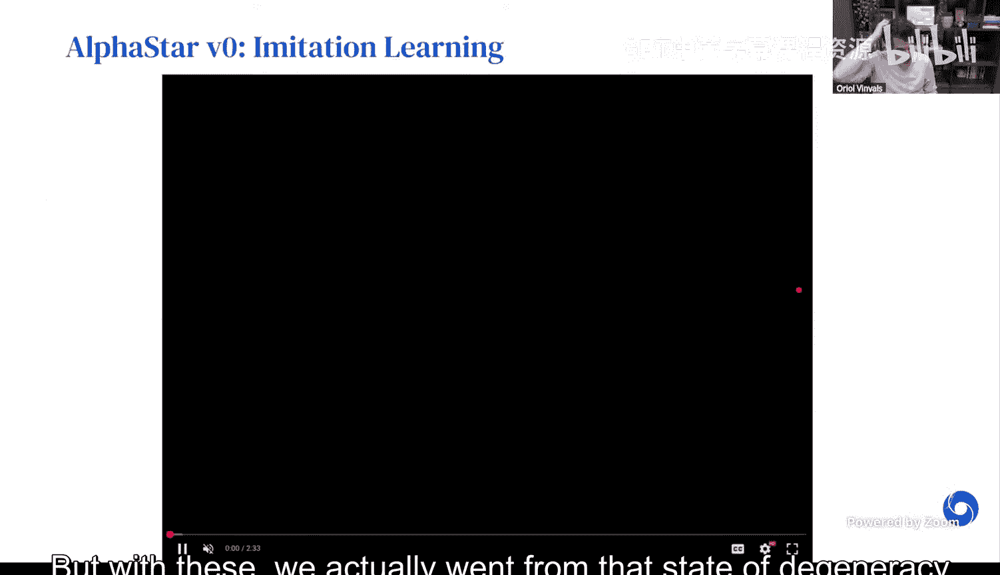

**AlphaStar的解决方案**：必须依赖大量人类游戏数据进行模仿学习，以**引导**智能体进入合理的策略空间。这验证了“人类先验知识”对于解决复杂问题的重要性。

**LLM时代的对比**：当前LLM的发展强烈支持这一观点。纯粹的自我进化（无预训练）能否达到通用智能（AGI）是存在争议的。绝大多数证据表明，从人类创造的海量文本、代码等多模态数据中进行预训练，是通往强大模型的必经之路。

### 提示与控制信号

为了增加策略的多样性和可控性，AlphaStar在训练时向智能体提供了额外的“提示”信息。

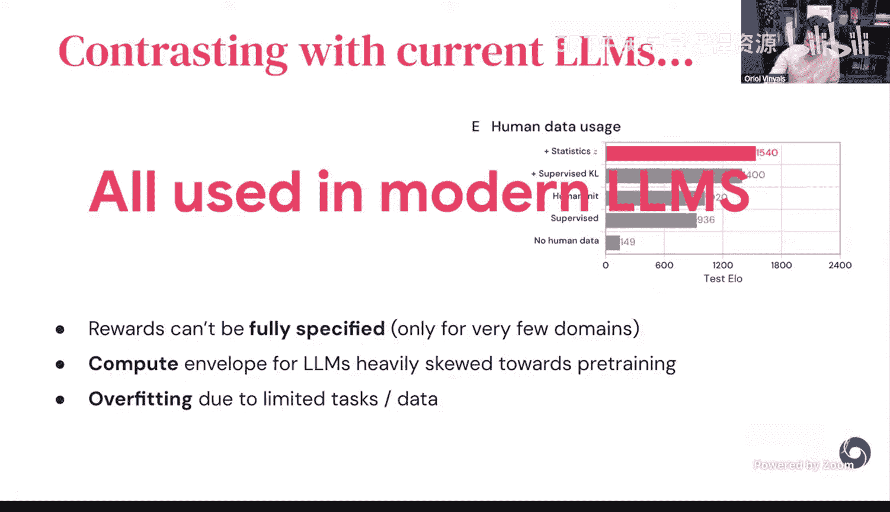

**AlphaStar的解决方案**：这些提示是结构化的向量，包含诸如“本场游戏后期会出现的兵种”等元数据。智能体被条件化于这些向量，从而学习执行不同的建造顺序和策略风格。这相当于一种早期的、结构化的**指令跟随**。

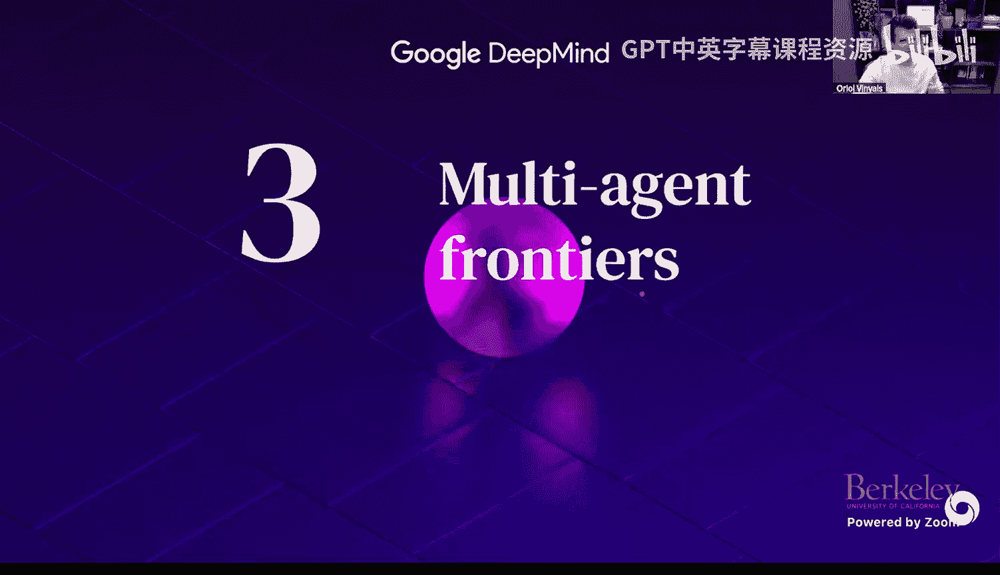

**LLM时代的对比**：现代LLM通过自然语言**提示**进行控制，其灵活性和表达力远超结构化向量。无论是代码竞赛题目还是定理证明要求，都可以通过提示来指导模型行为。两者的核心思想一致：通过额外的条件信息来引导智能体产生期望的输出。

### 后训练（强化学习）的技巧

AlphaStar的强化学习阶段采用了多种技巧来提升效果和稳定性。

以下是其采用的关键技巧：
*   **监督KL惩罚**：在RL训练目标中加入一项，用于约束新策略不要过分偏离模仿学习得到的基础策略。这有助于保持策略的多样性，防止**模式崩溃**。类似于LLM后训练中的**蒸馏**或**正则化**技术。
*   **价值函数使用全局信息**：尽管游戏是部分可观测的，但用于评估状态价值的函数被允许使用全局信息（即“上帝视角”），这大大降低了训练方差，使学习更稳定。
*   **条件化训练**：延续了模仿学习阶段的思路，在RL中也使用策略提示，进一步提升了性能。

**与LLM后训练的主要差异**：
*   **奖励定义**：《星际争霸II》的奖励（胜/负）相对明确，而LLM任务的奖励（如“写一首好诗”）则非常模糊，需要人类反馈。
*   **计算分配**：在AlphaStar中，大部分计算资源用于后训练（强化学习）。而在当前LLM开发中，绝大部分计算都投入在了**预训练**阶段。
*   **过拟合问题**：LLM后训练面临的任务和数据是有限的，容易过拟合到特定的评估集上。而《星际争霸II》的环境可以生成近乎无限多样的对局，过拟合风险较低。

## 多智能体系统的核心：为何以及如何构建

上一节我们讨论了训练单个智能体的技术，本节中我们来看看为什么需要以及如何构建多智能体系统。其核心目标是解决智能体的**脆弱性**和提升**鲁棒性**。

即使一个智能体在平均表现上很强大，它也可能存在容易被利用的致命弱点。这与当前LLM在某些简单问题上突然“翻车”的现象类似。

根据策略的通用性和对抗性，我们可以对“攻击”策略进行分类：
*   **对抗性策略**：类似神经网络的对抗样本，通过微小的、不自然的操作导致智能体行为失常。这类策略通常只对特定模型权重有效。
*   **剥削者策略**：通过反复与某个固定策略对战，找到其弱点并深入利用，直到总能获胜。这类策略针对性强。
*   **“Cheese”策略**：一种非常规但具有一定通用性的策略（如游戏中的“快攻”），能对抗许多不同的对手，但并非最优解。
*   **常规与最优策略**：均衡、全面的策略。

这种现象的根源在于许多复杂游戏中存在的**非传递性**。即在相同强度水平上，可能存在策略A克B，B克C，但C又克A的“石头-剪刀-布”循环。真正的“最强”策略需要能够应对所有这些循环。

### AlphaStar联盟：一个多智能体训练框架

为了解决非传递性和提升鲁棒性，AlphaStar项目设计了一个名为“联盟”的多智能体训练系统。

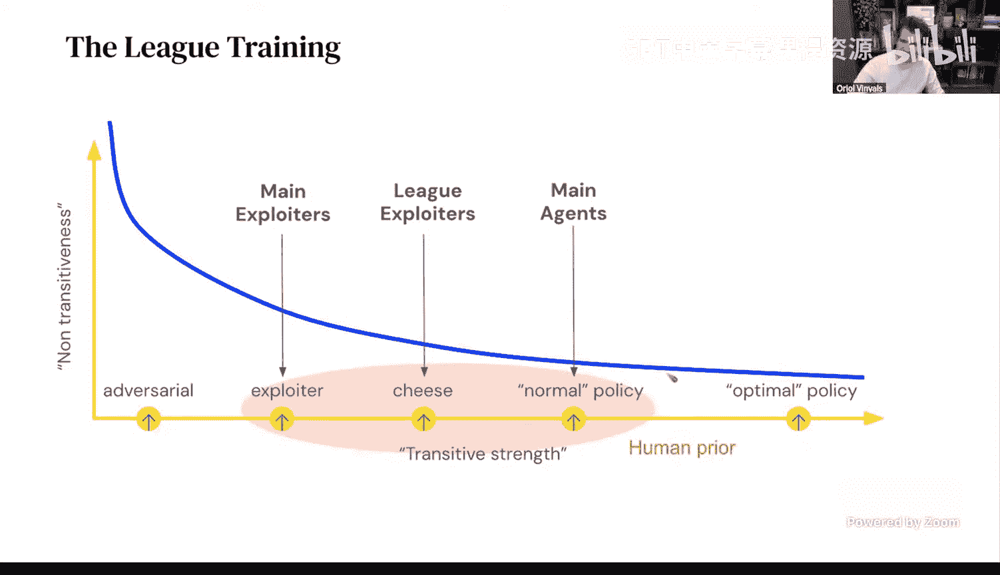

该系统包含三类智能体：
1.  **主智能体**：这是我们最终要部署的智能体。它们与联盟中的所有其他智能体对战。
2.  **主剥削者**：这类智能体的唯一目标是找到能击败当前**主智能体**的策略。它们可以针对主智能体进行训练，而主智能体则不能反过来针对它们。当某个主剥削者达到很高的胜率时，它就会被“冻结”并加入联盟，成为主智能体必须面对的新对手。
3.  **联盟剥削者**：这类智能体的目标是找到能击败联盟中**所有**智能体的通用“Cheese”策略。

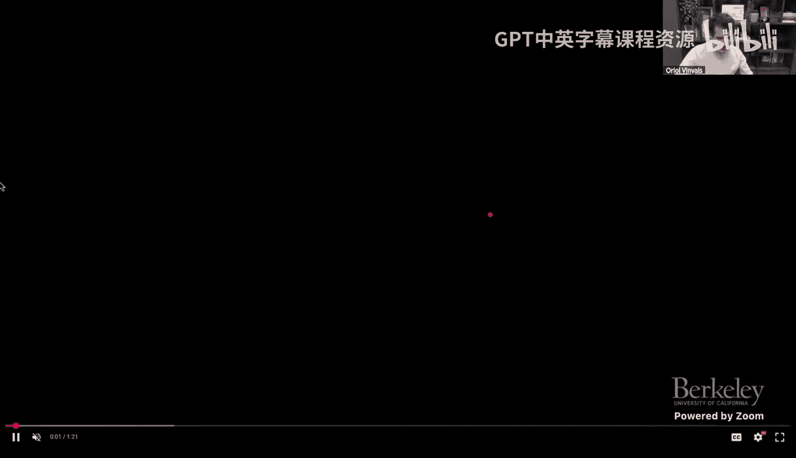

这个动态过程产生了持续的策略进化军备竞赛。主智能体在应对各种剥削者的挑战中，变得愈发全面和鲁棒。

### 关键洞见与细节

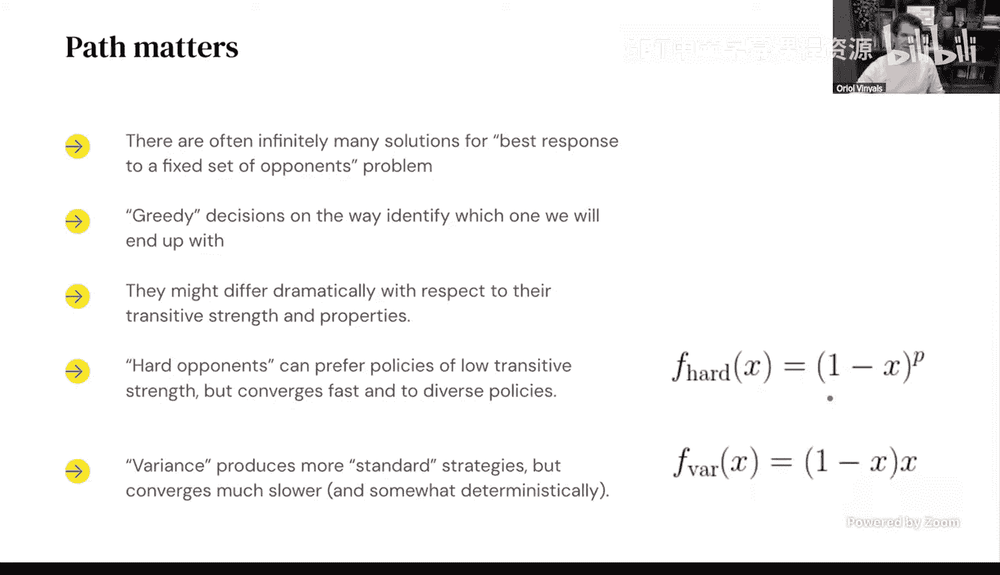

在构建多智能体系统时，一些设计选择至关重要：
*   **匹配机制**：主智能体应该选择与谁对战？AlphaStar尝试了两种策略：一是对抗胜率最高的对手（最难），二是对抗胜率最接近50%的对手（学习信号最强）。后者通常效果更好。
*   **可控的剥削**：在训练剥削者时，可以施加条件限制（例如“必须使用某种特定兵种来击败我”），这有助于引导系统探索更广泛的策略空间，从而让主智能体获得更全面的经验。
*   **多样性来源**：对于LLM而言，其预训练数据本身蕴含了巨大的行为多样性（不同语言、风格、任务）。这为构建鲁棒的多智能体系统提供了天然优势。

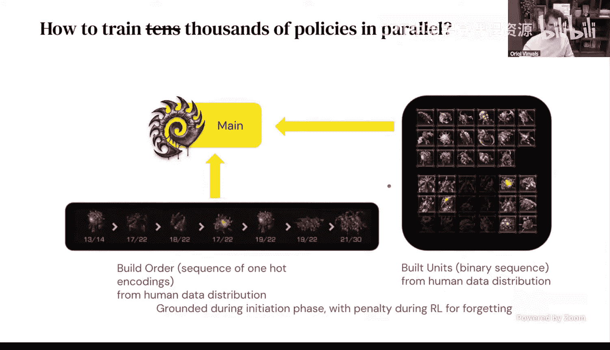

## 总结与展望

本节课中我们一起学习了多智能体系统从AlphaStar项目到LLM时代的发展脉络。

我们可以总结出以下关键点：
*   **历史经验的延续性**：LLM智能体的许多核心技术（预训练-后训练范式、工具使用、指令控制、正则化技巧）在早期的游戏AI项目中已有雏形。
*   **人类先验的重要性**：无论是游戏录像还是互联网文本，从高质量人类数据中学习，仍然是构建强大AI模型的基石。
*   **后训练的潜力**：与AlphaStar相比，当前LLM的后训练（强化学习）阶段在计算投入和算法成熟度上仍处于早期，有巨大的提升空间。
*   **多智能体是未来关键**：为了构建真正鲁棒、安全、通用的AI系统，多智能体训练与研究将至关重要。这不仅包括对抗性的“红队”测试，也包括协作性的多智能体共同解决问题。

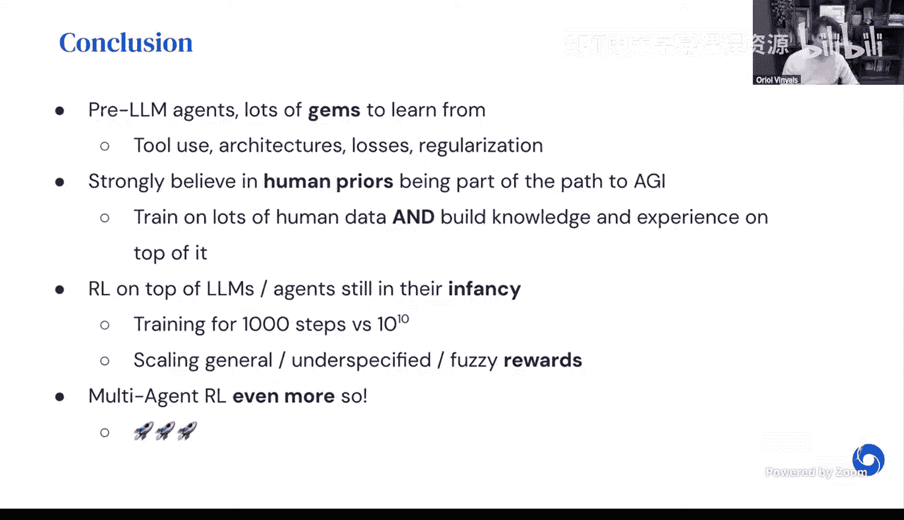

展望未来，在LLM时代构建多智能体系统面临着新的挑战（如奖励模糊、任务复杂度爆炸式增长）和机遇（模型本身具有强大的泛化与生成能力）。如何将AlphaStar联盟等思想进行创新性转化，以应对开放式、协作与对抗并存的真实世界，将是通向更高级别AI的关键一步。