# 3：未来AI应用与AutoGen框架 🚀

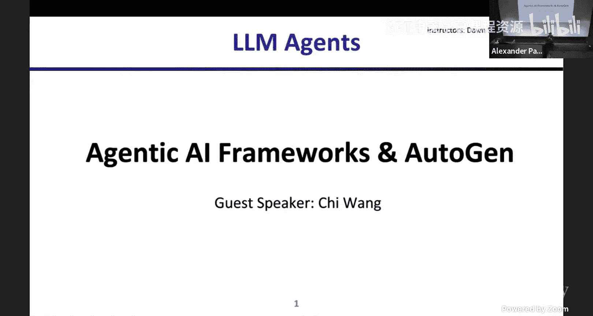

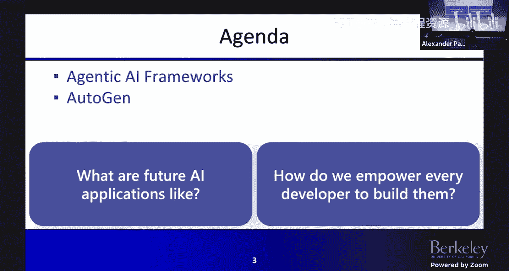

在本节课中，我们将探讨未来AI应用的发展方向，并深入了解AutoGen框架如何赋能开发者构建这些应用。课程内容主要分为两部分：首先，我们将审视未来AI应用的趋势；其次，我们将深入探讨AutoGen框架的核心概念与设计。

---

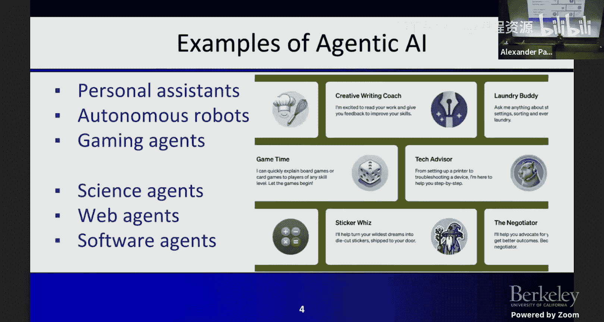

## 未来AI应用的趋势 🤖

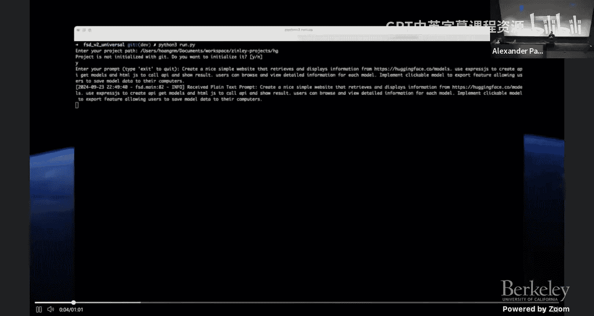

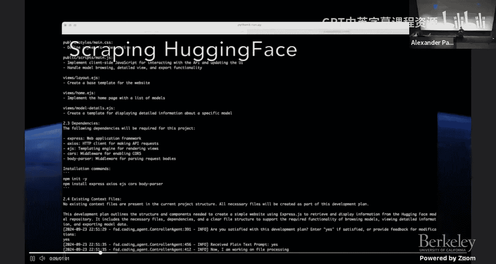

从2022年左右开始，我们见证了语言模型和其他生成模型的强大能力。生成式AI在生成文本和图像等内容方面展现出卓越的能力，远超15到20年前的生成技术。如今，新技术已经跨越了门槛，使我们能够构想更具创造性的应用和更高层次的AI能力。

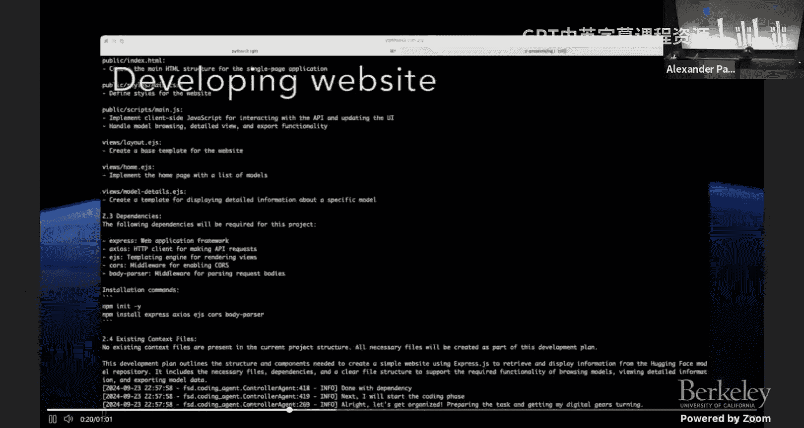

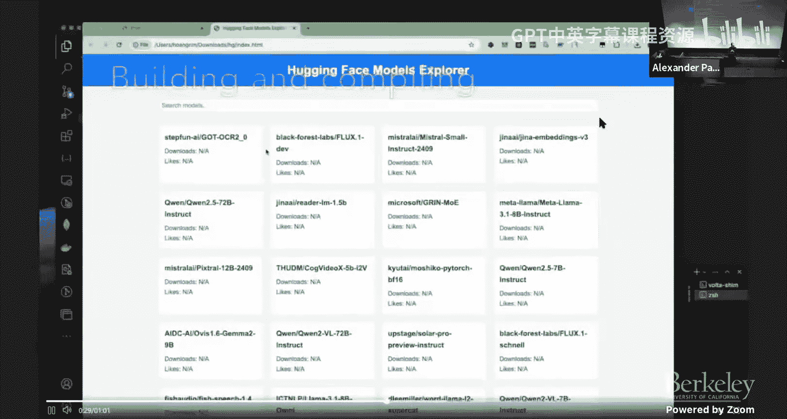

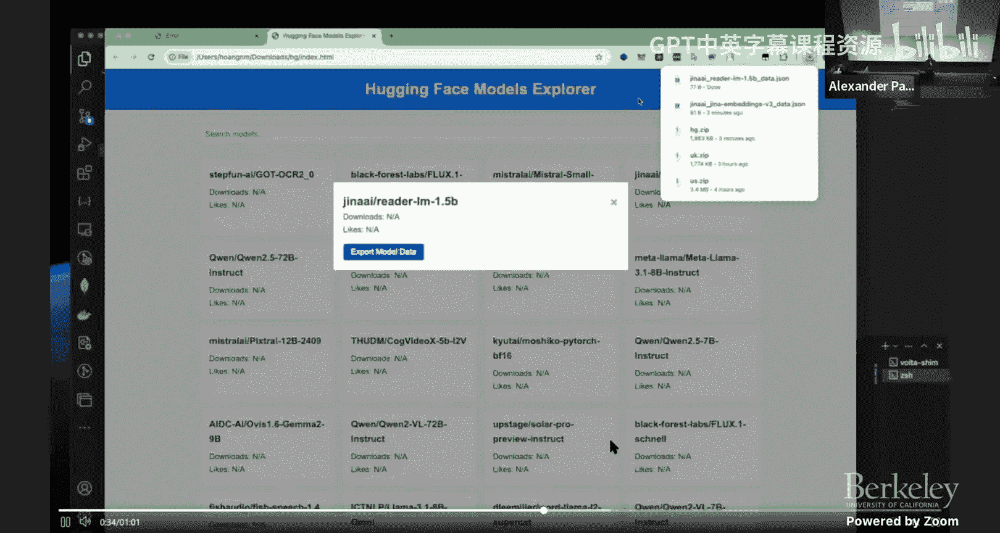

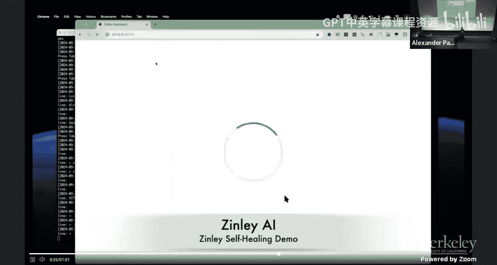

那么，如何最好地利用这些生成式AI技术呢？从去年年初开始，我们思考了这个问题，并做出了一系列技术预测。其中最重要的预测是：我们认为未来的AI应用将是智能体（Agent），智能体将成为人类与数字世界交互的新方式，代表人类执行更复杂的任务，并达到越来越高的复杂度。

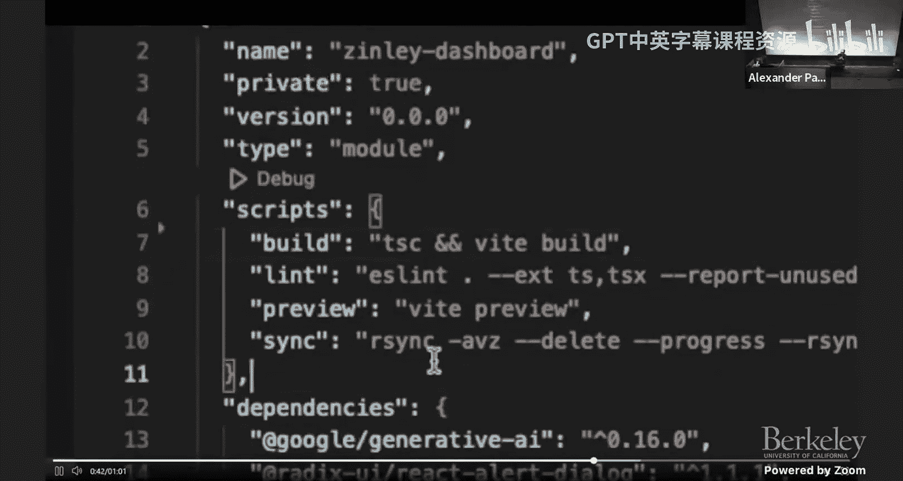

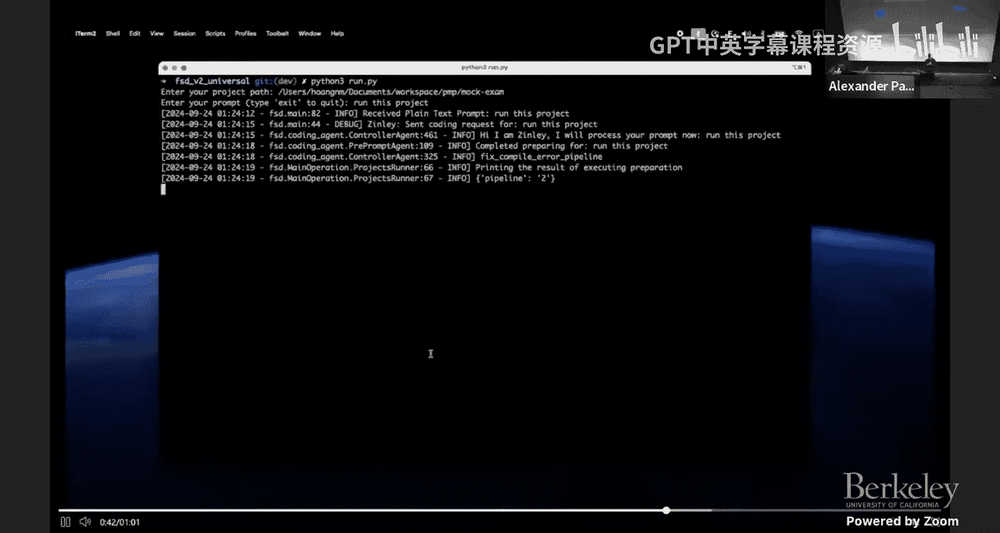

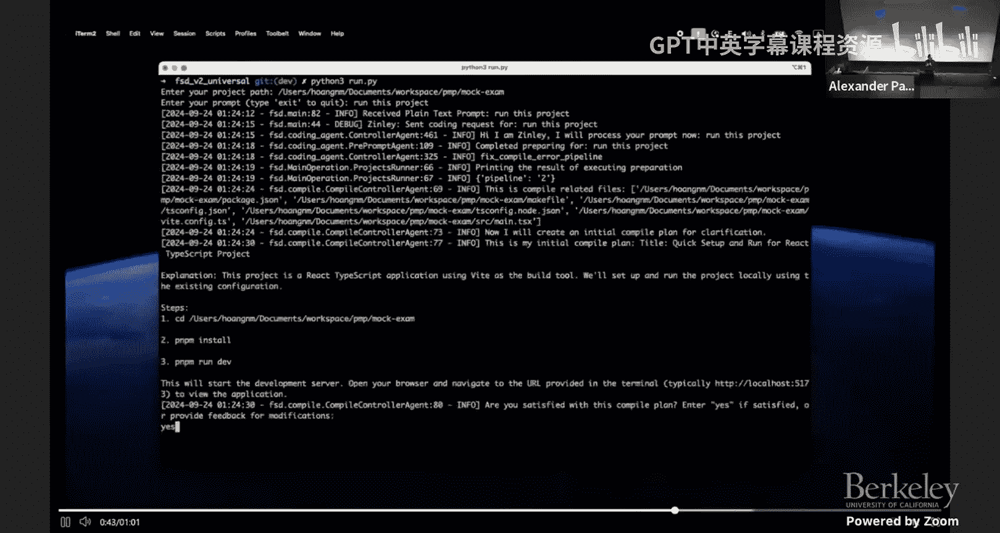

当时，许多人仍对“AI智能体”这个概念持怀疑态度。但随着时间推移，我们看到了越来越多的确认和证据。例如，今年早些时候伯克利发表的一篇文章讨论了如何观察到越来越多的AI成果从使用简单的语言模型转向构建复合AI系统。这与我们做出的技术预测相似。

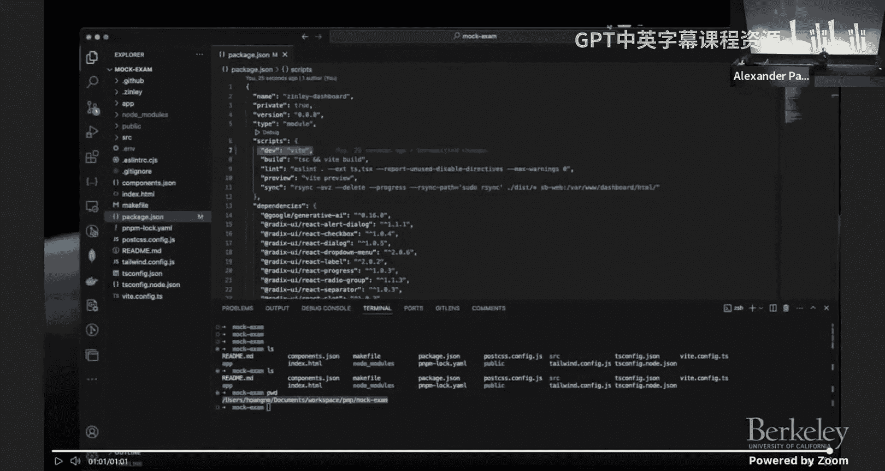

### 智能体AI的示例

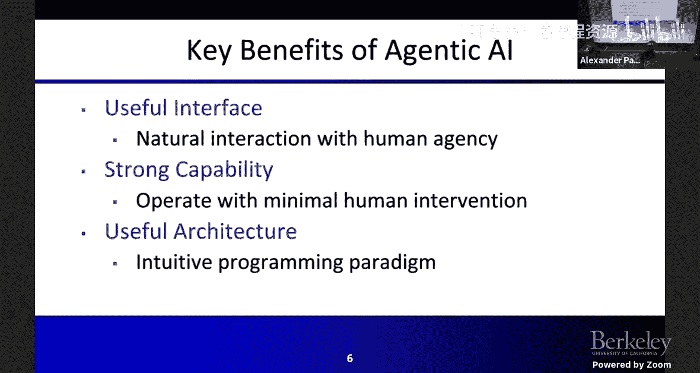

智能体AI的示例包括个人助手、游戏智能体等。智能体AI的概念并不新鲜，但新的是，借助新的生成式AI技术和大型语言模型，我们能够更轻松、更高效地构建一些旧的智能体应用。同时，我们也看到了一些全新的、超越以往想象的智能体应用，例如能够自动进行科学发现的科学智能体、能够自动化网页浏览和任务的网络智能体，以及能够从头开始构建软件的软件智能体。

### 一个演示案例

今天，我想展示一个来自名为Zindi的服务的近期演示。这是一个构建网站以从Hugging Face提取模型并自动下载的示例。

在向AI发出请求后，它开始自动工作：从分析任务开始，寻找信息并获取必要的依赖项。它使用多智能体框架，让不同角色的智能体完成任务，并能执行多步骤任务。我们看到AI正在创建不同的文件。智能体之间的所有推理都是使用语言模型和工具自动完成的。智能体之间相互交流，现在它们正在开发网站。最后，它们尝试构建和编译网站。

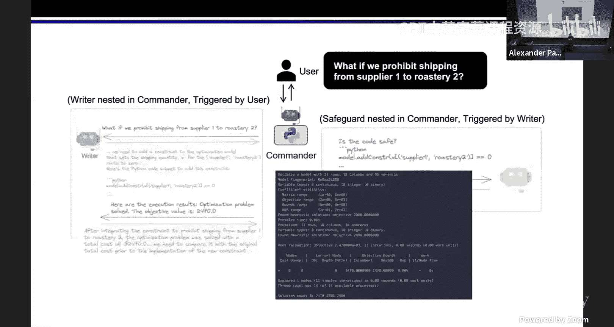

这就是由AI构建的网站。它看起来功能正常，网站上已经列出了许多模型，用户可以搜索模型、导出模型数据并下载模型。

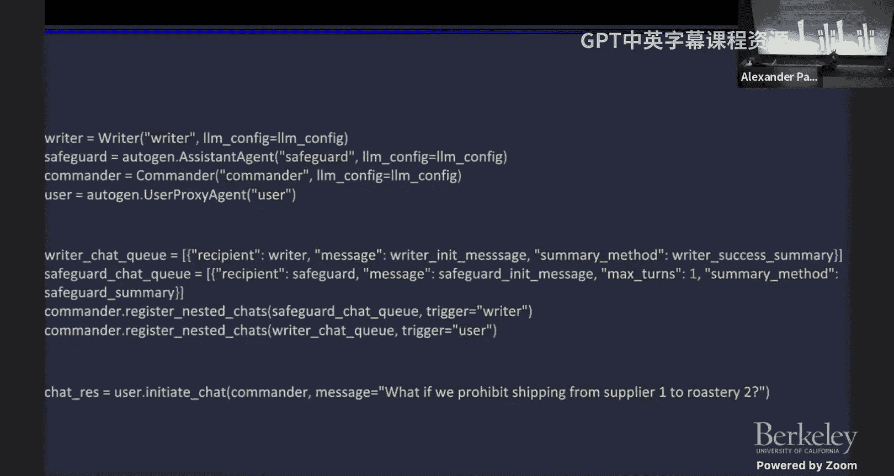

进一步，如果你碰巧犯了一些错误，例如从文件中删除了一行关键的代码，让我们看看会发生什么。我们再次运行AI来执行相同的任务。这次，AI也在尝试执行相同的任务。但由于删除了那行关键代码，我们预计会遇到一些错误。确实，我们看到了错误信息：“missing script”。让我们看看AI会怎么做。

仅仅几步之后，AI就能够纠正错误，补全被删除的那行代码，从而完成任务。这展示了AI智能体具备自我修复和恢复的能力。这让我们看到了AI智能体在未来可能带来的潜力，我们可能以完全不同的方式构建软件。

### 智能体AI的关键优势

总结智能体AI的关键优势：
1.  **更自然的交互界面**：AI能够使用更自然的界面与人类交流。你可以直接用自然语言告诉它们你想要什么，并可以基于自然语言进行迭代。
2.  **更强的自动化能力**：通过赋予智能体更多能力，它们能够在最少的人工监督下操作并完成更复杂的任务。这在自动化方面具有巨大价值。
3.  **创新的软件架构**：智能体AI也可以成为一种非常有用的软件架构，使我们能够以完全不同的方式构建软件。你可以让多个智能体相互协作，以递归的方式完成更复杂的任务。

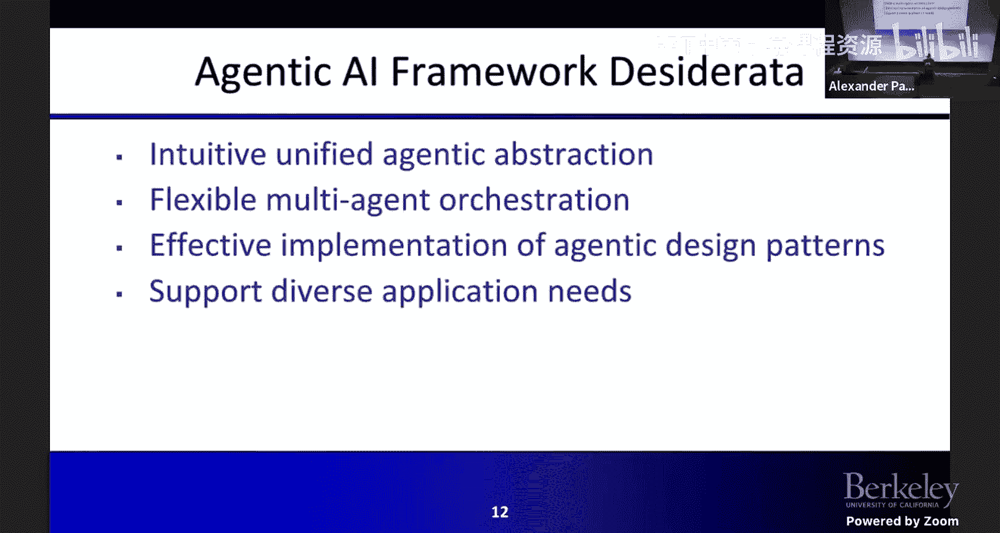

### 一个具体应用示例

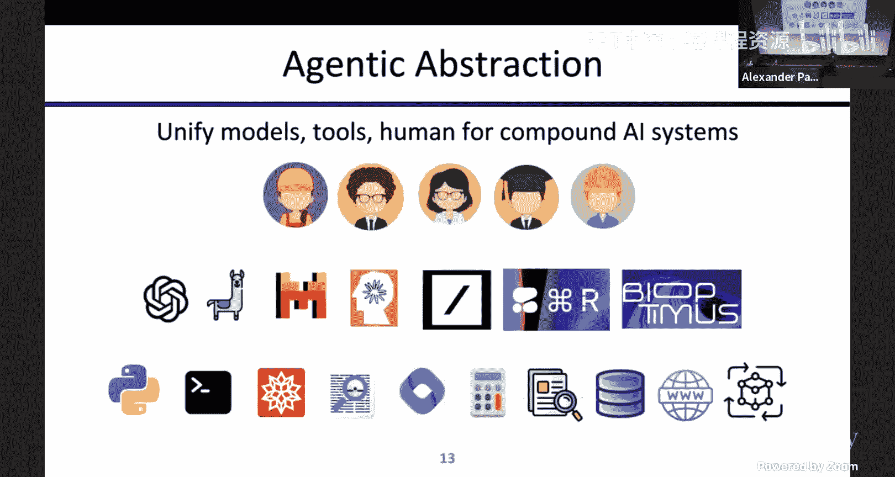

让我们看一个具体的应用示例：解决云上的调度优化问题。这个应用由我来自微软研究院的前同事构建，它允许像咖啡店老板这样的用户回答诸如“如果我们改变运输约束，会如何影响我的运营成本？”这样的问题。

这是一个难题，他们无法从像ChatGPT这样的工具中获得答案，因为AI需要理解用户特定的数据约束，甚至需要一些优化工具来理解问题并得到答案。但在这个案例中，使用AutoGen构建了三个智能体，可以很好地解决这个问题。这三个智能体是：指挥官、编写者和安全员。

让我们看看它是如何工作的。最初，用户发送一个问题：“如果我们禁止从供应点1运输到需求点32会怎样？”指挥官收到这个问题。在尝试回答之前，它会暂停当前的对话，并启动指挥官和编写者之间的另一个消息聊天。

编写者使用后端的大型语言模型来理解问题，并提出一些可用于回答这个问题的代码。在这个案例中，它只是一些将特定约束添加到优化问题中的Python代码，并将该代码返回给指挥官。

指挥官看到代码后，再次暂停与编写者的对话，并启动指挥官和安全员之间的另一个消息聊天。安全员是另一个使用语言模型来检查代码是否安全的智能体。在这个案例中，代码是安全的。指挥官将结束与安全员的对话，并开始执行代码。

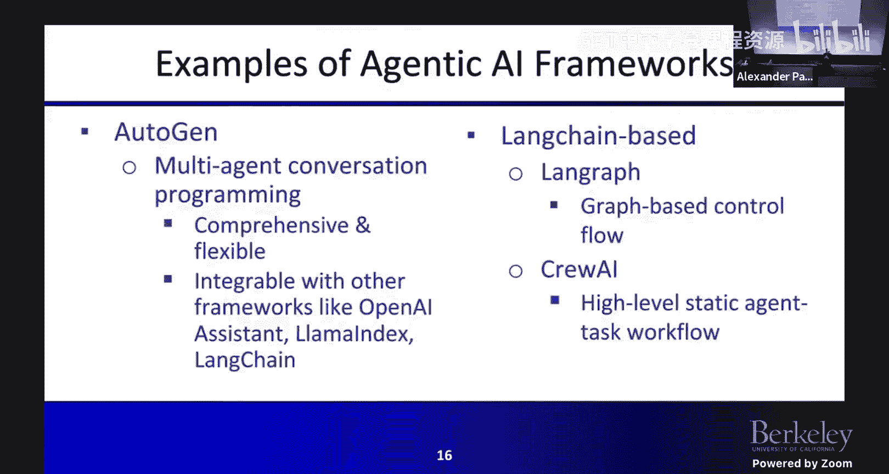

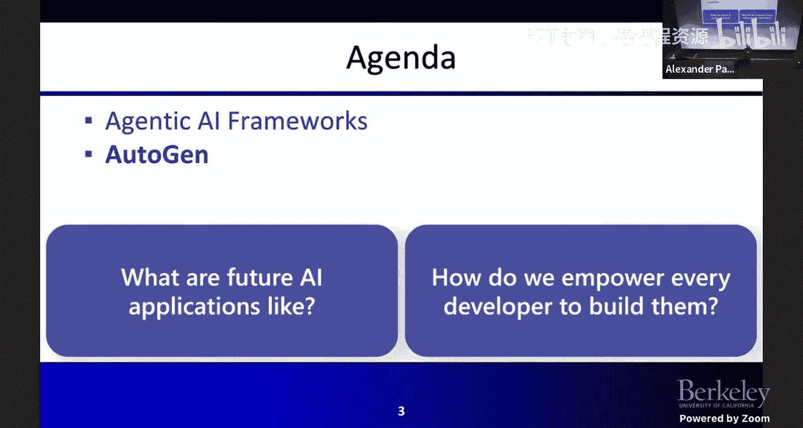

这是代码执行的结果：它运行了带有更新约束的优化程序并检查了新结果。然后，指挥官将回到之前与编写者的对话，将执行结果发送回编写者。编写者看到结果后，尝试得出最终答案。

这是一个使用多个智能体和多个步骤来完成任务的简单示例。一般来说，可能会出现各种问题，例如代码可能不安全。在那种情况下，指挥官将不会执行代码。如果出现执行错误，指挥官会将执行错误返回给编写者，编写者需要重写代码。因此，通常可能需要多次来回交互才能完成复杂的任务，但这里我们只展示了最简单、最顺利的情况。

你可以看到，最终用户现在仍然可以使用相对简单的界面，他们不知道后端有多个智能体在运行。他们只是问一个简单的问题，然后可以用自然语言得到答案。用户不需要了解任何关于编码或优化的知识。这是一个使用多个智能体使最终用户能够完成比以前更困难任务的示例。

### 编程范式的转变

现在，如果你看看编程范式，他们构建这样的程序的方式也与传统程序非常不同。有几个步骤：
1.  **创建智能体**：在这个案例中，他们使用一行代码创建了编写者、安全员、指挥官和用户代理。
2.  **定义交互模式**：他们为每个对话向指挥官注册了消息聊天。在定义对话时，需要指定参与聊天的智能体、发送者和接收者，以及来自该对话的摘要附加消息。
3.  **定义行为模式**：行为模式以这种方式定义。
4.  **发起聊天**：最后，我们只需通过发送初始任务要求，从用户代理智能体向指挥官智能体发起这个聊天。

然后，所有其他步骤也会自动进行。框架将处理所有步骤和消息聊天，并最终返回结果。希望这能让你直观地理解智能体编程的含义。

### 多智能体的优势

使用两个幻灯片来总结优势：
1.  **处理复杂任务并提高响应质量**：多智能体相互交流可以成为改进交互的一种非常自然的方式。我们可以分而治之，将复杂任务分解为更小的任务，并为每个步骤获得更高质量的结果。最后，我们可以定义不一定依赖于语言模型的智能体。我们可以有特殊用途的智能体，使用模型之外的知识进行基础验证，从而解决模型固有的弱点。

右边的图表是一个实验结果，展示了如果我们将任务分解为编写者和安全员两个智能体，与将所有指令放在一个单一智能体中相比，在安全方面的性能如何。比较性能后，我们看到对于GPT-4，多智能体设置比单智能体设置高出20%。对于GPT-3.5，差异甚至更大。这表明，在某些场景下，将任务分解并让智能体执行相对简单的任务是有益的，相比于让一个智能体在一次尝试中做太多工作。这尤其取决于任务的复杂性和模型的能力。一般来说，任务越复杂，模型能力越弱，就越需要这些多智能体工作流。

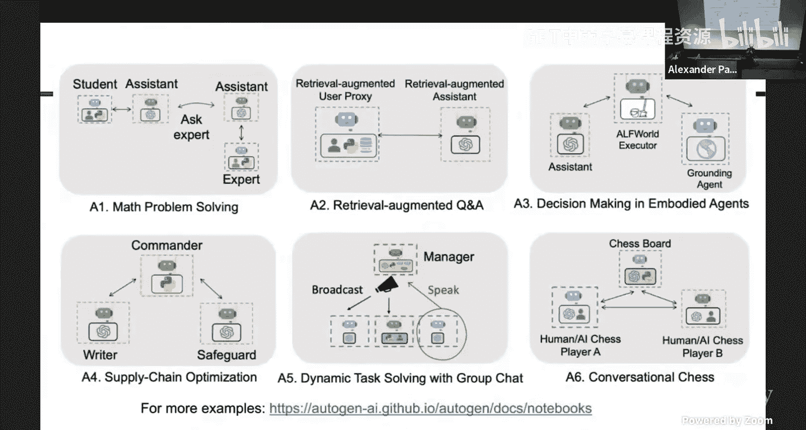

2.  **从编程角度看**：一般来说，如果你有一个模块化设计，系统更容易理解、维护和扩展。例如，如果你想保持大多数智能体不变，只改变安全员的行为，比如从使用语言模型切换到使用工具或人工，使用模块化设计很容易做到。这允许自然的人类参与，因为人类可以接管系统中的任何智能体，并通过与其他智能体进行自然对话，无需改变人类与其他智能体的交互方式。

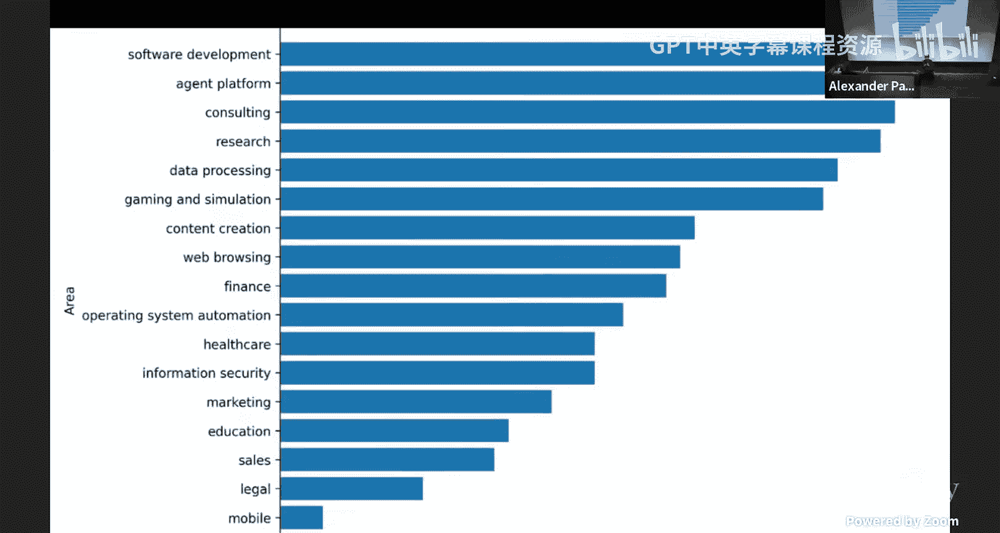

结合这些优势，我们看到智能体编程在实现快速、创造性实验和构建新颖应用方面具有巨大的潜力。

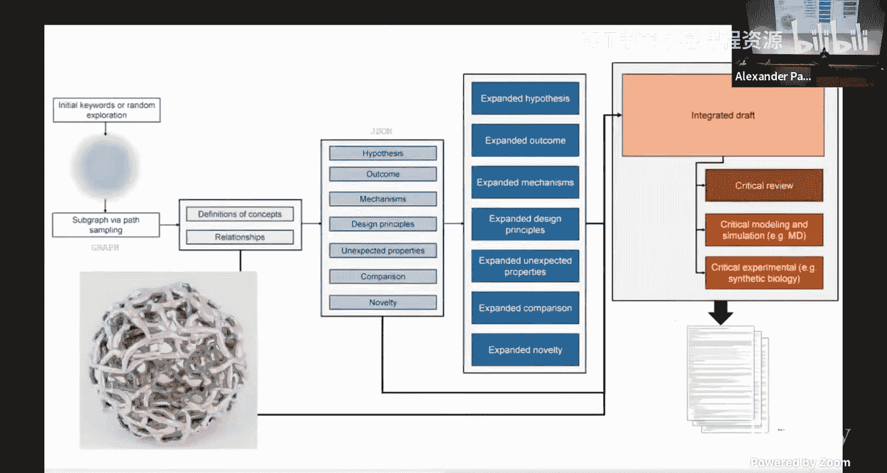

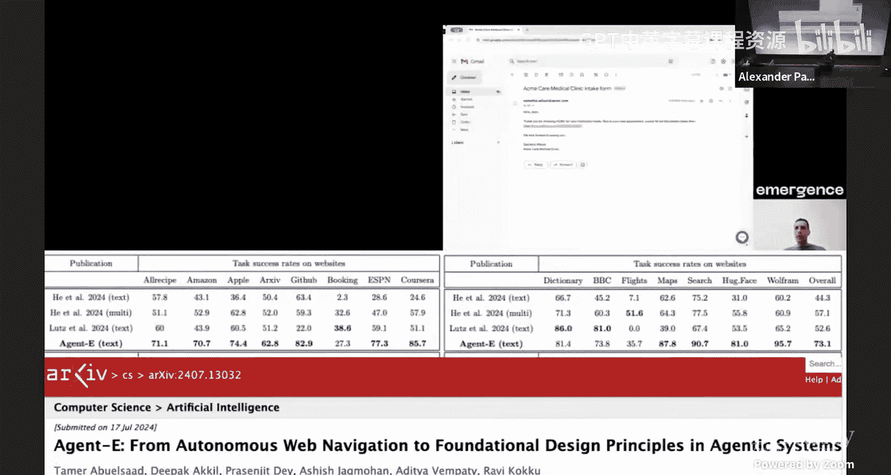

---

## 深入AutoGen框架 🛠️

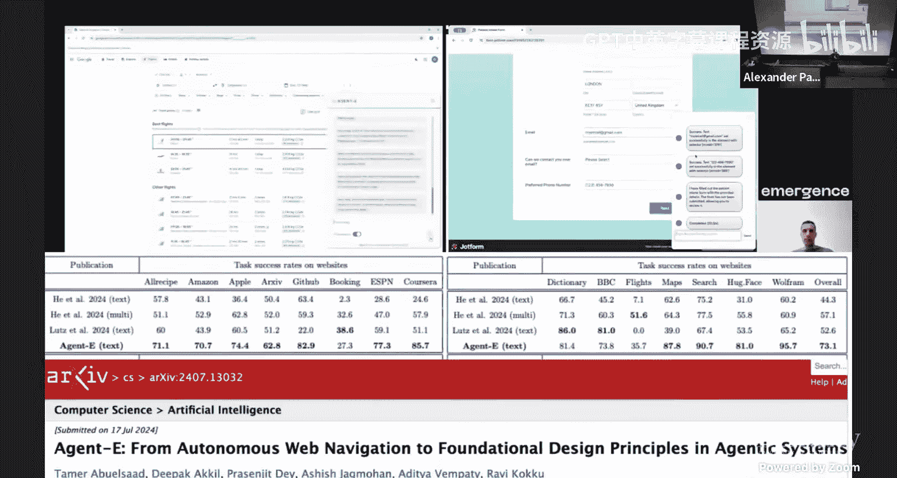

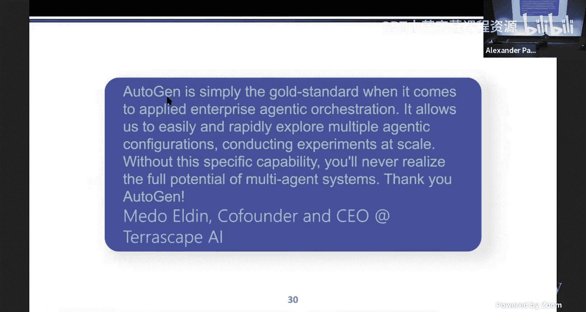

上一节我们探讨了未来AI应用的趋势以及多智能体系统的优势。本节中，我们将深入了解AutoGen框架，这是一个旨在实现上述所有潜力的编程框架。

设计一个能够满足所有这些承诺的框架并不容易。我们需要考虑几个因素来设计这样的框架：我们希望有一个统一的智能体抽象，能够统一所有这些不同类型的实体；我们希望满足多智能体编排的所有灵活需求，并满足所有不同的应用需求；我们还需要确保有效实现所有智能体设计模式。

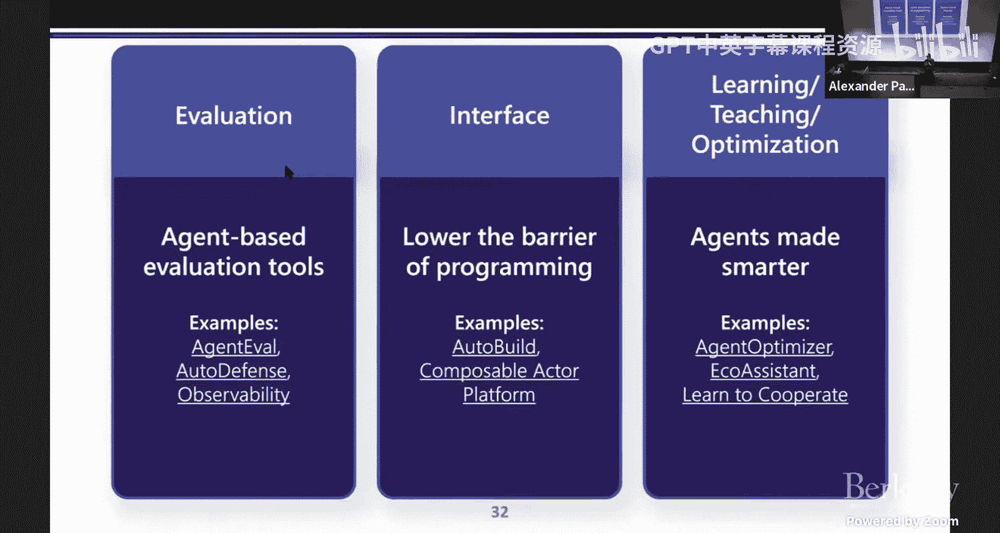

### 统一的智能体抽象

首先，对于智能体抽象，我们希望统一这个概念，这样我们就不需要费心去推理所有这些不同类型的实体，例如不同角色的人类、工具或来自不同提供商的语言模型。一般来说，构建复合AI系统都需要这些。但如果我们能有一个单一的概念来思考它们，将大大简化推理过程。统一抽象的一个直接好处是，现在我们可以使用多智能体编排来实际构建复杂的复合AI系统应用。

### 满足不同的交互需求

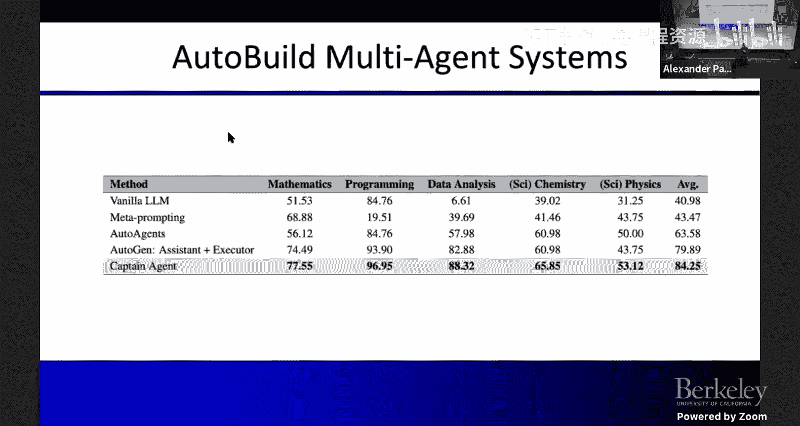

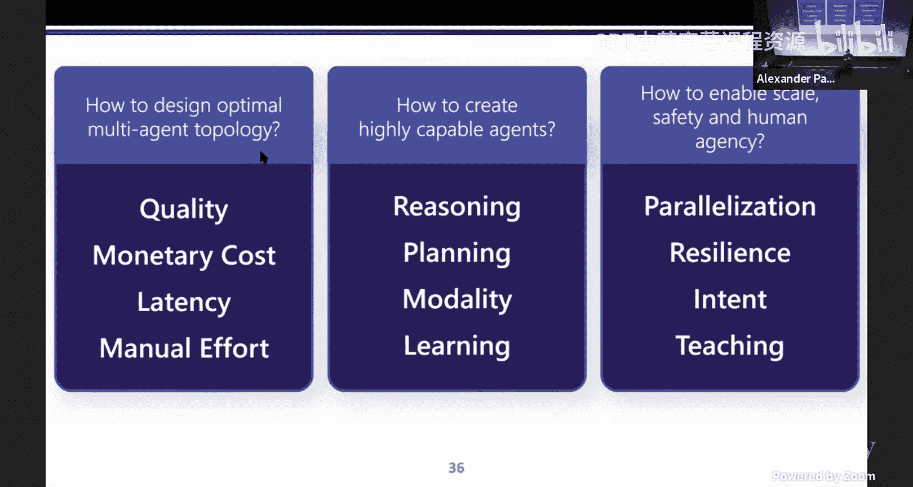

但要做到这一点，我们还需要考虑不同AI智能体交互模式的所有不同需求。例如，有时开发者希望有一个更静态的工作流，以便他们能够清楚地找到每个步骤和任务中智能体的顺序。但在其他情况下，如果很难知道智能体需要处理的所有可能情况，那么我们希望给智能体更多的自主权，使它们能够创建更动态的工作流。

类似地，有时他们想使用自然语言告诉智能体执行任务，而在其他时候他们想使用编程语言进行更精确的控制。因此，需要在灵活性和可控性之间进行权衡。

还有许多其他权衡需要考虑，例如：我们何时在智能体之间共享上下文，何时隔离它们并建立分层设置？我们何时希望智能体合作，何时希望它们竞争以更好地完成任务？还有关于集中式与分散式、自动化与人工干预的考虑。

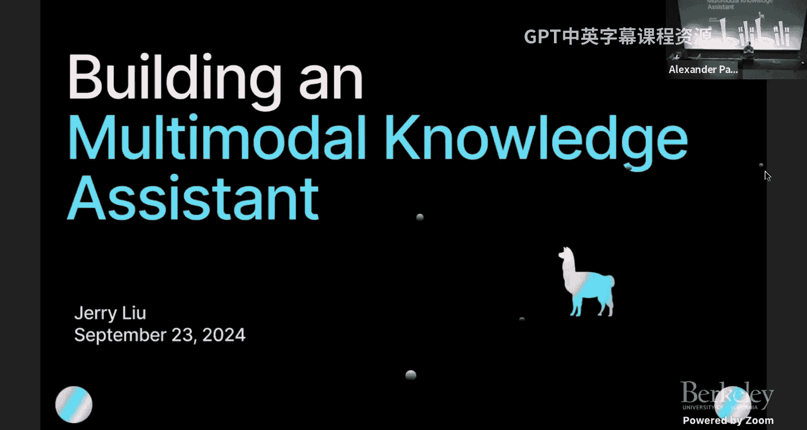

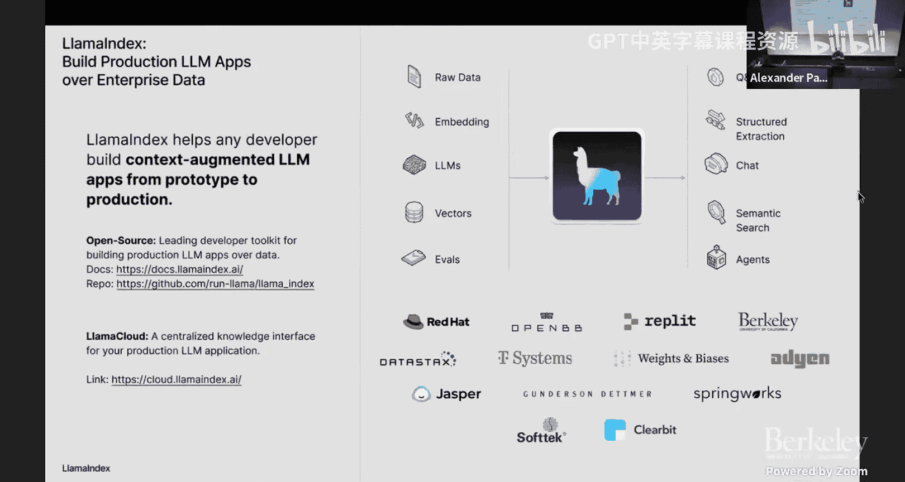

一个好的框架应该能够适应所有这些不同的需求。

### 智能体设计模式

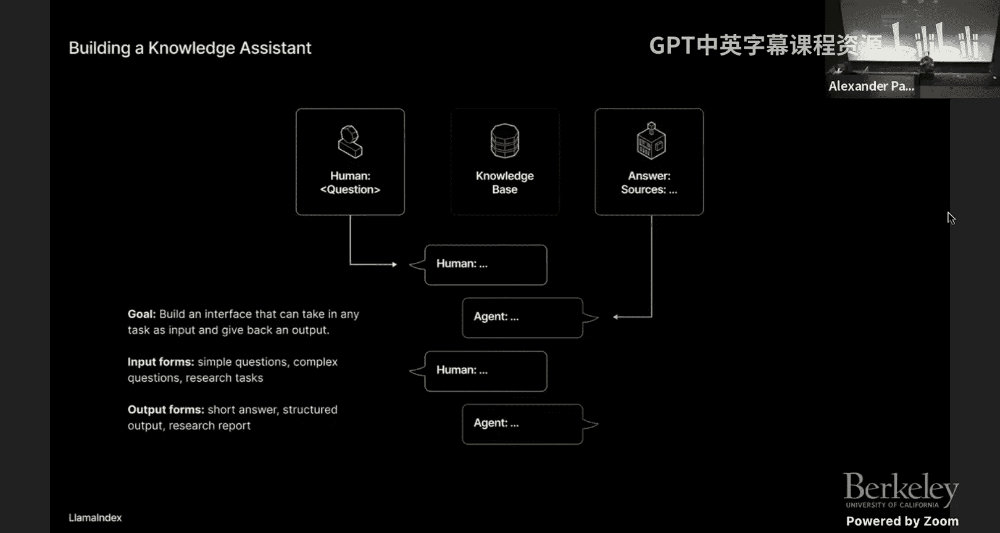

随着人们越来越多地开发智能体，出现了各种各样的良好设计模式，我们还需要检查一个框架是否能满足所有这些设计模式的要求。例如：
*   **对话**：我们希望智能体能够处理灵活的对话。
*   **提示与推理技术**：如ReAct、反思、思维链、思维树等。更多此类新兴推理技术，包括基于蒙特卡洛树搜索的方法，都是智能体设计模式的重要组成部分。
*   **规划**：与多模型、多模态和记忆集成。

看起来很多，对吧？一开始很难有一个框架能考虑到所有这些不同的因素。但如果你从第一性原理思考，你可能会想：是否可能从一个单一的设计点开始，并能够从中推导出所有其他模式？

是的，所以是否有人能想到，在这些不同的模式中，能否只使用其中一个单一模式来容纳所有其他模式？我相信不同的人可能会有不同的想法，并从不同的部分开始。你可能选择其中之一。

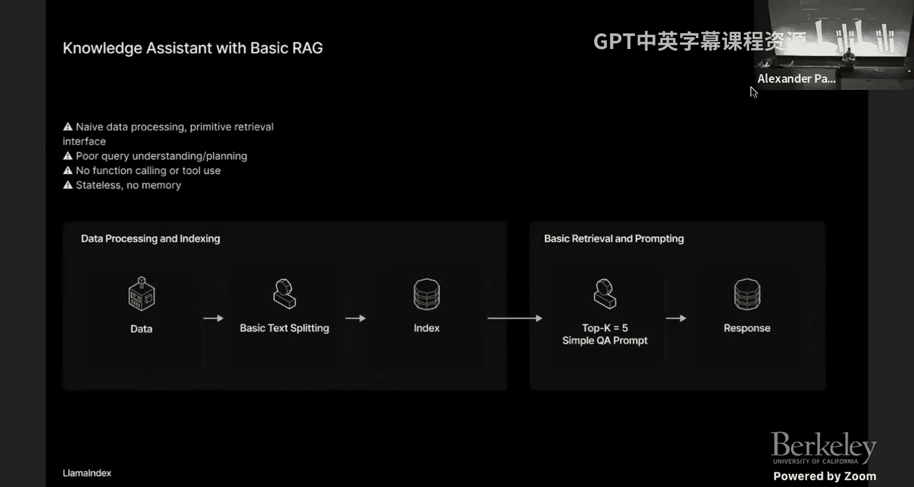

这里我想提到一个个人的设计观点，那就是**对话**。这有很长的历史，早在大学时，我就学到对话是学习和理论进步的一种方式。当我看到ChatGPT的力量时，我立即回想起我的个人经历，并决定尝试使用多智能体对话作为核心机制，看看我们能走多远。事实证明，我们可以走得很远。

这里我列出了一些AI框架的例子，比如我提到的AutoGen，就是基于这种多智能体对话编程。事实证明，它非常全面和灵活，能够与我提到的所有不同设计模式以及其他框架集成。

### AutoGen框架简介

AutoGen是一个用于AI智能体的编程框架。它最初是在另一个名为FLAML的开源项目中开发的，该项目用于自动机器学习和超参数调优。后来我们将其拆分出来成为一个独立的GitHub仓库。最近，我们还创建了一个独立的GitHub组织，采用开放治理结构，欢迎所有人加入并贡献。

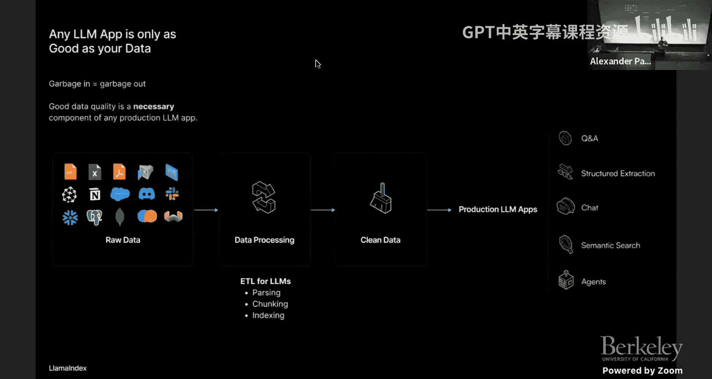

以下是关于其历程的简要历史：去年年初，我们开始原型化这个智能体框架。最初，我们只是构建了一个具有代码执行能力的多智能体对话框架。8月，我们发表了第一版研究论文。10月，我们将这个仓库移到了一个独立的GitHub仓库，并得到了社区的广泛认可。例如，今年我们在ICLR 2024的RL智能体研讨会上获得了最佳论文奖。我们还看到社区中出现了越来越多有趣的用例，包括来自企业公司和初创公司。我们最近还在DeepLearning.AI上开设了一门关于使用AutoGen进行AI智能体示例模式的在线课程。

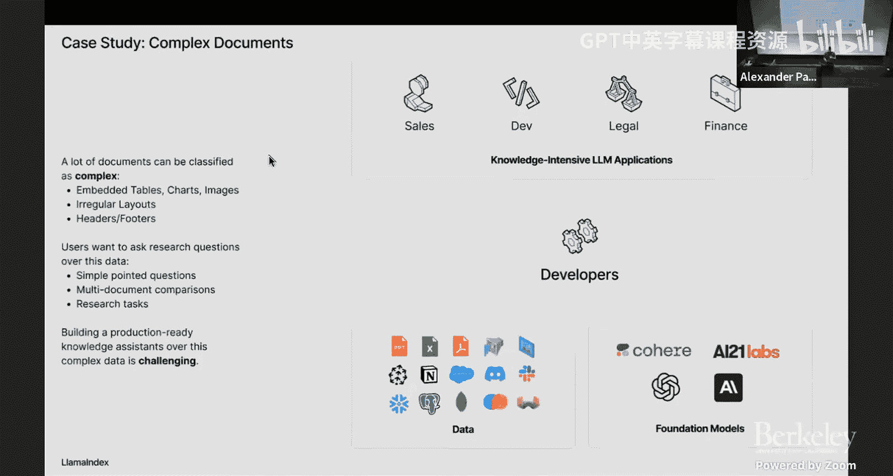

总的来说，AutoGen具有非常丰富的功能，涵盖了所有不同的设计模式。但今天，我主要想关注最基本的概念，因为这是理解所有其他模式的关键。

我们希望任何开发者都能通过简单的两个步骤来推理非常复杂的工作流：
1.  **定义智能体**。
2.  **让它们对话**。

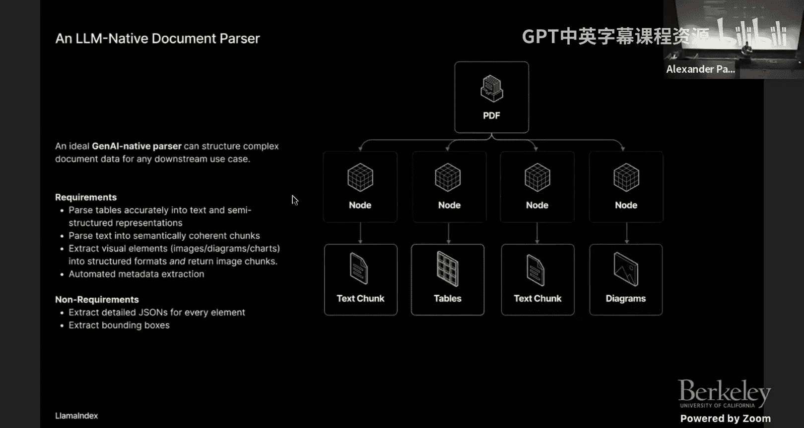

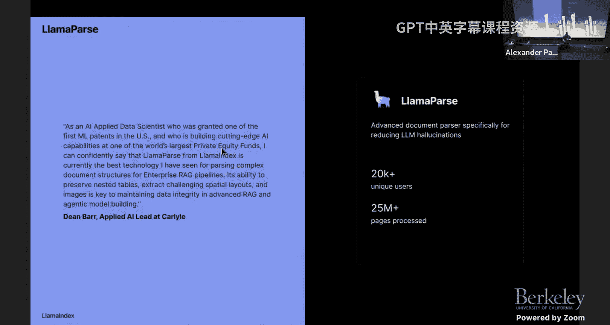

这里我们看到两个关键概念：一个是**可对话智能体**，另一个是**对话程序**。

### 核心概念：可对话智能体与对话程序

AutoGen中的智能体概念非常通用，可以抽象许多不同的实体。你可以选择使用语言模型作为智能体的后端，也可以使用工具或人工输入作为后端，你还可以混合多种类型的实体。

此外，如果你使用这种多智能体对话模式，就像你在右侧看到的那样，你可以构建包含其他智能体的智能体，进行内部对话，然后将它们包装成一个接口与其他智能体对话。这样，你可以在一个智能体内嵌套多个聊天，进行内部对话，并以递归的方式构建越来越复杂的智能体。

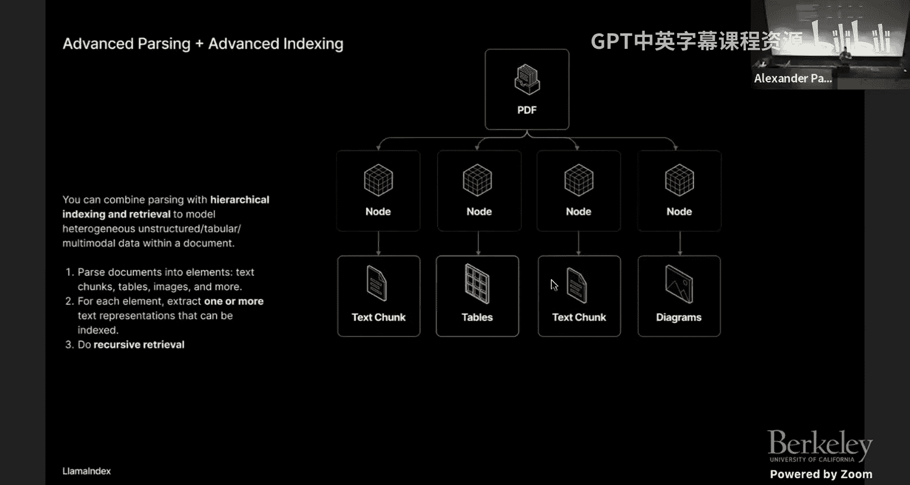

对话模式的示例包括顺序聊天、嵌套聊天和群聊。我将在接下来的几张幻灯片中解释其中的几个。

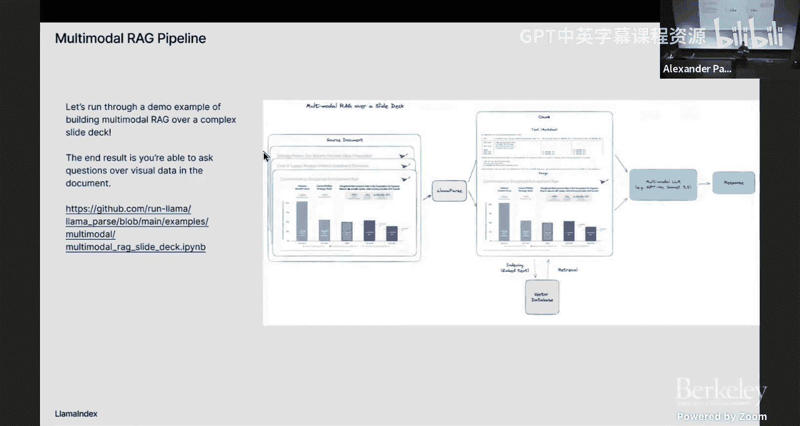

#### 1. 双智能体对话

最简单的模式是双智能体对话。即使这是一个非常简单的对话内容，它也已经允许我们形成一些高级推理，例如**反思**。例如，我们可以构建一个编写博客文章的编写者智能体和一个提出建议的评论者智能体。你可以让这两个智能体迭代，从而提高博客文章的质量。

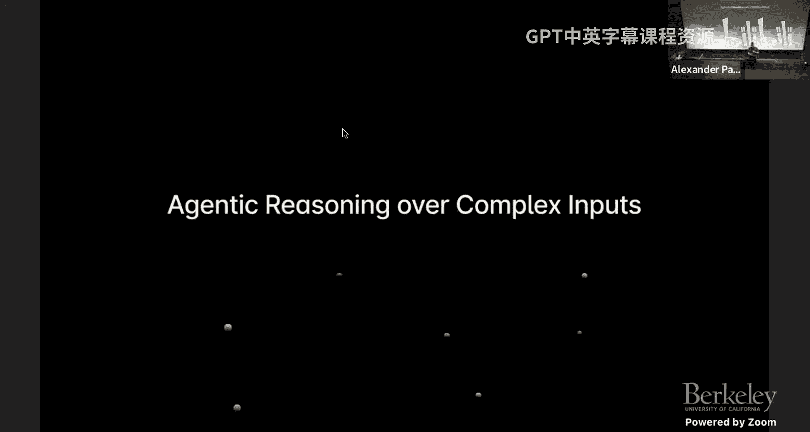

#### 2. 嵌套聊天

如果你觉得这还不够好，我们可以使用嵌套聊天来添加更多其他高级推理技术。例如，与其使用单一的语言模型进行评论，我们可以使用消息聊天。在嵌套聊天中，我们构建一个包含多个聊天步骤的顺序聊天。我们首先将消息发送给SEO审阅者，然后发送给法律审阅者、伦理审阅者等，最后你可以有一个元审阅者，总结所有不同领域的审阅意见并给出最终评论。从编写者的角度来看，它仍然是在与一个单一的评论者智能体对话，但在底层，评论者智能体使用了多个其他智能体。这就是我们如何使用消息聊天通过对话来扩展智能体能力的想法。

#### 3. 工具使用

关于如何使用对话来实现工具使用，这里有一个构建对话式国际象棋游戏的例子。我们希望AI能够在下棋的同时相互聊天并取笑对方。如果你直接让两个语言模型智能体下棋，它们经常会犯错误，并在棋盘上形成不合法的随机走法，导致游戏根本无法进行。

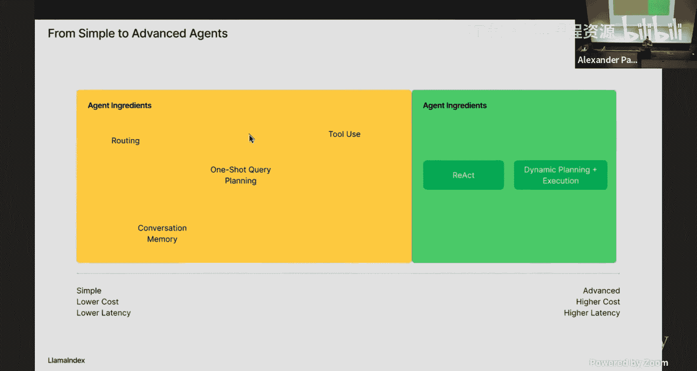

解决方案是我们可以添加第三个智能体，称为棋盘智能体。这个棋盘智能体是一个工具智能体，它使用一些Python工具库来管理棋盘，并为其他语言模型智能体提供工具，这样语言模型智能体只能走合法的走法，否则它们需要迭代地改进走法直到合法。通过这种方式，我们可以确保游戏能够顺利进行。同样，我们使用了使用语言模型的提议智能体和使用工具作为后端的执行智能体之间的消息聊天，让它们相互对话以完成工具执行功能。

#### 4. 群聊

还可以有其他更复杂的工作流模式，使用规划和更动态的方式（如群聊）来解决更复杂的任务。在群聊中，用户只需要定义不同角色的智能体，然后将它们放入群聊中，它们可以根据任务的当前进度自动决定下一个发言的智能体。会有一个群聊管理器来监控进度并选择发言者。

此外，你可以添加更多关于智能体应遵循规则的约束或有限状态机转换逻辑。你不必制定非常严格的顺序，你可以只给出一些候选规则，例如在智能体A发言后，只有智能体B和C可以发言，等等。这样，仍然有一些决策由语言模型做出，并保留一定的自主性，但你可以添加某些约束以确保选择在范围内。你还可以进一步添加一些转换逻辑，告诉智能体当看到某些情况时应该走这条路线，否则走其他部分。你可以使用自然语言或编程语言来指定这些。

总的来说，还有许多其他类型的对话和应用可以通过这些对话模式实现。你可以查看我们的网站以获取更多笔记本示例，它们都很好地分类了，因此我们可以搜索任何问题，例如搜索如何将AutoGen与LlamaIndex集成，就会有相应的笔记本示例。

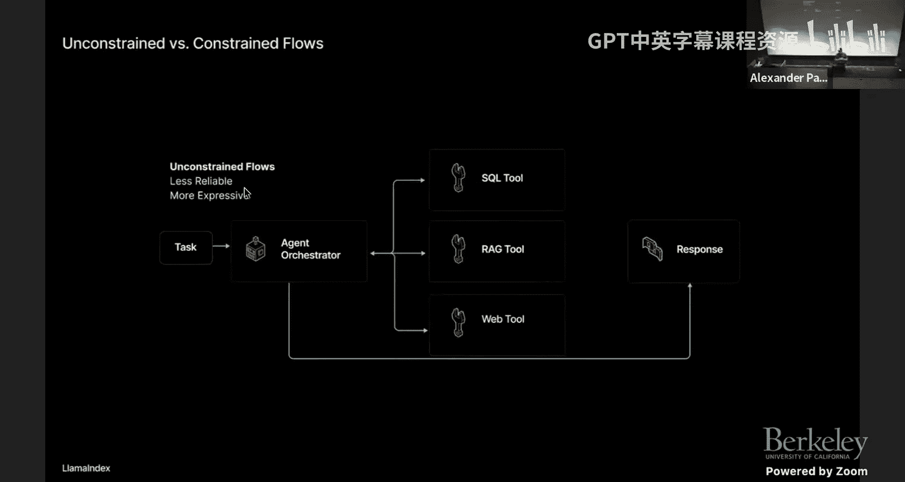

在论文中，我们只展示了一些使用简单对话模式的非常简单的例子。但总的来说，我们可以使用这些构建块构建许多更复杂的任务。我看到开发者们构建了各种复杂的任务。以下是我们在社区中看到的领域类别概述：前两个类别是软件开发和智能体平台，其次是研究、数据处理，还有网页浏览任务、金融、医疗保健、教育，甚至区块链等长尾领域。

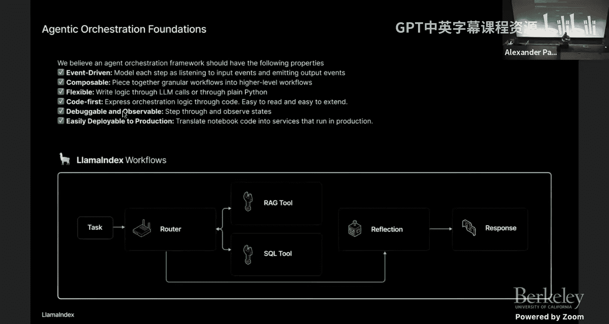

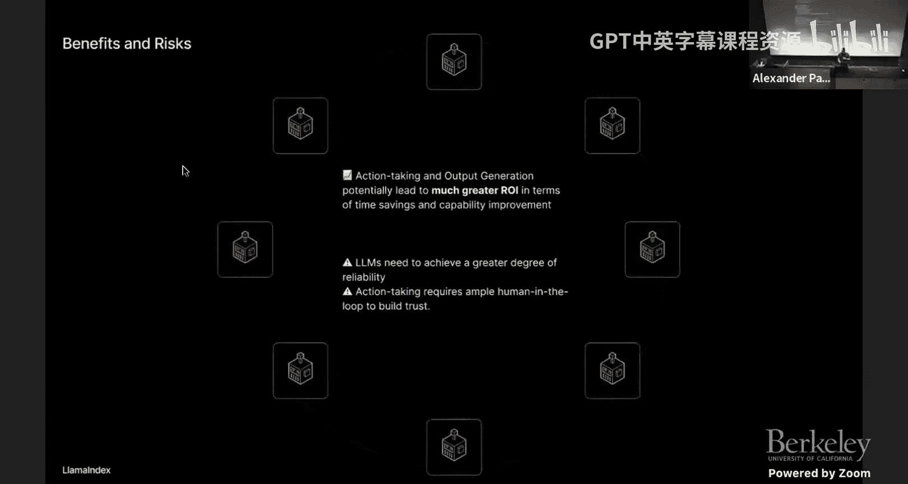

### 有趣的用例示例

这里我想选择几个有趣的例子：
1.  **科学与工程领域**：麻省理工学院的Mark Dyer教授在蛋白质设计、材料设计等不同科学领域进行了多项工作，使用AutoGen构建模拟科学团队或工程团队行为的智能体团队，涵盖从收集数据、生成假设到进行实验和验证假设的全过程。他们还构建了一个非常近期的名为“科学智能体”的工作，可以使用本体知识图谱推理任何科学领域，建立有趣的连接，并使用该知识图谱进行高级推理。他们构建了一个包含多个角色的智能体团队，可以从理解本体开始，然后进行多次科学和批判性思考，以完成非常复杂的工作流，生成所有不同的概念和可能的假设，然后选择其中最好的。这是一个非常有前景的用例，我认为未来有潜力加速我们的科学发现，也许不久之后我们就会有AI设计的药物或AI设计的架构等。

2.  **网络智能体领域**：这是一个名为AgentE的智能体，由一家名为Em AI的初创公司开发。他们使用AutoGen构建了一个分层智能体团队，以便在网络上执行一些非常复杂的任务，例如自动预订机票或自动为医疗诊所填写表格。这利用了规划智能体、网页浏览智能体，并对HTML DOM的内容有更深入的理解。他们尚未使用任何多模态模型，因此只利用了HTML内容，而没有利用图像和视觉模型，但他们已经在WebVoyager基准测试中取得了最先进的性能，并且优于之前使用多模态模型的技术。仍有很大的改进空间，你可以看到总体成功率仅为73%。因此，通过结合多模态模型和更多的智能体工作流，有可能将其提高到更高的水平。但我们可以从网络智能体中学到一些非常好的基础设计原则。

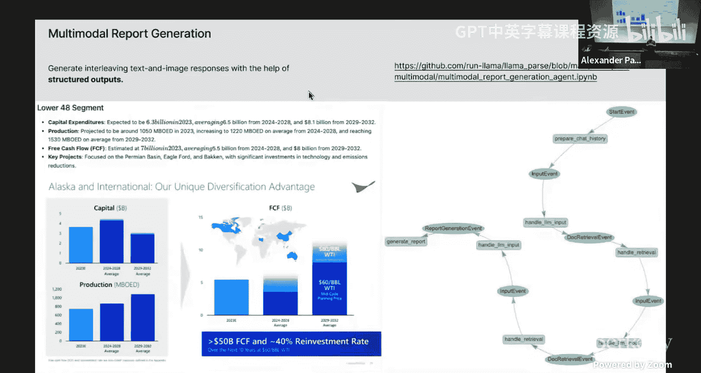

3.  **来自建筑公司的反馈**：我还想分享一个最近从一家从事建筑行业的公司那里学到的引述。他们试图使用AutoGen帮助没有特殊专业知识的用户完成他们的建筑项目。他们提到AutoGen的好处是能够快速探索许多不同的智能体设计模式、配置，并进行大规模实验。

### 总结与未来方向

总结一下，我们已经看到来自几乎每个垂直领域的大型企业客户的兴趣，并获得了来自世界各地大学、组织和公司的贡献者或用户，包括来自伯克利的一些贡献者。有一项名为MGPT的工作是由伯克利学生创建的，他们也集成了AutoGen。

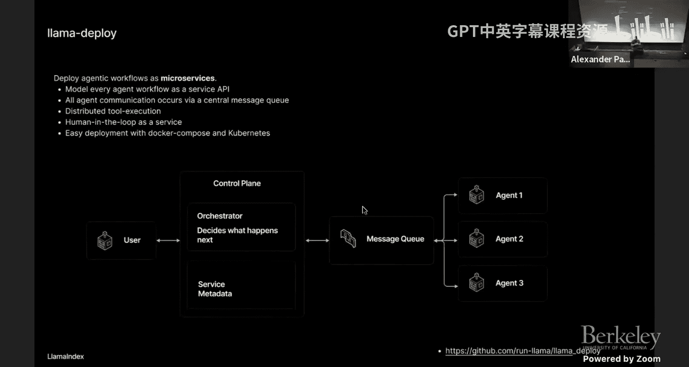

我们看到AutoGen仍然有很多变化和进展。这里只是几个类别的例子，