# 4：企业趋势与智能体构建模块 🚀

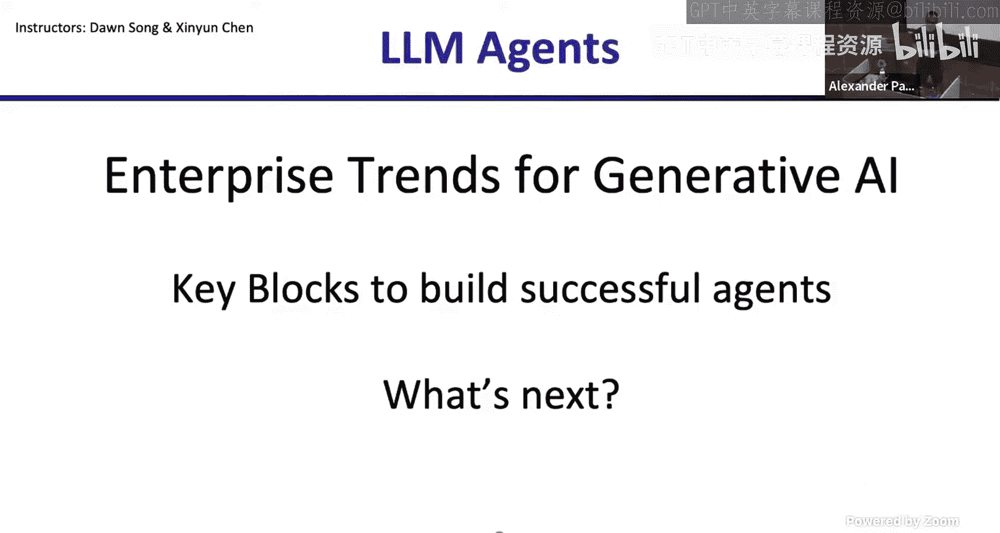

在本节课中，我们将探讨大语言模型在企业应用中的核心趋势，并深入了解构建智能体（Agents）的关键技术模块。我们将从宏观市场趋势入手，逐步深入到微调、知识增强、函数调用等具体技术。

## 企业应用趋势 📈

上一节我们回顾了神经网络和大型语言模型的发展历程。本节中，我们来看看当前企业应用AI的主要趋势。

首先，AI的发展速度远超预期，已成为所有企业的核心议题。大约三年前，推出新的AI产品时，可能只能找到一两个企业客户进行试点。如今，任何新功能一经发布，立即有成千上万的企业争相尝试和应用。

其次，启动AI项目所需的数据量已大幅减少。在过去，企业通常需要花费数月甚至数年来收集、清理训练数据。现在，得益于预训练的大型基础模型，企业可以直接使用这些模型，或仅需提供少量特定数据即可进行定制化，将启动时间从“年”缩短到“天”。

第三，AI应用开发的门槛显著降低。过去，开发AI算法需要数据科学家或AI专家。如今，任何开发者，甚至中学生，都可以利用大型语言模型开始构建AI应用。全球开发者数量远超AI专家，这直接推动了AI应用的指数级增长。

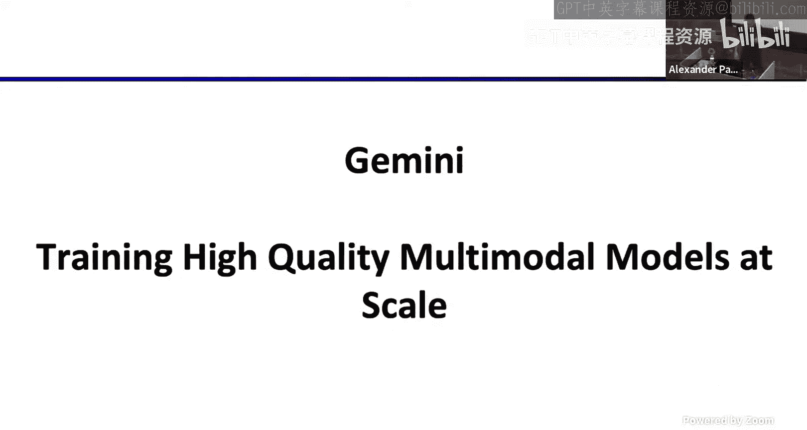

以下是当前观察到的几个关键技术趋势：

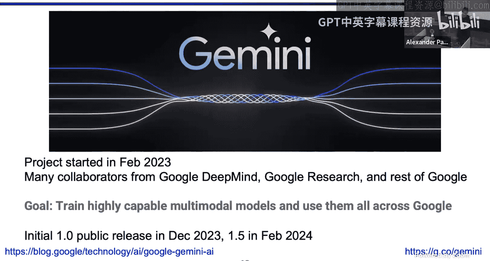

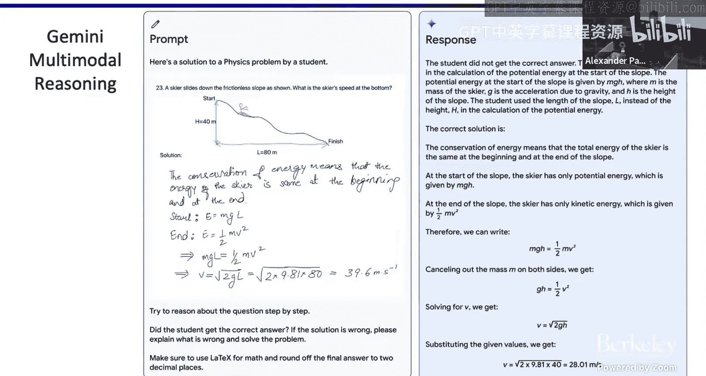

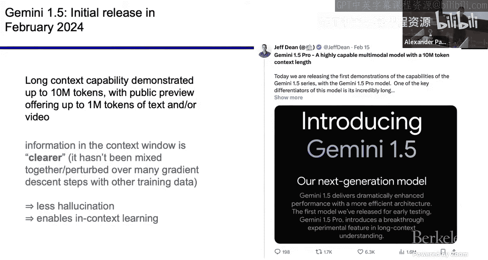

*   **基础模型通用化**：我曾预测不同领域（如医疗、金融）会有专门的模型。但基础模型改进速度如此之快，以至于新的通用基础模型发布时，其性能往往已超越之前的领域专用模型。因此，当前许多大公司的策略是打造一个**具备强大推理能力的通用大模型**。
*   **模型效率提升**：模型正从“稠密模型”（推理时需计算所有节点）向“稀疏模型”演进。稀疏模型可能只执行10%的计算路径，从而显著**降低延迟和成本**。
*   **多模态融合**：模型正从处理单一模态（文本、图像、视频）向统一的多模态模型发展。未来的模型将能理解和生成所有类型的模态。
*   **从“选模型”到“选平台”**：18个月前，企业主要关注“用哪个模型”。现在，新模型几乎每周都在发布。因此，企业更看重能够**集成并灵活选用多种模型**的平台，而非单一模型。
*   **API成本趋近于零**：由于稀疏模型、芯片改进等多种原因，大模型API的调用成本正在急剧下降，同时延迟也在降低，这使得更多对延迟敏感的应用成为可能。
*   **搜索与大模型紧密结合**：这已成为一个巨大的趋势。几乎我们遇到的每一个客户用例，都在结合使用大模型和搜索。主要原因有三点：1) 大模型的知识存在滞后性；2) 大模型存在“幻觉”问题；3) 大模型不擅长提供精确的引用来源，而搜索在这点上做得很好。
*   **关注员工生产力工具**：许多企业开始关注专门提升内部员工生产力的AI工具，例如各种企业版的聊天助手。

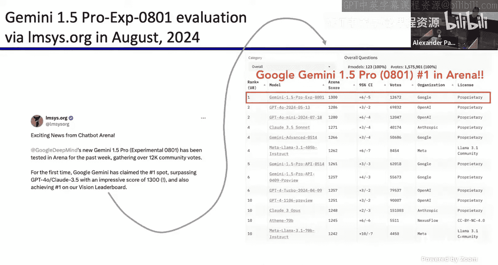

## 成功架构与核心模块 🧱

基于以上趋势，构建成功的生成式AI应用需要考虑几个关键因素：访问广泛的模型、定制化的能力、以及在各个层面的选择与灵活性。

一个典型的架构可能包含以下层次：从底层的芯片选择（如GPU或TPU），到集成了第一方、第三方及开源模型的基础模型层，再到用于定制化这些基础模型的**模型构建器**和**智能体构建器**工具。

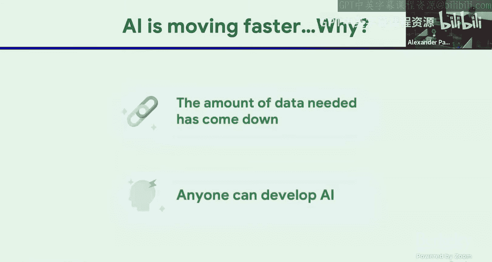

接下来，我们将重点探讨智能体构建的四个核心模块：**微调、蒸馏、知识增强和函数调用**。

### 1. 模型微调 🎯

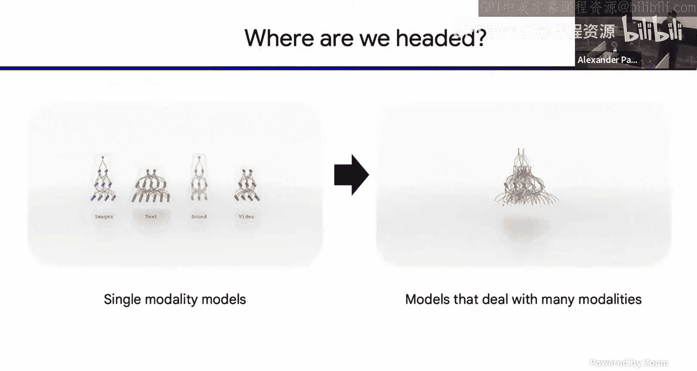

微调的目的是让基础模型更好地适应你的特定用例。从仅修改提示词到完全微调所有参数，存在多种方法。

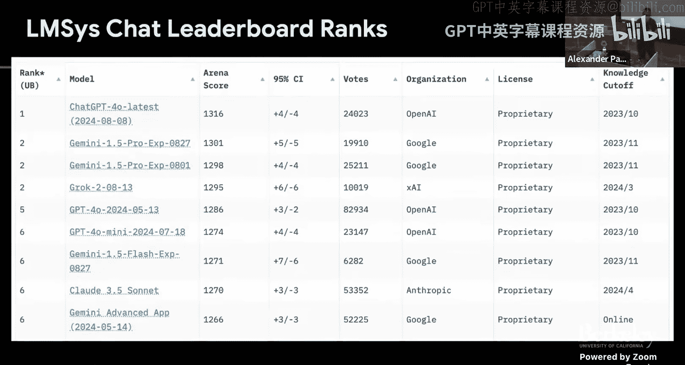

以下是几种常见的微调方法对比：

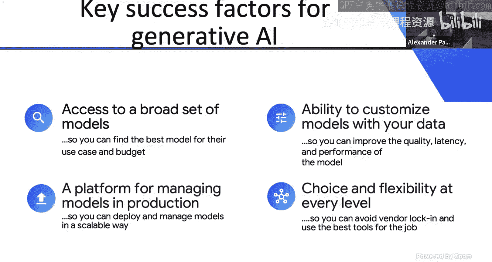

*   **提示设计**：不改变模型权重，仅在输入提示中提供少量示例（如1-5个）。这是目前实践中非常常见且简单的方法。
*   **提示调优**：提供更多示例（如上千个），让算法学习一个嵌入向量来“指导”大模型。但实践中使用不如提示设计广泛。
*   **全参数微调**：使用你的新数据集和损失函数，更新预训练模型所有权重。这种方法计算成本高，在实践中企业客户使用较少。
*   **参数高效微调**：只更新模型中的部分参数，或添加一个额外的网络层。这种方法计算和存储效率都更高，正被广泛采用。

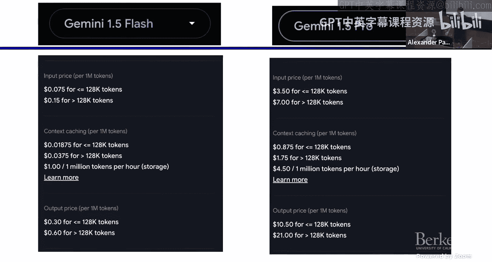

其中，**LoRA** 是一种流行的参数高效微调方法。其核心思想是冻结预训练模型的权重，并注入可训练的秩分解矩阵到Transformer层的每一层，从而大幅减少需训练的参数数量。

公式表示为：`h = W0x + ΔWx = W0x + BAx`，其中 `W0` 是冻结的预训练权重，`A` 和 `B` 是可训练的低秩矩阵。

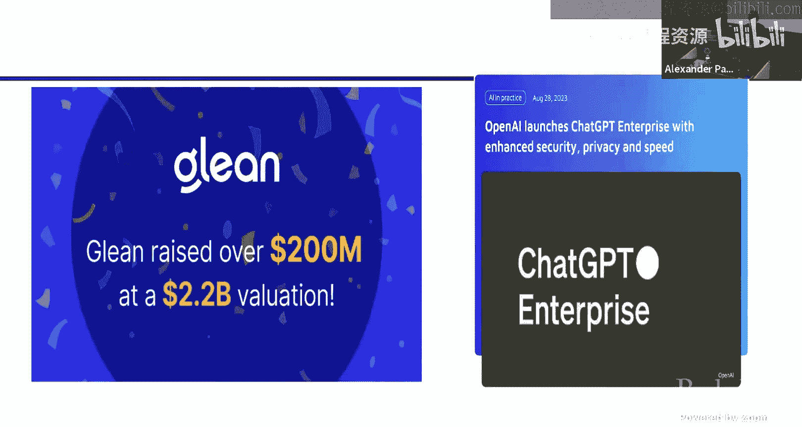

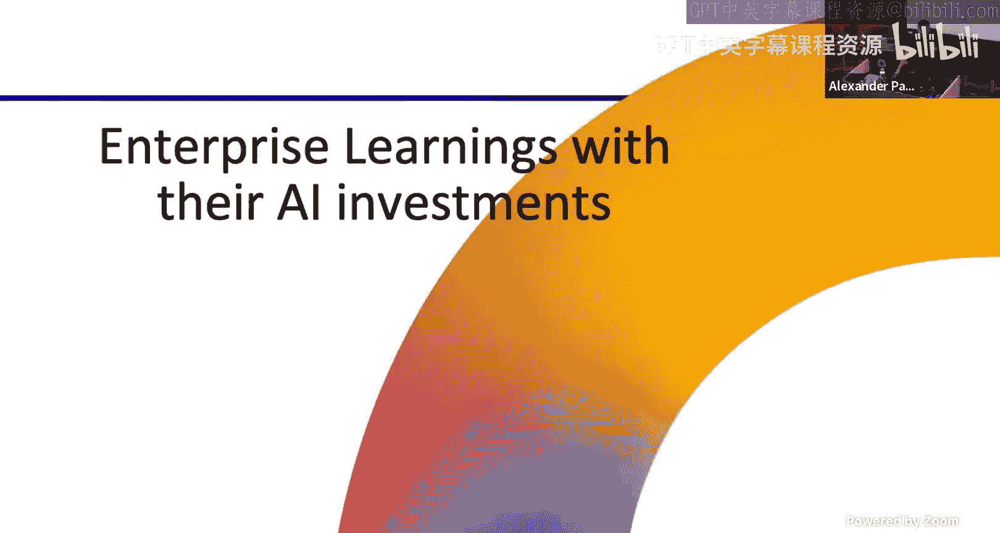

LoRA的优点是存储高效（只需保存适配器）、训练速度快，且能保持甚至提升模型性能，因此深受企业青睐。

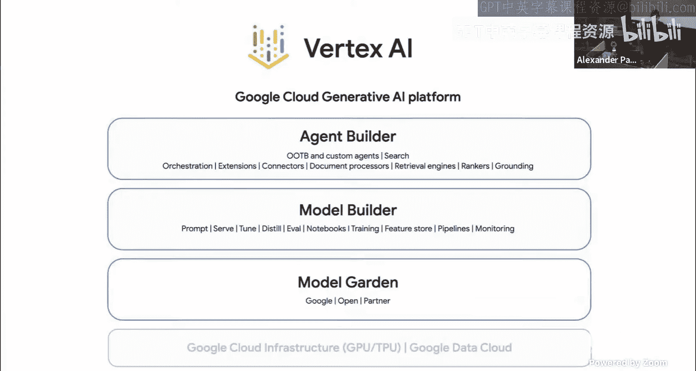

### 2. 知识蒸馏 🧪

对于许多应用，庞大的模型意味着高成本和高延迟。蒸馏旨在从大模型（教师模型）中提取知识，训练出更小、更快但性能相近的小模型（学生模型）。

典型流程是：用教师模型在大量未标注或部分标注的数据上生成“软标签”（概率分布），然后用这些软标签和损失函数来训练学生模型。这避免了人工标注大量“硬标签”的繁琐过程。

在生成软标签时，常使用带温度参数的Softmax函数来平滑概率分布：`P_i = exp(z_i / T) / Σ_j exp(z_j / T)`。提高温度 `T` 会使分布更平滑，为学生模型提供更丰富的学习信号。

### 3. 知识增强 🔍

知识增强旨在解决大模型的三个痛点：知识过时、幻觉和缺乏引用。其主要思想是将大模型与检索系统（如搜索引擎或企业知识库）结合。

一个典型的流程是：
1.  将用户查询转换为检索系统能理解的查询。
2.  从检索系统获取相关上下文或文档。
3.  将原始查询和检索到的上下文一起输入给大模型，要求其基于此生成答案。
4.  对答案进行后处理，确保其引用来源准确。

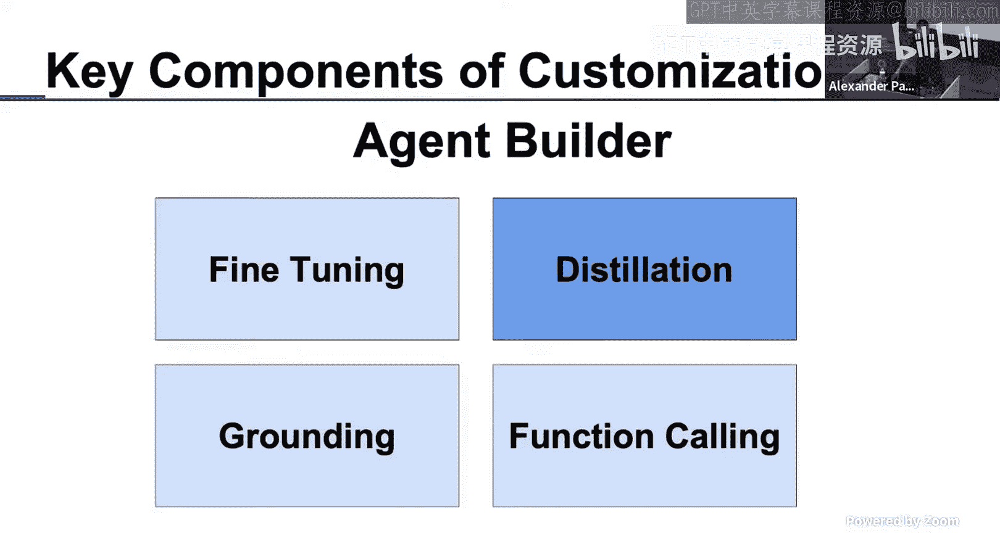

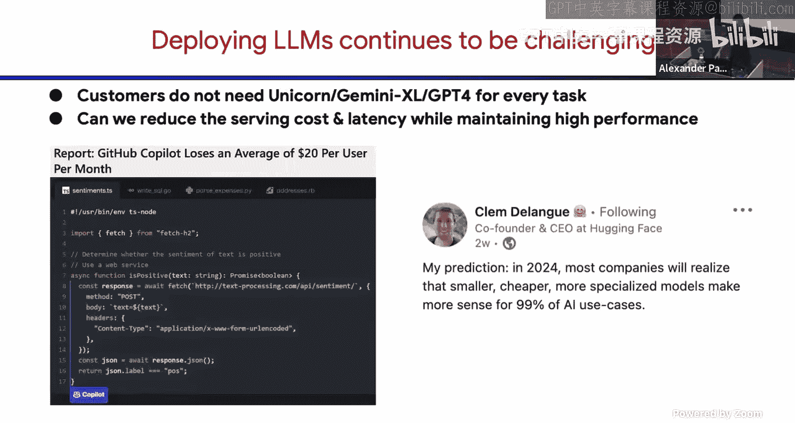

此外，行业也在通过改进训练方式（例如使用强化学习反馈，严厉惩罚不实回答）来直接提升模型的事实准确性。

### 4. 函数调用 🤖

大模型擅长获取信息，但不擅长执行“现实世界动作”，如预订机票、修改数据库记录。函数调用（或扩展）使大模型能够调用外部工具或API来完成这些任务。

实现函数调用面临两大挑战：
1.  **意图识别**：大模型需要知道自己无法完成当前任务，必须调用函数。
2.  **函数选择**：从众多可用函数中，选择正确的一个来调用（例如，订机票应调用Expedia的接口，而不是Yelp的）。

典型的实现步骤包括：
1.  为你的应用定义一系列函数（如`查询航班`、`预订酒店`）。
2.  让大模型理解这些函数的描述和能力。
3.  在推理时，大模型识别需要调用函数的场景，并选择正确的函数执行。

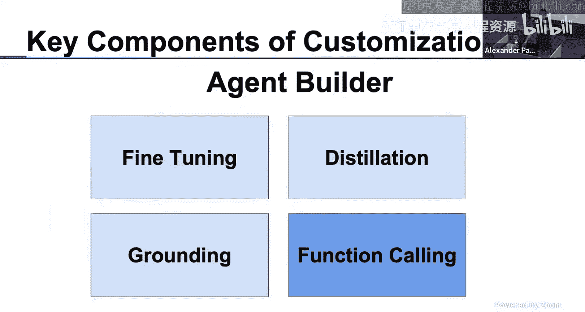

一旦实现函数调用，大模型的能力边界将极大扩展，可以处理结构化输出、实时信息检索、执行交易等复杂任务。

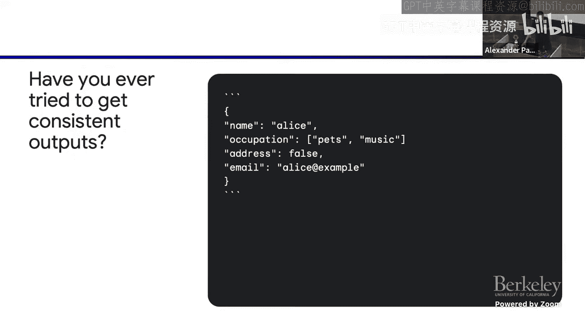

## 评估与未来展望 🔮

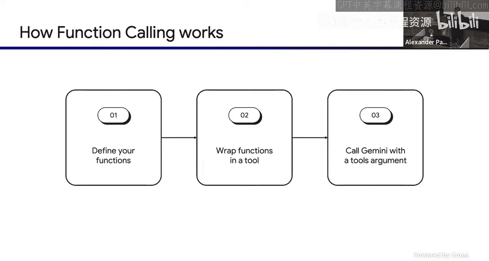

随着模型选择增多，评估变得至关重要。一个重要的趋势是使用**更大的模型来自动评估其他模型的输出**。例如，可以让多个模型回答同一问题，然后用一个超大模型来评判哪个答案更好。这与人类评估结果有显著相关性，能有效缓解人工评估资源短缺的问题。

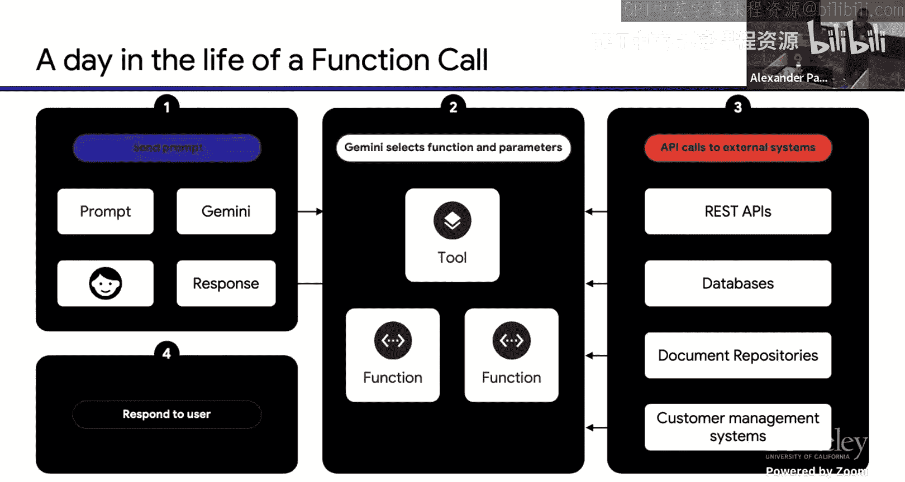

最后，我们看到AI领域正在经历前所未有的指数级增长。企业AI的API调用量在半年内增长了数十倍，这是传统行业需要5到10年才能达到的增速。

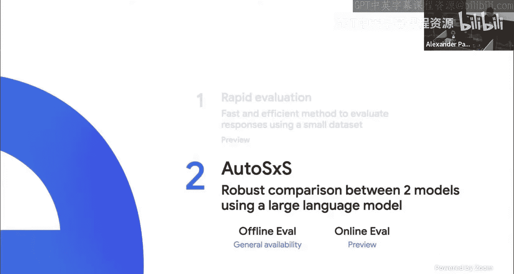

## 总结 📝

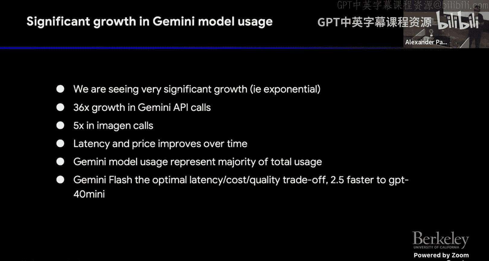

本节课我们一起学习了当前大语言模型在企业中的应用趋势，包括发展加速、门槛降低、平台化选择等。我们深入探讨了构建智能体的四个关键技术模块：**微调**（特别是参数高效的LoRA方法）、**蒸馏**（用大模型教小模型）、**知识增强**（结合搜索解决幻觉问题）和**函数调用**（让模型执行具体动作）。此外，我们还了解了使用大模型进行自动评估的新趋势。这些技术共同推动着AI应用更快、更可靠、更深入地融入各行各业。对于学习者而言，除了掌握AI技术，培养跨领域的创造力和思维也将变得极具价值。