# 5：构建复合AI系统 🧩


在本节课中，我们将要学习如何将单一的大型语言模型转变为可靠、可控的复合AI系统。我们将探讨单一模型的局限性，介绍复合系统的优势，并深入讲解一种名为DSPy的编程框架，它允许我们像编写普通程序一样构建和优化由语言模型模块组成的系统。


## 单一模型的挑战与复合系统的兴起


上一节我们介绍了课程背景，本节中我们来看看当前AI系统构建的核心挑战。尽管构建令人印象深刻的AI演示变得前所未有的简单，但将单一的语言模型转变为可靠的AI系统仍然非常困难。

语言模型的一个主要弱点，在某种意义上也正是其关键优势，即它们过于流畅。当它们犯错时，这些错误可能极其难以察觉。例如，模型可能自信地给出一个错误的历史日期，或者在代码任务中引入难以发现的数据竞争（Data Race）漏洞。


因此，根本问题在于语言模型的单一性（Monolithic Nature）使得它们在构建系统、调试错误和迭代开发时特别难以控制。越来越多的人通过构建**复合AI系统**来解决这个问题。

复合AI系统是指模块化系统或程序，其中语言模型不是作为面向用户的端到端系统，而是在这个更大的架构中扮演专门的模块化角色。

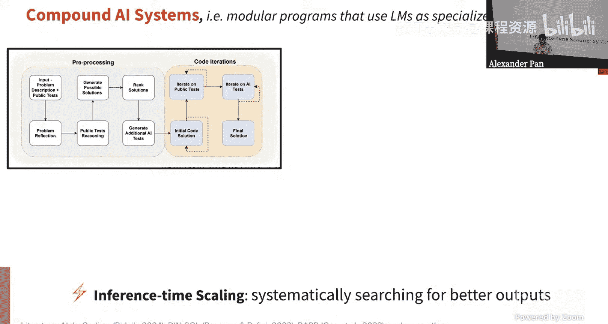

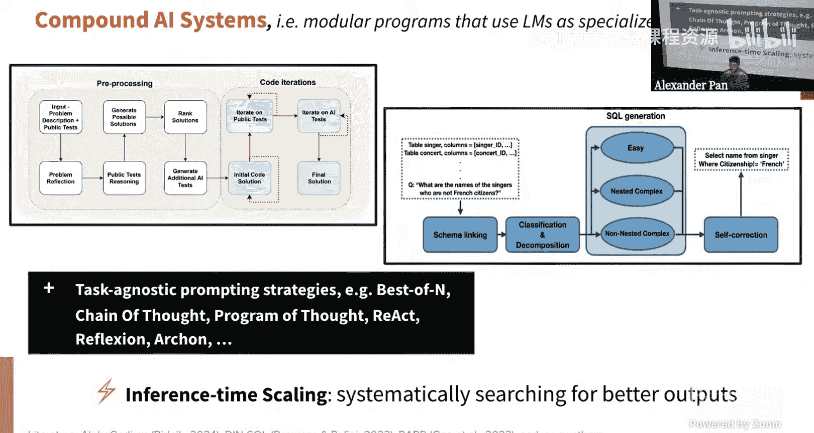

## 复合AI系统的优势

一个非常熟悉的例子是检索增强生成系统。


以下是构建复合AI系统的主要优势：

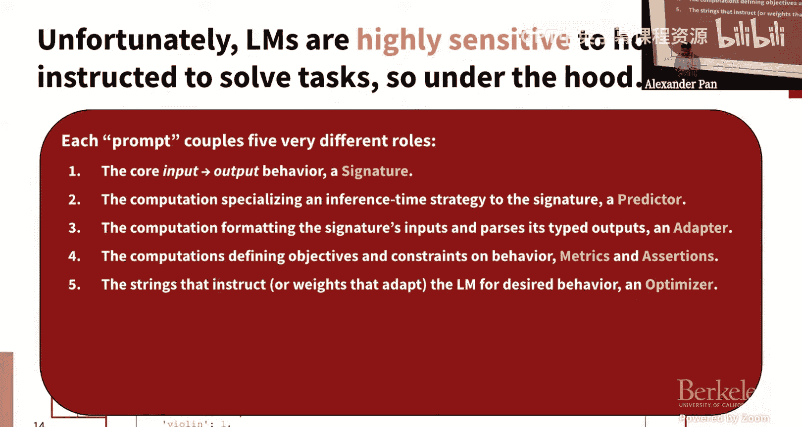

*   **透明性**：我们可以检查系统的行为轨迹，查看它检索了什么，以及为什么生成了特定的信息。这有助于我们判断答案是否正确。
*   **效率**：语言模型不需要了解所有主题的知识，因为我们将大量知识卸载到了外部的知识库或控制流程中。
*   **可控性与迭代速度**：作为系统构建者，我们拥有很大的控制权，不再受限于语言模型的下一次发布。我们可以更快地迭代架构，构建出单个语言模型当时绝对无法完成的系统。
*   **质量提升**：通过组合作用范围更明确的语言模型使用，我们可以获得更高质量的输出。例如，让模型基于给定的信息进行合成，比让它尝试记忆所有事实要容易得多。
*   **推理时扩展**：在测试时智能地投入更多计算资源（例如，让模型搜索大量可能的解决路径）可以显著提升性能。AlphaCode等系统就通过分解代码生成步骤（反思问题、生成多种解决方案、排序等）来利用这一点。


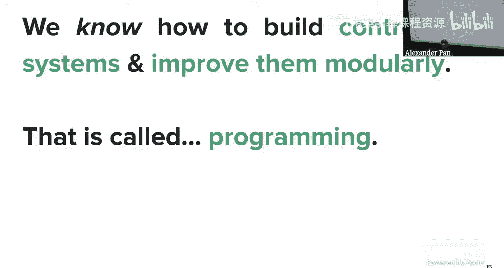

## 现有方法的局限性：强耦合的提示词

尽管复合AI系统潜力巨大，但问题在于我们使用的是能力高度受限的模块。我们的语言模型本身对如何让它们扮演这些模块角色极为敏感。

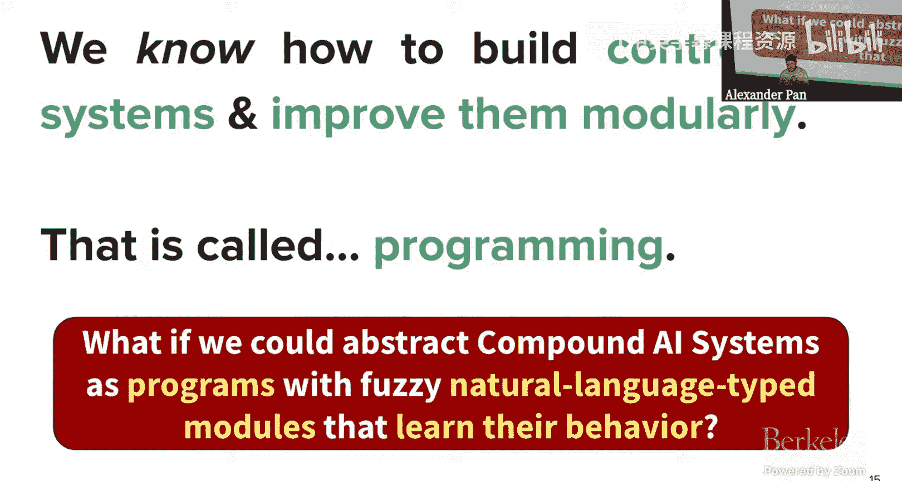

因此，这些漂亮的系统图表在实践中，通常是通过数千个自然语言标记（即冗长的提示词）来实现的，试图“诱导”语言模型扮演每个模块的角色。

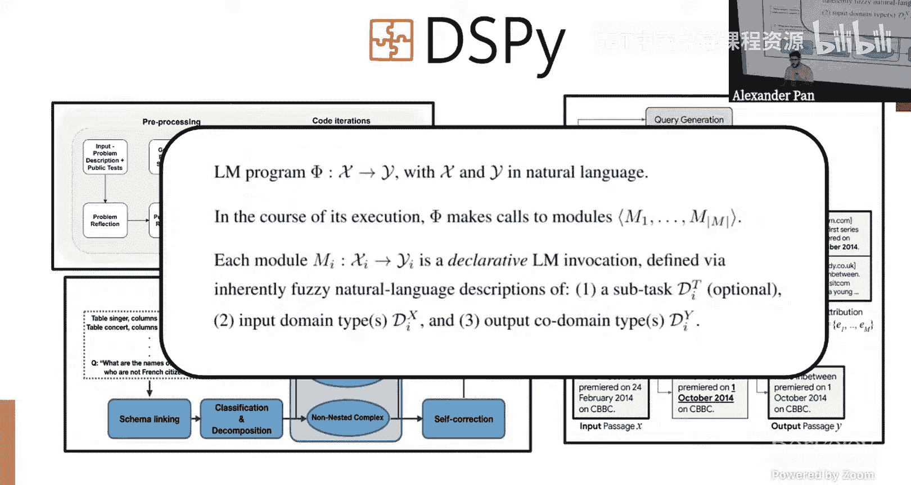


问题在于，每个实现模块的提示词都耦合了五种不同的角色：

1.  **函数签名**：指定模块的输入、输出及其含义。
2.  **计算策略**：指定推理时的策略（如“逐步思考”、“使用这些工具”）。
3.  **输入输出格式化与解析逻辑**：如何格式化输入，以及如何解析和转换模型的输出。
4.  **目标与约束**：编码许多“该做”和“不该做”的事项（如“要真实”、“不要幻觉”）。
5.  **针对特定模型的调优**：通过大量试错来“诱导”特定模型正确工作，可能还包括微调。

这种强耦合导致系统设计（架构图）与偶然的选择（特定提示词、特定模型）紧密绑定。一旦你想微调目标、添加新模块或更换语言模型，之前精心编写的长篇提示词可能就失效了。这严重阻碍了优秀系统的实际采用和移植。

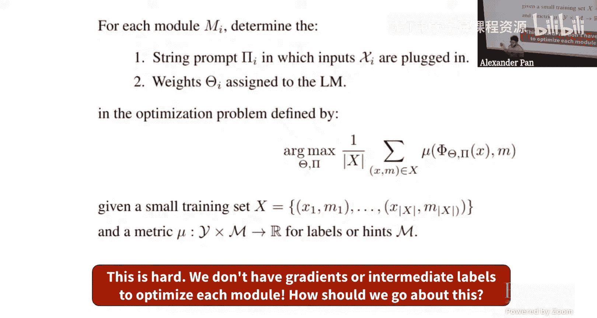

## 解决方案：将复合AI系统编写为程序

我们已知如何以模块化方式迭代且可控地构建和改进系统，这个难以捉摸的概念就是**编程**。

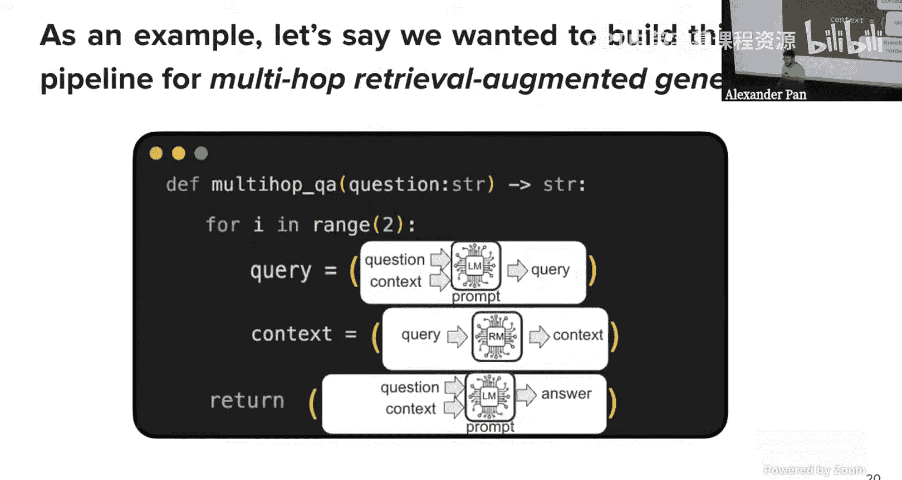

那么，如果我们能像编写程序一样构建复合AI系统会怎样？只需编写标准的Python代码，但插入一些模糊的自然语言函数（模块），这些模块可以从数据中学习其行为。


在这种类比中，可移植性就像在不同硬件上运行代码。我们编写高级抽象的代码（独立于语言模型细节），然后通过“编译器”或“优化器”将其转换为针对特定基础设施（如某个语言模型）的具体策略。

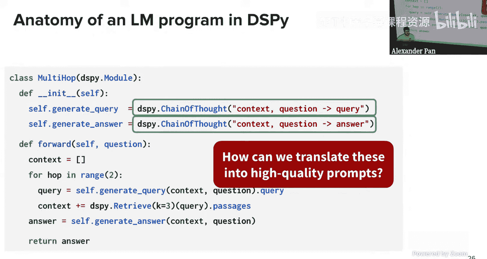

实现这一愿景的框架叫做 **DSPy**（Declarative Self-improving Python）。它本质上是更智能的Python。

## DSPy 核心概念：语言模型程序

在DSPy中，我们定义**语言模型程序**。它就是一个Python类或函数，输入和输出通常是自然语言（如问题、答案）。这个函数的特殊之处在于，在执行过程中，它会调用一些**模糊的模块**。


这些模块仅通过一个**签名**来声明它应该做什么，即输入是什么、输出是什么，通常只需一行描述。

```python
# 示例：一个简单的DSPy模块声明
generate_search_query = dspy.ChainOfThought(“context, question -> search_query”)
```
这个签名告诉系统：“有一个模块，它接收上下文和问题，并生成搜索查询。” 它只表达了**需要做什么**，而不是**模型应该如何做**。

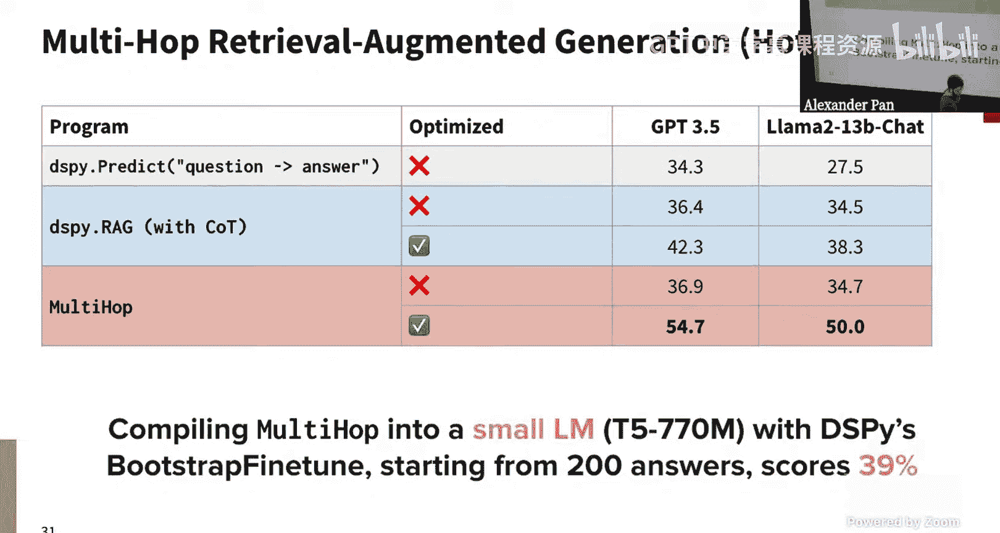

程序本身则包含了控制逻辑（循环、条件判断等），并在适当的时候调用这些模块。


## 优化问题与挑战

当我们用DSPy写出一个包含多个模块的程序后，就定义了一个优化问题：对于程序调用的每个模块，我们需要决定如何将这个调用实际转化为对语言模型的调用（即生成具体的提示词），有时还包括调整模型权重（微调）。

目标是，给定一组训练输入和某个评估指标，找到提示词和权重的设置，使得调用该程序的平均性能最大化。

然而，这非常困难：
1.  我们无法获取系统内部的梯度（系统可能生成代码、调用外部工具）。
2.  我们不能假设每个模块都有中间标签。理想的开发周期是：添加一个模块，直接测试系统是否更好，而不是为每个新模块去标注数据。

## 实例：多跳检索增强生成程序

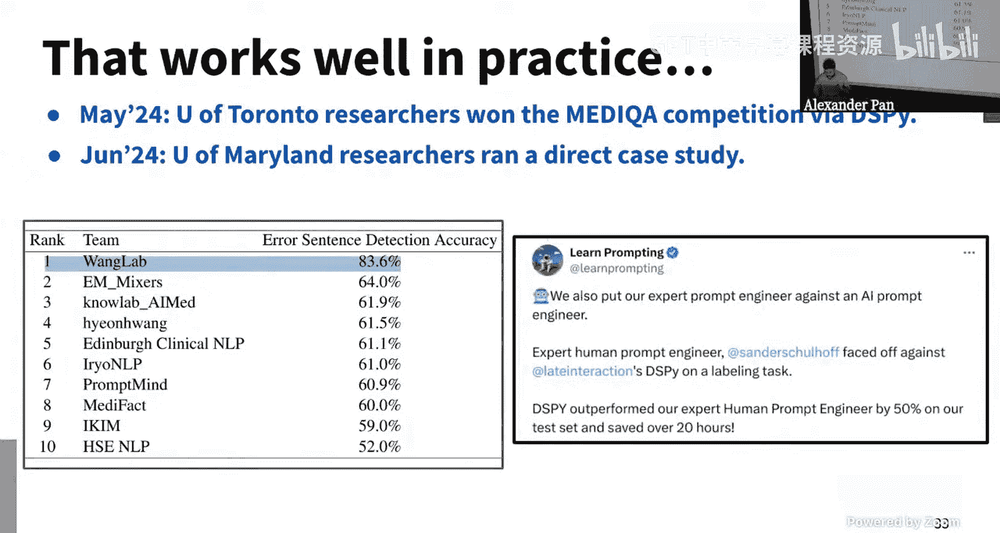

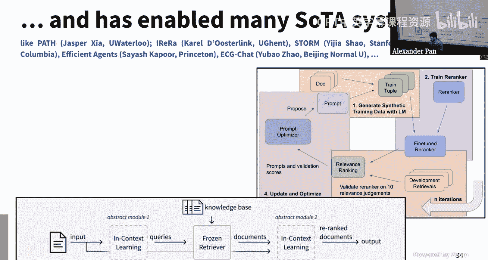

让我们看一个具体例子：构建一个简单的多跳检索增强生成管道。


这个程序的逻辑是：给定一个问题，循环两次（或多跳），每次用当前累积的上下文让语言模型生成一个搜索查询，检索新信息，更新上下文，最后用所有上下文生成答案。

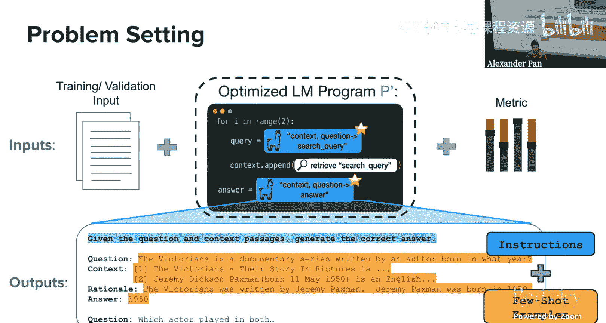

在DSPy中，这个程序可以这样编写（概念上）：
```python
class RAG(dspy.Module):
    def __init__(self):
        self.generate_query = dspy.ChainOfThought(“context, question -> search_query”)
        self.generate_answer = dspy.ChainOfThought(“context, question -> answer”)

    def forward(self, question):
        context = []
        for hop in range(2):
            query = self.generate_query(context=context, question=question)
            # 假设 retrieve 是检索函数
            new_context = retrieve(query)
            context.append(new_context)
        return self.generate_answer(context=context, question=question)
```
我们只声明了模块的签名（`generate_query`, `generate_answer`）和程序逻辑，没有编写具体的提示词。

## 从签名到实际提示：适配器与优化器


那么，如何将这些签名和策略转化为实际有效的提示词呢？


第一步是通过**适配器**进行基本转换。适配器根据签名和选择的语言模型类型，生成一个初始的、格式化的基础提示。这个提示可能效果一般，但足以启动流程。

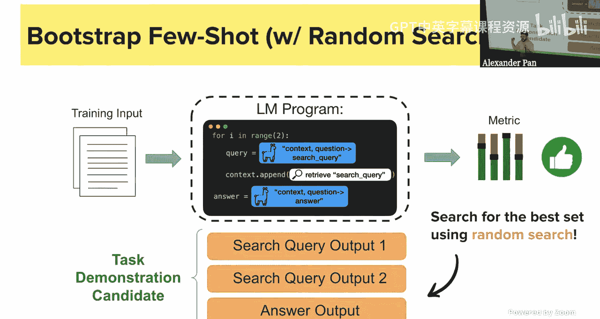


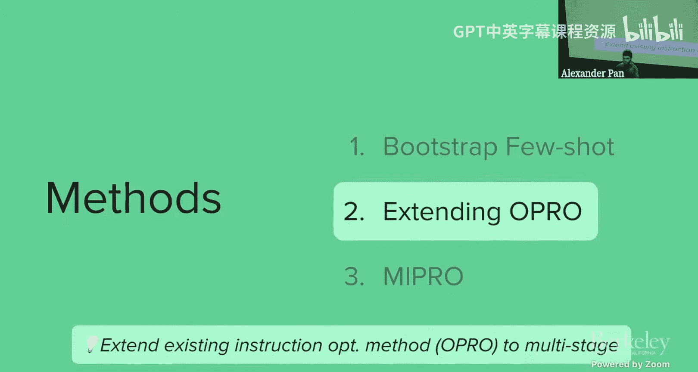

接下来，**优化器**登场。优化器将整个程序中的所有初始提示视为可调整的参数，并尝试寻找能最大化目标指标的配置。这就像在神经网络训练中选择优化器（如Adam）。

优化过程可以显著提升性能。例如，在一个多跳问答任务上：
*   仅用基础提示的GPT-3.5准确率可能只有37%。
*   使用优化器（如MIPRO）后，准确率可以大幅提升至60%以上。
*   同样的程序，优化后可以在不同规模、不同提供商的语言模型上都获得提升，甚至让小模型逼近或超越未优化的大模型。

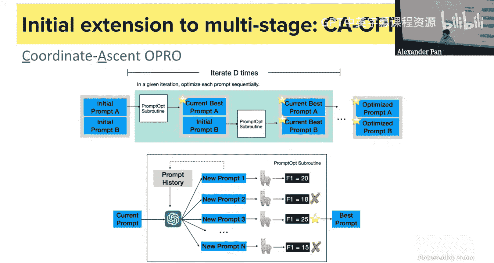


## 优化器策略概览

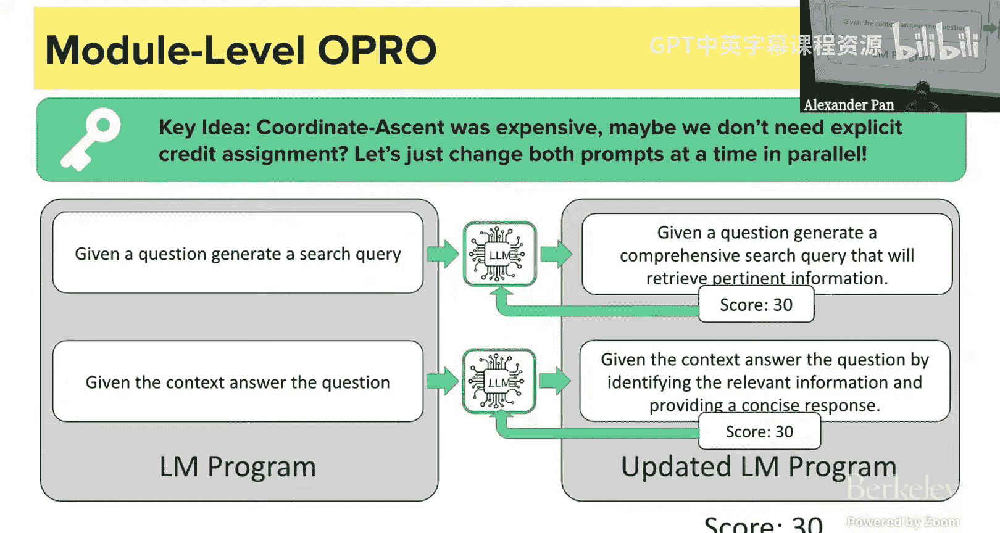

优化器有很多种，但大多遵循一个通用模式：

1.  **初始化**：通过适配器为每个模块生成基础提示。
2.  **拒绝采样与轨迹收集**：运行程序，收集那些最终能获得高评估得分的执行轨迹。这些轨迹包含了每个模块在成功案例中的输入输出对。
3.  **利用轨迹更新模块**：
    *   **示例学习**：将成功的输入输出对作为演示示例插入到提示中（Few-shot Learning）。
    *   **指令归纳**：根据大量成功/失败的模块示例，让语言模型归纳出更好的任务指令。
    *   **微调/强化学习**：如果有足够多的示例，可以对模型进行微调。

## 深入MIPRO优化器

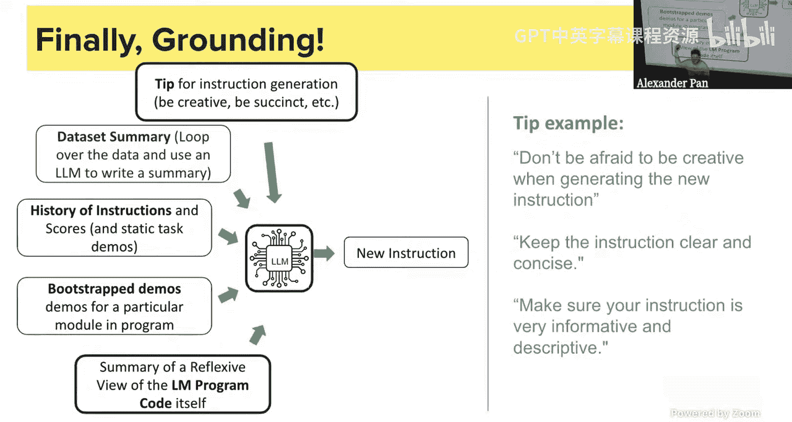

我们重点介绍**MIPRO**优化器，它同时优化指令和演示示例，并高效处理模块间的信用分配问题。

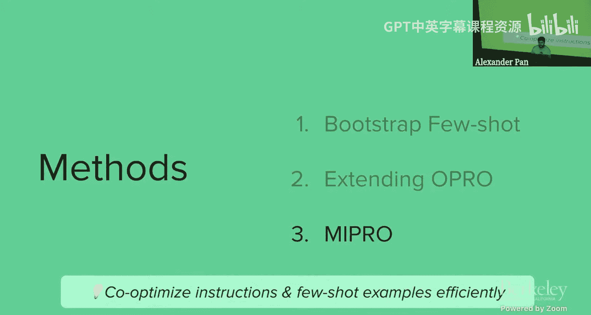

MIPRO的工作分为三步：

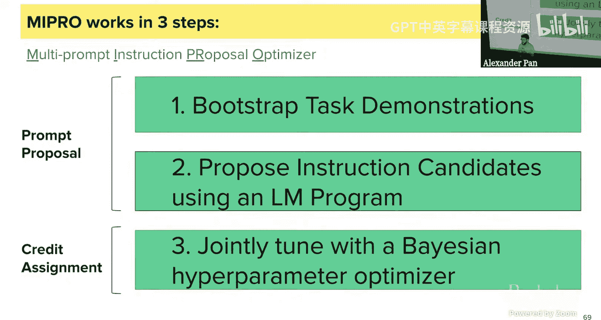

1.  **引导演示**：运行程序，收集成功的轨迹作为候选演示示例。
2.  **生成候选指令**：使用一个**内部的**语言模型程序，该程序接收数据集摘要、程序描述等信息，为每个模块生成 grounded（基于上下文）的候选指令。
3.  **贝叶斯优化搜索**：将每个模块的指令和示例选择视为离散的超参数。构建一个代理模型来预测任何配置组合的性能。使用贝叶斯优化来智能地提议新的、有潜力的配置组合进行尝试，并不断更新代理模型。


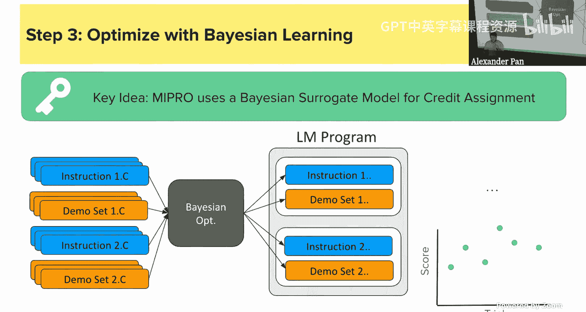

这种方法避免了贪婪的坐标上升法（逐个优化模块），能够联合搜索所有模块的最佳配置，效率更高。

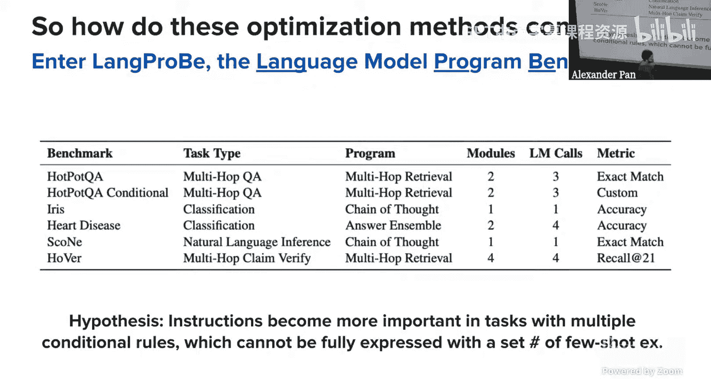

## 优化方法对比与经验

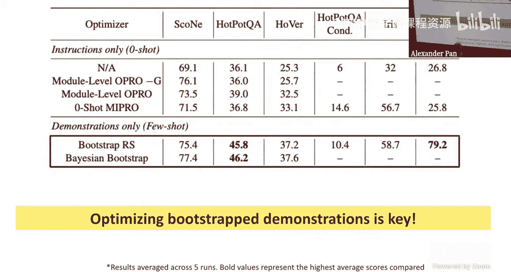

在不同的任务上对比各种优化方法，可以得到一些经验：

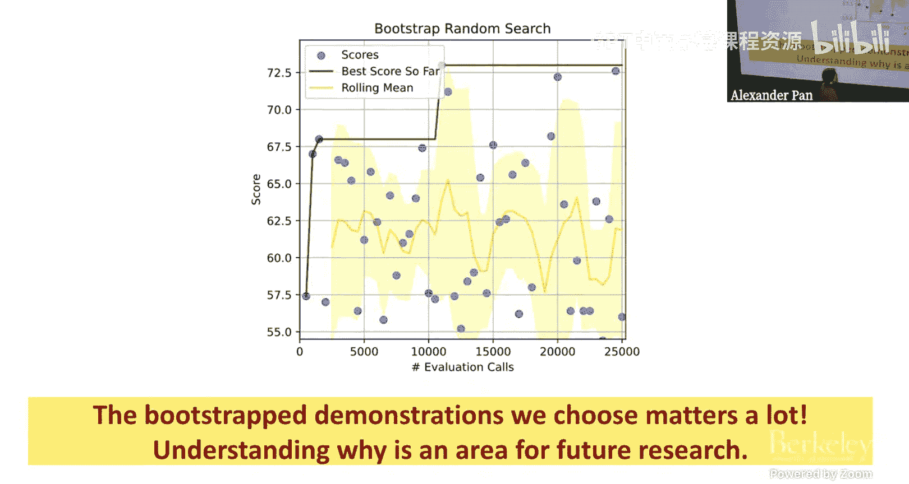

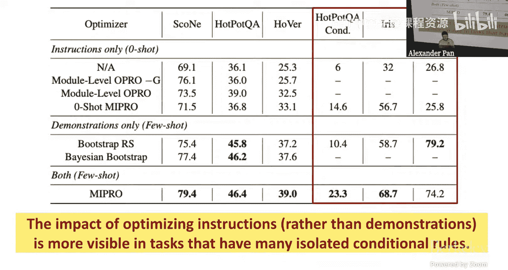

*   **仅优化指令**有一定帮助，但在复杂任务上提升有限。
*   **优化演示示例**通常能带来更显著的性能飞跃（10个点以上）。
*   **同时优化指令和示例**（如MIPRO）通常能获得最佳结果。
*   当任务包含复杂的条件规则，仅靠几个示例难以捕捉时，优化指令就显得尤为重要。


## 总结与展望

本节课中我们一起学习了构建复合AI系统的核心理念与实践方法。

关键要点总结：
1.  **复合优于单一**：通过将任务分解为模块化程序，可以获得比单一语言模型更高的准确性、可控性和透明性。
2.  **声明式编程**：DSPy框架允许我们使用**签名**声明式地定义模块功能，将**程序逻辑**、**推理策略**、**优化器**和**评估指标**解耦，从而可以独立且灵活地迭代每个部分。
3.  **自动优化**：无需手动编写冗长提示。优化器可以自动引导演示、生成指令，并通过搜索找到高性能的配置。虽然语言模型单个提议的平均质量可能不高，但大规模搜索能发现超越手工调优的方案。
4.  **促进开放研究**：DSPy的模块化设计使得研究者可以独立开发新的推理策略、优化器或模块，并能被整个社区直接复用，这有助于推动开放研究在AI进步中发挥主导作用。

DSPy已被多家公司用于生产环境，其开源生态正在不断增长。通过将AI系统构建从“提示词工程”转变为“程序工程”，我们为构建下一代可靠、可维护、可扩展的AI应用奠定了坚实的基础。

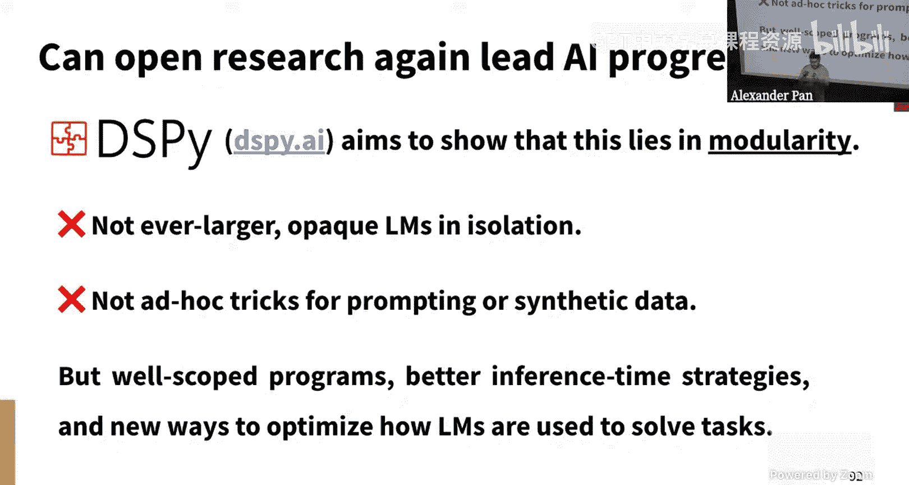

