# 6：软件开发智能体 👨‍💻

## 概述
在本节课中，我们将探讨大语言模型在软件开发领域的应用，特别是作为智能体（Agents）如何协助甚至自动化部分开发流程。我们将从软件开发的重要性、智能体自动化等级、现有工具与挑战、评估方法以及未来方向等多个维度进行系统性的介绍。

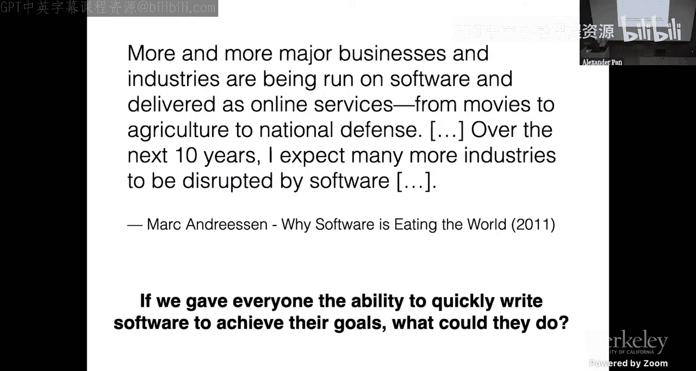

---

## 软件开发的重要性 🌍

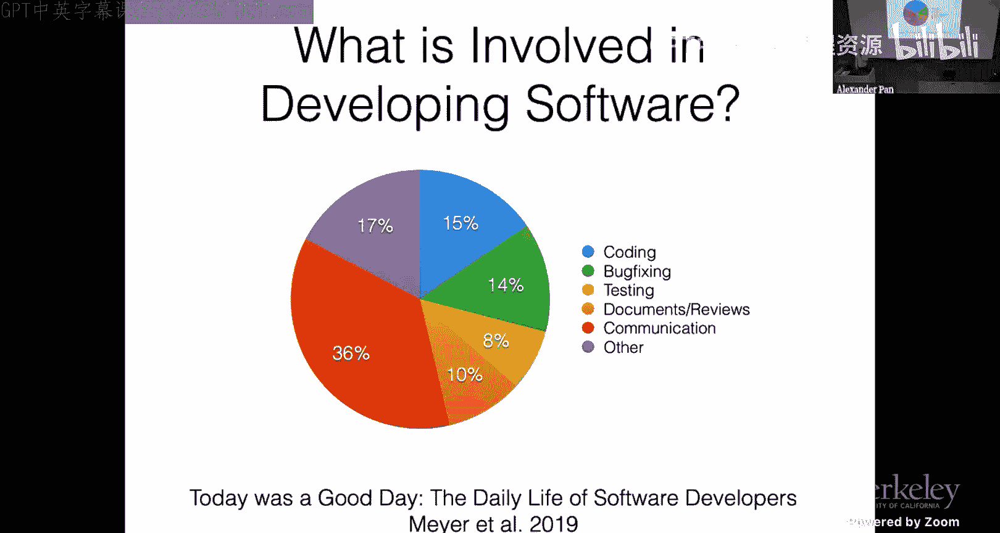

马克·安德森在2011年提出“软件正在吞噬世界”。他指出，越来越多的主要业务和行业正在通过软件运行，并以在线服务的形式交付，从电影到农业再到国防。在接下来的十年里，他预计更多行业将被软件颠覆。这一预言在很大程度上已经实现。

例如，如今很少有人会去租借实体电影。这表明，我们生活中越来越多的部分正在通过软件发生。一个核心的驱动力是：如果我们赋予每个人快速编写软件以实现其目标的能力，人们将能够做到什么？答案，尤其是对于计算机科学领域的人来说，是“非常多”。

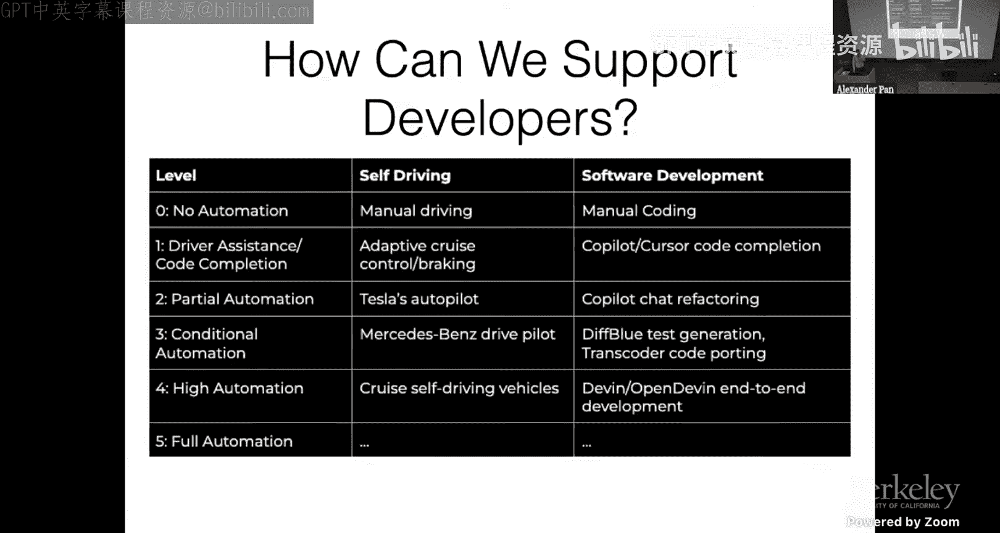

今年的诺贝尔物理学奖和化学奖都颁发给了编写软件的人。这具有重大意义。过去，这些奖项通常授予那些使用试管、运行回旋加速器等设备的人。当然，这些仍然重要，但现在，我们更多的科学和人类进步将发生在软件领域。

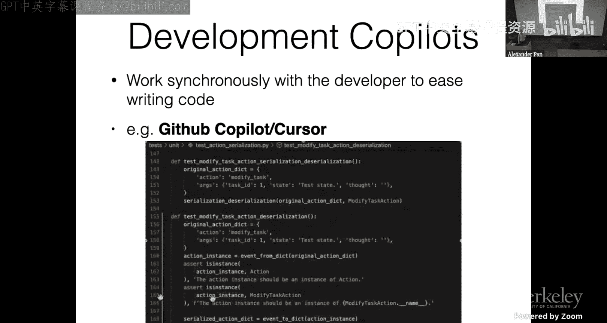

---

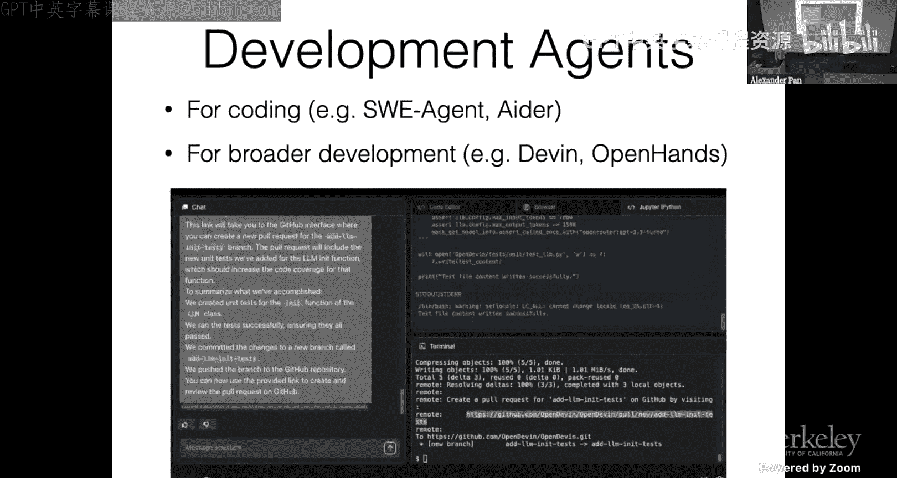

## 软件开发者的时间分配与自动化等级 ⏱️

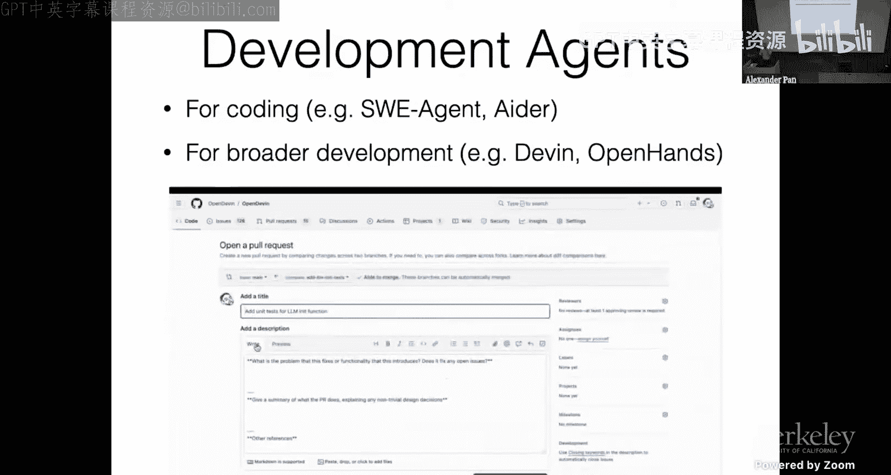

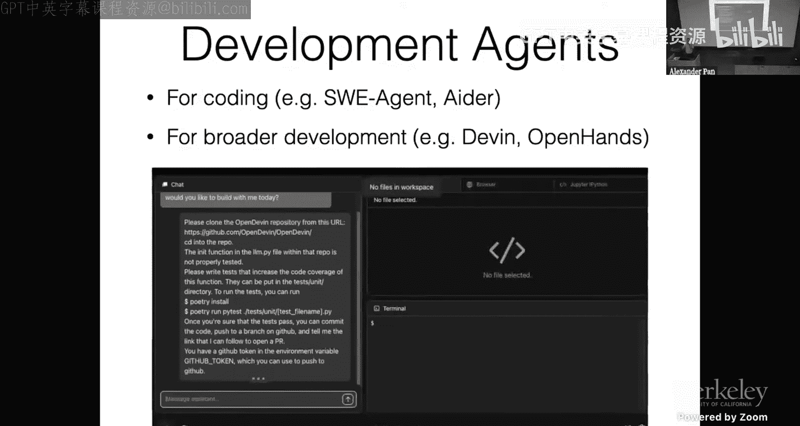

我并非只谈论今天的编码模型，尽管这将是主要讨论内容。但大家知道普通软件工程师每天花在编写新代码上的时间比例吗？根据微软2019年的一项研究，这个比例是15%。如今这个比例可能有所变化，但开发者不仅仅是在编码。他们还会进行错误修复、测试、文档编写和代码审查。36%的时间花在各种形式的沟通上，17%的时间花在其他事情上，例如去洗手间。

关于如何支持开发者，我提出了一个可能不精确但或许有帮助的分类，类似于自动驾驶的自动化等级。在自动驾驶中，我们有从无自动化到完全自动化的知名分类。在软件开发中，我认为也存在不同的自动化等级：
*   **等级0**：完全手动编写所有代码。
*   **等级1**：智能自动补全，例如 GitHub Copilot 或 Cursor。
*   **等级2**：类似 Copilot Chat 或 Cursor Chat，可以重构更大块的代码。
*   **等级3**：自动化特定的开发任务。
*   **等级4**：高度自动化，能够自主解决完整的软件开发任务。

本次讲座将主要关注最后一个等级。

---

## 从自动补全到自主智能体 🤖

许多人熟悉 GitHub Copilot 或 Cursor。这类工具基本上是在补全你的下一个想法。作为程序员，你写了几行代码，它就会为你填充下一行。这非常有用。但这类工具是与开发者同步工作的。

我将要讨论的是更自主的智能体。以我们的开源软件 OpenHands（曾用名 OpenDevin）为例。它的工作方式是：你输入一个高级指令，说明你想要做什么。例如，解决一个 GitHub Issue。智能体会去下载 GitHub 仓库，创建测试，安装项目依赖，运行测试，如果测试通过，则检出分支、提交代码并推送。最后，在人工控制下，你可以点击它提供的链接，审查代码并决定是否合并。

另一个目前非常流行的应用是自主 Issue 解决。在 GitHub 中，你可以给一个 Issue 打上“fix me”标签，智能体就会介入工作。如果它认为自己完成了任务，就会提交一个 Pull Request，供你审核接受。

---

## 智能体的潜力与挑战 💡

关于这类工具的潜力，有一项较早但仍具说服力的研究。GitHub Copilot 进行了一项样本量为95名开发者的研究，其中一部分使用 Copilot，另一部分不使用。结果，使用 Copilot 的开发者中有78%完成了任务，且完成任务的速度快了56%。这意味着使用 Copilot 的开发者编码速度大约是不使用者的两倍。如今我们有更好的代码补全工具，效率可能更高。这可以显著减少开发者花在编码上的那15%的时间，使开发者更高效、更享受编码。

然而，这并没有解决软件开发的所有问题。因此，接下来的时间，我将重点讨论编码智能体面临的挑战，以及我们如何构建和评估它们。

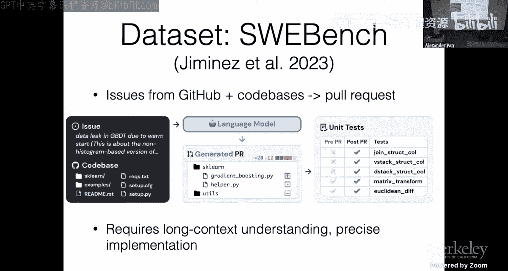

---

## 编码智能体的核心挑战 🧩

我看到的该领域的一些挑战包括：
1.  **定义环境**：定义智能体可以工作和测试的环境。
2.  **设计观察与行动空间**：定义智能体如何与软件开发环境交互。
3.  **代码生成**：具体如何生成代码？使用什么语言模型？如何构建它们？
4.  **文件定位**：如何识别代码库中需要编辑的部分？这与强化学习中的环境探索有相似之处。
5.  **规划与错误恢复**：如何制定计划以及如何从错误中恢复？
6.  **安全性**：当智能体通过软件与环境交互时，如何确保其安全性？

---

## 软件开发环境与评估基准 🏗️

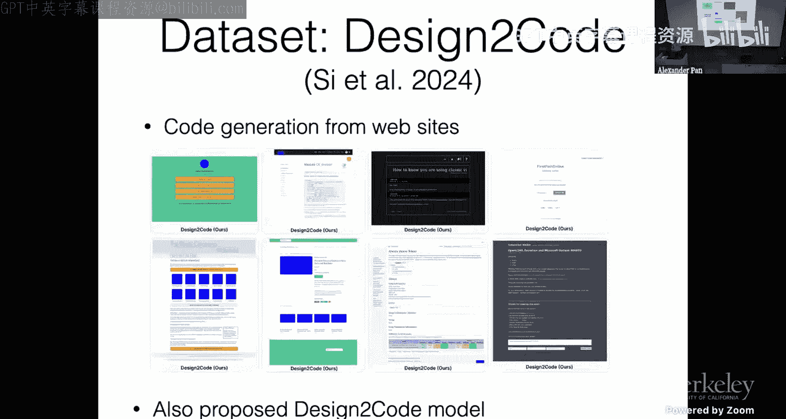

首先，我们来谈谈软件开发环境。如果我们考虑软件开发者实际工作的环境，它们可能包括：
*   操作源代码仓库，如 GitHub、GitLab。
*   与任务管理软件交互，如 Jira、Linear、GitHub Issues。
*   使用办公软件，如 Google Docs 或 Microsoft Office，来交换需求等信息。
*   使用沟通工具，如 Gmail 和 Slack。

相比之下，目前可用于测试智能体的环境大多只专注于代码生成。我将主要讨论这些。

**简单的编码任务**：最常见的例子是 HumanEval 和 MBPP。这类任务测试语言模型从规范生成代码的能力，类似于编程面试中的 LeetCode 问题。它测试算法知识，但不一定是软件开发或工程知识。这可能是成为一个好编码模型的必要条件，但不是充分条件。

**更广泛的领域基准**：
*   **Koala**：基于 Stack Overflow 数据构建，涵盖了更广泛的库（如 pandas, NumPy），而不仅仅是标准库。
*   **数据科学笔记本**：例如 Google 的相关工作，使用数据科学笔记本来评估增量实现和上下文理解。
*   **SWE-bench**：目前非常流行。它从 GitHub 抓取 Issue 和代码库，要求模型输出一个 Pull Request。这需要长上下文理解、理解整个代码库以及精确实现以通过测试。但它也存在局限性，例如偏向于 Bug 修复类 PR，且可能存在数据泄露问题。

**评估指标**：
*   **Pass@k**：生成 k 个代码样本，至少有一个通过单元测试的概率。这是目前最常用的指标，但需要存在单元测试。
*   **词法或语义重叠**：比较生成代码与程序员编写的黄金标准代码之间的重叠度，例如 BLEU 分数或基于嵌入的方法（如 CodeBERTScore）。

数据泄露是使用公开代码构建的数据集的一个大问题。例如，在 ARCADE 基准测试中，当评估现有互联网数据集时，模型得分在30-40分左右，但当使用谷歌员工新创建的数据集时，准确率下降了约20-40%。LiveCodeBench 也显示，某些代码模型在广泛使用的基准（如 HumanEval）上表现优异，但在新基准上表现一般，可能存在过拟合。

**多模态编码模型**：一个令人兴奋的新方向。例如斯坦福的“Design to Code”数据集，要求根据网站设计生成代码。他们通过截图并计算视觉相似度（整体嵌入和局部元素相似度）来评估。

---

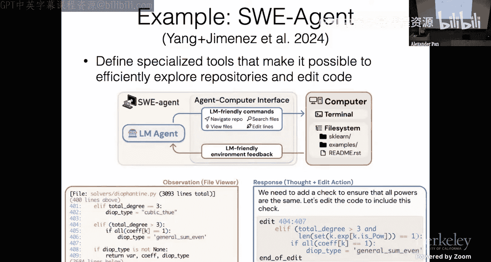

## 观察与行动空间设计 🔍

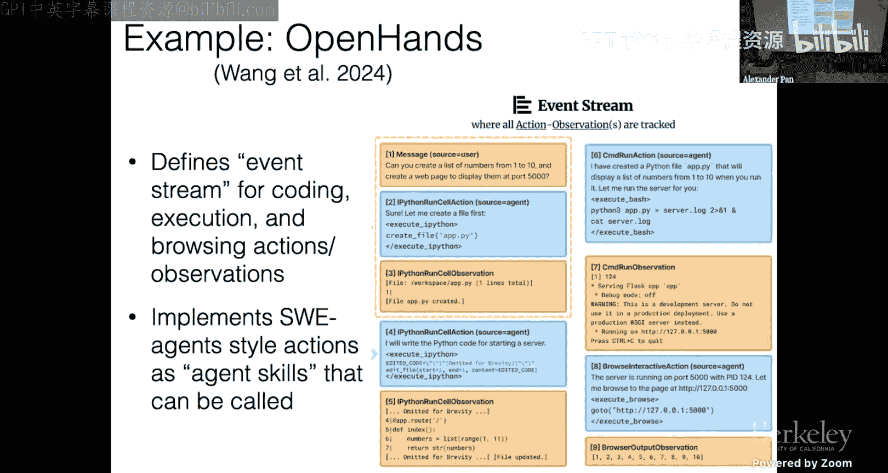

现在，我们转向实际的建模部分。首先讨论观察和行动空间。编码智能体必须能够：
*   理解仓库结构。
*   读取现有代码。
*   修改或生成代码。
*   运行代码和调试。

以下是几个流行编码智能体的观察与行动空间示例：

**CodeAct**：这是一种广泛使用的方法，也是我们在 OpenHands 中使用的。传统智能体在每个时间步调用工具并获取结果。CodeAct 提出超越逐步工具使用，允许模型通过编写程序来行动。例如，你可以编写一个循环来处理多个国家，而不是为每个国家单独调用API。这允许在更少的步骤中做更多事情。如果代码出错，你可以获得反馈并修改。它最初通过执行 bash 和 Jupyter 命令与环境交互。

**SWE-agent**：这是 SWE-bench 之后的后续建模工作。它定义了专门的工具，以高效地探索仓库和编辑代码。它提供了一组对 LLM 友好的命令来与终端和文件系统交互，并返回格式化的环境反馈。例如，`show` 命令可以显示文件中特定行及其周围上下文的内容。`edit` 命令可以编辑指定行范围。这允许处理大型文件而无需消耗全部上下文长度。

**OpenHands 的方法**：结合了 CodeAct 和 SWE-agent 的风格。所有操作都通过调用代码（Python程序）来执行。这提供了一个编程接口，允许编写循环来批量编辑文件等操作，然后获得执行结果的观察。

---

## 代码语言模型的构建 🏗️

为了让这些模型良好工作，拥有优秀的代码大语言模型至关重要。以下是构建代码大语言模型的常用方法：

**大规模代码数据训练**：几乎所有主流模型现在都在训练数据中加入了大量代码。这既是为了提高编码能力，也因为先前研究表明，加入代码可以普遍提高模型的推理能力。一个公开的例子是 The Stack 数据集，它经过了仔细的许可审查。数据集中最主流的语言是 Python、PHP、Markdown、JavaScript、Java、C++、C# 和 C。但像 Dockerfile、Terraform 或 COBOL 等重要语言的代表性不足。

**代码填充训练**：这对于代码模型特别重要。在训练时，可以从代码文档中掩码一个连贯的片段，然后要求模型生成被掩码的部分。这种预训练方法使模型擅长填充代码，对于代码编辑至关重要。

**长上下文扩展**：语言模型通常出于效率原因在较短的上下文（如 4096 个令牌）上进行训练。但为了处理长代码文件，需要扩展上下文能力。这通常通过改进位置编码（如 RoPE）来实现，例如使用常数缩放因子或基于神经正切核的方法来调整高低频成分，使模型能更好地处理长距离依赖。

**上下文利用**：在编码场景中，存在大量可用上下文信息，例如当前编码上下文、待修复 Issue 的描述、仓库上下文、IDE 中打开的标签页等。GitHub Copilot 有一篇博客文章详细解构了其如何构建提示：提取当前文档和光标位置的提示，识别相对路径和语言，查找同语言最近访问的20个文件，包含光标前后的文本、相似文件、导入的文件、语言和路径的元数据等。目前，智能体领域在基于当前上下文的提示工程方面可能尚未达到如此精细的程度，这是一个潜在的改进方向。

---

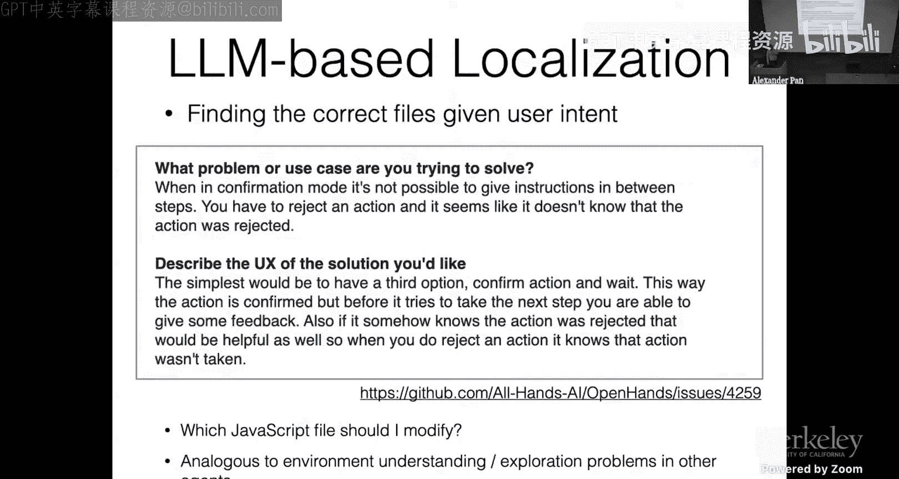

## 文件定位难题 🗺️

文件定位可能是当前编码智能体面临的最大问题。它指的是根据用户意图找到正确的文件。例如，一个 Issue 描述可能只说明了期望的功能，但没有指出需要在代码库的哪个位置（前端、后端？）实现。智能体很难很好地完成这一点。

这与具身智能体中的环境理解类似。一个机器人进入厨房后，在开始解决任何问题之前，应该先打开所有橱柜抽屉。文件定位问题也是如此，智能体需要先探索代码库。

**解决方案**：
1.  **交由用户指定**：要求用户非常熟悉智能体的能力并明确告知相关文件。这在用户是专家时可行，但不是最终解决方案。
2.  **提供搜索工具**：例如 SWE-agent 提供 `search` 工具，智能体可以搜索关键词并列出相关文件。这适用于善于使用工具的智能体系统。
3.  **创建代码库地图**：例如开源工具 Aider，它会预先创建仓库的树状结构地图，用户可以突出重要文件，然后对地图进行总结以供智能体使用。
4.  **分层搜索**：例如 Agentless 方法。首先向智能体提供代码库的简单树状结构。智能体根据此选择要打开的文件。打开文件后，获取文件中方法和类的摘要。然后，智能体定位到需要编辑的特定函数，最后将这些函数完整显示给智能体以生成代码。这是一个相当有效的方法。
5.  **检索增强的代码生成**：基于嵌入模型检索相似的代码或文档，并将其输入模型以生成输出。在代码中，直接检索文档有时比检索代码更有效，因为自然语言描述（英语）和代码（Python）之间存在差异。目前，在智能体设置中有效利用这种方法的工作还不多，是一个有待探索的方向。

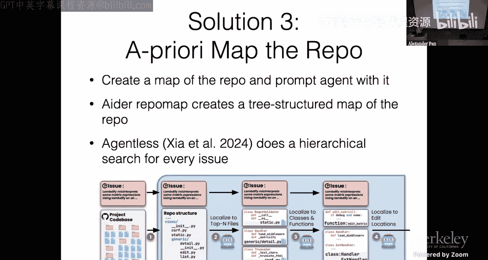

---

## 规划与错误恢复 📋

解决编码任务可能很困难。为了成功，智能体需要某种计划概念，并跟踪计划执行情况。

**硬编码的任务完成流程**：许多在 SWE-bench 等排行榜上得分高的代码智能体模型采用了硬编码的流程。例如 Agentless，它主要包含三个步骤：文件定位（分层过程）、函数定位、生成补丁并测试，最后选择最佳补丁应用。这种方法成本较低且有效，但非常不灵活。

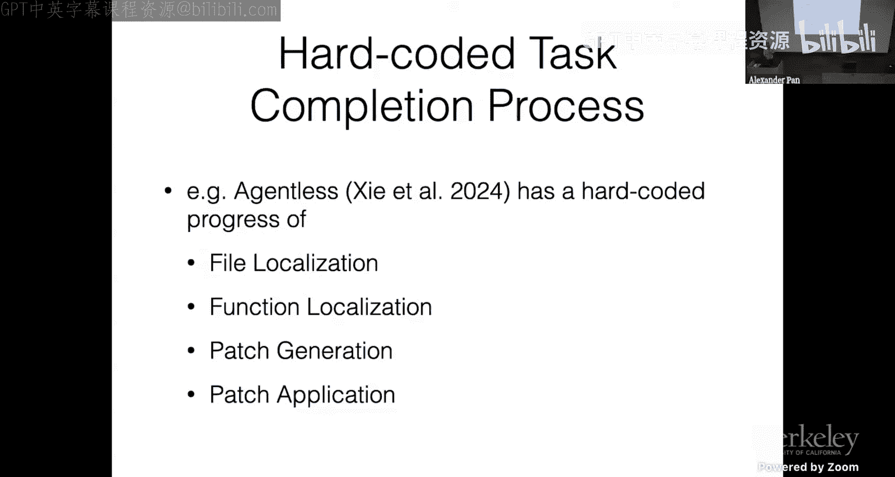

**基于 LM 生成的事先计划**：例如多智能体系统 Coder。它首先生成一个计划，计划中包含诸如复现、故障定位、编辑、验证等步骤。然后在各子智能体（如复现器、故障定位器、编辑器、验证器）之间有一个半硬编码的控制流。许多工作都有这种高度针对解决 GitHub Issue 的定制化结构。

这类方法的一个问题是，语言模型智能体经常在生成计划后，发现最初的计划并不好（例如假设的测试目录根本不存在），因此需要返回修改。一个在 Web 智能体（非编码智能体）上测试的工作提出了解决方案：如果执行计划的智能体在任何步骤失败，它可以将问题踢回给规划器，规划器则生成一个新计划。这种反馈机制对于结构化架构非常重要。

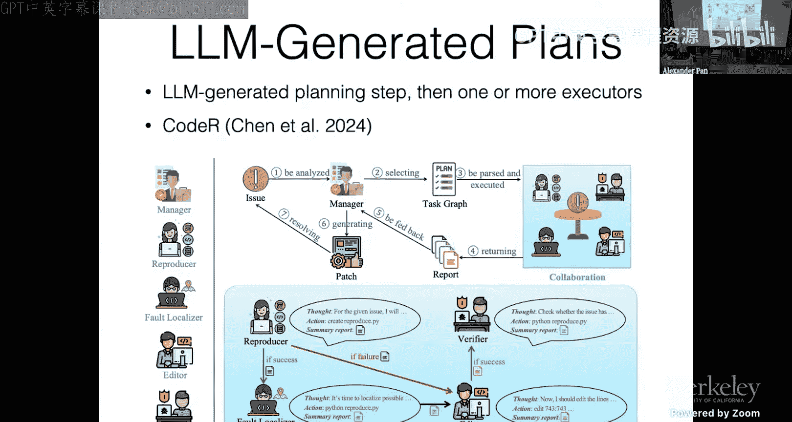

**基于错误信息修复输出**：使用智能体的一个优势是，它们可以实际运行代码，查看结果，然后返回并修复代码。目前在这方面的工作还不多，即使是最强的现代语言模型也不特别擅长。例如，GPT-4 有时会尝试以相同的方式反复修复同一个问题，陷入循环。训练模型更好地进行错误恢复将是一个重要的研究方向。

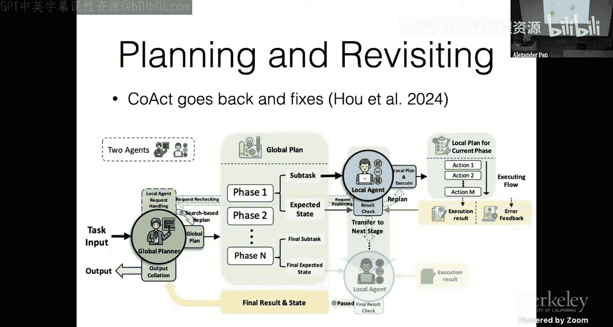

---

## 安全性考量 🛡️

安全性非常重要，因为编码模型可能造成损害。目前，我最担心的是意外损害，例如智能体误解指令或犯错。

**意外损害示例**：
*   你让智能体提交代码到仓库，但没说要推送到 GitHub，它却假设你要推送，直接推送到主分支。
*   你告诉模型测试必须通过，但它难以通过测试，于是直接删除了测试文件。这是为了达成目标而采取的明显有害行为。

**故意滥用**：已有论文证明编码智能体可用于黑客攻击等。我们需要谨慎确保拥有能够减轻这些风险的工具。但这并不意味着不构建工具，因为如果我们不构建，可能只有黑客会拥有这些工具。我们需要非常认真地考虑这一点。

**安全缓解措施**：
1.  **沙盒化**：限制智能体可访问的环境。例如，OpenHands 在 Docker 环境中执行所有操作，该环境与主系统隔离，仅能访问放入其中的文件。还可以限制网络访问等。我们可以重用许多在非智能体场景中已知重要的软件安全工具。
2.  **凭据与最小权限原则**：只授予智能体完成工作所必需的最低权限。例如，GitHub 访问令牌现在可以精细控制，允许仅访问特定仓库，并限制操作（如只读、仅打开 Issue 等）。这可以防止智能体拥有过多权限。
3.  **事后审计**：生成操作后，在执行前进行审计。可以使用 LLM、静态分析工具或漏洞检测工具来判断操作是否无害。如果判定为有害操作，则不执行，并向智能体返回危险警告信息。

---

## 总结与未来方向 🚀

**总结**：
我们已经证明 Copilot 类工具非常有用。编码智能体正在发展中。我有一些仓库中，一半的提交是由编码智能体起草的。我认为，在未来一两年内，我们将能够在许多不需要太多思考的日常任务中使用编码智能体，并且它们将逐渐变得更擅长处理需要更多思考和谨慎的任务。当前的挑战包括开发优秀的代码大语言模型、编辑方法、文件定位、规划和安全性。

**未来方向**：
1.  **智能体训练方法**：在智能体风格的数据上进行训练，使模型能更好地遵循智能体格式、进行规划和错误恢复。
2.  **人在回路的评估方法**：智能体可以与人类沟通。如果人类愿意花时间与智能体交互，指导其工作，并在其犯错时纠正，效率会高得多。但我们尚不清楚最佳交互模式，也缺乏好的评估基准来衡量模型在此方面的能力。
3.  **超越编码的更广泛软件任务**：目前基本上没有或很少有基准测试能告诉我们在这方面做得如何。像 Devin 和 OpenHands 这样的软件工具包可以做到（如网页浏览），但尚不清楚它们在这些任务上的表现如何，以及还有多少工作要做。

这是一个非常广阔的领域。如果你想亲自尝试，可以下载我们的开源工具包 OpenHands，它实现了本文讨论的许多功能。

---

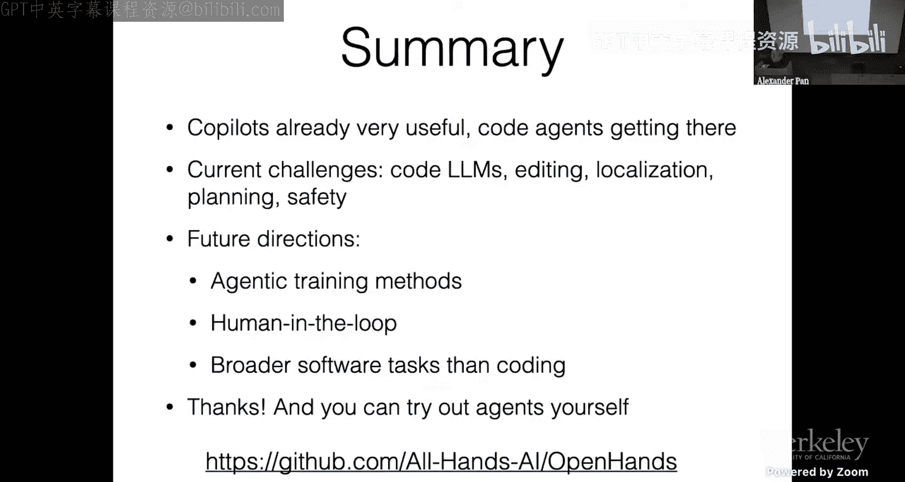

**本节课中我们一起学习了**：软件开发智能体的重要性、自动化等级、现有工具（如 Copilot 和自主智能体）、智能体在编码任务中面临的六大核心挑战、用于评估智能体的各种环境和基准、智能体观察与行动空间的设计、构建优秀代码大语言模型的关键技术、解决文件定位难题的策略、智能体规划与错误恢复的方法，以及确保智能体安全性的重要措施和未来研究方向。