# 8：迈向神经与决策的统一框架 🧠

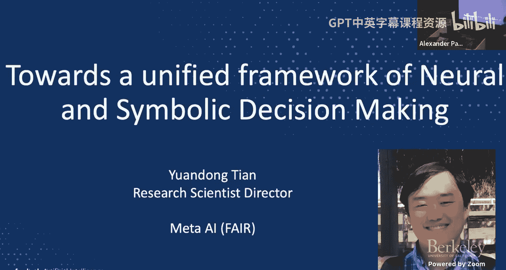

在本节课中，我们将探讨如何将大语言模型应用于推理与规划领域，并分析其当前面临的挑战与潜在的解决方案。我们将重点介绍三种不同的技术路径，以提升模型在复杂规划任务中的能力。

---

## 当前大语言模型在规划任务中的挑战 😕

上一节我们介绍了大语言模型在推理与规划领域的应用前景。本节中，我们来看看模型在实际规划任务中表现出的具体弱点。

大语言模型已被广泛应用于对话AI、内容生成、角色扮演和智能体构建等场景。近期，通过思维链等技术，模型的推理可信度得到了显著提升。然而，当我们将模型应用于不同的规划任务时，仍然会遇到诸多问题。

一个典型的例子是旅行规划问题。任务很简单：给定预算、日期和目的地（如夏威夷、西雅图、加利福尼亚），要求模型生成一个清晰、可执行且最优的行程。理想的智能体行为是：首先查询外部信息（如搜索目的地、航班、酒店），然后整合所有信息，规划出一条可行的行程路径。

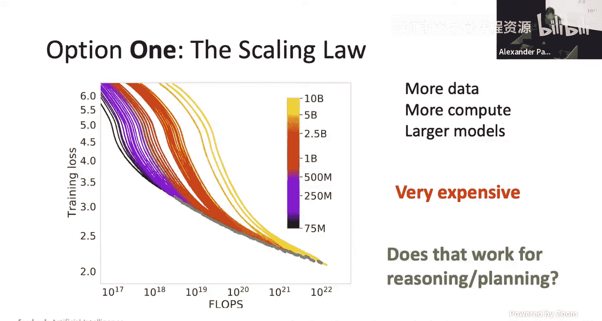

但实际情况是，即使使用当时最强的GPT-4 Turbo模型，生成完整行程的最终通过率也仅有0.6%。即使为模型提供了真实的工具信息，其规划通过率也仅为4.4%。这里的“通过率”指行程的每个阶段都能满足所有约束条件（如预算、禁烟房间等）。近期对Omni模型（如Omni Mini和Omni Preview）的测试也显示，其总体通过率并不理想，甚至不如针对特定任务微调的模型。

这种现象在其他规划场景（如会议安排）中同样存在。随着问题复杂度（如城市数量、参与人数）的增加，模型的性能会显著下降。即使是当前表现优异的O1模型，在面对大规模规划问题时，其性能曲线也会急剧下滑至接近零。这表明，即使是最好的模型，也尚未从根本上解决复杂规划问题。

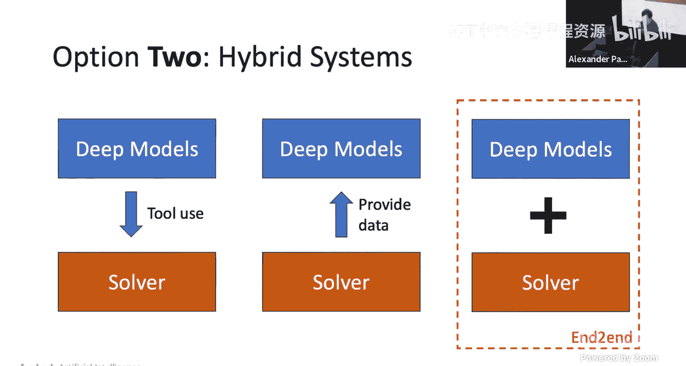

---

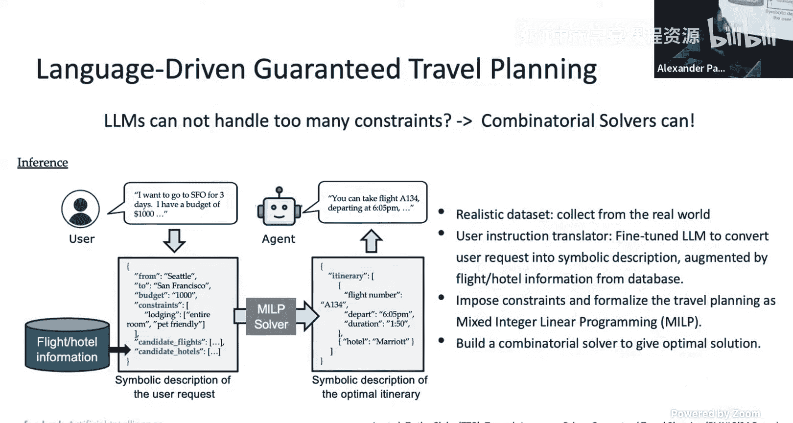

## 解决方案一：扩展定律 📈

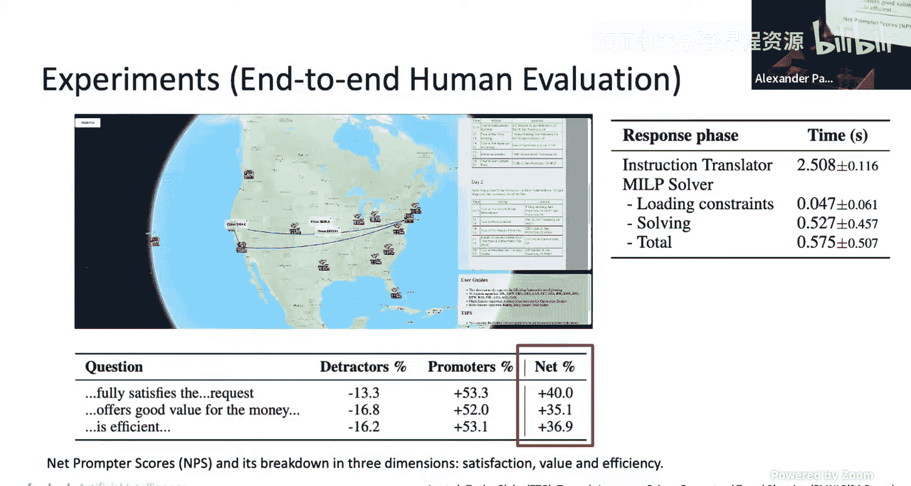

面对上述挑战，第一种解决方案是遵循扩展定律。

该方案认为，随着数据量、计算资源和模型规模的持续增长，模型的性能终将提升，最终无需额外技巧即可解决所有规划问题。虽然这条路径工程挑战巨大且成本高昂，并且可能不涉及解决问题的新思维方式，但它确实是一种可行的方向。

---

## 解决方案二：混合系统 🤝

上一节我们介绍了依赖模型自身扩展的路径。本节中，我们来看看如何将神经模型与符号求解器结合，构建混合系统。

深度模型（如基础模型）擅长理解自然语言指令，但在执行高质量规划任务方面表现不佳。另一方面，组合求解器或符号求解器能在许多场景下提供最优解，运行速度快且有性能保证，但它们无法理解自然语言和灵活的用户场景。将两者结合，可以构建出强于单一组件的系统。

以下是几种结合方式：

### 1. 模型调用求解器工具 🛠️

在这种方式下，我们不要求语言模型直接给出最优规划，而是让它先将自然语言输入转换为结构化的JSON文件。这个JSON文件包含了用户请求的场景表示。随后，系统调用一个求解器（如混合整数线性规划求解器）来处理这个JSON文件。求解器会给出一个符号化的最优规划描述，最后再将其转换回自然语言句子，作为智能体的响应。

我们基于此构建了一个实时演示系统。该系统包含一个微调的指令翻译器（耗时约2.5秒）和一个MILP求解器（耗时约0.5-0.7秒）。人工评估表明，用户认为该系统比基线模型更有用、更具性价比且更高效。

### 2. 支持多轮对话的智能体 💬

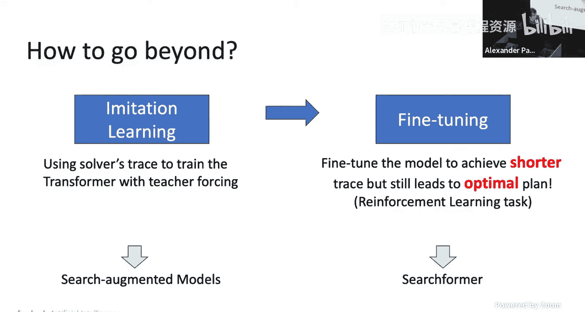

在实际应用中，规划往往需要多轮对话。例如，用户可能只有一个模糊的想法（“我想去夏威夷”），智能体需要主动询问细节（预算、偏好等），以高效地收集所有必要信息。

为了训练这样的智能体，我们设计了一套名为“APEC”的智能体宪法：
*   **准确**：确保信息正确。
*   **主动**：主动提出相关问题。
*   **高效**：以最少的对话轮次获取关键信息。
*   **适应性强**：能适应不同类型的旅行者（我们设定了50种人物角色）。
*   **可信**：减少幻觉和不一致。

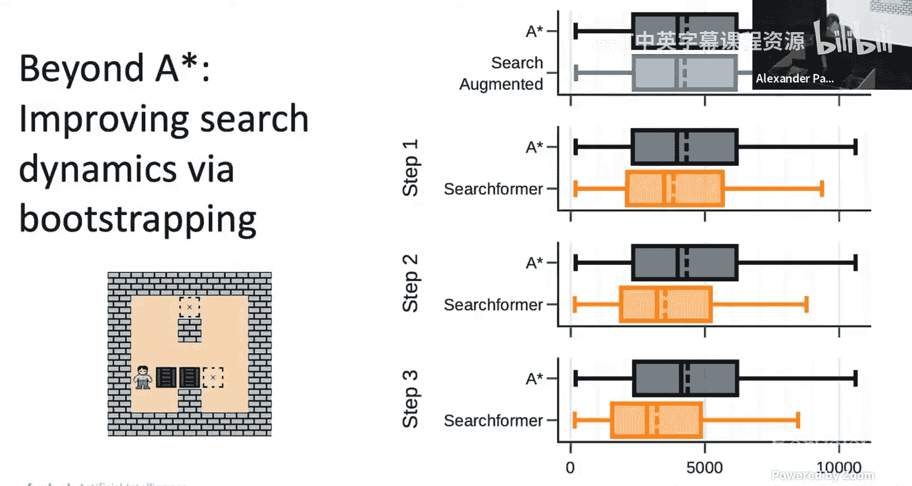

使用DPO等技术对模型进行微调后，智能体在获取总体信息和关键信息方面的效率都得到了提升，其综合评分也高于未针对这些方向微调的基线模型。

近期还有研究尝试使用智能体作为“裁判”，来评估目标智能体每一步的行为，从而提供更精细、更丰富的反馈以供改进。

### 3. 求解器为模型提供训练数据：搜索增强 🧠

第二种结合方式是让求解器为模型生成训练数据。我们引入“搜索增强”模型。

以迷宫导航为例，任务是找到起点到终点的最短路径。传统的“仅解决方案”模型是直接根据问题描述预测最终路径。而我们的“搜索增强”模型则分两步：首先预测求解器（如A*搜索）在找到最优解过程中产生的**搜索轨迹**，然后根据这个轨迹预测最终的输出方案。

虽然搜索增强模型生成的令牌数更多（因为它输出了搜索过程），但它带来了显著的效率提升。实验表明，在30x30的迷宫导航任务中，一个仅1500万参数的搜索增强模型，使用5万个样本就能达到约80%的性能，而1.75亿参数的“仅解决方案”模型使用100万个样本才达到约20%的性能。这意味着搜索增强模型具有**10倍以上的参数效率和数据效率**。在推箱子游戏中也观察到了类似的趋势。

我们可以进一步优化搜索增强模型，目标是找到**更短的搜索轨迹**，同时仍能导向最优计划。通过一种简单的“专家迭代”方法：用当前模型采样多条轨迹和计划，筛选出那些能产生最优计划的最短轨迹，然后用这些数据训练下一代模型。经过多次迭代，模型输出轨迹的平均长度显著缩短，同时最优解的比例保持稳定甚至有所提升。

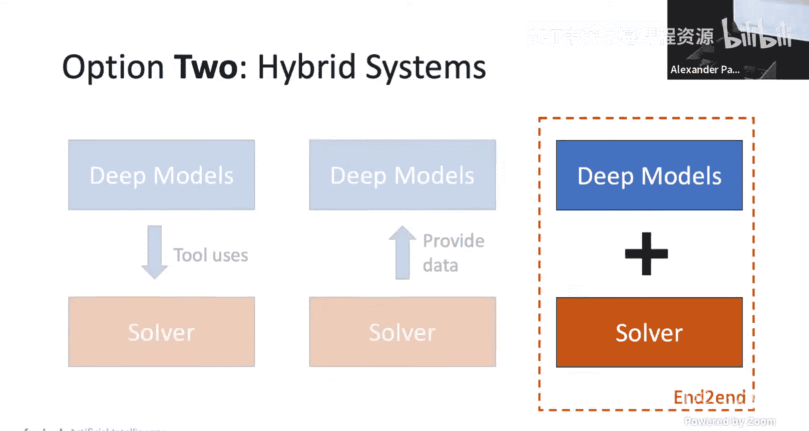

### 4. 双模式模型：自动切换快慢思考 ⚡🐢

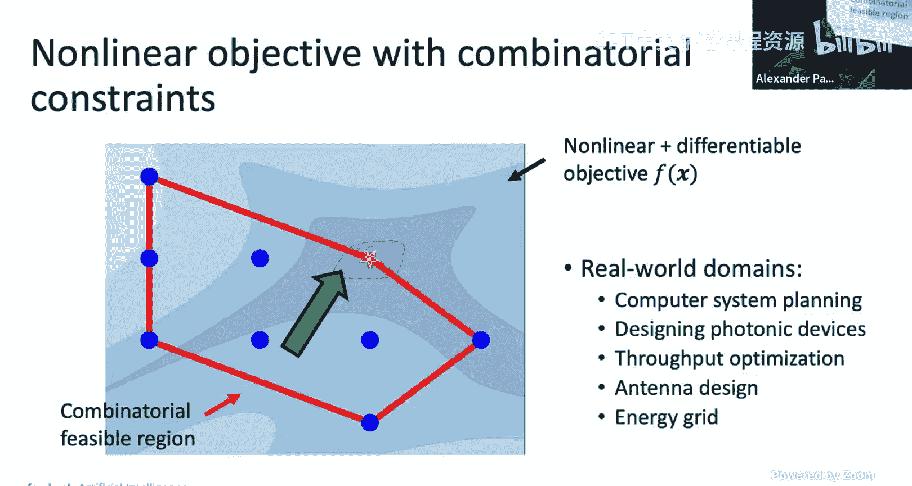

为了进一步缩短轨迹长度，我们提出了“双前向”模型。其核心思想是在训练数据中随机丢弃部分搜索轨迹信息，形成不同完整度的“痕迹级别”数据混合训练模型。

结果发现，使用这种混合数据训练的模型，其性能优于仅使用完整轨迹或仅使用最终方案训练的模型。更有趣的是，这种模型能**自动在“系统1”（快速、直觉模式）和“系统2”（慢速、推理模式）之间切换**。有时模型会先输出一个“创建”令牌，进入慢思考的搜索过程；有时则会直接输出“计划”令牌，给出答案。这种切换行为是从训练中自动涌现的，无需人工明确指定。无论是强制其运行在快速模式还是慢速模式，其性能都优于专门训练的单模式基线模型。

我们将此方法应用于数学问题，通过随机丢弃思维链中的句子来训练模型，得到了步骤更简洁、同时性能略有提升的模型。

### 5. 模型与求解器联合优化 🔄

最后一种结合方式是将模型和求解器在训练时进行端到端的联合优化，应用于具有组合约束的现实世界优化问题。

以**推理表放置**问题为例：需要将K张表放置到多个GPU设备上，在满足设备内存容量的约束下，最小化由神经网络估计的总体延迟。目标函数是非线性的，而约束（每张表必须放置到一个设备、内存限制）是组合且线性的。

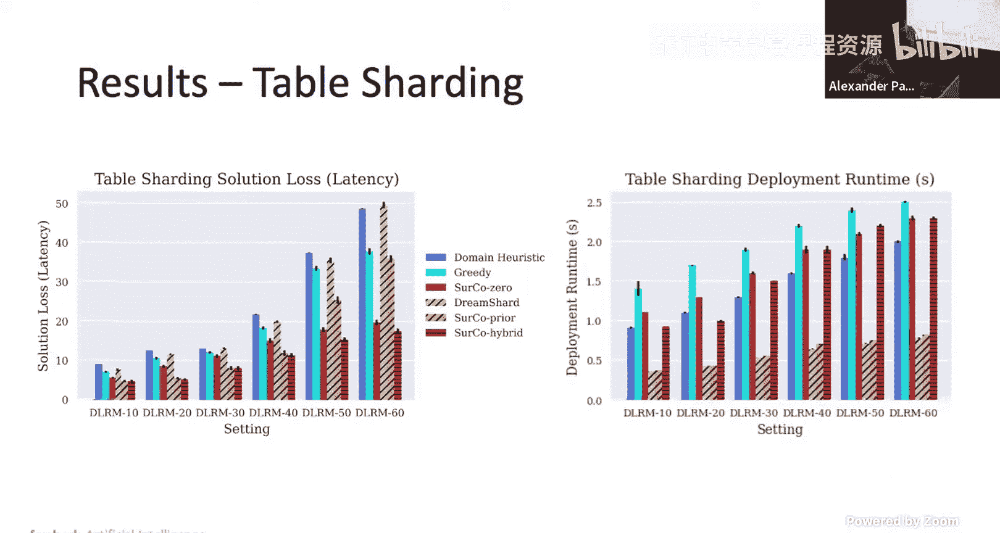

我们的方法（Circulation）是学习一个**代理成本系数C**，它是问题描述y的函数（`C = C(y)`）。然后，我们求解一个以C为系数的**线性规划问题**，得到解X*。最终目标是优化原始非线性问题的损失。通过将整个流程（`y -> C -> 求解器 -> X* -> 损失`）构建成可微分的计算图，我们可以从损失函数出发，反向传播优化生成C的神经网络参数。

实验表明，我们的方法在解决方案质量和部署运行时间之间取得了更好的权衡。特别是“先验”版本，只需预测一次系数C，速度极快且性能良好。

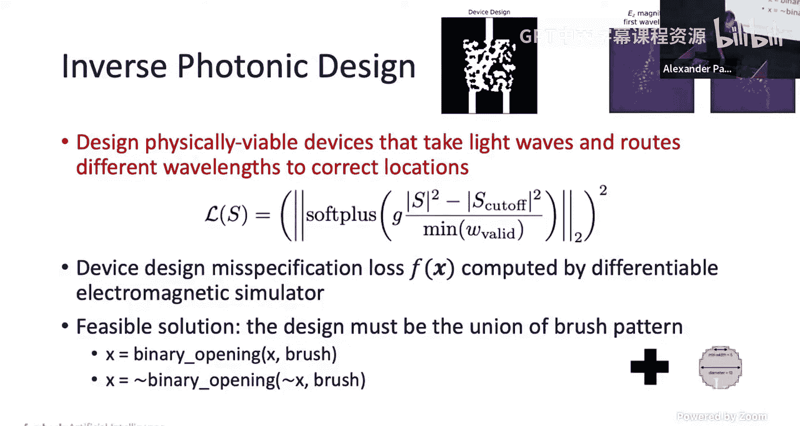

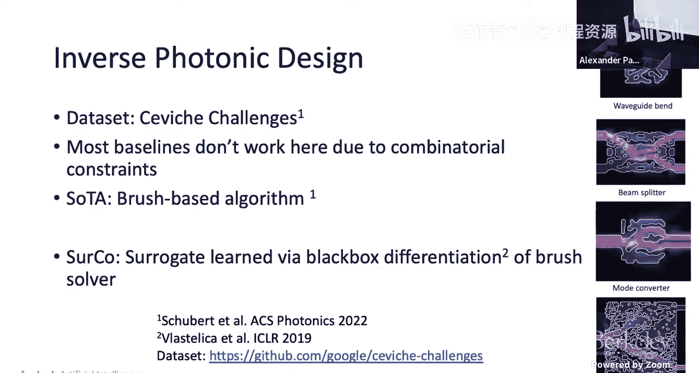

我们将同样的思想应用于**光子集成电路设计**等更复杂的优化问题，也观察到了更平滑的收敛曲线和更好的性能。

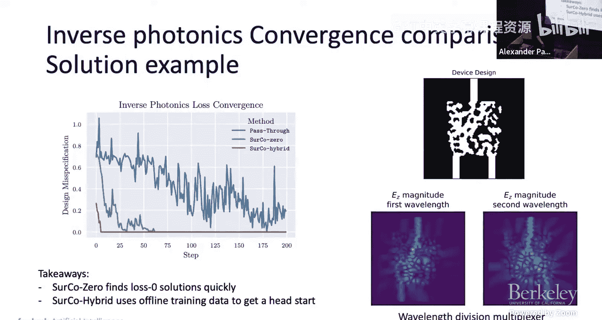

当然，这种方法也有局限性，例如当函数F不可微时如何处理，以及训练时每次迭代都需要调用求解器可能较慢。针对这些挑战已有一些前瞻性工作。

---

## 解决方案三：神经网络的符号涌现 🌀

上一节我们深入探讨了混合系统。本节中，我们来看看一个更根本的可能性：深度模型能否自动收敛到符号化的表示？

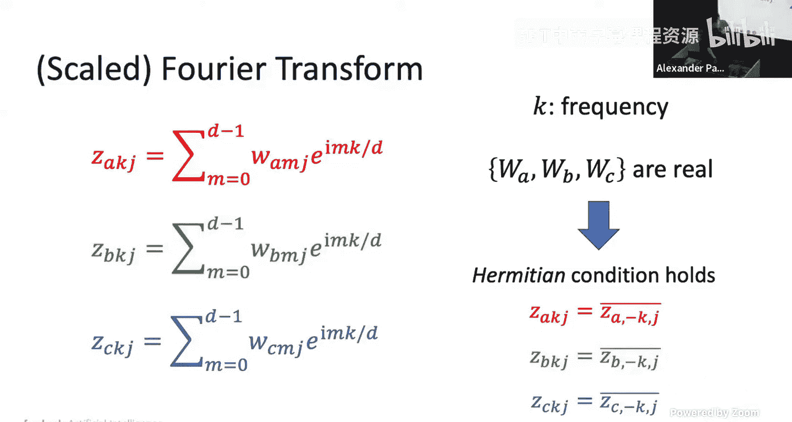

关于大语言模型的能力存在两种争论：一方认为随着参数增长，模型会涌现出各种智能；另一方则认为模型只是在进行检索和记忆，并非真正理解。为了理解模型如何进行推理规划，我们需要分析其学习到的表示。

一个简单的分析案例是**模加法**任务：输入A和B，预测`(A+B) mod D`。这是一个非常简单的任务，可能只需要一个隐式查表。然而，研究发现，训练后的网络在表示数字时，会涌现出清晰的**傅里叶基**（正弦曲线）。

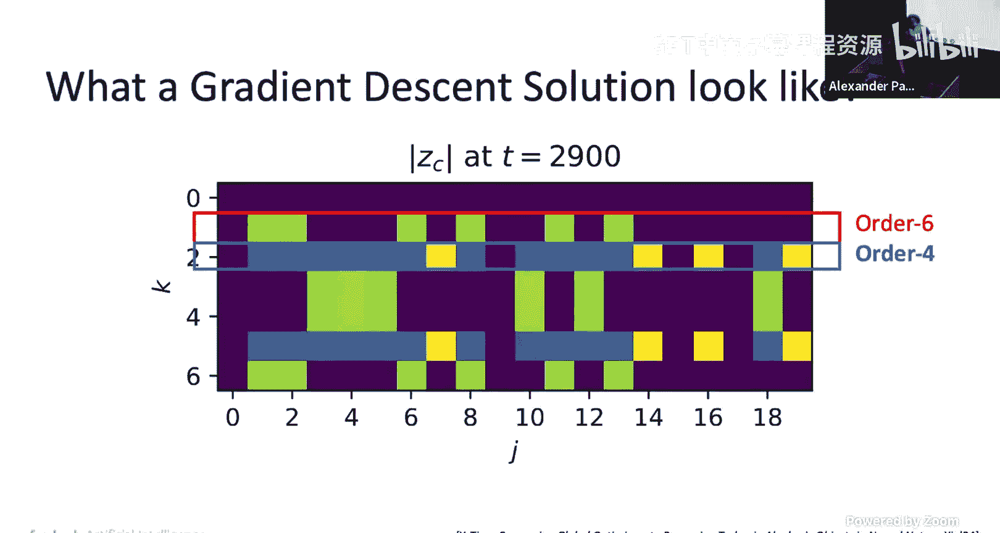

为了理解其原因，我们构建了一个极简的两层神经网络进行分析。令人惊讶的是，即使在这个简单网络中，训练后也涌现出了傅里叶基。通过将问题转换到傅里叶域进行分析，我们发现梯度下降找到的解具有非常规律的结构：对于每个频率，只有少数隐藏神经元对其有强响应，并且这些神经元的数量呈现出特定的模式（如6个或4个）。

理论分析表明，该损失函数在一定的代数结构（半环）下，其解可以通过**环同态**的方式构造出来。我们可以先找到满足部分约束的“偏解”，然后通过环的乘法操作将它们组合起来，从而构造出满足所有约束的全局最优解。令人惊讶的是，梯度下降找到的实际解，有超过95%可以分解为我们理论构造的形式（如2x3或2x2的因子乘积）。这意味着，梯度下降找到的解与通过符号代数构造的解高度一致。

这带来了深刻的启示：
1.  神经网络通过梯度下降训练后，其解可能本质上就是符号化的，只是我们尚未完全理解。
2.  除了梯度下降，可能存在基于代数操作的替代路径来构建解决方案。未来，我们或许可以打开黑箱，用更“物理”的代数方法来组合小型解决方案，形成大型解决方案，这可能是一条不同于当前依赖大规模梯度下降的新路径。

---

## 总结 📝

本节课我们一起学习了提升大语言模型规划能力的三种主要思路：
1.  **扩展定律**：依赖数据、算力和模型规模的持续增长。
2.  **混合系统**：将神经模型与符号求解器结合，包括模型调用工具、搜索增强训练、双模式自动切换以及端到端联合优化等多种技术，能有效弥补单一模型的不足。
3.  **符号涌现**：从理论分析发现，神经网络通过梯度下降学到的解可能本质上是符号化的，这为未来探索非梯度下降的、基于代数结构的模型构建方法提供了新的可能性。

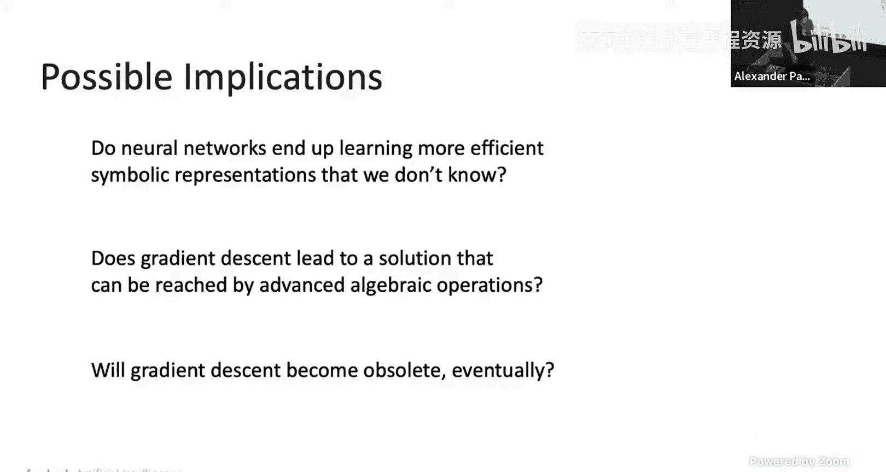

这些方向展示了在追求更强大、更可靠的智能体与规划系统的道路上，我们所拥有的丰富工具箱和广阔探索空间。