# 1：从内到外的可解释性——多层训练动态

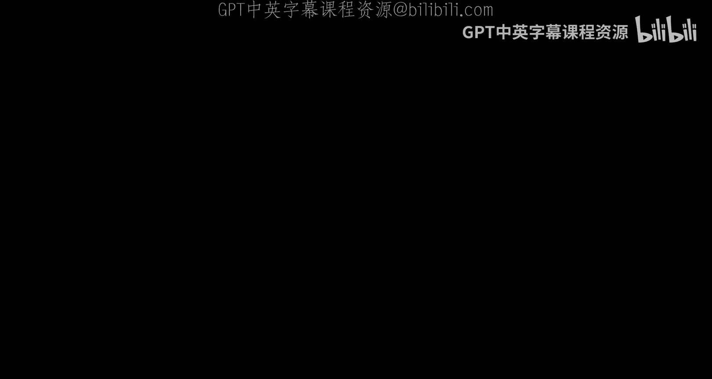

在本节课中，我们将探讨如何理解Transformer模型的核心机制，特别是注意力层的训练动态。我们将从最简单的单层设置开始，逐步深入到更复杂的多层分析，并介绍相关的理论工作及其实际应用。

## 概述

Transformer模型的核心是其注意力机制，它赋予了模型强大的能力。本节课将重点介绍两篇论文：**SCAN & SNAP** 和 **DRAMA**，它们分别从不同角度分析了注意力层的训练动态。我们将从数学公式和结构入手，逐步理解这些机制，并探讨它们如何导致注意力稀疏化等有趣现象。最后，我们还将看到这些理论见解如何应用于加速模型推理等实际问题。

## 单层Transformer分析：SCAN & SNAP 论文

上一节我们概述了课程目标，本节中我们来看看第一篇基础性论文 **SCAN & SNAP**。该论文旨在理解单层Transformer设置下的注意力机制。我们从一个非常简单的设置开始，以便更好地理解数学公式和结构，为后续分析多层Transformer打下基础。

### 模型设定与公式化

在单层设置中，我们有一个简单的输入输出流程。输入是一些上下文标记 `x1` 到 `x_{t-1}`，以及最后一个被称为查询的标记 `x_t`。我们将这些标记送入注意力层。一旦你得到了跨多个标记的注意力分数概率分布，你就使用这些注意力分数作为权重来计算输出特征。这个特征经过归一化层、解码层和Softmax层，用于预测下一个标记 `x_{t+1}`。这就是基本模型，非常简单。

以下是我们尝试用于构建端到端数学结构的公式化表示：

```
输出 = Softmax( Decoder( LayerNorm( Attention(输入) ) ) )
```

基于这个公式，如果你逐字写下来，会看到很多参数，如 `W_Q`、`W_K`、`W_V` 和 `U`。如果尝试计算梯度，会非常混乱。因此，我们实际上使用了两个非常重要的技巧。

首先，我们确保用独立变量来参数化问题。这对于本文以及后续更好地理解多层结构的工作来说非常重要。这实际上是将许多变量重新参数化为 `y` 和 `z`。其中，`y` 基本上是顶层解码器的权重，而 `z` 是注意力矩阵的成对逻辑值。这样一来，动态分析突然变得容易了，我们实际上可以得出一些结论。

这是我们可以采取的第一个主要步骤。我们实际上可以用它来写下 `y` 和 `z` 的动态方程。我稍后会详细讲解，因为这个方程看起来非常复杂。在接下来的几张幻灯片中，在我们介绍了DRAMA之后，我们将有一个更简单的公式，然后把它们结合起来，事情就会变得容易得多。

### 主要结论与假设

我们首先从结论开始，不想先深入细节，而是谈谈Transformer的属性实际上给我们带来了什么。以下是SCAN & SNAP论文的几个主要假设：

1.  **没有位置编码**：我们目前不讨论位置编码，因为首先处理起来有点困难，其次我们看到有论文表明即使没有位置编码，仍然可以获得合理的性能。
2.  **序列长度趋于无穷**：假设有很长的序列长度。
3.  **解码器Y的学习率大于注意力层Z的学习率**：这是SCAN & SNAP论文中的一个特定假设。
4.  **其他技术性假设**。

在数据分布方面，我们也有一些假设。我们假设有一系列从1到K的序列类别。对于不同的序列类别，有两种不同的标记：一种是**独特标记**，只出现在一个类别中，不出现在其他类别中；另一种是**共同标记**，出现在多个序列类别中。你可以用数学形式写下来：对于独特标记，给定序列索引，该标记出现的概率仅在一个序列类别中大于零；而对于共同标记，可能出现在多个序列类别中。

基于这些数据假设，问题是相同的注意力层如何表现。以下是Transformer动态的总体情况。

首先，我们引入一个关键统计量 `C_theta`，它是数据集中共现概率与成对注意力矩阵指数乘积的结果。你想分析 `C_theta` 的行为。

你会发现，对于独特标记，`C_theta` 仅在一个类别中非零，因为相应的共现概率仅在一个类别中非零。因此，你会看到非常独特的模式。但对于共同标记，它出现在两个序列类别中。

第一个结论是，对于共同标记，你可以分析这些动态，结果表明梯度基本上会将所有共同标记的注意力分数拖得越来越小，即 `z` 会变得越来越小，因为 `z` 对时间的梯度小于零。这里的符号表示时间导数，所以 `z` 的时间导数小于零。随着时间的推移，这个 `U` 变得越来越小，这对于共同标记（即出现在多个序列类别中的标记）是成立的。

另一方面，你可以证明对于独特标记，相应的 `Z`（注意力逻辑值）会随着时间的推移而增长。这基本上就是展示其如何增长的图表。对于所有这些独特的模式、独特的标记，它们的注意力分数会上升，这种注意力分数的增加也会使最终的 `C_theta` 上升。

### 注意力机制的可学习TF-IDF特性

从这个工具中，你已经可以看到注意力机制有点像**可学习的TF-IDF**。在Transformer时代之前从事NLP工作的人可能听说过TF-IDF这种公式，这意味着你想找到具有高频率的标记或单词，但也希望找到具有逆文档频率的单词。第一个标准谈论的是每个类别中非常重要的单词，而第二个标准基本上要求模型过滤掉在多个文档中过于常见的标记。例如，“the”、“a”等冠词或常见词，它们信息量不大，因此在做决策或文档分类时应被抑制。另一方面，如果你有特定类别的非常具体的标记，我们应该关注它们。例如，如果谈论体育，“梅西”是体育类别中一个非常重要的标记，然后你建立联系，可以用它来做更好的文档分类。

### 注意力分数的增长速率与上下文稀疏性

第三，我们实际上可以量化注意力分数的增长率。基本上，`L` 是自注意力矩阵的一个元素，它实际上是时间的函数。实际上，它会以更大的条件概率增长得更快。我们可以描述它增长得有多快，我们可以有一个定理，该定理会告诉你两个独特标记之间的比率，它们增长了多少以及增长得有多快。图表还显示，如果你有一个与查询共现概率非常高的独特标记，那么它的增长速度会比那些只是偶然与标记共现但概率不高的独特标记快得多。在进行训练时，你会看到非常高的跳跃。

在某种意义上，这被称为**上下文稀疏性**，因为随着时间的推移，你会看到这个 `C_theta`（即注意力分数）在归一化后实际上会变得稀疏，并且越来越稀疏，因为赢家通吃，富者愈富。随着时间的推移，你可能会看到一两个标记脱颖而出。这就是为什么你会看到注意力在训练过程中变得越来越稀疏。我们称之为上下文稀疏性的原因是，这取决于查询。对于不同的查询，你会看到非常不同的曲线。对于不同的查询标记，可能会有不同的标记与特定标记具有高共现性，然后你会看到非常不同的模式，这就是查询依赖性。

### 注意力扫描与注意力捕捉的两阶段效应

最后，我们实际上展示了注意力存在两个阶段效应。人们可能想知道，根据这张图，随着时间的推移，你会看到与查询共现概率高的标记增长得越来越高，最终你会看到赢家通吃的效应。但实际上，在我们的分析中并非如此。我们最终会展示存在两个不同的阶段：第一阶段称为**注意力扫描**，在这个阶段赢家通吃的效应发生；第二阶段称为**注意力捕捉**，在这个阶段一切都会稍微放缓，最终达到饱和速率。所以，一旦你看到富者愈富的效应，一段时间后注意力模式会冻结，变成一种少数通吃的局面，但不像赢家通吃那样。这基本上是SCAN & SNAP论文展示的总体情况。

以上就是主要观点，我们进行了一些不同的模拟，表明情况确实如此。这是理论分析的一些总体策略。如果有人感兴趣，这里有一个非常简单的策略来说明如何证明这一点。

首先，我们希望利用无限序列长度的能力，基本上将所有项转化为包含概率分布的统计项，这是第一步。第二步，因为我们假设解码器 `y` 的学习率远大于自注意力矩阵 `z` 的学习率，所以在分析解码器动态时，你可以基本上将自注意力矩阵视为常数。一旦我们有了这个漂亮的方程，它告诉你注意力层的梯度如何与馈送到解码器的数据相关，我们就可以将其插回自注意力层，然后分析自注意力层中发生了什么。这基本上就是你如何分析单层Transformer的两层结构。

我们做了一些非常简单的真实实验，例如在WikiText-2上。如果你有这种学习率结构，随着时间的推移，你会看到注意力中的各种稀疏模式。如果你在实践中做了很多训练Transformer的工作，你也会看到这些学习模式的变化。这基本上就是SCAN & SNAP论文，非常简单。

## 扩展到多层与非线性的分析：DRAMA 论文

上一节我们介绍了单层线性情况下的分析，本节中我们来看看如何改进SCAN & SNAP论文并摆脱这些假设。我们有一些令人烦恼的假设：没有嵌入向量，没有残差连接，解码器需要比注意力学习得更快（这在实践中从未发生），而且我们只有单日分析。那么如何摆脱它们呢？下一步是介绍名为 **DRAMA** 的工作，这是我们第二篇后续论文，试图比之前的论文更好地理解这些动态。

在那篇论文中，我们实际上发现了MLP较低层和自注意力层之间训练动态的一些非常好的特性。我们将它们结合到一个称为 **MoMP** 的层中。该层实际上捕获了两层的动态，同时比同时考虑自注意力和MLP层要简单得多。这基本上是DRAMA的粗略想法。

对于这个，我们基本上像是把Transformer的一层拆下来，然后用一堆符号来分析发生了什么。请注意，我们现在考虑这里额外的残差连接，这个残差连接在之前的分析中是缺失的，但现在我们可以把它们加回来，并展示它们实际上如何在这里发挥作用。我们还可以使用这些非线性，即解码器层中的非线性。在我们之前的SCAN & SNAP论文中，没有非线性，基本上是线性的直到Softmax。这就是区别。我们实际上能够在那里展示一些很好的特性。

我们还有这个嵌入矩阵 `U`。对于嵌入矩阵，我们基本上假设这些嵌入向量彼此正交，并且不随时间变化。这实际上受到了审稿人的质疑。这就是为什么我们有一个图表显示，在实践中，当我们绘制像Llama这样的模型在不同层的向量之间的相似性时，情况确实如此。我们也在其他模型上测试过，看起来也是正确的。

这里的图表显示，X轴基本上是迷你批次的训练动态，Y轴是余弦相似度。余弦相似度在0和1之间变化。1表示完全一致，0表示正交。那么你在这里看到的是，在训练过程中，相似度并没有增加多少。它基本上大致保持在0.03左右。因此，即使对于不同的层，它们也几乎是正交的。这里每条曲线对应不同的层，层的颜色由曲线的颜色表示。这基本上意味着正交性假设近似成立，但我们还没有分析嵌入的动态，这可能是下一个课题。

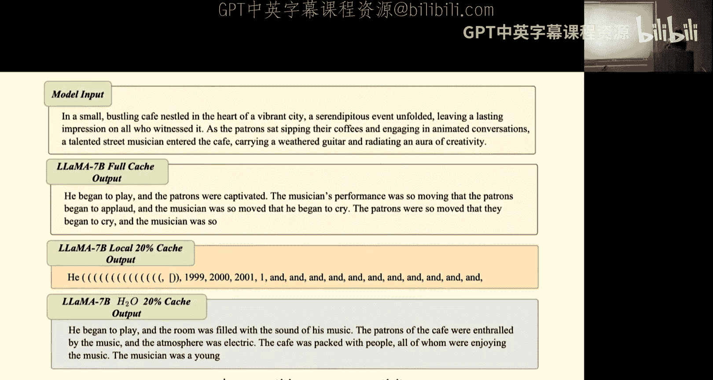

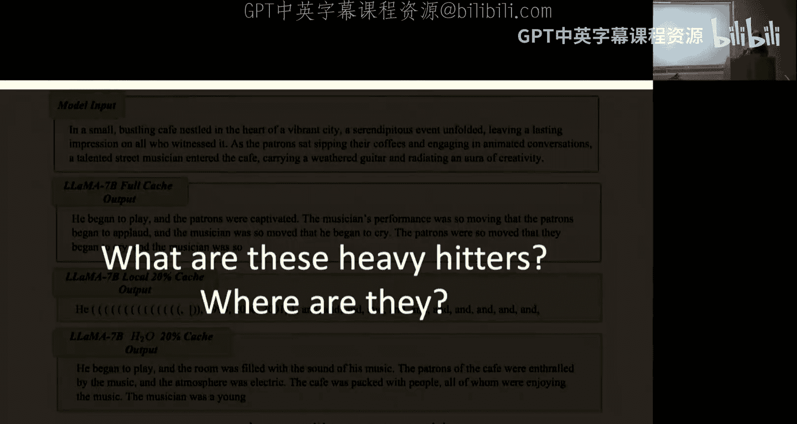

### 联合动态与简化分析

给定这些假设，我们实际上会看到MLP较低层和自注意力层之间存在联合动态。你实际上可以从较低层权重的幅度计算自注意力。这基本上意味着，一旦你有了那个方程，你就可以忘记自注意力层，只需将这个方程代入你的动态中，它会给你类似的结果。这个方程基本上讲述了自注意力加上MLP较低层的故事。然后你可以用那个方程来分析Transformer的动态。这基本上是核心思想。这实际上使事情变得简单得多，并且不需要假设解码器层的训练速度比自注意力层快得多。你不再需要那个假设了。

这里有一些幻灯片，我试图比较SCAN & SNAP和DRAMA。这些基本上是我们为了回答学生提出的问题而添加的一些额外幻灯片。这里有一个通用的公式化表示，试图将两者结合起来。这里我们基本上有一个统一的通用公式，将这两者结合在一起。这里有一些符号，以及两篇论文之间的共同假设。基本上所有这些共同的假设，首先，较低层权重 `W` 和自注意力层权重 `Z` 都是可训练参数，它们可以被训练。我们基本上在两篇工作中都不考虑 `W_Q`、`W_K`、`W_V`，而是将整个 `Z` 矩阵视为可训练参数。这与实际发生的情况不同。其次，`U`（嵌入矩阵）是固定的且列正交。这是我们为两篇论文做出的另一个假设。第三，输入标记的向量实际上是独热列向量。这样我们实际上可以计算频率。这对于第一层肯定是正确的，因为每个标记都由独热表示编码，但如果你考虑多层和中间的非线性，这可能不一定正确。

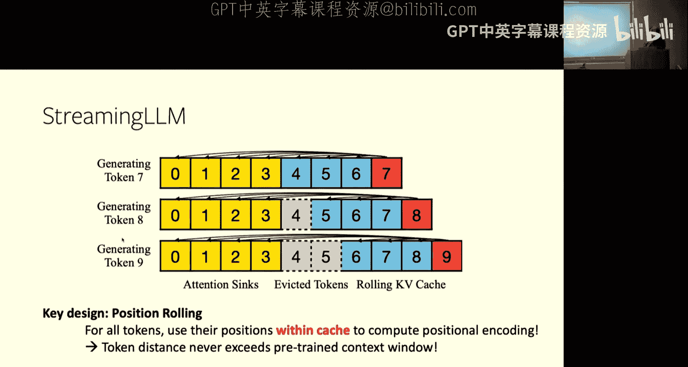

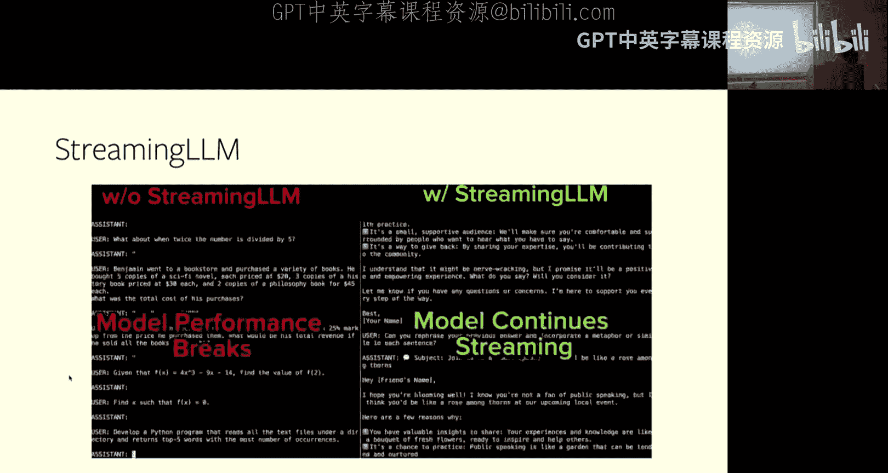

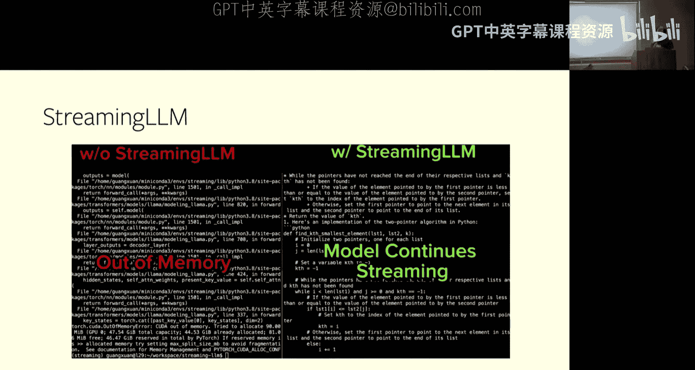

SCAN & SNAP和DRAMA之间的区别在于，你可能会有非常不同的设置。例如，在SCAN & SNAP中，你可能会有额外的归一化层，并且必须假设这个激活是线性的，并且 `ZW` 的学习速度比...快。另一方面，在DRAMA中，我们有不同的设置。可能 `Phi` 是空的，没有归一化，但在非线性叙事中，你可以使用线性或非线性。我们还可以有很多其他不同的方向。

这实际上是关于第一个定理的推导，在一张幻灯片中。我不想详细讲解，只是用它作为定理1的总结之一。如果有人感兴趣，可以仔细看看。这实际上比我们放在论文中的证明要简洁得多，我们将在最终版本中更新它。

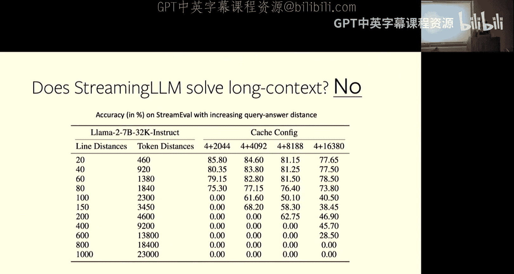

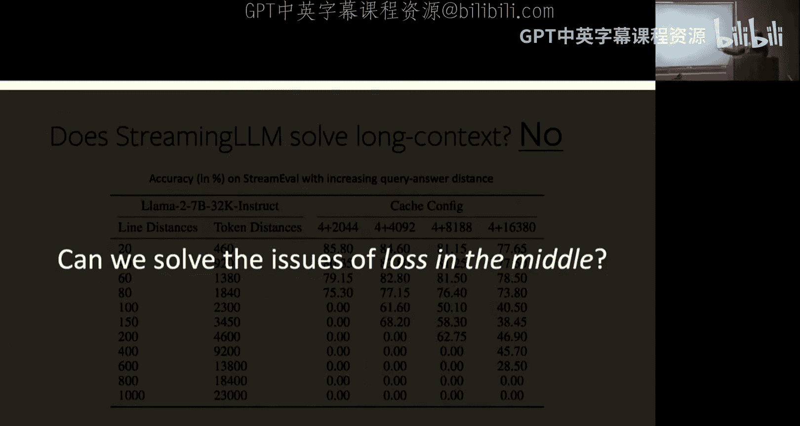

### DRAMA的动态验证与非线性下的新行为

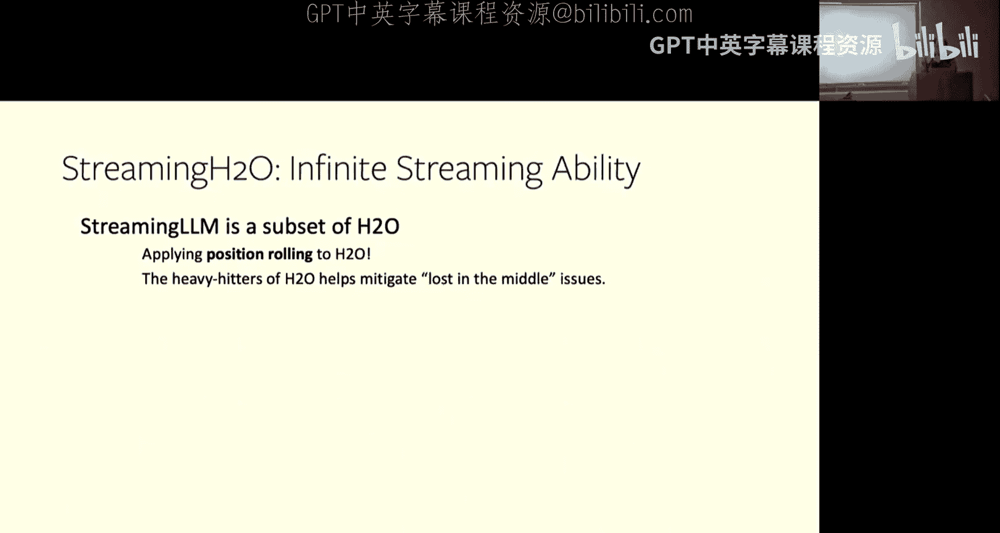

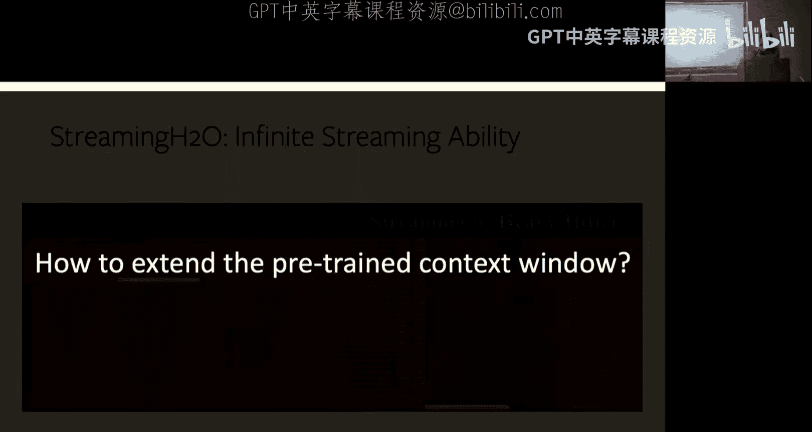

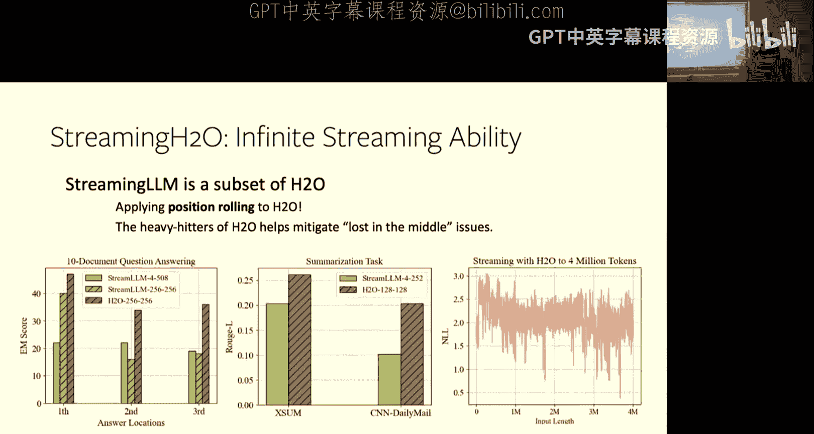

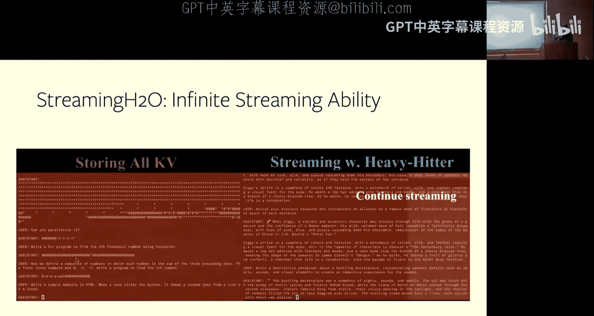

那么人们会说，好吧，如果DRAMA有这些动态，会发生什么？这里是对动态的验证，因为在自注意力层中，我们实际上做了假设，我们想确保假设是正确的。一旦我们有了联合动态，我们就可以尝试回到SCAN & SNAP的设置中，其中激活是线性的，看看它是否实际上有相同的预测。答案是肯定的，我们实际上可以有非常相似的预测。

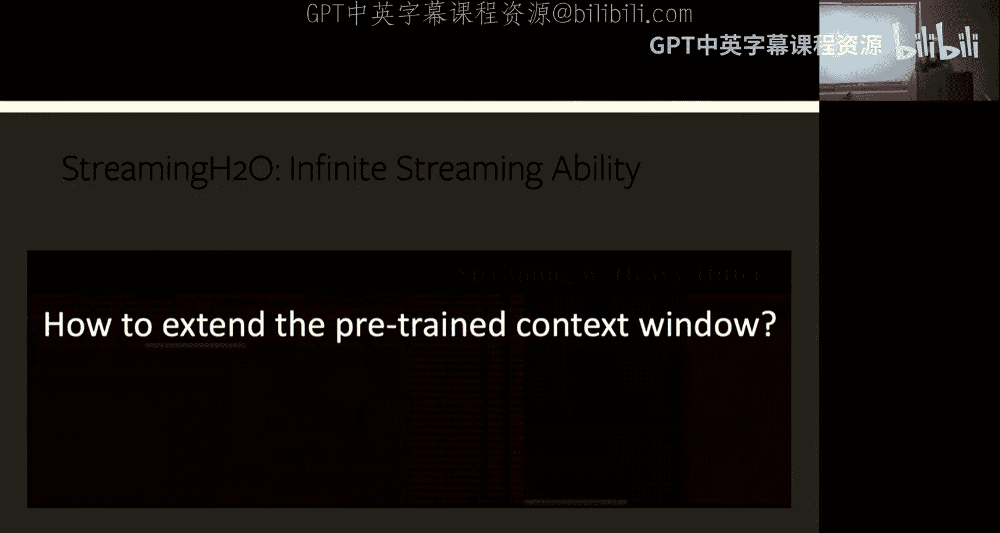

预测基本上是说注意力会变得稀疏，这与SCAN & SNAP一致。具有最高标记差异乘以共现概率的组件，这个项在幅度上最高，那么你将看到它的曲线增长最快，与其他会饱和的曲线相比。它实际上与SCAN & SNAP一致。

但更有趣的是，如果你能将DRAMA扩展到非线性激活，其中激活是非线性的，那么之前的SCAN & SNAP论文无法给你任何信息，但我们实际上可以给你一个更有趣的行为，对应于线性激活。它实际上告诉你，注意力首先会变得稀疏（这是SCAN & SNAP论文会预测的），但同时，在后续的激活中，它会变得更密集。这基本上是线性激活和非线性激活之间的不同情况。在线性激活中，我的意思是注意力只会变得稀疏，然后越来越稀疏，最后饱和。但在非线性情况下，它后来会变得更密集。

好吧，这个我不想详细讲解，因为那里有很多数学。但我们首先想检查这是否与真实实验一致。实际上，在真实实验中，我们有我们的Transformer模型，多层版本，在两个不同的真实世界文本数据集上：WikiText-2和WikiText-103。你想看到与理论预测完全相同的曲线。

特别是在第一层，如果你用非线性训练一个单层Transformer，那么你会看到它先下降，然后又回升，这与之前理论绘制的曲线非常相似。如果你放置多层并进行训练，你也会看到非常相似的曲线。特别是在顶层，你会看到东西下降然后又回升。这实际上很有趣。

然后我们想真正理解为什么会这样。为什么会有这些行为？因为这些行为似乎不那么直观，特别是对于单层，因为对于单层来说，应该是一次性学习所有特征，为什么需要后来拾取那些不显著的特征呢？首先，事物变得稀疏是因为与SCAN & SNAP中发生的相同机制：与查询共现很多的标记基本上会被拾取，然后注意力会上升，而其他注意力不变甚至下降。这就是为什么你看到注意力熵下降到非常低的数字。但过了一段时间，注意力分数会回升，注意力熵也会上升一点。它回升的原因是，它也拾取了那些不显著但随着时间的推移仍然相当显著的特征和标记。这就是为什么你看到注意力熵也上升了一点。

它没有在第一步下降，因为这里的单位是迷你批次K，所以是千次迷你批次。基本上，它必须从第一个千次迷你批次开始下降，然后之后又回升。我认为尺度可能不重要，因为你总是可以改变学习率，得到不同的尺度。

你也看到了其他模型的真实事件，并且看到了类似的行为。我们实际上看到这个的原因是因为我们后来有一个假设来讨论这些特性。基本上这个特性对于单层来说并不有用，因为在单层中，为什么不一次性学习所有特征，而不需要这种有趣的特性？但它可能在多层中有用。它之所以在多层中有用，我们必须考虑分层数据表示。

### 分层数据表示与Transformer学习

我们考虑我们希望从数据中学习分层数据表示。在表示中，发生的情况是你只看到最终标签。那是顶层，你只看到最底层的标记，但在最底层，你并不真正看到内部发生了什么。有一些潜在变量控制着数据生成过程，但你不知道。我们对数据集一无所知，但你确实想训练Transformer模型，以便Transformer模型可以自动学习数据集中的潜在表示。

这里发生的情况是，我们将假设在你的Transformer中，你看到注意力回升的原因是因为你实际上可以在那里学习潜在表示。首先，你实际上可以证明一个定理。该定理基本上告诉你，如果你有两个在层次结构中非常接近的标记，那么它们共现的概率将非常高，几乎等于1。但如果你有两个标记 `a'` 和 `m`，它们在层次结构中相距甚远，那么它们的共现概率将很低，非常接近零。这里有一个方程来描述这种行为。`H` 基本上是这两个标记 `a` 和 `m` 的共同潜在祖先的高度。对于这个 `a` 和 `m`，它们的共同潜在祖先 `H` 很小，所以如果你代入，这近似为1。如果你使用相同的定理，对于 `a'` 和 `m`，它们彼此相距很远，它们的共同潜在祖先的高度几乎是 `L`，即层次结构的总高度。那么这个概率几乎变为零。首先，你有了这个假设。你有了分层生成模型的这个有趣特性。请注意，这个特性与Transformer无关。

然后我们考虑Transformer应该如何学习它。我们考虑这个特性：我们首先学习共现很多的标记，然后我们学习稀疏共现的标记。这种机制实际上适用于浅层和深层潜在分布，因为对于深层分布，我们学习的是 `m` 和 `a` 的关联，以及 `m'` 和 `a'` 的关联，因为它们根据我们之前对层次结构的分析，彼此共现很多。因为你首先学习了这两个，然后你自动隐含地建立了一个层次结构，以后可以在顶层再次组合。所以你基本上避免了学习 `m` 和 `a'` 的关联，它们可能共现很少，但它们的共现并不重要，可以通过分层学习间接学习。

这实际上给了你直觉，为什么Transformer应该以这种方式学习特征。另一方面，如果你认为数据是由一些浅层潜在分布生成的，那里没有太多层次结构，我们只有非常直接的分布，那么Transformer学习会发生什么？Transformer将首先学习出现很多的标记 `m` 和 `a`，但最终它将学习 `m` 和 `a'` 之间的共现，因为这两者仍然有一些共现，但可能非常弱。基本上，相同的机制，即注意力机制，可以同时学习深层潜在分布和浅层潜在分布，而不知道数据的内部结构。这基本上为你提供了关于为什么Transformer可以做这么多有趣的事情而不需要实际知道内部分布的见解，它将自动适应数据的结构。

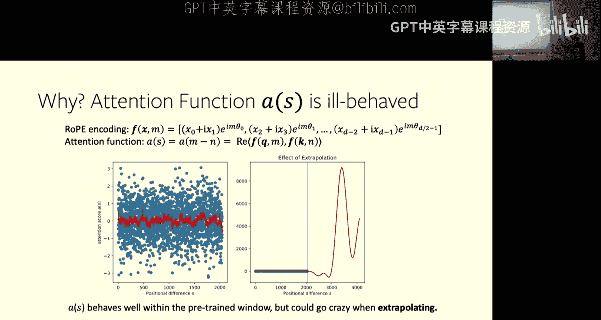

这基本上解释了我们为什么看到注意力先下降又回升。如果你回到图表，你会看到有趣的行为。如果你用相同的数据集训练相同的模型，训练这个第一层模型，单层Transformer模型，你会看到非常深、非常有趣的结构，这非常