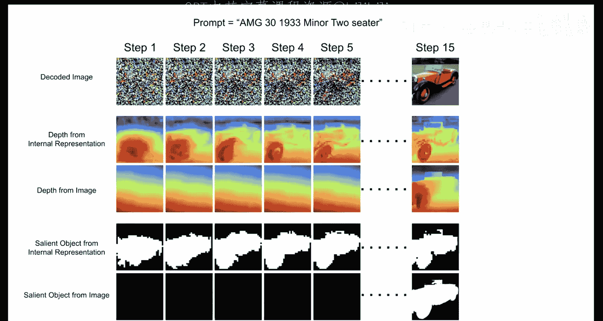
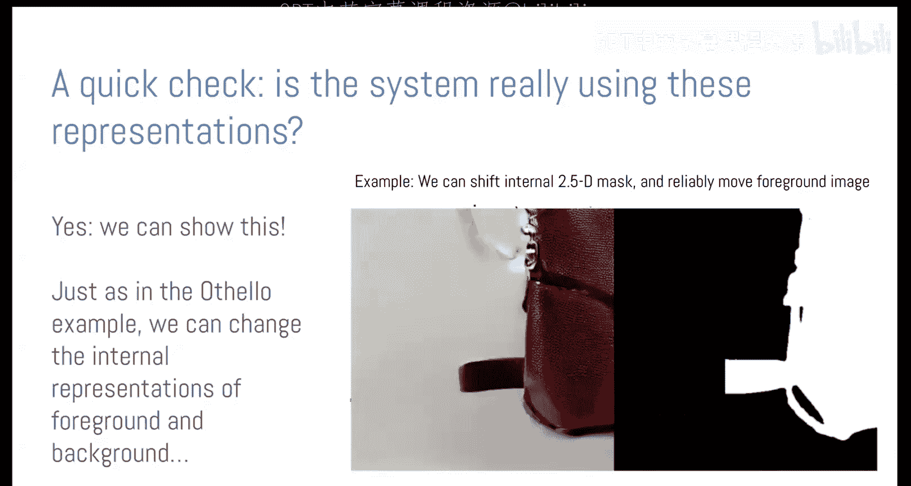

# 3：模型中的模型 - LLM如何表征世界

在本节课中，我们将探讨一个核心问题：大语言模型（LLM）是否真正“理解”它们所处理的内容？它们仅仅是基于统计模式复述训练数据，还是在内部构建了关于世界的某种“模型”？我们将通过研究具体的实验案例，来探索如何检测和分析这些潜在的内部模型。

## 概述：从“思考”到“模型”

早在1950年，艾伦·图灵提出了一个著名的问题：“机器能思考吗？”今天，我们提出了略有不同但本质相似的问题：神经网络是否在某种意义上“理解”其输入？还是仅仅通过一套随机的统计模式在运作？

这些问题非常有趣，但也常常模糊不清。本节课的目标不是直接回答机器能否思考，而是探讨一种更具体的研究方法：寻找模型内部的“世界模型”。

我们可以想象AI系统运作的两种可能方式：
1.  **构建内部模型**：系统接收输入，形成某种“心智模型”，并利用这个模型来产生输出。
2.  **复述训练数据**：系统没有任何内部模型，只是基于统计模式“复述”其训练数据。

“寻找模型 vs. 纯粹记忆”这个思路，让我们更接近一个可以科学研究的课题。那么，什么是“内部模型”呢？一个可行的定义是：如果系统的计算过程可以被分解为两个函数，那么它就拥有一个内部模型。
*   第一个函数将输入（例如，一张玫瑰的图片）转化为一个**可被我们识别和解释的世界表征**（例如，“这是一朵玫瑰”）。
*   第二个函数则基于这个内部表征来产生输出（例如，“一朵芬芳的玫瑰”）。

这个“可分解性”就是我们本节课探讨“内部世界模型”的工作定义。

## 为何要研究内部模型？

研究内部模型不仅出于纯粹的知识好奇心，还有重要的实际意义：
*   **信任与透明度**：AI模型常被视为“黑箱”。了解其内部运作有助于建立信任。
*   **可靠性与安全**：如果模型只是应用启发式规则，我们无法保证其下一步行为。识别其内部模型，是迈向稳健性和可预测性的第一步。
*   **伦理考量**：例如，生成式AI是“原创”还是“抄袭”？回答这个问题部分取决于技术层面：模型是否在以超越原始训练数据的方式进行“泛化”？了解其内部机制对此至关重要。

然而，在复杂的大语言模型中寻找同样复杂的世界模型极其困难。因此，我们的一个核心策略是：**极大地简化问题**。

## 案例一：奥赛罗棋中的世界模型

上一节我们提出了内部模型的概念及其重要性。本节中，我们来看看如何在一个简化环境中验证它。我们选择研究一个“中型语言模型”在一个“小世界”中的运作。这个世界就是奥赛罗棋（黑白棋）。

### 奥赛罗棋简介

奥赛罗棋是一个8x8棋盘的双人游戏。玩家轮流在棋盘上放置黑色或白色棋子。规则是：落子必须夹住对手的一条或多条直线（横、竖、斜）上的棋子，并将这些被夹住的棋子全部翻转为己方颜色。游戏目标是结束时己方颜色的棋子更多。

游戏过程可以简单地表示为一连串的落子位置（如“C4”，“D3”等）。**关键在于**：判断一步棋是否合法，完全取决于当前的棋盘状态，而模型接收到的输入仅仅是历史落子序列。

### 实验设置

我们训练了一个标准的Transformer模型（类似于GPT-2）来预测奥赛罗棋的下一步落子。输入是表示历史落子的令牌序列（如“C4， D3， …”），目标是预测下一个合法的落子位置。
*   **重要前提**：模型**没有任何先验知识**。它不知道这是一个棋盘游戏，没有内置规则，其架构也没有针对棋盘进行任何特殊设计。它仅仅是一个处理令牌序列的标准模型。

我们使用了两个数据集进行训练：
1.  **冠军数据集**：来自人类高手的真实对局。
2.  **随机数据集**：由程序生成的随机合法对局（棋步不一定好，但合法）。

### 实验结果与探测

**问题一：模型能学会下棋吗？**
答案是肯定的。模型在两个数据集上都学会了走出合法棋步，错误率相当低。这在预料之中，因为像GPT-3/4这样的模型已展现出一定的棋类能力。

**问题二：模型是如何做到的？**
合法性判断依赖于隐含的棋盘状态，但模型输入只有落子序列。这引出了核心问题：**模型是否在内部构建了棋盘的表征？**

为了回答这个问题，我们使用了**表征探测**技术。以下是探测的基本步骤：
1.  **获取内部激活**：在模型推理时，记录其某一神经网络层的激活值（一个高维向量）。
2.  **训练简单分类器**：针对我们关心的概念（例如，“A1这个格子是黑、白还是空”），我们训练一个**简单的**（如线性或浅层网络）分类器，该分类器以模型的内部激活作为输入，预测这个概念的状态。
3.  **评估分类器性能**：如果这个简单分类器能高准确率地预测概念状态，就表明该概念的信息以相对直接的方式编码在模型的内部激活中。

我们对奥赛罗棋模型进行了探测：针对棋盘上的每个格子，训练分类器来判断其状态（黑/白/空）。

**结果**：探测结果显示，模型内部确实存在对棋盘状态的强表征。尤其是在使用随机数据集训练的模型后期层中，分类错误率极低。这表明模型在内部“画”出了棋盘。

### 验证模型的因果性

探测只能说明信息“存在”于激活中，但不能证明模型“使用”了这些信息来做出决策。可能存在“虚假关联”。

为了验证因果性，我们进行了**干预实验**：
1.  在模型推理到某个中间步骤时，我们**人为地修改**其内部激活，使其对某个格子的表征从“黑”翻转为“白”。
2.  然后观察模型的最终预测（下一步落子）是否相应改变，变得好像那个格子真的是白色一样。

**结果**：干预实验成功了。我们可以通过修改内部表征，来可预测地改变模型的输出。这强有力地证明，模型不仅构建了棋盘表征，而且**确实在使用这个表征**来进行预测。

### 模型的微妙之处

尽管我们找到了世界模型，但实际情况仍有微妙之处：
*   **表征什么？** 最初我们发现，区分“黑/白”需要非线性分类器。但后来其他研究者发现，如果探测“我方颜色/对方颜色”（这个定义随着每一步落子而翻转），则存在**线性**表征。这表明模型可能以一种对人类不那么直观、但对其计算更高效的方式在组织信息。
*   **模型并非完美使用**：干预实验并非100%有效。特别是在游戏临近结束时，干预效果会变差。这可能是因为终局时合法走法很少，模型可以依赖更简单的启发式规则（如“找空位”），而非完整的棋盘模型。这提示我们，神经网络的运作可能是 **“模型 + 例外”** 的混合体。

### 潜在显著性图：可视化策略差异

我们还可以利用发现的内部模型进行可解释性分析。我们比较了在“冠军数据集”和“随机数据集”上训练的两个模型。

我们计算了**潜在显著性图**：对于模型预测的每一步，我们分析其内部棋盘表征中各个格子的状态对最终预测的影响程度。影响越大，该格子在可视化中越突出。

以下是分析结果：
*   **随机数据模型**：显著性高度集中在与当前落子合法性直接相关的几个格子上。它似乎只关心“这步棋是否合法”。
*   **冠军数据模型**：显著性广泛分布在棋盘许多格子上。它似乎在考虑更复杂的局面和策略，可能在进行“前瞻性”思考。

这从AI安全的角度看很有趣，因为它提供了一种可视化模型是否在执行复杂策略的原型方法。

## 案例二：Stable Diffusion中的3D几何模型

上一节我们在序列模型中找到了世界模型。本节我们将视野扩展到生成式图像模型，看看内部模型的理念是否具有普遍性。

Stable Diffusion等文生图模型能生成逼真的3D场景。我们同样想问：它们是仅仅学习了像素间的表面关联，还是在内部构建了3D场景的模型？

### 实验设置：在扩散模型中探测深度

我们再次使用线性回归探测的方法：
1.  **生成图像**：用Stable Diffusion生成大量图像。
2.  **获取“真实”深度图**：使用现有的单目深度估计模型，为生成的图像创建近似的深度图作为地面真值。
3.  **训练探测回归器**：在Stable Diffusion的**内部激活**上，训练简单的线性回归器，来预测每个像素的深度值。同时，我们也训练了区分前景/背景的探测器。

### 实验结果

我们观察了扩散去噪过程（例如50步）中，每一步的内部深度表征：
*   **早期出现**：令人惊讶的是，在去噪过程的**非常早期**（第2-4步），模型的内部表征就已经包含了详细的3D形状信息（如汽车前轮的轮廓）。而此时解码出的图像本身仍然接近噪声，人眼无法看出形状，直接用深度估计模型处理这些早期图像也得不到有效信息。
*   **前景/背景分离更早**：前景/背景的表征在第1步就已接近最终状态。

这表明，模型并非先生成图像再理解其3D结构，而是**在生成像素之前，就已经在内部构建并迭代更新着一个3D场景模型**。

### 因果干预验证

同样，我们进行了干预实验：
1.  在模型生成图像的过程中（例如，生成了一个手提包），我们获取其内部的前景/背景表征图。
2.  在推理时干预这个内部表征，将前景和背景区域进行翻转。
3.  观察输出图像的变化。

**结果**：干预成功地使生成图像中的主体物（手提包）从图像一侧移动到了另一侧。这再次证明，这个内部几何表征是**因果性**的，直接影响着最终输出。

## 总结与展望：迈向“仪表盘”式交互

本节课我们一起探索了“世界模型假说”，并通过奥赛罗棋和Stable Diffusion两个实验，看到了在神经网络内部发现并使用世界模型的证据。这些模型并非完美，但确实存在。

基于这些发现，我们可以进行更前瞻的思考：如何将这些洞察应用于人机交互？

### 历史启示：工业革命的“仪表盘”

回顾工业革命，早期蒸汽机车缺乏监测仪表，经常发生不明原因的爆炸。直到人们发明了压力表、水位计等仪表，并将实验室（“测功车”）搬到火车上实时监测内部状态，安全性和可靠性才得到大幅提升。

### 为LLM设计“仪表盘”

当前的大语言模型如同没有仪表盘的复杂机器。我们与之交互时，对其内部状态一无所知。如果我们能为LLM开发“仪表盘”，可能会带来以下好处：
*   **用户模型**：显示模型对用户的假设（如根据对话内容推断的用户性别、年龄、知识水平、政治倾向等）。这有助于用户理解答案是否带有偏见或迎合性。
*   **系统模型**：显示模型自身的状态（如：它当前处于“创意写作模式”还是“严谨问答模式”？它对自己的回答有多大把握？）。
*   **其他智能体模型**：在涉及多角色的对话中，显示模型对其他角色的理解。

### 设计挑战与机遇

设计这样的仪表盘面临巨大挑战：
*   **隐私与冒犯**：实时显示模型对用户的推断（如性别、年龄）可能非常冒犯。
*   **信息过载与有效性**：何时、以何种方式显示什么信息？是常驻显示，还是在检测到重要变化时提示？这需要精细的设计。
*   **从“监测”到“干预”**：理想的仪表盘可能允许用户直接干预错误的内部假设（例如：“不，我不是男性”），并观察模型行为的相应调整。

这开启了一个广阔且重要的设计前沿。正如火车仪表盘对于安全运行至关重要一样，为强大的AI系统设计正确的“读数”界面，对于其安全和有效使用也将至关重要。

**本节课中，我们一起学习了：**
1.  **世界模型假说**：将AI的理解问题转化为寻找内部可分解的、可解释的表征。
2.  **探测与干预**：通过训练简单分类器探测内部激活，并通过干预实验验证表征的因果作用，是研究内部模型的关键方法。
3.  **案例验证**：在简化的奥赛罗棋游戏和Stable Diffusion图像生成中，都发现了模型内部构建并使用世界模型（棋盘状态、3D几何）的证据。
4.  **应用展望**：将这些技术应用于人机交互，有望开发出能提升透明度、校准信任并允许用户干预的AI“仪表盘”，但这面临着复杂的设计与伦理挑战。