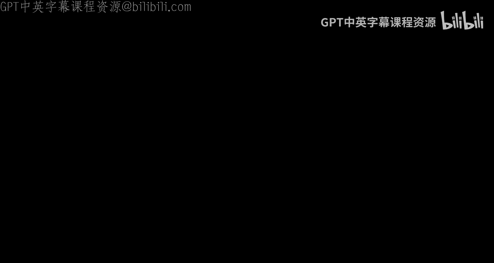
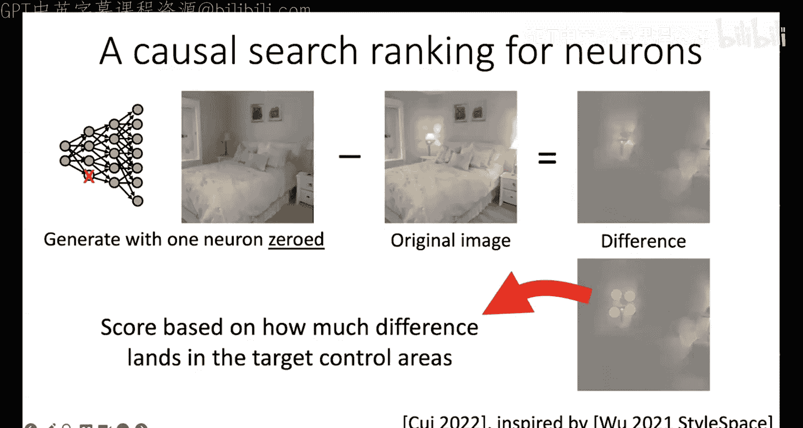
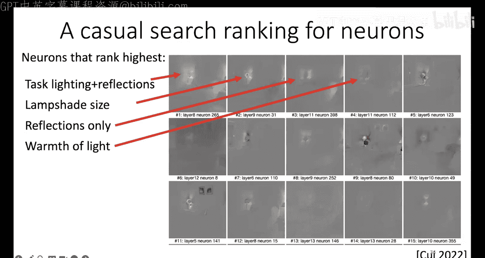
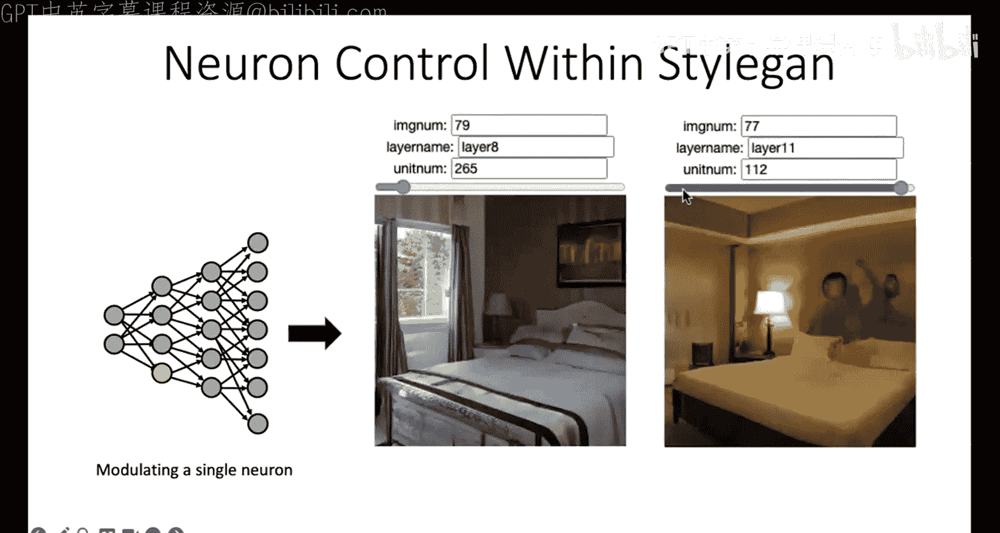
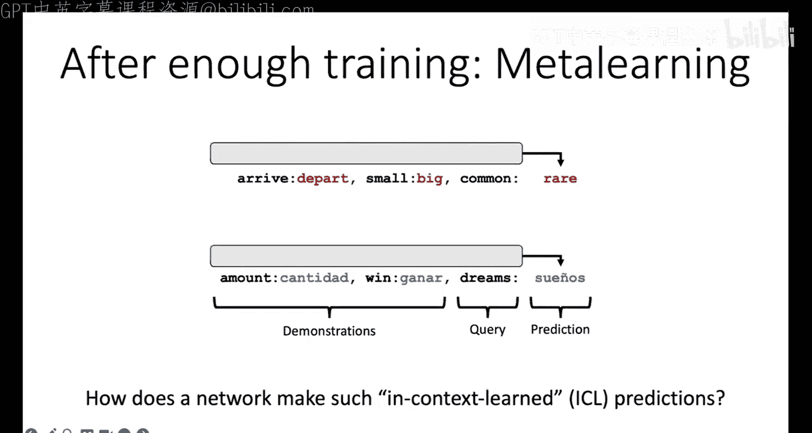
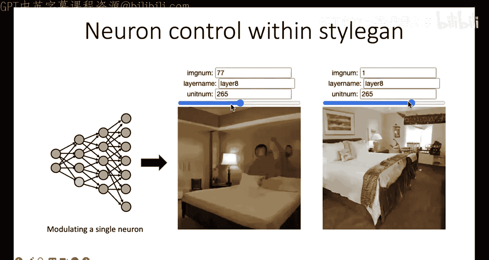
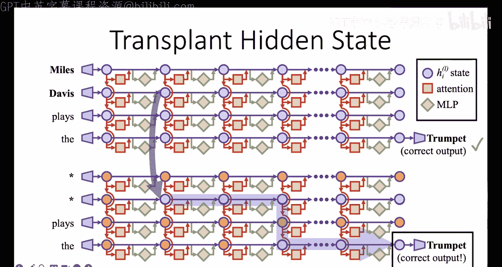

# 5：可解释性与模型编辑 🧠

在本节课中，我们将学习大语言模型的可解释性，并探讨如何通过直接编辑模型来理解和控制其内部机制。我们将从基础概念入手，逐步深入到具体的因果追踪和模型编辑技术。

---

## 概述

在之前的讲座中，我们介绍了大语言模型的基础知识，并讨论了安全性的重要性。今天，我们将开启课程的新篇章，聚焦于模型的可解释性。在接下来的几讲中，我们将从不同视角探讨可解释性。今天的第一讲，我们很荣幸邀请到东北大学的David Bau教授，为我们带来关于直接模型编辑与大模型可解释性的客座讲座。

David是东北大学的教授，在可解释性领域以及更广泛的人机交互和机器学习领域做出了大量杰出工作。

---

## 什么是可解释性？

可解释性领域探讨一个核心问题：**为什么**。许多神经网络工作关注如何让网络表现良好，而我们则想问：为什么神经网络表现得好或不好？它为何做出某个决策？

在基础的神经网络课程中，我们已经学习了一些工具。例如，评估分类器准确性的标准方法是测试其在未见过的数据上的表现。如果模型能准确分类新的棒球场图像，我们就认为它真正理解了“棒球场”的概念，而不仅仅是记住了训练数据。

然而，这种方法存在不足。我们可能想知道模型是如何识别棒球场的，它到底在图像中关注了什么。为此，研究者们开发了多种可视化方法，例如显著图。显著图通过遮盖图像的不同部分，观察分类器对哪些部分最敏感，从而高亮显示模型关注的区域。例如，在识别棒球场时，模型可能主要关注棒球运动员。

但这仍然不够。我们想知道模型**为什么**关注这些区域，其背后的机制是什么。为了更深入地理解，我们需要像调试程序一样，逐块地检查网络。

---

## 通过调试理解机制

卷积神经网络包含成千上万个神经元。我们可以通过“关闭”某些神经元（将其激活值设为零）来观察其对任务的影响，这类似于在代码中注释掉一行。大多数神经元被关闭时对输出没有影响，但少数关键神经元会显著改变网络的分类结果。

通过这种方法，我们可以将问题从“整个网络在看什么”缩小到“这些重要的神经元在看什么”。接下来，我们可以可视化这些特定神经元最活跃的区域。例如，某个神经元可能对人物的肘部弯曲或衣物特别敏感，而另一个神经元可能关注人物的头部。

仅仅观察一张图像无法确定神经元的功能。为了更全面地回答这个问题，我们需要在一个大型数据集上观察该神经元的激活情况。例如，我们可以查看该神经元在成千上万张图像中激活值最高的前1%的图像。

通过这种方式，我们可能发现一些意想不到的模式。例如，一个被训练来识别场景（如棒球场）的网络，其内部的某个神经元可能自发地学会了检测“帽子”。这是因为在棒球运动中，戴帽子是一个显著特征。这表明神经网络能够在没有明确监督的情况下，自行提炼出数据中不明显的概念。

这揭示了深度网络令人惊讶的能力。从早期的感知机到2012年AlexNet的突破，再到如今大语言模型展现出的元学习等新兴能力，每一次进步都伴随着惊喜。这些模型仅通过扩大规模和使用相似的训练技术，就实现了人们曾认为需要全新架构才能完成的任务。

---

## 上下文学习与模型解释

大语言模型展现出的“上下文学习”能力令人惊讶。例如，给定几个输入输出对（如“3 -> 158”, “14 -> 32”），模型能够推断出模式并预测“9 -> ?”。这本质上是一种少样本学习，但模型是在推理过程中内部模拟了学习过程，而无需外部参数更新。

我们可以要求模型解释其推理过程。例如，GPT-3能够用英语解释它如何得出“9”这个答案。然而，这种解释有时并不完全准确或完整。例如，模型可能无法解释它为何将数字“9”拼写为单词“nine”。这引出了一个重要问题：模型生成的英语解释是否足以满足可解释性的要求？

我认为这还不够。接下来，我将通过扩散模型的例子来说明文本提示的局限性，并引出直接模型编辑的必要性。

---

## 文本提示的局限性与直接编辑

以扩散模型为例，当我们要求模型生成“关着的灯”的图像时，它往往失败，总是生成亮着的灯。这是因为训练数据存在偏差：人们在为图像添加描述时，通常会提及“亮着的灯”，但很少会特意说明“灯是关着的”。这种数据偏差导致模型难以通过文本指令学习“关灯”的概念。

然而，模型内部**确实**知道如何绘制未点亮的灯。问题在于英语无法有效触及这个概念。因此，可解释性和直接模型编辑的目标，就是让人们能够更直接地接触和操控模型内部的概念。

我们可以借鉴在生成对抗网络中的方法。通过分析单个神经元对生成场景的影响，我们可以定位到控制特定视觉效果的神经元。例如，我们可以找到一个神经元，其激活值直接影响图像中灯光是否亮起。通过调整这个神经元，我们就能直接控制灯光的开关，这比使用文本提示更有效。

这种方法遵循几个原则：寻找**因果效应**而非仅仅相关性；在理解机制后，通过实际**改变模型**并测试其**泛化能力**来验证我们的理解。

---

## 在Transformer中应用因果追踪

现在，让我们将这种方法应用于Transformer架构的大语言模型。我们以“上下文学习”为例，探究其内部机制。

我们设计一个实验：运行网络两次。第一次使用正常的、可学习的示例（“clean”状态）。第二次使用打乱的、无意义的示例（“corrupted”状态）。在第二次运行时，我们逐步将“clean”状态中特定组件（如某个注意力头）的激活值“移植”到“corrupted”状态中，并观察输出概率的变化。

大多数移植操作没有效果。但当我们移植到某些特定的注意力头时，“corrupted”网络输出正确答案的概率会显著提升。这表明这些注意力头中包含了执行该任务的关键信息。

令人惊讶的是，对于多种不同的上下文学习任务（如反义词、翻译等），起关键作用的往往是**同一组注意力头**。这些注意力头有一个鲜明的模式：它们总是关注类比或示例中的第二个词。

我们可以从这些关键注意力头中提取出一个“任务向量”。将这个向量插入到另一个普通的句子中，可以迫使模型执行相应的任务。例如，将反义词任务的向量插入到句子“The word fast means”之前，模型会输出“The word fast means slow”。这证明我们找到了一个可以操控的、代表特定任务的内部概念。

我们还可以进行“任务向量算术”。例如，将“复制列表中最后一项”的向量与“给出第一项的首都”的向量相加，再减去“复制列表中第一项”的向量，得到的新向量能够使模型执行“给出最后一项的首都”这个从未演示过的任务。这进一步验证了我们对模型内部表征的理解。

---

## 定位并编辑事实性知识

除了学习算法，我们还可以探究模型如何存储事实性知识（例如“迈尔斯·戴维斯演奏小号”）。我们使用类似的因果追踪方法：破坏输入使模型无法回忆事实，然后寻找哪些隐藏状态的恢复能够导致模型输出正确答案。

实验发现，除了靠近输出层的状态（这很自然），在网络的**早期层**也存在具有强因果效应的状态。假设这些早期位置是事实检索发生的地方，而后期层负责将检索到的信息转化为具体词语。

进一步分析表明，早期层的因果效应主要来自MLP模块。我们假设MLP层充当了一种“关联记忆”，将输入（如“埃菲尔铁塔”）映射到输出（如“巴黎”）。基于这个假设，我们可以直接编辑MLP层的权重矩阵，以最小的改动改变一个关联。

例如，我们可以将“太空针塔 -> 西雅图”的关联改为“太空针塔 -> 罗马”。编辑后，模型在各种不同表述的问题中都会一致地回答“罗马”。我们通过测试**泛化性**（对不同问法的回答）和**特异性**（不意外改变其他事实）来评估编辑效果。结果显示，这种直接编辑方法在泛化性和特异性上优于传统的微调方法。

这种方法也可用于编辑扩散模型，以消除社会偏见或移除不良内容。虽然大量编辑会导致模型性能轻微下降，但它提供了快速、精确的控制手段，无需收集新的训练数据。

---

## 总结与展望

本节课我们一起学习了模型可解释性的核心思想与方法。关键要点如下：
1.  **通过因果效应理解机制**：相比相关性分析，寻找并验证因果效应能更可靠地揭示模型内部工作机制。
2.  **直接模型编辑**：在理解机制的基础上，我们可以直接编辑模型参数以实现特定改变，这比通过数据集进行编程更高效、更精确。
3.  **验证与泛化**：任何对机制的理解或编辑操作，都需要通过在不同上下文中的泛化测试来验证。

可解释性与模型性能之间并非必然存在权衡。更好的理解应能带来更好的控制和性能。就像我们不会接受一段无法理解但性能“更好”的代码一样，我们也应该致力于让神经网络模型变得可理解、可操控。

当前的研究只是开始，模型内部可能还存在许多未知的组织原则。但随着模型规模增大，一些机制似乎变得更加清晰和易于理解。这让我们对未来能够真正理解、调试并可靠地控制这些强大的模型抱有希望。

---
*注：本教程根据David Bau教授的讲座内容整理，旨在用简单直白的语言介绍可解释性与模型编辑的核心概念与方法。*