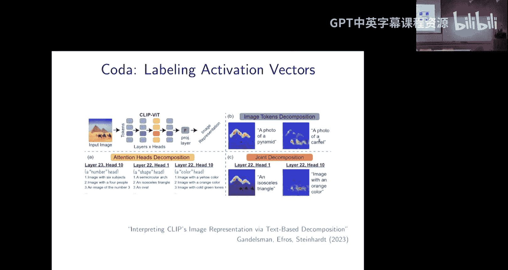
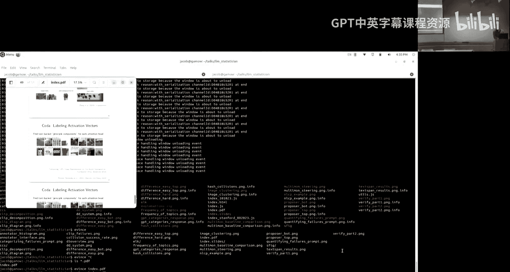
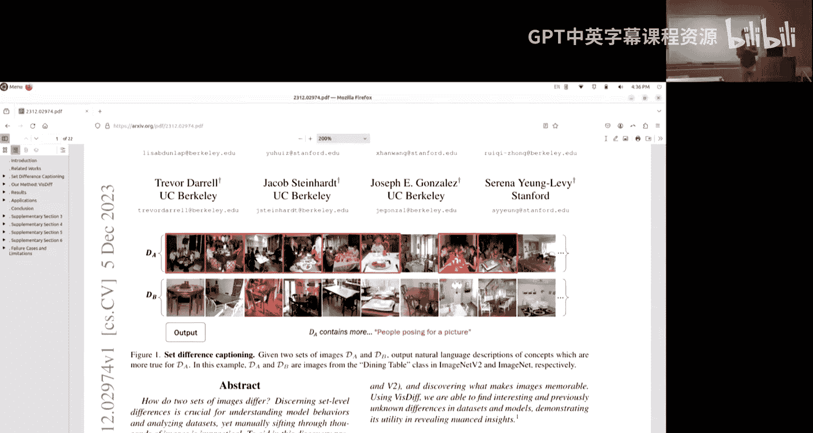

# 7：使用AI来理解AI

在本节课中，我们将学习如何利用大型语言模型（LLM）和视觉语言模型（VLM）来分析和理解其他AI系统的行为。随着AI系统变得越来越复杂和强大，理解它们的行为、发现潜在问题并确保其安全部署变得至关重要。我们将探讨一个核心思想：将“理解”问题转化为统计或数据科学问题，并利用AI自身的能力来自动化这一过程。

## 概述：理解AI的动机与框架

AI系统正在快速发展和部署，从GPT-4到Claude，再到Sora和Claude 3，它们的能力不断增强，但也变得更加复杂。这些系统常常会展现出意想不到的新行为或能力，其中一些可能带来内在或外在的安全问题。例如，内在问题可能包括系统产生威胁性言论；外在问题则可能包括被用于网络钓鱼或设计化学武器等恶意用途。

为了负责任地使用、控制和部署这些系统，我们需要理解它们的行为模式。然而，每天都有新问题出现，我们如何跟上这种节奏？本次讲座的核心思想是：**利用大语言模型来理解大语言模型**。LLM擅长处理大量数据（得益于其大上下文窗口）并向我们解释事物，因此它们或许能够观察自身或其他LLM的行为，并帮助我们理解正在发生的事情。随着模型变得更好，我们的理解能力也会随之提升。如今，我们不仅处于LLM时代，也进入了VLM时代，因此我们将讨论更广泛地使用AI系统来理解AI系统。

## 什么是“理解”？将其转化为统计问题

首先，我们需要明确“理解”的含义。我的观点是，许多形式的“理解”本质上都可以归结为统计或数据科学问题。

以下是几种我们可能关心的“理解”形式：
*   **识别行为模式**：给定模型行为的数据，识别我们可能关心的模式。例如，在某个输入子集上，代码模型更可能出现安全漏洞。
*   **解释训练数据差异**：解释训练数据中重要的变异来源。例如，训练数据中可能存在某些我们关心并希望纠正的偏见。
*   **主动发现问题**：通过主动学习，生成能引发问题行为的输入，以便我们测试并修复。

所有这些任务本质上都是统计问题。识别模式类似于主成分分析（PCA）或聚类；解释差异类似于特征学习；主动发现问题则属于主动学习范畴。因此，如果能让LLM在抽象意义上擅长“做统计”，我们就能解决这些问题。

## 统计流程的四步管道

那么，“做统计”意味着什么？我认为，大多数统计工作都遵循一个四步管道：

1.  **观察初始数据**：我们查看一些初始数据。
2.  **形成假设**：基于数据，我们形成一个关于事物一般行为方式的假设。
3.  **形式化假设**：我们需要将这个假设形式化为一个可量化的假设。
4.  **用新数据测试**：我们在新数据上测试这个假设。这些新数据可以是来自同一分布的保留数据，也可以是为了探究因果关系而收集的分布外数据或主动收集的数据。

我将通过几个案例研究来展示如何将问题转化为这种形式，并利用LLM或VLM自动化每一步，从而更好地理解模型、发现问题，有时甚至修复它们。这里的关键区别在于我们使用LLM：在传统统计学中，假设可能是一个数学函数；而在这里，假设H将是一个自然语言字符串。因此，很多问题将围绕如何形式化一个仅以自然语言表述的假设，以便我们能定量地测试它。

## 案例研究一：自动发现CLIP模型的失败案例

第一个具体的案例是关于在CLIP模型中自动发现失败案例。CLIP是一个将图像和文本共同嵌入的模型，它是Stable Diffusion、Midjourney、DALL-E等文生图模型的基础。这些模型能生成令人惊叹的图片，但也存在非常基本的错误。有趣的是，接下来展示的所有失败案例都是由一个大语言模型自动发现的。

以下是实现这一目标的关键思路：
1.  **寻找嵌入空间中的“哈希碰撞”**：CLIP是一个编码器模型，它会将输入嵌入到一个向量空间。我们首先寻找在这个嵌入空间中“碰撞”的输入对，即语义不同但嵌入向量非常相似的文本对。这是发现潜在错误的有效方法。
2.  **使用GPT-4对错误进行分类**：利用GPT-4将这些个体错误分类为连贯的、可泛化的模式。
3.  **基于模式生成新的失败案例**：利用这些模式生成新的失败案例，甚至可以迁移到与初始“哈希碰撞”集完全不同的新领域（如自动驾驶汽车领域）。

### 第一步：观察数据——寻找“哈希碰撞”

CLIP可以接受图像I或文本T作为输入，并输出一个向量（例如768维）。它被训练来使图像与其描述文本的嵌入具有较高的余弦相似度，而与其他文本的嵌入具有较低的相似度。

我们的想法是：寻找两个文本字符串T和T‘，它们在CLIP下具有非常相似的嵌入，但描述了不同的视觉概念。这样至少其中一个肯定是错误的，因为它会扰乱上述相似度矩阵。具体做法是：收集一个文本语料库T1到TN，用CLIP嵌入它们，同时用另一个纯文本模型（如DistilRoBERTa）嵌入它们以进行语义检查。然后，我们寻找那些CLIP相似度高但RoBERTa相似度低的文本对。

例如：“两个女孩走在街上”和“两个女人走在街上”，或者“桌上的高脚杯”和“桌上的矮脚杯”。CLIP认为这些是相同的，但RoBERTa认为它们非常不同。利用“生日悖论”，这种方法能以二次方的效率发现模型的问题。

### 第二步：形成假设——使用GPT-4归纳模式

接下来，我们使用LLM（这里是GPT-4）。我们将找到的所有个体失败案例（文本输入）输入GPT-4，并给出提示词。提示词大致是：“我将提供一系列数据供你记忆，随后会问你一些问题来测试你的表现。这里有一些提示词对需要你记忆……我正在尝试寻找一个嵌入模型的失败案例。上面是一些句子对，尽管它们传达了不同的概念，但该编码器对它们的编码非常相似。利用这些具体例子，你注意到该编码器正在犯的任何一般类型的失败吗？或者任何它未能编码的常见特征？”

然后，GPT-4会输出一个列表，例如：
*   **否定**：嵌入模型可能无法正确捕捉句子中的否定上下文，导致带有和不带有否定的句子之间出现相似性。
*   **时间差异**：模型可能无法区分动作的时间状态（如“正在走”与“已经走过”）。
*   **数量词**：模型可能无法准确编码数量信息（如“一些”与“许多”）。

GPT-4不仅给出类别名称，还提供了描述，这些描述有时包含有用的细节信息。

### 第三步：形式化假设——如何定量检验？

我们如何形式化“否定假设”并定量检验它？一个关键方法是：**一个好的假设应该能够用来生成新的失败案例**。这很好，因为它将假设的实用性具体化了。

为此，我们提示LLM基于假设H生成新的失败案例。提示词大致是：“根据你总结的失败模式，写出41对额外的提示词，这些提示词作为标题时可能对应不同的图像，但嵌入模型可能会对它们进行相似的编码。使用以下格式……你将根据表现进行评估。句子结构和长度可以富有创意，基于失败模式进行推断。既要富有创意，也要谨慎。”

然后，我们检查这些新生成的提示词对是否确实具有较高的CLIP相似度和较低的RoBERTa相似度，并进一步检查当将它们输入像Stable Diffusion这样的下游系统时是否真的会产生问题。

### 第四步：测试假设——结果与验证

我们测试了这些假设。首先，在“哈希碰撞”层面，不同模型（GPT-4, Claude, GPT-3.5）生成的假设不同，且初始语料库（COCO, SNLI）也会影响生成的假设。但总体而言，如果一个模型产生了某个假设，它往往能以较高的成功率（约80%）生成新的“哈希碰撞”。更强大的模型有时表现更好，部分原因在于它们提供的假设描述更丰富。

更重要的是，我们需要测试这些“碰撞”是否会导致下游系统的实际失败。我们建立了一个测试界面：将生成的提示词对随机选择一个输入文生图模型，然后让人工评估者（不知道来源）判断生成的图像对应哪个提示词，或者两者都不对应。结果发现，当CLIP相似度阈值设为0.9左右时，导致下游系统实际失败的比例约为80%。

作为对比，我们有一个基线系统，它不基于具体失败数据，而是让GPT-4凭空构思假设。这些假设仅能产生约20%的失败率。这表明，基于数据驱动的类别归纳具有显著效果。

最后，我们可以将模式迁移到新领域。例如，要求GPT-4基于这些高级类别，生成关于自动驾驶汽车领域的新失败案例，它可以很好地完成，例如生成“汽车在车道右侧”与“汽车在车道左侧”这样的对立描述。

### 本节总结

在这个案例中，我们完整地实践了统计流程的四步管道：
1.  **观察数据**：从文本数据集中搜集“哈希碰撞”。
2.  **形成假设**：提示GPT-4归纳模式。
3.  **形式化假设**：通过生成新失败案例的成功率来评估假设。
4.  **测试新数据**：在新领域（自动驾驶）中主动生成新样本进行验证。

这个案例的有趣之处在于，它不仅仅是简单的提示或嵌入，而是让多个模型协同工作，完成单个提示难以实现的复杂任务。

## 案例研究二：使用自然语言参数进行统计建模

第二个案例是关于使用自然语言参数进行统计建模。这项研究由我的学生Raie Zhang主导。我们首先考虑一个抽象任务：给定两个文本数据集D1和D2，找出它们之间的差异，并且这个差异必须由一个自然语言字符串H来指定。这本质上是一个可解释的二分类问题。

为什么需要这个？如果你只关心分类准确率，应该使用神经网络。但神经网络是黑盒，我们无法理解其决策依据。而自然语言字符串能让我们真正理解差异所在。

### 任务与用例

例如，如果D1是法语句子数据集，D2是英语句子数据集，那么H可以是“D1包含更多法语句子”。实际任务可能更复杂、更微妙，可能涉及风格、主题或更细微的分布差异。

这个任务的用例包括：
*   **分析分布偏移**：理解训练分布和测试分布之间的差异。
*   **发现数据集中虚假相关性**：例如，垃圾邮件分类数据集中，正类（垃圾邮件）可能包含更多超链接。
*   **自动化错误分析**：比较不同模型的错误类型。
*   **社会科学应用**：分析文本语料库中公众意见的变化。

### 使用LLM实现四步流程

我们再次使用四步流程，利用LLM来实现：

1.  **观察数据**：数据直接就是D1和D2。
2.  **形成假设**：我们提示LLM（最初用GPT-3）生成假设。提示词如：“这里有一组A（来自D1）和一组B（来自D2）。与B组相比，A组的每个句子具有什么属性？”模型会生成一系列假设，例如“更积极”、“包含‘章节’一词”、“更长”等。
3.  **形式化与测试假设**：由于上下文窗口限制，初始假设可能只基于少量样本，未必能泛化。但一旦有了假设H，我们就可以摆脱上下文窗口限制，遍历整个数据集来测试它。我们将假设H形式化为一个二值谓词，例如H(x1, x2)表示“句子x1比句子x2更正式”。我们使用另一个LLM（如成本更低的GPT-3.5-turbo）来评估这个谓词的真值。一个好的假设应该能很好地区分D1和D2的样本。
4.  **系统架构**：整体系统包括一个**假设提出器**（基于数据生成候选假设）和一个**假设验证器**（评估并重新排序假设）。由于提出器是语言模型，我们还可以根据用例引导它，例如指定我们只关心风格差异而不关心语言差异，从而获得更好的可控性。

### 应用实例

该系统成功发现了多个数据集中已知的虚假相关性：
*   在一个主观性分析数据集中，它发现“主观类句子更多是电影评论的引用”。
*   在自然语言推理数据集MNLI中，它复现了已知的虚假相关性：“包含否定词（如not）与‘不蕴含’标签高度相关”。
*   在垃圾邮件分类数据集中，它发现“垃圾邮件类包含更多超链接”，并且验证了如果向普通邮件添加超链接，基于该数据训练的BERT模型会将其误判为垃圾邮件。

此外，该系统还能用于自动化错误分析，例如发现“GPT-3 Curie的错误更多发生在语言积极或振奋的例子上”。

我们创建了一个包含675个不同领域用例的数据集，供对自动化可解释性和“用LLM自动化科学”感兴趣的研究者使用。

### 扩展：自然语言特征作为模型基础

我们可以将这种思路扩展到二分类之外。核心见解是：**任何自然语言谓词H都可以诱导出一个特征函数**。我们可以定义其指示函数，将字符串映射到0/1，表示该谓词的真值。

这样，我们就不局限于单个特征。例如，我们可以定义一个指数族模型：`P(x | w, H) ∝ exp( w1*h1(x) + ... + wK*hK(x) )`。这基本上是一个单层神经网络，但第一层的特征是可解释的自然语言字符串，而不是任意的向量。更一般地，我们可以以此为基础构建更复杂的模型，如主题模型、低秩分解、聚类等。

例如，在一个狗和大象的图像分类任务中，如果我们想理解背景差异，系统可以自动发现三个聚类（丛林、白色背景、沙滩），并统计每个聚类中狗和大象的比例差异。

实现这种模型需要一种交替最大化算法：在连续参数（如权重w）和离散参数（自然语言字符串）之间交替优化，利用GPT-4为离散参数提出新的候选。

## 案例研究三：理解CLIP的内部表示

第三个案例是关于理解AI模型的内部表示，而不仅仅是其行为。这项研究与Yossi Gandelsman（Alyosha Efros的学生）合作完成。我们回到CLIP模型，试图理解其不同组成部分（特别是注意力头）的功能。

我们的目标是：为每个注意力头找到一个“基”，即一组能够解释该头行为变化的方向，并且每个方向都对应某个文本字符串，从而使所有方向都是可解释的。这可以看作是**可解释的主成分分析（PCA）**。

### 方法与发现

通过这种方法，我们发现了一些有趣的现象：
*   **注意力头具有特异性**：例如，CLIP的某一层某个头，其前10个主成分似乎都与字母相关（如“带有字母V的照片”、“带有字母X的照片”等），表明这个头专门负责处理字母信息。还有其他头专门处理位置、数字等信息。
*   **发现对抗样本**：例如，负责数字的头有一个组件同时对应“包含两个物体的图像”和“数字2的图像”。这意味着同一个CLIP组件同时处理物体计数和数字识别。如果你给模型一张既画有数字又包含多个物体的图片，并问它有多少个物体，它可能会回答你画的数字，从而产生混淆。这可以用来生成对抗样本。
*   **修复模型**：在某些鸟类分类任务中，背景可能是一个虚假的线索。我们可以找到那些关注背景的注意力头，并将它们从模型中剔除（ablate），这能显著提高模型在分布外数据上的准确性。

### 更多示例

我们还可以探究这些头在图像中关注什么。例如，一个“形状头”最关注的是图像中的等腰三角形区域；一个“颜色头”最关注的是橙色区域。如果输入不同的描述（如“一张鹿的照片” vs “一张骆驼的照片”），模型也会关注图像中相应的正确区域。

这项工作为了解模型内部工作机制提供了强大的工具，并能用于模型修复和对抗性鲁棒性分析。

## 总结与展望

本节课我们一起学习了如何使用AI来理解AI。我们探讨了将“理解”问题转化为统计流程的核心思想，并通过三个具体案例进行了阐述：
1.  **自动发现CLIP的失败案例**：展示了如何利用“哈希碰撞”和LLM归纳来自动化地发现、分类和生成模型错误。
2.  **使用自然语言参数进行统计建模**：展示了如何让LLM比较两个数据集并生成可解释的、自然语言描述的差异，用于发现虚假相关性、分析错误等。
3.  **理解CLIP的内部表示**：展示了如何为模型的注意力头寻找可解释的基向量，从而理解其内部工作机制，并用于发现对抗样本和修复模型。

这些方法的核心优势在于利用了AI系统（特别是LLM/VLM）处理大量数据、进行归纳和解释的能力，并将理解过程自动化、可扩展化。未来的研究方向包括：将这些解释性工具扩展到更大规模；更深入地探究模型的间接效应和内部表示；以及最终实现模型自我理解和自我修复的愿景——即一个AI系统能够分析自身的表示，推理其中存在的问题，并据此进行修复。这是一个令人兴奋且充满挑战的研究领域。