# 1：推理时间技术

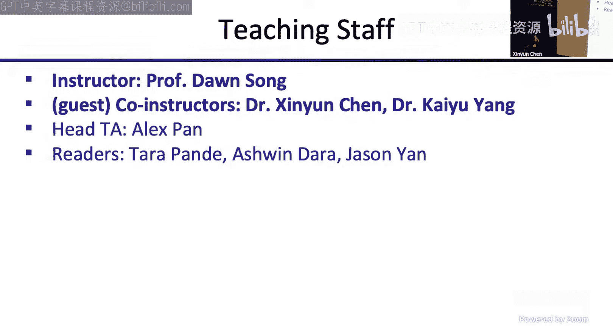

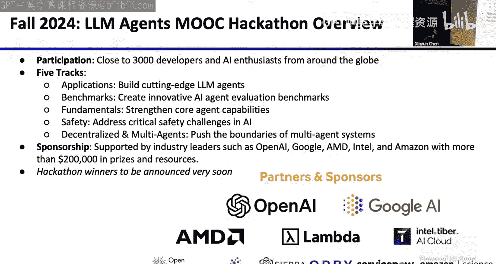

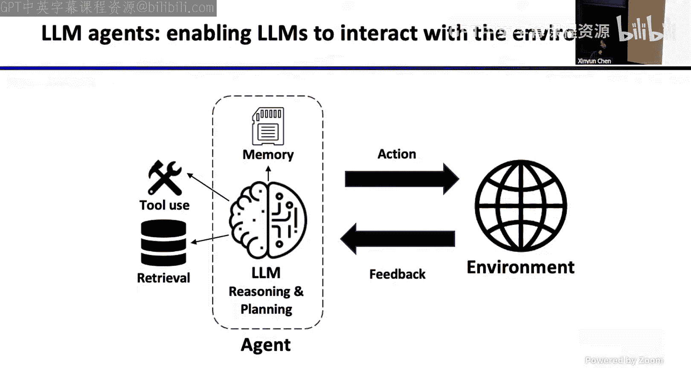

在本节课中，我们将学习如何通过推理时间技术来提升大语言模型的推理能力。我们将探讨如何通过提示工程、搜索与选择以及迭代改进等方法，更有效地利用计算资源，使模型能够解决更复杂的问题。

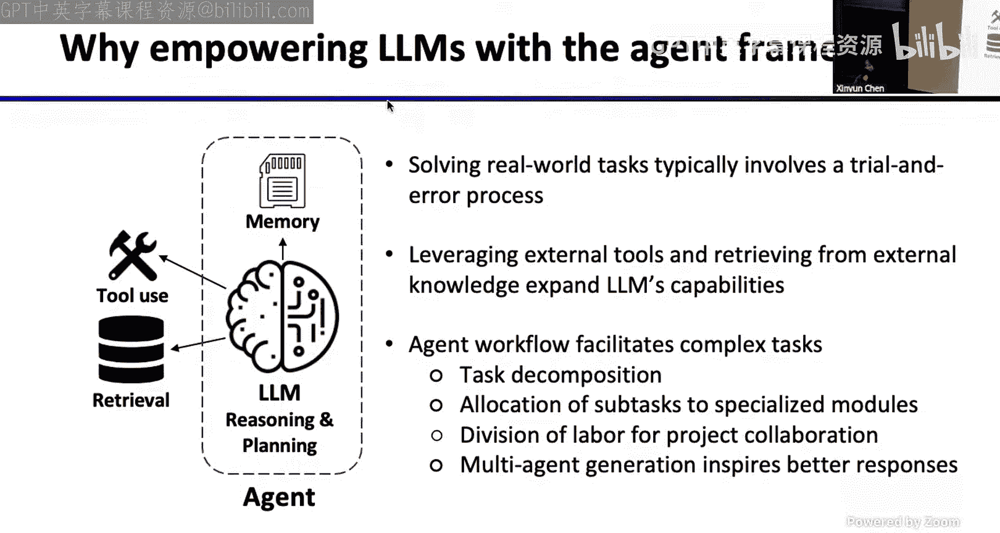

## 课程概述与背景

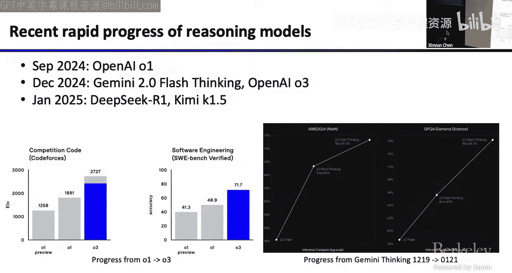

大家好，我是陈新云，是谷歌DeepMind的一名研究科学家。这门课程由我、UC Berkeley的Dan教授以及Meta的Kai Yu Yang共同教授。我们还有一个出色的助教团队，由Alex、Tara和Jason组成。

上学期，我们首次开设了这门关于智能体的课程，并在慕课平台上吸引了约15000名注册者。我们还举办了一场全球性的黑客松，吸引了约3000人参与，并获得了行业合作伙伴约20万美元的赞助支持。

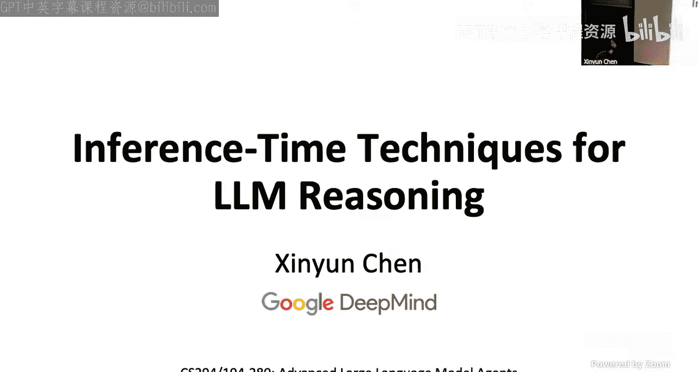

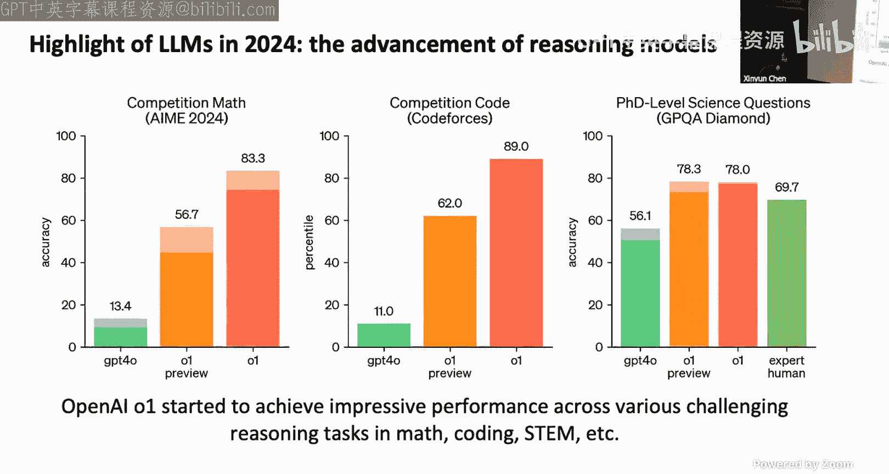

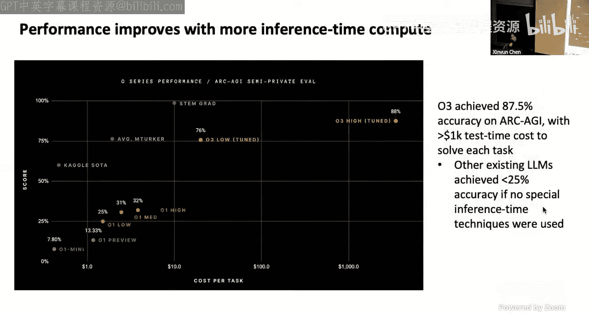

现在，让我们回到大语言模型智能体这个话题。基于大语言模型的智能体，其核心“大脑”是一个大语言模型，它负责在每个时间步进行推理和规划，并采取行动。通过与环境交互并接收反馈，智能体可以更新其内部记忆，从而更好地规划下一步行动。这种框架允许智能体利用外部反馈和工具，扩展其能力并做出更明智的决策。智能体框架的常见组件包括工具使用和检索。

那么，为什么我们要用智能体框架来增强大语言模型呢？因为解决现实世界任务通常涉及试错过程，尤其是在新环境中部署智能体时。它需要与环境交互，以理解不同行动的成功与失败模式，从而修正其内部记忆。同时，利用外部工具和检索外部知识可以扩展大语言模型的能力。随着智能体工作流设计日益成熟，它也促进了复杂任务的完成，包括任务分解、子任务分配、不同专业模块间的分工协作以及多智能体生成。

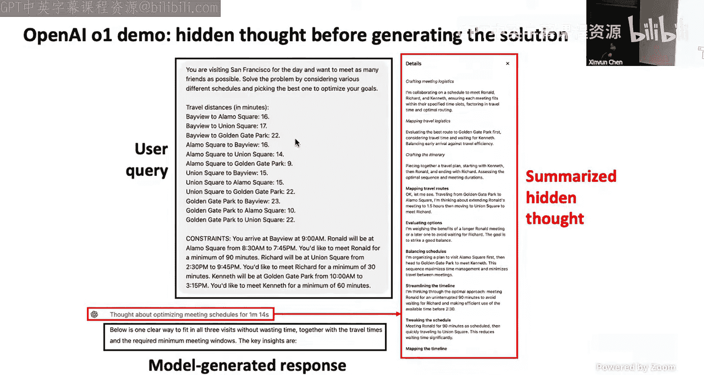

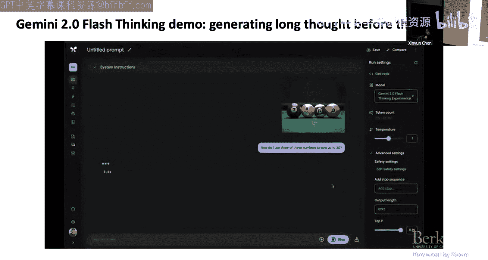

许多人说2025年将是“智能体之年”。如今，我们已经看到各种应用领域的大语言模型智能体爆炸式增长。在许多领域，这些智能体正在改变人们对AI模型能力的认知。一些成功的演示和实际用例包括代码生成、计算机使用、个人助理等，并且这个应用列表未来还会继续增长。此外，在教育、金融等领域，我们也已经看到了优秀的大语言模型智能体的出现。

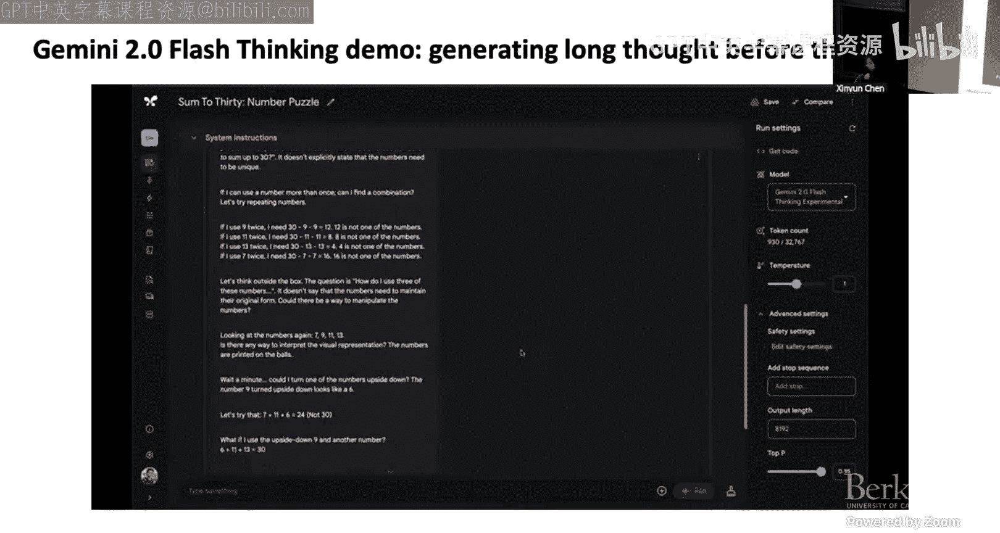

另一个推动智能体发展的因素是推理模型的快速进步。从去年9月OpenAI发布O1模型开始，我们看到了推理能力的巨大提升。例如，上个月我们看到了Gemini 2.0 Flash Thinking模型和OpenAI O3模型的发布，这个月又看到了DeepSeek R1和Kimi K1.5的发布。在同一系列模型中，我们也能看到不同版本间的显著性能提升。

如果我们思考推理方面的进展，迄今为止最令人印象深刻的性能表现出现在数学和编程领域，尤其是在解决极具挑战性的问题上。例如，去年我的同事在Google DeepMind开发的AlphaProof和AlphaGeometry系统，在国际数学奥林匹克竞赛中获得了银牌（接近金牌）的成绩。而最近的OpenAI O3模型，在Codeforces编程竞赛中排名进入了人类参赛者的前200名。这些里程碑式的成就，在几个月前可能还难以想象。

因此，本学期我们的课程名为“高级大语言模型智能体”，我们将更深入地探讨方法论部分，特别是推理技术。我们将讨论推理的基础技术，包括推理时间扩展、训练技术以及搜索与规划。在应用方面，我们将更侧重于软件工程和数学，包括代码生成与验证，以及自动形式化和序列改进。在对方法论进行深入探讨之后，我们将讨论智能体在现实世界企业应用中的用例、更高级的智能体工作流设计，以及现实世界部署大语言模型智能体时的安全与伦理问题。

接下来，我们的首席助教Alex将介绍课程的后勤安排。本学期的课程与上学期类似，主要区别在于我们将实验的截止日期安排得更晚。今年的实验将更具挑战性，发布时间更晚，大家有更多时间来完成。另一个主要变化是，我们将开放项目选题。上学期项目是开放式的，这次我们将设立两个方向：应用方向和研究方向。应用方向与上学期类似，而研究方向是新的。如果你有兴趣提交会议或研讨会论文，可以申请研究方向。我们将很快发布申请表格，如果被选中，你将在Dan教授的博士后和研究生指导下，尝试为本课程提交一篇研讨会论文。其他安排与去年基本相同。所有信息都在课程网站上，请关注网站和Ed STEM上的更新。

与上学期一样，我们也将邀请出色的演讲者来探讨高级智能体的不同主题和应用。我们仍在确定客座讲师的日程安排，请查看课程网站获取最新信息。

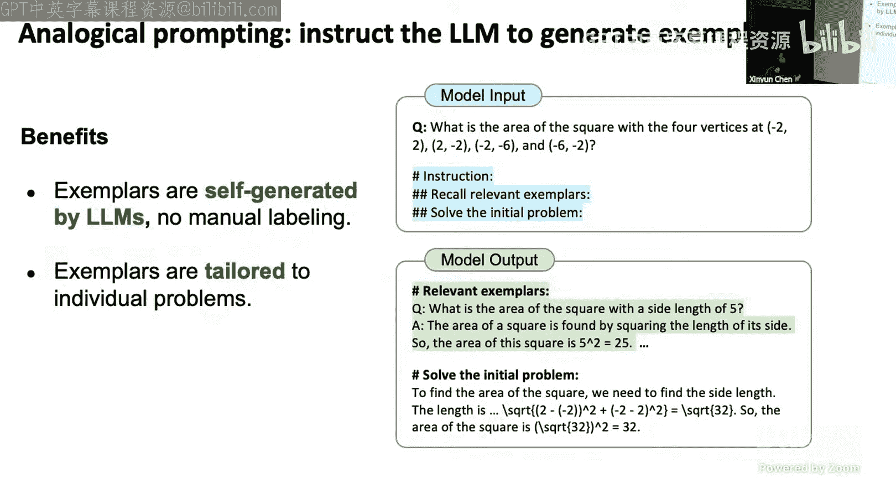

在本讲座中，我将讨论推理的推理时间技术。在课程介绍中，我们谈到了推理模型的进步，这是去年大语言模型发展的亮点之一。在这里，我将更详细地探讨从这些推理模型中能看到什么。

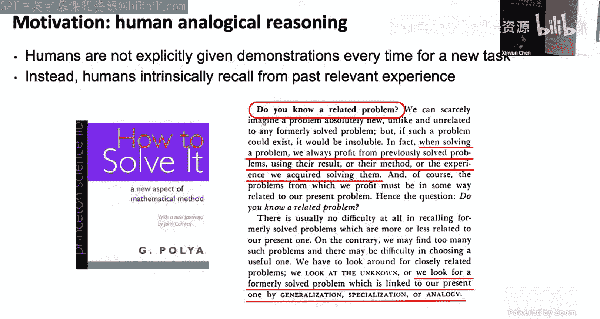

## 推理模型概览

在幻灯片上，我展示了引自O1博客的结果。从这里我们可以看到，OpenAI O1模型开始在先前模型难以应对的各种极具挑战性的任务上取得了令人印象深刻的性能。这包括去年IMO竞赛中的竞赛级数学问题，以及Codeforces上的竞争性编程竞赛。

在最近的O3结果中，他们进一步展示了这种性能可以随着推理时间计算的增加而进一步提升。例如，这里我展示了他们在名为AIRC AGI的基准测试上演示的曲线。这是一个包含一系列谜题的基准测试，用于测试人类或AI模型在给定演示示例后学习推理模式的能力。这是一个非常具有挑战性的任务。对于O1之前的大多数现有模型，如果不应用任何特殊的推理时间技术，只是进行常规推理，那么所有现有模型的准确率都低于25%。即使是GPT-4模型，也只能达到约30%的准确率。但对于O3模型，如果将推理时间预算设置为每个问题约20美元，其性能可以达到与普通人类标注者相当的水平。如果我们将推理时间成本进一步扩大到每个问题1000美元这样的疯狂数字，那么模型实际上可以达到87.5%的准确率。这是一种非常昂贵的解决问题的方式，但它展示了在不太关心推理时间计算成本的理想情况下，模型能达到的性能。

幻灯片上展示了一个非常简单的OpenAI O1演示，我让模型解决一个规划问题。O1模型的主要区别是什么？主要区别在于，在O1模型之前，当我们输入用户查询时，模型会直接生成响应。但在O1的界面中，他们包含了思考过程。这个过程可能需要不同的时间，取决于任务的难度。例如，对于我询问的具体问题，生成最终解决方案需要略多于一分钟的时间。在O1界面中，他们并没有显示原始的思考过程，而是显示了隐藏思考的摘要版本。

从这个针对特定规划问题的隐藏思考中，我们可以看到它总结了推理过程中的一些关键阶段，包括基于模型内部信念制定初始计划，然后修改计划以满足顾虑并提高自主性。

对于Gemini 2.0 Thinking模型，我们也让这些思考令牌对用户可见。幻灯片上展示了一个演示，其中这个提示包含图像输入。这个问题中的数学部分相当简单。基本上，图像中有四个球，问题是要求模型从这些堆叠的数字中取出三个，使和为30。这里的思考过程，正如你所见，相当长。在我们输入查询后，模型立即生成这些思考。我们不需要逐令牌阅读推理过程，我知道这很难阅读。但从这个多模态查询中，我们能看到的最终有趣的一步是，在某个时刻，模型发现了解决这个问题的一个非常关键的步骤。因为如果你想得到和为30，实际上我们需要通过滚动这个球将数字9变成6。这是当我们把这些数字放在一些球上时，这个查询的一个非常有趣的特点。而且，这个步骤本身在数学上并不那么困难，但如果我们不允许模型生成这么长的思考，这个特定的步骤将很难被发现。

除了OpenAI和Google DeepMind的模型，最近还有其他推理模型，正如我在讲座开头提到的，还有来自深度求索团队和Kimi团队的模型。

在所有推理边界的进展中，一个核心的共同理念是，我们需要某种方式来触发大语言模型在得出最终解决方案之前，先生成一条长长的思维链。

在文献中，有不同的方法来触发这种思维链生成。例如，在最初的思维链论文中，他们设计了一个简短的提示示例，在示例中演示了这种思考过程。后来，一些研究表明，我们可以应用指令提示来实现这一点。例如，我们可以使用指令“让我们一步一步地思考”。对于推理聊天模型，我们可以看到，即使我们不向模型提供任何特殊指令，模型也倾向于在得出最终答案之前生成一些思考，无论这些思考是短是长。

有不同的方法来训练模型实现这一点，例如在指令微调中，我们实际上将思维链数据放入我们的监督微调中。从最近的推理模型中，我们也可以看到，我们可以应用强化学习来实现这个目标。

在本讲座中，我将更侧重于扩展令牌预算的推理时间技术。在未来的讲座中，我们也将更深入地探讨推理技术，并会有其他客座讲师来分享他们的见解。

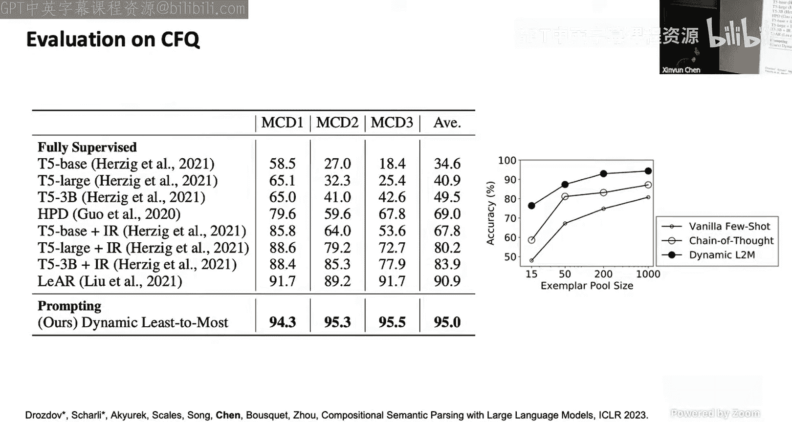

对于本讲座，我将讨论推理时间技术的三个部分。首先，我将讨论基本的提示技术，这些提示技术的共同理念是，我们希望允许模型使用更多的令牌预算来生成单个解决方案。然后，第二部分，我将讨论从多个候选中进行搜索和选择的技术，其共同理念是增加探索解决方案空间的方式。最后一部分，我将讨论迭代思维改进，这将允许模型增加其深度以达到最终解决方案。在讨论了所有这些不同部分之后，我们还将看到如何最好地利用这些技术的不同组合，以寻求利用推理时间计算来提高AI推理性能的最佳方式。

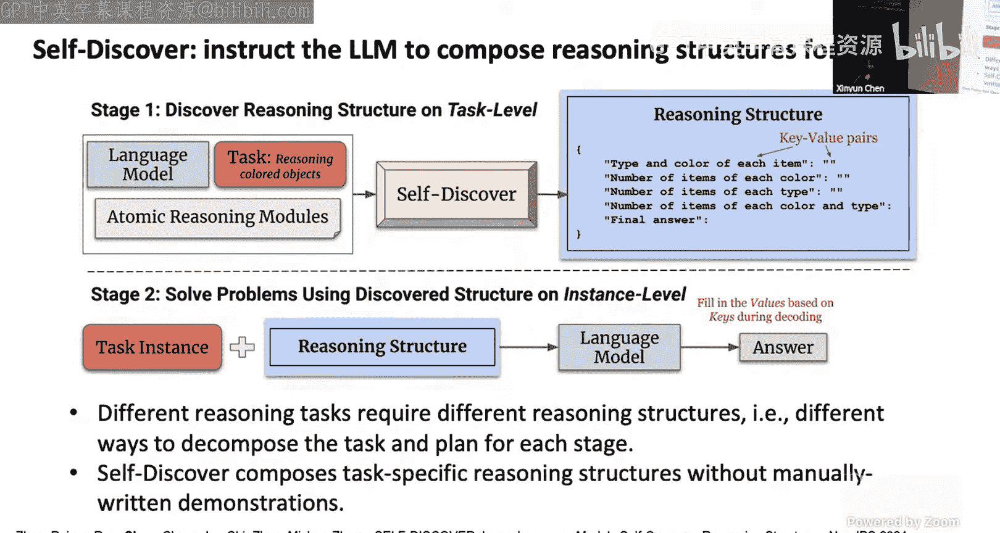

那么，让我们从关于基本提示技术的第一部分开始。

## 第一部分：基本提示技术

在讨论更高级的提示技术之前，让我们先回顾一下标准提示的背景。基本上，在思维链提示的一系列工作之前，常见的做法是，我们只是将一些问答对放入提示中。例如，这里的问题是数学问题，答案是最终答案。

在后训练技术取得进展之前，如果我们直接应用标准提示，那么在推理基准测试上的性能相当差。根本问题是，如果我们看这些标准示例，它们只提供了关于最终解决方案格式的信息，但没有告诉模型推导解决方案的基本原理。现在我们可以想象，如果你在上课，老师基本上只教你最终的官方解决方案，没有任何更多背景，而你自己又没有背景知识，那将使你的学习困难得多。

对于思维链提示，其理念是，我们将包含一些带有思考的示例。让我们再次以解决数学问题为例。在这里，在示例中，我们将提供这些计算步骤，以向模型演示我们应该如何一步一步地推导解决方案以获得最终答案。在给出这些带有思维链基本原理的示例之后，模型就能够正确地解决这个问题。

在实践中，模型如何从思维链提示中比从标准提示中获益更多，也取决于模型的基本能力。幻灯片上展示了原始思维链论文以及一些其他关于思维链特性的相关论文中呈现的缩放曲线。我们可以看到，在不同的模型系列中，一个共同的趋势是，思维链性能随着模型规模的增加而显著提高。特别是，如果我们看思维链提示与标准提示之间的差距，那么更好的模型从思维链生成中获益更多，这表明一旦模型达到一定规模，推理性能就会得到显著提升。

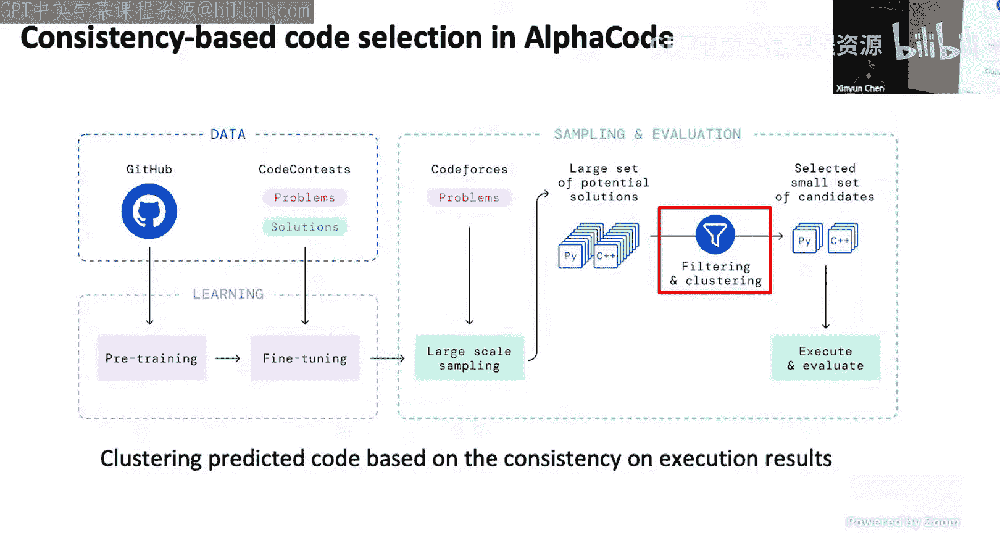

我还想指出，这些曲线来自2022年的论文，因此这些实验是使用仅预训练的大语言模型完成的。这就是为什么应用一些提示以使模型能够立即生成这种思维链很重要。而且，随着这些最近的后训练技术，它们可能会显示出一些不同的缩放曲线，例如我们最近看到了一些强大但非常轻量级的大语言模型。但主要结论仍然成立，我们仍然会看到这种总体趋势，基本上一旦模型变得更好，它将从允许生成思维链中获益更多。

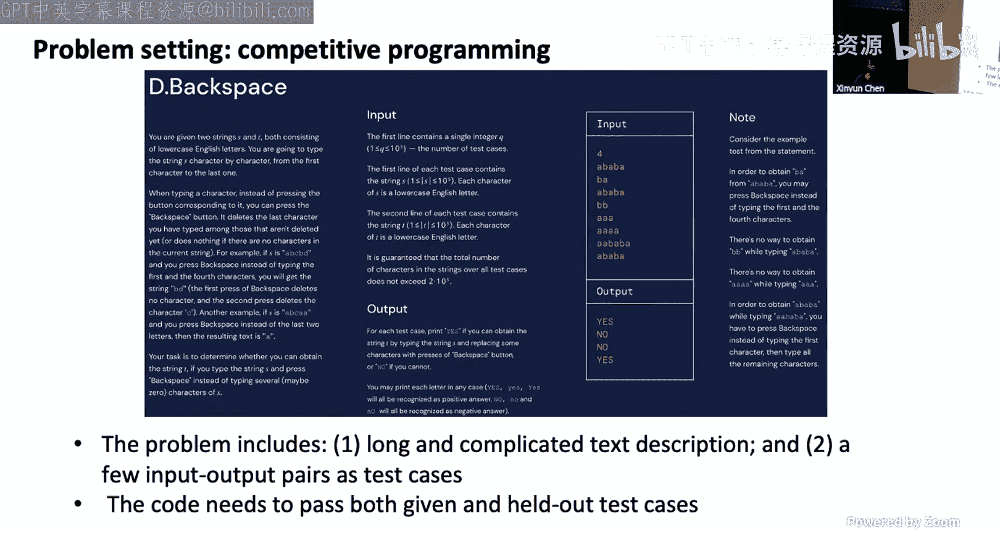

在后续工作《大模型是零样本推理者》中，他们进一步发现，即使只有大模型，我们也不必向模型提供示例来引发这种思维链生成。相反，我们可以通过指令来实现这一点。例如，在论文中，他们演示了指令“让我们一步一步地思考”。然后，在我们要求模型生成答案之前应用此指令，模型也可以在生成最终解决方案之前生成一些思考。

经验表明，这种零样本思维链在更难的数学和符号推理任务上显著优于零样本性能。因此，零样本思维链比少样本思维链更方便，因为我们不再需要手动标注思维链作为示例。但如果我们比较它们的性能，零样本思维链性能仍然比少样本思维链差得多。

那么，一个非常自然的问题是，我们如何才能两全其美？如何在不手动标注样本的情况下提高思维链性能？这就是我们希望通过论文《大语言模型作为类比推理者》实现的目标，该论文去年发表在ICLR上。其理念是，我们不直接向模型提供示例，而是提示模型首先回忆相关的示例来解决测试问题。然后，基于这些模型生成的示例，模型将尝试解决测试问题，就像想象这些自生成的示例只是来自外部来源的一些思维链示例。

这种设计的好处有两个方面。首先，这些示例是由大语言模型自己生成的，因此我们不需要进行任何手动标注，这符合我们的原始目标。另一方面，因为这种指令应用于每个测试问题，所以基本上对于不同的测试问题，模型能够生成不同的、与测试问题涵盖的具体主题更相关的示例。因此，这些示例更针对个别问题。

我们称我们的方法为“类比提示”，因为这种方法实际上可以从人类类比推理中得到启发。如果我们思考少样本提示，从人类推理的角度来看，它并不自然，因为人类并不是每次解决每个新问题时都被明确给予演示。相反，人类也会从过去的相关经验中回忆。在一本经典的推理方法论书籍《如何解决它》中，有一个关于这种推理方法的精彩描述，名为“你知道一个相关的问题吗？”。其理念是，在解决问题时，我们寻找一个已解决的问题，它通过泛化、特化或其他方式与我们当前的问题相关联，并且我们希望从这些过去的结果或方法中学习，以帮助我们更好地解决新的测试问题。

从人类推理的角度思考，除了示例，我们还可以提示模型生成一些更高级的知识，这些知识可以更好地总结我们解决新问题所需的内容。这种生成的知识可以用更广泛的见解来补充问题。

这里让我们以解决编程问题为例。给定一个新的编程问题，我们可以首先提示模型自我生成一些知识，这些知识更像是关于解决该问题所需算法的更高级教程。同时，模型需要确定我们需要的主要算法，以便提出相关的示例问题及其相应的代码。然后，在这个指令之后，一旦模型生成了相关的背景知识，包括更高级的教程和示例，模型就会回过头来解决最初的测试问题。

在结果中，我们展示了基本的类比提示不仅优于零样本思维链，而且实际上也优于手动标注的少样本思维链。我们在数学问题解决、代码生成以及Big Bench推理任务上展示了这种性能改进。

如果你第一次看到这些结果，你可能会有点惊讶，因为这里的知识，所有这些示例问题或知识都是由模型生成的。直观上，它可能比人类标注的示例包含更多错误。经验上，我们确实观察到了这种趋势。例如，对于模型为数学问题生成的示例，大约70%是准确且相关的，但其余的可能存在一些问题，比如完全不相关或存在一些错误的计算步骤。但即使演示中存在一些噪声，模型仍然从中受益匪浅。

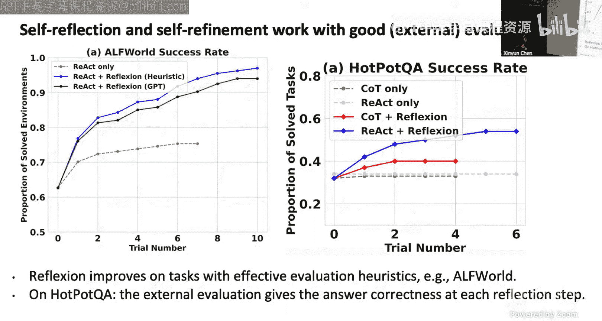

鉴于这一发现，你可能会想，这至少意味着模型应该能够生成一些合理的示例，否则它根本无法从中学习。基于这种直觉，我们还对类比提示进行了一个相当粗略的缩放研究。这里我们比较了GPT文本模型系列中不同模型的表现。我知道这些模型现在都已关闭并弃用，但这种趋势仍然成立。基本上，我们可以看到，较弱的大语言模型从类比提示中获益较少，尽管如果我们将其性能与零样本思维链进行比较，它仍然与之相当或优于其性能。而对于更强的大语言模型，例如从GPT-3.5开始，类比提示开始优于使用手动设计示例的思维链提示。请注意，这种方法甚至可以优于检索到的示例。对于检索方法，我们所做的是，基本上对于每个测试问题，我们实现一种检索方法，以便在GSM8K数学语料库训练数据中找到最相关的问题。这里的一种解释是，模型生成的思维链可以更贴合这些预训练或指令微调大语言模型的基本推理风格。这一发现实际上也与最近的趋势一致，例如当我们尝试开发推理模型时，与其放入人类编写的思维链，我们可以使用一些训练方法，使模型能够自己发现最佳的推理策略。

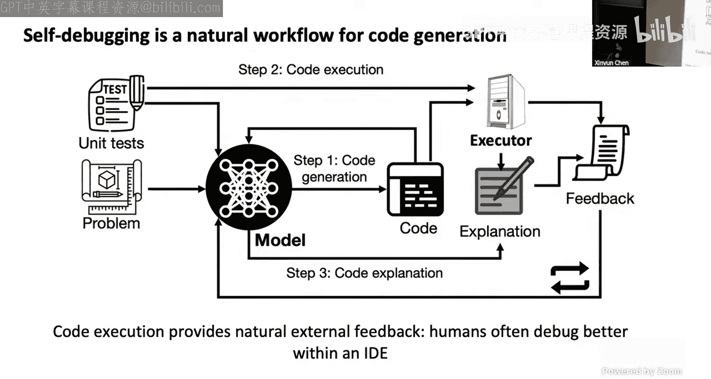

现在，让我们回到指令“让我们一步一步地思考”。为什么我们必须使用这句话？它有什么特别之处吗？在最初的零样本思维链论文中，他们对触发思维链生成的不同指令变体进行了观察研究。其中一些没有多大意义，因此它们表现不佳也就不足为奇了。但如果我们看那些顶级类别的不同指令，如果我们掩盖这些准确率数字，可能并不那么直观地知道哪个指令应该表现得更好，而且可能会发现，即使只改变几个词，准确率数字也可能发生非常剧烈的变化。这表明当前的大语言模型对提示设计相当敏感。而且在许多情况下，关于如何编写最佳提示并没有明确的原则。这就是为什么如今，仍然有很多人在撰写大量关于如何进行提示工程最佳实践的指南。

鉴于这一观察，下一个非常自然的问题是，我们如何才能减少编写提示的手动工作？一个想法是，既然我们的大语言模型可以解决许多具有挑战性的推理问题并回答其他查询，那么我们为什么不也用它来帮助我们进行提示工程或一般的提示设计呢？2023年，有一篇论文名为《大语言模型是人类水平的提示工程师》。其核心思想基本上是应用大语言模型来提出提示，我们希望这种模型生成的提示也能比人类编写的提示表现得更好。

幻灯片上展示了他们方法的完整示意图。有两个重要的阶段。第一个是提案生成阶段，我们可以利用模型根据我们的任务描述生成初始指令。然后，一旦模型生成了不同的提议提示，我们将根据在一小组问题上的预测正确性对每个指令进行评分。基本上，这里我们将保留一个小的验证集，它可以告诉我们每个提示的质量。这里的设置可能更类似于传统的机器学习任务，我们有训练和测试的分离，但实际上我们不需要为验证目的包含那么多示例，在大多数情况下，包含几十个示例或大约100个问题就足够了。

然后，在我们去年发表在ICLR上的工作中，我们更进一步。我们尝试使用这个模型，不仅只是提出一些指令并进行某种搜索或突变，我们还希望将其用作优化器，以迭代地改进提示。因此，我们方法的思想是，我们希望提示大语言模型利用过去表示为（解决方案，分数）对的轨迹，以便它可以学会通过更多步骤生成更好的提示。

在这项工作中，我们将其构建为自然语言空间中一个更通用的框架。但在提示提议这个具体用例中，基本上，这意味着我们将有两个大语言模型作为优化器和评估器。基本上，优化器是负责根据旧指令和任务示例提出新指令的大语言模型。评估器是评估给定指令的准确性或性能的评分器。

现在，让我们看看如何设计元提示来实现这个目标。幻灯片上展示了一个用于解决数学问题GSM8K的元提示示例。问题本身看起来相当长，但基本上有两个主要组成部分。第一个是轨迹，包括我们在过去步骤中探索过的指令及其相应的准确率。在实践中，我们将按升序对它们进行排序，如果上下文长度不足以容纳所有历史记录，我们可以删除那些较旧的记录。我们还提供这些示例来展示我们想要优化的任务。基本上，这里对于数学问题，我们只需要包含这些带有最终答案的问答对。同样，不需要标注任何思维链或关于我们如何推导解决方案的任何解释。

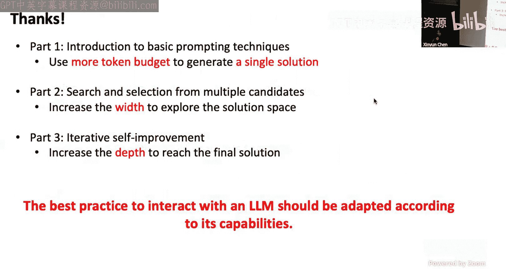

对于结果，基本上，我们再次测试了所有这些指令或仅预训练的大语言模型，我们当时使用了PaLM模型和GPT模型。对于所有这些方法，我们从初始指令“让我们解决问题”开始，该指令在GSM8K任务上达到了约61%的准确率。这是一个相当通用的指令，比“让我们一步一步地思考”指令低约10%。如果我们看这些生成的最佳提示，我们可以看到，实际上这个指令“深呼吸，一步一步地解决这个问题”比“让我们一步一步地思考”指令高出约8%。实际上，如果我们将其性能与少样本思维链进行比较，它与PaLM2论文中报告的性能相匹配，其中思维链示例是由人类