# 4：Lecture 4, Hanna Hajishirzi

在本节课中，我们将学习如何构建和训练能够进行复杂推理的大语言模型。我们将重点探讨Hanna Hajishirzi教授分享的关于提升语言模型推理能力的三个正交方向：预训练、后训练和推理时优化。课程将涵盖数据混合、算法选择以及如何通过开放研究推动模型能力的发展。

## 概述：构建开放且强大的语言模型

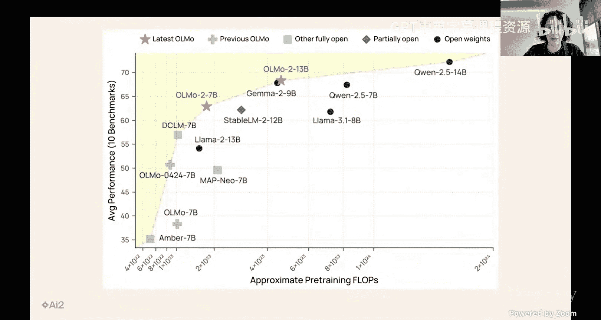

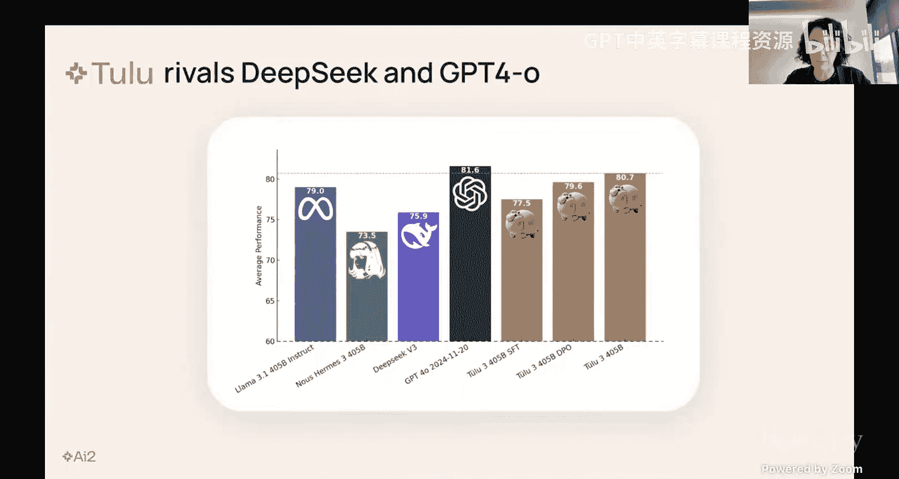

当前人工智能的进步很大程度上得益于开放的科学研究和开发，以及我们对完全开放模型的访问。然而，该领域的研究正逐渐封闭。这并不意味着语言模型的科学研究和创新已经完成。我们仍需要进行大量研究来理解语言模型的科学原理、改进它们并构建下一代模型。我们还需要推动语言模型超越纯文本领域，例如应用于科学、健康等领域，并减轻其偏见和风险。为了促进创新并加速语言模型的科学发展，我们需要这些模型完全开放、透明、可访问且可复现。

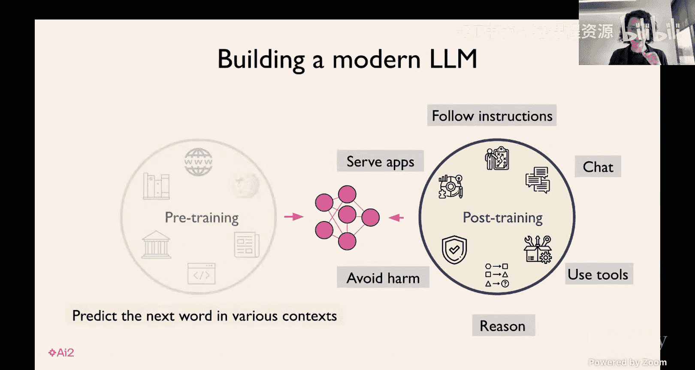

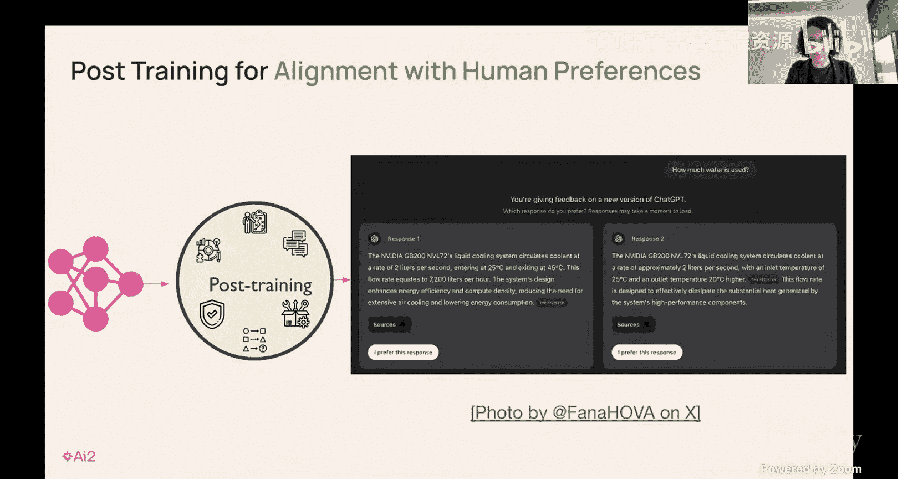

在华盛顿大学和AI2，我们的重点是构建一个开放的生态系统，使我们能够在不同阶段（从预训练到后训练，再到智能体构建）构建语言模型。我的团队主导了开放语言模型（OLMo）和Tulu（我们的开放后训练方案）等项目。这个完全开放的生态系统是当前AI版图中不可或缺的一部分。通过OLMo等项目，我们致力于研究和发展先进的语言模型，确保所有工作完全开放、有文档记录且可复现，以此赋能AI社区并告知公众AI的工作原理。

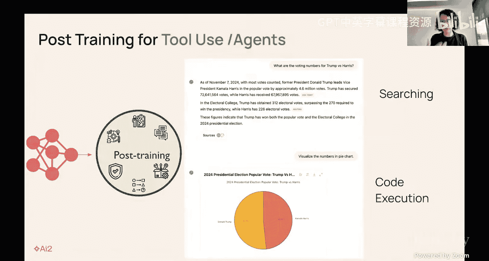

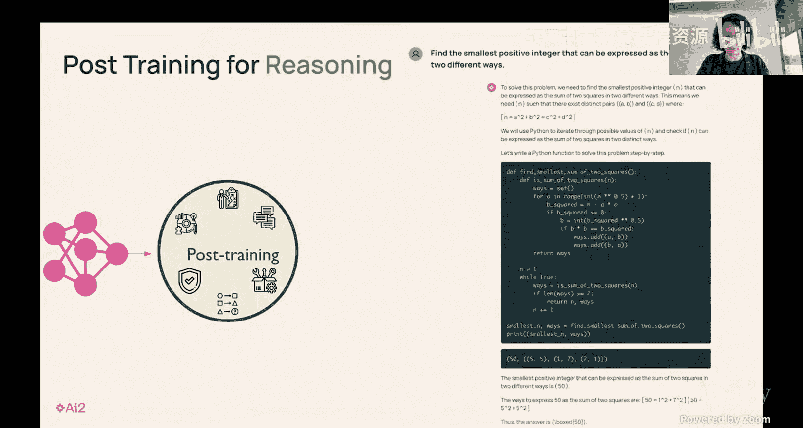

在本次讲座中，我将讨论我们为提升语言模型推理能力所做的三项工作，这三个方向基本是正交的：预训练、后训练和推理时优化。我的许多幻灯片都来自参与这些项目的杰出学生和团队成员。

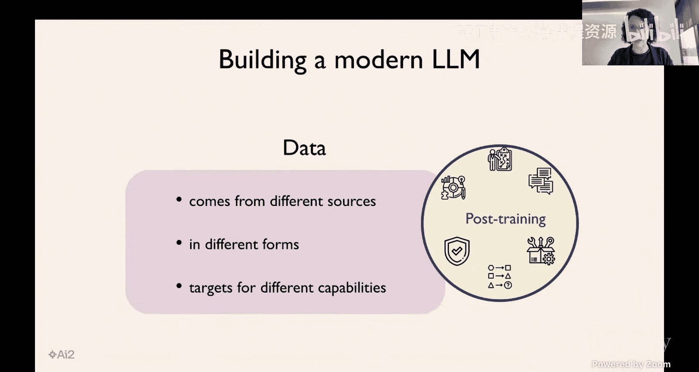

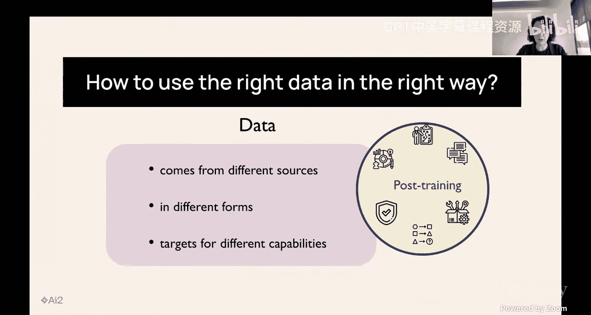

## 后训练：提升模型能力的关键步骤

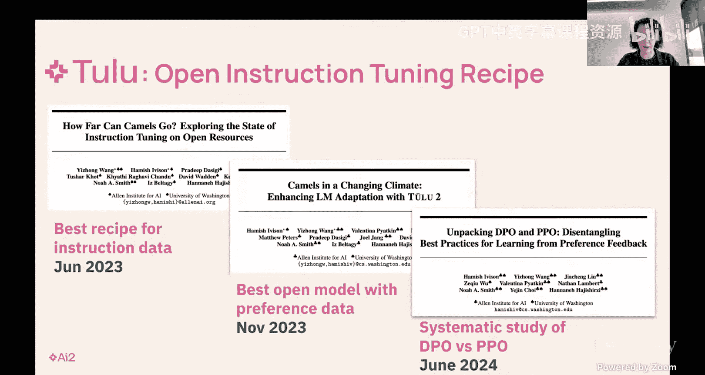

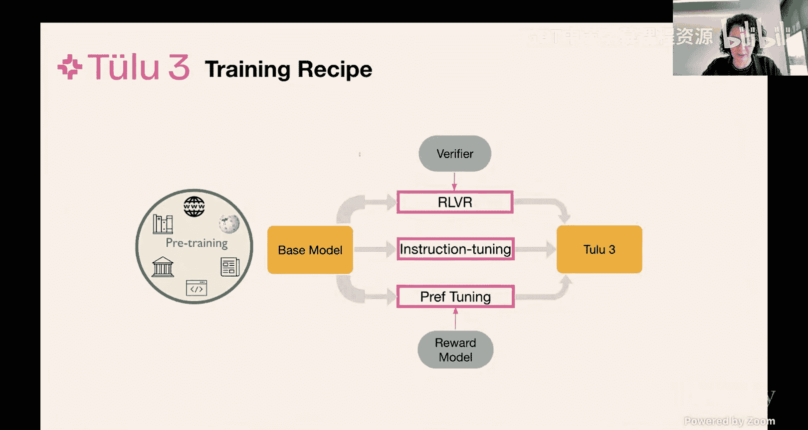

上一节我们介绍了构建开放语言模型的整体目标，本节中我们来看看如何通过后训练来具体提升模型的能力，特别是推理能力。

构建现代大语言模型大致分为两个阶段：预训练和后训练。在预训练阶段，模型通过预测下一个词元进行训练，数据通常来自大规模的网络数据。但此阶段产生的模型并不适用于许多应用：它可能不安全，无法遵循人类指令，也不擅长推理。

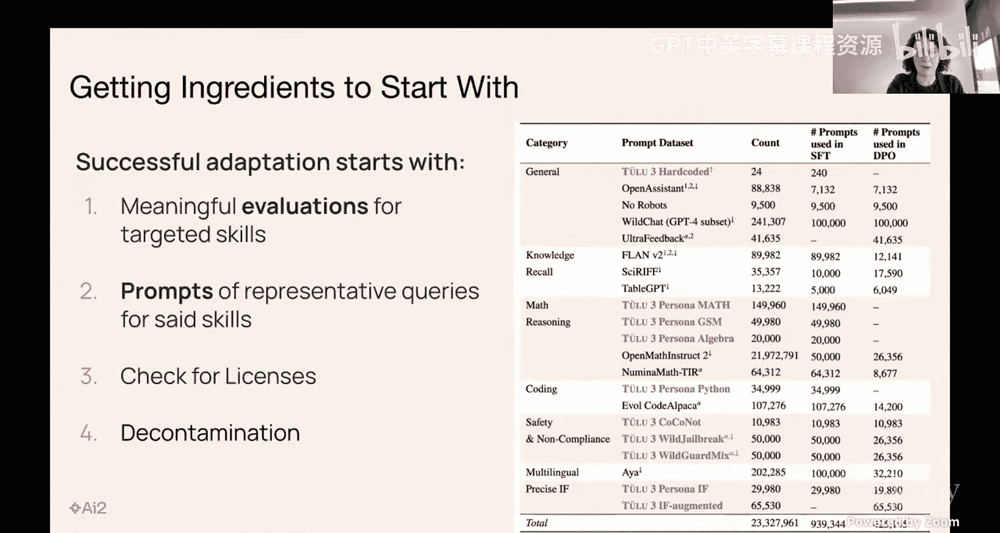

后训练阶段则使模型能够完成许多任务：它可以聊天、遵循指令、与工具集成、进行推理，并能告知用户何时其响应可能有害或不遵循指令。我们进行后训练是为了与人类偏好对齐，例如通过收集人类对模型响应的偏好数据。我们还通过后训练使模型能够使用工具、搜索、执行代码等，并大量训练模型进行推理，例如解决算术应用题。

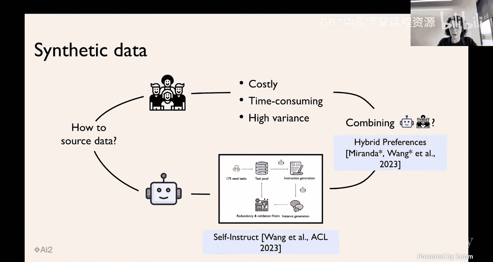

### 后训练的核心要素

遵循许多标准的语言建模或机器学习流程，后训练需要几个关键部分：用于训练的数据、训练架构（神经网络，几乎都是基于Transformer的架构）以及一个全面的评估循环，以告诉我们哪些方面在改进，哪些方面进展不佳。构建一个非常现代且成功的语言模型有三个不可或缺的部分：数据、模型和算法。在本次讲座中，我将讨论哪些类型的数据重要，以及哪些算法对哪些类型的数据有用。

数据在构建这些后训练模型中扮演着非常重要的角色。与预训练模型类似，数据来自不同来源，形式多样，旨在培养多样化的能力。例如，我们需要数据来解决数学应用题，需要数据来构建智能体，需要数据来告诉模型何时不应响应查询。但我们需要设计和使用不同的算法来决定何时使用正确的数据，以及哪些算法在何时有用。这就是我们在Tulu项目中所做的努力，该项目始于2023年，现在我们拥有一个开放、可复现且最先进的后训练方案，可以将其应用于许多不同的开放权重模型。

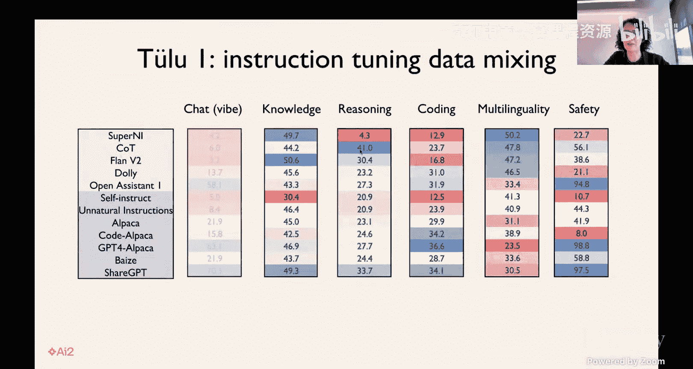

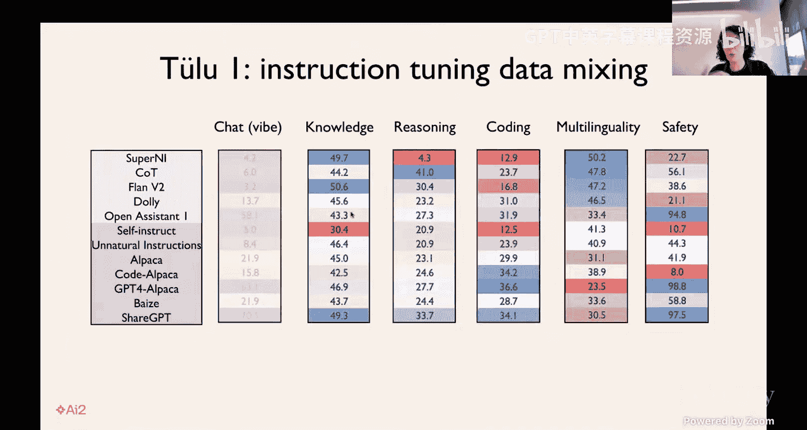

以下是我们在Tulu项目中的主要进展阶段：
*   **Tulu 1 (2023年6月)**：主要展示了开发监督微调数据或指令数据的最佳方案。
*   **Tulu 2**：展示了如何引入和处理偏好数据。
*   **Tulu 3 (2023年11月)**：将所有努力整合在一起，并对使用偏好调优数据的最佳算法进行了系统研究。最终，我们成功证明仅使用开源模型就能达到与ChatGPT相当甚至在某些方面超越GPT-4的水平。

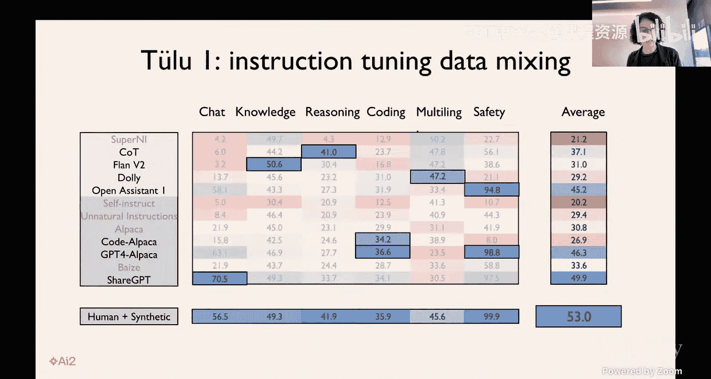

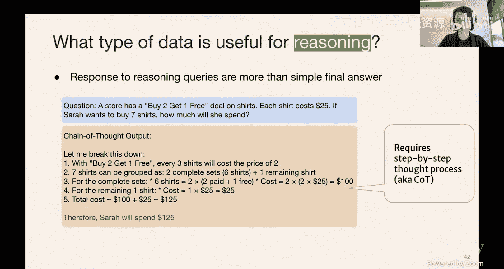

### 后训练方案详解

这个训练方案从一个基础模型开始，遵循三个重要步骤：指令调优、偏好调优以及我们称之为“带可验证奖励的强化学习”的新方法。有时我们需要在这些阶段之间进行多次来回迭代。

#### 第一步：指令调优

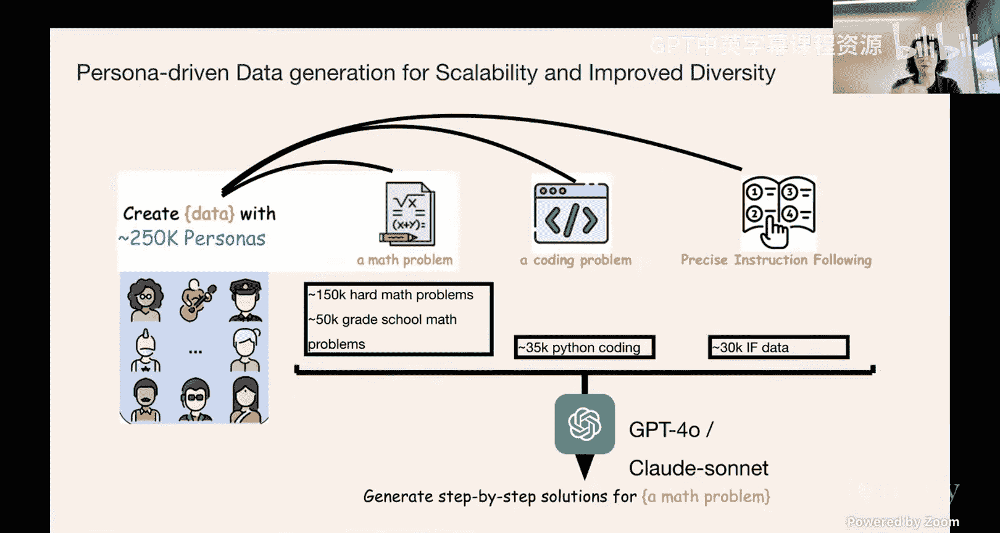

首先，我们需要准备好“食材”，即数据。为了进行成功的后训练，我们首先需要为目标技能建立有意义的评估。对于Tulu 3，我们的目标是：具备通用聊天能力、擅长知识、数学和推理、编码、安全性和合规性、多语言能力，以及即使在有约束条件下也能精确遵循指令。我们为此开发了各种评估基准，并遵循良好的机器学习实践，将部分数据集用于开发，保留部分作为隐藏测试集，在所有训练完成后进行评估。

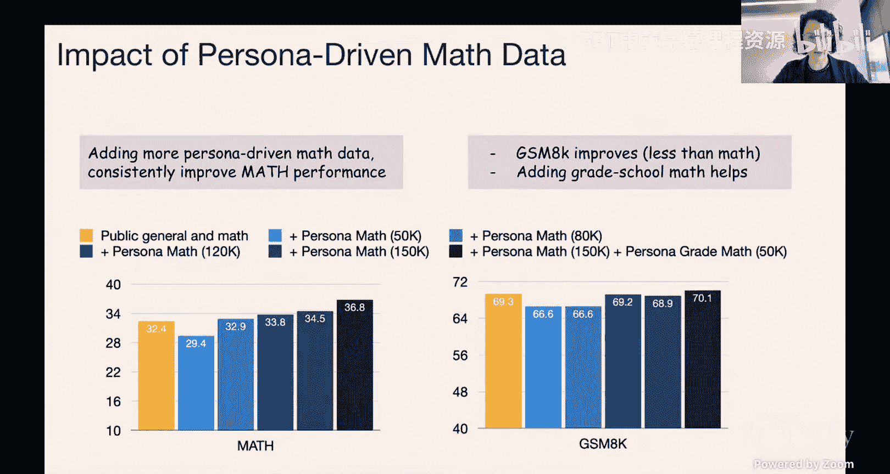

给定我们对这些能力的重视，我们开始收集提示或查询，我们认为模型应该能够回答这些问题。我们检查了许可证、用户同意收集的方式，并确保它们与我们的评估集去重，这一点非常重要。

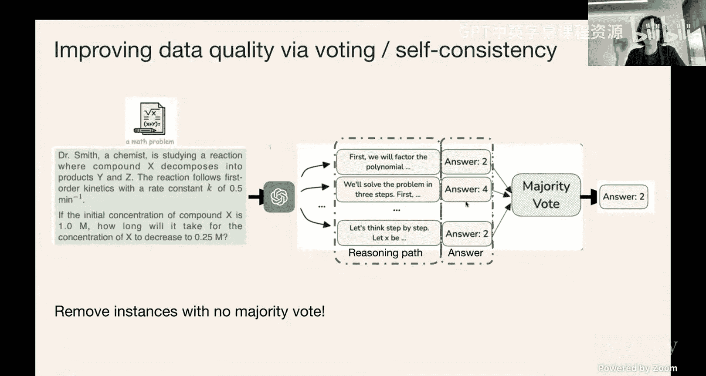

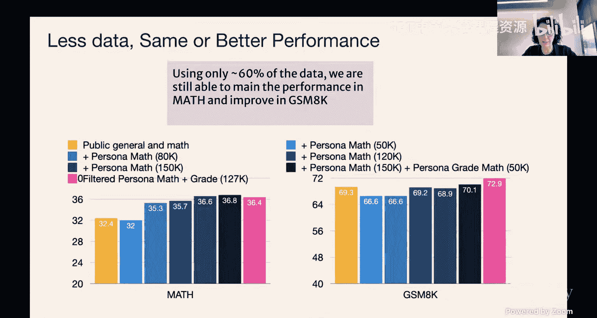

指令调优，有时也称为监督微调，是一个非常简单的步骤。它接收大量提示和对应的完成文本，然后对预训练语言模型进行微调，使其能够遵循这些指令。例如，查询可以是“逐一回答这些问题”、“总结这个文档”等，然后是最终答案。

我们如何策划这些数据？数据来源可以是人工标注，但这成本高、耗时且方差大。另一种方法是我们2023年Self-Instruct论文中介绍的，使用另一个语言模型通过自循环或自指令循环来合成生成这些数据。最近我们发现最优解决方案是结合两者，构建一个混合数据收集，既包含人工标注数据，也包含其他语言模型合成生成的数据。

数据策划在开源社区中得到了很好的接受。我们早期在2022年有Natural Instructions和Super-Natural Instructions工作，主要关注NLP相关任务。然后我们开发了Self-Instruct框架来合成生成数据，这在社区中非常受欢迎。社区后续引入了许多工作来生成越来越多的合成数据集，如Alpaca、Vicuna等。我们也有一个很好的数据集集合，主要关注短格式问答类型任务。

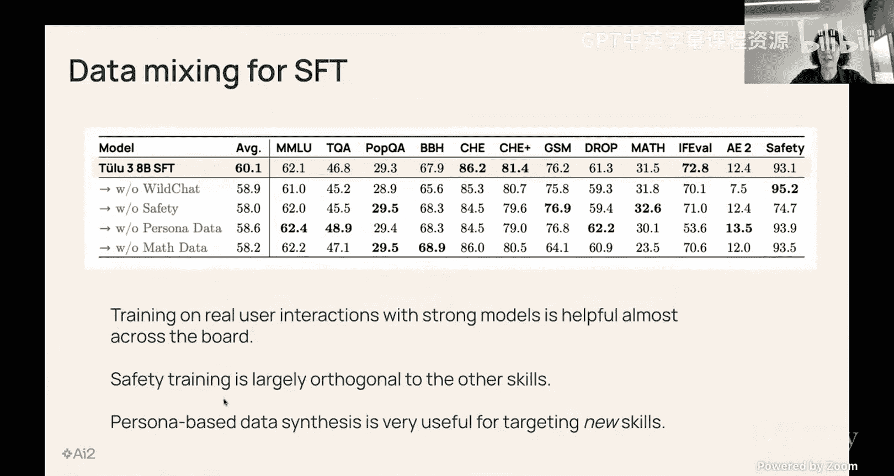

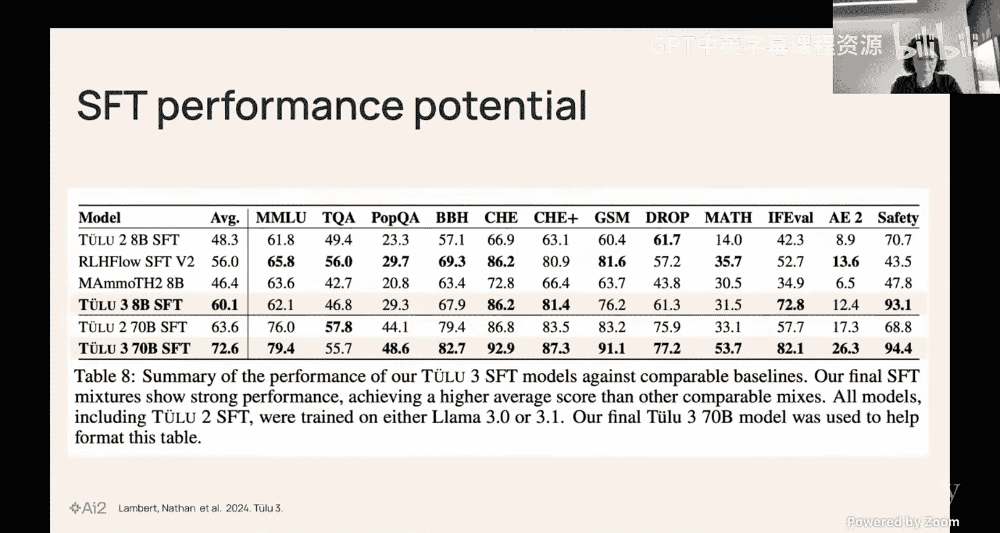

现在，我们查看了所有可用的数据，并开始进行两个可重复的并行轨道：收集数据并混合它们，以便在我们关心的能力上获得高准确率。这需要大量努力，因为例如，如果我添加大量诗歌生成数据，我的数学推理能力可能会下降；如果我添加大量数学推理数据，我可能会失去像诗歌生成这样的创造性任务。因此，保持所有这些数据的良好平衡以在各方面获得高准确率是一项相当具有挑战性的任务。我们和社区都在探索许多不同的数据混合方法，包括手动经验分析、自动混合等，该领域有很多活跃的研究。

让我展示一下我们在Tulu 1中如何进行数据混合的一些努力。首先，我们结合了当时所有可用的开源数据集。其中一些是由人类、公众或专家创建的，另一些是由当时最成功的语言模型合成的。然后，我们开始查看针对特定能力进行评估的数据集。例如，这是我们在聊天类型评估集上进行微调的结果。红色表示结果不佳，蓝色表示结果成功。我们看到，当使用思维链数据训练时，我们在推理类型评估集上看到了更高的数字。

现在的问题是如何结合它们，如何取所有这些世界之精华。因为我们看到像ShareGPT或Self-Instruct这样的数据在聊天方面表现良好，但在知识或推理类型测试中表现不佳。因此，取所有这些世界之精华非常重要。

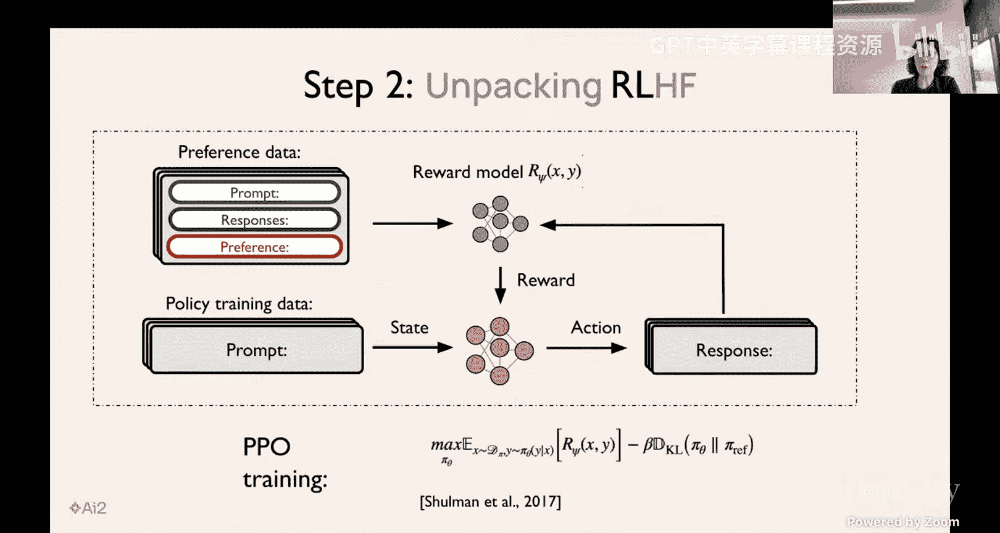

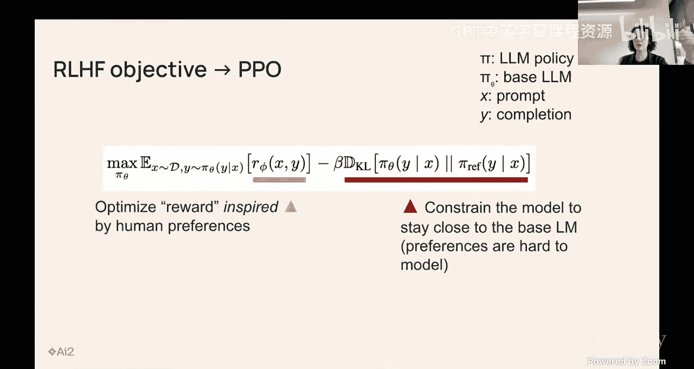

我们尝试查看在其中一个垂直领域显示高数字的数据集，并开始组合它们。结果，我们得到了一个人工加合成的数据类型。我想强调的是，我们早期在ShareGPT上看到了非常好的结果，但由于许可证和数据收集方式的问题，我们在下一个版本中放弃了这些数据。

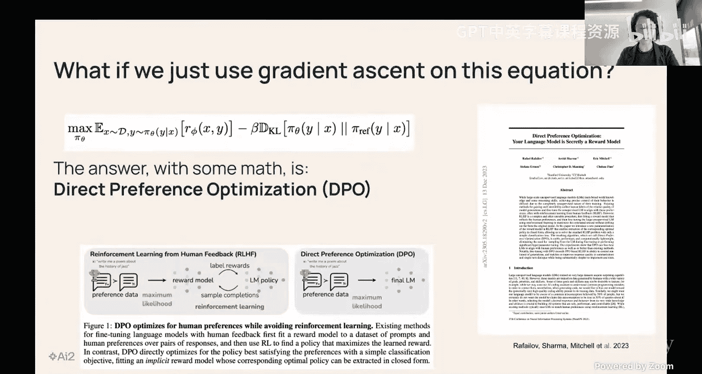

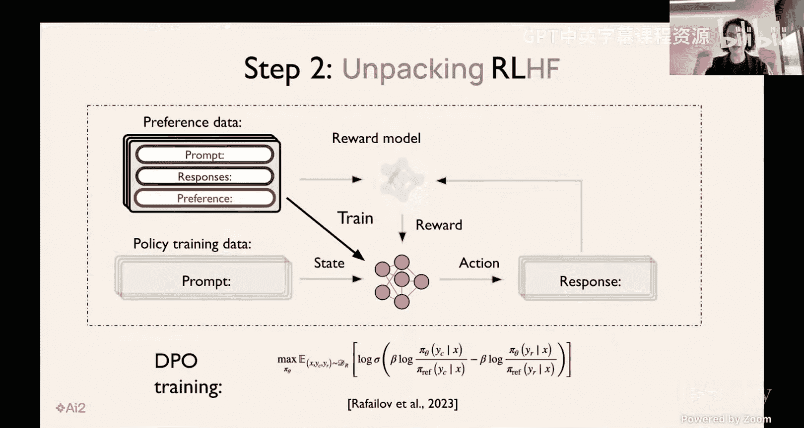

#### 深入探讨：推理数据

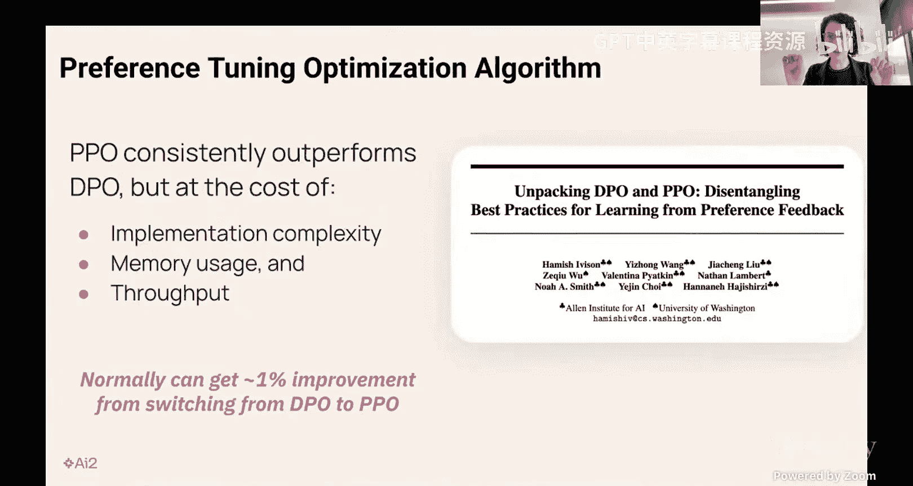

现在，重点讨论推理，我想更深入地探讨哪种类型的数据对推理特别有用。为什么这具有挑战性？让我举一个数学例子。问题是：“一家商店有‘买二送一’的衬衫促销活动。每件衬衫售价25美元。如果Sarah想买7件衬衫，她需要花多少钱？”一个快速的答案可能是125美元。然而，如果我仅用这种输入-输出设置来微调模型，我可能无法从这次训练实例中获得太多收益。我们和社区都观察到，如果我们开始整合和使用这种思维链输出，效果会好得多。我们逐步分解问题，就像向孩子解释如何遵循步骤得出最终数字125一样。

总结一下，为什么我们认为思维链数据有助于推理？它帮助模型更容易地处理复杂的多步骤问题，也揭示了模型的推理过程。此外，许多模型在预训练期间已经见过大量这类思维链数据，这有助于在遇到更复杂的数学推理问题时“唤醒”这种逐步思考的能力。当我们查看这类标注时，思维链数据也使得发现逻辑错误变得更容易，并且它类似于我们向人类解释事物的方式或人类的思维过程。

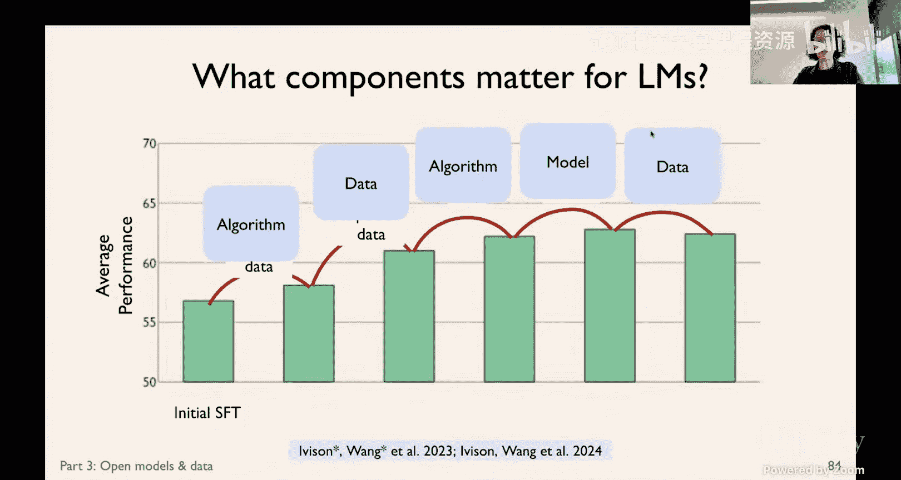

然而，获取这种思维链数据的人工标注正变得越来越具有挑战性：它耗时、昂贵，并且通常需要专家标注。显然，它难以扩展，并且多样性不足。因此，我们的解决方案是混合数据策划，即从现有资源中查看数据混合和选择。我们还观察到文献中一篇非常有趣的论文，他们提出使用不同的“角色”来生成多样化的数据。其思想是，我们查看不同的技能（如数学、编码、精确遵循指令），然后设计不同的角色，并要求模型根据该角色为这些技能生成数据。这将确保高多样性并使我们能够进一步扩展。

我们设计了这样的提示：“我们希望以特定角色为背景创建数据。”例如，“我们希望为化学动力学研究人员创建一个数学问题。”然后问题看起来就像：“Smith博士，一位化学家，正在研究……”我们尝试了许多不同的角色，为专家、六岁儿童、计算机科学家和音乐家等设计这类数学问题。通过这种方式，我们创建了超过15万个困难数学问题和5万个小学数学问题，以及3.5万个Python编码和精确指令遵循问题。然后，我们使用GPT-4和Claude的组合来生成逐步解决方案。

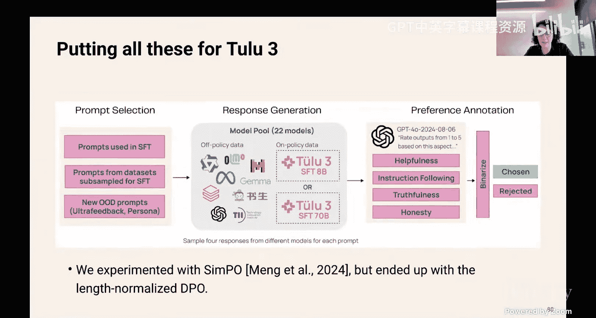

现在让我们看看结果。下图显示了在两个数据集（MATH和GSM8K）上的结果。每个条形图显示了使用我们的公共数据集与这些角色驱动的合成数学问题的组合。我们改变了实验中角色驱动数学数据的数量。第一个黄色条形图仅使用通用公共数据，最后一个条形图大致是角色驱动数据和通用数据的50/50混合。随着时间的推移，我们看到在MATH数据集上 mostly 有改进，在GSM8K上改进较少。我们认为原因是GSM8K是更简单的小学数学应用题，可用的公共数据集已经足够好，因此我们没有获得太多收益。总结：添加更多角色驱动数据 consistently 提高了数学性能，GSM8K也有所提高，但幅度小得多。

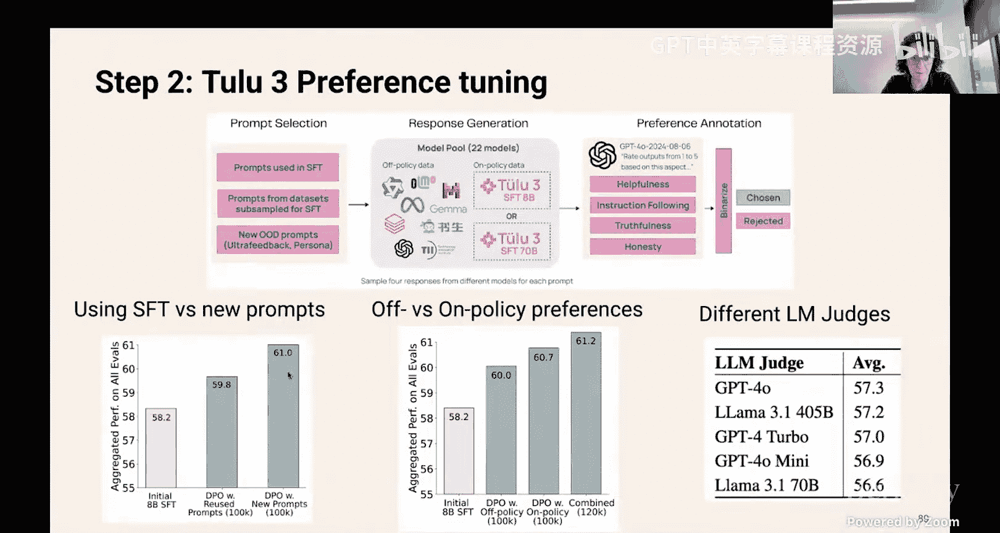

我们还进行了另一步骤来过滤数据。对于每个合成生成的单词问题或实例，我们实际上让GPT-4生成多个推理路径，然后进行自洽性检查。我们基本上查看了哪个路径获得了多数票，并保留了那些能给我们更好答案的推理路径。通过这种方式，我们过滤了大量数据（几乎40%），现在看到仅使用60%的数据，我们在数学上获得了相似的性能。我们在GSM8K上看到了更显著的提升，突出表明使用这种更好的过滤数据，我们在GSM8K上获得了更高的准确率。

研究社区中还有许多其他生成思维链数据的方法：一种是人工标注，这很好、非常准确，但规模有限；另一种方法是将数学问题转换为Python代码，然后通过执行生成解决方案，这很好，因为它通过执行保证了正确性，但问题是不太自然；还有这种自生成思维链的方法，可扩展到许多问题，但其质量很大程度上取决于基础模型。我们结合了所有这些方法。

将所有内容放在一起，我详细讨论了我们如何为数学和推理创建和策划这些合成数据。然后我们将所有这些放在一起，构建了用于监督微调的数据混合，结果是人工和合成数据的结合，我们最终构建了SFT混合数据。

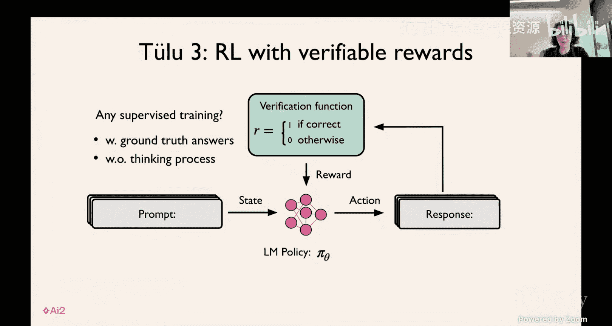

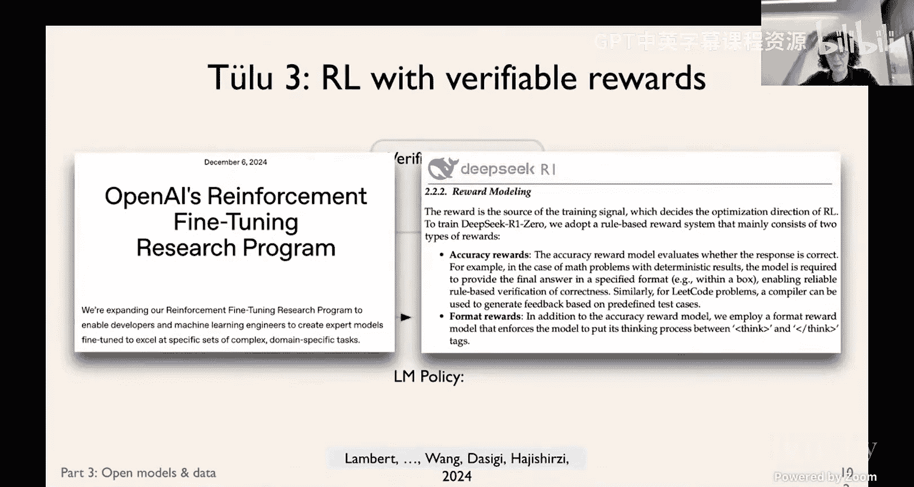

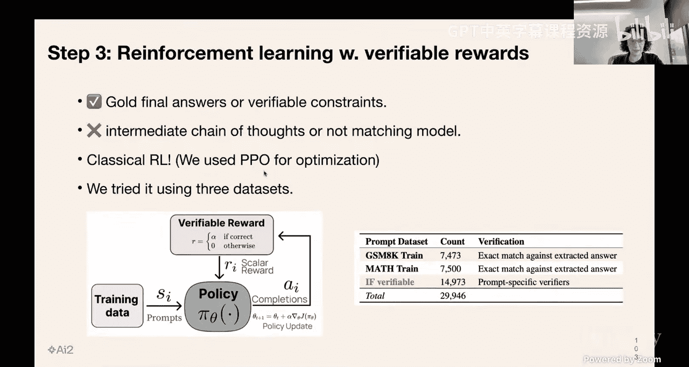

让我们讨论一下结果。这个表格有很多数字，但我想展示我们进行的一些消融实验。列显示了我们评估的许多不同数据集，它们评估了我们关心的一些核心技能。这是我们发现的最终SFT混合数据的结果。这些是一些消融实验：例如，如果我们移除WildChat（我们用于通用聊天能力的数据混合方法），我们的平均值会下降到58.9，在聊天评估上下降最大。或者，如果没有角色数据，我们得到58.6，在数学等方面有所下降。如果我们移除数学数据，我们会在这类数学评估上看到非常显著的下降。我们非常注意的另一件事是确保我们的模型安全，因此我们添加了安全数据，但同时要确保它不会降低模型的通用能力。我们观察到添加安全数据不会损害模型的通用能力。这里还将Tulu SFT数据与社区中其他可用的数据集（如Mammoth数据或RLHF数据）进行了比较，这些是社区中存在的一些最流行的数据集，我们看到了显著的增益。

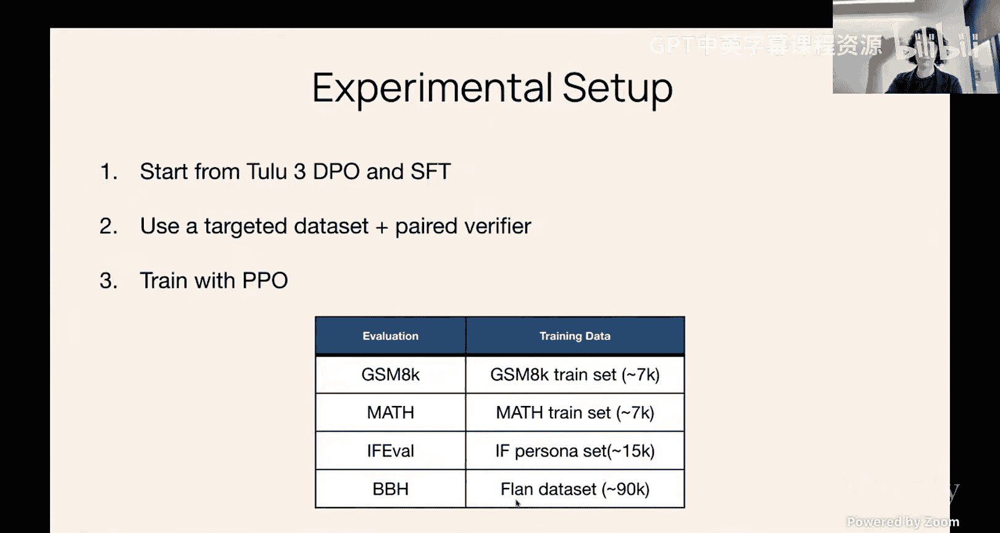

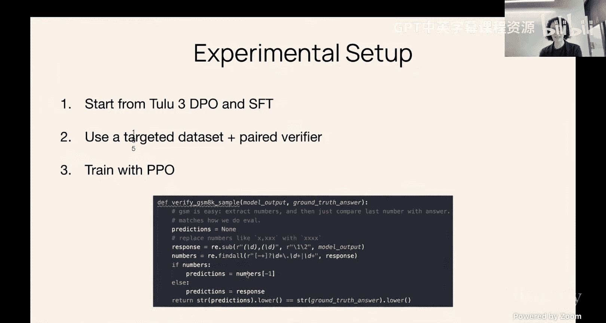

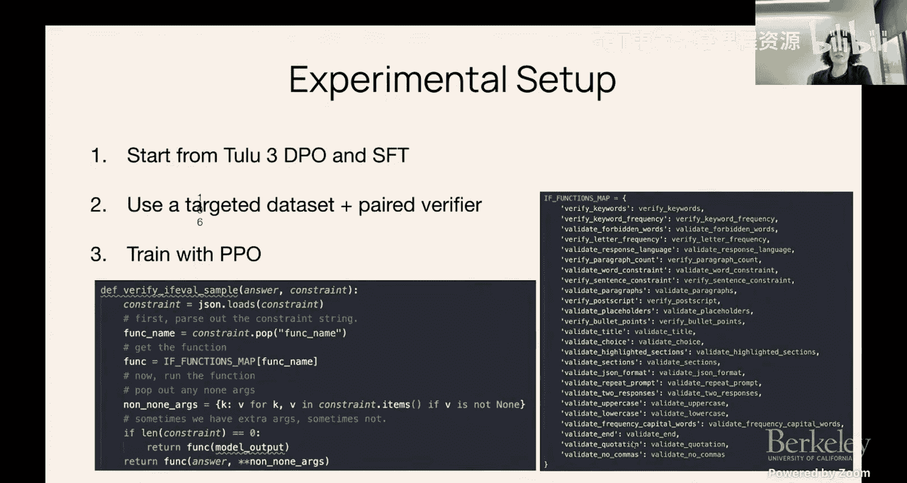

总的来说，我们认为这是一个非常好的混合。这里还可以做更多工作，如果开源社区的人们也开始改进这个数据混合，那将是非常好的。

#### 第二步：偏好调优

第一步完成了，我们获取了基础模型，然后用精心策划的数据混合进行了监督微调。下一步是偏好调优，它使用奖励模型。

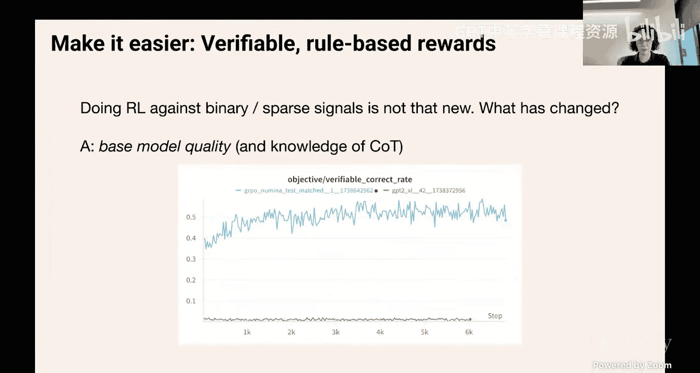

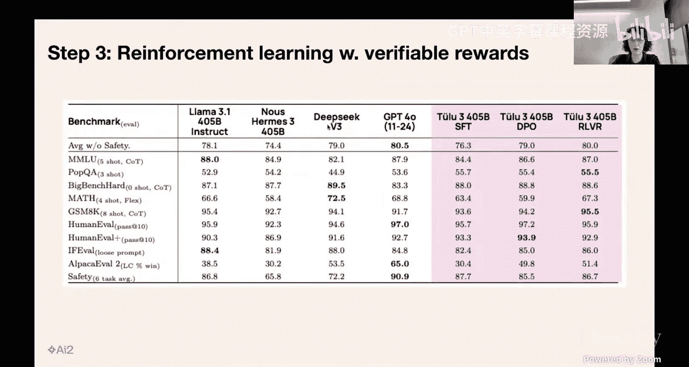

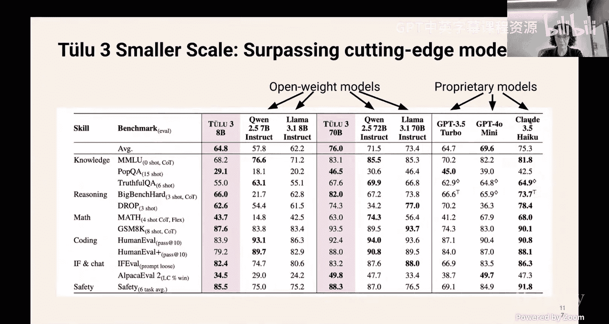

在偏好微调阶段，目标是与人类偏好对齐。例如，我们有这个查询：“写一首关于AI的俳句。”模型输出一些内容，我们想根据输出好坏给出点赞或点踩。但在实践中，我们观察到偏好微调是为了显示非常强的训练信号，以改善聊天风格，并在聊天类型评估上显示出更高的改进。它也在持续改进我们目标的基本能力，但总体上，我们看到对于数学类型能力的绝对改进幅度较低。

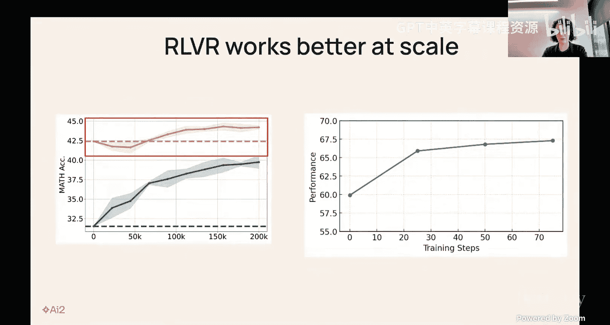

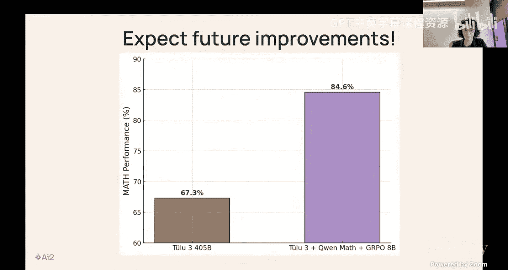

让我们更深入地看看偏好数据的样子。我们有一个提示，比如“用几句话向一个六岁的孩子解释登月”。我们希望模型生成两个响应，然后偏好实例告诉我们一个响应比另一个更好。它可以由人类标注，说明哪个响应更适合六岁的孩子。最近，人们研究所谓的“AI反馈”，即用另一个AI模型（如GPT-4或Claude）来评估哪个响应更适合六岁的孩子，然后在某种程度上更新算法的过程有时被称为“AI反馈”。

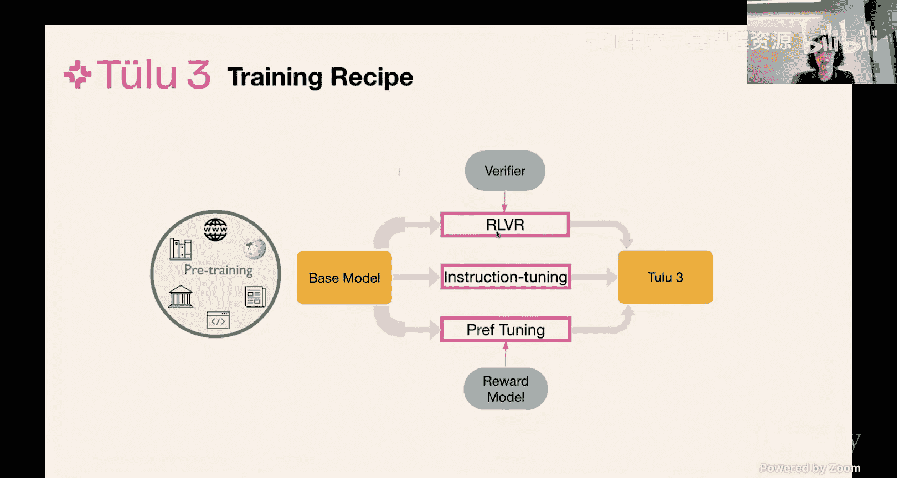

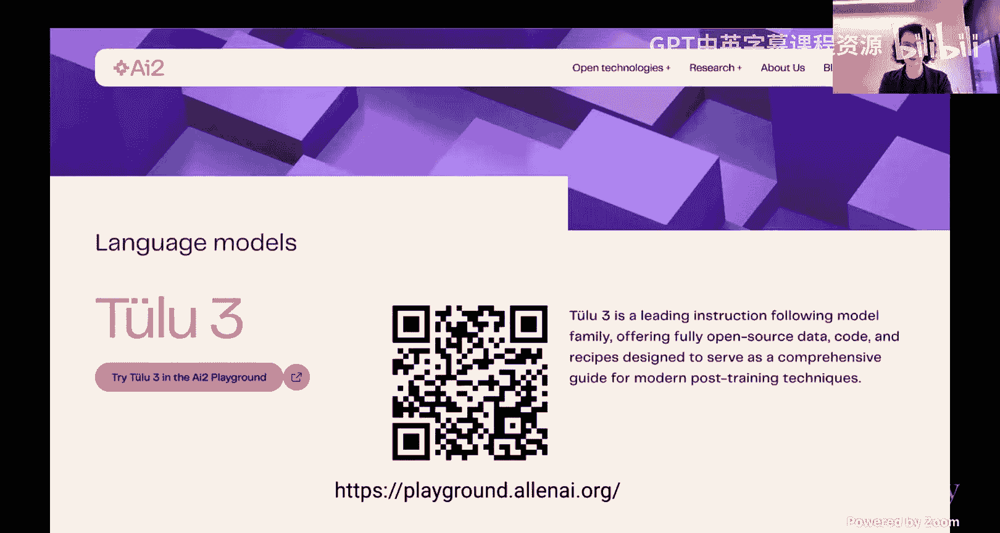

为什么这些数据在构建和改进后训练阶段中扮演重要角色？因为在许多情况下，我们处理的是开放式生成，很难给出绝对数字来说明一个响应是好的。然而，处理比较则容易得多，可以说这个响应通常比另一个更好，因此标注任务变得容易得多。

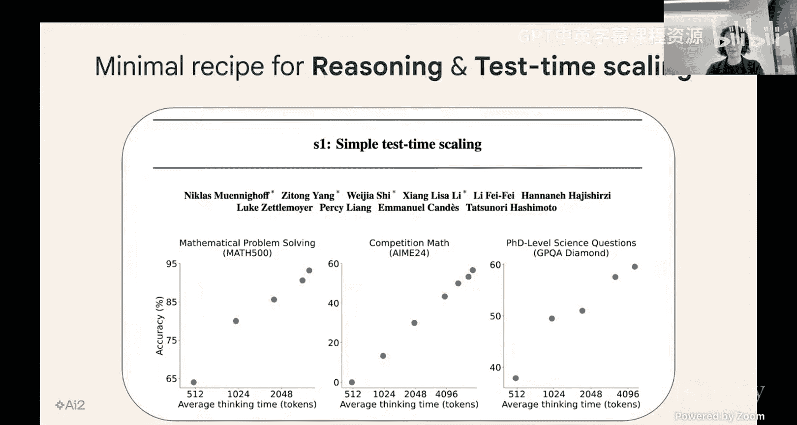

但我们不能使用相同的监督微调算法来处理这种偏好数据。现在让我解释一下RLHF（基于人类反馈的强化学习）如何整合和使用这种偏好数据。我们将使用强化学习。其思想是，对于给定的策略（生成下一个词元），我们生成下一个词元，与环境交互，如果生成的词元好或坏，我们从环境获得一些奖励，然后更新世界状态。在RLHF中，状态从输入策略的提示中更新，动作是更新和找出哪些响应是好的，然后环境实际上是一个奖励模型，它告诉我们一个模型如何尝试提升，以表明这个响应通常比另一个更受偏好。

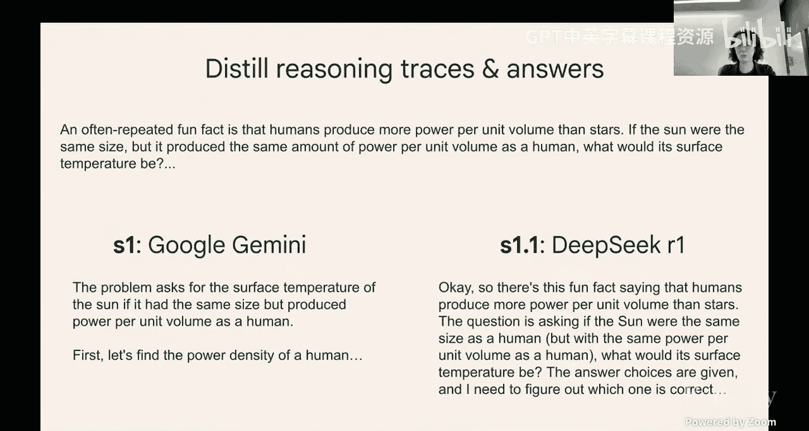

我们如何通过PPO训练来优化这种复杂情况？其思想是我们希望最大化奖励，同时约束模型尽可能接近基础语言模型。这是在确保你与提供给你的偏好对齐，但又不会偏离你心目中的原始模型之间建立非常重要的平衡。

在过去一年左右的时间里，引入了许多优化该目标的不同变体。去年我们有了一篇名为“直接偏好优化”的论文，其思想是，如果我们直接在这个方程上使用梯度上升会怎样？让我们忽略所有这些，现在我们有了这个奖励模型，然后我们想优化那个奖励，让我们直接优化人类偏好，然后将其建模为一个排序模型。

DPO训练是这样的，我们在这里移除了很多细节，直接从偏好数据进入策略，然后给定那个参考，我们想看看这个偏好数据与策略有多接近。

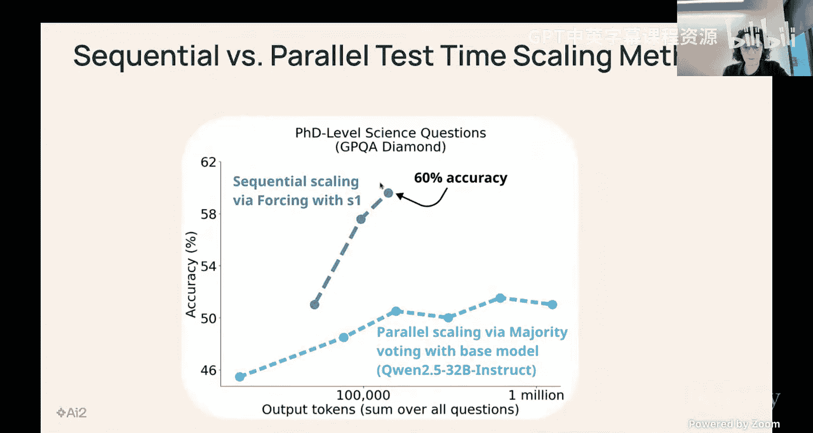

还有许多新的DPO变体被引入。我在这里总结一下：这是原始的PPO公式，这是直接偏好优化，它直接根据偏好数据优化策略，我总是将其视为某种排序目标。然后是像CPO这样的新变体，它甚至更简化，不使用参考模型。另一个变体如长度归一化DPO，它对似然进行归一化，但针对长度进行归一化。

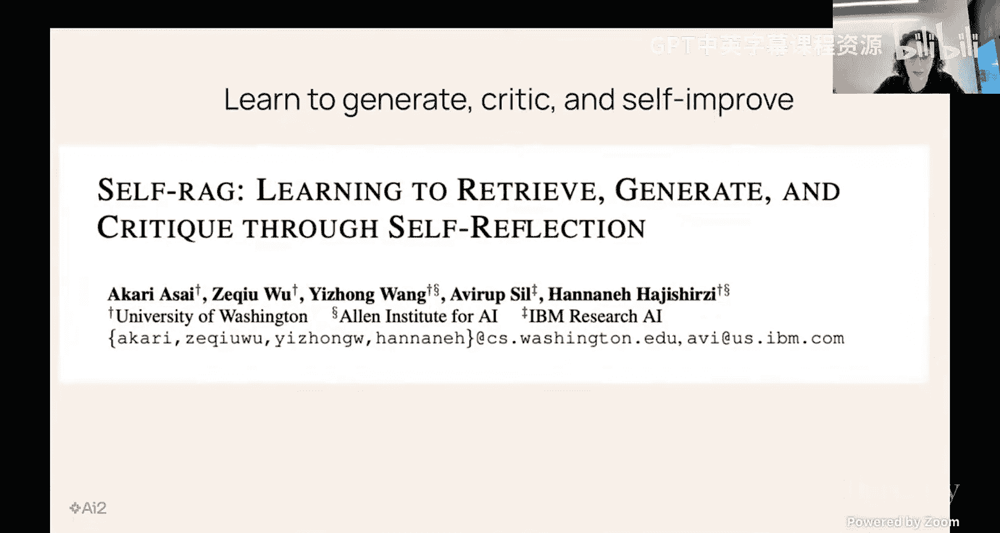

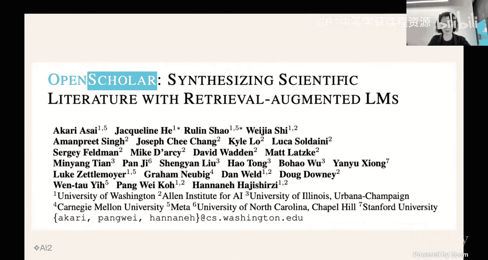

这些方法如何工作？我们开始更深入地研究所有存在的这些算法，特别是比较DPO和PPO。它们都不同，获取不同类型的参数，具有不同的实现复杂性、内存使用、吞吐量等。总体而言，我们看到PPO在几乎所有情况下都优于DPO，然而，它实现和使其工作起来要复杂得多，特别是对于更大的模型。因为对于PPO，我们需要运行两个模型：奖励模型作为一个神经网络，以及策略模型（实际生成词元的语言模型）。因此，这真的取决于开发者的偏好和他们拥有的约束条件。

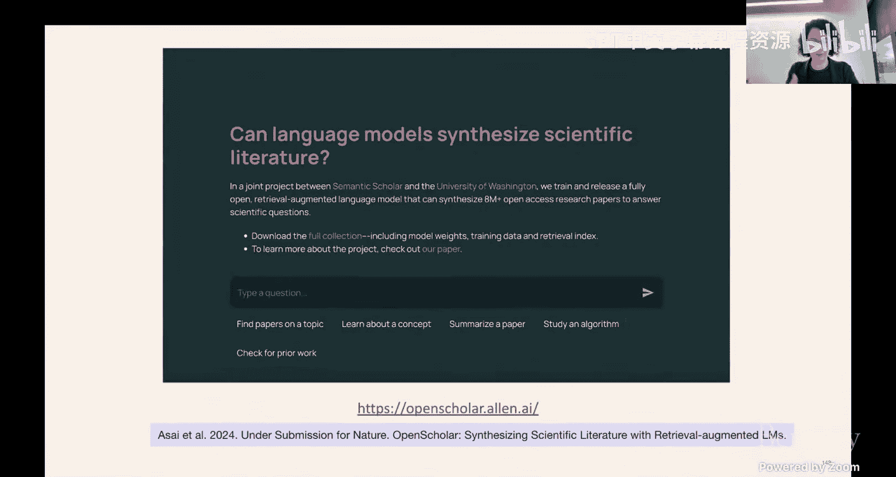

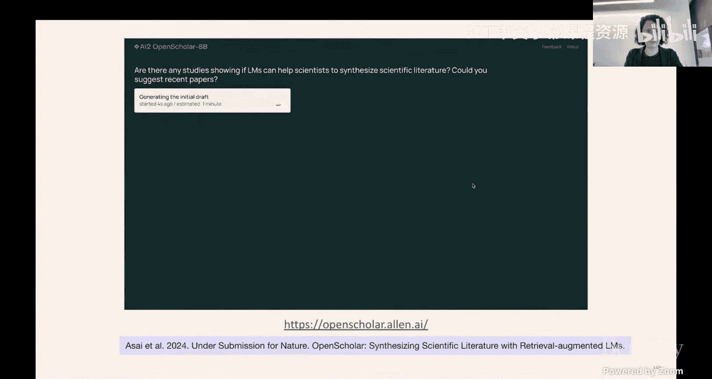

让我更深入地告诉你我们进行了哪些消融实验以确定使用哪种模型。对于DPO，我们有偏好数据和策略模型；对于PPO，我们有所有这些组件：偏好数据、那种奖励模型、我们在这里有的神经网络、生成内容、提示和策略模型。我展示最终结果，不深入细节。这是初始SFT结果。当我们使用某种较弱的偏好调优进行DPO时，我们看到了2%的提升。当我们进行大量消融实验和非常仔细的偏好数据策划时，我们看到了显著的提升，从56到61，仅通过更好的数据选择和策划。然后我们用PPO替换了DPO。我们使用了完全相同的数据，只是将算法从DPO替换为PPO，我们在这里看到了1个点的提升。然后我们认为，这非常有希望。PPO很棒。现在让我们考虑一个更大的奖励模型，因为奖励模型扮演着环境角色，我们试图使我们的模型尽可能接近这种偏好数据。当我们开始使用更大的奖励模型时，我们没有看到太多改进，大约不到半个点的改进。最后，当我们开始混合针对某些任务的特定设计提示时，平均而言，我们没有看到太多增益。然而，我想强调的是，这最后一步平均而言没有显示出太多改进，但非常有趣的是，当我们只关注推理（特别是GSM8K）并开始引入对提高推理能力非常有用的提示时，我们在这里看到了显著的提升。我们了解到，当我们为某些能力引入领域特定的提示时，它们扮演着非常重要的角色。所以，如果你看整个事情，这是算法的选择，这是数据、算法、模型的选择。我们再次在数据上看到了非常大的提升。

从这些中得出的要点是：构建一个非常好的偏好调优算法的最重要因素是高质量的数据。PPO比DPO效果更好，但DPO在实验和数据消融上要便宜得多，并且对于开发来说更实用。扩展奖励模型有帮助，但不显著。使用领域内提示会产生性能增益，特别是对于推理等领域。

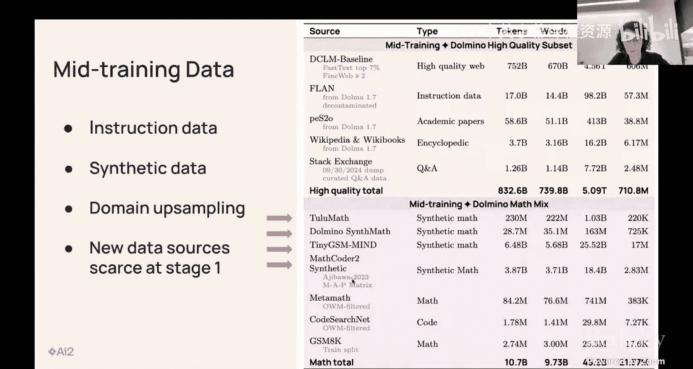

#### 第三步：带可验证奖励的强化学习

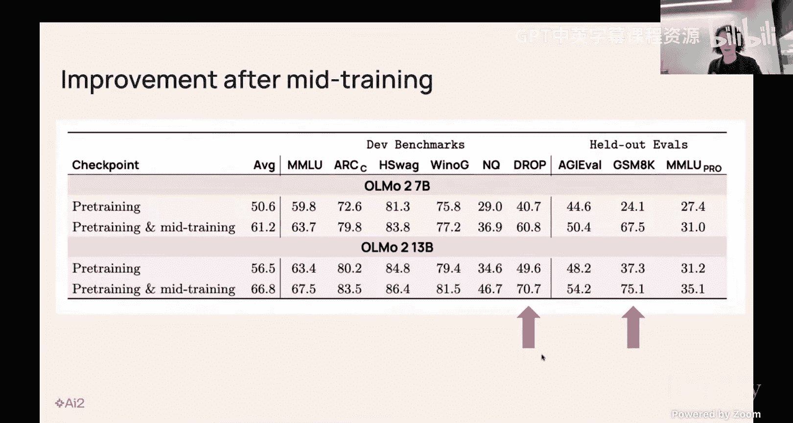

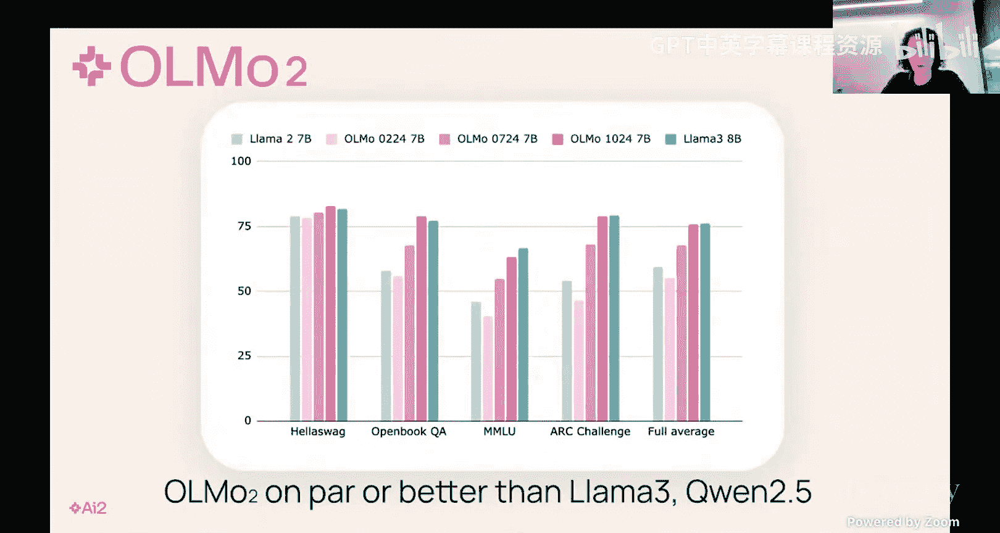

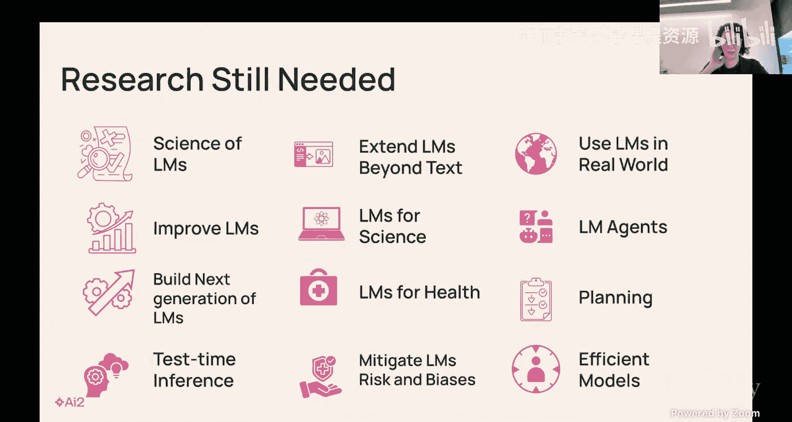

现在我们将所有这些放在一起构建Tulu 3。从我们最后的研究中我们了解到提示选择非常重要，因此我们查看了许多关于如何策划数据的组合，这是我们最好的混合：我们想使用一些在SFT中已经使用的提示，我们认为这对于保持准确性和性能非常好。我们还引入了一些在SFT期间未见过的新提示，然后我们开始引入领域外提示，例如来自我们在SFT中未研究的领域。然后我们从所有这些模型生成了大量响应，从像Llama 7B、OLMo 7B这样的较弱模型，一直到像GPT-4这样的非常强大的模型，因为我们想查看偏好，看看哪些输出更受偏好。重要的是，我们引入了策略上数据，因为我们想改进我们的Tulu 3 SFT模型，所以我们确保引入一些这些数据点和Tulu 3的完成文本，以便我们可以说这个结果比更差的结果更受偏好，或者我们需要达到更好的结果，例如GPT-4的结果。