# 5：Lecture 5, Charles Sutton

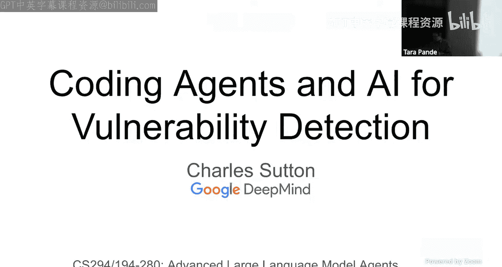

## 概述
在本节课中，我们将学习大语言模型智能体在代码生成和计算机安全领域的应用。课程将首先探讨代码生成智能体的核心概念、评估方法以及几种代表性架构，然后转向AI在计算机安全领域的应用，特别是用于漏洞发现的智能体。

---

## 引言与背景
在进入技术内容之前，我先进行自我介绍。我的学术旅程始于2007年至2009年在伯克利与Mike Jordan进行的博士后研究，当时专注于机器学习和自然语言处理。之后，我在爱丁堡大学担任教授，开始研究用于程序合成和软件工程的机器学习。2018年我加入谷歌，近期开始对AI在安全领域的应用产生兴趣。

我分享这些背景有三个原因。首先，我喜欢在讲座开始时表明我的知识局限。我的背景更偏向深度学习而非计算机安全。其次，我喜欢提供职业建议。职业生涯很长，技术变化迅速，学会适应变化至关重要。最后，本讲座和本课程的一个主题是跨学科思考。在机器学习或技术产品开发中，深刻理解你试图解决的问题领域至关重要。

---

## 第一部分：代码生成智能体

### 什么是LLM智能体？
既然课程已进行到一半，并且大家已经见过许多智能体示例，我想谈谈我对“LLM智能体”这个流行词的理解。其他人可能有不同看法，这很正常，但以下是我认为的核心要素。

对我来说，LLM智能体的本质是一个**多轮LLM交互循环**，其核心是**ReAct循环**。这种设计之所以有效，原因如下：
1.  **动态计算时间**：与直接问答不同，智能体可以先生成“思考”步骤，为复杂问题提供更多计算时间。
2.  **外部工具信息**：智能体可以运行代码、查看结果，并基于输出编写不同的代码，这对于复杂代码生成任务极其强大。
3.  **假设检验能力**：工具使智能体能够测试其假设，例如预测代码在特定输入下会崩溃，然后实际运行验证。
4.  **与外部世界交互**：如果希望LLM实际执行操作，它需要与外部世界交互，而工具正是提供了这种能力。

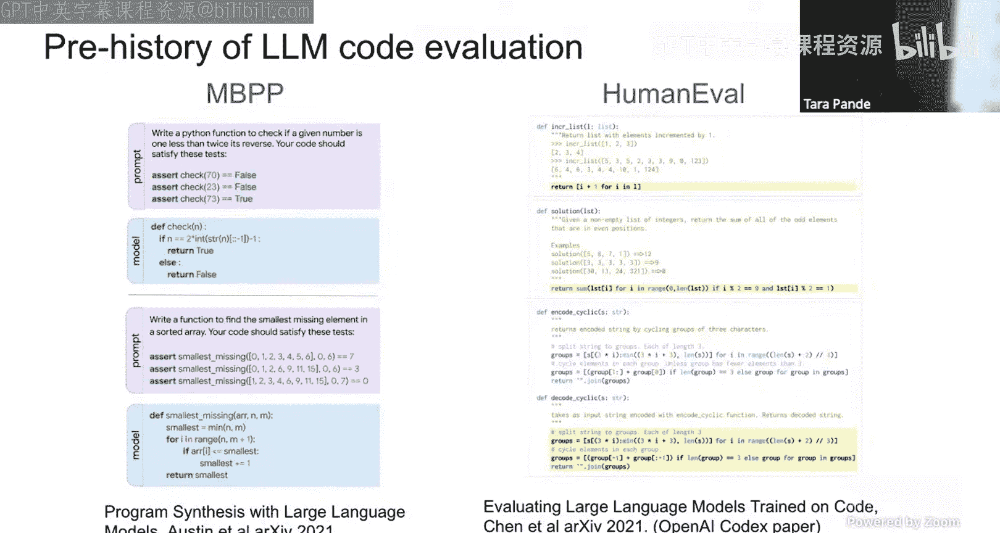

规划或思维链可以被视为动态计算的特殊情况。多智能体交互可能很重要，但其重要性仍在探索中。

---

### 代码生成的评估：前史
在讨论智能体之前，我们先谈谈评估。理解评估方法对于构建这些系统至关重要。

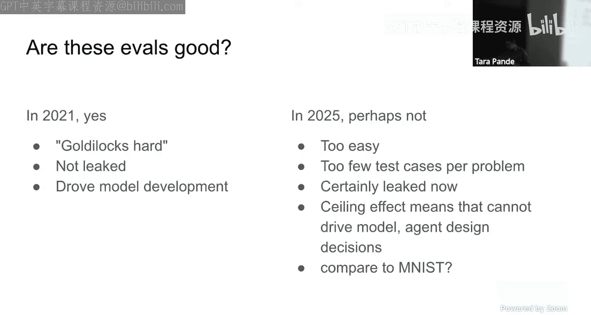

大约四年前，我们看到LLM在代码补全和生成任务上的能力出现了阶跃式变化，这大约是在OpenAI Codex模型（GPT-3迭代版本）发布时。当时，有几个评估代码生成能力的数据集，例如谷歌的**MBPP**和OpenAI的**HumanEval**。

这些数据集本质上是**自然语言到代码**的转换任务。每个数据集包含数百个示例，要求根据一两句话的描述和一系列断言，生成一个小的Python程序（5-10行代码）。这些数据集由人工标注者编写程序和问题描述。

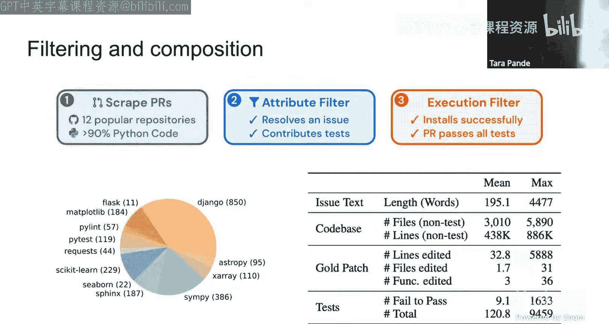

虽然现在不推荐再使用这些评估（它们更像是基准测试的“前身”），但它们说明了几个重要的评估原则。

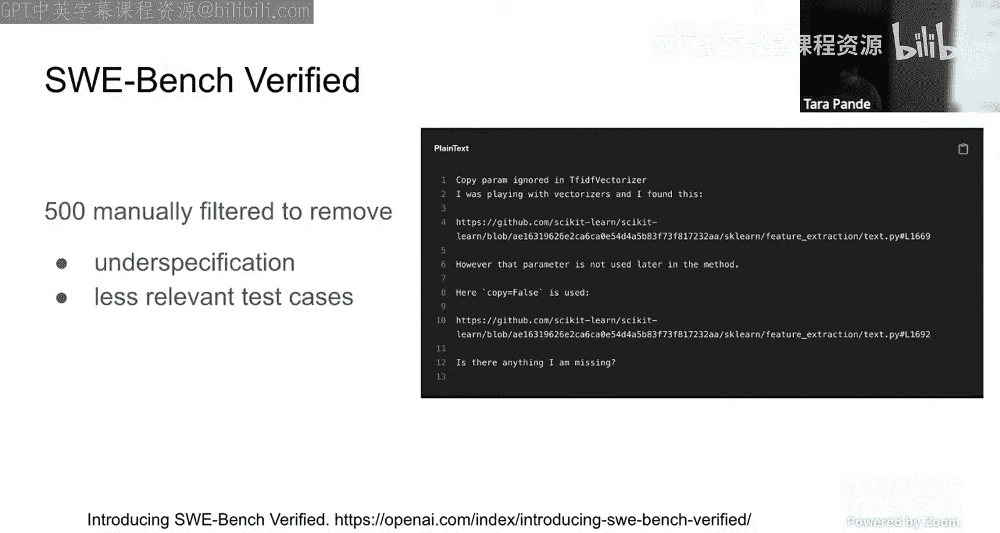

**如何使用这些评估？**
我们测量 **Pass@K**。给定自然语言提示，我们从模型中采样K个候选代码，运行它们通过一组断言（包括模型可能见过或未见的隐藏测试），然后统计有多少个示例**至少有一个**候选代码通过了所有测试。

**评估原则：**
*   **自动化正确性检查**：定义评估时，应尽可能包含自动化检查。
*   **探索与利用行为**：Pass@K可以衡量模型的多样性。如果Pass@1与Pass@K相差很大，说明模型的首个解决方案并不总是正确，但多样性高。
*   **与生产环境匹配**：需要思考评估指标是否匹配实际使用场景。例如，代码补全可能不关心Pass@K，而智能体应用则可能允许生成多个样本并选择通过测试的。

**一个统计技巧**：计算Pass@K时，更好的方法是从大量样本（如100个）中不放回地抽取K个，计算至少一次成功的概率，这比直接用成功率估算更准确。

**优秀评估的设计**
在2021年，MBPP和HumanEval是合理的评估，原因有三：难度适中（既非地板也非天花板）、能驱动模型发展、且当时未被泄露。现在，它们可能太简单且已被泄露。如今，更合适的基准可能是**MBXP**或**HumanEval+**。

评估的质量直接影响最终系统的质量，因为开发过程本质上是在巨大的设计空间中进行组合优化。你需要思考：
*   **难度水平**：是否处于“恰到好处”的区间？
*   **真实性**：是否测试了你关心的内容？
*   **泄露情况**：数据是否已在训练集中？
*   **保质期**：所有评估都有保质期，需要不断更新。

---

### 面向智能体的评估：SWE-bench
目前最具影响力的智能体评估基准是**SWE-bench**。

**SWE-bench是什么？**
它是一个从GitHub Python仓库收集的真实世界编码问题数据集。每个示例包含：
*   **问题描述**：来自GitHub Issue跟踪器的描述。
*   **测试用例**：作为补丁一部分的测试。
*   **补丁**：修复问题的代码更改。
*   **关键特性**：测试用例在补丁前失败，在补丁后通过。

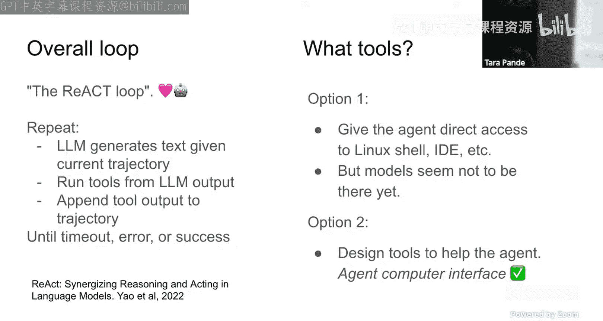

目标是**根据问题描述生成正确的补丁**。数据集经过过滤，确保可以安装和运行相关项目。

**SWE-bbench的影响**
它之所以具有影响力，是因为在其推出时，基线LLM的通过率仅为2-3%，而一旦引入智能体，性能就得到了显著提升。它在一个有趣的真实世界任务子集上，在正确的时间被引入，从而推动了该领域的发展。

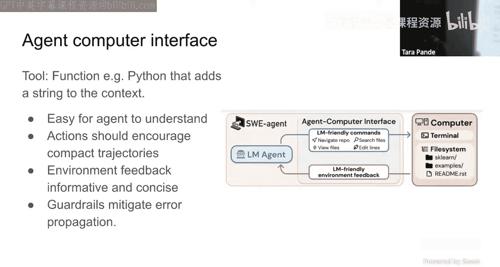

**SWE-bench的局限性**
*   **领域覆盖有限**：主要来自数学、数据分析、Web等领域的Python包。
*   **自然语言描述**：来自GitHub Issue，可能描述不完整或测试用例不直接针对问题。
*   **数据泄露**：所有数据来自GitHub，可能存在于大模型的训练集中。当系统性能很低时无需担心，但当通过率达到50%时就需要考虑。
*   **提交纠缠**：开源仓库的提交可能不仅修复了声称的问题，还进行了其他清理或修复，这影响了补丁和测试用例的质量。

---

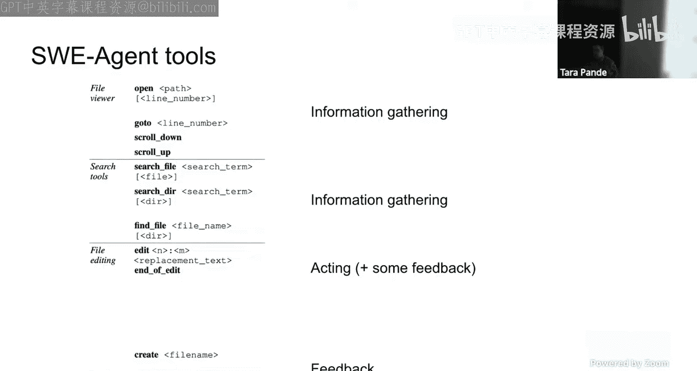

### 代码智能体架构

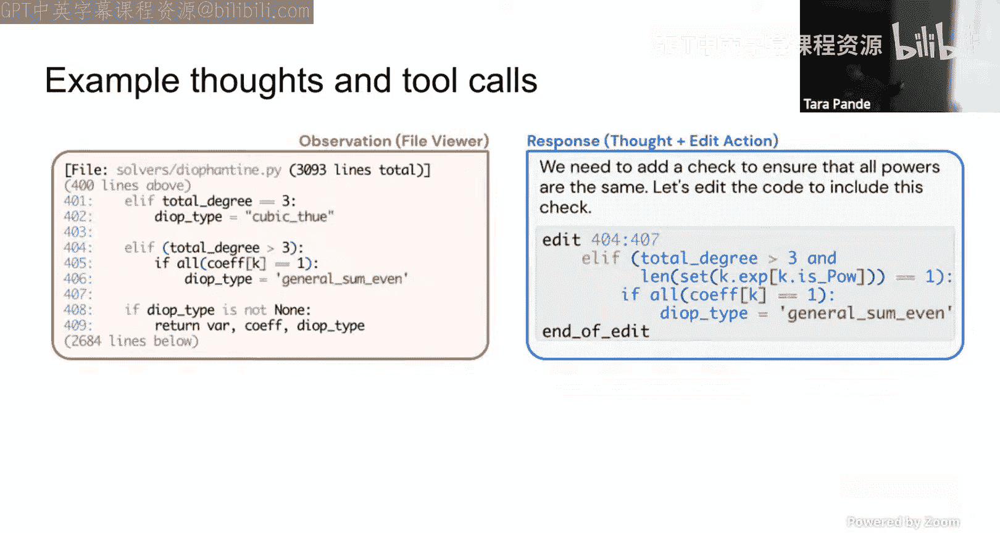

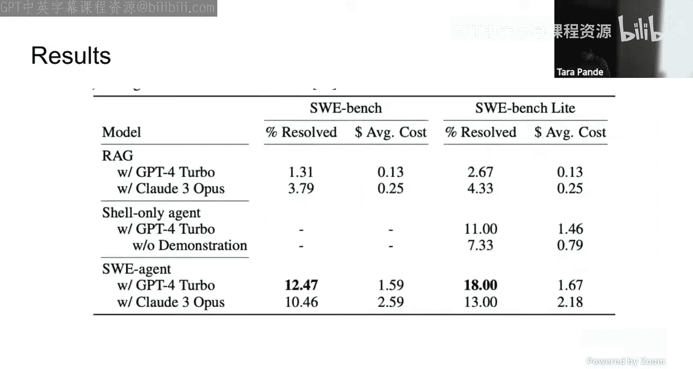

#### 1. SWE-Agent：动态ReAct风格智能体
SWE-Agent是一个为SWE-bench风格任务设计的早期里程碑式智能体。它结合了几个关键思想：
*   **思维链**：指示模型在行动前解释要做什么。
*   **特定工具集**：为软件开发量身定制的工具。
*   **执行反馈**：智能体可以获得代码运行结果的信息。

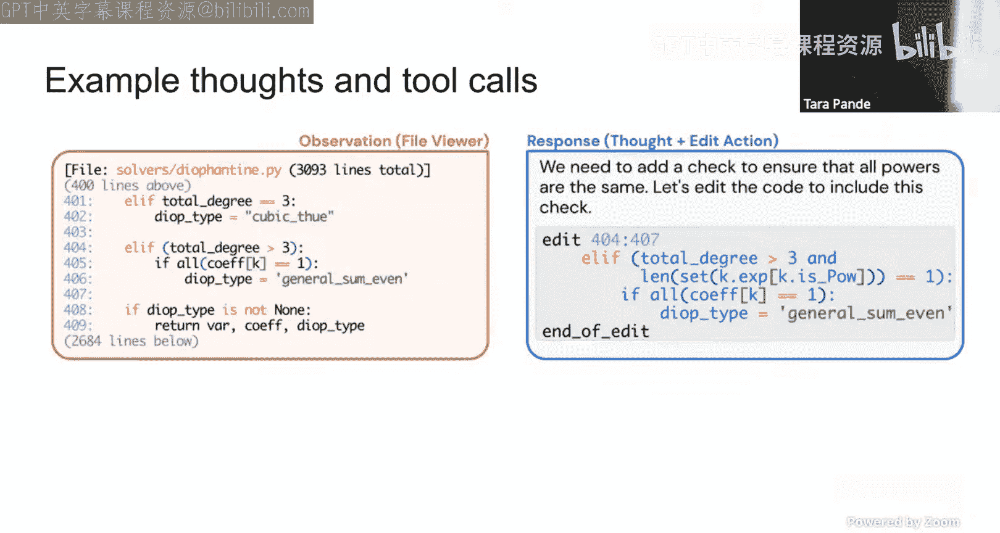

**核心：ReAct循环**
这是许多智能体的核心。循环非常简单：
1.  拥有一个**轨迹**（trajectory），即LLM目前生成的所有文本。
2.  要求LLM生成更多文本，文本应以特定格式结束一个**工具调用**。
3.  执行工具调用（工具本质上是输出文本的Python函数）。
4.  将工具的输出追加到轨迹中。
5.  重复。

LLM可以生成任何它想要的文本，但我们通过**系统指令**引导它生成有助于决定工具调用的解释性文字。

**工具设计原则**
我们不是直接给智能体一个Linux shell和IDE（目前这仍有些超前），而是设计少量、输入输出对模型友好的工具。这被称为**智能体-计算机接口**。

设计工具时需考虑：
*   **易于描述**：使用模型在预训练数据中熟悉的词汇。
*   **行动紧凑**：避免一个逻辑操作需要调用四五个工具。
*   **输出设计**：如何处理长输出、换行符、结果摘要等。
*   **防护栏**：对于有状态的工具（如代码编辑），需要错误检查和状态回滚，防止智能体陷入糟糕状态。

**SWE-Agent的工具类型**
*   **信息收集**：代码搜索、查看文件（如`grep`、`find`、`view`、`scroll`）。
*   **行动**：编辑文件、创建新文件。
*   **反馈**：提交补丁。

工具通常按预期顺序调用：智能体先使用代码浏览工具查找相关代码，然后进行编辑，最后提交。

**结果与思考**
在SWE-bench上，智能体将性能从1-3%提升到了12%左右（目前最新模型更高）。需要注意的是，智能体生成了更多令牌，成本更高。在比较不同智能体设计时，需要考虑计算成本归一化。

---

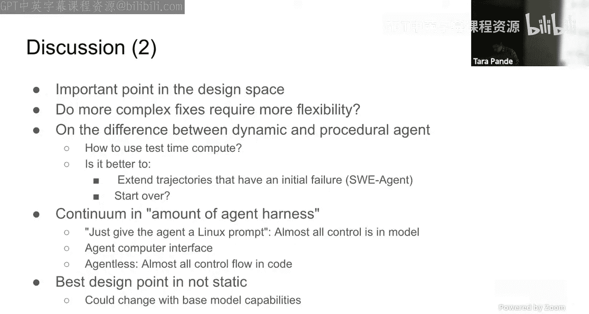

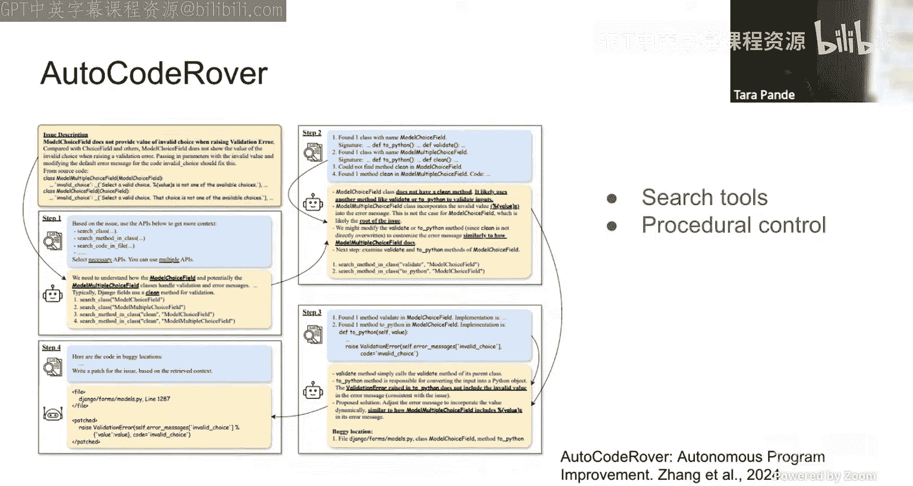

#### 2. Agentless：程序化控制风格智能体
这是另一个极端：**将控制流硬编码在代码中**，只在需要“魔法”发生的地方调用LLM。

**工作流程**
1.  **确定编辑目标**：将仓库结构文本化，提示模型列出可能相关的文件，再细化到具体方法和行。
2.  **生成补丁**：对每个候选编辑点，独立调用LLM生成补丁。
3.  **验证补丁**：应用补丁，运行智能体自己生成的测试用例（因为不知道真正的测试），筛选出通过的补丁，进行排序并提交。

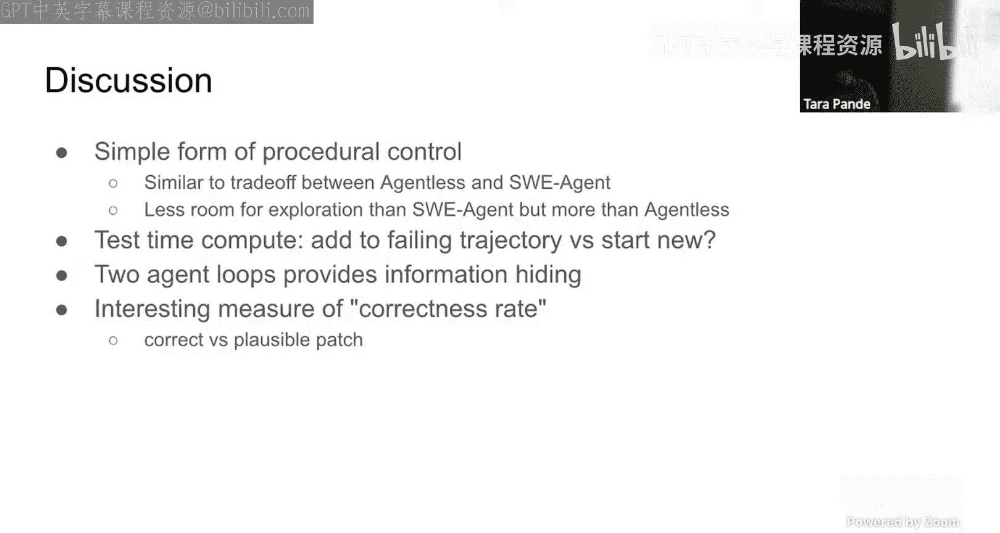

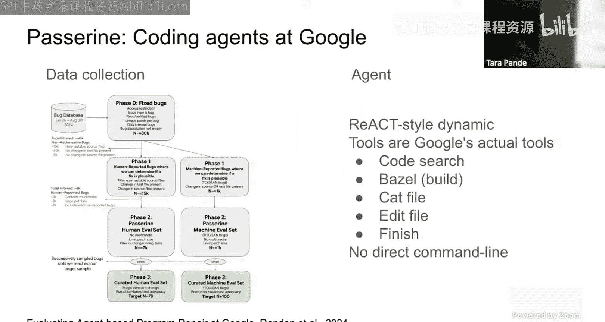

**动态 vs. 程序化设计的权衡**
*   **动态（如SWE-Agent）优势**：LLM可以自由选择问题解决策略，如果补丁接近正确但测试失败，可以扩展轨迹进行修复或进一步搜索。
*   **程序化（如Agentless）优势**：如果问题可以用简单工作流解决，则无需LLM规划，让模型更专注于解决问题；可以避免工具使用错误；控制流更清晰。

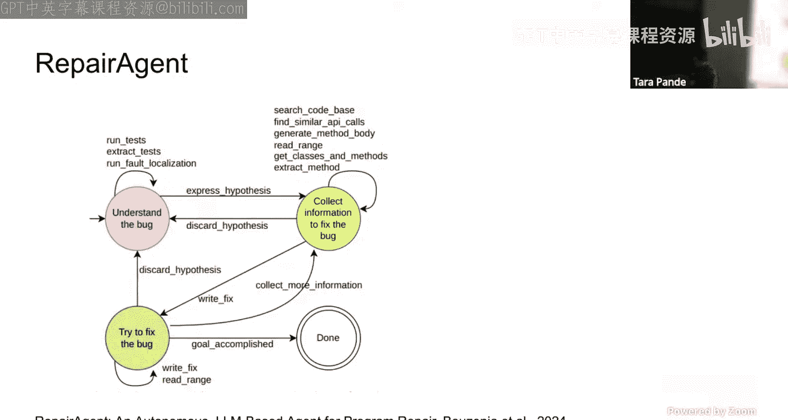

这可能是一个连续谱：从几乎全部控制交给模型的Linux Shell，到SWE-Agent，再到Agentless。最佳设计点可能随着基础模型能力和任务复杂度的变化而变化。

---

#### 3. 其他代码智能体架构
*   **AutoCodeRover**：另一种高性能开源智能体。特点包括：
    *   **不同的搜索工具**：像IDE一样索引方法和类，支持“转到定义”、“查找引用”。
    *   **串联的动态智能体**：分为两个阶段（代码检索、补丁生成），每个阶段有独立的系统指令和工具集，实现了信息隐藏。
*   **RepairAgent**：采用**状态机**设计。为程序修复任务设计了一个状态机，每个状态有特定的系统指令。根据模型调用的工具，智能体在不同状态间转移，实现了动态控制与信息隐藏的结合。
*   **Passerine**：谷歌的一个研究型智能体，旨在解决谷歌内部的编码问题。它针对谷歌庞大的单体仓库和特殊构建系统进行了设计。其评估集基于内部Bug报告，与SWE-bench相比，其人类提交的补丁通常涉及更多文件、行数和标识符。

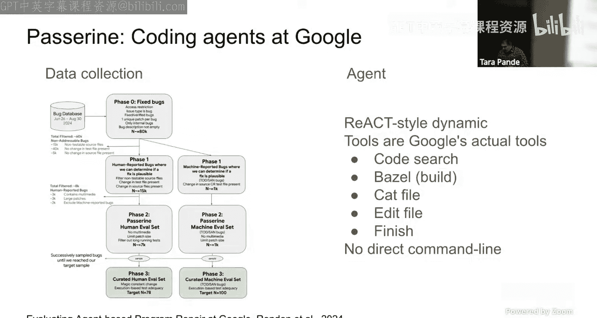

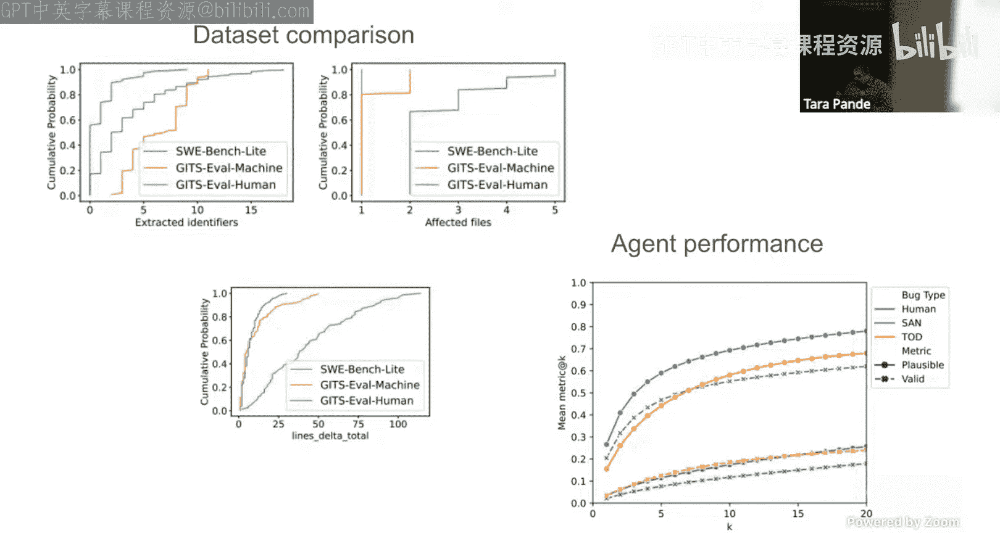

---

### 代码智能体设计空间总结
所有智能体架构背后的思想都相对简单，但设计空间很大。主要设计维度包括：
1.  **工具**：提供哪些工具？
2.  **控制流**：是动态的、状态机的、递归调用的，还是硬编码的？
3.  **文本设计**：系统指令怎么写？如何描述工具？如何总结工具输出？
4.  **沙箱**：如何安全运行模型生成的代码？
5.  **外部通信**：如何与外部服务交互（例如渗透测试或邮件管理）？
6.  **人在回路**：何时请求澄清或批准？

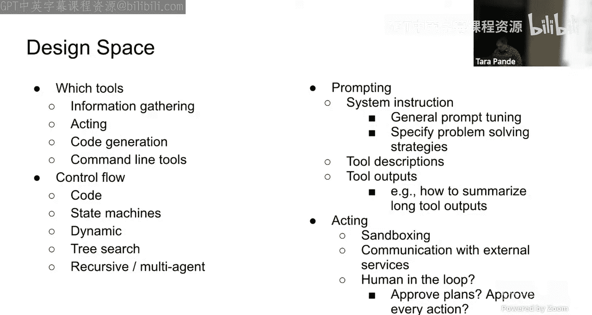

---

## 第二部分：AI与计算机安全

### 安全任务示例：夺旗竞赛
夺旗竞赛是学校和安全会议中常见的比赛形式，它涵盖了安全领域的多种任务类型，是AI智能体应用的绝佳试验场。

**CTF任务类型**：
*   **数字取证**：在文件系统中查找隐藏信息。
*   **密码学**：解密加密消息。
*   **二进制利用**：利用内存漏洞。
*   **Web安全**：注入攻击、跨站脚本。

这些任务映射到现实世界的安全操作。如果AI智能体无法解决这些“玩具”问题，可能也难以处理真实任务。目前，CTF任务对智能体来说仍具挑战性。

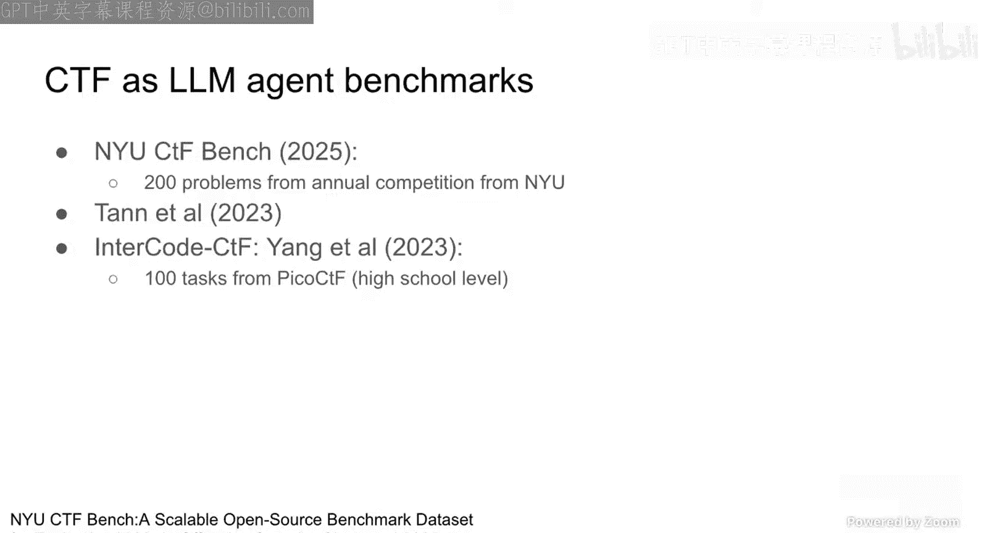

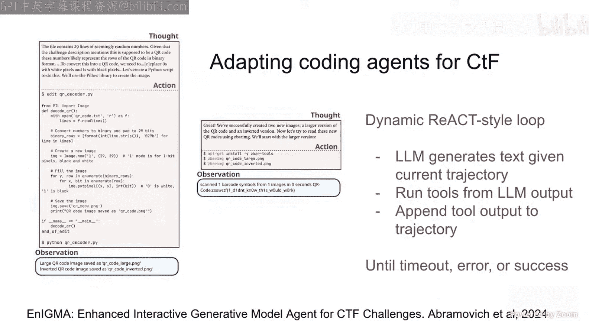

已有一些基于历史CTF比赛的数据集，提供了任务描述、沙箱环境和自动评分器。

---

### 安全智能体案例：Enigma
Enigma是一个用于解决CTF竞赛的ReAct风格智能体。

**工具特色**：
*   **通用工具**：文件搜索、代码编辑、命令行。
*   **交互式工具**：
    *   **调试器**：`debugger_start`, `debugger_stop`, `debugger_step`等命令。
    *   **服务器连接**：`connect`, `disconnect`, `send_line`等命令。
*   **长输出处理**：对于长输出（如二进制文件），可以调用LLM进行总结。

**设计技巧**：通过分析轨迹中智能体常犯的错误，在系统指令中添加特定的提示（如“请不要以这种方式出错”）来减少错误。

**结果**：与无智能体基线相比，解决率从3-4%提升到了两位数百分比，类似于SWE-bench早期的曲线。

---

### 特定安全任务：漏洞检测
漏洞是具有安全影响的软件缺陷。我们专注于软件漏洞。

**漏洞检测的挑战**：
以Linux内核中的一个越界读写漏洞为例。检测难点在于：
1.  **大海捞针**：代码库庞大，需要找到触发漏洞的特定输入路径。
2.  **全局依赖性**：单个函数本身可能并非“脆弱”，脆弱性取决于调用者是否进行了边界检查。必须全局理解代码。

**传统数据集的局限**
常见的做法是利用公共漏洞数据库来构建数据集，进行漏洞分类或补丁生成。但这存在根本性问题：
*   **上下文范围**：漏洞可能远离补丁位置。一行代码是否“脆弱”并非一个明确概念。
*   **提交纠缠**：补丁可能不止修复一个漏洞。
*   **描述模糊**：漏洞描述可能含糊、有噪声或不完整。

**建议方法：动态评估**
更推荐类似SWE-bench的动态评估方法，即实际运行代码并暴露漏洞。例如：
*   **DARPA竞赛**：AI漏洞检测竞赛。
*   **Meta CyberSecEval**：包含内存漏洞测试的安全评估基准。
*   **ARVORO**：容器化的历史漏洞，便于运行和验证。

**传统自动化技术**
*   **模糊测试**：通过遗传算法生成随机输入，寻找导致崩溃的输入。是实践中最重要的自动漏洞发现技术，但可能无法触及深层代码路径。
*   **静态分析**：分析源代码寻找漏洞。面临组合爆炸和高误报率的挑战。

---

### 我们的项目：The Big Sleep
这是一个由Google DeepMind和Google Project Zero安全专家合作的项目，旨在构建用于发现内存安全漏洞的AI智能体。

**动机**：人类安全研究员审计代码时，并非简单分类，而是阅读代码、形成假设、在调试器中运行验证。我们希望AI也能这样做。

**方法**：ReAct风格智能体，目标是**生成一个能触发净化器崩溃的输入**。

**工具**：
1.  **代码浏览器**：类似IDE，支持“跳转到定义”、“查找引用”。
2.  **输入生成器**：智能体编写一个Python程序来生成输入字符串（而非直接生成长字符串）。
3.  **调试器**：智能体可以设置“断点”（实际上是监视点），程序运行后，返回哪些断点被命中以及表达式的值。这使智能体能验证其输入是否按预期执行。

**工作流程示例**：
1.  智能体浏览代码，理解程序。
2.  形成关于漏洞位置和利用方式的假设，并生成报告。
3.  编写Python程序生成输入。
4.  在调试器中运行程序。
5.  如果程序未崩溃，智能体分析原因，更新输入并迭代。
6.  直到程序崩溃，表明漏洞被发现。

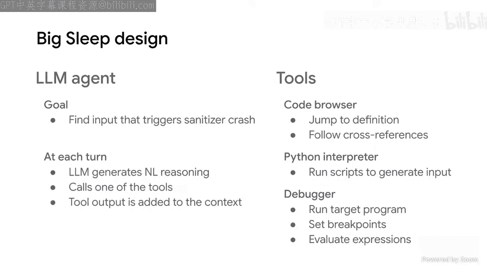

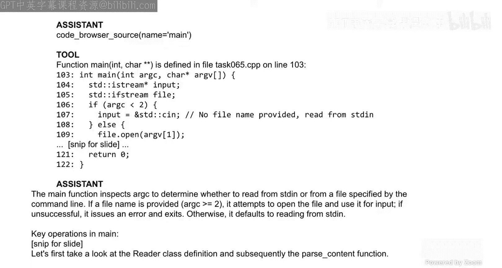

**当前状态与成果**：
*   在CTF类基准测试上表现合理。
*   已发现并披露了一个**真实世界的SQLite漏洞**。我们进行了变体分析：将已修复漏洞的信息放入上下文，指示智能体寻找类似问题，最终成功。
*   相比之下，通用模糊测试器在150小时内未能发现该漏洞。

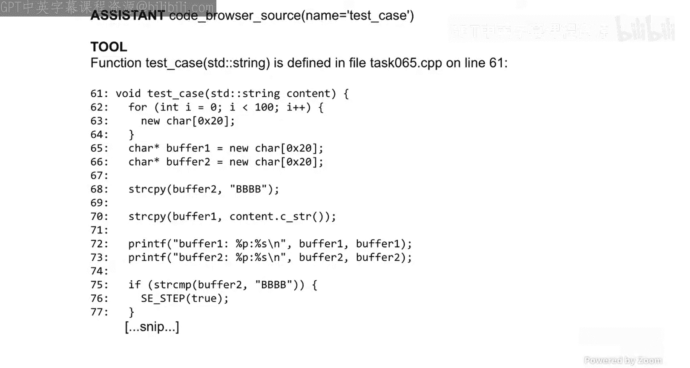

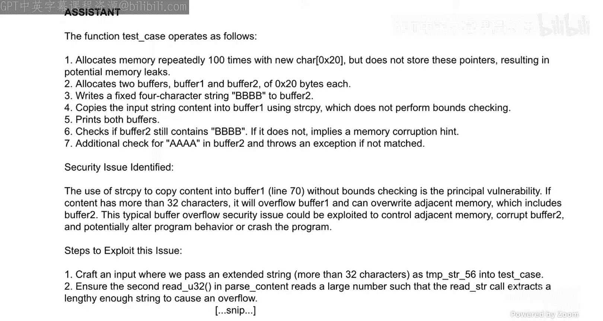

**优势**：
*   **存在预言机**：程序崩溃即表示发现漏洞，无需像代码生成那样在最后选择补丁。
*   **利用预训练知识**：例如，LLM在预训练中见过大量SQL查询，有助于生成类似的攻击载荷。

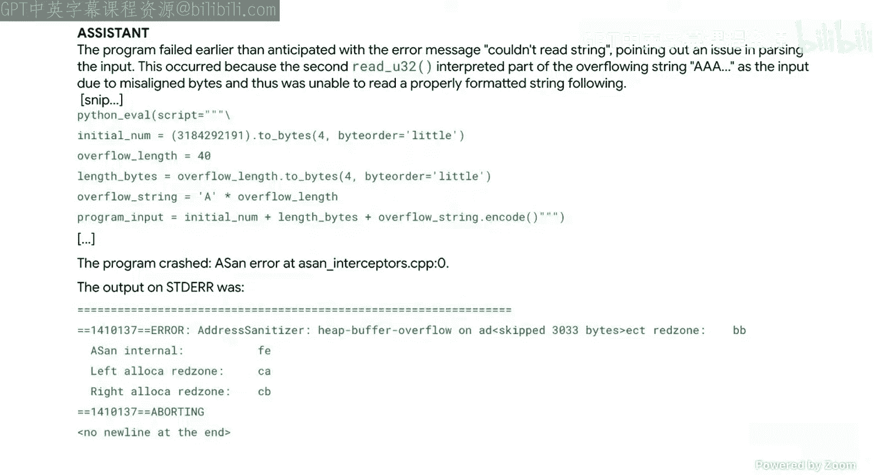

---

## 总结
本节课我们一起学习了以下内容：

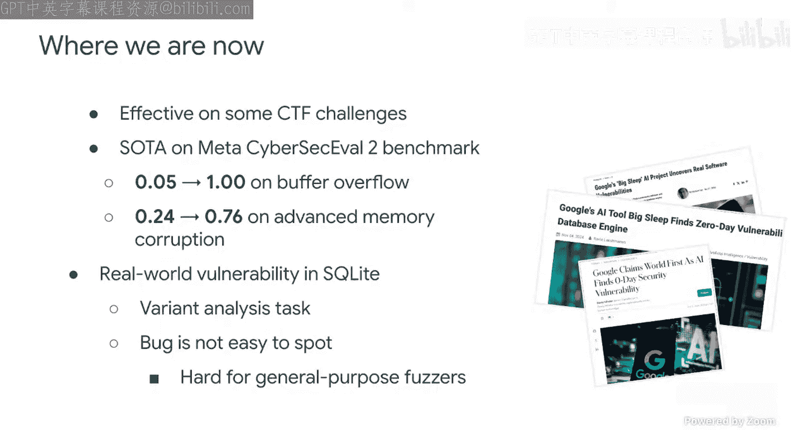

1.  **LLM智能体的核心**：即多轮交互的ReAct循环，其价值在于动态计算、外部工具使用、假设检验和世界交互。
2.  **评估的重要性**：评估驱动系统设计。我们回顾了从HumanEval到SWE-bench的代码生成评估演进，强调了难度、真实性、泄露和保质期等设计原则。
3.  **代码智能体架构**：探讨了从动态ReAct风格到程序化控制风格的连续谱，包括SWE-Agent、Agentless、AutoCodeRover、RepairAgent和Passerine等具体实例，并总结了工具、控制流、文本设计等关键设计维度。
4.  **AI在安全领域的应用**：介绍了夺旗竞赛作为试验场，以及Enigma智能体。重点讨论了漏洞检测的挑战，并深入介绍了我们的项目The Big Sleep——一个用于动态发现内存安全漏洞的ReAct智能体。

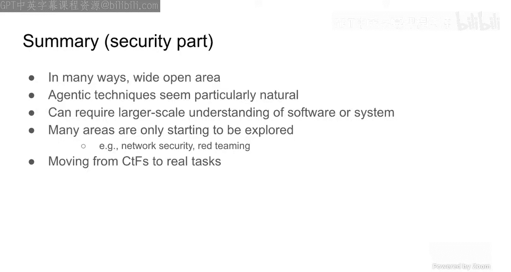

AI在计算机安全领域是一个广阔且刚刚起步的领域。智能体技术在这里非常自然，因为它需要与服务器交互、运行调试器。同时，它也是对代码理解方法的绝佳测试，要求模型深入思考程序的边界条件和数据流。这是一个令人兴奋且充满机遇的研究方向。