# 7：多模态智能体

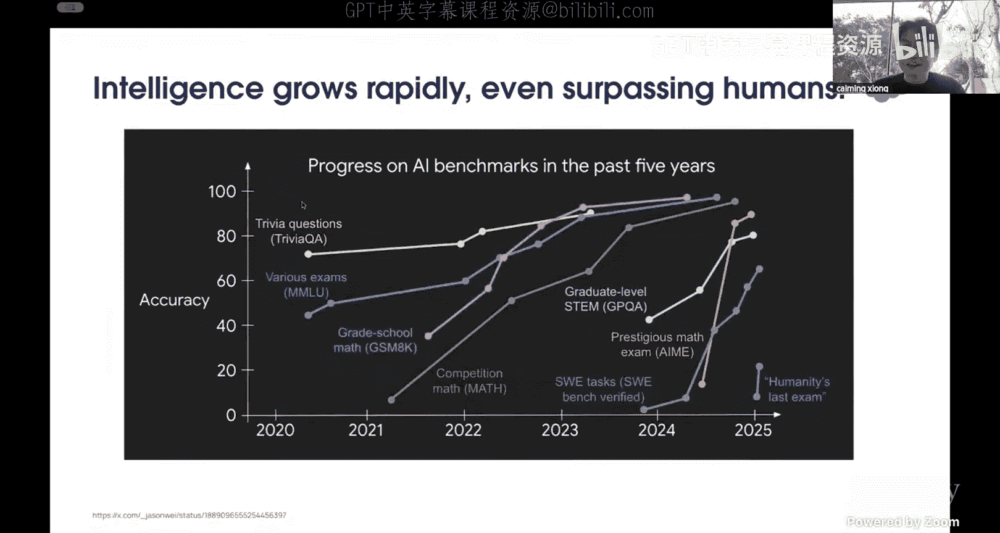

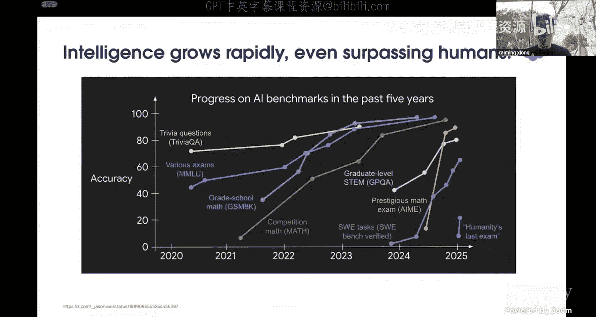

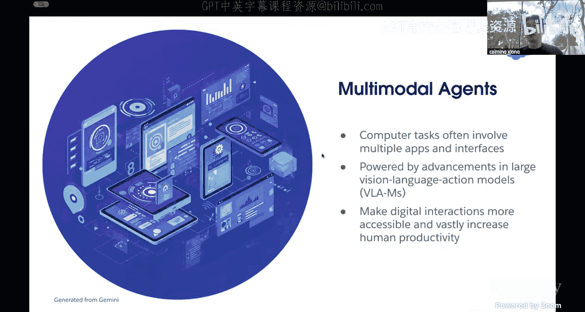

在本节课中，我们将要学习多模态人工智能智能体的发展现状、核心挑战与构建方法。我们将重点探讨用于开发和评估智能体的交互式环境、用于训练智能体的数据合成技术，以及构建更强大智能体的模型架构设计。

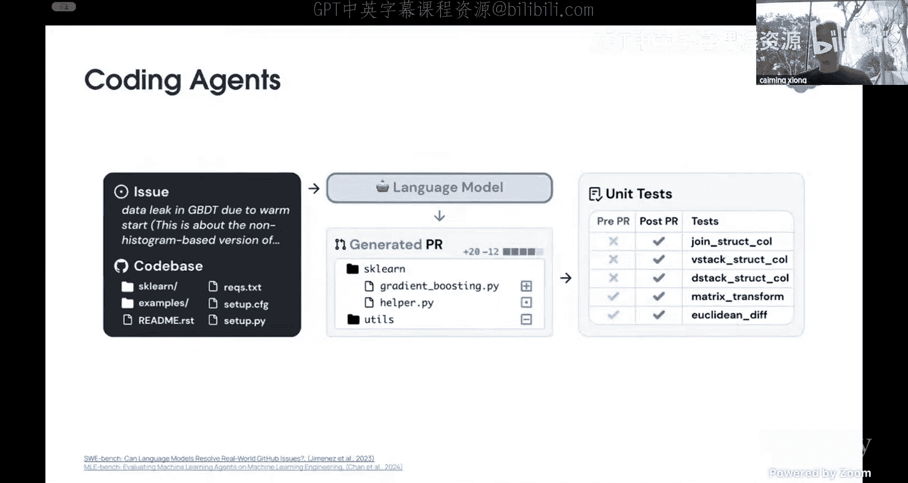

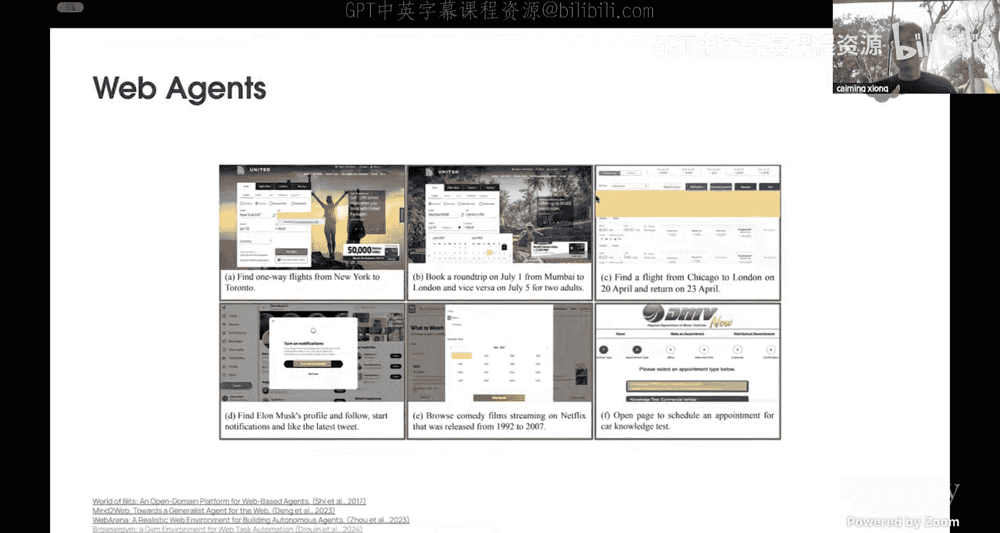

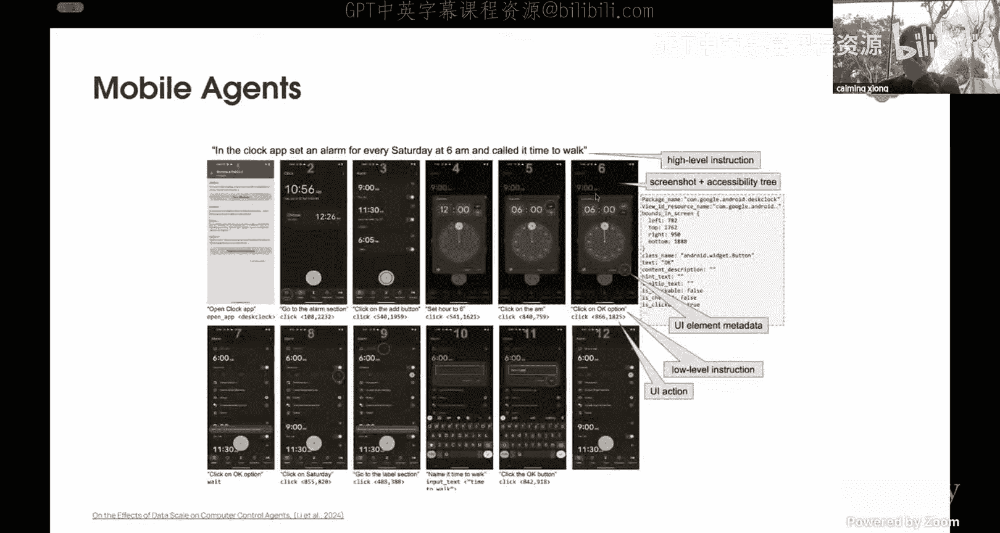

## 多模态智能体的现状与潜力

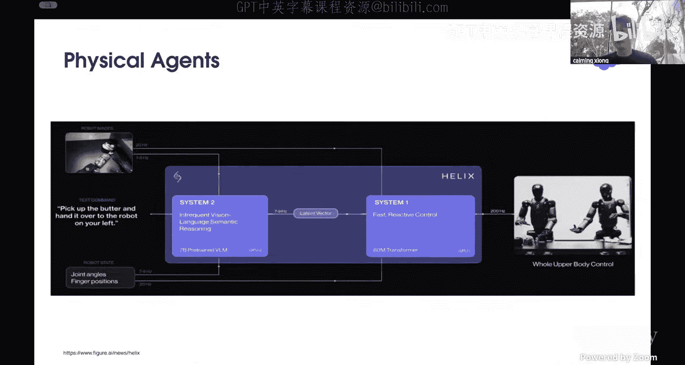

上一节我们介绍了课程背景，本节中我们来看看多模态智能体的现状。过去五年，几乎所有基准测试都趋于饱和。今年提出的新基准，如人类水平考试，似乎预示着新的突破。我们拥有如此强大的前沿基础模型，那么我们应该如何利用它们来让世界和社会变得更好？

我认为答案是智能体。我们相信多模态AI智能体是下一代应用。这是因为我们不仅希望智能体能阅读文本，还希望它能听、能看、能说，甚至能推理。我们希望智能体能像人类一样处理任务。因为我们在计算机上执行的大多数任务都涉及多个应用程序界面。借助这些新的先进语言模型或大型条件模型（即视觉-语言-动作模型），可以使数字交互更易访问、更自动化，并提高人类生产力。

目前，多模态智能体的发展并不遥远。我们已经看到许多多模态智能体在现实世界中被使用，或者仍处于研究阶段。

以下是几个例子：
*   **编码智能体**：许多编码助手或智能体产品（如Cursor、Darwin）不仅接受代码文本，还能让你上传图像，并根据图像生成代码或修复错误。
*   **网页智能体**：这类智能体可以帮助你在浏览器或应用程序中自动化一些操作。
*   **移动智能体**：在移动设备上执行任务的智能体。
*   **物理智能体**：例如Figure AI的机器人Alex，它不仅能与单个机器人交互，甚至能让多个机器人通过基础模型的力量进行协作。

所有这些智能体，有些已投入生产，有些仍在研究，有些处于早期阶段。我相信未来会有越来越多这类多模态智能体的应用案例。

那么问题来了：我们该如何开发它们？开发这些多模态智能体的挑战是什么？重要的组成部分是什么？我们应该关注什么？

## 开发与基准测试：OSWorld 环境

上一节我们了解了多模态智能体的潜力，本节中我们来看看开发智能体时面临的核心挑战之一：基准测试。我们每天与计算机交互，执行许多不同的任务，包括网页浏览、编辑个人视频、编码实现软件等。这些任务通常不是与单一应用程序交互，而是涉及多个应用程序的工作流。

借助多模态智能体，它有很大潜力可以彻底改变我们与计算机环境之间的交互。智能体可以遵循我们高级的自然语言指令，自动执行这些交互。然而，要构建这些智能体，我们如何信任它们？我们需要一个基准测试。

目前，开发多模态智能体的一个主要挑战是缺乏依赖于真实交互环境的基准测试。这种环境需要覆盖更多样化和复杂的真实世界计算机使用场景，并支持不同的操作系统界面和应用程序。有了这种基准测试，当智能体通过测试后，我们才能信任它用于日常使用。

目前已有一些不错的基准测试，但它们不具备我刚才提到的特性。例如，Mind2Web是一个很好的基准，包含了许多真实的测试，但每个测试只有一个演示，且不可执行。WebArena是另一个很好的基准，它是可执行的环境，但简化了观察和动作空间，只覆盖了非常有限的任务、应用程序或领域。

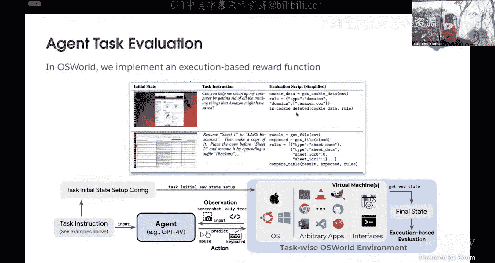

为了弥合真实世界用例与模型开发模拟环境之间的差距，我们引入了OSWorld。这是第一个用于多模态智能体开发和基准测试的可扩展真实计算机环境。

为什么我们说它是一个真实计算机环境，并且可用于多模态智能体的开发和基准测试？因为OSWorld首先允许对真实计算机应用程序进行近乎完全自由的键盘和鼠标控制。它不是固定的评估集。你可以配置你的任务，并以交互方式执行这些任务。这样，你就可以使用OSWorld来评估一些开放式的计算机任务，并涉及任意的应用程序。

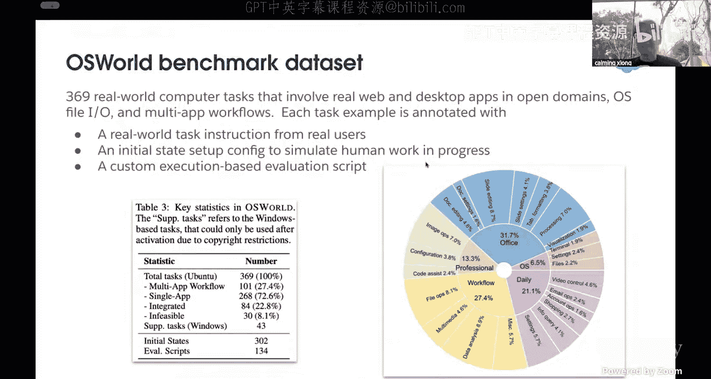

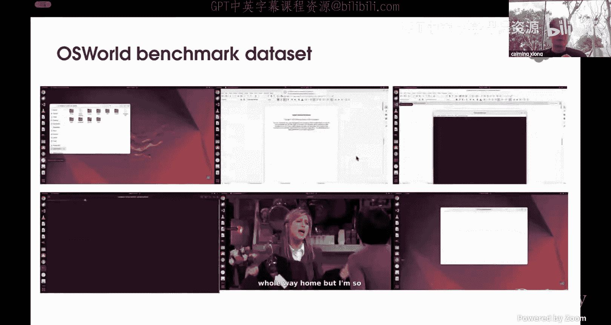

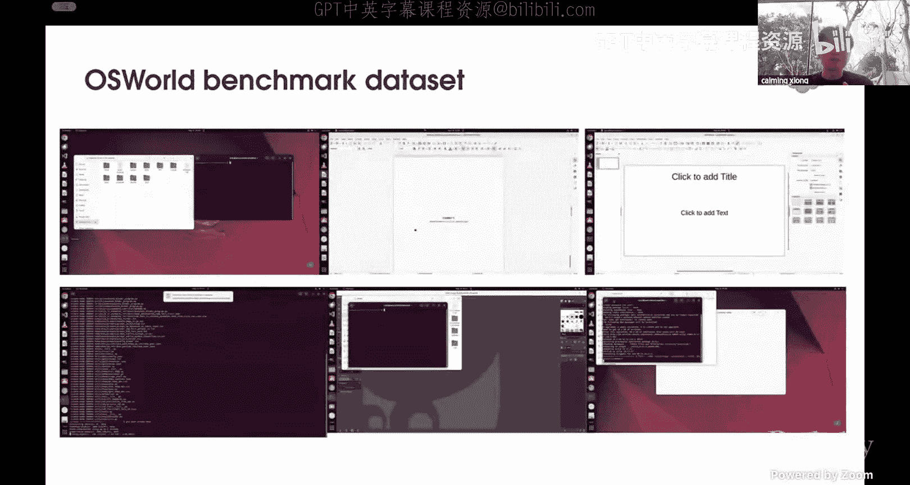

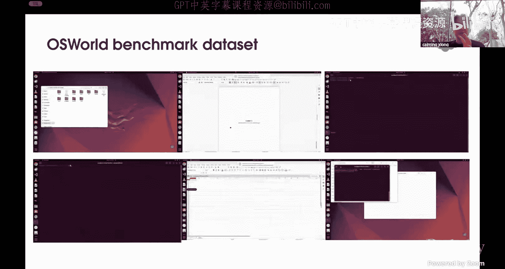

OSWorld可以作为一个统一的、真实的计算机环境，允许用户以三种方式定义新的智能体任务，而无需为特定场景构建新的模拟环境。因此，作为一个环境，OSWorld更加灵活，并赋予用户对其所关心场景的开发设计更多控制权。

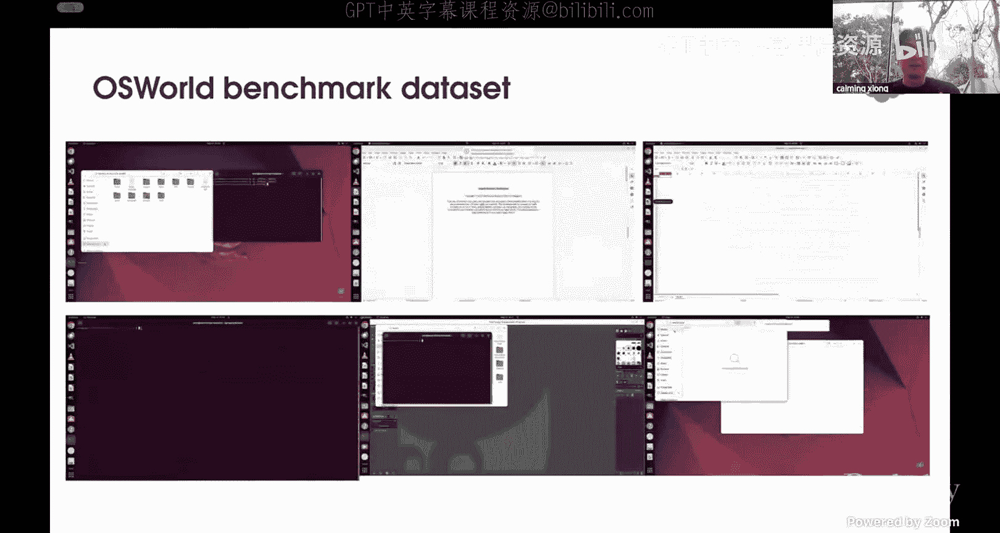

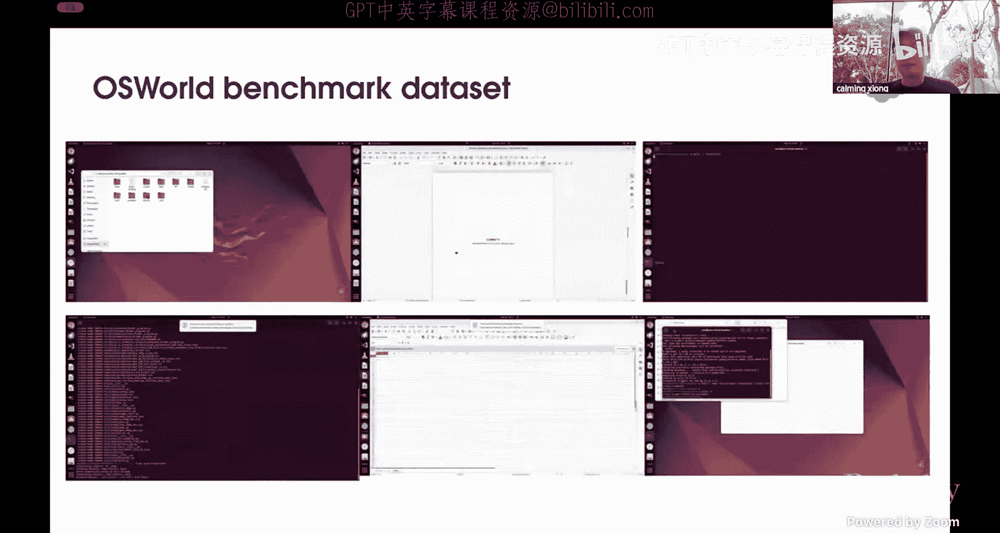

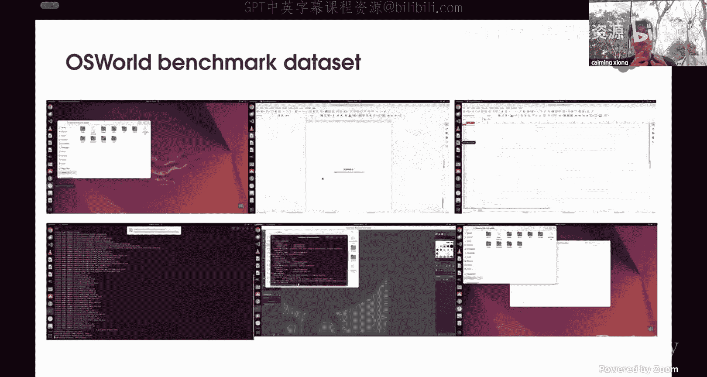

那么，我们如何使用OSWorld来创建不同的任务呢？首先，每个任务都有一个自然语言任务指令。在OSWorld中，我们为这个指令提供了初始状态设置。设置是一个文件，你只需编写这个文件。该文件包含多个组件：你需要配置初始任务（如Excel文件），添加后处理配置，指定可以检索文件和信息的路径，以及最后如何评估任务完成情况。

配置好初始状态设置后，OSWorld将在虚拟机中初始化这个计算机类型的开发环境。初始化将在虚拟机中开始运行，你将获得测试环境的初始状态。使用虚拟机非常方便，你可以反复使用它来恢复任务。同时，由于使用了虚拟机，它是一个安全、隔离的环境，我们无需担心测试时造成不可逆的损害。

任务环境设置好后，你就可以开始运行你的智能体与环境交互。例如，你可以使用GPT-4V方式创建智能体，或者使用任何其他开源模型构建智能体。智能体将接收或观察环境提供的不同信息：首先是用户查询（自然语言指令），其次是从开发环境获得的观察结果，如屏幕截图、可访问性树，或一些自定义流（如终端输出）。

智能体接收到这些观察结果后，最终会生成一些可执行的动作，例如点击某个位置、拖动某些内容，或操作键盘和鼠标。每个动作都由智能体生成一个代码字符串表示。然后，模拟器将在虚拟机中执行这些代码字符串，你将获得新的观察结果。这个交互循环将根据你的指令重复多个步骤，直到任务完成、失败或达到你设置的最大步骤数。

任务运行停止后，你会得到一个结果，然后在OSWorld环境中对任务进行评估。与其它基准测试不同，我们实现了基于执行的奖励函数。当最终步骤达到目标时，当然会获得正奖励；即使是部分完成，也会获得0到1之间的某个数值；如果完全失败，则获得0。

除了奖励，我们不仅仅使用单一的评估指标。我们认为没有单一的方法来评估任务的成功或失败。因此，我们使评估更加开放。“开放”意味着你可以在OSWorld开发环境中自行构建评估脚本。我们使用这个示例来说明如何为任务设计评估指标，而不仅仅是固定的一个。这样，你可以基于不同的任务设计不同的评估指标，从而促进任务的多样性，并使评估更加可靠，特别是对于这些复杂的真实世界开放式任务。

我们创建了一个强大的低级OSWorld环境，人们可以使用这个环境来对他们的多模态智能体进行基准测试。除了构建这个开发环境，我们当然也在OSWorld之上构建了一个基准测试。我们引入了369个真实世界的计算机任务，这些任务广泛涉及网络或桌面应用程序，如Office套件、操作系统和数据使用工作流以及专业任务。每个任务都基于真实世界的计算机使用案例和经验。我们让具有相关背景的人与OSWorld中初始化的开发环境交互，记录这些轨迹，并手动制作了许多基于执行的评估脚本来验证任务完成情况。

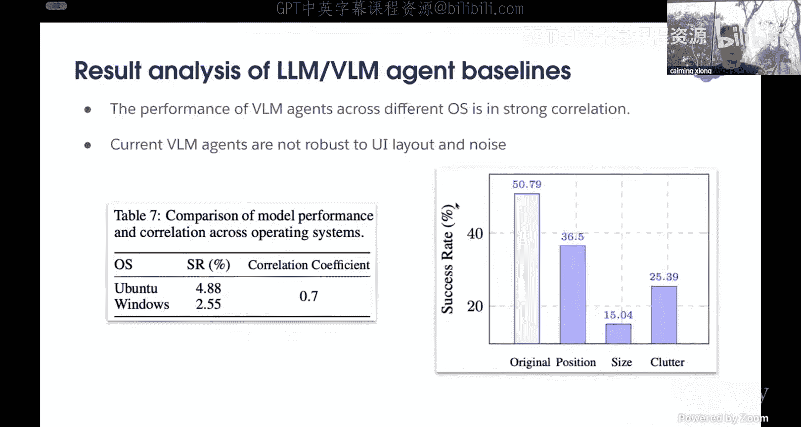

在我们的基准测试中，总共有369个任务，其中100个是工作流任务（涉及多个应用程序），大约70%（268个）是单应用程序任务。此外，大约20%的任务与其它数据集（如WebArena）重叠。我们还特别添加了30个不可行任务，因为智能体也需要知道如何对用户说“不”。我们认为添加不可行任务对于更全面地测试场景非常重要。我们还有少量（43个）针对Windows的任务。

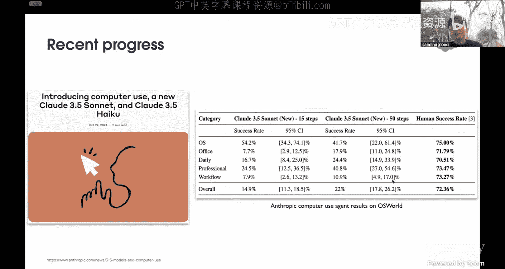

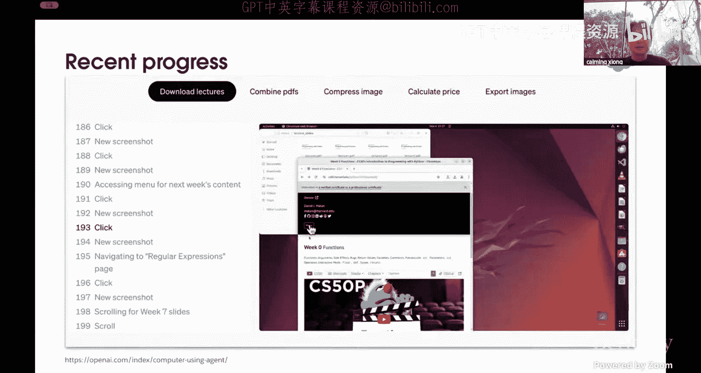

由于我们认为基于示例的评估脚本对于多模态智能体的真实世界评估非常重要，我们在369个任务上构建了134个评估脚本。与当前现有的流行基准测试相比，从不同角度（如是否提供可控的可执行环境、是否易于扩展到新环境、是否支持多模态、是否支持跨应用程序任务等）来看，我们的基准测试覆盖了更多场景，作为多模态智能体的基准测试更强大。

我们还分析了OSWorld基准测试中任务的复杂程度。与WebArena相比，WebArena的中位完成时间大约是30-40秒，而在OSWorld中，中位完成时间大约是100-110秒。有些任务甚至需要900秒或更多，这意味着这个基准测试的复杂性也高于现有基准测试。

创建基准测试后，我们用最先进的LLM或VLM（包括开源和闭源的基础模型，如GPT-4、Gemini、Claude等）测试了这个基准测试。我们设计了四种不同的测试设置，基于不同的观察结果：仅使用可访问性树（纯文本）、仅使用屏幕截图（纯视觉）、屏幕截图加可访问性树，以及屏幕截图加标记（Set-of-Mark， SoM）。我们对可访问性树进行了一些简化，以减少文本表示的长度。

从结果表中我们可以做一些分析。首先，人类的表现成功率大约在70%到75%。而那些最先进的开源和闭源模型在完成这些日常使用任务上的表现仍然远远落后于真实人类的表现。其次，人类在不同场景下的表现相对稳定，波动在3%到5%之间。但对于那些前沿的大型基础模型，性能变化巨大。即使是同一家公司的模型，例如在SoM设置下，GPT-4V和GPT-4O之间的性能差距也很大。

我们分析了哪些因素会影响性能。首先，我们分析了屏幕截图分辨率的影响。对于GPT-4V（仅截图），随着截图质量提高，性能会变得更好。但在SoM设置下，趋势虽然也是提升，但不如截图设置明显。我们认为SoM因为包含了从可访问性树中提取的额外文本信息，从而降低了分辨率的影响。

其次，我们分析了历史上下文长度对最终性能的影响。对于GPT-4V SoM，随着添加越来越多的历史步骤信息，性能得到改善。但在三样本（仅截图）设置下，添加更多历史信息甚至会使性能变差。我们认为这是因为SoM包含了来自可访问性树的文本信息，而当前基础模型在文本上的表现优于纯视觉图像。因此，随着上下文增加，SoM性能变得更好。但对于纯截图，性能变差，我们认为这仍然是因为当前大多数基础模型没有针对计算机使用场景进行良好训练。

我们还分析了可访问性树的长度分布。虽然你可以向多模态智能体添加越来越多的文本表示以提高性能，但问题在于可访问性树太冗长。大约90%的分位数在6K tokens左右。因此，如果我们想添加更多的历史上下文，我们需要找到一种方法来获得更简化或更简洁的可访问性树。

我们还分析了模型在Ubuntu和Windows上的性能，发现它们的相关性相当高（0.7）。这意味着我们可以使用OSWorld框架有效地评估模型，如果一个模型在一个场景中表现良好，它应该能有效地迁移到另一个环境。当我们改变屏幕上不同应用程序窗口的位置和大小时，结果显示出很大差异，这意味着这些基础模型对于这类干扰并不非常鲁棒。

好消息是最近这个领域有很多新进展。Anthropic推出了新的Claude 3.5和3.7，我们可以看到显著的改进。当然，如果将步骤数从15增加到50，性能会变得更好，但仍然有很大的提升空间。OpenAI也推出了名为Operator的新模型。在他们最近的性能表现中，我们可以看到OpenAI显著优于Claude 3.5。在200步时，它们甚至可以达到33.8%的成功率，而四个月前可能只有15%左右。但请注意，这是200步的情况，而OSWorld中的大多数任务应该在15或20步内解决，这意味着多模态智能体在计算机使用方面仍有很大的改进空间。

通过环境和基准测试的讨论，我们知道在计算机使用的多模态智能体领域已经取得了很大进展，但仍有许多需要改进的地方，仍有很多机会。

## 数据合成：AgentTricks 与 Taco

上一节我们讨论了开发环境与基准测试，本节中我们来看看数据部分。既然我们仍然需要数据来训练我们的模型以进行后续的智能体训练，我认为这比在LM训练中面临的挑战更大。因为智能体模型不是单步的，而是多步的轨迹。收集轨迹数据非常昂贵。其次，很难直接从互联网上获取轨迹数据。即使你有足够的资金雇佣人员收集数据，但对轨迹数据进行注释也非常耗时，且可扩展性有限。

那么，我们为什么不利用模型来合成数据呢？这里我想讨论一篇名为AgentTricks的论文，它通过结合网页教程的回放策略来合成智能体轨迹。这意味着什么呢？首先，我们知道互联网上有大量教程类文本。这些文本提供了如何执行不同任务的分步指导。我们阅读这些教程来学习如何与不同的应用程序交互，并在GUI环境中完成任务。这些教程覆盖了不同的场景。因此，我们可以系统地过滤互联网上的这些指导性内容。当然，这些数据并不干净，因为它是为人类编写的，包含很多噪声文本描述和不同的格式。我们需要从中提取有价值的知识，然后将这些非结构化文本转化为结构化的智能体轨迹，包括任务定义或高级描述，使智能体能够尝试模仿人类完成任务。

在AgentTricks中，有三个阶段来完成这个工作：
1.  **从互联网自动收集教程**：大致如刚才描述的，从互联网上抓取和过滤教程数据，使用启发式过滤和一些分类器，然后使用LLM将其转化为结构化格式。
2.  **引导回放以生成轨迹**：使用视觉语言模型智能体，基于结构化的教程步骤逐步执行，从而收集高级轨迹，包括任务的高级描述、每个步骤的观察、推理以及最终动作。
3.  **验证智能体**：运行一个单独的评估器来评估轨迹质量，过滤掉不良或低质量的轨迹，然后对智能体模型进行微调，以展示在不同基准测试上的显著性能改进。

通过AgentTricks收集的数据与之前用于训练模型的其他数据集相比，我们的数据可以收集得更多，复杂度也不低，平均每个轨迹约有12步，并且包含大量信息（HTML、可访问性树、推理、视频、截图等），覆盖了不同的网站。AgentTricks保持了多样性和真实性，因为它来自真实世界，同时也解决了人工注释数据可能存在的可扩展性问题。

我们用训练好的模型在基准测试上检查了合成数据的性能。在WebArena基准测试上的比较显示，在AgentTricks数据上训练的模型显著优于开源甚至闭源的GPT-4O模型，这表明合成的轨迹也具有高质量，可以用来训练更好的模型。

AgentTricks工作的启示是：利用互联网语料库仍然是一个重要途径，因为它们拥有多样化的任务资源；其次，推理和反思对于轨迹生成是非常重要的因素。然而，这里仍然存在一个问题：对于每个指令，你仍然只得到一个单一的轨迹，这意味着每个查询可能只有单一解决方案。但我认为我们有解决方案，那就是OSWorld。你可以使用AgentTricks为SFT训练创建数据，然后使用那些高级指令在OSWorld中进行强化学习，从而解决探索与利用的问题。

我们试图回答的问题是：我们可以使用数据合成来使现有的视觉语言模型在GUI智能体任务上表现更好。那么，下一个我想讨论的是：当你为改善智能体外部任务的动作能力进行数据合成时，它是否也能帮助改善模型内部的理解任务本身？我们知道视觉语言模型是为理解而训练的。如果我们想这样做，我们能从网站数据中获取这类数据吗？答案是不太容易。

首先，让我看看为什么我们需要这样做。为什么我们想为多模态LLM合成这类动作数据来提高理解能力？理解应该是模型具备的能力，但实际上它并不完美。这里有四个来自不同视角的例子，解释了为什么我们需要模型自身能够进行动作调用来提高理解能力。所有这些任务，要么需要更强的视觉能力，要么需要一些阅读能力，要么需要一些外部知识。

这里我们介绍Taco方法，它通过合成其思维链和动作数据，通过增加动作调用能力来提高多模态理解能力。在添加了通过我们稍后将讨论的合成数据训练的动作调用能力后，模型可以生成思维和动作，并通过观察再次执行，直到获得结果。

那么，我们如何创建这个合成数据管道呢？它有两个部分：上半部分是**基于模型的生成**，下半部分是**程序化生成**。

在基于模型的生成中，首先，我们获取现有的图像问答对作为输入，提示前沿模型（如GPT-4）根据给定的动作列表生成思维链和动作。如果列表中没有相关动作，则生成不带动作的思维链。然后，我们将验证输出的正确性。如果正确，则通过；如果不正确，则将此对转换为直接答案对。通过这种方式，你会得到数据，并非所有数据都有动作，有些只有思维链，有些是直接答案。

在程序化生成部分，我们没有问答对，只有图像。然后，我们使用模型（可能是检测模型、深度模型、OCR模型等）或人工来标注图像中的信息。我们设计了一些手动模板，并开始生成问答对。通过这种方式，我们可以合成回答问题时需要哪些动作。我们使用的模板涵盖了计数、2D空间推理、3D空间推理、混合理解和计数等，试图模仿回答不同类型问题所需的推理或动作调用。动作集涵盖了OCR、获取对象定位、深度估计、查询语言模型、精确软数学方程等，相当多样化。

通过这两种方式，我们收集了数据。当然，在这些数据中，有些是思维链动作数据，有些不是。然后我们需要对这些数据进行分析，并在基准测试上进行测试。

首先，通过我们的实验，我们发现要让多模态基础模型具备推理或动作调用能力，需要使用微调，少样本或上下文学习不起作用。其次，对于需要动作的任务，添加动作能力确实能提高它们解决之前无法解决的任务的能力，这意味着即使是理解能力，也可以通过添加外部工具并通过函数调用或调用来增强。看到这些积极的结果也很有趣。

第二个观察是，最好的思维链数据（经过过滤的数据）几乎在所有测试场景（如A-OKVQA、BLINK、MATH、MMMU）中都提高了性能，这意味着添加动作能力到模型中（通过数据）可以提高模型在多个任务上的通用理解能力，而不仅仅是提高一个模型。

第三个观察是，从Taco实验在思维链动作数据集上，我们发现质量比数量更重要，并非越多越好。

这篇论文讨论了如何将动作调用能力添加到多模态语言模型或基础模型中。首先，你需要通过微调，而不是少样本。其次，思维链数据通过微调和仅使用合成指令数据，能持续改进模型。第三，质量比数量更重要，这是我们从这里学到的一些经验。

## 模型架构：Argue 统一视觉模型

上一节我们讨论了开发基准测试和数据合成，现在你应该对多模态智能体领域有了全面的概览。如果你想测试智能体、生成数据、在环境中进行交互，你已经有了这些工具，可以开始创建你的多模态智能体了。最后，我想花些时间谈谈模型。虽然我不能说这是最好的模型，但也许你可以从这些模型中获得一些见解。

我想讨论这篇Argue论文，它是一个用于GUI智能体的统一纯视觉模型。我们最终要解决三个问题：
1.  大多数GUI智能体是基于文本的，使用文本表示（如可访问性树）。
2.  视觉定位和性能能力不佳，我认为这是因为大多数模型没有真正针对计算机使用进行训练。
3.  大多数模型直接生成动作，而没有结合复杂的推理。

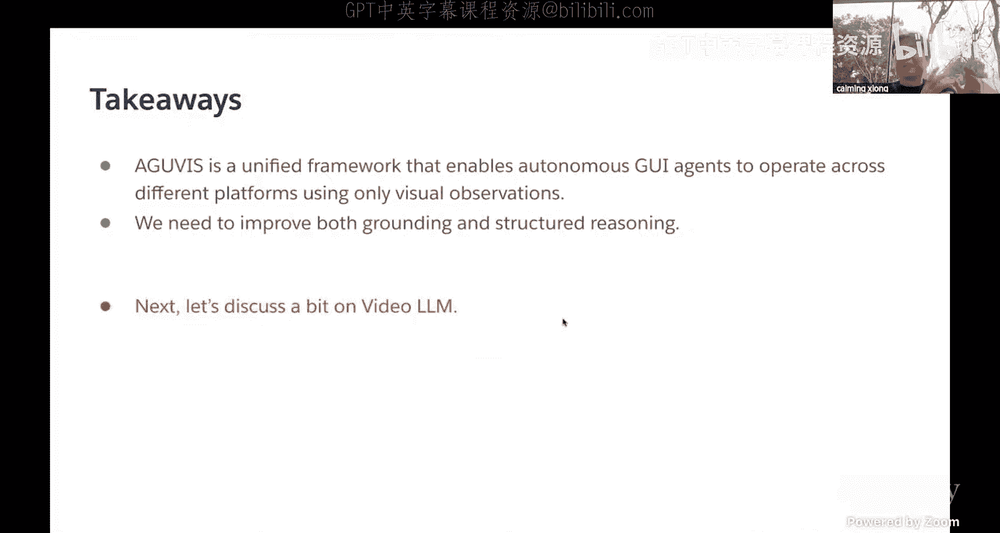

以下是关于这三个观察或问题的更具体说明。首先，它们有不同的文本表示，在Web上是HTML，也许是DOM树，在操作系统上有另一种类型的可访问性树，移动设备又有不同的类型。而且它们通常很长，并且随着GUI复杂度的增加可能会更长。与纯视觉相比，无论你的背景代码是什么样子，图像都是一样的。这是GUI的一个好处。其次，由于不同系统使用不同的工具，它们的动作空间非常不同。这不是一个大问题，但仍然是一个问题，它会阻碍有效的跨环境学习，并且你无法利用不同的训练数据在一起，这对可扩展性不利。第三是视觉定位能力。我们在移动、桌面和Web场景上进行了测试，发现那些闭源模型的表现出奇