# 8：Lecture 8, Thomas Hubert

## 概述
在本节课中，我们将学习Thomas Hubert关于AlphaProof项目的分享。我们将探讨形式化数学的兴起、强化学习的经验教训，以及这两者如何结合催生了AlphaProof。我们将了解AlphaProof如何在国际数学奥林匹克竞赛中取得成绩，并展望其在未来数学研究中的潜力。

## 形式化数学的兴起

伽利略在很久以前说过，自然法则都是用数学语言写成的。这是一个令人难以置信的预言或洞见，因为在伽利略之后，我们取得了巨大进步。如今，仅仅一页纸上的几个方程就能极其精确地描述宇宙的运行方式。

在《数学的不合理有效性》这篇著名文章中，尤金·维格纳认为，数学不仅具有描述能力，还具有预测能力。他给出的一个例子是矩阵代数在量子力学中的应用。

一旦你能描述和预测自然世界，你就可以开始塑造它。环顾我们生活的世界、文明、文化、技术，你会发现数学是这一切的核心。

或许我还想论证，数学是通向智能的根节点。根节点是丹尼斯喜欢谈论的一个词，它意味着从那个根节点出发，将展开一整棵可能性之树。我们之所以这样认为，是因为数学需要推理和规划、泛化和抽象、知识和创造力，以及开放和无界的复杂性。

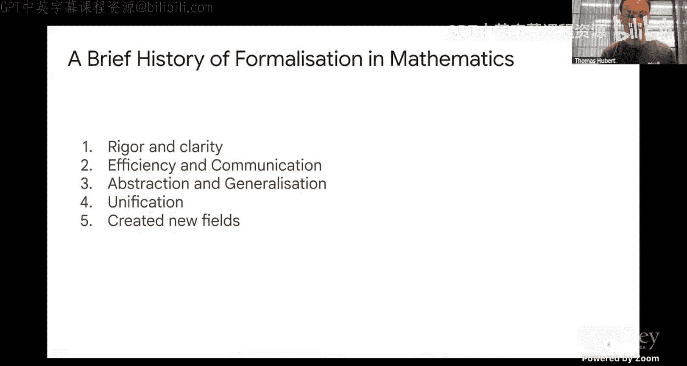

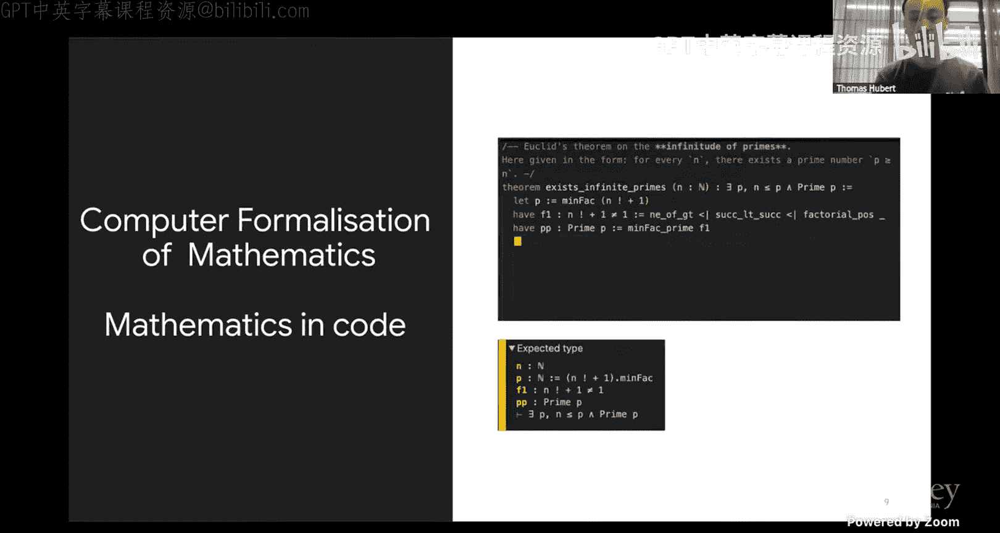

多年来，我也逐渐理解，数学不仅仅是这些逻辑规则的依次应用，它更是一种艺术，因此甚至需要一种对美的感知。

我在这里使用了很多关键词，你会在我的演讲中看到它们再次出现，我希望这能让这些概念更具体一些。

总而言之，我试图向你传达，数学是理解自然世界的根节点，但也可能是通向智能的根节点。

因此，我认为值得认真思考数学，看看我们能为此做些什么？

但在那之前，我想给你一个非常简短的数学形式化历史，因为数学并非一直是我们现在看到的样子。

大约公元前500年，希腊人有了一个伟大的启示，他们理解了数学证明概念的重要性。在某种意义上，你能想象吗？这就像你发现了一种方法，可以确定地告诉你，你已经获得了某种永恒的真理，并且可以发现宇宙中越来越多的真理。这一定感觉不可思议。从那时起，证明就成为数学的核心。然而，构成证明的内容在数千年的数学历史中不断演变。

我相信你们都知道的第一个突破是欧几里得和他的《几何原本》，其中包含了定义、公理和定理。这确实是公理化的开端，但这一思想在20世纪初随着希尔伯特计划得到了更深入的发展，最终形成了我们现在所拥有的体系。

这是一方面，即公理化。另一方面，数学在最初并不真正使用符号。在很长一段时间里，即使希腊人已经有了很好的公理化并开始使用一些符号，世界其他地方仍然用大量文字来描述数学。例如，这里有一个正方形和10倍它的根等于239。今天我们会写成 `x + 10x = 239`。但看看这个描述如何解决这个问题：“取根的系数，将其分成两部分，将其中一部分自乘，加到239上，等等。” 现在你只需写下这种简洁的公式。这里有两件事：首先，使用特殊符号来表示数字，就像我们用特殊字符表示数字一样。

但也许更重要的是，我认为直到17世纪，勒内·笛卡尔才提出用字母表开头的字母表示常数，用末尾的字母如X、Y、Z表示未知数。这就是你最终得到这个公式的方式，但这直到17世纪才真正出现。

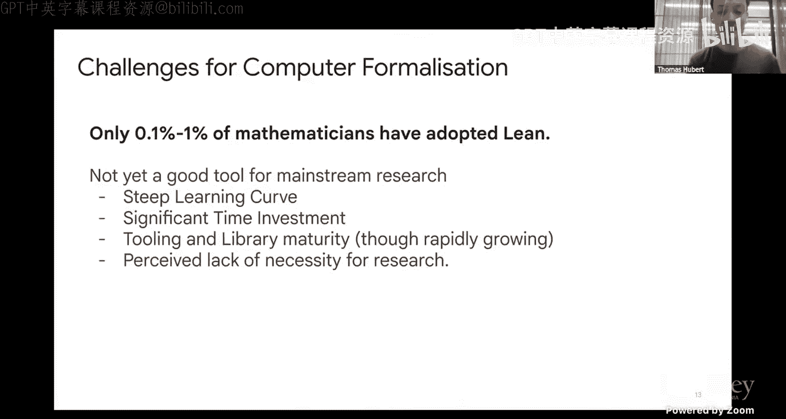

我认为不难论证，精确的符号和公理化确实消除了歧义和逻辑错误。符号表示法使复杂的操作更易于处理，并大大减少了认知负荷。它还能极其密集地打包信息。在符号方面，我不记得确切是谁说的，或者是不是一个玩笑，但有人曾认为，也许爱因斯坦符号是他最大的贡献。考虑到广义相对论、狭义相对论和他对引入量子力学的贡献，这可能有点夸张，但爱因斯坦符号确实非常重要。实际上，如果你阅读机器学习代码，也会看到它大量出现。但基本上，一旦你有了这些符号，并能从具体例子中抽象出来，你就能开始观察不同背景下的共同模式。这就是抽象和泛化的来源，你可以统一数学的不同领域，甚至可以创建新的领域。

我最喜欢的例子是那些研究欧几里得几何五条公理的人，实际上我不知道有多少年，我想是几千年，试图看看是否能去掉第五条公理。这实际上导致了非欧几何，特别是黎曼几何，而黎曼几何对于广义相对论至关重要。

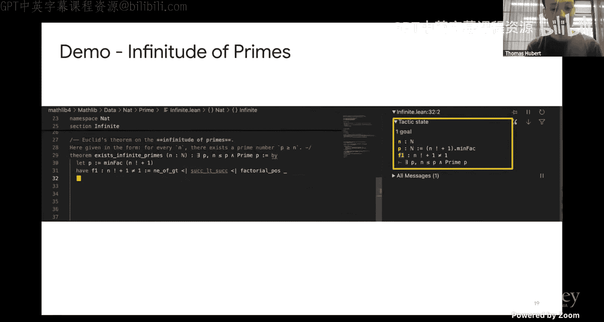

因此，这种形式化帮助了数学，也帮助了其他科学，特别是物理学。

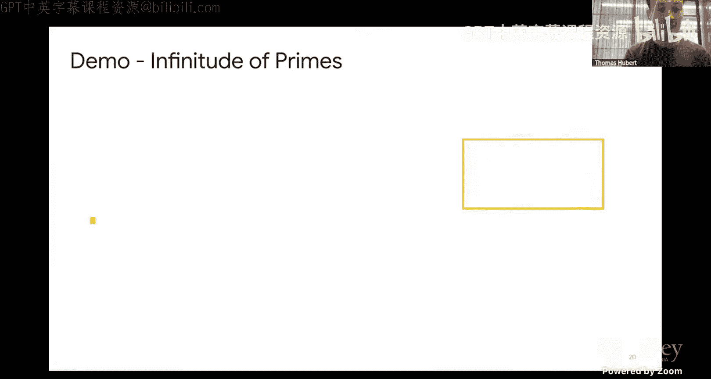

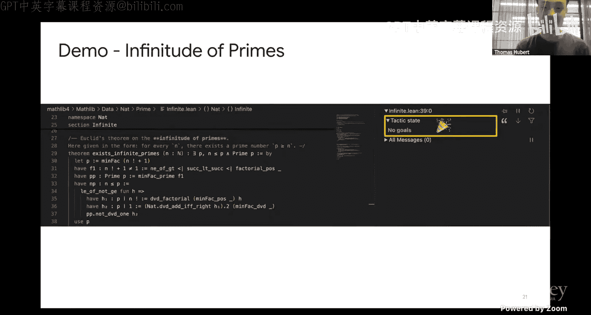

所以我想论证的是，计算机形式化，即用代码编写数学，只是数学形式主义这一长期发展过程中的下一个逻辑阶段。

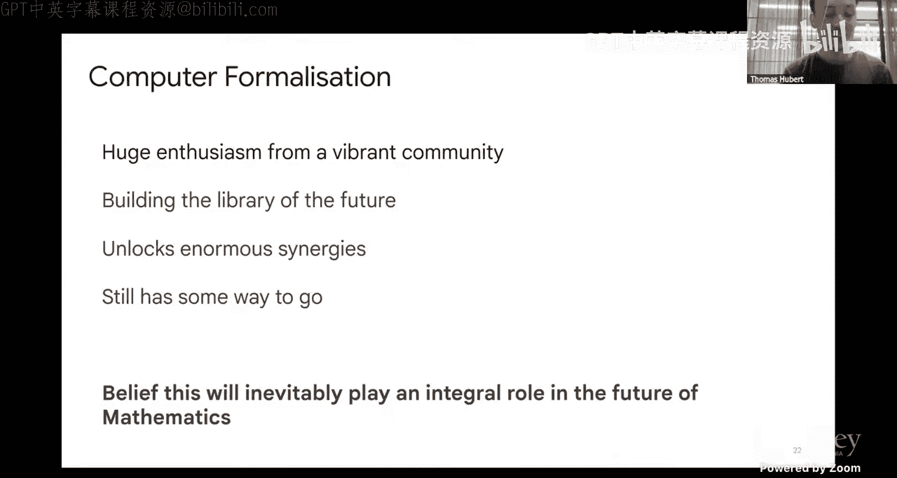

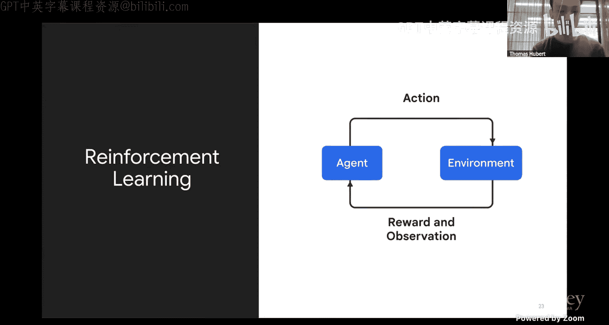

已经有不少描述数学推理的语言，如Coq和Isabelle。Lean是最新的一种，最初是为了软件教育而开发的，但也考虑了数学。

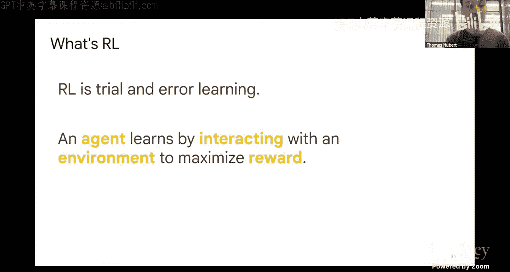

在Lean中，数学家们看到了实现数学形式主义下一个重大飞跃的工具。它是一种编程语言，一个公平的改进和交互式证明助手。Lean拥有一个非常活跃的开源数学家社区，已被用于形式化前沿数学领域，如元数学。数学家们正在进行一项巨大的探索，基本上是在构建未来的数学库。让我介绍一下，它叫做Mathlib。它建立在数学家们的业余时间之上，是开源的。它有两个大目标：它旨在成为通用和统一的。通用意味着它具有最弱的假设和最强的结果。统一意味着每个概念只有一个定义。

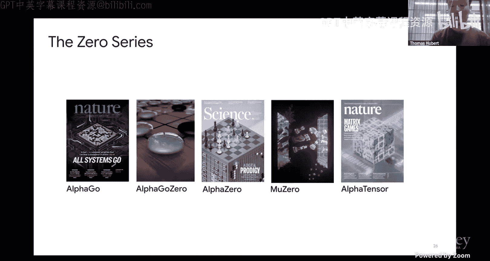

当我了解到这个统一思想时，我实际上相当惊讶，因为我原以为数学已经以一种非常结构化的方式书写了。但显然，对于一个给定的概念，可能有几篇论文基本上讨论的是同一个概念，但以不同的方式定义它，这些定义不一定相互兼容。因此，实际上需要做相当多的工作来尝试找到能够涵盖所有这些思想的统一定义。这实际上是构建Mathlib最耗时的部分。

也许你可以从我给出的这个表示中看到，它是一个单一的、整体连接的库。这对于现代数学非常重要，因为现代数学就是要尝试连接数学的所有领域。有观察表明，这里的想法可以帮助那里的领域。例如，费马大定理的证明就是一个很好的例子，它连接了两个不同的领域来证明一个巨大的定理。现在还有一个叫做朗兰兹纲领的东西，它明确地试图做到这一点，连接所有这些领域。因此，拥有一个能够连接数学所有不同领域的库非常重要。

目前，该库涵盖了大约80%的本科课程内容。然而，库的大部分内容超出了本科水平，覆盖范围参差不齐。我认为复分析或偏微分方程理论是特别复杂的例子。

好的，这一切都很棒，但为什么要做所有这些呢？因为计算机形式化释放了巨大的协同效应。也许为了稍微解释一下，我必须退一步。对于那些懂代码的人来说，仅仅理解正确的代码并能够使用整个软件栈，对数学来说应该已经是一个巨大的胜利。但基本上，当你用Lean这样的语言将数学写成代码时，你获得的另一个特性是完美的验证。当你写一个证明并写出正确的证明时，Lean会告诉你“是的，这是正确的”。当你犯错时，Lean会告诉你“你的证明不正确或不完整”。

因此，从这两点出发，你会立即获得一些好处。首先，你对正确性的担忧完全消失了。你可以信任巨大的证明，并可以将证明检查完全委托给计算机。

我认为需要注意的是，据我了解，并非所有数学领域都受到正确性问题的困扰。我认为在现实中，大多数领域，数学家们对自己的辨别能力相当有信心。但我听说，在一些更抽象的领域，正确性确实开始成为真正的问题。所以这不是普遍现象，但开始变得重要。

这些是立竿见影的好处，但完美的验证和软件栈确实会产生连锁反应，可能带来改变游戏规则的影响。

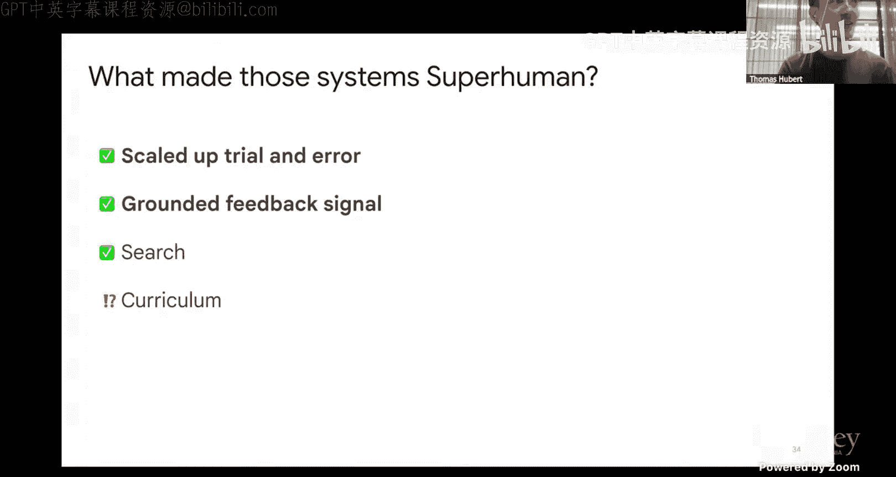

首先，我认为对于你们所有懂代码的人来说，将我们为编码开发的所有工具引入数学，应该已经是一个巨大的胜利。其次，它将数学变成了一个视频游戏。这个视频游戏是什么样的呢？你有不同的关卡，这些关卡是不同的定理。然后你可以在这些关卡中互动，Lean会告诉你是否完成了关卡。有了这种完美的验证反馈，你总是有更难的关卡。也许与其他游戏不同，比如射击游戏，这是一个超级有意义、有用且深刻的游戏。你基本上是在为永恒增添新的真理。

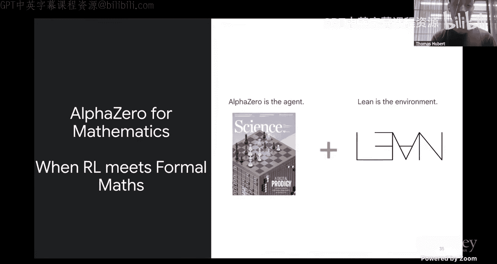

Lean社区的人将其描述为，他们可以一天做14个小时，并且不断获得积极的强化。

这也意味着它对教育非常有益。首先，现在很多年轻人非常习惯使用计算机和软件。这很棒，因为它是交互式的，有趣且易于学习。你还可以创建软件，使得细节的详细程度适应阅读者，而不是作者认为有趣的程度。

我不知道你是否阅读很多数学论文，或者查看你试图解决的问题的解答。有时因为“下一步相当明显”，但也许对你来说并非如此，你希望看到更多细节。

我还有一个来自我父亲的例子。他最近尝试在另一个在线课程中学习伽罗瓦理论。他完成了第一周、第二周和第三周，一切顺利。但当他进入第四周并试图做作业时，他意识到有些东西他不理解。他基本上需要有人向他解释，他给教授发了信息，但不幸的是教授没有回复。因此，他基本上完全卡住了。但想象一下，如果他在Lean中做这件事，那么Lean会准确地告诉他什么是对的、什么是错的、缺少什么等等。他将能够获得持续的反馈，而不必问老师。

现在我想谈最后一点，这实际上是特里·陶大约一年半前提出的一个观点。他描述说，使用计算机形式化将开启数学家之间的大规模协作。他为什么这么说呢？显然，目前数学协作的现状是，大多数论文是单作者或双作者论文，五作者论文已经算是很多了。原因在于，每个作者都需要检查其他人的工作。因此，拥有越来越多的合作者并不能真正扩展，但你仍然需要检查其他人的工作。这就是计算机形式化和完美验证的作用所在：如果你能信任计算机来检查证明，那么突然间，它可以将数学项目的工作开放给成千上万的人。因为你可以有一个你从未见过、住在偏远地方的人，为你的某个引理贡献一点点，然后Lean会说“是的，这是正确的”，然后你就可以继续前进。因此，已经有一些项目，比如Mathlib，可能是最酷的演示之一，有数百名数学家共同构建这个未来的库。但我想特里·陶也在论证，你可以用它来做新的数学，并且实际上已经启动了一个名为“泛代数”的项目来探索这一点。但基本上，我认为在当下这个规模化的时代，你可以规模化人类来做数学，并可能解决更困难的问题。

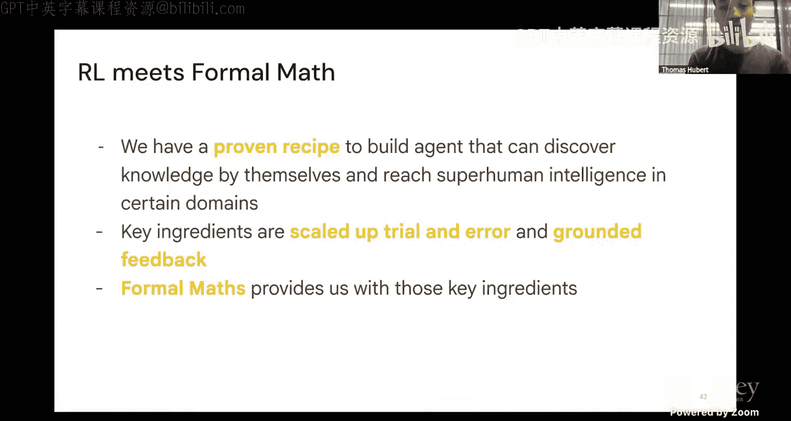

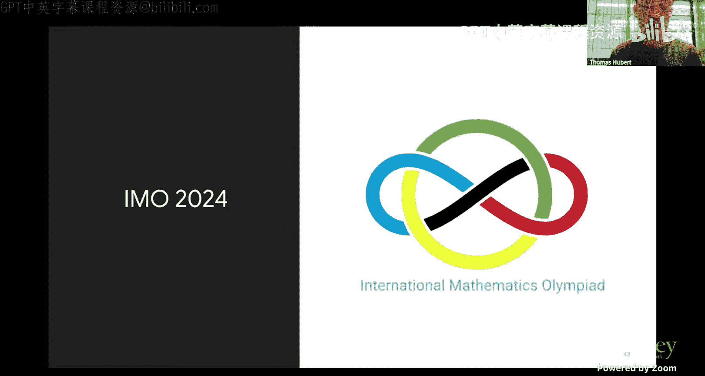

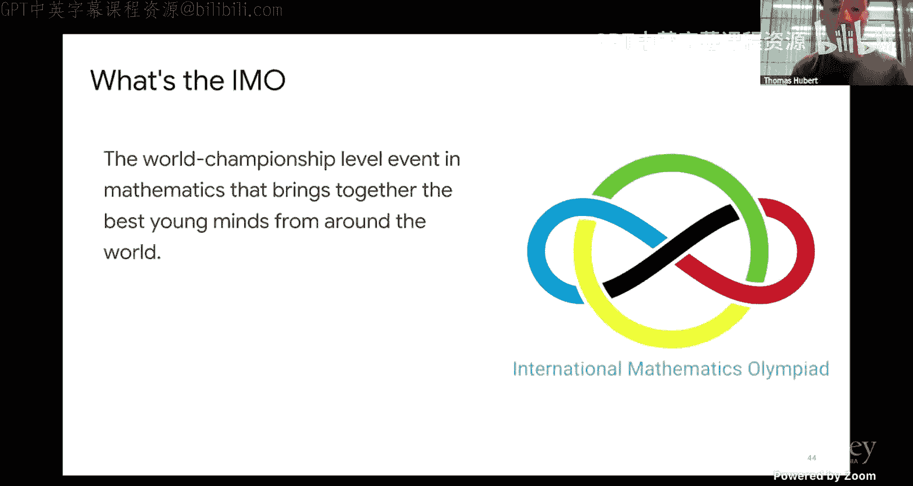

好的，那么，是否每个人都应该转向计算机形式化呢？它很棒。现实是，计算机形式化仍然面临挑战。据我估计，只有0.1%到1%的数学家采用了它。它是一个小而充满活力的数学家社区。但为什么会这样呢？因为它实际上还不是主流研究的绝佳工具。像许多编程语言一样，它有陡峭的学习曲线，并且需要大量的时间投入。因为要获得完美的验证，你需要能够写出每一个细节。这需要更多的时间。也许这不是你想关注的地方，你想关注那些你还不知道如何做的事情，而不是那些对你来说更明显的事情。随着工具和库的成熟，这一点会得到改善，但目前仍然缺少一些东西。显然，对于研究来说，也缺乏必要性。但我希望我在上一张幻灯片中概述的论点能在某种程度上改变这一点。

现在我只想向你展示一下它是什么样子的。这是一个你可能知道的证明，叫做“存在无限多个素数”的证明。好的，这就是它在Lean中的样子，我希望你能看清楚它足够大。好的，就在这里。这是定理陈述。我认为值得注意的是，因为你可以使用Unicode，这看起来和你自己在纸上写的几乎一模一样。它说：对于所有自然数n，存在一个素数p，使得p > n。这就是表达存在无限多个素数的一种方式。

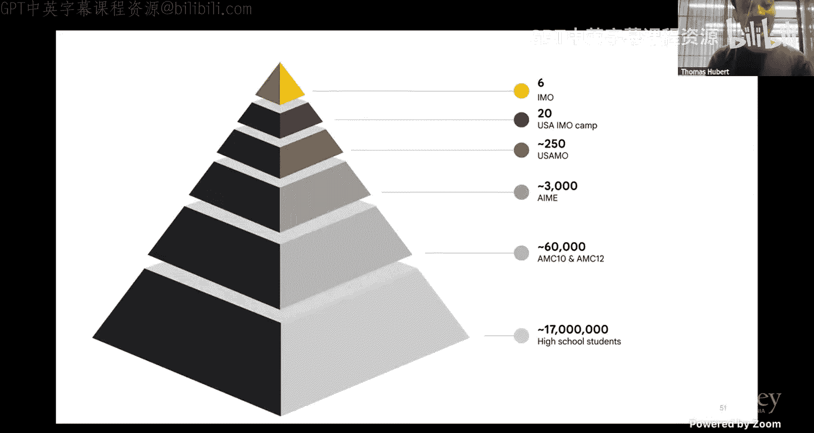

这是证明的样子。在这种情况下相当紧凑。你能理解所有这些，是因为Lean是一种基于高级语法、反映常规数学的语言。

让我稍微介绍一下与它交互是什么样子的。这是证明的第一行，这实际上是欧几里得的主要见解：首先考虑n! + 1及其最小因子。最小因子是什么？是n! + 1的最小因子。

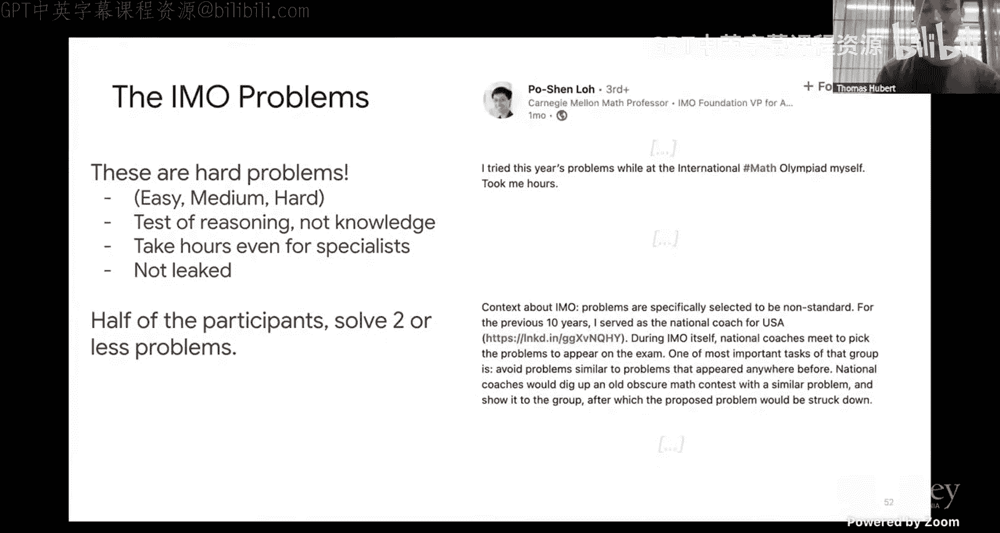

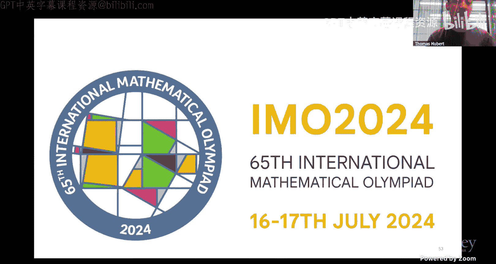

我想请你注意右边那个叫做“策略状态”的方框。基本上，这就是Lean返回给你的信息。它说：“哦，这些是我们已知的事实，这些是我们仍然需要证明的事情。” 我们知道n是一个自然数，我们知道p是n! + 1的最小因子，你仍然需要证明存在一个p，使得p > n且p是素数。

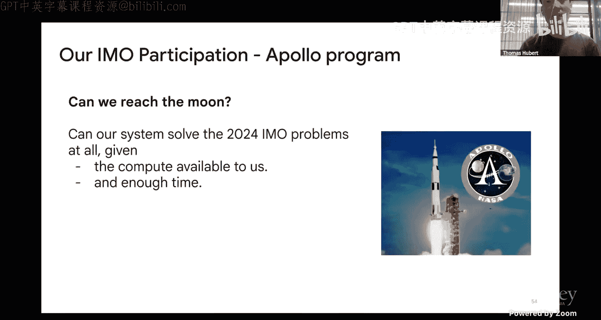

让我们看第二行。第二行说：“哦，让我们证明n! + 1不等于1。” 你实际上在行内有一个证明，也许有几个字符。你真的想证明这么简单的事情。但在右边，你看到你的武器库中有了一个新的事实：n! + 1不等于1。

然后我们会说：“现在让我们证明p是素数。” 证明是说：“嗯，是因为我们取了最小因子，最小因子显然是素数，除非你取的那个数是1。这就是为什么你需要之前证明的那个事实。” 然后证明继续，最后你应该在你的策略状态中看到“没有目标”。

在Lean的早期版本中，我认为你还会收到这种“目标完成”的提示，但不幸的是，在当前版本中已被移除。但基本上，这是你完成这个关卡的小奖励。

所以，简单回顾一下，计算机形式化有一个非常活跃的社区，对此充满热情。他们正在用自己的时间构建未来的库。它有许多可以释放巨大协同效应的方式，但仍有很长的路要走。

这个社区以及我自己都相信，这将在数学的未来中不可避免地扮演不可或缺的角色。这项工作推动了计算机形式化的发展。

## 强化学习与AlphaZero哲学

好的，现在我想谈谈人工智能的一些并行发展，并关注几年前非常流行、在过去几年有点被遗忘、如今又强势回归的东西。希望你们已经从我关于奖励、环境、交互性、视频游戏的暗示中猜到了，我想谈谈强化学习。

那么，什么是强化学习？强化学习基本上就是试错学习。它是一个非常通用的框架，一个智能体试图实现一个目标。这个智能体通过与环境的互动来学习，以最大化奖励。我认为有时存在误解，认为奖励必须非常密集，或者必须引导你走向解决方案等等。完全不是这样。在强化学习框架中，奖励基本上可以是“我是否实现了我的目标”。所以，在强化学习中，我们确实需要有一个目标，然后你的奖励可以是：目标达成等于1，否则一直为0。如果你没有一个想要实现的目标，那么它可能不太适合强化学习框架。但如果你有一个目标，那么它是一个超级棒的框架。

特别是因为它已经被证明效果非常好。这里有一些来自DeepMind最成功故事的样本，其中强化学习基本上主导了游戏。正如你所看到的，有很多游戏和视频游戏的例子，比如Atari的奠基性工作、围棋、星际争霸和策略游戏。但正如我所说，强化学习并不局限于游戏，它是关于试图实现一个目标。

因此，在底行，有AlphaFold和AlphaTensor，它们被用来发现新算法。右下角是强化学习被用于尝试控制托卡马克中等离子体的形状，以获得更好的核聚变反应。所以你可以看到，这是一个非常通用的设置。

我自己有幸在AlphaGo及其后代上花费了时日，我称之为“零系列”。特别是从AlphaGo Zero开始，我们展示了可以训练一个智能体来掌握领域。当我说“掌握”时，实际上意味着在当时这些系统问世时，它们毫无疑问地成为了世界冠军。我们学会了在没有人类输入信息的情况下做到这一点，基本上是从零开始学习一切。

因此，我想和你们谈谈“零哲学”，我认为这是研究的绝佳哲学。如果一个智能体能够学会掌握一个环境，而不需要任何信息，那么你就证明了你的系统能够通过试错来发现和学习新知识。

这也意味着，这个算法是通用的，应该适用于其他领域。

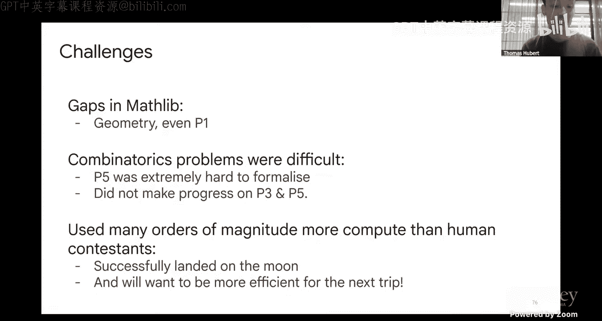

我认为，能够发现新知识的能力对于推进科学尤为重要，因为做科学的一个重要部分就是探索尚未被充分理解的领域，推进知识，你需要不断积累知识，持续生成和发现新的有趣证明。这是做科学的重要组成部分。

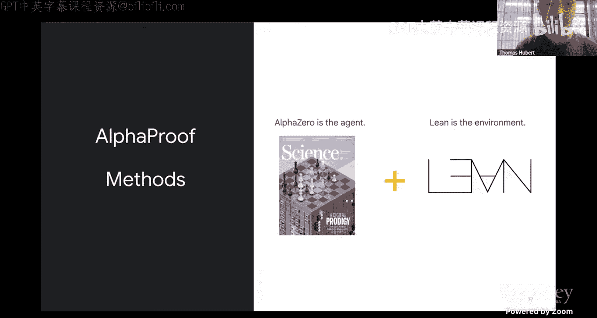

特别是在研究中，我认为这是展示你能发现新事物的绝佳方式。特别是现在随着大语言模型的巨大成功，也许一个更务实的观点是，能够从一个特定的知识库开始，然后你希望你的算法能够从那里继续发现新事物。所以你并不真的需要从零开始，你真正需要的是拥有这个能够发现新事物的算法，并且我们将证明你可以做到这一点。

通过这项研究和这些AlphaZero项目。让我举几个例子。AlphaGo Zero和AlphaZero，正如我所说，它们只是通过自我对弈来学习，完全从随机的空白状态开始。我们观察到的是，它们基本上重新发现了人类模式，可能在几天内积累了人类数千年的知识。但最终，其中一些模式被抛弃，转而支持人类甚至不知道的新发现。

在围棋中，我相信AlphaGo在开局阶段，比如第五步，就走出了人类从未下过的着法。如果我没记错的话，我听说马格努斯·卡尔森说过，因为他的教练非常擅长使用引擎，当这些引擎出现时，他能够使用AlphaGo引擎，这让他暂时对其他棋手有了巨大优势，因为这些东西的着法非常不同，人们不习惯，也不知道如何处理这种情况。

让我们看看国际象棋。实际上，如果你看右下角的图，它试图展示AlphaZero下某个特定模式（比如卡罗-康防御）的频率。你可以看到，它在训练两小时后发现了它，然后在大约四小时内相当一致地使用它，然后这种模式开始从AlphaZero的对局中消失，可能是因为它找到了更好的方法，使得这个模式不再那么有趣。而在底部，后翼弃兵的频率似乎随着训练时间的增加而增加。

好的，现在让我谈谈AlphaTensor。这项工作试图找到将两个矩阵相乘的最佳方法。也许你在学校学到的朴素算法需要N³次操作。当你试图将两个n×n矩阵相乘时，对于2×2矩阵，你需要8次乘法；对于4×4矩阵，你需要64次乘法。这是三次方的。

曾经有一个名叫施特拉森的人做出了重大发现，他发现对于2×2矩阵，实际上可以用7次乘法完成。他还证明了这是最优的，你无法做得更好。但一旦我们转向4×4矩阵，我们除了两次应用施特拉森算法外，就一无所知了。因此，仍然从64次乘法减少到49次。在AlphaTensor中，我们试图发现新的高效且可证明正确的算法，或者基本上看起来像矩阵乘法的任务。

它实际上做到了，在许多不同的尺寸上发现了新东西，发现了人类从未知晓的全新知识。因此，如果你只训练人类已知的知识，那么你永远无法发现这些算法。

作为这项工作的一个巨大额外收获，我们展示了AlphaZero可以处理巨大的动作空间。我在这里写了10³⁰，但基本上对于实际目的来说，这几乎是无限的。所有这些成功——围棋、国际象棋、张量分解——都是针对特定任务、特定级别的，但在底层，基本上是相同的AlphaZero算法在运行并做出这些发现。

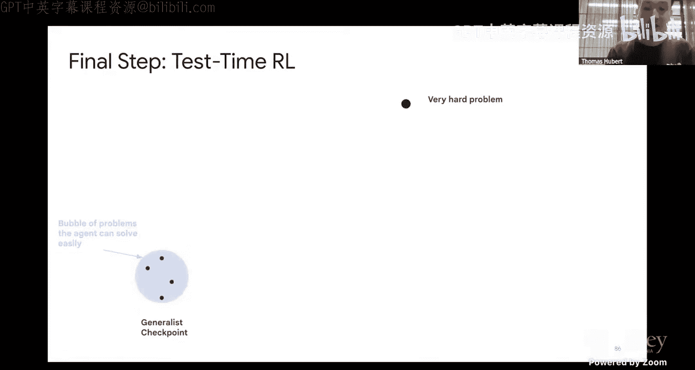

因此，我们思考的是：是否存在一个环境，能够捕捉到与科学相关的更广泛类别的任务？你猜对了，答案是：是的，那就是数学。

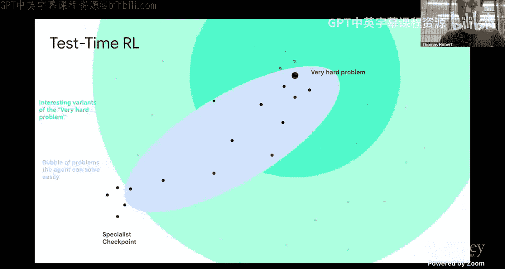

但在我们进入那里之前，我们从所有这些中学到的教训。是什么让这些系统成为超人类的？我列出了我认为最重要的属性。首先是规模化试错。基本上，要发现新知识，你需要尝试新事物，并能够根据收到的反馈进行学习。如果你的反馈没有根据，如果你自己发明反馈，那么我认为一旦你冒险进入未知领域，就很难了。因此，你真的需要一种方法来衡量你是否实现了目标，或者你在解决方案中处于什么位置。

其次，AlphaZero使用了大量搜索。我相信搜索可以真正加速新路径和技能的发现。因为大多数时候，当你采样一个不同的动作——不是概率最高的动作——如果你尝试那个动作，大多数时候会很糟糕，但有时会很好。你需要发现为什么那个动作可能是好的或不好的，因此你需要在你执行那个动作之后继续探索。

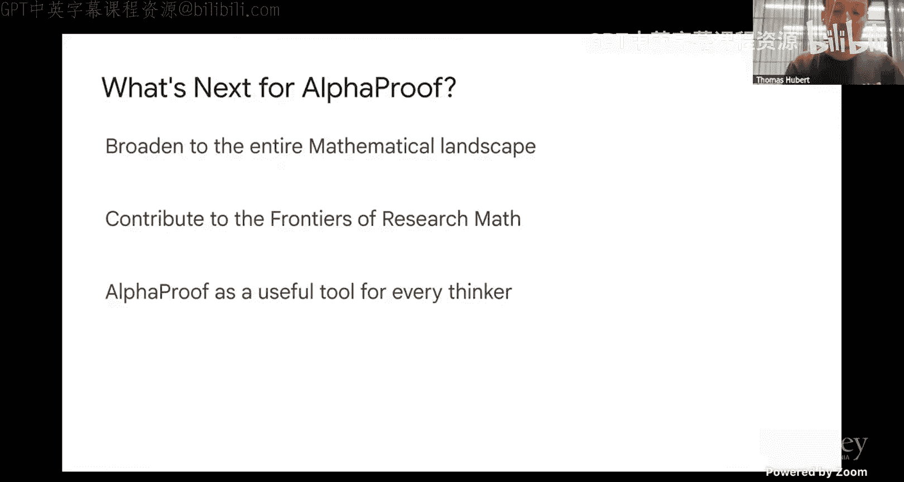

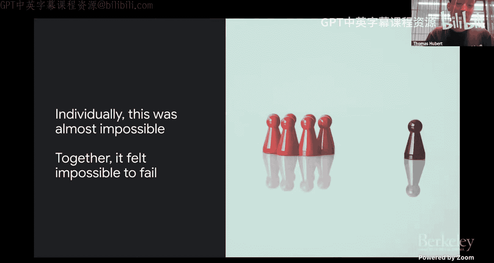

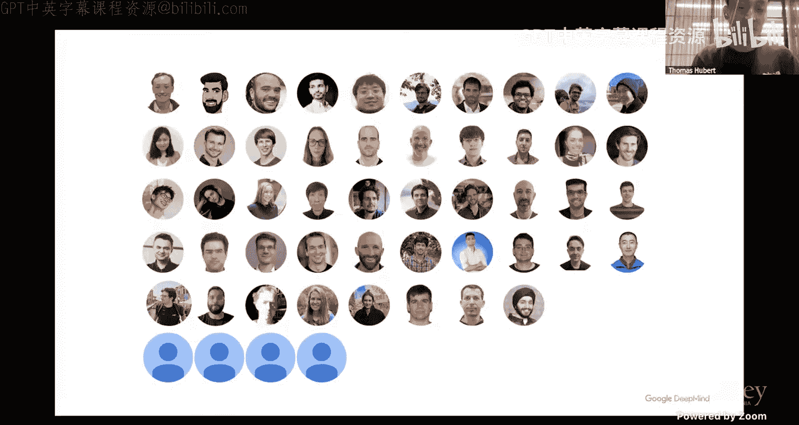

我认为，例如，AlphaGo的第37步就是一个很好的例子